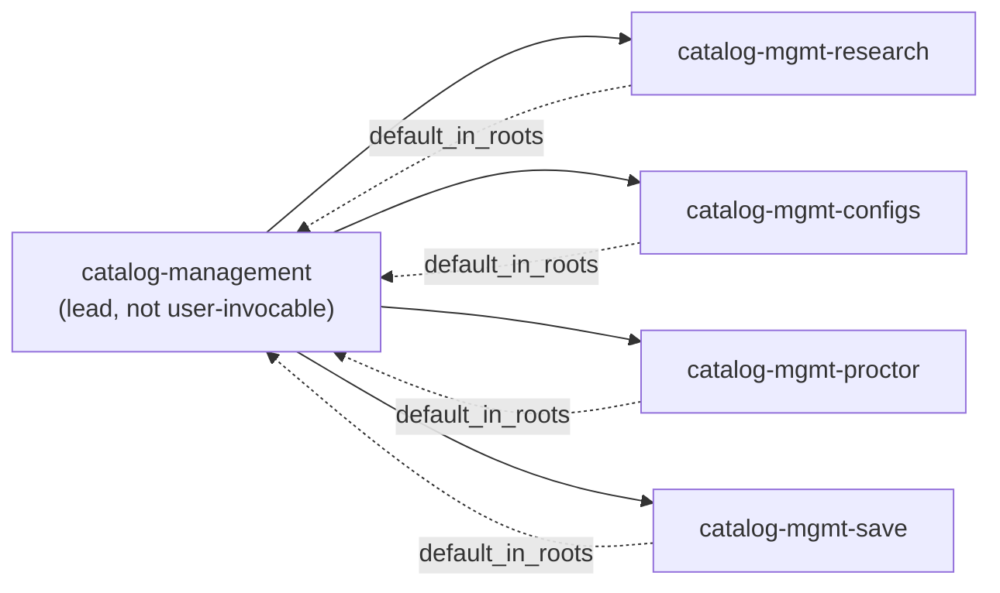
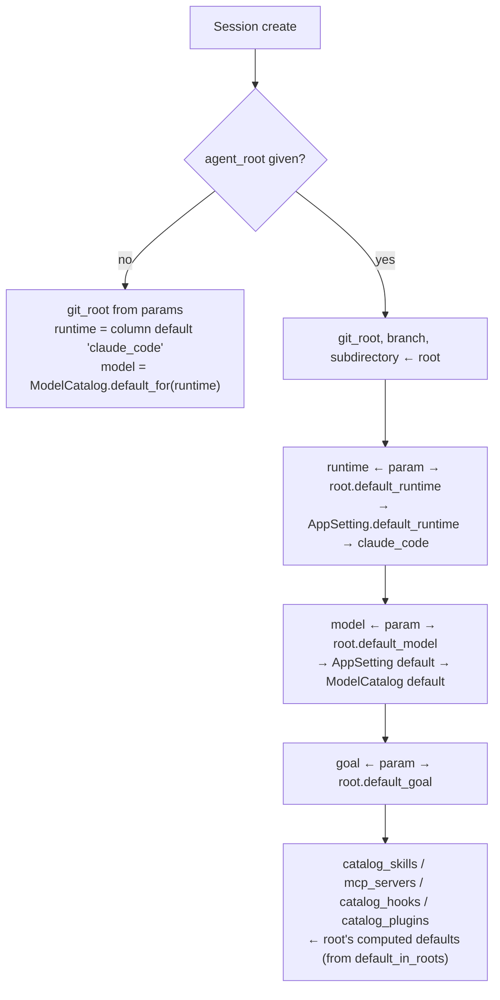

An **agent root** answers "what does this agent need to know before it starts?" It's a named bundle
of domain context: repo, branch, subdirectory, runtime, model, goal, and default artifacts.

## The shape of a root

From `roots.json`:

```json
"zimmer": {
  "name": "zimmer",
  "display_name": "Zimmer",
  "description": "The Zimmer orchestrator itself — self-hostable AI coding agent orchestration.",
  "url": "https://github.com/tadasant/zimmer.git",
  "default_branch": "main",
  "user_invocable": true,
  "default_goal": "open-reviewed-green-pr"
}
```

| Field | Meaning |
| --- | --- |
| `url` / `default_branch` | Which repo to clone, and from where |
| `subdirectory` | Scopes the agent to a subtree of the repo (monorepo case) |
| `user_invocable` | Whether it appears in the "new session" picker |
| `default_goal` | Seeds `session.goal` |
| `default_runtime` / `default_model` | Seeds the runtime and model |

The `default_skills`, `default_mcp_servers`, `default_hooks`, `default_plugins`, and
`default_subagent_roots` fields you'll see at runtime are not written in `roots.json` — AIR
computes them by [inverting `default_in_roots`](/air/overview/#default_in_roots--the-inversion) from
each artifact's own entry.

## The nine roots that ship

| Root | Invocable | Repo | Notes |
| --- | --- | --- | --- |
| `zimmer` | ✅ | `tadasant/zimmer` | Work on Zimmer itself. All 5 skills default here. |
| `general-agent` | ✅ | `tadasant/zimmer` | The catch-all. `AgentRootsConfig::DEFAULT_ROOT`. |
| `agent-orchestrator` | ✅ | `tadasant/zimmer-catalog` | Scoped to `agents/agent-orchestrator` |
| `agents` | ✅ | `tadasant/zimmer-catalog` | Scoped to `agents` — the catalog artifacts |
| `catalog-management` | ❌ | `tadasant/zimmer-catalog` | Lead root; fans out to the four below |
| `catalog-mgmt-research` | ❌ | ↳ subagent phase | `default_in_roots: [catalog-management]`, model `sonnet` |
| `catalog-mgmt-configs` | ❌ | ↳ subagent phase | same |
| `catalog-mgmt-proctor` | ❌ | ↳ subagent phase | same |
| `catalog-mgmt-save` | ❌ | ↳ subagent phase | same |

:::caution[Several roots point at a repo that isn't this one]
Five roots (`agent-orchestrator`, `agents`, `catalog-management`, and the four `catalog-mgmt-*`
phases) have `"url": "https://github.com/tadasant/zimmer-catalog.git"` — a separate repository
that is not part of this project and whose contents this documentation cannot verify.

This is a leftover from the monorepo split. `roots.json` also gives `agent-orchestrator` the
`display_name` "Zimmer" (the *same* display name as the `zimmer` root), so the two are
indistinguishable in a picker. That looks like a bug.
:::

## Subagent roots

A root whose `default_in_roots` names *another root* becomes a **subagent root** of it. AIR computes
`default_subagent_roots` on the parent, and the lead root's agent can then spawn sessions against
those phases.

This is how `catalog-management` decomposes into research → configs → proctor → save. A root never
becomes its own subagent, even via the `"*"` wildcard.



## How a root seeds a session

At session creation (`Session#create_from_agent_root!`), the root supplies defaults that the caller
can override:



Once seeded, the session owns its own lists. The UI's PATCH endpoints mutate them directly, and
`air prepare` is called with `--without-defaults` so AIR won't re-add anything the user removed.

:::caution[The runtime/model fallback chain only works if you pass an `agent_root`]
`docs/REST_API.md` claimed the fallback was: agent root's default → the global Settings default →
`claude_code`. That's only true in the `agent_root` branch.

With no `agent_root` param, `Api::V1::SessionsController#create` returns early from
`resolve_agent_root_defaults!` and the runtime is the database column default (`claude_code`).
The Settings-page default is never consulted. Same for the model: it goes straight to
`ModelCatalog.default_for(runtime)`, skipping `AppSetting.resolved_default_model_for` entirely.

So if you set a global default runtime of `codex` in Settings and then create a session via the API
without an `agent_root`, you get Claude Code.
:::

## Changing roots

Roots live in `roots.json` at the repo root and are resolved through AIR like every other artifact.
Adding one is a PR. Zimmer's own `zimmer-change-ai-artifact` skill is the guide, and the invariant it
enforces is the one that matters:
[no dangling references](/air/zimmer-integration/#a-dangling-reference-is-treated-as-a-failed-resolve).
