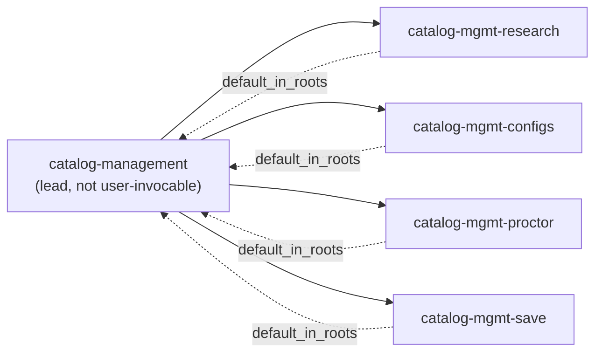
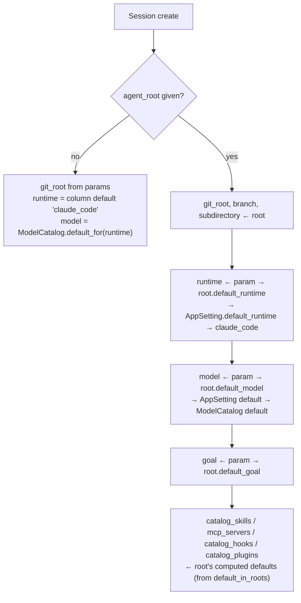

An **agent root** answers "what does this agent need to know before it starts?" It's a named bundle
of domain context: repo, branch, subdirectory, runtime, model, goal, and default artifacts.

## The shape of a root

From `roots.json`:

```json
"zimmer": {
  "name": "zimmer",
  "display_name": "Zimmer",
  "description": "The Zimmer orchestrator itself — self-hostable AI coding agent orchestration.",
  "url": "https://github.com/tadasant/zimmer.git",
  "default_branch": "main",
  "user_invocable": true,
  "default_goal": "open-reviewed-green-pr"
}
```

| Field | Meaning |
| --- | --- |
| `url` / `default_branch` | Which repo to clone, and from where |
| `subdirectory` | Scopes the agent to a subtree of the repo (monorepo case) |
| `user_invocable` | Whether it appears in the "new session" picker |
| `default_goal` | Seeds `session.goal` |
| `default_runtime` / `default_model` | Seeds the runtime and model |

The `default_skills`, `default_mcp_servers`, `default_hooks`, `default_plugins`, and
`default_subagent_roots` fields you'll see at runtime are not written in `roots.json` — AIR
computes them by [inverting `default_in_roots`](/air/overview/#default_in_roots--the-inversion) from
each artifact's own entry.

### A list you pass replaces the root's defaults

On the two surfaces that resolve a root's defaults — the MCP `start_session` tool and `POST
/api/v1/sessions` — `mcp_servers`/`skills`/`plugins`/`hooks` has three distinct states, not two:

| What the caller sends | What the session gets |
| --- | --- |
| the parameter **omitted** | the root's defaults, in full |
| an explicit **`[]`** | none of that artifact |
| a **non-empty list** | exactly that list — every default not named is dropped |

Omitted and `[]` are two different requests and Zimmer keeps them apart. A non-empty list is a
*replacement*, never a union: a caller that names one server on a root declaring two gets one, and
nothing warns it about the other. (The new-session form is the third surface that distinguishes an
explicit `[]` from an accident, but it never reaches the "omitted" row: its multi-selects always
submit a key, so what a human sees on screen is what the session gets.)

This matters most for MCP servers, and it cuts both ways. A root's defaults can carry real privilege
(SSH access to a production host, a secrets store), so a caller that narrows to `[]` is asking for
least privilege and silently handing it the full default set instead is the failure mode this
distinction exists to prevent. But a root's default *skill* can also depend on a root's default
*server*, and dropping the server still loads the skill — the session then fails at the point of
use, mid-task, with no workaround. A caller narrowing the list has to start from the root's
`default_mcp_servers` and subtract from it, rather than composing a fresh list from what the task
appears to need.

An empty `mcp_servers` column is otherwise ambiguous: it is also where a session lands when the
catalog resolve was incomplete at create time, which `McpServerBackfill` heals by restoring the
root's current defaults. Zimmer therefore records a deliberate "none" on the session
(`metadata.mcp_servers_explicitly_empty`), and the heal skips those sessions — so an explicit `[]`
survives to job start rather than being restored when the runtime config is regenerated. Every path
that lets someone name the list sets it, including the mid-life ones (`change_mcp_servers`, `PATCH
/api/v1/sessions/:id/mcp_servers`, and the session page's editor).

Two things are deliberately outside that rule:

- **`Session.create_from_agent_root!`** (the dashboard quick prompt, the chat bubble, and
  [triggers](/sessions/triggers/)) treats `nil` and `[]` alike as "take the defaults". A `Trigger`'s
  `mcp_servers` column is `default: [], null: false`, so `[]` there is an untouched trigger rather
  than a request for none — reading it as "no servers" would strip every existing trigger's servers.
- **Injected servers** (the self-session server, and the subagent-spawning server for roots that
  declare `default_subagent_roots`) are added by `SelfSessionInjector`, not by this resolution. A
  session spawned with `mcp_servers: []` still receives them, by design.

## The twelve roots that ship

| Root | Invocable | Repo | Notes |
| --- | --- | --- | --- |
| `zimmer` | ✅ | `tadasant/zimmer` | Work on Zimmer itself. Every skill but `awaken-waiting-sessions` defaults here. |
| `zimmer-orchestrator` | ❌ | `tadasant/zimmer` | The baseline router. `AgentRootsConfig.router_root_name`; every quick-router / chat-bubble submission and every work-backlog start is created against it. Ships with no default artifacts — it cannot yet dispatch downstream sessions ([why](/limitations/#the-baseline-orchestrator-root-cant-spawn-downstream-sessions-out-of-the-box)). |
| `zimmer-router` | ❌ | `tadasant/zimmer` | Deprecated alias of `zimmer-orchestrator`, kept so sessions created before the rename still resolve their root ([how](#the-router-roots-two-names)). Nothing new is created against it. |
| `general-agent` | ✅ | `tadasant/zimmer` | The catch-all. `AgentRootsConfig::DEFAULT_ROOT`. |
| `fleet-maintenance` | ❌ | `tadasant/zimmer` | The deployment's own scheduler. The `quota_available` trigger dispatches it; it runs `awaken-waiting-sessions` and starts parked spot work in precedence order. Defaults to the `zimmer-fleet` server, which is the only thing that gives it the tools that skill calls. |
| `agent-orchestrator` | ✅ | `tadasant/zimmer-catalog` | Scoped to `agents/agent-orchestrator` |
| `agents` | ✅ | `tadasant/zimmer-catalog` | Scoped to `agents` — the catalog artifacts |
| `catalog-management` | ❌ | `tadasant/zimmer-catalog` | Lead root; fans out to the four below |
| `catalog-mgmt-research` | ❌ | ↳ subagent phase | `default_in_roots: [catalog-management]`, model `sonnet` |
| `catalog-mgmt-configs` | ❌ | ↳ subagent phase | same |
| `catalog-mgmt-proctor` | ❌ | ↳ subagent phase | same |
| `catalog-mgmt-save` | ❌ | ↳ subagent phase | same |

:::danger[Seven roots point at a repository that does not exist]
`agent-orchestrator`, `agents`, `catalog-management`, and the four `catalog-mgmt-*` phases all
have `"url": "https://github.com/tadasant/zimmer-catalog.git"`. **That repository does not
exist** (`gh repo view` 404s). Selecting any of them can only ever fail at
`GitCloneService.create_clone`.

They are a leftover from the monorepo split. Fixing them is not a matter of repointing the URL:
`AgentRootsConfig#find_for_session` resolves a root *backwards* from `(url, subdirectory)`, so
giving them all the same real URL with no subdirectory would make eight roots
indistinguishable — and `Trigger#heal_stale_agent_root!` and `Session#resolved_agent_root` would
then silently resolve every one of them to `zimmer`. They need to be **removed** (with their
tests and the two plugins whose `default_in_roots` names `agent-orchestrator`), or given genuinely
distinct locations. That is its own change.

`roots.json` also gives `agent-orchestrator` the `display_name` "Zimmer" — the *same* display name
as the `zimmer` root — so the two are already indistinguishable in a picker.

**The roots that actually work today:** `zimmer`, `zimmer-orchestrator` (the quick-router target)
and its `zimmer-router` alias, and `general-agent` (the default).
Tracked in [#67](https://github.com/tadasant/zimmer/issues/67).
:::

## The router root's two names

`zimmer-router` was renamed to `zimmer-orchestrator`. The rename is **additive**: both names are in
`roots.json`, the old one described as a deprecated alias, and no session row was rewritten. A
session created before the rename still carries `zimmer-router` in `metadata["agent_root_key"]`, and
unarchiving it resolves that name against the current catalog — which is exactly why the alias
stays.

The app does not hardcode either name. `AgentRootsConfig::ROUTER_ROOT_NAMES` lists them
most-preferred first and `AgentRootsConfig.router_root_name` returns the first one the resolved
catalog actually carries:

```ruby
ROUTER_ROOT_NAMES = %w[zimmer-orchestrator zimmer-router].freeze

def router_root_name
  entries = AirCatalogService.entries_for(:roots)
  ROUTER_ROOT_NAMES.find { |name| entries.key?(name) } || ROUTER_ROOT_NAMES.first
end
```

Resolving rather than naming is what makes the rename safe to land. Zimmer's own catalog lives in
this repo, but a deployment can point `air.json` at another one — and that catalog is a separate
repo on its own merge schedule. Naming only `zimmer-orchestrator` would break every routable
message for as long as the deployed catalog still had only `zimmer-router`, including when
`AirCatalogService` is [serving a last-known-good snapshot](/air/zimmer-integration/#three-cache-layers) resolved before the
rename. Falling back covers that window in both directions.

It sits on a hot path — every chat-bubble and quick-prompt submission — so it stays cheap: at most
two `Hash#key?` calls against the entry tree `AirCatalogService` has already parsed and caches for
60 seconds. Nothing is memoized on top of that, deliberately, so a catalog that gains
`zimmer-orchestrator` cuts over within one TTL rather than at the next restart.

A restricted MCP connection is granted the root under **either** name
(`Mcp::Tool#enforce_any_allowed_root!`). `allowed_agent_roots` is baked into a session's
`.mcp.json` when it spawns, so a session started before the rename is still carrying the old name
on disk; both names denote the same root, so granting one grants the other.

## Subagent roots

A root whose `default_in_roots` names *another root* becomes a **subagent root** of it. AIR computes
`default_subagent_roots` on the parent, and the lead root's agent can then spawn sessions against
those phases.

This is how `catalog-management` decomposes into research → configs → proctor → save. A root never
becomes its own subagent, even via the `"*"` wildcard.


```mermaid
flowchart LR
    CM["catalog-management<br/>(lead, not user-invocable)"]
    R["catalog-mgmt-research"]
    C["catalog-mgmt-configs"]
    P["catalog-mgmt-proctor"]
    S["catalog-mgmt-save"]
    CM --> R
    CM --> C
    CM --> P
    CM --> S
    R -.->|"default_in_roots"| CM
    C -.->|"default_in_roots"| CM
    P -.->|"default_in_roots"| CM
    S -.->|"default_in_roots"| CM
```

## How a root seeds a session

At session creation (`Session#create_from_agent_root!`), the root supplies defaults that the caller
can override:


```mermaid
flowchart TD
    C["Session create"] --> R{"agent_root given?"}
    R -->|no| D["git_root from params<br/>runtime = column default 'claude_code'<br/>model = ModelCatalog.default_for(runtime)"]
    R -->|yes| A["git_root, branch, subdirectory ← root"]
    A --> RT["runtime ← param → root.default_runtime<br/>→ AppSetting.default_runtime → claude_code"]
    RT --> M["model ← param → root.default_model<br/>→ AppSetting default → ModelCatalog default"]
    M --> G["goal ← param → root.default_goal"]
    G --> ART["catalog_skills / mcp_servers / catalog_hooks / catalog_plugins<br/>← root's computed defaults (from default_in_roots)"]
```

Once seeded, the session owns its own lists. The UI's PATCH endpoints mutate them directly, and
`air prepare` is called with `--without-defaults` so AIR won't re-add anything the user removed.

:::caution[The runtime/model fallback chain only works if you pass an `agent_root`]
`docs/REST_API.md` claimed the fallback was: agent root's default → the global Settings default →
`claude_code`. That's only true in the `agent_root` branch.

With no `agent_root` param, `Api::V1::SessionsController#create` returns early from
`resolve_agent_root_defaults!` and the runtime is the database column default (`claude_code`).
The Settings-page default is never consulted. Same for the model: it goes straight to
`ModelCatalog.default_for(runtime)`, skipping `AppSetting.resolved_default_model_for` entirely.

So if you set a global default runtime of `codex` in Settings and then create a session via the API
without an `agent_root`, you get Claude Code.
:::

## Changing roots

Roots live in `roots.json` at the repo root and are resolved through AIR like every other artifact.
Adding one is a PR. Zimmer's own `zimmer-change-ai-artifact` skill is the guide, and the invariant it
enforces is the one that matters:
[no dangling references](/air/zimmer-integration/#a-dangling-reference-is-treated-as-a-failed-resolve).
