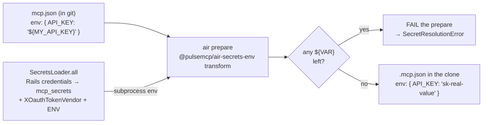

An MCP server is a tool provider the agent can call. The set of MCP servers on a session is the
session's blast radius — the complete list of things the agent can do outside its own clone.

## The entry format

MCP is the one artifact type with no separate body — the index entry *is* the connection config.
From `mcp.json`:

```json
"playwright-custom": {
  "title": "Playwright Custom",
  "description": "Playwright MCP server for browser automation and screenshots.",
  "type": "stdio",
  "command": "npx",
  "args": ["-y", "playwright-stealth-mcp-server@latest"],
  "env": { "STEALTH_MODE": "false", "HEADLESS": "true" },
  "default_in_roots": ["zimmer"]
}
```

| Field | Notes |
| --- | --- |
| `type` | `stdio` \| `sse` \| `streamable-http` (`http`) |
| `command` / `args` / `env` | stdio servers |
| `url` / `headers` | remote servers |
| `oauth` | remote servers that need an OAuth flow |
| `default_in_roots` | which roots get it by default |

`env` and `headers` values may contain `${VAR}` placeholders.

The formal schema is published by AIR at
[`pulsemcp.github.io/air/schemas/mcp.schema.json`](https://pulsemcp.github.io/air/schemas/mcp.schema.json)
— which is what `mcp.json`'s own `$schema` key points at. A snapshot is also served from this site at
[`/mcp.schema.json`](/mcp.schema.json).

:::note[The local schema copy is only a convenience snapshot]
The old `docs/mcp.schema.json` had a `$id` pointing at a path inside `tadasant/zimmer-catalog` that
no longer exists in this repo's layout, while `mcp.json` validates against AIR's published schema.
The local file is a convenience copy for offline validation.
:::

## Secrets never touch the catalog



The catalog carries the placeholder. The environment carries the value. The transform joins
them at prepare time, and AIR then validates that no `${VAR}` survived and fails if any did.

That validation is the good part: a typo'd secret name fails loudly at prepare, before the agent
ever gets a server that 401s on every call.

Zimmer's `SecretsLoader` resolves values in this order: `XOauthTokenVendor` (for X/Twitter tokens)
→ Rails encrypted credentials (`mcp_secrets`) → `ENV`.

## Selection is per session

A session's server list is seeded from the agent root's defaults and then owned by the session.
The UI and the API (`PATCH /api/v1/sessions/:id/mcp_servers`, max 50) mutate it directly, and `air
prepare` runs with `--without-defaults` so AIR won't re-add what you removed.

Beyond the ones you pick, a session also gets **auto-injected** servers — most notably the
self-session server (`SelfSessionInjector`), which is how an agent can archive itself, set its own
title, or schedule its own wake-up. `session_json` exposes three fields for this:
`mcp_servers` (what you chose), `injected_mcp_servers`, and `all_mcp_servers`.

The injected servers are Zimmer's own: streamable-HTTP entries pointing at this instance's native
`/mcp` endpoint (`zimmer-self-session`, and `zimmer` for roots with `default_subagent_roots`).
Zimmer synthesizes them rather than resolving them from the catalog, and retargets any `zimmer*`
entry at the instance preparing the session so a staging session never orchestrates production.

→ [Zimmer's MCP server](/extend/mcp-server/) for the tool surface, the scoped variants, and auth.

## Remote servers and OAuth

A remote server (`http` / `streamable-http` / `sse`) with no static `Authorization` header is assumed
to possibly need OAuth. Before spawn, `McpOauthCredentialInjector` checks each one; if any lacks a
valid credential, the session is parked in `failed` with `failure_reason: oauth_required`, and
the UI renders Authorize buttons.

→ [MCP server OAuth](/auth/mcp-oauth/) for the full flow.

## MCP connection status is inferred from logs

There is no protocol-level "did this server connect" signal that Zimmer consumes. Instead:

- **Claude**: `McpLogPollerService` scrapes the CLI's MCP log files.
- **Codex**: `CodexMcpStatusDetector` string-matches tool names against `codex-rs`'s
  `MCP_TOOL_NAME_DELIMITER = "__"`, and reimplements Codex's internal
  `sanitize_responses_api_tool_name` character rules in Ruby.

:::caution[Reimplementing another project's private internals]
That Codex detector is a Ruby port of a Rust function that is not a public API. If Codex changes its
tool-name sanitization, Zimmer's MCP status display silently goes wrong.

A related bug was fixed only recently: sessions whose root had no MCP servers of its own but which
got auto-injected ones would show "pending" forever in the UI even though the server was connected
and serving tools.

Tracked in [#63](https://github.com/tadasant/zimmer/issues/63).
:::

## Timeouts and caching

- `MCP_TIMEOUT = 180000` (3 minutes) — a flat startup timeout for **every** MCP server.
  Tracked in [#113](https://github.com/tadasant/zimmer/issues/113).
- `NPM_CONFIG_CACHE` is set to a clone-local `.npm-cache`, so `npx`-based servers don't fight over a
  shared cache.
- `NpxCacheHealService` exists to detect and delete a corrupted `_npx` cache — by matching npm's
  error text (`ENOTEMPTY`, `ERR_UNSUPPORTED_DIR_IMPORT`). An entire service that self-heals a
  filesystem bug by regexing stderr.
- `MCP_PACKAGE_REINSTALL` and `Dockerfile.base`'s `bin/preinstall-mcp-packages` pre-warm the npm and
  python packages listed in `mcp.json`, so a cold session doesn't pay the download.

## The fourteen that ship

`playwright-custom` (the only one default-on, for the `zimmer` root), `context7`, `linear`, and
eleven others. Read `mcp.json` for the current list — it changes more often than this page will.
