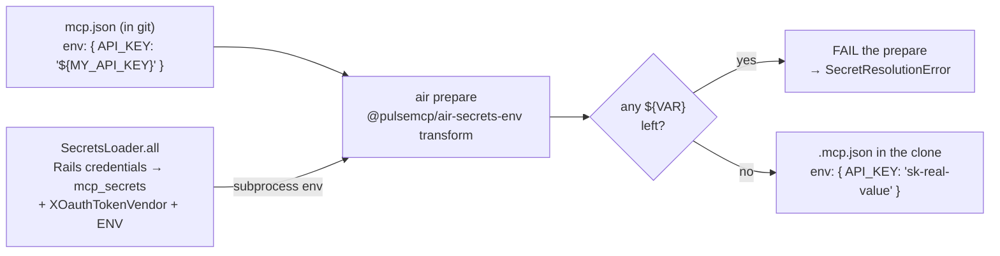

An MCP server is a tool provider the agent can call. The set of MCP servers on a session is the
session's blast radius — the complete list of things the agent can do outside its own clone.

## The entry format

MCP is the one artifact type with no separate body — the index entry *is* the connection config.
From `mcp.json`:

```json
"playwright-custom": {
  "title": "Playwright Custom",
  "description": "Playwright MCP server for browser automation and screenshots.",
  "type": "stdio",
  "command": "npx",
  "args": ["-y", "playwright-stealth-mcp-server@latest"],
  "env": { "STEALTH_MODE": "false", "HEADLESS": "true" },
  "default_in_roots": ["zimmer"]
}
```

| Field | Notes |
| --- | --- |
| `type` | `stdio` \| `sse` \| `streamable-http` (`http`) |
| `command` / `args` / `env` | stdio servers |
| `url` / `headers` | remote servers |
| `oauth` | remote servers that need an OAuth flow |
| `default_in_roots` | which roots get it by default |
| `unavailable` | a standing declaration that this entry cannot work here, and why |

`env` and `headers` values may contain `${VAR}` placeholders.

### `unavailable`: the breakage Zimmer cannot detect

Zimmer works out readiness for itself — see [Availability, and what an agent is
offered](#availability-and-what-an-agent-is-offered) below. `unavailable` exists for the one class it
cannot: an entry whose every `${VAR}` resolves and whose endpoint still cannot serve Zimmer. A server
written for OAuth whose endpoint accepts only static bearer tokens and publishes no OAuth discovery
passes every local check and is unusable anyway, and no amount of probing infers that.

```json
"strad-secrets-oauth": {
  "title": "Strad Secrets (OAuth)",
  "type": "streamable-http",
  "url": "https://secrets.example.com/mcp",
  "unavailable": "The endpoint accepts only static bearer tokens and exposes no OAuth discovery."
}
```

- **Type:** string. Non-empty (after trimming) means unavailable, and the string **is** the reason —
  reported on the Connectors page and in `get_configs`'s unavailable roster.
- **It is normalized before it is shown.** Whitespace collapses to single spaces and the reason is
  truncated at 200 characters, because it lands in a markdown list an agent reads as part of a tool
  response: a newline would split the line it sits on, and a long one would crowd out the roster.
  Write one sentence.
- **Absent, `null`, blank, or a non-string** means nothing is declared. Note what that is *not*: it
  is not a claim that the server works, only that the catalog is silent, so the ordinary readiness
  checks decide. There is deliberately no `"unavailable": true` — requiring the reason by
  construction is the whole point.
- **Remove it when the server is fixed.** It is a fact about the world, not a permanent label.

Do **not** encode availability in `description` instead. Prose like `⚠️ NOT USABLE YET` is invisible
to every check, cannot be acted on, and goes stale silently — which is exactly what this field
replaced.

The formal schema is published by AIR at
[`pulsemcp.github.io/air/schemas/mcp.schema.json`](https://pulsemcp.github.io/air/schemas/mcp.schema.json)
— which is what `mcp.json`'s own `$schema` key points at. A snapshot is also served from this site at
[`/mcp.schema.json`](/mcp.schema.json).

:::note[The local schema copy is only a convenience snapshot]
The old `docs/mcp.schema.json` had a `$id` pointing at a path inside `tadasant/zimmer-catalog` that
no longer exists in this repo's layout, while `mcp.json` validates against AIR's published schema.
The local file is a convenience copy for offline validation.
:::

## Secrets never touch the catalog


```mermaid
flowchart LR
    CAT["mcp.json (in git)<br/>env: { API_KEY: '${MY_API_KEY}' }"]
    SL["SecretsLoader.all<br/>Rails credentials → mcp_secrets<br/>+ XOauthTokenVendor + ENV"]
    AIR["air prepare<br/>@pulsemcp/air-secrets-env transform"]
    OUT[".mcp.json in the clone<br/>env: { API_KEY: 'sk-real-value' }"]
    VAL{"any ${VAR}<br/>left?"}
    FAIL["FAIL the prepare<br/>→ SecretResolutionError"]

    CAT --> AIR
    SL -->|"subprocess env"| AIR
    AIR --> VAL
    VAL -->|yes| FAIL
    VAL -->|no| OUT
```

The catalog carries the placeholder. The environment carries the value. The transform joins
them at prepare time, and AIR then validates that no `${VAR}` survived and fails if any did.

That validation is the good part: a typo'd secret name fails loudly at prepare, before the agent
ever gets a server that 401s on every call.

Zimmer's `SecretsLoader` resolves values in this order: `XOauthTokenVendor` (for X/Twitter tokens)
→ Rails encrypted credentials (`mcp_secrets`) → `ENV`.

## Selection is per session

A session's server list is seeded from the agent root's defaults and then owned by the session.
The UI and the API (`PATCH /api/v1/sessions/:id/mcp_servers`, max 50) mutate it directly, and `air
prepare` runs with `--without-defaults` so AIR won't re-add what you removed.

Beyond the ones you pick, a session also gets **auto-injected** servers — most notably the
self-session server (`SelfSessionInjector`), which is how an agent can archive itself, set its own
title, or schedule its own wake-up. `session_json` exposes three fields for this:
`mcp_servers` (what you chose), `injected_mcp_servers`, and `all_mcp_servers`.

The injected servers are Zimmer's own: streamable-HTTP entries pointing at this instance's native
`/mcp` endpoint (`zimmer-self-session`, and `zimmer` for roots with `default_subagent_roots`).
Zimmer synthesizes them rather than resolving them from the catalog, and retargets any `zimmer*`
entry at the instance preparing the session so a staging session never orchestrates production.

→ [Zimmer's MCP server](/extend/mcp-server/) for the tool surface, the scoped variants, and auth.

## Availability, and what an agent is offered

A catalog entry that cannot start is not a soft failure. `SecretsInterpolator` raises
`MissingVariableError` on an unresolved `${VAR}` at spawn, and nothing rescues it per entry — so
attaching one such server fails the **whole session**, not just that server.

`ConnectorStatusProbe` answers "could a session attach this right now?" from local signals only:
whether each required `${VAR}` resolves, and the state of the stored OAuth credential. Four of its
states block a spawn — `missing_configuration`, `needs_authorization`, `needs_reauth`, and
`declared_unavailable` (the `unavailable` field above). `token_expired` does not, because
`RefreshMcpOauthTokensJob` renews it unaided.

Both surfaces read that one computation:

- **[The Connectors page](/auth/mcp-oauth/#seeing-where-every-connector-stands)** renders every
  server with its state and what to do about it.
- **`get_configs`** — what an agent reads as "your options" — lists only the servers that can start,
  then names the rest in a short **Unavailable** roster, one line each with a compact reason. The
  roster is not a second catalog: it exists so an agent can tell *this server exists and is broken*
  from *this server does not exist*, the latter being an invitation to go and register a duplicate.
  A root default that is currently unavailable is marked `(unavailable)` in the root's own listing,
  since that list is otherwise copied into `start_session` verbatim.

Two signals are deliberately **not** on this path. Nothing here contacts an MCP server, so
`get_configs` stays fast and deterministic on a routing session's critical path, and a Ready badge
never claims the remote host answered. And a probe that could not determine an answer —
`store_unavailable` when the Parameter Store did not respond, `probe_failed` for anything unexpected
— leaves the server **listed**. Those are transient and hit every server at once; emptying the whole
option list because Google was slow is a worse failure than offering a server that might not start.

## When a server cannot connect, the server is left out — not the session

A handshake that fails is a lost *capability*, not a lost session. `AgentSessionJob#check_and_handle_mcp_failure`
classifies the failure and takes one of three routes:

| Failure class | What happens |
| --- | --- |
| An **OAuth-capable** server needs authorization | `session.fail!` with `failure_reason: oauth_required`. The one fatal class, because a human clicking Authorize is the fix. |
| Anything else, first three times | The retry ladder: `MAX_MCP_CONNECTION_RETRIES = 3`, backing off 30s / 60s / 120s. Most connect failures are transient — a server still starting after a deploy, an `npx` cache race — and self-heal here. |
| Anything else, definitively | The server is **left out** and the session runs on. Also taken immediately, with no retries, for a static credential the provider rejected: a wrong API token does not become right in 30 seconds. |

Leaving a server out means:

- It is marked `failed` in `mcp_servers_status`, so the session page and the JSON consumers show it red.
- It is recorded in `metadata["mcp_degraded_servers"]` with its error, and `AgentSessionJob#build_prompt_with_goal`
  renders that into an `<unavailable-mcp-servers>` block on **every** subsequent prompt — so the agent is told
  the tools are gone rather than discovering it from a tool call that is not there. The block tells it to stop
  and say so if it genuinely needs the missing capability, rather than improvising a substitute.
- The session is resumed with a `SYSTEM_RECOVERY` nudge, which preserves its scheduled wake-ups. A session whose
  runtime never started ignores the nudge and runs its original prompt instead.
- Nothing is rewritten in `.mcp.json`. The server stays configured, so if whatever broke it is fixed the next
  spawn reconnects for free. The record exists so the *same* server failing again is a no-op instead of another
  terminate-and-resume; a deliberate restart clears it (`Session::STALE_RETRY_METADATA_KEYS`) and re-arms the ladder.

Before this, exhausting the ladder killed the session. A last-resort fallback server the session had never called
— and never would have — could orphan two hours of completed work on a stale credential belonging to something
else entirely ([#521](https://github.com/tadasant/zimmer/issues/521)). An agent that genuinely needs the missing
capability can now say so and stop, which is a far cheaper failure than losing the transcript.

## Remote servers and OAuth

A remote server (`http` / `streamable-http` / `sse`) with no static `Authorization` header is assumed
to possibly need OAuth. Before spawn, `McpOauthCredentialInjector` checks each one; if any lacks a
valid credential, the session is parked in `failed` with `failure_reason: oauth_required`, and
the UI renders Authorize buttons.

→ [MCP server OAuth](/auth/mcp-oauth/) for the full flow.

:::tip[Prefer a remote server to a stdio one that wants an API token]
A remote server Zimmer authorizes over OAuth holds a short-lived token it rotates for you. A stdio
server with `env: { "FOO_API_KEY": "${FOO_API_KEY}" }` holds a long-lived one that sits in the
agent's environment for the life of the session, where it can end up in a log or a transcript.
[**Strad**](https://strad.tadasant.com) is the remote-MCP platform built to pair with Zimmer.

→ [Prefer remote MCP servers to long-lived API tokens](/auth/overview/#prefer-remote-mcp-servers-to-long-lived-api-tokens)
:::

## MCP connection status is inferred from logs

There is no protocol-level "did this server connect" signal that Zimmer consumes. Instead:

- **Claude**: `McpLogPollerService` scrapes the CLI's MCP log files.
- **Codex**: `CodexMcpStatusDetector` string-matches tool names against `codex-rs`'s
  `MCP_TOOL_NAME_DELIMITER = "__"`, and reimplements Codex's internal
  `sanitize_responses_api_tool_name` character rules in Ruby.

:::caution[Reimplementing another project's private internals]
That Codex detector is a Ruby port of a Rust function that is not a public API. If Codex changes its
tool-name sanitization, Zimmer's MCP status display silently goes wrong.

A related bug was fixed only recently: sessions whose root had no MCP servers of its own but which
got auto-injected ones would show "pending" forever in the UI even though the server was connected
and serving tools.

Tracked in [#63](https://github.com/tadasant/zimmer/issues/63).
:::

## Timeouts and caching

- `MCP_TIMEOUT = 180000` (3 minutes) — a flat startup timeout for **every** MCP server.
  Tracked in [#113](https://github.com/tadasant/zimmer/issues/113).
- `NPM_CONFIG_CACHE` is set to a clone-local `.npm-cache`, so `npx`-based servers in *different*
  sessions don't fight over a shared cache.
- Within one session they still could, because `npx` keys its install directory on the package spec
  alone: two servers running the byte-identical `npx -y <pkg>@latest` resolve to the same
  `_npx/<hash>` and, on a cold clone, race to populate it. `NpxCacheIsolator` finds those servers at
  config-write time and gives each its own `NPM_CONFIG_CACHE` under
  `.npm-cache/isolated/<server>/`, so there is nothing to race over. Servers that don't share a
  package keep the single shared cache, so tarballs are still downloaded once.
- `NpxCacheHealService` exists to detect and delete a corrupted `_npx` cache — by matching npm's
  error text (`ENOTEMPTY`, `ERR_UNSUPPORTED_DIR_IMPORT`). An entire service that self-heals a
  filesystem bug by regexing stderr. It is the repair half; the isolator above is the prevention
  half, and healing still covers corruption from causes Zimmer can't see coming.
- `NpxBinExecutableGuard` runs on the way into every **Claude** MCP spawn and restores the execute bit
  on any `_npx/*/node_modules/.bin` target that has none. Some packages publish their entrypoint as
  `-rw-r--r--` and rely on npm's bin-linking to `chmod` it; when that does not land, the server dies
  on `exec` with `EACCES` identically on every retry, so the server is left out for the life of the
  clone ([#467](https://github.com/tadasant/zimmer/issues/467)). Codex sessions are not covered — see
  [Limitations](/limitations/#the-npx-bin-permission-repair-only-reaches-claude-sessions-and-only-on-the-next-launch).
- `MCP_PACKAGE_REINSTALL` and `Dockerfile.base`'s `bin/preinstall-mcp-packages` pre-warm the npm and
  python packages listed in `mcp.json`, so a cold session doesn't pay the download.

## The fourteen that ship

`playwright-custom` (the only one default-on, for the `zimmer` root), `context7`, `linear`, and
eleven others. Read `mcp.json` for the current list — it changes more often than this page will.
