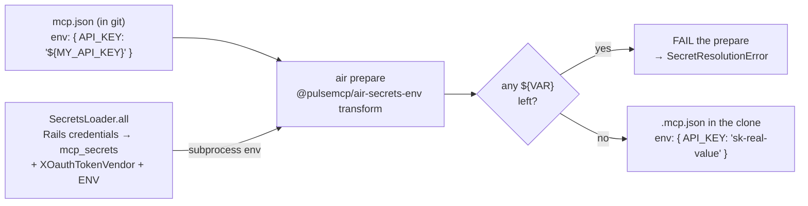

An MCP server is a tool provider the agent can call. The set of MCP servers on a session is the
session's blast radius — the complete list of things the agent can do outside its own clone.

## The entry format

MCP is the one artifact type with no separate body — the index entry *is* the connection config.
From `mcp.json`:

```json
"playwright-custom": {
  "title": "Playwright Custom",
  "description": "Playwright MCP server for browser automation and screenshots.",
  "type": "stdio",
  "command": "npx",
  "args": ["-y", "playwright-stealth-mcp-server@latest"],
  "env": { "STEALTH_MODE": "false", "HEADLESS": "true" },
  "default_in_roots": ["zimmer"]
}
```

| Field | Notes |
| --- | --- |
| `type` | `stdio` \| `sse` \| `streamable-http` (`http`) |
| `command` / `args` / `env` | stdio servers |
| `url` / `headers` | remote servers |
| `oauth` | remote servers that need an OAuth flow |
| `default_in_roots` | which roots get it by default |
| `unavailable` | a standing declaration that this entry cannot work here, and why |
| `startup_timeout_sec` | how long a runtime should wait for *this* server to start |

`env` and `headers` values may contain `${VAR}` placeholders.

### `unavailable`: the breakage Zimmer cannot detect

Zimmer works out readiness for itself — see [Availability, and what an agent is
offered](#availability-and-what-an-agent-is-offered) below. `unavailable` exists for the one class it
cannot: an entry whose every `${VAR}` resolves and whose endpoint still cannot serve Zimmer. A server
written for OAuth whose endpoint accepts only static bearer tokens and publishes no OAuth discovery
passes every local check and is unusable anyway, and no amount of probing infers that.

```json
"strad-secrets-oauth": {
  "title": "Strad Secrets (OAuth)",
  "type": "streamable-http",
  "url": "https://secrets.example.com/mcp",
  "unavailable": "The endpoint accepts only static bearer tokens and exposes no OAuth discovery."
}
```

- **Type:** string. Non-empty (after trimming) means unavailable, and the string **is** the reason —
  reported on the Connectors page and in `get_configs`'s unavailable roster.
- **It is normalized before it is shown.** Whitespace collapses to single spaces and the reason is
  truncated at 200 characters, because it lands in a markdown list an agent reads as part of a tool
  response: a newline would split the line it sits on, and a long one would crowd out the roster.
  Write one sentence.
- **Absent, `null`, blank, or a non-string** means nothing is declared. Note what that is *not*: it
  is not a claim that the server works, only that the catalog is silent, so the ordinary readiness
  checks decide. There is deliberately no `"unavailable": true` — requiring the reason by
  construction is the whole point.
- **Remove it when the server is fixed.** It is a fact about the world, not a permanent label.

Do **not** encode availability in `description` instead. Prose like `⚠️ NOT USABLE YET` is invisible
to every check, cannot be acted on, and goes stale silently — which is exactly what this field
replaced.

### `startup_timeout_sec`: how long this server gets to start

Every MCP server gets [three minutes](#timeouts-and-caching) to start and answer `initialize`. That
one number is simultaneously too generous and too strict: a fast local server that hangs holds a
session for three minutes before anything says so, while a big `npx` cold start or a remote server
doing OAuth may need more. An entry can name its own budget instead
([#113](https://github.com/tadasant/zimmer/issues/113)).

```json
"acme-fast": {
  "type": "stdio",
  "command": "node",
  "args": ["/opt/acme/server.js"],
  "startup_timeout_sec": 20
}
```

- **Type:** integer seconds, between 5 and 600 inclusive. The bounds are Claude Code's own
  `startupTimeoutSec` bounds, reused rather than invented. A value outside them, a string (`"20"`),
  or a fraction is **ignored** and warned about in the application log, and the server falls back to
  the default.
- **Absent** means the default, which is what every entry in the catalog means today: nothing
  declares one yet. Declaring actual values is the catalog's own follow-up, not Zimmer's.
- **Check what took effect without a shell.** `startup_timeout_sec` is carried on every server in
  `GET /api/v1/mcp_servers` and `GET /api/v1/configs` — the value Zimmer read, so an entry whose
  number was refused reports `null` there rather than the number the catalog wrote.
- **A longer budget reaches all three runtimes; a shorter one reaches Codex alone.** Codex writes it
  into that server's `[mcp_servers.*]` table, where `startup_timeout_sec` is startup-scoped and the
  tool budget is a separate `tool_timeout_sec` — so a fast server fails fast beside a slow one.
  **Pi only ever lengthens**: its one key, `requestTimeoutMs`, is the budget for every request on
  the connection, so honoring a declared 15 there would cap that server's *tool calls* at 15 seconds
  rather than making its startup fail fast, and a declared value below the default is left on the
  floor. **Claude cannot shorten one server's at all**: `MCP_TIMEOUT` is a property of the agent
  process, so Zimmer hands it the **largest** budget any of the session's servers asks for, never
  less than the default. See [Timeouts and caching](#timeouts-and-caching).
- **Default only.** A timeout a repo already wrote into its own checked-in `.codex/config.toml` or
  `.mcp.json` wins over the catalog's, the same way every other local value does. So does one Zimmer
  itself wrote on an earlier prepare — a clone keeps the budget it was prepared with, and picks up a
  newly declared one when its config is regenerated rather than in place.
- **It reaches a runtime only because Zimmer writes it.** AIR validates the entry (its server
  schema sets no `additionalProperties: false`) and `air resolve` returns the field verbatim, but
  neither the Claude nor the Codex adapter copies it into a runtime config — both translate a fixed
  field list. The field is Zimmer's to read, exactly like `unavailable`.

The formal schema is published by AIR at
[`pulsemcp.github.io/air/schemas/mcp.schema.json`](https://pulsemcp.github.io/air/schemas/mcp.schema.json)
— which is what `mcp.json`'s own `$schema` key points at. A snapshot is also served from this site at
[`/mcp.schema.json`](/mcp.schema.json).

:::note[The local schema copy is only a convenience snapshot]
The old `docs/mcp.schema.json` had a `$id` pointing at a path inside `tadasant/zimmer-catalog` that
no longer exists in this repo's layout, while `mcp.json` validates against AIR's published schema.
The local file is a convenience copy for offline validation.
:::

## Secrets never touch the catalog


```mermaid
flowchart LR
    CAT["mcp.json (in git)<br/>env: { API_KEY: '${MY_API_KEY}' }"]
    SL["SecretsLoader.all<br/>Rails credentials → mcp_secrets<br/>+ XOauthTokenVendor + ENV"]
    AIR["air prepare<br/>@pulsemcp/air-secrets-env transform"]
    OUT[".mcp.json in the clone<br/>env: { API_KEY: 'sk-real-value' }"]
    VAL{"any ${VAR}<br/>left?"}
    FAIL["FAIL the prepare<br/>→ SecretResolutionError"]

    CAT --> AIR
    SL -->|"subprocess env"| AIR
    AIR --> VAL
    VAL -->|yes| FAIL
    VAL -->|no| OUT
```

The catalog carries the placeholder. The environment carries the value. The transform joins
them at prepare time, and AIR then validates that no `${VAR}` survived and fails if any did.

That validation is the good part: a typo'd secret name fails loudly at prepare, before the agent
ever gets a server that 401s on every call.

Zimmer's `SecretsLoader` resolves values in this order: `XOauthTokenVendor` (for X/Twitter tokens)
→ Rails encrypted credentials (`mcp_secrets`) → `ENV`.

## Selection is per session

A session's server list is seeded from the agent root's defaults and then owned by the session.
The UI and the API (`PATCH /api/v1/sessions/:id/mcp_servers`, max 50) mutate it directly, and `air
prepare` runs with `--without-defaults` so AIR won't re-add what you removed.

Beyond the ones you pick, a session also gets **auto-injected** servers — most notably the
self-session server (`SelfSessionInjector`), which is how an agent can archive itself, set its own
title, or schedule its own wake-up. `session_json` exposes three fields for this:
`mcp_servers` (what you chose), `injected_mcp_servers`, and `all_mcp_servers`.

The injected servers are Zimmer's own: streamable-HTTP entries pointing at this instance's native
`/mcp` endpoint (`zimmer-self-session`, and `zimmer` for roots with `default_subagent_roots`).
Zimmer synthesizes them rather than resolving them from the catalog, and retargets any `zimmer*`
entry at the instance preparing the session so a staging session never orchestrates production.

The catalog also carries `zimmer*` entries you attach deliberately, each scoped to a tool group:
`zimmer-sessions`, `zimmer-fleet`, and `zimmer-gate-decisions` (the [gate decision
ledger](/operate/gate-decisions/) — separate from `zimmer-sessions` on purpose, so that carrying
session orchestration does not carry the ability to write gate ratings). `gate_decisions` is an
opt-in tool group, so `zimmer-gate-decisions` is the *only* entry that reaches the ledger tools:
the unscoped `zimmer` entry does not carry them. `zimmer-work-backlog` is the same shape for the
[work backlog](/operate/work-backlog/): `work_backlog` is opt-in, and that entry is the only one
that can append to the queue or pull from it. `zimmer-outcome-analyses` does the same for [outcome
analysis](/sessions/outcomes/#over-mcp): it is the only entry that can start an analysis or an
Analyze All batch, because every analysis is a full session. Every `zimmer*` entry that carries
`sessions` can read analyses. `zimmer-settings` is the only entry that can change the Settings
page's global defaults (`settings` is opt-in too, because those are what every later session runs
under); `zimmer-settings-readonly` reads them and nothing else.

→ [Zimmer's MCP server](/extend/mcp-server/) for the tool surface, the scoped variants, and auth.

## Availability, and what an agent is offered

A catalog entry that cannot start is not a soft failure. `SecretsInterpolator` raises
`MissingVariableError` on an unresolved `${VAR}` at spawn, and nothing rescues it per entry — so
attaching one such server fails the **whole session**, not just that server.

`ConnectorStatusProbe` answers "could a session attach this right now?" from local signals only:
whether each required `${VAR}` resolves, and the state of the stored OAuth credential. Four of its
states block a spawn — `missing_configuration`, `needs_authorization`, `needs_reauth`, and
`declared_unavailable` (the `unavailable` field above). `token_expired` does not, because
`RefreshMcpOauthTokensJob` renews it unaided.

Every surface that offers a server reads that one computation:

- **[The Connectors page](/auth/mcp-oauth/#seeing-where-every-connector-stands)** renders every
  server with its state and what to do about it.
- **`get_configs`** — what an agent reads as "your options" — lists only the servers that can start,
  then names the rest in a short **Unavailable** roster, one line each with a compact reason. The
  roster is not a second catalog: it exists so an agent can tell *this server exists and is broken*
  from *this server does not exist*, the latter being an invitation to go and register a duplicate.
  A root default that is currently unavailable is marked `(unavailable)` in the root's own listing,
  since that list is otherwise copied into `start_session` verbatim.
- **The MCP-server pickers** on the new-session form, the trigger form and the session detail page
  show an unavailable server with an **Unavailable** badge and its reason, sorted below the ones
  that work. `McpServerOptions` builds that payload.
- **`GET /api/v1/configs` and `GET /api/v1/mcp_servers`** carry `unavailable` (a boolean) and
  `unavailable_reason` (a short string, `null` when startable) on every server.

### Why the pickers flag and `get_configs` omits

The two surfaces express the same fact in the idiom of their reader, and the difference is
deliberate.

An agent's list is a menu of things it may pass to `start_session`, and an agent can fix none of the
reasons a server is unavailable — it cannot seed a secret or complete an OAuth consent. Leaving an
unusable option in that menu only invites the failure, so `get_configs` takes it out and compensates
with the roster.

A human can fix most of them: "OAuth authorization not completed" is one click away at
`/connectors`, and "`FOO_TOKEN` unresolved" names the variable to set. For that reader a silent
absence is worse than a flagged entry — a server that vanishes from the picker reads as a broken
catalog, not as a credential to go and seed. So the picker keeps the entry, says why, and sorts it
last.

The picker does not *refuse* the pick. This is the read path: the list's job is to say. What the
write paths do with a selection that names an unavailable server is the next section.

Neither surface ever filters on `store_unavailable` or `probe_failed` — see below.

Two signals are deliberately **not** on this path. Nothing here contacts an MCP server, so
`get_configs` stays fast and deterministic on a routing session's critical path, and a Ready badge
never claims the remote host answered. And a probe that could not determine an answer —
`store_unavailable` when the Parameter Store did not respond, `probe_failed` for anything unexpected
— leaves the server **listed**. Those are transient and hit every server at once; emptying the whole
option list because Google was slow is a worse failure than offering a server that might not start.

## Creating a session with a server that cannot start: it warns, it does not refuse

Every path that creates a session — `Mcp::Tools::StartSession`, `POST /api/v1/sessions`, and the
new-session form — checks the servers the session ends up with against the same readiness answer and
**warns**. The session is created, the agent job is queued, and the caller is told which server
cannot start and why. `McpServerReadiness` is the one implementation; the three surfaces differ only
in where they put the sentence.

| Surface | Where the warning lands |
| --- | --- |
| `start_session` | a `⚠️` line at the end of the tool result, under the session's id and job id |
| `POST /api/v1/sessions` | a `warnings` array on the `201` body, beside `session`. Absent entirely when every server starts |
| The new-session form | a flash alert next to the "Session created successfully" notice |

All three also write the warning to **the session's own log**, at `warning` level. That is the copy
that survives: a flash fades, a tool result scrolls out of an agent's context, and the log sits on
the session page next to the failure it predicted.

The check reads the session's **resolved** server list, not the argument the caller passed. A spawn
that names no servers at all inherits the agent root's `default_mcp_servers`, and one of those can
be broken — that caller is the one with the least idea it is happening.

### What it costs the session is not the same for all four states

The warning names the consequence, and the four blocking states do not share one. Saying they did
would contradict two flows this page describes elsewhere, so the sentence branches on the worst
state present:

| State | What it actually costs | What the warning says |
| --- | --- | --- |
| `missing_configuration` | The **whole session**. `air prepare` exits 1 on the unresolved `${VAR}`, before the agent runs | "preparing it is expected to fail outright until the missing value is set" |
| `needs_authorization` / `needs_reauth` | Preparation succeeds; `AgentSessionJob`'s pre-spawn OAuth gate parks the session with Authorize buttons on its page | "it will park for OAuth authorization before the agent runs" |
| `declared_unavailable` | Only the server's tools. Nothing local stops the session — see [the next section](#when-a-server-cannot-connect-the-server-is-left-out--not-the-session) | "the session will run without those tools" |

Only the first is the expensive case the warning exists for. The worst state present is the one
named, because it is the one the caller has to act on and three clauses do not fit a flash toast.

### Why not reject

Rejecting is the more satisfying answer and it is the wrong one, for two reasons.

**Readiness is a local view of a moment.** `ConnectorStatusProbe` is deliberately generous about the
states that mean "Zimmer could not find out" — `store_unavailable` and `probe_failed` report as
usable, because a Parameter Store blip hits every server at once. That generosity is affordable on a
badge. On a gate it is not the same bet: making the local view authoritative on the spawn path turns
a slow answer from Google into an outage that blocks spawning.

**A restricted connection has no legal way to comply.** A connection scoped by `allowed_agent_roots`
must pass its root's `default_mcp_servers` *exactly* — it can neither add nor drop one. If one of
those defaults is unavailable, that caller is compelled to name a server that cannot start.
Rejecting there would make the root unspawnable until an operator fixed the secret, and would do it
at the moment some other piece of work needed the root. So it warns, the spawn goes through, and the
warning names the server and points at `/connectors`. This is a decision, not a side effect, and
`a restricted connection compelled to pass an unavailable default is warned, not refused` pins it.

The warning is advice, and advice must never be able to break a spawn: if the readiness computation
raises, `McpServerReadiness` says nothing and the session is created exactly as it would have been.

## When a server cannot connect, the server is left out — not the session

A handshake that fails is a lost *capability*, not a lost session. `AgentSessionJob#check_and_handle_mcp_failure`
classifies the failure and takes one of four routes:

| Failure class | What happens |
| --- | --- |
| An **OAuth-capable** server needs authorization | `session.fail!` with `failure_reason: oauth_required`. Fatal because a human clicking Authorize is the fix. |
| Anything else, first three times | The retry ladder: `RetryBudget::MCP_CONNECTION` (3 attempts), backing off 30s / 60s / 120s. Most connect failures are transient — a server still starting after a deploy, an `npx` cache race — and self-heal here. |
| Anything else, definitively | The server is **left out** and the session runs on. Also taken immediately, with no retries, for a static credential the provider rejected: a wrong API token does not become right in 30 seconds. |
| The lost server carries the session's **own lifecycle** | `session.fail!` with `failure_reason: required_mcp_server_lost`. The second fatal class — see [below](#except-the-one-server-whose-loss-is-the-session). |

**The route is chosen per server, not per handshake.** One handshake can fail several servers for
several different reasons, and the verdict belongs to the server. A session whose Slack token was
rejected while a second server crashed on a corrupt `npx` cache degrades the first and retries the
second *in the same pass*: the rejected one is recorded in `mcp_degraded_servers` with its own
reason, the other rides the ladder, and the `_npx` heal below runs over both. Classifying the whole
set by its worst member wrote off servers that would have connected on the second attempt, skipped
the heal for them, and told the operator and the agent that a working server's credentials had been
rejected ([#689](https://github.com/tadasant/zimmer/issues/689)). Each entry in
`mcp_degraded_servers` carries its own `reason`, which is what the `<unavailable-mcp-servers>` block
renders.

The npx heal runs on **both** routes, not only before a retry. A degraded server stays in the
runtime config precisely so it reconnects for free once whatever broke it is fixed — and a corrupt
`_npx/<hash>` tree it left behind is exactly what makes the next spawn crash identically instead.

"A static credential the provider rejected" is read from two places, because a server can name the
rejection in words the transport's own error never carries. A stdio server that runs a credential
health check at startup and exits when it fails hands the runtime nothing but `Connection closed`;
what the provider actually said is only in the text the server printed on its **own stderr**, which
`McpLogPollerService` folds into the same error blob, joining every entry it saw with `" | "`:

```
Server stderr: BrightData: Invalid API key - authentication failed | Connection failed after 3941ms (CONNECTION_CLOSED): Connection closed
```

So the classifier reads that blob twice. The broad `AUTH_ERROR_PATTERN` (`401`, `unauthorized`,
`oauth`, `invalid_token`) covers what the transport says. A much narrower check covers what the
child process said: a `Server stderr:` marker **and** a phrase whose whole meaning is "the
credential was refused" (`invalid api key`, `authentication failed`, `bad credentials`), both in the
**same** joined segment — otherwise a transport-level `Connection failed: authentication failed`
sitting beside an unrelated stderr line would read as something the server never reported.

Both narrowings are deliberate, because a false positive here fails silently: it stops retrying a
server that would have connected, and nothing errors. So the stderr check never fires on the broad
pattern's words, and it never routes to the fatal `oauth_required` branch — an OAuth-capable server
keeps the ladder ([#645](https://github.com/tadasant/zimmer/issues/645)).

Leaving a server out means:

- It is marked `failed` in `mcp_servers_status`, so the session page and the JSON consumers show it red.
- It is recorded in `metadata["mcp_degraded_servers"]` with its error, and `AgentSessionJob#build_prompt_with_goal`
  renders that into an `<unavailable-mcp-servers>` block on **every** subsequent prompt — so the agent is told
  the tools are gone rather than discovering it from a tool call that is not there. The block tells it to stop
  and say so if it genuinely needs the missing capability, rather than improvising a substitute.
- The session is resumed with a `SYSTEM_RECOVERY` nudge, which preserves its scheduled wake-ups. A session whose
  runtime never started ignores the nudge and runs its original prompt instead.
- Nothing is rewritten in `.mcp.json`. The server stays configured, so if whatever broke it is fixed the next
  spawn reconnects for free. The record exists so the *same* server failing again is a no-op instead of another
  terminate-and-resume.

The record is retired by exactly one thing: `McpStatusPersisting` sees that server report `connected` again. That is
the only signal that is actually true about the outage being over, and it re-arms the ladder if the server fails
again later. In particular `mcp_degraded_servers` is deliberately **not** in `Session::STALE_RETRY_METADATA_KEYS` —
those keys are cleared by every automatic recovery path (a deploy sweep, an orphan sweep, an auth-outage park
lifting), and a write-off that vanished on a deploy would let the still-dead server burn the whole ladder again
while the agent silently stopped being told it had lost the capability.

Before this, exhausting the ladder killed the session. A last-resort fallback server the session had never called
— and never would have — could orphan two hours of completed work on a stale credential belonging to something
else entirely ([#521](https://github.com/tadasant/zimmer/issues/521)). An agent that genuinely needs the missing
capability can now say so and stop, which is a far cheaper failure than losing the transcript.

## Except the one server whose loss IS the session

"The server, not the session" holds for every server whose tools the *work* uses. It does not hold
for the one that carries the session's own lifecycle, and `RequiredMcpServers` is where that line is
drawn.

Zimmer's self-session surface is not a capability an agent can report and work around.
`action_session` is how a session archives itself and how it reaches its parent; `wake_me_up_later`
and `wake_me_up_when_session_changes_state` are how it waits; `get_session` is how it reads what a
child it spawned transitioned to; the full-surface entry adds `start_session`. A session that loses
those can neither finish nor hand off, so leaving it out and resuming is not a smaller failure than
stopping — it is a session that looks healthy, runs to completion, and does nothing:

- An alert router with no `start_session` reads the alert, posts a comment, and parks, having
  started none of the triage the trigger fired for. On the occurrence that filed
  [#1166](https://github.com/tadasant/zimmer/issues/1166) the `#alerts` trigger produced four
  consecutive routers that way, on one message.
- Worse mid-wait-loop: an orchestrator that has already spawned a child cannot read what the child
  transitioned to, and cannot re-register the wake — Zimmer's firing path destroys the sibling wakes
  when one fires — so the child runs unwatched with nobody following it up, and the re-prompted
  parent re-parks having accomplished nothing, once per prompt, indefinitely.

So a definitive loss of one of these fails the session (`failure_reason: required_mcp_server_lost`).
Failing is what makes it loud without inventing a new signal: `fail` fires the `session_failed`
AO-event triggers, so a parent that armed a wake on this session is woken by the very transition it
was watching for; it enqueues the failure push notification; and it ends the resume loop, which
parking does not. `Session#failure_summary` names the server and says what the session can no longer
do. And when the session was created by a trigger, `fail` is what puts it in front of
[`OrphanedTriggerFire`](/sessions/lifecycle/#a-triggers-session-that-fails-takes-the-work-item-with-it) — so the
alert router that started none of its triage now says so in `#alerts` instead of looking like a
session that ran and finished.

**What counts as required is deliberately narrow.** A Zimmer-native MCP entry — decided by *name*,
`zimmer` or `zimmer-*`, the same rule `SelfSessionInjector` uses, so a third-party server served at
some `/mcp` cannot be mistaken for one of ours — whose endpoint carries the `self_session` tool
group, either scoped to it or unscoped and therefore full-surface. `zimmer-fleet`,
`zimmer-sessions` and `zimmer-gate-decisions` are scoped to groups that do not include it, and
losing one of those is #521's case, not this one. A `zimmer-*` name the catalog does not know, or
whose URL will not parse, answers *not required*: a wrong `true` kills a session, while a wrong
`false` is the behaviour that was there before. The two entries Zimmer **injects** are the exception,
and stay required even when the catalog cannot be read at all — Zimmer wrote them itself and does not
need a catalog to know what is in them, so a catalog blip cannot quietly reclassify a session's own
lifecycle surface as optional.

**A required server always gets the whole ladder.** Every failure rides `RetryBudget::MCP_CONNECTION`
(30s / 60s / 120s) before anything is definitive, because the common cause is a server still starting
after a deploy — and unlike an ordinary server, a required one is not written off early even for an
auth-shaped error. Two reasons. `AUTH_ERROR_PATTERN` is a substring match and a transport error
quotes the URL it was dialing, which for a Zimmer entry ends `&session_id=<id>` — so a session whose
id merely *contains* `401` reads as an auth failure on an ordinary connect error, and fast-failing
would kill a recoverable session for its id. And where the rejection is real it is the one credential
a retry can fix: `X-API-Key` is Zimmer's own key, resolved fresh on every spawn, so a rotation or a
mid-deploy blip heals on the next attempt. The verdict is not softened, only postponed to the end of
the ladder.

**And the escalation itself is the other half of the fix.** `McpStatusPersisting` escalates a failed
server when it was *user-selected* — which the self-session entry never is, because Zimmer injects
it. On that rule alone the one server whose loss silences a session was the one failure that
escalated nowhere: no ladder, no write-off record, no `<unavailable-mcp-servers>` block in the
prompt. It now escalates on either test, selected **or** required.

**Nothing latches.** The write-off is recorded even on the fail path, because that record is what
names the loss on the session page and what `McpStatusPersisting` retires the moment the server
reports `connected` again. `failure_reason` and `required_mcp_servers_lost` are both in
`Session::STALE_RETRY_METADATA_KEYS`, so a restart drops the previous run's verdict and reaches its
own.

That record outliving the restart is also why the "already written off, nothing new here" short-circuit
at the top of `check_and_handle_mcp_failure` — the one that stops a degraded server re-triggering
terminate-and-resume forever — is **narrowed for required servers**. Without that, a human restarting
a session whose Zimmer server is still down would arrive with nothing "new", be waved through, and get
back exactly the silent no-op session this section is about, reached through the fix for it. A required
server that is still failing is re-classified from scratch: the ladder, and a fresh verdict at the end
of it. It cannot loop, because the verdict is `fail`, which enqueues nothing.

## Remote servers and OAuth

A remote server (`http` / `streamable-http` / `sse`) with no static `Authorization` header is assumed
to possibly need OAuth. Before spawn, `McpOauthCredentialInjector` checks each one; if any lacks a
valid credential, the session is parked in `failed` with `failure_reason: oauth_required`, and
the UI renders Authorize buttons.

→ [MCP server OAuth](/auth/mcp-oauth/) for the full flow.

:::tip[Prefer a remote server to a stdio one that wants an API token]
A remote server Zimmer authorizes over OAuth holds a short-lived token it rotates for you. A stdio
server with `env: { "FOO_API_KEY": "${FOO_API_KEY}" }` holds a long-lived one that sits in the
agent's environment for the life of the session, where it can end up in a log or a transcript.
[**Strad**](https://strad.tadasant.com) is the remote-MCP platform built to pair with Zimmer.

→ [Prefer remote MCP servers to long-lived API tokens](/auth/overview/#prefer-remote-mcp-servers-to-long-lived-api-tokens)
:::

## MCP connection status is inferred from logs

There is no protocol-level "did this server connect" signal that Zimmer consumes. Instead:

- **Claude**: `McpLogPollerService` scrapes the CLI's MCP log files.
- **Codex**: `CodexMcpStatusDetector` string-matches tool names against `codex-rs`'s
  `MCP_TOOL_NAME_DELIMITER = "__"`, and reimplements Codex's internal
  `sanitize_responses_api_tool_name` character rules in Ruby.

:::caution[Reimplementing another project's private internals]
That Codex detector is a Ruby port of a Rust function that is not a public API. If Codex changes its
tool-name sanitization, Zimmer's MCP status display silently goes wrong.

A related bug was fixed only recently: sessions whose root had no MCP servers of its own but which
got auto-injected ones would show "pending" forever in the UI even though the server was connected
and serving tools.

Tracked in [#63](https://github.com/tadasant/zimmer/issues/63).
:::

## Timeouts and caching

- **Three minutes to start** by default, for every MCP server, on all three runtimes — unless the
  catalog entry declares its own [`startup_timeout_sec`](#startup_timeout_sec-how-long-this-server-gets-to-start).
  The default is one number — `McpStartupTimeout::SECONDS` — written in each runtime's own idiom,
  because they share no mechanism. Claude reads `MCP_TIMEOUT=180000` off the agent process's environment
  (`ClaudeSpawnEnv#configure_mcp_env`), which reaches every server it spawns. Codex has no such
  variable: it reads `startup_timeout_sec` out of each `[mcp_servers.*]` table, so
  `CodexConfigTomlPostProcessor` writes `startup_timeout_sec = 180` onto every **stdio** entry that
  declares nothing of its own.
  Pi has no such variable either, and no MCP of its own — its client is the `pi-mcp-adapter`
  extension, whose knob is per-entry `requestTimeoutMs`, so `PiMcpConfigPostProcessor` writes
  `"requestTimeoutMs": 180000` onto every **stdio** entry of the `.mcp.json` it seeds that declares
  nothing longer. The adapter
  also has a global `settings.requestTimeoutMs`, which Zimmer does not use: it would widen HTTP
  entries too, and those are exactly the ones left out.
  On both of those two, HTTP entries get none — they reach a server that is already running, and a
  longer budget there would only delay reporting a URL that is simply unreachable.
- Codex's own default is 30 seconds, measured against the pinned `@openai/codex@0.146.0` binary:
  a stdio server that never answers delays the first model request by 29.9s over the
  no-server baseline, and `startup_timeout_sec = 5` moves the same measurement to 5.1s. That is
  the whole exposure — the cold clone below is guaranteed by the cache pinning, and installing all
  npx servers at once into one fresh clone cache — nine of them when this was measured — takes
  18s for the slowest on an idle production droplet. Under 2x margin, on the runtime where
  running out means the server is dropped rather than merely slow ([#702](https://github.com/tadasant/zimmer/issues/702)).
- The wider budget has a cost, and it is the one Claude already pays: a server that hangs holds
  the handshake for three minutes instead of thirty seconds, on every launch, since Zimmer
  respawns stdio servers per run. A slow start is recoverable and a dropped server is not, so
  that is the trade taken deliberately.
- Pi's own default is the MCP SDK's 60 seconds, measured against the pinned
  `pi-mcp-adapter@2.32.1` the same way: an `eager` stdio server pointed at a `node` process that
  accepts the connection and never answers `initialize` is given up on at 63.4s with nothing set,
  at 33.6s with `requestTimeoutMs: 30000`, at 93.6s with `90000`, and at 183.2s with the `180000`
  Zimmer writes — a flat ~3.4s of adapter startup on top of an exactly honored budget
  ([#844](https://github.com/tadasant/zimmer/issues/844)).
- **On an `npx` entry, Pi's budget does not cover the whole cold start.** The adapter intercepts a
  `command` of `npx` or `npm` and resolves the package to a concrete bin path itself, before any
  transport exists (`resolveNpxBinary` in its `npx-resolver.ts`) — and it reads the npm cache of
  the *Pi process*, not the entry's own `env`, so the clone pinning below does not reach that
  lookup. A miss there runs `npm exec` under the adapter's own hard, non-configurable 30-second
  cap, and on timeout it kills the install and falls back to plain `npx`. What Zimmer's budget
  covers is that fallback — plus every non-npx stdio server. See the cold-clone section of
  [Limitations](/limitations/#a-cold-clone-pays-the-npm-download-for-every-npx-mcp-server).
- **Pi's spelling covers more than a startup**, and that is deliberate rather than incidental.
  `requestTimeoutMs` is the budget for *every* request on the connection, so a tool call on a Pi
  MCP server gets three minutes rather than the SDK's sixty seconds too. The adapter has no
  connect-only key to write instead — `buildRequestOptions` in its `server-manager.ts` builds one
  `RequestOptions` and hands it to `client.connect` and to every call after it. The trade goes the
  same way as the startup one: a slow tool is recoverable, a tool killed mid-flight is not.
- A config entry that already carries `startup_timeout_sec` (or the deprecated
  `startup_timeout_ms` Codex folds into the same field), or `requestTimeoutMs` on Pi, keeps its own
  value — a timeout a repo wrote into its own checked-in `.codex/config.toml` or `.mcp.json`, which
  AIR merges around rather than replaces. That is a different source from the catalog field below,
  and the local file wins over it.
- **A catalog entry can declare its own budget**: `"startup_timeout_sec": 20` on the entry. Codex
  honors it in both directions, because its key is startup-scoped and its tool budget is the
  separate `tool_timeout_sec`. Pi honors only a **longer** one: `requestTimeoutMs` covers every
  request on the connection, so a shorter value would cap that server's tool calls rather than its
  startup. **Claude cannot shorten one server's at all**, and the reason is measured rather than
  read off a doc: against CLI 2.1.268, a `.mcp.json` entry carrying Claude's own `startupTimeoutSec`
  key times out at `MCP_TIMEOUT` (60.6s with `MCP_TIMEOUT=60000` and `startupTimeoutSec: 6`), and a
  `mcpServers` table in project or user `settings.json` registers no server at all. So on Claude,
  Zimmer sets `MCP_TIMEOUT` to the **largest** budget any of the session's servers asks for, floored
  at the default: no server is given less room than its entry asks for, and none of them fails fast
  ([#113](https://github.com/tadasant/zimmer/issues/113)).
- The **default** still reaches stdio entries only, on Codex and Pi. A **declared** value is written
  to remote entries too — that argument is about what Zimmer should assume for a server it knows
  nothing about, and an entry naming a number has stopped leaving it to Zimmer. A remote server
  whose OAuth leg is slow is the case that pays for.
- Every server whose `command` is `npx` gets `NPM_CONFIG_CACHE` written into **its own `env` table**
  by `RuntimeConfigPostProcessor`, pointing at the clone's `.npm-cache`. So `npx` MCP servers in
  *different* sessions never fight over a shared cache. The match is exact: `sh -c "npx …"`, an
  absolute `/usr/bin/npx`, `npm exec`, `bunx` and `pnpm dlx` are out of scope and keep whatever cache
  they inherit. Every catalog entry uses the bare form.
- It is written per entry rather than inherited from the agent process on purpose. Codex never sets
  the variable — `CodexRuntimeAdapter`'s spawn env has none, and Codex builds each stdio server's
  environment from a fixed whitelist plus exactly what the entry's own `env`/`env_vars` name — so
  before this, every npx MCP server under Codex resolved against npm's user-level `~/.npm/_npx`,
  shared by every session on the host and outside every clone-scoped mechanism below. `ENOTEMPTY …
  rename` on `/home/rails/.npm/_npx/<hash>/node_modules/playwright` is what two concurrent sessions
  installing into one host-wide tree looks like
  ([#595](https://github.com/tadasant/zimmer/issues/595)). Claude does export the variable, but a
  config generator relying on inheritance is the wrong shape either way.
- Within one session two servers can still collide, because `npx` keys its install directory on the
  package spec alone: two servers running the byte-identical `npx -y <pkg>@latest` resolve to the same
  `_npx/<hash>` and, on a cold clone, race to populate it. `NpxCacheIsolator` finds those servers at
  config-write time and gives each its own `NPM_CONFIG_CACHE` under
  `.npm-cache/isolated/<server>/`, so there is nothing to race over. Servers that don't share a
  package share the clone's `.npm-cache`, so tarballs are still downloaded once. Both answers come
  from `NpxCacheLayout`, the one place that knows where a clone's npm caches live — the isolator
  writes those paths, the heal, clear and bin-permission mechanisms below walk them, and none of
  them can drift about which roots exist.
- A catalog entry that sets `NPM_CONFIG_CACHE` itself keeps its value — that is the operator's call.
- `NpxCacheHealService` exists to detect and delete a corrupted `_npx` cache — by matching npm's
  error text (`ENOTEMPTY`, `ERR_UNSUPPORTED_DIR_IMPORT`). An entire service that self-heals a
  filesystem bug by regexing stderr. It is the repair half; the isolator above is the prevention
  half, and healing still covers corruption from causes Zimmer can't see coming.
- `NpxBinExecutableGuard` runs on the way into every **Claude** MCP spawn and restores the execute bit
  on any `_npx/*/node_modules/.bin` target that has none. Some packages publish their entrypoint as
  `-rw-r--r--` and rely on npm's bin-linking to `chmod` it; when that does not land, the server dies
  on `exec` with `EACCES` identically on every retry, so the server is left out for the life of the
  clone ([#467](https://github.com/tadasant/zimmer/issues/467)). It sweeps every cache root the
  layout knows about — the shared one and each isolated root — because the two servers that get
  isolated in practice both run `onepassword-mcp-server`, the package whose published tarball ships
  its entrypoint `-rw-r--r--` ([#498](https://github.com/tadasant/zimmer/issues/498)). Each root is
  its own containment boundary, checked twice: a root that resolves outside the clone is not walked
  at all, and within a root a shim that resolves outside it is refused rather than chmod'ed. Codex sessions are not covered — see
  [Limitations](/limitations/#the-npx-bin-permission-repair-only-reaches-claude-sessions-and-only-on-the-next-launch).
- `MCP_PACKAGE_REINSTALL` and `Dockerfile.base`'s `bin/preinstall-mcp-packages` pre-warm the python
  packages listed in `mcp.json`, and `npm install -g` the npm ones. The npm half no longer helps an
  MCP server: `NPM_CONFIG_CACHE` moves the *whole* npm cache into the clone, `_cacache` included, so
  a cold clone pays the registry download for every npx server, on every runtime. The startup
  budget above is the headroom that absorbs it — see
  [Limitations](/limitations/#a-cold-clone-pays-the-npm-download-for-every-npx-mcp-server).

## The sixteen that ship

`playwright-custom` (the only one default-on, for the `zimmer` root), `context7`, `linear`, and
thirteen others. Read `mcp.json` for the current list — it changes more often than this page will.
