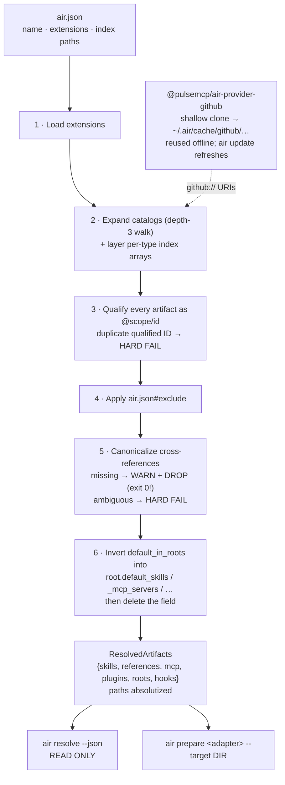

**AIR** is a separate open-source project that Zimmer depends on:
[**github.com/pulsemcp/air**](https://github.com/pulsemcp/air). This page is the mental model.
For API surface, flags, and schemas, go read AIR's own docs — this is deliberately light on
specifics and heavy on *how to think about it*.

:::note[AIR is not part of Zimmer]
Zimmer shells out to AIR's CLI (`@pulsemcp/air-cli`, pinned at `0.13.0` in
`AirPrepareService::AIR_CLI_VERSION`). It does not vendor, fork, or reimplement it. AIR has
adapters for Claude Code, Codex, Cursor, and others — Zimmer is one consumer among several.

AIR is **experimental and pre-1.0**. Its own README opens with: *"not yet fit for production
usage; APIs, schemas, and conventions may change without notice."* Recent releases have been
behavior-changing.
:::

## The problem AIR solves

As you adopt coding agents, agent configuration accumulates *globally and un-scoped*. Every
session ends up shipping the kitchen sink: every MCP server you've ever configured, every skill
in `~/.claude/skills`. Auth prompts pile up. Useful skills drown in noise. And none of it is
reviewable, because it's a pile of dotfiles on your laptop.

AIR's answer: declare artifacts once in version-controlled JSON, compose them across layered
catalogs, and assemble the slice one session needs — translating it into whatever the
target agent natively understands.

## What AIR is *not*

This boundary is the whole reason Zimmer exists. From AIR's own docs: it is not an
orchestration platform. It does not persist sessions, coordinate subagents, queue jobs, manage
credential vaults, manage git clone lifecycles, run sessions in parallel, or do monitoring.

Each `air prepare` sets up exactly one agent session, in one working directory. Everything
above that line is the orchestrator's job — which is precisely the seam Zimmer occupies.

## A catalog is a directory in git

There is no registry, no backend, no database. A catalog is a directory containing JSON index
files. Org catalogs, team catalogs, personal catalogs, and a repo's own in-tree catalog are all
the same shape.

`air.json` is the single composition surface. It names the catalog, lists the extensions to
load, and points at index files — either locally (`./skills/skills.json`) or remotely
(`github://owner/repo`).

## The identity model is the load-bearing idea

Every artifact is canonically **`@scope/id`**. Local indexes contribute under `@local/`; a
`github://owner/repo` catalog contributes under `@owner/repo/`.

From that fall out the composition rules:

1. Composition is union-only and additive — never later-wins. There is no deep merge and no
   field-level patching.
2. Duplicate qualified IDs hard-fail. You cannot silently shadow someone else's artifact.
3. `exclude` is the only way to drop something. To "override" an upstream artifact you exclude
   it and ship a replacement under your own scope.

This is unusual, and it's the right call. The alternative, deep-merging config layers, produces
a system where nobody can tell you where a value came from.

## The six artifact types

| Type | Index file | Body |
| --- | --- | --- |
| **Skills** | `skills/skills.json` | a directory with `SKILL.md` |
| **References** | `references/references.json` | a markdown file |
| **MCP servers** | `mcp.json` | **inline** — the entry *is* the connection config |
| **Plugins** | `plugins/plugins.json` | `<path>/.plugin/plugin.json` manifest |
| **Roots** | `roots.json` | a git repo |
| **Hooks** | `hooks/hooks.json` | a directory with `HOOK.json` + scripts |

Each index is a flat map of `id → entry`. The indexes are **lightweight registries** — an ID plus
a description is enough for an agent (or a picker UI) to judge relevance; bodies load on demand.
That's progressive disclosure, and it's why an index can list fifty skills without costing fifty
skills' worth of context.

References exist separately from skills on purpose. One reference (say, your git workflow
conventions) can serve many skills, so it's broken out rather than copy-pasted.

## `default_in_roots` — the inversion

This is AIR's most distinctive mechanic and the easiest thing to get backwards.

An artifact declares which roots it should be default-on in, from its own index entry:

```json
"zimmer-run-tests": {
  "title": "Run Zimmer's tests",
  "path": "./zimmer-run-tests",
  "default_in_roots": ["zimmer"]
}
```

This is the *inverse* of the naive design, where roots would list their members. Authoring it on
the artifact means adding a skill to a root is a one-line edit in the skill's own entry — no
cross-file surgery in a giant `roots.json` that everyone edits and everyone conflicts on.

During resolution AIR inverts these declarations into per-root membership, computing
`default_skills`, `default_mcp_servers`, `default_hooks`, `default_plugins`, `default_references`,
and `default_subagent_roots` on each root — and then deletes `default_in_roots` from the output
entirely. It's an authoring field, not a runtime one.

A root whose `default_in_roots` names *another root* is how **subagent roots** are declared. That's
how Zimmer's four `catalog-mgmt-*` phases attach themselves to the `catalog-management` lead root.

## Plugins are macros, not a new format

A plugin's manifest references *existing* artifacts by ID:

```json
{
  "name": "ci-workflow",
  "skills": ["zimmer-run-tests"],
  "hooks": ["git-push-ci-reminder"],
  "mcp_servers": []
}
```

At prepare time the adapter unions the plugin's declared skills, MCP servers, and hooks into the
activated set — so those primitives materialize through the same code path as if you'd
selected them directly. Selecting both a plugin and a skill it bundles dedupes to one. Plugins can
compose other plugins.

The design intent: plugins are the *shareable* unit, but you can always eject and work at the
primitive layer. Both are first-class.

## Resolution



**Local vs remote.** Local paths resolve relative to `air.json`. `github://owner/repo@ref/path`
shallow-clones the repo into `~/.air/cache/github/…` and reads from the clone. Once warm,
resolution is fully offline — subsequent resolves reuse the clone, and a freshness check
against the remote is informational only (network failures during it are swallowed).

### The failure semantics matter more than you'd think

| Situation | What AIR does |
| --- | --- |
| **Dangling reference** (a skill points at a missing reference; a root default names a missing skill; `default_in_roots` names an unknown root) | **Warn on stderr, drop the reference, exit 0** |
| Duplicate qualified ID | Hard fail |
| Ambiguous shortname (resolvable in >1 scope) | Hard fail |
| Malformed or unreachable index file | Warn, skip that source, continue |
| Catalog URI with no installed provider | Hard fail |

That first row is the one to watch. A dangling reference degrades silently to a
successful exit. AIR's reasoning is sound in isolation: a typo in one skill's reference list
shouldn't block the entire resolve. But it means the exit code lies to you, and there is no
machine-readable signal that anything was dropped.

Zimmer works around this by string-matching AIR's stderr. See
[How Zimmer consumes AIR](/air/zimmer-integration/#a-dangling-reference-is-treated-as-a-failed-resolve).

## Extensions: adapters, providers, transforms

AIR is a thin core plus four extension points. Zimmer loads two:

**`@pulsemcp/air-adapter-claude`** — an **agent adapter**. Conceptually, an adapter is *the only
agent-specific code in the system*: it knows nothing about catalogs or composition, and everything
about one agent's on-disk conventions. The Claude adapter writes `.mcp.json`, copies skills into
`.claude/skills/<id>/`, bundles each skill's references into `.claude/skills/<id>/references/`,
copies hooks into `.claude/hooks/<id>/`, and registers them in `.claude/settings.json`.

Sibling adapters (`-codex`, `-cursor`, `-pi`) implement the same interface against different
conventions. That's what makes "switch agents without rewriting your configs" real.

**`@pulsemcp/air-secrets-env`** — a **transform**, not an adapter. About fifty lines: after the
adapter writes `.mcp.json`, it walks every string value and substitutes `${VAR}` and
`${VAR:-default}` from `process.env`. Then `air prepare` validates that no `${VAR}` survived
and fails if any did.

This is how AIR stays out of the secrets business while still supporting secret-bearing MCP
configs: the catalog carries the placeholder, the environment carries the value, the transform
joins them at prepare time. The catalog is safe to commit; the secret never touches it.

## What prepare actually writes

```
<working directory>/
├── .mcp.json                              ← MCP servers, ${VAR} substituted
├── .claude/
│   ├── settings.json                      ← hooks registered, tagged _airHookId
│   ├── skills/
│   │   └── <skill-id>/
│   │       ├── SKILL.md
│   │       └── references/*.md            ← the skill's references, bundled
│   └── hooks/
│       └── <hook-id>/HOOK.json
```

Plus a manifest at `~/.air/manifests/<sha256-of-target-path>.json`.

Ownership is manifest-driven. AIR only ever removes what its own manifest says it wrote. A
`.claude/skills/<id>/` you hand-authored before the first prepare is recognized as user-authored
and never touched.

## The CLI, briefly

`air init` · `air validate` · `air resolve` · `air prepare <adapter>` · `air start <agent>` ·
`air clean` · `air list <type>` · `air install` · `air update` · `air export <emitter>`

Zimmer uses exactly two of these: `air resolve --json --no-scope` (to read the catalog) and
`air prepare <adapter>` (to set up a session). Plus `air update` to refresh provider caches.

→ Next: [How Zimmer consumes AIR](/air/zimmer-integration/)
