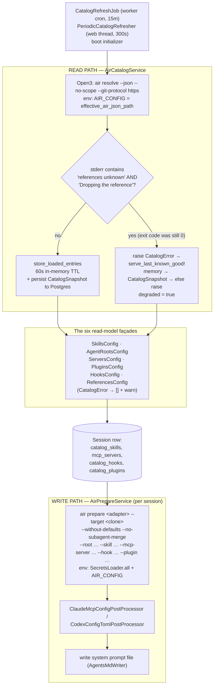

Zimmer touches AIR in exactly two places: a **read path** that asks "what artifacts exist?" and a
**write path** that says "prepare this directory."



## The catalog is self-contained and offline

Zimmer's `air.json` declares a catalog named `zimmer-catalog` with no `catalogs` field and no
`github://` URIs — only six local index paths, `gitProtocol: "https"`, and two extensions
(`@pulsemcp/air-adapter-claude`, `@pulsemcp/air-secrets-env`).

Everything lands under `@local/`, which is why `--no-scope` is safe: there can't be a cross-scope
shortname collision when there's only one scope.

The catalog's own description states the intent: *"resolves fully offline (no private GitHub
catalogs, no network), so the app's config services always resolve non-empty data."*

**What's in it:** 5 skills (all default-on for the `zimmer` root), 14 MCP servers (only
`playwright-custom` default-on), 9 roots, 4 plugins, 1 hook, 1 reference.

### `air.json` vs `air.production.json`

They are content-identical today. The split is a *seam* — it lets the
production image pin its own catalog sources without touching the dev/test config. Selection is
per-environment: `development`/`test` use `air.json`, `production`/`staging` use
`air.production.json`. `AIR_CONFIG` always wins.

:::caution[The environment configs describe a setup that no longer exists]
The comments in `config/environments/production.rb` and `staging.rb` still say
`air.production.json` *"uses `github://` URIs to pull catalog content from tadasant/zimmer-catalog."*

It doesn't. The file on disk is entirely local paths. As a result, all of `AirCatalogService`'s
github-cache machinery (`~/.air/cache/github`, `resolved_sha_for`, `pinnable_catalogs`, catalog
pins) is currently dormant infrastructure — correct code for a configuration nobody is running.
:::

## A dangling reference is treated as a failed resolve

This is the sharpest coupling between the two systems, and the most brittle thing in Zimmer.

[AIR exits 0](/air/overview/#the-failure-semantics-matter-more-than-youd-think) when it drops an
unresolvable reference, printing a warning to stderr. So Zimmer scans stderr for two literal
strings (`"references unknown"` and `"Dropping the reference"`) and, if both appear, raises
`CatalogError` despite the exit code being 0.

Why so aggressive? Because a dropped reference is exactly what strips a root's `default_skills`,
`default_mcp_servers`, and `default_hooks`. Persisting that tree would misconfigure every session
created against it — *and* overwrite the good snapshot with degraded data. So a degraded resolve
never reaches `persist_snapshot`.

The two-marker test exists because references dropped intentionally by `air.json#exclude` share the
second marker but are expected.

:::danger[This is a string copy of another project's log output]
`app/services/air_catalog_service.rb` says it plainly:

> *"Matching on AIR's exact stderr wording — a string copy, not a stable contract — is brittle, but
> AIR exposes no machine-readable signal for dropped references."*

If AIR ever rewords that warning, Zimmer will silently start accepting degraded catalogs and
misconfiguring sessions. There is no test that would catch it, because the test suite uses the same
AIR version. Tracked in [#66](https://github.com/tadasant/zimmer/issues/66).
:::

### The blast radius is the entire test suite

`test/test_helper.rb` pre-warms the catalog at boot, before `parallelize` forks its workers.
So a catalog that fails to resolve does not fail one test — it fails every test that creates a
session, all at once, with `ActiveRecord::RecordInvalid`.

A single dangling reference (a plugin bundling a skill that no longer exists, a `default_in_roots`
naming an unknown root) reddens the whole suite. `CONTRIBUTING.md` says it: if you see a sudden
wave of `RecordInvalid` across unrelated session tests, suspect the catalog before you suspect
your change.

:::danger[There is a missing hook body in the catalog right now]
`hooks/hooks.json` declares `git-push-ci-reminder` with `"path": "git-push-ci-reminder"`, and
`plugins/ci-workflow/.plugin/plugin.json` bundles that hook — but `hooks/git-push-ci-reminder/`
does not exist on disk. The `hooks/` directory contains only `hooks.json`.

This is a missing *body*, not a dangling *reference*, so it slips past the stderr marker check at
resolve time. It will bite at `air prepare`, when the Claude adapter tries to copy a hook directory
that isn't there — and `ci-workflow` is `default_in_roots: ["agent-orchestrator"]`, so any session
on that root is affected.
:::

## Three cache layers

1. **60-second in-memory TTL** on the parsed tree, per process (`CATALOG_CACHE_TTL`).
2. **`CatalogSnapshot`** — a Postgres-persisted last-known-good tree, written after every
   *successful* resolve. Survives restarts, shared across web and worker.
3. **AIR's own `~/.air/cache/github`** provider clones (dormant for an all-local catalog).

On failure, `load!` walks down: in-memory tree → `CatalogSnapshot.latest` → re-raise. It sets
`@degraded = true`, logs at `error` once and `info` thereafter (no alert spam), and surfaces
`degraded?` / `last_known_good_at` to health checks and the settings UI.

Only a first-ever cold boot with a broken catalog and no snapshot raises. The
consequence: a broken catalog can be invisible until restart.

:::note[A background thread inside Puma, to paper over a container mismatch]
`~/.air/cache` is per-container filesystem state, and the `*/15` `CatalogRefreshJob` cron runs
**only in the worker**. The web container's catalog would otherwise be refreshed exactly once, at
boot, and then drift stale for a full deploy cycle.

So `PeriodicCatalogRefresher` runs a bespoke background thread *inside Puma* that re-runs `air
update` every 300 seconds. It works. It is also a background thread in a web server, existing
purely to compensate for a container-topology mismatch.
:::

## The write path: `AirPrepareService`

Invoked synchronously from `AgentSessionJob` on `waiting → running`:

```bash
air prepare <adapter> \
  --target <clone> \
  --no-subagent-merge \
  --without-defaults \
  [--root <name>] \
  --skill <id>...  --mcp-server <id>...  --hook <id>...  --plugin <id>...
```

Two decisions here are load-bearing:

`--without-defaults` is deliberate. Zimmer already stores the *final resolved* per-session
artifact lists in the database — the UI's PATCH endpoints mutate them directly. AIR 0.0.30 flipped
`--skill` semantics from "replace defaults" to "add to defaults." Without `--without-defaults`, a
user removing a default artifact in the UI would watch AIR silently re-add it from the root
defaults. So Zimmer uses AIR's root-defaults machinery at **read** time (to seed a new session) and
explicitly bypasses it at **prepare** time.

Secrets flow through the environment. `SecretsLoader.all` is merged into the
subprocess env; `@pulsemcp/air-secrets-env` substitutes the `${VAR}` placeholders into `.mcp.json`;
AIR then fails the prepare if any `${VAR}` survived, which Zimmer catches as a graceful,
non-paging `SecretResolutionError`.

### Resilience

The whole invocation runs under `BoundedSubprocess` with a hard wall-clock timeout (it SIGKILLs the
process group), with retry-and-backoff on transient failures. There's a special case for **"Root
not found"**: it triggers one inline bounded `air update` (cache bust) and a retry — because a
freshly-merged root can legitimately be absent from a worker's up-to-15-minutes-stale cache. If
it's still absent, it raises a graceful `RootResolutionError`.

## The AIR CLI is installed lazily, at runtime

`AirPrepareService.ensure_air_installed!` runs `npm install` into `AIR_INSTALL_DIR` on first use,
pinned to `AIR_CLI_VERSION = "0.13.0"` — the CLI plus both adapters, the secrets-env transform, and
the GitHub provider. Guarded by a version marker file, a binary health check (`air --version`), and
a cross-process install lock.

:::caution[Two versions to keep in lockstep by hand]
`Dockerfile.base` bakes `@pulsemcp/air-cli@0.13.0` into `/opt/air-cli`, and
`AirPrepareService::AIR_CLI_VERSION` must match it. Nothing enforces that they agree. If they
drift, the image's pre-baked CLI is ignored and every worker re-downloads a different version at
runtime.
:::

## The six façades

`SkillsConfig`, `AgentRootsConfig`, `ServersConfig`, `PluginsConfig`, `HooksConfig`, and
`ReferencesConfig` are thin read-models over `AirCatalogService.entries_for(:type)`. Each shapes
raw resolve output into a Ruby value object, and each swallows `CatalogError` into an empty array
with a warning — so a catalog failure degrades the UI instead of returning a 500.
Tracked in [#112](https://github.com/tadasant/zimmer/issues/112).

Never parse the index files directly. That's the rule in `AGENTS.md` and it's a good one: the
indexes are AIR's input; the resolved tree is Zimmer's data model. The resolved tree is what Zimmer consumes, and it
differs from the raw index (references canonicalized, `default_in_roots` inverted and deleted, paths
absolutized).
