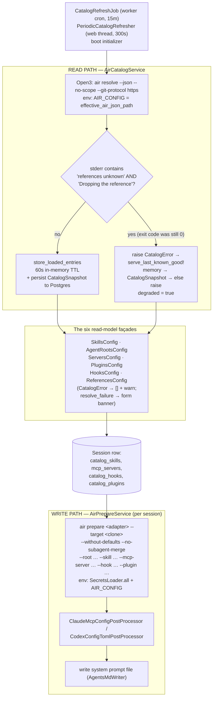

Zimmer touches AIR in exactly two places: a **read path** that asks "what artifacts exist?" and a
**write path** that says "prepare this directory."


```mermaid
flowchart TB
    subgraph read["READ PATH — AirCatalogService"]
        R1["Open3: air resolve --json --no-scope --git-protocol https<br/>env: AIR_CONFIG = effective_air_json_path"]
        R2{"stderr contains<br/>'references unknown' AND<br/>'Dropping the reference'?"}
        R3["store_loaded_entries<br/>60s in-memory TTL<br/>+ persist CatalogSnapshot to Postgres"]
        R4["raise CatalogError →<br/>serve_last_known_good!<br/>memory → CatalogSnapshot → else raise<br/>degraded = true"]
        R1 --> R2
        R2 -->|no| R3
        R2 -->|"yes (exit code was still 0)"| R4
    end

    subgraph facades["The six read-model façades"]
        F["SkillsConfig · AgentRootsConfig<br/>ServersConfig · PluginsConfig<br/>HooksConfig · ReferencesConfig<br/>(CatalogError → [] + warn;<br/>resolve_failure → form banner)"]
    end

    subgraph write["WRITE PATH — AirPrepareService (per session)"]
        W["air prepare &lt;adapter&gt; --target &lt;clone&gt;<br/>--without-defaults --no-subagent-merge<br/>--root … --skill … --mcp-server … --hook … --plugin …<br/>env: SecretsLoader.all + AIR_CONFIG"]
        W2["ClaudeMcpConfigPostProcessor /<br/>CodexConfigTomlPostProcessor"]
        W3["write system prompt file (AgentsMdWriter)"]
        W --> W2 --> W3
    end

    REFRESH["CatalogRefreshJob (worker cron, 15m)<br/>PeriodicCatalogRefresher (web thread, 300s)<br/>boot initializer"] --> R1
    R3 --> F
    R4 --> F
    F --> DB[("Session row:<br/>catalog_skills, mcp_servers,<br/>catalog_hooks, catalog_plugins")]
    DB --> W
```

## The catalog is self-contained and offline

Zimmer's `air.json` declares a catalog named `zimmer-catalog` with no `catalogs` field and no
`github://` URIs — only six local index paths, `gitProtocol: "https"`, and two extensions
(`@pulsemcp/air-adapter-claude`, `@pulsemcp/air-secrets-env`).

Everything lands under `@local/`, which is why `--no-scope` is safe: there can't be a cross-scope
shortname collision when there's only one scope.

The catalog's own description states the intent: *"resolves fully offline (no private GitHub
catalogs, no network), so the app's config services always resolve non-empty data."*

**What's in it:** 10 skills — 7 Zimmer-specific ones (`category: zimmer`) plus 3 vendored generic
workflow skills (`category: workflow`: `open-pr`, `wait-for-ci`,
`recover-from-compaction-thrashing`) — 18 MCP servers, 12 roots, 4 plugins, 1 hook, 5 references.
The `zimmer` root turns 9 of those skills on by default and exactly one MCP server,
`playwright-custom`; `awaken-waiting-sessions` and `zimmer-fleet` default on `fleet-maintenance`
instead.

Those counts are asserted against a live resolve by
`test/docs/zimmer_integration_catalog_counts_test.rb`, so adding a catalog entry without updating
this paragraph fails CI rather than leaving the page quietly stale.

### Vendored generic skills are adapted, not mirrored

A generic skill vendored here is the current revision of that skill with its links made to resolve
against *this* catalog. The two reasons a link cannot come across verbatim are the same two the
self-contained property implies:

- **The reference is not in this catalog.** `open-pr` upstream deep-links four references Zimmer
  does not carry. All four live in a private repo and some of them describe the private production
  deployment; `tadasant/zimmer` is public, so copying them in would leak deployment detail *and*
  break the offline-resolve promise. The substance those passages needed is written inline in the
  vendored body instead, and the links are gone. Incident citations that name a private repo get
  the same treatment: the mechanism stays, the issue number goes.
- **The anchor is not in the vendored reference.** A `references/GIT_WORKFLOW.md#some-heading` link
  resolves only if this catalog's copy of `GIT_WORKFLOW.md` has that heading, and the reference
  drifts behind the skill just as easily as the skill drifts behind upstream. The fix is to
  re-vendor the missing section — adapted the same way a skill is, so the deployment-specific
  material and private cross-links do not come with it — and only to drop the pointer when the
  upstream prose does not belong here at all. Either way the skill states the rule in full inline;
  where both exist, the skill is the operative instruction and the reference carries the shared
  convention and the incident behind it.

Neither kind of breakage fails `air resolve`: the artifact resolves fine and just points at prose
that is not there. The `no skill links a reference or a heading the catalog does not carry` test in
`test/services/skills_config_test.rb` is what catches it — it walks every `references/*.md` link in
every `SKILL.md` in the catalog and checks the file exists, the skill declares it, and the anchor is
a real heading, then does the same for each skill's in-page `#anchor` links, which go stale the
moment a re-vendoring renames a section.

### `air.json` vs `air.production.json`

They are content-identical today. The split is a *seam* — it lets the
production image pin its own catalog sources without touching the dev/test config. Selection is
per-environment: `development`/`test` use `air.json`, `production`/`staging` use
`air.production.json`. `AIR_CONFIG` always wins.

:::caution[The environment configs describe a setup that no longer exists]
The comments in `config/environments/production.rb` and `staging.rb` still say
`air.production.json` *"uses `github://` URIs to pull catalog content from tadasant/zimmer-catalog."*

It doesn't. The file on disk is entirely local paths. As a result, all of `AirCatalogService`'s
github-cache machinery (`~/.air/cache/github`, `resolved_sha_for`, `pinnable_catalogs`, catalog
pins) is currently dormant infrastructure — correct code for a configuration nobody is running.
:::

## A dangling reference is treated as a failed resolve

This is the sharpest coupling between the two systems, and the most brittle thing in Zimmer.

[AIR exits 0](/air/overview/#the-failure-semantics-matter-more-than-youd-think) when it drops an
unresolvable reference, printing a warning to stderr. So Zimmer scans stderr for two literal
strings (`"references unknown"` and `"Dropping the reference"`) and, if both appear, raises
`CatalogError` despite the exit code being 0.

Why so aggressive? Because a dropped reference is exactly what strips a root's `default_skills`,
`default_mcp_servers`, and `default_hooks`. Persisting that tree would misconfigure every session
created against it — *and* overwrite the good snapshot with degraded data. So a degraded resolve
never reaches `persist_snapshot`.

The two-marker test exists because references dropped intentionally by `air.json#exclude` share the
second marker but are expected.

:::danger[This is a string copy of another project's log output]
`app/services/air_catalog_service.rb` says it plainly:

> *"Matching on AIR's exact stderr wording — a string copy, not a stable contract — is brittle, but
> AIR exposes no machine-readable signal for dropped references."*

If AIR ever rewords that warning, Zimmer will silently start accepting degraded catalogs and
misconfiguring sessions. There is no test that would catch it, because the test suite uses the same
AIR version. Tracked in [#66](https://github.com/tadasant/zimmer/issues/66).
:::

### The blast radius is the entire test suite

`test/test_helper.rb` pre-warms the catalog at boot, before `parallelize` forks its workers.
So a catalog that fails to resolve does not fail one test — it fails every test that creates a
session, all at once, with `ActiveRecord::RecordInvalid`.

A single dangling reference (a plugin bundling a skill that no longer exists, a `default_in_roots`
naming an unknown root) reddens the whole suite. `CONTRIBUTING.md` says it: if you see a sudden
wave of `RecordInvalid` across unrelated session tests, suspect the catalog before you suspect
your change.

:::caution[A missing body is quieter than a dangling reference]
The stderr marker check only sees references *between* entries. It does not see a registered
artifact whose `path` has nothing behind it — that resolves clean and is silently skipped later, at
`air prepare`, when the adapter tries to copy a directory that isn't there.

`git-push-ci-reminder` was exactly that for a while ([#65](https://github.com/tadasant/zimmer/issues/65)):
registered in `hooks/hooks.json`, bundled by `plugins/ci-workflow`, `default_in_roots:
["agent-orchestrator"]`, and no `hooks/git-push-ci-reminder/` on disk. The body exists now, and
`SkillsConfig`/`HooksConfig`'s tests assert every registered artifact has one — but AIR itself still
won't tell you.
:::

## Three cache layers

1. **60-second in-memory TTL** on the parsed tree, per process (`CATALOG_CACHE_TTL`).
2. **`CatalogSnapshot`** — a Postgres-persisted last-known-good tree, written after every
   *successful* resolve. Survives restarts, shared across web and worker.
3. **AIR's own `~/.air/cache/github`** provider clones (dormant for an all-local catalog).

On failure, `load!` walks down: in-memory tree → `CatalogSnapshot.latest` → re-raise. It sets
`@degraded = true`, logs at `error` once and `info` thereafter (no alert spam), and surfaces
`degraded?` / `last_known_good_at` to health checks and the settings UI.

Only a first-ever cold boot with a broken catalog and no snapshot raises. The
consequence: a broken catalog can be invisible until restart.

:::note[A background thread inside Puma, to paper over a container mismatch]
`~/.air/cache` is per-container filesystem state, and the `*/15` `CatalogRefreshJob` cron runs
**only in the worker**. The web container's catalog would otherwise be refreshed exactly once, at
boot, and then drift stale for a full deploy cycle.

So `PeriodicCatalogRefresher` runs a bespoke background thread *inside Puma* that re-runs `air
update` every 300 seconds. It works. It is also a background thread in a web server, existing
purely to compensate for a container-topology mismatch.
:::

## The write path: `AirPrepareService`

Invoked synchronously from `AgentSessionJob` on `waiting → running`:

```bash
air prepare <adapter> \
  --target <clone> \
  --no-subagent-merge \
  --without-defaults \
  [--root <name>] \
  --skill <id>...  --mcp-server <id>...  --hook <id>...  --plugin <id>...
```

Two decisions here are load-bearing:

`--without-defaults` is deliberate. Zimmer already stores the *final resolved* per-session
artifact lists in the database — the UI's PATCH endpoints mutate them directly. AIR 0.0.30 flipped
`--skill` semantics from "replace defaults" to "add to defaults." Without `--without-defaults`, a
user removing a default artifact in the UI would watch AIR silently re-add it from the root
defaults. So Zimmer uses AIR's root-defaults machinery at **read** time (to seed a new session) and
explicitly bypasses it at **prepare** time.

Secrets flow through the environment. `SecretsLoader.all` is merged into the
subprocess env; `@pulsemcp/air-secrets-env` substitutes the `${VAR}` placeholders into `.mcp.json`;
AIR then fails the prepare if any `${VAR}` survived, which Zimmer catches as a graceful,
non-paging `SecretResolutionError`.

### Resilience

The whole invocation runs under `BoundedSubprocess` with a hard wall-clock timeout (it SIGKILLs the
process group), with retry-and-backoff on transient failures. There's a special case for **"Root
not found"**: it triggers one inline bounded `air update` (cache bust) and a retry — because a
freshly-merged root can legitimately be absent from a worker's up-to-15-minutes-stale cache. If
it's still absent, it raises a graceful `RootResolutionError`.

An **unparseable JSON file** is retried on that same ladder. air-sdk `JSON.parse`s the files the
adapter wrote into the target — `.mcp.json` and `.claude/settings.json` — without a guard, and
air-core does the same for `air.json` and the catalog indexes, so a failure there exits 1 with a bare
Node parse error and no path.

For the two files in the target directory, that is only reachable as a race. Neither can be a file
that was *already* broken on disk, because the Claude adapter rescues its own parse failure and
rewrites both from scratch before the SDK reads them. It takes a second writer changing one between
the adapter's write and that later read — and `air prepare` re-runs on every follow-up, resume and
unarchive, over a directory a previous job for the same session may still be tearing down. A
malformed `air.json` or catalog index reaches the same signature and is *not* a race; retrying costs
one bounded ladder and the failure stays loud either way.

Because AIR names no file, `AirPrepareService` prepends what the target's config files actually
looked like when it failed. In the race that description reports everything as parsing, which is
itself the confirmation; a file genuinely broken on disk shows up as `UNPARSEABLE` and is a different
bug. The enrichment is skipped when AIR's message already carries a path of its own.

Requested **skill** ids get one more guard, *before* the invocation. A session's `catalog_skills`
are validated against the catalog when the session is created, but the catalog moves on
independently: a local skill renamed (`pr` → `open-pr`) or removed leaves a stale id in a
long-lived session's stored config. `air prepare` hard-rejects an unknown skill id with exit 1
(`Error: Unknown skill ID "pr". …`), which would brick startup. So `AirPrepareService#scrubbed_catalog_skills`
drops any id not in the live catalog, logs a warning, and raises a deduped "Session self-healed:
stale catalog skill(s) removed" alert — then prepares with the survivors. This mirrors
`Trigger#heal_stale_catalog_skills!` (which self-heals the *trigger* path) and gives an unknown
*skill* the same non-fatal degradation an unknown *root* already gets. The pruned list is
**persisted** (`update_column`, so no validation or `updated_at` touch): a session does not prepare
once — every resume, unarchive, and mid-run clone recreation re-runs `air prepare`, so an
in-memory-only scrub would re-discover the same stale id and re-alert forever.

Two guards keep that write from doing damage. If the catalog failed to load *and* left `SkillsConfig`
empty (so every id would look stale), the list is left untouched rather than stripped. And nothing is
persisted while the catalog is **degraded** — a failed resolve usually does *not* empty
`SkillsConfig`, it serves a last-known-good tree, which is non-empty and can predate a rename, so an
id that is perfectly valid today looks stale against it. Dropping such an id in memory costs one
prepare; writing that drop back would erase a valid id permanently and undo the backfill that
repointed it. A failed write likewise degrades to a warning, so the scrub can still keep the prepare
alive.

Renaming a skill in the catalog is what creates those stale ids in the first place, so a rename
should ship with a **data backfill** that repoints existing `catalog_skills` rows (sessions *and*
triggers) from the old id to the new one — the heal alone only drops the id, which silently strips
the skill from long-lived sessions and from every session a trigger spawns.
`db/migrate/20260801120000_backfill_renamed_open_pr_skill_id.rb` is the worked example for the
`pr` → `open-pr` rename. Keep such a migration pinned to the one known rename: the catalog is a
runtime dependency that can resolve differently at migration time, so pruning against it is not
deterministic. General staleness stays the runtime heal's job.

## The AIR CLI is installed lazily, at runtime

`AirPrepareService.ensure_air_installed!` runs `npm install` into `AIR_INSTALL_DIR` on first use,
pinned to `AIR_CLI_VERSION = "0.13.0"` — the CLI plus both adapters, the secrets-env transform, and
the GitHub provider. Guarded by a version marker file, a binary health check (`air --version`), and
a cross-process install lock.

The install builds into a `.incoming` staging directory and swaps the finished tree into place. The
published directory therefore stays readable for the whole install, which matters because readers
hold no lock: `AirCatalogService` spawns `<AIR_INSTALL_DIR>/node_modules/.bin/air` directly, so an
install that emptied the directory first would hand every concurrent reader `Errno::ENOENT` for the
minute npm takes. A failed install leaves the previous tree in place.

`AIR_INSTALL_DIR` defaults to `/opt/air-cli` when that path exists or `/opt` is writable, and to
`~/.cache/air-cli` otherwise — but **only in a deployed environment**. Development resolves to
`~/.cache/air-cli` and test to `~/.cache/air-cli-test`, whatever is on disk; an explicit
`AIR_INSTALL_DIR` still outranks all of it. Agent sessions run on the same host as the production
container, and both `test/test_helper.rb` (at suite boot) and the catalog initializer under
`bin/agent-dev` call `ensure_air_installed!`, so a session running tests or a dev server in its
clone would otherwise reinstall over the directory the live app is shelling out to. That is
not hypothetical: on 2026-09-01 a branch that added an adapter to the package set did exactly this
and produced 10 production `ERROR` records in a minute, including an `ActionView::Template::Error`
rendering the dashboard's session cards.

:::caution[Two versions to keep in lockstep]
`Dockerfile.base` bakes `@pulsemcp/air-cli@0.13.0` into `/opt/air-cli` and touches a
`.air-version-0.13.0` marker; `AirPrepareService::AIR_CLI_VERSION` is what `ensure_air_installed!`
looks for. If they drift, the image's pre-baked CLI is ignored and the first session on a fresh
container replaces it with a different version — on the session's launch path.

`test/contracts/air_config_parity_test.rb` asserts they agree (and that `air.json` and
`air.production.json` still declare the same catalog), so drift fails a test rather than a deploy.
Bump both together.
:::

## The six façades

`SkillsConfig`, `AgentRootsConfig`, `ServersConfig`, `PluginsConfig`, `HooksConfig`, and
`ReferencesConfig` are thin read-models over `AirCatalogService.entries_for(:type)`. Each shapes
raw resolve output into a Ruby value object, and each swallows `CatalogError` into an empty array
with a warning — so a catalog failure degrades the UI instead of returning a 500.

That degrade is deliberate, but on its own it is indistinguishable from a fresh install: every
picker on the session form renders empty and nothing says why
([#112](https://github.com/tadasant/zimmer/issues/112)). `AirCatalogService.resolve_failure` closes
that gap. It records the last failed resolve — including the case `degraded?` cannot see, where no
last-known-good tree exists, `load!` re-raises, and the façades rescue to `[]` — and the session form
renders it as a banner saying whether the lists below are *empty* or merely *stale*, with the resolve
error verbatim.

The agent side reads through the same façades, so it had the same blind spot: `get_configs` would
report *"No MCP servers available"* and `start_session` would happily build a session against a
catalog that never resolved. `Mcp::Tools::GetConfigs` now prepends the same fact — empty versus
stale, plus when the failure was seen.

**Not the same fidelity, deliberately.** The banner prints `air resolve`'s stderr verbatim, and that
process is handed `AIR_GITHUB_TOKEN` by `AirPrepareService#air_env`, so its output is not something
to echo onto an agent channel. What an agent needs in order not to act wrongly is the fact and its
age; the text stays with the operator, on the form and in the logs.

Never parse the index files directly. That's the rule in `AGENTS.md` and it's a good one: the
indexes are AIR's input; the resolved tree is Zimmer's data model. The resolved tree is what Zimmer consumes, and it
differs from the raw index (references canonicalized, `default_in_roots` inverted and deleted, paths
absolutized).
