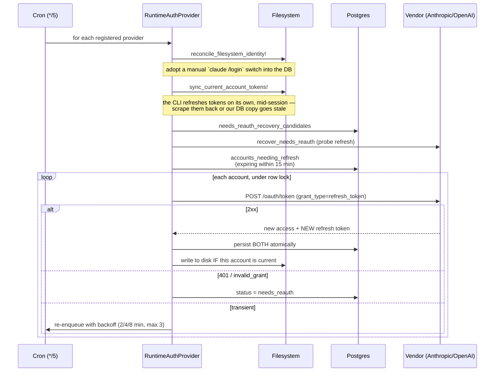
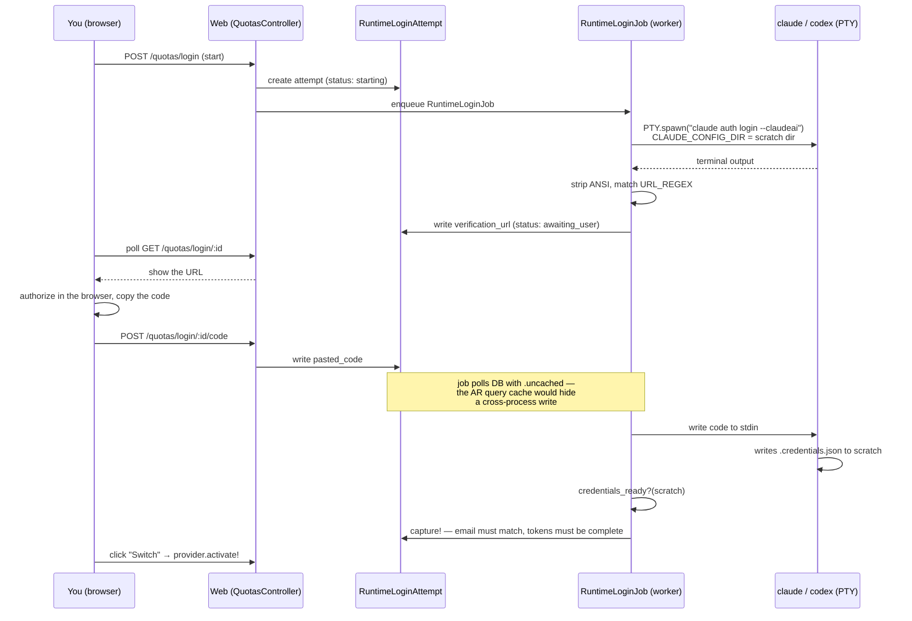

Zimmer keeps a pool of vendor accounts and rotates between them when one hits its rate limit.
That's the feature. Underneath it is the most fragile machinery in the project, and it's fragile for
a reason that isn't Zimmer's fault.

:::danger[This is built on an undocumented, moving target]
`docs/CLAUDE_CODE_OAUTH_ASSUMPTIONS.md` (now folded into this page and
[Known limitations](/limitations/)) exists because Zimmer automates OAuth token management on top
of Claude Code's OAuth implementation, which is an undocumented internal. Every constant below (the
token endpoint, the CLI's client ID, the file paths, the on-disk JSON shape, the login prompt text)
is a fact about someone else's private implementation that can change without notice.

The assumptions doc was last verified against CLI `2.1.177` on 2026-06-14. Two production
outages caused by exactly this are written up in the source.
:::

## The model

`ClaudeAccount` is the pool for both runtimes, discriminated by a `runtime` column
(`claude_code` | `codex`). The naming is a leftover.

Everything goes through `RuntimeAuthProvider.for(runtime)` → `ClaudeAuthProvider` or
`CodexAuthProvider`.

| | Claude | Codex |
| --- | --- | --- |
| Token endpoint | `platform.claude.com/v1/oauth/token` | `auth.openai.com/oauth/token` |
| Client ID | `9d1c250a-e61b-44d9-88ed-5944d1962f5e` (the CLI's public ID) | `app_EMoamEEZ73f0CkXaXp7hrann` |
| Files | `~/.claude.json` (identity), `~/.claude/.credentials.json` (tokens) | `~/.codex/auth.json` |
| Token TTL | from `expiresAt` (~8h, inferred) | 24h, inferred — `auth.json` has no expiry field |
| Rotation | `AccountRotationService`, 5-minute interval | inline in the provider, 24h |
| Identity check on capture | email must match | none |

## The refresh loop

`RefreshRuntimeAuthTokensJob` runs every 5 minutes:



The refresh threshold is 15 minutes on a 5-minute cron — three chances to catch a token before it
expires.

### Refresh tokens are single-use and rotating

Every refresh returns a new refresh token and invalidates the old one — *and* invalidates the
sibling access token. Two consequences the code has to defend against:

1. The new pair must be persisted atomically. A crash between "got new tokens" and "wrote them"
   bricks the account. `refresh_token!` writes both in one `update!`.
2. A future `expiresAt` is not proof a token is live. If someone else refreshed, your
   still-unexpired access token is already dead. The code does *not* enforce this — `token_expired?`
   still keys purely off `expiresAt`. The defense is the completeness invariant.

A credential set with no refresh token is a dead end. `ClaudeAccount.complete_claude_oauth?`
refuses to persist or adopt one, because the CLI sometimes rewrites `.credentials.json` *without* the
`claudeAiOauth` block at all, and adopting that blindly would brick the whole pool.

## The credentials-owner marker

Here is the structural problem the marker solves.

In the deployment shape this code was written for, `~/.claude.json` (identity) is container-local
while `~/.claude/.credentials.json` (tokens) is a shared bind-mount. So any code that reads the
local identity file to decide *who owns the shared tokens* gets a confidently wrong answer on the
wrong container. That is the root cause of the 2026-06-11 cross-account token-contamination outage.

The fix: a marker file, `~/.claude/.ao-credentials-owner.json`, written next to the shared tokens,
recording which account they belong to. `filesystem_credentials_owned_by_self?` gates the sync.

:::caution[The docs and the method's own docstring both describe a fallback that doesn't exist]
`docs/AUTH_ROTATION_ARCHITECTURE.html` (invariant I2) and the docstring on
`ClaudeAccount#sync_tokens_from_filesystem!` both claim there is a *"legacy `~/.claude.json` fallback
while no marker exists yet."*

There isn't. `filesystem_credentials_owned_by_self?` returns `false` when the marker is absent and
refuses to sync, and its own comment says so, explicitly contradicting the docstring 100 lines above
it. The private method is correct; the doc and the docstring are stale.
Tracked in [#59](https://github.com/tadasant/zimmer/issues/59).
:::

## Rotation on quota

When an account hits its rate limit, Zimmer rotates to the next one by priority:

1. Sync the outgoing account's tokens off disk.
2. Snapshot its quota state.
3. `mark_quota_exceeded!`.
4. `activate_next_account` — which validates the candidate by calling `refresh_token!` before
   activating it, so a broken account is skipped before it can brick the pool.
5. Write the new account's config and credentials to disk, stamp the owner marker.
6. Record an `AccountRotationEvent`.

`QuotaResetCheckerJob` (every 15 min, **Claude only**) restores `quota_exceeded` accounts when either
window's reset time has passed, or utilization drops below 100%.

:::danger[Rotation is triggered by matching an English error string]
`ApiErrorRetryService::ACCOUNT_QUOTA_LIMIT_PATTERN`:

```ruby
/hit your\b.*\blimit\b.*\bresets\b/i
```

That regex, run against the **transcript message text**, is the sole trigger for the entire
multi-account rotation feature. That trigger is Anthropic's prose: a regex over transcript text,
with no HTTP status or structured error code behind it.

On 2026-06-14 the CLI changed "hit your limit" to "hit your session limit," which the regex
happens to still match. A previous wording change did not, and rotation silently stopped firing.
The session fell through to the transient-rate-limit path, retried six times against an
already-capped account, exhausted its retries, and failed, with no log line saying rotation should
have fired. The failure mode is silent.
Tracked in [#53](https://github.com/tadasant/zimmer/issues/53).
:::

## Mid-run auth loss

`AuthRecoveryService` watches the transcript for `"Not logged in · Please run /login"` (matched by
`/not logged in|please run\s*\/login/i`), re-injects credentials to disk, and re-spawns the process.
Bounded by `MAX_RECOVERY_ATTEMPTS`; returns `:unrecoverable` if no account is available.

## Logging in from the UI

The "Authenticate" button drives a PTY-screen-scraping flow:



`RuntimeLoginAttempt` is being used as a cross-container message bus: the web process writes
`pasted_code`, the worker process reads it. That's why `poll_state` must use
`RuntimeLoginAttempt.uncached` — ActiveRecord's per-request query cache would otherwise hide the
write. It's documented at length in the code, and it's a landmine.
Tracked in [#111](https://github.com/tadasant/zimmer/issues/111).

:::caution[The login flow is screen-scraping a TUI]
The command string (`claude auth login --claudeai`), the authorize-URL host regex, and the literal
prompt `/Paste code here/i` are all hardcoded. `ClaudeLoginDriver` even hardcodes
`/home/rails/.local/bin/claude` as its first binary candidate. If Claude Code changes any of these,
login breaks wholesale.

Codex is the same story, with `codex login --device-auth` and a device-code regex
(`/\b([A-Z0-9]{4}-[A-Z0-9]{4,8})\b/`) tuned to an *observed* 4–5 character split.
:::

:::caution[One credential file, two writers]
`ClaudeAccount#write_credentials_to_filesystem!` does a whole-file overwrite of
`~/.claude/.credentials.json`. `ClaudeMcpCredentialWriter` read-merges an `mcpOAuth` map into the
*same* file.

So an account rotation replaces the file with account B's stored blob — dropping any `mcpOAuth`
entries written after B's blob was last captured. It self-heals (the injector rewrites `mcpOAuth`
on the next spawn), but it's an undeclared coupling between two subsystems that don't know about each
other.
:::
