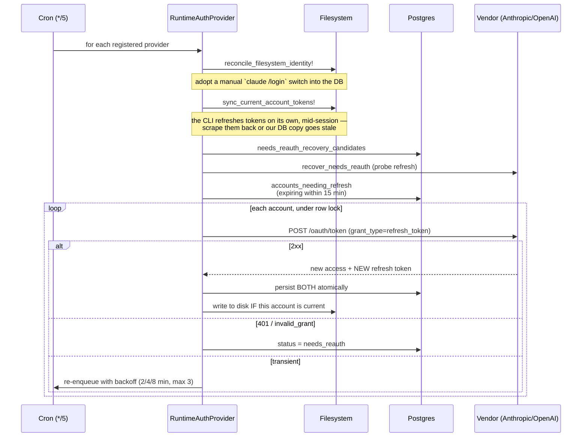
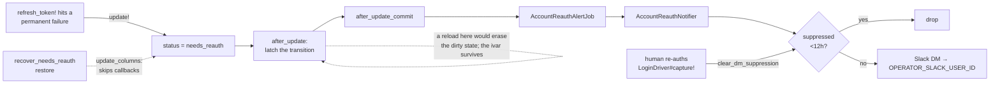
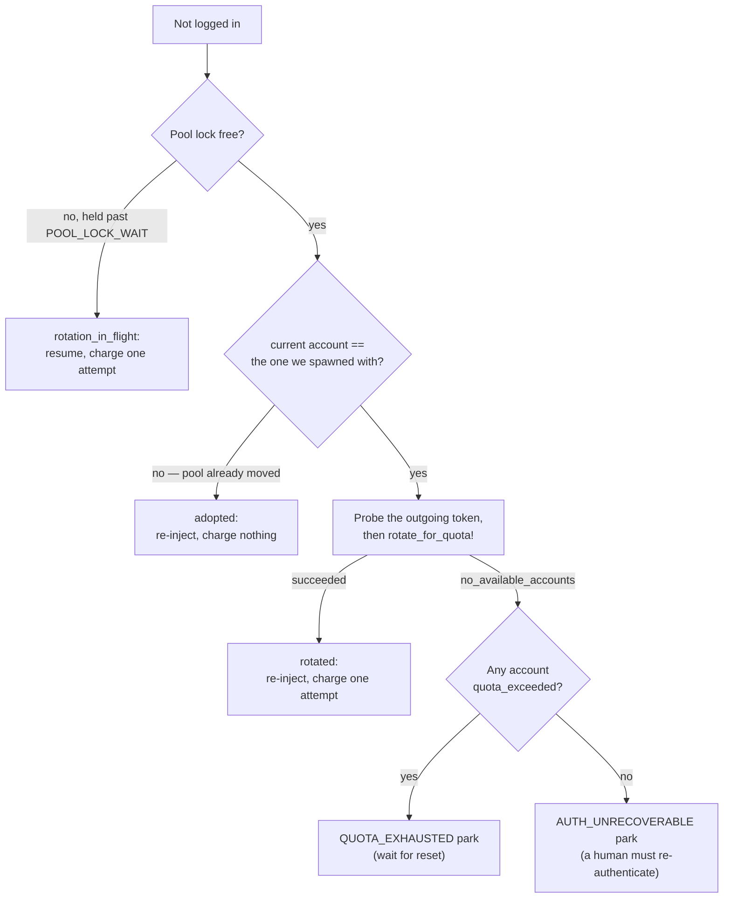

Zimmer keeps a pool of vendor accounts and rotates between them when one hits its rate limit.
That's the feature. Underneath it is the most fragile machinery in the project, and it's fragile for
a reason that isn't Zimmer's fault.

:::danger[This is built on an undocumented, moving target]
`docs/CLAUDE_CODE_OAUTH_ASSUMPTIONS.md` (now folded into this page and
[Known limitations](/limitations/)) exists because Zimmer automates OAuth token management on top
of Claude Code's OAuth implementation, which is an undocumented internal. Every constant below (the
token endpoint, the CLI's client ID, the file paths, the on-disk JSON shape, the login prompt text)
is a fact about someone else's private implementation that can change without notice.

The assumptions doc was last verified against CLI `2.1.177` on 2026-06-14. Two production
outages caused by exactly this are written up in the source.
:::

## The model

`ClaudeAccount` is the pool for both runtimes, discriminated by a `runtime` column
(`claude_code` | `codex`). The naming is a leftover.

Everything goes through `RuntimeAuthProvider.for(runtime)` → `ClaudeAuthProvider` or
`CodexAuthProvider`.

| | Claude | Codex |
| --- | --- | --- |
| Token endpoint | `platform.claude.com/v1/oauth/token` | `auth.openai.com/oauth/token` |
| Client ID | `9d1c250a-e61b-44d9-88ed-5944d1962f5e` (the CLI's public ID) | `app_EMoamEEZ73f0CkXaXp7hrann` |
| Files | `~/.claude.json` (identity), `~/.claude/.credentials.json` (tokens) | `~/.codex/auth.json` |
| Token TTL | from `expiresAt` (~8h, inferred) | 24h, inferred — `auth.json` has no expiry field |
| Rotation | `AccountRotationService`, 5-minute interval | inline in the provider, 24h |
| Identity check on capture | email must match | none |

## Deleting an account keeps its history

Delete is a real delete: the `claude_accounts` row goes, and the account leaves the pool.
What does **not** go is the record of how it behaved. Its quota snapshots, its login
attempts, and every rotation event pointing at it are detached (`dependent: :nullify`)
rather than destroyed.

That is not tidiness, it is a diagnosis problem. The operator response to a misbehaving
account is "delete it and re-authenticate" — the two buttons sit side by side on every
`/quotas` card — and the cascade used to take the evidence with it. On 2026-07-31 an
account was deleted and re-added, and the replacement row read `Quota snapshots: None`
plus one login attempt: indistinguishable from an account that had never once completed
a call. The row was thirty minutes old and said nothing about the credential at all.

`:restrict_with_error` would have preserved the same history by refusing the delete, and
was rejected on those grounds: any account old enough to be worth diagnosing has history,
so Delete would become a control that only ever errors.

A detached row still has to name who it was for, or it preserves bytes rather than
evidence. Each carries the identity at write time:

| Table | Carries | Why |
| --- | --- | --- |
| `claude_account_quota_snapshots` | `account_email`, `account_runtime` | a reading attributable to nobody answers nothing |
| `runtime_login_attempts` | `account_email` | "did this credential ever log in?" outlives the account, within the 1-day attempt retention window `CleanupRuntimeLoginAttemptsJob` already enforced |
| `account_rotation_events` | `rotated_from_email`, `rotated_to_email`, `runtime` | the pool moved *from* and *to* something, and `/quotas` filters the table by runtime |

The rotation table's `runtime` column is load-bearing. `/quotas` used to scope rotation
history by joining to the target account's runtime, which an event whose target has been
deleted cannot satisfy — so preserving the event without it would have dropped the event
off the page it exists to inform. The preserved emails also restore a distinction the old
`:nullify` on `rotated_from_id` erased: a nil source with no email is a rotation that
genuinely had no source (a bootstrap), and a nil source *with* an email is one whose
source was deleted. The page labels the second kind "deleted".

Two consequences worth knowing:

- Re-adding the same email creates a **new** account row that inherits none of the old
  one's history. The history is still there, attached to the email rather than to the new
  id — readable in the rotation log and in `/supervisor`, not on the new card. The
  `.ao-credentials-owner.json` marker is keyed by email and so *is* inherited, which is
  the same identity mismatch [#241](https://github.com/tadasant/zimmer/issues/241) closes
  with: filesystem ownership and history disagree about what "the same account" means.
- `claude_accounts:clear_all` / `codex_accounts:clear_all` still destroy everything, detached
  rows included — they find those by the denormalized runtime, since there is no foreign key
  left to find them by. They are the deliberate start-over affordance, and they say so.
- Nothing else removes a detached quota snapshot. `claude_account_quota_snapshots` has no prune
  job, so an account's readings are now permanent unless `clear_all` takes them. See
  [limitations](/limitations/).

## The refresh loop

`RefreshRuntimeAuthTokensJob` runs every 5 minutes:


```mermaid
sequenceDiagram
    participant C as Cron (*/5)
    participant P as RuntimeAuthProvider
    participant FS as Filesystem
    participant DB as Postgres
    participant V as Vendor (Anthropic/OpenAI)

    C->>P: for each registered provider
    P->>FS: reconcile_filesystem_identity!
    Note over P,FS: adopt a manual `claude /login` switch into the DB
    P->>FS: sync_current_account_tokens!
    Note over P,FS: the CLI refreshes tokens on its own, mid-session —<br/>scrape them back or our DB copy goes stale
    P->>DB: needs_reauth_recovery_candidates
    P->>V: recover_needs_reauth (probe refresh)
    P->>DB: accounts_needing_refresh<br/>(expiring within 15 min)
    loop each account, under row lock
        P->>V: POST /oauth/token (grant_type=refresh_token)
        alt 2xx
            V-->>P: new access + NEW refresh token
            P->>DB: persist BOTH atomically
            P->>FS: write to disk IF this account is current
        else 401 / invalid_grant
            P->>DB: status = needs_reauth
        else transient
            P->>C: re-enqueue with backoff (2/4/8 min, max 3)
        end
    end
```

The refresh threshold is 15 minutes on a 5-minute cron — three chances to catch a token before it
expires.

### Refresh tokens are single-use and rotating

Every refresh returns a new refresh token and invalidates the old one — *and* invalidates the
sibling access token. Two consequences the code has to defend against:

1. The new pair must be persisted atomically. A crash between "got new tokens" and "wrote them"
   bricks the account. `refresh_token!` writes both in one `update!`.
2. A future `expiresAt` is not proof a token is live. If someone else refreshed, your
   still-unexpired access token is already dead. The code does *not* enforce this — `token_expired?`
   still keys purely off `expiresAt`. The defense is the completeness invariant.

A credential set with no refresh token is a dead end. `ClaudeAccount.complete_claude_oauth?`
refuses to persist or adopt one, because the CLI sometimes rewrites `.credentials.json` *without* the
`claudeAiOauth` block at all, and adopting that blindly would brick the whole pool.

## The credentials-owner marker

Here is the structural problem the marker solves.

In the deployment shape this code was written for, `~/.claude.json` (identity) is container-local
while `~/.claude/.credentials.json` (tokens) is a shared bind-mount. So any code that reads the
local identity file to decide *who owns the shared tokens* gets a confidently wrong answer on the
wrong container. That is the root cause of the 2026-06-11 cross-account token-contamination outage.

The fix: a marker file, `~/.claude/.ao-credentials-owner.json`, written next to the shared tokens,
recording which account they belong to. `filesystem_credentials_owned_by_self?` gates the sync.

There is no fallback when the marker is absent. `filesystem_credentials_owned_by_self?` returns
`false` and the sync is skipped — deliberately, because the only other identity available is the
container-local `~/.claude.json`, the file whose cross-container divergence caused the outage in the
first place. A skipped sync loses at most one round of runtime-rotated tokens; a wrong answer grafts
one account's tokens onto another's row. Zimmer stamps the marker on its next credential write
(`ensure_active_account!`, every `write_config!`), and the sync resumes from there.

## One credential file, three writers

`~/.claude/.credentials.json` is not owned by any one component. Zimmer writes the `claudeAiOauth`
block (the subscription tokens, from `ClaudeAccount#write_credentials_to_filesystem!`) and the
`mcpOAuth` map (per-server MCP tokens, from `ClaudeMcpCredentialWriter`), and the Claude Code CLI
rewrites both at runtime. So no writer may write the whole file from its own snapshot — a plain
`File.write` of one block's blob discards whatever is in the other.

`ClaudeCredentialStore` is the discipline that makes that safe, and both Zimmer writers go through
it:

- **one lock file** — `~/.claude/.zimmer-credential-store.lock`, `flock`-held across the whole
  read-modify-write, derived from the credentials path's directory. It serializes overlapping
  sessions' MCP injections *and* an account rotation landing in the middle of one.
- **one atomic write** — temp file + `rename`, mode `0600`, so a concurrent reader never sees a
  half-written store.
- **read-merge, never overwrite** — the account writer layers its stored blob over what is on disk
  and leaves `mcpOAuth` exactly as found. It also stamps the owner marker *inside* the lock, so the
  marker can never end up naming an account whose tokens two interleaved writes replaced.

`mcpOAuth` is the only block carved out, and it runs in both directions — on disk it wins even when
it is absent:
`sync_tokens_from_filesystem!` captures the *whole* file into `oauth_config`, so an account's DB copy
carries a snapshot of whatever MCP entries existed at capture time. Writing that copy back would
clobber entries authorized since and resurrect entries `McpOauthCredential` deliberately deleted —
which is exactly the resurrection `ClaudeMcpCredentialWriter#delete_credentials` exists to prevent.
MCP state belongs to the MCP writer, which re-injects it on every spawn.

For any *other* key present in both, the account's copy wins. That direction is deliberate: the write
exists to make the file describe the incoming account, and deferring to disk for some future
account-scoped block would leave the outgoing account's data there — the contamination the marker
exists to prevent. A host-scoped block Zimmer doesn't know about is the milder mistake, and the fix
is to name it in `credentials_blob_for_disk` alongside `mcpOAuth`.

Until [#60](https://github.com/tadasant/zimmer/issues/60), the account writer did a whole-file
overwrite instead, so rotating accounts dropped every MCP OAuth credential on the box — and the user
met it as *"the agent says it needs to authorize this server again."*

### Does the filesystem agree with the DB?

Before each session spawn, `AccountRotationService#ensure_active_account!` compares the identity in
`~/.claude.json` against the identity stored on the DB-current account. Agreement means the worker is
already set up for that account; disagreement means either the CLI was switched by hand (adopt it) or
the DB moved and the disk has not caught up (write the DB-current account to disk).

`config_file_matches?` **fails closed**: an account with no stored identity to compare answers "no
match", not "can't verify, assume ok" ([#61](https://github.com/tadasant/zimmer/issues/61)). A guard
that returns *ok* when it cannot verify is not a guard, and the unverifiable case — an account holding
credentials but no identity — is exactly the one where the tokens on disk could belong to anyone.

Failing closed alone would leave such an account rewriting the filesystem on every spawn and arriving
at the same unanswerable question next time, so the check converges instead:
`ClaudeAccount#backfill_identity_from_filesystem!` adopts the on-disk `~/.claude.json` **when that
file already names this account**. Identity only, never credentials; it fills a gap and never
overwrites a stored identity. From then on the comparison has something to compare. When the file
names somebody else there is nothing to adopt, and the caller falls through to its existing
adopt-or-write branches.

## Rotation on quota

When an account hits its rate limit, Zimmer rotates to the next one by priority:

1. Sync the outgoing account's tokens off disk.
2. Snapshot its quota state.
3. `mark_quota_exceeded!`.
4. `activate_next_account` — which skips a candidate whose latest snapshot says its weekly window is
   spent, then validates the survivor by calling `refresh_token!` before activating it. A broken or
   capped account is skipped before it can be handed to a session.
5. Write the new account's config and credentials to disk, stamp the owner marker.
6. Record an `AccountRotationEvent`.

Steps 1–6 run under the per-runtime pool lock (`ClaudeAccount.with_pool_lock`), and the caller
passes the identity its session was running as. A stampede — N sessions hitting the same account's
quota within seconds — therefore produces **one** rotation: the first racer moves the pool, and
every racer behind it finds the pool already off the account it was complaining about and returns
that new account instead of rotating again.

:::caution[Without that, a stampede drained the pool]
Anthropic's refresh tokens are single-use. Unserialized, N racers read the same `current`, selected
the same successor, and each called `refresh_token!` on it; the first rotated the token and the rest
got `invalid_grant`, which was read as permanently dead and marked `needs_reauth`. Four different
accounts died that way in ten days, and `account_rotation_events` carries the fingerprint —
duplicate and triplicate `from → to` pairs seconds apart. Serializing stops the concurrent refresh;
collapsing stops the serialized racers from each burning one more account.
See [#242](https://github.com/tadasant/zimmer/issues/242).
:::

## Refreshing a token without burning it

Both vendors issue **single-use** refresh tokens: a successful refresh returns a new pair and
invalidates the old one. Present a spent one and Anthropic answers `invalid_grant`, OpenAI
`refresh_token_reused` — and neither response can tell you whether the credential is dead or whether
somebody else simply got there first.

`ClaudeAccount#refresh_token!` has nine call sites (the quotas page ×4, `QuotaResetCheckerJob` ×2,
rotation, activation, and the 5-minute `RefreshRuntimeAuthTokensJob` sweep), so both protections live
in that one method rather than at each of them:

1. **A row lock across the whole read-refresh-persist sequence** — the only scope that can promise
   the token being presented is the token still held. On acquiring it the method re-reads the row: if
   another caller rotated the token while this one queued, their refresh *is* this one's refresh, so
   it reports success rather than spending a token nobody has used yet.
2. **A lost-race check before condemning anything.** The lock excludes other Zimmer callers but not
   the agent CLI, which rotates the shared credential file mid-session. So on a permanent-looking
   failure the method re-syncs from disk and compares: if the token of record has moved on from the
   one it presented, this was a lost race, and the account stays `active` instead of going
   `needs_reauth`.

That second one is what makes re-authentication stick. Before it, a re-authed account rejoined the
pool and the next stampede condemned it again within minutes.

Both are runtime-agnostic — the Codex path has the same single-use semantics and gets the same two
protections. API-key Codex accounts skip the lock entirely: nothing to rotate, no race to lose.

The lock is re-entrant with the outer `account.with_lock` in
`RuntimeAuthProvider#recover_needs_reauth` and in the sweep, so nesting is safe.

`QuotaResetCheckerJob` (every 15 min, **Claude only**) restores `quota_exceeded` accounts when
`ClaudeAccountQuotaSnapshot#windows_clear?` says both windows have cleared: each window's reset time
has passed, or its utilization has dropped below 100% — except that a weekly window the API is still
*rejecting* is never counted as clear, however far its counter has drifted. It then calls
`AuthOutageParkService.wake_parked_sessions!` so the sessions that were blocked on those accounts
resume in the same sweep — see [When the pool runs dry](#when-the-pool-runs-dry).

### The status column is sticky; the badge on /quotas is not

`ClaudeAccount#status` is a durable column. Something writes `quota_exceeded` onto it and only the
15-minute sweep above ever writes `active` back. That makes it a claim about the past, and two things
routinely leave it stale:

- **Rotation stamps the outgoing account whatever it rotated for.**
  `AccountRotationService#rotate_under_lock` marks the account it is rotating away from, so one
  rotated through on `auth_recovery` wears `quota_exceeded` with no quota evidence behind it at all.
  The mark keeps that account out of the pool for now, but it was never meant to be durable — a
  restore as soon as the reading is clear is the documented intent, not a leak (see
  [Auth recovery can rotate away from an account that was fine](/limitations/#auth-recovery-can-rotate-away-from-an-account-that-was-fine)),
  and what actually protects the next session is that rotation validates a candidate at pick time.
- **The sweep is not guaranteed to run.** The deploy that froze every queue for ten hours
  ([#426](https://github.com/tadasant/zimmer/issues/426)) froze every label with them.

So the page does not render the column unquestioned. `ClaudeAccount#effective_status` derives what an
account *presents* from `windows_clear?` on its own latest snapshot — the same predicate the sweep
restores on — and the account-level badge and the pool tallies both read that. It is the
account-level counterpart of the staleness rule `QuotasHelper#window_status_badge` already applies
per window: a recorded status describes the window that was open when the reading was taken.

The derivation runs one way, and only one. It softens `quota_exceeded` to `active` when the reading
says the windows have cleared, and does nothing else: it never marks a healthy account, never touches
`needs_reauth` — which only a human clears — and falls back to the column whenever there is no
snapshot to judge by, which is every Codex account.

It is also display-only. `ClaudeAccount.available` and `AccountRotationService` keep acting on the
durable column, because a reading minutes old is not something to hand a session on. The column
converges separately: `QuotasController#auto_heal_accounts` runs on page load as well as on refresh,
from the same predicate, so looking at /quotas is the other thing that can restore an account when
the sweep is the thing that has stopped. Only the account — the sessions parked on it still wait for
the sweep's `wake_parked_sessions!` or their own timer, because resuming sessions is not something a
page render should do.

### A dead account tells you so

`needs_reauth` is the one account failure Zimmer cannot recover from. The refresh token is
permanently invalid, the pool quietly stops drawing on the account, and everything keeps working —
with a smaller pool. Nothing surfaces it: the failure is logged at `.warn` precisely so it does *not*
page `#eng-alerts` (a channel alert for a condition only a human can clear is noise), and
`recover_needs_reauth` re-probes it forever without ever succeeding. The account just sits dead on
`/quotas` until somebody happens to open the page.

So Zimmer DMs you. When a `ClaudeAccount` crosses **into** `needs_reauth`, an
`after_update_commit` callback enqueues `AccountReauthAlertJob`, which calls
`AccountReauthNotifier` → `AlertService.dm_operator`. The DM names the account and the runtime and
links to `/quotas`. It goes to `OPERATOR_SLACK_USER_ID`; unset, the DM is logged and dropped and
nothing else changes.

The transition is **latched during the save** (`after_update`) and only acted on after the commit,
which is not ceremony. `reload` nils `@mutations_before_last_save`, so a commit-time
`saved_change_to_status?` answers "nothing changed" whenever anything reloaded the record between the
write and the commit. `RefreshRuntimeAuthTokensJob` does exactly that: it wraps the refresh in an
outer `account.with_lock`, and `ClaudeAuthProvider#refresh!` reloads on its failure branch to decide
whether the error is `:needs_reauth` or `:transient`. `with_lock` opens a transaction without
`requires_new`, so `refresh_token!`'s inner lock joins it and the commit callback does not run until
that outer transaction commits — long after the reload. Asking at commit time meant the
every-5-minutes sweep, the likeliest discoverer of a dead refresh token, never DM'd at all. A plain
ivar survives `reload`; the dirty state does not.

A model callback rather than instrumentation at the sites that condemn an account, so no path can
forget to alert — including the Administrate admin form, which no service-level hook would see. Two
writes deliberately do *not* alert, and both fall out of that placement:

- **Creation.** `after_update_commit` does not fire on insert, so the credential-less account
  `/quotas` seeds directly into `needs_reauth` stays silent. The human is on the page adding it.
- **Recovery restores.** `recover_needs_reauth` flips an already-dead account to `active` so
  `refresh_token!` is not status-blocked, then writes `needs_reauth` back with `update_columns` when
  the probe fails. `update_columns` skips callbacks, so that no-op round trip is silent — and the
  probe itself cannot condemn the account either, since `recovery_probe: true` returns before the
  permanent-failure branch. Without both, every recovery sweep would look like a fresh failure.

On top of that, `AlertService` suppresses a repeat DM about the same account for
`OPERATOR_DM_DEDUP_WINDOW` (12 hours) — much longer than the hourly window the channel feed uses,
because a DM is a nag at one person about something that stays broken until they act.

**Only a human re-authenticating drops that suppression**, from `ClaudeLoginDriver#capture!` and its
Codex twin — not from the status callback. That looks like the more obvious place and is a trap:
`sync_from_filesystem!` resurrects the on-disk credential owner to `active` with a plain `update!`,
including a `needs_reauth` row whose dead-but-complete tokens are still sitting in the credentials
file, and `ensure_active_account!` runs that before every session spawn. Clearing there would drop
the backstop moments before `usable_candidate?` re-condemns the same account — one DM per spawn
attempt on a drained pool, which is the exact flood the window exists to prevent. The cost of the
narrower rule is that an account the recovery sweep fixes automatically, which then dies again
inside 12 hours, waits out the window before it can DM again.

A failed DM can never take down the auth path: `dm_operator` swallows its own errors and returns
`false`, the job does no work worth retrying, and the callback rescues anything the enqueue itself
raises.


```mermaid
flowchart LR
    R[refresh_token! hits a<br/>permanent failure] -->|update!| S[status = needs_reauth]
    S --> L[after_update:<br/>latch the transition]
    L -.->|a reload here would erase<br/>the dirty state; the ivar survives| L
    L --> C[after_update_commit]
    C --> J[AccountReauthAlertJob]
    J --> N[AccountReauthNotifier]
    N --> D{suppressed<br/>&lt;12h?}
    D -->|yes| X[drop]
    D -->|no| DM[Slack DM → OPERATOR_SLACK_USER_ID]
    RC[recover_needs_reauth<br/>restore] -.->|update_columns:<br/>skips callbacks| S
    H[human re-auths<br/>LoginDriver#capture!] -->|clear_dm_suppression| D
```

### An account can be capped without ever having been current

`mark_quota_exceeded!` used to fire only on the account that was current when a session hit a wall.
An account that filled its weekly window while sitting idle in the pool was never marked: it stayed
`active`, stayed in `ClaudeAccount.available`, and was the next thing rotation reached for — activate,
fail on the first request, rotate again ([#248](https://github.com/tadasant/zimmer/issues/248)).

Two changes close that, and they read the same predicate —
`ClaudeAccountQuotaSnapshot#seven_day_window_spent?`:

- **`QuotaSnapshotService` marks the account as the reading lands**, whichever path took it —
  rotation, a `/quotas` page view, the reset checker's own probe. A reading that says the week is
  gone takes the account out of `available` there and then. It only ever moves an `active` account:
  `needs_reauth` is a different failure with a different recovery, and relabelling it would make an
  unusable pool look merely throttled.
- **Rotation and bootstrap refuse a capped candidate at pick time**, and mark it on the way past.
  That is what covers evidence recorded before the ingestion marking existed.

`QuotaResetCheckerJob` reads the same predicate to decide the account is *not* back yet, which is
what keeps the healer and the marker from flipping an account between states on every sweep.

### Bootstrap validates before it promotes

`ensure_active_account!` picks an account when nothing is current — a fresh install, a restarted
worker, a pool that has just been re-authenticated. It used to take `ClaudeAccount.available.first` on
faith, and `ensure_fresh_tokens!` swallows its own failure by design, so an account with a dead
refresh token became current anyway and every session on the instance failed to authenticate until a
human intervened ([#239](https://github.com/tadasant/zimmer/issues/239)).

It now walks the pool in priority order and takes the first candidate that is not capped and whose
token Anthropic actually honours. The probe is `QuotaCheckService#check_with_token`, **not**
`refresh_token!`: it reads the rate-limit headers off a one-token request, so it can be run over
candidates that may be skipped without spending a single-use refresh token. A candidate Anthropic
*refuses* is refreshed once and probed again — a stale access token is the one refusal a refresh can
fix — so the single-use token is spent only where it might help, never on a candidate whose
credentials already work. `ClaudeLoginDriver#capture!` applies the same probe through
`QuotaCheckService.token_rejected?`, because a login that produces a complete-looking token pair is
another way an unusable account enters the pool.

The probe answers three ways, and only one of them condemns an account: Anthropic honoured the token,
Anthropic answered and refused it, or **the probe never got an answer** (timeout, DNS failure, 5xx).
The last is evidence about the network, not the credential, so it does not skip the account — reading
an Anthropic outage as "every credential is dead" would park every session at once.

A successful probe is a live quota reading, so it is recorded as a snapshot rather than reduced to a
boolean. That is what lets bootstrap refuse an account whose weekly window is spent but which nothing
has ever probed — the case stored evidence cannot cover — and it leaves rotation with evidence about
an account that has never been current.

### What `/quotas` reports for the pool

Anthropic meters two windows per account, 5-hour and 7-day, and the page shows both — per account,
and averaged across the pool.

The pool's 5-hour average is labelled **"Avg 5-Hour Utilization (effective)"** because it is not a
plain average of the 5-hour counters. An account whose 7-day window is spent — status `rejected`, or
the counter at its cap — cannot serve a request however much 5-hour headroom it reports, so it counts
as 100% in that average, and its card says *"Counted as 100% in the pool figure"* under the 5-hour
bar. An account at 29% on 5 hours and 100% on the week would otherwise pull the headline down and
advertise pool headroom that nothing can spend.

The correction runs one way. The 7-day average takes the 7-day counters as they are, because the
weekly window subsumes the 5-hour one: an account at its 5-hour cap is idle for minutes and then
serves again. A window whose reset time has passed reads as 0% on both axes, since the sliding window
has cleared and the last number Zimmer recorded for it is stale.

A status expires with its window for the same reason a counter does. Past its reset time a card shows
the green *"Window reset"* line and no status badge at all, rather than the `rejected` the reading
recorded — that status described a window that no longer exists, and leaving it up puts a red badge
beside the 0% the same snapshot renders. Before the reset the card names the wait instead: *"Resets
in 1d 4h"*, and *"Resets in &lt; 1m"* through the last minute, which has no whole unit left to report.

That wait is a value as of the render, not a live countdown. `/quotas` is a static page with no
poller on the cards, so every figure — the wait, the bar, the badge — is the reading as it stood when
you loaded it and stays where you left it. *"Resets in &lt; 1m"* is therefore the one that goes stale
fastest, on a tab left open. Reload for the same snapshot re-read against the clock, or hit Refresh
for a live probe.

There is one definition of "spent", and it lives on the snapshot:
`ClaudeAccountQuotaSnapshot#seven_day_window_spent?` — the API status is blocking (`allowed` and
`allowed_warning` serve; anything else, including a value Anthropic adds later, blocks), or the
counter has reached the cap, in both cases only until that window's reset time passes. The page reads
it to decide what an account contributes, `QuotaSnapshotService` reads it to mark an account
`quota_exceeded` as the reading lands, rotation reads it to refuse a candidate, and
`QuotaResetCheckerJob` reads it to decide the account is not back yet. They used to disagree at the
`rejected`-but-under-100% edge, which meant the page called an account spent while the healer called
it clear.

Its counterpart is `#windows_clear?`, on the same model for the same reason: `QuotaResetCheckerJob`
restores an account on it, `QuotasController#auto_heal_accounts` heals one on it, and
`ClaudeAccount#effective_status` decides what badge /quotas renders from it. It applies the
status-outranks-the-counter rule to **both** windows. The 5-hour one was counter-only until the badge
started deriving from this predicate, at which point a window the API reports as `rejected` at 90%
would have rendered "Rejected" beside an account badge reading "Active".

`pool_utilization_5h` itself is display-only — no scheduler or rotation path reads it. The underlying
snapshot numbers are not: `QuotaResetCheckerJob` and `QuotasController#auto_heal_accounts` flip
accounts back to `active` from them, and `QuotaSnapshotService` flips them out.

:::danger[Rotation is triggered by matching an English error string]
`ApiErrorRetryService::ACCOUNT_QUOTA_LIMIT_PATTERN`:

```ruby
/hit your\b.*\blimit\b.*\bresets\b/i
```

That regex, run against the **transcript message text**, is the sole trigger for the entire
multi-account rotation feature. That trigger is Anthropic's prose: a regex over transcript text,
with no HTTP status or structured error code behind it.

On 2026-06-14 the CLI changed "hit your limit" to "hit your session limit," which the regex
happens to still match. A previous wording change did not, and rotation silently stopped firing.
The session fell through to the transient-rate-limit path, retried six times against an
already-capped account, exhausted its retries, and failed, with no log line saying rotation should
have fired. The failure mode is silent.
Tracked in [#53](https://github.com/tadasant/zimmer/issues/53).
:::

## Mid-run auth loss

`AuthRecoveryService` watches the transcript for `"Not logged in · Please run /login"` (matched by
`/not logged in|please run\s*\/login/i`) and, on the **first** match, hands the decision to
`AuthRecoveryCoordinator` rather than re-spawning. Bounded by `MAX_RECOVERY_ATTEMPTS` attempts
within `CONSECUTIVE_WINDOW` (15 minutes).

### The recovery decision tree

Everything below runs under a pool-wide advisory lock (`ClaudeAccount.with_pool_lock`, namespace
`0x415F4143`, keyed per runtime), so N sessions hitting the wall at the same moment take these
branches one at a time instead of each starting its own rotation.

The branch is chosen by comparing the pool's current account against
`metadata["auth_identity_email"]` — the identity the session's process was spawned with, recorded by
`AgentSessionJob` before each spawn and re-recorded whenever the coordinator or the quota path moves
this session onto a new account. It is a per-session record, so it can lag: nothing writes it when
*another* session rotates the pool, or when an operator switches accounts from the quotas page. The
consequence is bounded and named under
[a stale spawn identity](/limitations/#a-stale-spawn-identity-can-cost-one-extra-respawn).


```mermaid
flowchart TD
    A["Not logged in"] --> L{"Pool lock free?"}
    L -- "no, held past POOL_LOCK_WAIT" --> F["rotation_in_flight:<br/>resume, charge one attempt"]
    L -- yes --> B{"current account ==<br/>the one we spawned with?"}
    B -- "no — pool already moved" --> C["adopted:<br/>re-inject, charge nothing"]
    B -- yes --> D["Probe the outgoing token,<br/>then rotate_for_quota!"]
    D -- succeeded --> E["rotated:<br/>re-inject, charge one attempt"]
    D -- "no_available_accounts" --> G{"Any account<br/>quota_exceeded?"}
    G -- yes --> H["QUOTA_EXHAUSTED park<br/>(wait for reset)"]
    G -- no --> I["AUTH_UNRECOVERABLE park<br/>(a human must re-authenticate)"]
```

An **adoption** costs nothing against the retry budget: it is another session's rotation doing this
one a favour, not an attempt this session made, and charging for it would park a healthy
long-running session for the fleet's activity. Adoptions are separately capped at
`MAX_FREE_ADOPTIONS` (3) per window, after which they start costing budget — a free retry that
never converges is the same unbounded loop the attempt cap exists to stop.

### Why the outgoing account is probed before rotating

"Not logged in" is the runtime's word for both *your token is dead* and *you are out of quota*, and
those two want opposite instructions in the outage banner. So the outgoing account's refresh token
is probed (`RuntimeAuthProvider#refresh!`) before it is rotated away: a permanent OAuth failure
marks it `needs_reauth` — which `rotate!` now leaves alone rather than relabelling `quota_exceeded`
— and anything else leaves it `quota_exceeded`. The pool's resulting shape is what
`AuthRecoveryCoordinator#park_reason_for_pool` reads to choose the park reason. The distinction is
made on evidence, not on prose.

This coordination adds **no new string matching**; the fragile pattern in this subsystem is still
the `/not logged in|please run\s*\/login/i` match above.

### Why the attempt bound is time-based

The bound is **time-based, not success-based**, and that distinction is the whole reason the service
terminates. A re-spawned Claude Code process spends its first 10–15 seconds connecting MCP servers
before it makes the API call that reports "Not logged in", so it clears any short liveness check
even when the credentials on disk are dead. Treating that liveness as recovery success — and
resetting the attempt counter on it — made the counter oscillate `0 → 1 → 0`, so
`MAX_RECOVERY_ATTEMPTS` could never be reached. Production session 684 logged
`retrying 1/3` **115 times over 35 minutes**, re-spawning the CLI into the same auth wall roughly
every 18 seconds, and surfaced nothing to the user but a wall of `Not logged in · Please run /login`.
Attempts now accumulate and are only forgiven by elapsed time, so an unrecoverable identity costs
three re-spawns instead of an unbounded loop.

:::note[This used to be three walls, not one]
Before the coordinator, recovery meant "re-inject the **current active account**" unconditionally.
When that account was itself the problem, each attempt wrote the identical dead credentials back to
disk and re-spawned into the identical wall — so the user saw `Not logged in · Please run /login`
three times — and the session then parked with `AUTH_UNRECOVERABLE`, telling them to re-authenticate
when the actual remedy was to wait for a quota window.

Production session 657 is the trail. At `11:46:39Z` it logged *"Not logged in detected on successful
exit - attempting auth recovery"* → *"Auth recovery limit reached (3 attempts) — failing"* → parked
`AUTH_UNRECOVERABLE` for an hour; by `11:50:12Z` it was back at *"retrying 1/3"*, refreshing to the
**same** account. Across the whole incident it logged not one `Account quota hit — rotated to …`
line: the rotation path never ran, because the auth signature is checked before the API-error path
(most-recent-error-wins) and shadowed the weekly-limit message sitting in the same transcript.
:::

## When the pool runs dry

Three exits mean Zimmer has no runway left: a quota hit with no rotation target
(`AccountRotationService#rotate!` → `{ success: false, reason: "no_available_accounts" }`), an auth
recovery whose rotation finds the same thing, and an auth recovery that exhausts its retry budget.
All route to `AuthOutageParkService`, which:

1. Writes a session log naming the outage and the retry time.
2. Sends a push notification.
3. Records `auth_outage_reason` / `auth_outage_parked_at` / `auth_outage_retry_at` on the session,
   which renders the amber outage banner on the session page.
4. Creates a one-time wake-up trigger — the same `reuse_session` + `last_session_id` shape the
   `wake_me_up_later` MCP tool uses. Creating the trigger is what puts the session to sleep, so the
   session lands in `waiting` rather than `needs_input`, and the heartbeat sweep anchors its cadence
   instead of nudging it back into the same wall.

The retry time is derived from the quota snapshots rather than a blind timer. `QuotaResetCheckerJob`
clears an account only when **both** windows are clear, so an account frees up at the later of its
two future resets and the pool frees up at the earliest such account; `RESET_BUFFER` (2 min) is
added, and the result is clamped between `MIN_RETRY_DELAY` (5 min) and `MAX_RETRY_DELAY` (12 h). An
auth outage has no published reset clock, so it uses `DEFAULT_RETRY_DELAY` (1 h).

An account with no *future* reset stamp is only read as "the pool clears now" when
`windows_clear?` agrees — the same predicate the sweep restores on. The two agree about a stamp that
has genuinely passed: the sliding window turned over, `.effective_utilization` discounts the counter
to zero, and the next sweep restores the account. They part company on a snapshot carrying **no
stamps at all**, which is a real reading — with no reset time to have passed the weekly counter still
stands, so `seven_day_window_spent?` holds and the sweep correctly leaves the account exceeded.
Reading that as "now" pinned every parked session to the 5-minute floor and woke them all back into
the same exhausted pool five minutes later; its reset time is simply unknown, which is what
`DEFAULT_RETRY_DELAY` means here.

Repeated quota parks also back off. Each consecutive park inside `QUOTA_PARK_WINDOW` (6 h) doubles
the floor under the retry — 5 m, 10 m, 20 m, and on up to `MAX_RETRY_DELAY`, capped at
`MAX_QUOTA_PARK_BACKOFF_STEPS` (6) doublings — so a pool that really is about to recover keeps its
fast first retry while one that is not stops being probed every five minutes by every parked session
at once. The count lives in `auth_outage_quota_parks`, kept out of `STALE_RETRY_METADATA_KEYS` for
the same reason the early-wake budget is: it has to outlive the resume it throttles. Every retry also
carries up to `RETRY_JITTER` (3 min) of random offset, because sessions parked by one outage are
parked within seconds of each other and would otherwise wake as a herd onto a queue sized for 16
concurrent agents. On 2026-08-17 the un-jittered, un-backed-off version put 148 sessions through 368
parks in 40 minutes and 377 jobs into the ready queue, which is what tripped the
`SystemHealthMonitorJob` backlog page at 14:14 UTC.

The jitter has to survive the **ceiling** as well as the floor, and that is a separate case. A
weekly reset or a sentinel expiry sits far enough out that every session in the outage clamps onto
`MAX_RETRY_DELAY`, and jitter added on top of the ceiling clamps straight back down onto it — so the
whole cohort lands on one instant twelve hours away, which is exactly the shape the trigger list was
carrying on 2026-08-17 (two waves at `02:08–02:15Z` and `02:20–02:25Z`, twelve hours after their
parks). The pre-jitter clamp therefore stops one jitter window short of the ceiling, leaving the
spread somewhere to go.

### The sweep wakes a batch, not the fleet

Spreading the timer does nothing for the other way a parked session wakes.
`wake_parked_sessions!` resumes on "the runtime has an available account again", which is a fact
about the **pool**: it becomes true for every session parked on that pool in the same instant, and
the sweep resumed every one of them in a single pass. One restored account therefore put the whole
parked population back onto a pool with one account in it, which they re-drained in seconds and
re-parked together — a cohort that leaves the trigger list in waves.

So a sweep resumes at most `MAX_WAKES_PER_SWEEP` (5) **per runtime**, oldest park first, and logs
how many it held. Per runtime because the hazard is per pool: a fleet of `claude_code` parks must
not hold back the `codex` sessions whose own pool just recovered. The throttle closes its own loop —
the next sweep is 15 minutes away and re-reads the pool, so if the batch that went first drained it
again, nobody else is woken. Held sessions lose nothing: each still carries its own jittered timer,
and each leads the next sweep's queue. The ordering is a lexicographic sort over
`auth_outage_parked_at`, which is why that stamp is written explicitly in UTC.

### One retry trigger per session

A resume consumes the wake-up **condition** — `SessionStateMachine#cancel_pending_one_time_wake_triggers`
stamps `last_triggered_at` — but leaves the trigger row `enabled`, having created no session.
`ScheduleTriggerJob`'s auto-delete only runs on a trigger that actually **fires**, so it never sees
these, and `CleanupStaleTriggersJob` reaps them an hour after a `scheduled_at` that can be twelve
hours out. Across a park/resume/re-park loop that is a column of identical dead rows, each surviving
about thirteen hours, indistinguishable in the UI from armed ones.

So the row goes with the condition. `cancel_pending_one_time_wake_triggers` discards the session's
auth-outage retries on **every** deliberate resume — the sweep, a user follow-up, a poller, the
trigger firing — and a new park discards the ones it supersedes. A system-recovery resume is the
exception on both counts, because it deliberately *preserves* its wake-ups: the session did not
choose to wake, so its retry is not moot.

Three things are deliberately out of scope of that sweep. A `wake_me_up_later` wake the *user* set
up for the same session, which has an identical `reuse_session` + `last_session_id` shape and is
told apart only by the `Auth outage retry for session #N at …` name Zimmer itself writes. A trigger
in `failed`, which `ScheduleTriggerJob` parked there as a tombstone so the operator could see the
wake did not fire and re-arm it — only they clear that. And the successor of a park in progress: the
new trigger is created *before* the old ones are destroyed, so a create that fails leaves the
session the backstop it already had rather than none at all. The cleanup itself is best-effort — a
park whose cleanup fails is still a park.

Which of the two reasons a park gets is decided by the **pool's shape**, not by which code path
arrived there. `AuthRecoveryCoordinator#park_reason_for_pool` answers `QUOTA_EXHAUSTED` when nothing
is available and at least one account is `quota_exceeded` (waiting genuinely helps), and
`AUTH_UNRECOVERABLE` otherwise — including when the pool is healthy and the runtime is rejecting it
anyway, which is a credentials problem a human has to look at. `ProcessLifecycleManager` consults it
for the budget-exhaustion park too, so running out of tries during a quota drain no longer produces
the "re-authenticate an account" instruction.

For a **quota** park the trigger is only the backstop: `QuotaResetCheckerJob` usually restores the
accounts first and wakes those sessions in the same sweep, and only for a runtime that has an
available account again, so a session is never woken into the pool that was still empty.

An **auth** park gets the same fast path on different evidence. "An account is available" is the
whole story for a quota park — the pool was empty and now is not. It is no evidence at all for an
auth park, which is what `park_reason_for_pool` answers whenever the pool *does* have something
available and the runtime rejected it anyway (and as the fallback when the pool is empty or
unreadable). For the common case that predicate is true by construction at park time, so waking on
it alone would resume the session into the identical failure every 15 minutes.

What an auth park waits for instead is the pool's **credentials** changing. `park!` records
`auth_outage_pool_fingerprint` — a digest of every available account's id and stored `oauth_config`,
HMAC'd with the app secret because the fingerprint lands in session metadata that agents can read
back — and the sweep resumes the session only once that stops describing the pool. An account added,
removed, restored to active, or re-authenticated moves the digest; a rotation stamp, a quota-hit
counter, or a sync that adopts an identical config does not, which is why it is content-addressed
rather than an `updated_at` comparison.

It is a coarse signal, not a repair detector, and the code says so. The same digest also moves when
`RefreshRuntimeAuthTokensJob`'s five-minute `sync_current_account_tokens!` adopts a token the CLI
rotated on disk for the current account — which says nothing about a parked session's identity
problem. So the fingerprint decides *whether there is anything new to try*, and a budget decides
*how often one session may act on it*: `MAX_EARLY_WAKES` (3) per `EARLY_WAKE_WINDOW` (6 h). The
timer alone would wake a parked session roughly six times in that window, so the fast path is a
bounded multiple of the spawn rate the session already had rather than an open loop.

The budget lives in `auth_outage_early_wakes` — a list of wake timestamps, pruned to the window on
every write, and the one `auth_outage_*` key deliberately kept out of `STALE_RETRY_METADATA_KEYS`.
It has to outlive the resume it paid for, or a re-park would hand the session a fresh budget and the
cap would bound nothing. It is charged inside `resume_parked!`'s transaction, under the same row
lock as the resume: charging afterwards would race the job that resume enqueues for the metadata
column, and a failed charge would silently un-bound the cap. Past the budget — and for a park with
no recorded fingerprint at all — the session falls back to its timer, which is what it had before.

## Logging in from the UI

The "Authenticate" button drives a PTY-screen-scraping flow:


```mermaid
sequenceDiagram
    participant U as You (browser)
    participant W as Web (QuotasController)
    participant DB as RuntimeLoginAttempt
    participant J as RuntimeLoginJob (worker)
    participant CLI as claude / codex (PTY)

    U->>W: POST /quotas/login (start)
    W->>DB: create attempt (status: starting)
    W->>J: enqueue RuntimeLoginJob
    J->>CLI: PTY.spawn("claude auth login --claudeai")<br/>CLAUDE_CONFIG_DIR = scratch dir
    CLI-->>J: terminal output
    J->>J: strip ANSI, match URL_REGEX
    J->>DB: write verification_url (status: awaiting_user)
    U->>W: poll GET /quotas/login/:id
    W-->>U: show the URL
    U->>U: authorize in the browser, copy the code
    U->>W: POST /quotas/login/:id/code
    W->>DB: write pasted_code
    Note over J,DB: job polls DB with .uncached —<br/>the AR query cache would hide<br/>a cross-process write
    J->>CLI: write code to stdin
    CLI->>CLI: writes .credentials.json to scratch
    J->>J: credentials_ready?(scratch)
    J->>DB: capture! — email must match, tokens must be complete
    U->>W: click "Switch" → provider.activate!
```

`RuntimeLoginAttempt` is being used as a cross-container message bus: the web process writes
`pasted_code`, the worker process reads it. That read must bypass ActiveRecord's per-request query
cache, which would otherwise hide the write — so exactly one method owns it,
`RuntimeLoginAttempt.bus_state`, and every reader goes through that. It is still a table doing a
message bus's job. Tracked in [#111](https://github.com/tadasant/zimmer/issues/111).

### The screen-scrape is only as stable as the CLI's output

The Claude CLI self-updates on the worker — `ClaudeCodeUpdateJob` runs `claude update` daily — so
its output can change with no Zimmer deploy, and when it does, the flow breaks in production while
every driver test stays green, because those tests assert against a *captured* buffer. (Codex is
pinned in the image and moves only on a deploy, which makes the same drift visible in a diff.) That
is not hypothetical: Claude Code `2.1.232` began rendering its authorization link as an
[OSC 8 hyperlink](https://gist.github.com/egmontkob/eb114294efbcd5adb1944c9f3cb5feda), which prints
the URL twice — once as the escape sequence's target, once as the visible label — and the old
`\S+` tail ran straight through the `BEL` terminator into the second copy. The panel showed a
907-character link no browser could open, so the login could not be completed at all.

Three properties keep `RuntimeLoginDriver#strip_ansi` and the URL patterns honest against that class
of drift:

- **OSC 8 hyperlinks are unwrapped to their target, not deleted.** Terminals conventionally shorten
  a hyperlink's visible label, so a stripper that dropped the whole sequence would be betting on
  that label still being the full URL.
- **A URL match ends at the first control character** (`URL_CHAR`, not `\S`). Whatever decoration a
  future CLI wraps the link in, the match cannot swallow it.
- **A half-arrived escape sequence at the end of the buffer is discarded.** The job re-parses a
  growing buffer every tick and surfaces the first URL it sees exactly once, so a chunk read that
  cuts a hyperlink in half would otherwise pin the panel to a truncated link for the whole attempt.

This is the concrete shape of the screen-scraping hazard recorded in
[Limitations](/limitations/#the-login-flow-screen-scrapes-a-tui).

When output does drift again, capture it from the CLI on the worker — spawn it under a PTY into a
throwaway `CLAUDE_CONFIG_DIR`, exactly as the job does — and build the fixture from those bytes. A
fixture written from memory re-tests the parser against the output it already handles.

### Every attempt reaches a terminal state

The panel polls until the attempt is terminal, so an attempt that stops moving is a spinner that
never stops. A worker killed hard enough to skip Ruby — deploy `SIGKILL`, crash, container
replacement — runs no `ensure` and no `rescue`, so nothing in the job will ever write that row
again. Three independent deadlines cover it, in order of how fast they fire:

| Signal | Fires after | Enforced by |
| --- | --- | --- |
| `heartbeat_at` goes stale | `HEARTBEAT_TIMEOUT` (90s) | `login_status` on the next 2s poll; `CleanupRuntimeLoginAttemptsJob` every 5 min |
| the CLI's own lifetime | `MAX_DURATION` (12 min from spawn) | `RuntimeLoginJob`'s loop |
| `expires_at` elapses | `DEFAULT_TTL` (14 min from creation) | `login_status` and the cleanup job |

`RuntimeLoginJob` stamps `heartbeat_at` every 15 seconds while it holds the CLI open;
`RuntimeLoginAttempt#fail_orphaned!` is the single place that converts a missed deadline into a
terminal status and a message naming what was missed. An elapsed window is `expired`; a dead worker
is `failed`.

The heartbeat is the only one of these that survives a container restart intact. A recorded `pid` is
meaningless once PIDs have been renumbered in a fresh container — it may be absent (reaping a live
login) or reused by an unrelated process (never reaping a dead one).

Two client-side backstops close the loop, because a server that resolves an attempt correctly still
leaves a frozen panel if the browser never hears about it. The poller repaints the panel with an
explanation when it gives up after 10 consecutive failed polls, or when it passes the attempt's
`expires_at`; it never merely stops its timer, which would leave the last frame it rendered on
screen looking like work still in progress.

Those 10 attempts back off — 2s, 4s, 8s, 16s, then 30s each — so the budget spans about three
minutes instead of the twenty seconds a flat 2s cadence spent it in. A deploy, a lid closing, or a
wifi handover is shorter than that, and a login that would have completed is no longer abandoned
over one. The backoff never schedules past `expires_at`, so the deadline message stays as prompt as
it was. And `login_status` answers a poll it cannot render a
panel for — the row pruned after its retention window, or its account deleted mid-login,
leaving the attempt detached — with a terminal panel rather than a `404`, which reads to the
poller as a network blip. `RuntimeLoginJob` treats the same case as a terminal failure: there
is no account left to capture credentials into.

:::caution[The login flow is screen-scraping a TUI]
The command string (`claude auth login --claudeai`), the authorize-URL host regex, and the literal
prompt `/Paste code here/i` are all hardcoded. `ClaudeLoginDriver` even hardcodes
`/home/rails/.local/bin/claude` as its first binary candidate. If Claude Code changes any of these,
login breaks wholesale.

Codex is the same story, with `codex login --device-auth` and a device-code regex
(`/\b([A-Z0-9]{4}-[A-Z0-9]{4,8})\b/`) tuned to an *observed* 4–5 character split.
:::
