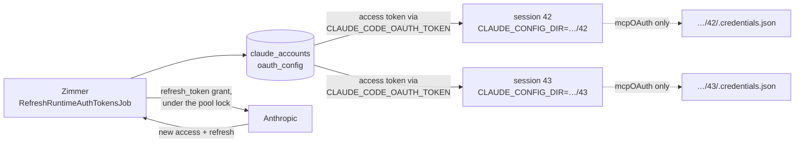
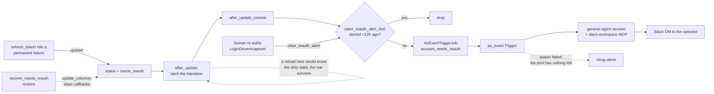
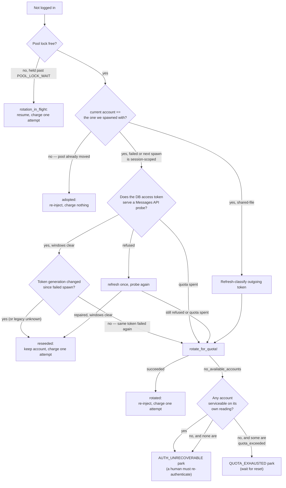
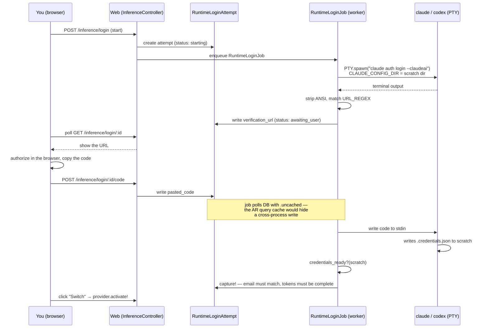

Zimmer keeps a pool of vendor accounts and rotates between them when one hits its rate limit.
That's the feature. Underneath it is the most fragile machinery in the project, and it's fragile for
a reason that isn't Zimmer's fault.

:::danger[This is built on an undocumented, moving target]
`docs/CLAUDE_CODE_OAUTH_ASSUMPTIONS.md` (now folded into this page and
[Known limitations](/limitations/)) exists because Zimmer automates OAuth token management on top
of Claude Code's OAuth implementation, which is an undocumented internal. Every constant below (the
token endpoint, the CLI's client ID, the file paths, the on-disk JSON shape, the login prompt text)
is a fact about someone else's private implementation that can change without notice.

The assumptions doc was last verified against CLI `2.1.177` on 2026-06-14. Two production
outages caused by exactly this are written up in the source.
:::

## The model

`ClaudeAccount` is the pool for both runtimes, discriminated by a `runtime` column
(`claude_code` | `codex`). The naming is a leftover.

Everything goes through `RuntimeAuthProvider.for(runtime)` → `ClaudeAuthProvider` or
`CodexAuthProvider`.

| | Claude | Codex |
| --- | --- | --- |
| Token endpoint | `platform.claude.com/v1/oauth/token` | `auth.openai.com/oauth/token` |
| Client ID | `9d1c250a-e61b-44d9-88ed-5944d1962f5e` (the CLI's public ID) | `app_EMoamEEZ73f0CkXaXp7hrann` |
| Files | `~/.claude.json` (identity), `~/.claude/.credentials.json` (tokens) | `~/.codex/auth.json` |
| Token TTL | from `expiresAt` (~8h, inferred) | 24h, inferred — `auth.json` has no expiry field |
| Rotation | `AccountRotationService`, 5-minute interval | inline in the provider, 24h |
| Identity check on capture | email must match | none |

## Session-scoped credentials: the DB owns the chain

**Setting:** Settings → Experimental → *Session-scoped Claude credentials*. Ships **off**.

With it on, every Claude Code session spawns with its own `CLAUDE_CONFIG_DIR` and is handed a
subscription **access** token through `CLAUDE_CODE_OAUTH_TOKEN`. It receives no refresh token, so it
cannot rotate the chain — which is what makes "log in once, ever; Zimmer refreshes centrally" true
rather than aspirational. The shared `~/.claude/.credentials.json` stops being a source of truth
for subscription tokens entirely.


```mermaid
flowchart LR
    DB[(claude_accounts<br/>oauth_config)]
    Z[Zimmer<br/>RefreshRuntimeAuthTokensJob]
    S1[session 42<br/>CLAUDE_CONFIG_DIR=…/42]
    S2[session 43<br/>CLAUDE_CONFIG_DIR=…/43]
    V[Anthropic]

    DB -->|access token via<br/>CLAUDE_CODE_OAUTH_TOKEN| S1
    DB -->|access token via<br/>CLAUDE_CODE_OAUTH_TOKEN| S2
    Z -->|refresh_token grant,<br/>under the pool lock| V
    V -->|new access + refresh| Z
    Z --> DB
    S1 -.->|mcpOAuth only| F1[…/42/.credentials.json]
    S2 -.->|mcpOAuth only| F2[…/43/.credentials.json]
```

Only Zimmer refreshes, under the pool lock it already had. Nothing else holds a refresh token, so
there is no second writer to lose a race to.

That ownership applies to every part of a refresh: while the setting is on, Zimmer does not import
the shared file before a request, re-read it after a rejection, or write the rotated pair back to
it. The file remains in place only so disabling the setting can restore the shared-file behavior.

### Why this rather than more guards

`~/.claude/.credentials.json` had three writers and no owner. On 2026-08-22 Zimmer's convergence
write put a spent refresh token over the live one the CLI had rotated to; the CLI presented it,
Anthropic answered `invalid_grant`, and the CLI blanked its own tokens. The credential then existed
in **neither** store — data loss, not drift, which is why re-auth-and-wait never healed it. See
[#618](https://github.com/tadasant/zimmer/issues/618).

Every mechanism on this page below the fold — the owner marker, the completeness guards, the
symmetric write guard, `sync_tokens_from_filesystem!` — exists to make that one file safe to share.
This removes the sharing instead.

### What the CLI actually does under it

Measured on CLI 2.1.240/2.1.241, against a scratch config dir on the production worker:

| Question | Answer |
| --- | --- |
| Do OAuth MCP servers work with only an `mcpOAuth` block seeded? | Yes — connected and tools callable |
| Does the CLI write a `claudeAiOauth` block? | **No.** Top-level keys after a run: `["mcpOAuth"]` |
| Where does a rotated MCP token land? | `$CLAUDE_CONFIG_DIR/.credentials.json`, `mcpOAuth` only |
| stdio and static-header servers? | Unaffected — the credential store is not in their path |
| Does `--resume` still work? | Yes, as long as the config dir is stable per session |
| Does `~/.claude/.credentials.json` change? | No — byte-identical before and after |

The file that remains cannot destroy a subscription chain, because it never contains one.

Two behavioural differences worth knowing. The CLI writes no `oauthAccount` into the scratch
`.claude.json`, so there is no filesystem identity to reconcile against — which is why the
reconciliation surface could be deleted rather than fixed. And an env-var session gets
`user:inference` scope only, which disables Claude-in-Chrome; Zimmer needs inference and MCP, both
of which work.

### The per-session directory

`ClaudeSessionConfigDirectory` resolves `~/.zimmer/claude-config/<session_id>` — a sibling of the
clones base, inside the same durable `zimmer_data` volume, so a deploy does not destroy it.

It is keyed on the session id and **stable for that session's whole life**, which is load-bearing
rather than tidy: Claude Code keeps its conversation state under `CLAUDE_CONFIG_DIR`, so
`claude --resume <id>` only works when every invocation sees the same directory. "Fresh per session"
means fresh per *Zimmer* session, not per process — a Zimmer session is a long-lived record resumed
by many short CLI processes (p99 runtime 0.09h, max 1.27h over 42,971 runs, against an 8-hour token
TTL: a token fixed at spawn has >6x headroom and needs no mid-process re-seeding).

`projects/` inside it is a **symlink** to the shared `~/.claude/projects`. `CLAUDE_CONFIG_DIR`
relocates the transcript tree as well as the credentials, and Zimmer reads transcripts from the
shared path in a dozen places. Credentials are what needs isolating; transcripts are not. The
directory is reclaimed with the session's scratch dir, and the cleanup deletes the symlink rather
than following it.

### MCP OAuth under it

`ClaudeMcpCredentialWriter.for_session` points the writer at the session's own file. Rotated tokens
are captured back by `McpOauthRuntimeReconciler`, unchanged — same `server_name|sha256(…)[0,16]`
keys, same adoption rule, just a different path. This is strictly better than the shared file: one
writer per file means the read-modify-write no longer races every other session on the worker.

One gap: `RefreshMcpOauthTokensJob` has no session to scope to, so the cron reads and writes the
host-global file. Revoking a credential through `delete_runtime_credentials` reaches the revoking
session's own store, but a *different* session already running keeps its copy until it ends. New
sessions get fresh directories, so the window is one session's lifetime.

Which store a session uses is decided by one predicate, `ClaudeSessionConfigDirectory.active_for?`.
MCP injection happens before the spawn env is built, and the spawn env fails open when the pool has
no current account holding a token — so two independent reads of the setting would put a session's
MCP tokens in a directory the CLI was never pointed at, and every OAuth server in it would come up
unauthenticated with nothing in the log to say why.

### Turning it on, and rolling it back

On: Settings → Experimental → *Session-scoped Claude credentials* → Save. It takes effect on the
next session spawn; nothing needs restarting and nothing needs a shell on the box. A `claude`
process already running keeps the environment it was spawned with — but a Zimmer session is not one
process, so the next turn of a `waiting` or `needs_input` session re-spawns under the new setting,
with a fresh `CLAUDE_CONFIG_DIR` and none of the CLI's own `.claude.json` history. The conversation
carries (Zimmer resumes from the transcript); the CLI's local state does not.

Back off: untick the same box. The shared-file machinery is untouched and still converges — the next
`ensure_active_account!` writes the DB-current account's credentials to
`~/.claude/.credentials.json` and stamps the owner marker. That is what makes this a rollback rather
than a migration, and it is why the machinery documented below still exists.

The one thing the rollback does **not** restore is the operator-facing reconciliation surface. The
"Filesystem identity mismatch" banner, the "Sync from filesystem" button and its route,
`ClaudeAccount.sync_from_filesystem!`, `ClaudeAccount.filesystem_oauth_email`, and Claude's
`reconcile_filesystem_identity!` are gone in both worlds — as is the filesystem auto-capture that
`bin/rails claude_accounts:add` used to perform, which now points at the Authenticate button instead. Asking an operator to adjudicate between
two stores was never the right answer to a disagreement, and the banner's own copy told them to run
a `bin/rails` command on the worker — which
[production invariant 11](/operate/deploying/) forbids. `/inference` now has two verbs for an account,
**Authenticate** and **Switch**, and nothing that asks anyone to reconcile, adopt or sync.

## Deleting an account keeps its history

Delete is a real delete: the `claude_accounts` row goes, and the account leaves the pool.
What does **not** go is the record of how it behaved. Its quota snapshots, its login
attempts, and every rotation event pointing at it are detached (`dependent: :nullify`)
rather than destroyed.

That is not tidiness, it is a diagnosis problem. The operator response to a misbehaving
account is "delete it and re-authenticate" — the two buttons sit side by side on every
`/inference` card — and the cascade used to take the evidence with it. On 2026-07-31 an
account was deleted and re-added, and the replacement row read `Quota snapshots: None`
plus one login attempt: indistinguishable from an account that had never once completed
a call. The row was thirty minutes old and said nothing about the credential at all.

`:restrict_with_error` would have preserved the same history by refusing the delete, and
was rejected on those grounds: any account old enough to be worth diagnosing has history,
so Delete would become a control that only ever errors.

A detached row still has to name who it was for, or it preserves bytes rather than
evidence. Each carries the identity at write time:

| Table | Carries | Why |
| --- | --- | --- |
| `claude_account_quota_snapshots` | `account_email`, `account_runtime` | a reading attributable to nobody answers nothing |
| `runtime_login_attempts` | `account_email` | "did this credential ever log in?" outlives the account, within the 1-day attempt retention window `CleanupRuntimeLoginAttemptsJob` already enforced |
| `account_rotation_events` | `rotated_from_email`, `rotated_to_email`, `runtime` | the pool moved *from* and *to* something, and `/inference` filters the table by runtime |

The rotation table's `runtime` column is load-bearing. `/inference` used to scope rotation
history by joining to the target account's runtime, which an event whose target has been
deleted cannot satisfy — so preserving the event without it would have dropped the event
off the page it exists to inform. The preserved emails also restore a distinction the old
`:nullify` on `rotated_from_id` erased: a nil source with no email is a rotation that
genuinely had no source (a bootstrap), and a nil source *with* an email is one whose
source was deleted. The page labels the second kind "deleted".

Two consequences worth knowing:

- Re-adding the same email creates a **new** account row that inherits none of the old
  one's history. The history is still there, attached to the email rather than to the new
  id — readable in the rotation log and in `/supervisor`, not on the new card. The
  `.ao-credentials-owner.json` marker is keyed by email and so *is* inherited, which is
  the same identity mismatch [#241](https://github.com/tadasant/zimmer/issues/241) closes
  with: filesystem ownership and history disagree about what "the same account" means.
- `claude_accounts:clear_all` / `codex_accounts:clear_all` still destroy everything, detached
  rows included — they find those by the denormalized runtime, since there is no foreign key
  left to find them by. They are the deliberate start-over affordance, and they say so.
- Nothing else removes a detached quota snapshot. `claude_account_quota_snapshots` has no prune
  job, so an account's readings are now permanent unless `clear_all` takes them. See
  [limitations](/limitations/).

## The refresh loop

`RefreshRuntimeAuthTokensJob` runs every 5 minutes:

```mermaid
sequenceDiagram
    participant C as Cron (*/5)
    participant P as RuntimeAuthProvider
    participant FS as Filesystem
    participant DB as Postgres
    participant V as Vendor (Anthropic/OpenAI)

    C->>P: for each registered provider
    P->>FS: reconcile_filesystem_identity!
    Note over P,FS: Codex only — Claude does not implement this hook.<br/>Adopting an identity off a container-local file on a<br/>5-minute timer is how a stale one got adopted (#618)
    P->>FS: ClaudeCredentialHealth.self_heal!
    Note over P,FS: rewrite a corrupt credentials file from the DB.<br/>Skipped under session-scoped credentials —<br/>no session reads that file
    P->>FS: sync_current_account_tokens!
    Note over P,FS: the CLI refreshes tokens on its own, mid-session —<br/>scrape them back or our DB copy goes stale.<br/>Skipped under session-scoped credentials
    P->>DB: needs_reauth_recovery_candidates
    P->>V: recover_needs_reauth (probe refresh)
    P->>DB: accounts_needing_refresh<br/>(expiring within 15 min)
    loop each account, under row lock
        P->>V: POST /oauth/token (grant_type=refresh_token)
        alt 2xx
            V-->>P: new access + NEW refresh token
            P->>DB: persist BOTH atomically
            P->>FS: write to disk IF this account is current
        else the credential is dead<br/>(401, 404, expired, revoked)
            P->>DB: status = needs_reauth
        else the VALUE is stale<br/>(invalid_grant "not found or invalid",<br/>refresh_token_reused)
            P->>DB: count a strike; condemn only on the<br/>third, spread over 30+ min. No retry —<br/>the same value would be rejected again
            Note over P,DB: unless the sync was skipped for corruption —<br/>then nothing can move the row on, and it<br/>escalates to an operator alert instead
        else transient
            P->>C: re-enqueue with backoff (2/4/8 min, max 3)
        end
    end
```

The refresh threshold is 15 minutes on a 5-minute cron — three chances to catch a token before it
expires.

### Refresh tokens are single-use and rotating

Every refresh returns a new refresh token and invalidates the old one — *and* invalidates the
sibling access token. Two consequences the code has to defend against:

1. The new pair must be persisted atomically. A crash between "got new tokens" and "wrote them"
   bricks the account. `refresh_token!` writes both in one `update!`.
2. A future `expiresAt` is not proof a token is live. If someone else refreshed, your
   still-unexpired access token is already dead. The code does *not* enforce this — `token_expired?`
   still keys purely off `expiresAt`. The defense is the completeness invariant.

A credential set with no refresh token is a dead end. `ClaudeAccount.complete_claude_oauth?`
refuses to persist or adopt one, because the CLI sometimes rewrites `.credentials.json` *without* the
`claudeAiOauth` block at all, and adopting that blindly would brick the whole pool.

### Whose tokens are on disk

Only the **owner marker** answers this, via `ClaudeAccount.credentials_owner_email` — never
`~/.claude.json`. The two files have different durability: the marker lives in the shared volume
beside the credentials it describes, while `~/.claude.json` lives in the container's writable layer
and is destroyed every time the container is replaced. A container replacement therefore keeps the
tokens and loses the identity — and a reader that trusted the identity file would give a confident,
wrong answer about a credentials file that never changed.

Nothing derives an identity from `~/.claude.json` any more. The two readers that touch it use it only
to **contradict** a claim the marker makes (`filesystem_identity_agrees?`) or under an exact email
match (`backfill_identity_from_filesystem!`). The path that used to adopt it — the `/inference` banner
and the 5-minute `reconcile_filesystem_identity!` sweep — is gone; see
[Session-scoped credentials](#session-scoped-credentials-the-db-owns-the-chain).

## The credentials-owner marker

Here is the structural problem the marker solves.

In the deployment shape this code was written for, `~/.claude.json` (identity) is container-local
while `~/.claude/.credentials.json` (tokens) is a shared bind-mount. So any code that reads the
local identity file to decide *who owns the shared tokens* gets a confidently wrong answer on the
wrong container. That is the root cause of the 2026-06-11 cross-account token-contamination outage.

The fix: a marker file, `~/.claude/.ao-credentials-owner.json`, written next to the shared tokens,
recording which account they belong to. `filesystem_credentials_owned_by_self?` gates the sync.

There is no fallback when the marker is absent. `filesystem_credentials_owned_by_self?` returns
`false` and the sync is skipped — deliberately, because the only other identity available is the
container-local `~/.claude.json`, the file whose cross-container divergence caused the outage in the
first place. A skipped sync loses at most one round of runtime-rotated tokens; a wrong answer grafts
one account's tokens onto another's row. Zimmer stamps the marker on its next credential write
(`ensure_active_account!`, every `write_config!`), and the sync resumes from there.

## One credential file, three writers

`~/.claude/.credentials.json` is not owned by any one component. Zimmer writes the `claudeAiOauth`
block (the subscription tokens, from `ClaudeAccount#write_credentials_to_filesystem!`) and the
`mcpOAuth` map (per-server MCP tokens, from `ClaudeMcpCredentialWriter`), and the Claude Code CLI
rewrites both at runtime. So no writer may write the whole file from its own snapshot — a plain
`File.write` of one block's blob discards whatever is in the other.

`ClaudeCredentialStore` is the discipline that makes that safe, and both Zimmer writers go through
it:

- **one lock file** — `~/.claude/.zimmer-credential-store.lock`, `flock`-held across the whole
  read-modify-write, derived from the credentials path's directory. It serializes overlapping
  sessions' MCP injections *and* an account rotation landing in the middle of one.
- **one atomic write** — temp file + `rename`, mode `0600`, so a concurrent reader never sees a
  half-written store.
- **read-merge, never overwrite** — the account writer layers its stored blob over what is on disk
  and leaves `mcpOAuth` exactly as found. It also stamps the owner marker *inside* the lock, so the
  marker can never end up naming an account whose tokens two interleaved writes replaced.

`mcpOAuth` is the only block carved out, and it runs in both directions — on disk it wins even when
it is absent:
`sync_tokens_from_filesystem!` captures the *whole* file into `oauth_config`, so an account's DB copy
carries a snapshot of whatever MCP entries existed at capture time. Writing that copy back would
clobber entries authorized since and resurrect entries `McpOauthCredential` deliberately deleted —
which is exactly the resurrection `ClaudeMcpCredentialWriter#delete_credentials` exists to prevent.
MCP state belongs to the MCP writer, which re-injects it on every spawn.

For any *other* key present in both, the account's copy wins. That direction is deliberate: the write
exists to make the file describe the incoming account, and deferring to disk for some future
account-scoped block would leave the outgoing account's data there — the contamination the marker
exists to prevent. A host-scoped block Zimmer doesn't know about is the milder mistake, and the fix
is to name it in `credentials_blob_for_disk` alongside `mcpOAuth`.

Until [#60](https://github.com/tadasant/zimmer/issues/60), the account writer did a whole-file
overwrite instead, so rotating accounts dropped every MCP OAuth credential on the box — and the user
met it as *"the agent says it needs to authorize this server again."*

### The guard runs in both directions

There have always been two ways for one store to poison the other, and until
[#618](https://github.com/tadasant/zimmer/issues/618) only one of them was guarded.

**Filesystem → DB** has always been guarded. `sync_tokens_from_filesystem!` refuses to adopt a
credential set missing an `accessToken` or a `refreshToken`, because the CLI is known to rewrite the
file without them and adopting that would brick the account the moment its access token expired.

**DB → filesystem** was not, and on 2026-08-22 that cost a credential outright. The CLI had rotated
the refresh token on disk; Zimmer's DB copy was the previous, now-spent value; Zimmer converged the
filesystem and wrote the spent value over the live one. The CLI presented it, Anthropic answered
`invalid_grant`, and the CLI blanked its own `accessToken` and `refreshToken` in place. The live
credential existed in neither store any more, which is why re-authenticating and waiting never healed
it — for three hours, at roughly 95 rejected refreshes an hour.

So `write_credentials_to_filesystem!` now checks, inside the store lock and immediately before the
overwrite, whether the file it is about to replace holds a **complete pair that belongs to this
account and is strictly newer than the one being written**. When it does, the disk is right and the
DB is stale: Zimmer captures the on-disk pair into `oauth_config` and writes *that* back instead. The
write still happens — the `mcpOAuth` block and the owner marker both need it — it just no longer
moves the credential backwards.

"Newer" is `claudeAiOauth.expiresAt`, the only ordering the two blobs share, and both sides are first
bounded by `ClaudeAccount::CREDIBLE_EXPIRY_HORIZON` (30 days). Anthropic issues 8-hour access tokens,
so a timestamp beyond that horizon is corrupt bookkeeping rather than a very fresh credential, and
treating it as no information at all keeps it from winning a comparison in either direction.

The guard is deliberately narrow. It declines when the marker names a different account (overwriting
*is* the intent of a switch — `capture_outgoing_filesystem_tokens` is what saves that account's copy),
when the on-disk pair is incomplete (that is the corruption case, and rewriting it is the repair), and
when the two pairs are the same. A caller holding a credential that is newer by construction — a
human's interactive login — passes `force: true`.

### Corruption is loud, and repairs itself

`ClaudeCredentialHealth` classifies the shared file as `:ok`, `:absent`, `:mcp_only` or `:corrupt`.
Only `:corrupt` — a `claudeAiOauth` block whose tokens are missing or blanked — is a fault; the other
two "no subscription tokens here" states are what a fresh worker legitimately looks like.

That state now has all three of the things the 2026-08-22 corruption had none of:

- **a surface** — the *Agent Authentication* card on `/health`, critical while the file is corrupt,
  and folded into the dashboard's overall status. `CliStatusService` reads the same classification
  for the Claude Code tile on the CLI status page, because no `claude` invocation can answer
  "is the stored credential usable" — see [Limitations](/limitations/).
- **a repair** — `ClaudeCredentialHealth.self_heal!` runs on every
  `RefreshRuntimeAuthTokensJob` sweep and rewrites a corrupt file from the owning account's stored
  credentials. A corrupt file has no tokens to lose, so the write cannot destroy anything. It
  declines when the stored copy is *itself* incomplete, and — less obviously — when the stored copy
  has been **rejected as spent within the strike window**. Restoring a spent pair would put the file
  back into `:ok`, silence the alarm, and hand the CLI a token Anthropic refuses, which is how the
  CLI blanked its own tokens in the first place; on a five-minute cron that is Zimmer fighting the
  CLI rather than healing it. The health card reports the decline reason rather than promising a
  repair, because those two cases need different things from the operator.
- **an escalation** — when the repair *cannot* work (the stored copy is broken too) and the same
  account's refresh is then rejected as stale, both halves of the deadlock are true at once: the
  value Zimmer holds is spent and the sync that would replace it is being skipped every sweep. The
  `:stale` handler's stated plan — "wait for the next sweep, by then a filesystem sync may have moved
  the row on" — is then false forever. Zimmer logs it at `.error` and raises an operator alert instead
  of waiting again.

### Does the filesystem agree with the DB?

*(Shared-file path only. Under session-scoped credentials there is no config file to agree with, and
`ensure_active_account!` reduces to "is a usable account current, and is its token fresh".)*

Before each session spawn, `AccountRotationService#ensure_active_account!` compares the identity in
`~/.claude.json` against the identity stored on the DB-current account. Agreement means the worker is
already set up for that account; disagreement means the DB is what gets written to disk. **The DB
always wins** — there is no branch that adopts an identity off the filesystem, because a file that
Zimmer and the CLI both write is not evidence of who the pool should be running as.

`config_file_matches?` **fails closed**: an account with no stored identity to compare answers "no
match", not "can't verify, assume ok" ([#61](https://github.com/tadasant/zimmer/issues/61)). A guard
that returns *ok* when it cannot verify is not a guard, and the unverifiable case — an account holding
credentials but no identity — is exactly the one where the tokens on disk could belong to anyone.

Failing closed alone would leave such an account rewriting the filesystem on every spawn and arriving
at the same unanswerable question next time, so the check converges instead:
`ClaudeAccount#backfill_identity_from_filesystem!` adopts the on-disk `~/.claude.json` **when that
file already names this account**. Identity only, never credentials; it fills a gap and never
overwrites a stored identity. From then on the comparison has something to compare. When the file
names somebody else there is nothing to adopt, and the caller writes the DB-current account to disk.

## Rotation on quota

When an account hits its rate limit, Zimmer rotates to the next one by priority:

1. Sync the outgoing account's tokens off disk.
2. Snapshot its quota state.
3. Label the outgoing account **on evidence** — see [A rotation is not evidence about quota](#a-rotation-is-not-evidence-about-quota).
4. `activate_next_account` — which skips a candidate whose latest snapshot says its weekly window is
   spent, then validates the survivor by calling `refresh_token!` before activating it. A broken or
   capped account is skipped before it can be handed to a session.
5. Write the new account's config and credentials to disk, stamp the owner marker.
6. Record an `AccountRotationEvent`.

Steps 1–6 run under the per-runtime pool lock (`ClaudeAccount.with_pool_lock`), and the caller
passes the identity its session was running as. A stampede — N sessions hitting the same account's
quota within seconds — therefore produces **one** rotation: the first racer moves the pool, and
every racer behind it finds the pool already off the account it was complaining about and returns
that new account instead of rotating again.

:::caution[Without that, a stampede drained the pool]
Anthropic's refresh tokens are single-use. Unserialized, N racers read the same `current`, selected
the same successor, and each called `refresh_token!` on it; the first rotated the token and the rest
got `invalid_grant`, which was read as permanently dead and marked `needs_reauth`. Four different
accounts died that way in ten days, and `account_rotation_events` carries the fingerprint —
duplicate and triplicate `from → to` pairs seconds apart. Serializing stops the concurrent refresh;
collapsing stops the serialized racers from each burning one more account.
See [#242](https://github.com/tadasant/zimmer/issues/242).
:::

### A rotation is not evidence about quota

Step 3 used to be an unconditional `mark_quota_exceeded!` on whatever account the rotation was
leaving, whatever it was leaving for. For a rotation on `auth_recovery` that label is a fabrication:
the runtime said "Not logged in", which says nothing about quota — and because `status` is what
`ClaudeAccount.available` reads, fabricating it does not merely mislabel one account, it removes it
from the pool.

So the outgoing account is labelled only when something observed says so:

| Observed | Outcome |
| --- | --- |
| already `needs_reauth`, or already `quota_exceeded` | left alone — the two statuses drive different recoveries, and marking twice counts one wall as two quota hits on `/inference` |
| the reading step 2 just took says either window is spent | `quota_exceeded`, whatever the rotation was for — a live reading is the strongest evidence there is |
| the caller rotated **for** a quota wall (`reason: "quota_exceeded"`) | `quota_exceeded` — it watched the runtime refuse the request, which is evidence even when the probe could not be taken |
| anything else | left `active` |

A reason the list does not recognise falls in the last row. Over-labelling is the failure this rule
exists to prevent, so a new rotation reason has to opt in rather than be assumed in.

The reading is asked as `!windows_clear?` — the same predicate `effective_status` renders and
`QuotaResetCheckerJob` restores on — so a label rotation writes is one the rest of the app honours.
The narrower `five_hour_window_spent?` would write labels `windows_clear?` immediately overrules: a
mark nothing acts on, over an account every spawn path still refuses.

`CodexAuthProvider#rotate_under_lock` applies the same reason gate, and it is the *only* gate it can
apply: a Codex account carries no Anthropic quota window to probe, so there is no reading to weigh.
That also makes the mistake permanent on that side rather than merely slow — `QuotaResetCheckerJob`
is Claude-only, so nothing ever restores a Codex account labelled by mistake.

:::caution[Without that, one blanked credential read as a drained pool]
At 02:05Z on 2026-08-23 a Claude account's OAuth tokens were blanked to empty strings, so every
session on the worker was logged out at once. Each one rotated away from the account it was holding;
each rotation stamped `quota_exceeded` on the account it left; in about forty seconds every row in
the pool wore the label with no quota reading behind any of it. `activate_next_account` then ran out
of candidates, `park_reason_for_pool` read the labels, and four sessions were parked with *"Quota
exceeded across all Claude Code accounts"* against a noon reset estimate — ten hours out.

The proof the labels were invented: `QuotaResetCheckerJob` restored all three accounts minutes
later, on their own readings, and it only restores an account whose snapshot is `windows_clear?`.
The `/inference` badge had been working around these labels since
[#426](https://github.com/tadasant/zimmer/issues/426); the parking decision was still reading them
raw.
:::

## Refreshing a token without burning it

Both vendors issue **single-use** refresh tokens: a successful refresh returns a new pair and
invalidates the old one. Present a spent one and Anthropic answers `invalid_grant`, OpenAI
`refresh_token_reused` — and neither response can tell you whether the credential is dead or whether
somebody else simply got there first.

`ClaudeAccount#refresh_token!` has nine call sites (the Inference page ×4, `QuotaResetCheckerJob` ×2,
rotation, activation, and the 5-minute `RefreshRuntimeAuthTokensJob` sweep), so both protections live
in that one method rather than at each of them:

1. **A row lock across the whole read-refresh-persist sequence** — the only scope that can promise
   the token being presented is the token still held. On acquiring it the method re-reads the row: if
   another caller rotated the token while this one queued, their refresh *is* this one's refresh, so
   it reports success rather than spending a token nobody has used yet.
2. **A lost-race check before condemning anything.** The lock excludes other Zimmer callers but not
   the agent CLI, which rotates the shared credential file mid-session. So on a permanent-looking
   failure the method re-syncs from disk and compares: if the token of record has moved on from the
   one it presented, this was a lost race, and the account stays `active` instead of going
   `needs_reauth`.
3. **Strikes, for the failures that check cannot see.** The disk holds one account's credentials at a
   time, so the lost-race check has evidence only for the account that owns them — for the other five
   in the pool it answers "not a race" because it has nothing to compare, not because nothing raced.
   Condemning on that answer condemns on nothing, so it no longer does: see below.

Both are runtime-agnostic — the Codex path has the same single-use semantics and gets the same
protections. API-key Codex accounts skip the lock entirely: nothing to rotate, no race to lose.

### A rejected value is not a dead credential

An `invalid_grant` means one of two unrelated things, and the HTTP status cannot tell them apart. The
**description** can:

| Vendor says | Means | Zimmer does |
| --- | --- | --- |
| `invalid_grant` + `Refresh token expired` (or *revoked*), `401`, `404`, `invalid_client`, `unauthorized_client` | the credential is finished | mark `needs_reauth` at once — unless the lost-race check can prove the token moved on disk, which still spares it |
| `invalid_grant` + `Refresh token not found or invalid`, or OpenAI's `refresh_token_reused` | the **value** we sent is not the current one; the chain behind it is usually alive | count a strike, leave the account `active` |
| anything else (5xx, an unparseable body) | the refresh path may be broken | log at `.error`, change nothing |

Three strikes condemn the account, and only if they are spread out: `refresh_token!` has nine call
sites and several of them can present the same spent value within minutes of each other, so a second
rejection within 15 minutes of the last is the same episode and counts once. Three strikes therefore
take at least half an hour. A streak expires six hours after its *most recent* strike, and any new
refresh token — from a successful refresh, a filesystem sync, or a human re-authenticating on
`/inference` — resets the count, because a new token is a new chain. The count lives on
`claude_accounts.stale_refresh_failures` / `last_stale_refresh_failure_at` and is shown on the
account's Administrate record page.

A `:stale` rejection is also **not** retried. The 5-minute sweep's retry ladder (2 + 4 + 8 minutes)
exists for network blips; replaying a value the vendor has already rejected just spends three more
requests to be told the same thing, and the ladder ends in an `.error` nobody can act on. The
provider reports `:stale` as its own `Result` error kind and `RefreshRuntimeAuthTokensJob` logs it at
`.warn` and waits for the next sweep, by which time a filesystem sync or another caller's refresh may
have moved the row on.

A genuinely dead credential still reaches a human, roughly half an hour later than it used to. A
healthy account that lost a race no longer reaches one at all — which is the whole point, because
that was 14 of the 15 accounts condemned over an eleven-day window in production
([#530](https://github.com/tadasant/zimmer/issues/530)).

### Never lose a token you just minted

The vendor spends the presented token the moment it answers, so between the 200 and the commit, the
row holds the **only** copy of the credential chain. Persisting it is therefore the step that must not
fail — and the filesystem write that follows is the step that can (a credential-store lock timeout, a
full disk). It used to run inside the same transaction, where a raise would roll the new pair back and
orphan the chain: an account whose stored token is spent forever, which every later refresh reads as
`invalid_grant` and which no recovery probe can revive. It is now rescued and logged.

Rescuing alone would not be enough, because the file left on disk is the pair Zimmer just spent and
the owner marker still vouches for it — so the next `sync_tokens_from_filesystem!` would adopt it and
overwrite the live token with the dead one, arriving at the same orphaned chain by a slower route. So
the rescue also **disowns the marker**, stamping it with `ClaudeAccount::UNOWNED_CREDENTIALS_MARKER`,
an address no account can match. Every marker-gated read of the credentials file then declines until a
successful write re-stamps a real owner, which `ensure_active_account!` does on the next session
spawn. Codex has no marker, so its sync answers the same question from `auth.json`'s `last_refresh`
and refuses tokens older than the ones it already holds.

Disk gets reconciled on the next spawn; a lost refresh token never does.

The lock is re-entrant with the outer `account.with_lock` in
`RuntimeAuthProvider#recover_needs_reauth` and in the sweep, so nesting is safe.

`QuotaResetCheckerJob` (every 15 min, **Claude only**) restores `quota_exceeded` accounts when
`ClaudeAccountQuotaSnapshot#windows_clear?` says both windows have cleared: each window's reset time
has passed, or its utilization has dropped below 100% — except that a weekly window the API is still
*rejecting* is never counted as clear, however far its counter has drifted. It then calls
`AuthOutageParkService.wake_parked_sessions!` so the sessions that were blocked on those accounts
resume in the same sweep — see [When the pool runs dry](#when-the-pool-runs-dry).

### The status column is sticky; the badge on Inference is not

`ClaudeAccount#status` is a durable column. Something writes `quota_exceeded` onto it and only the
15-minute sweep above ever writes `active` back. That makes it a claim about the past, and two things
routinely leave it stale:

- **A rotation can still outrun its own evidence.** `AccountRotationService#rotate_under_lock` no
  longer stamps whatever it rotates past ([A rotation is not evidence about
  quota](#a-rotation-is-not-evidence-about-quota)), but a rotation that DID have quota evidence at
  the time still leaves a label behind, and Claude's windows slide — the account is servable again
  well before the sweep next looks (see [Auth recovery can rotate away from an account that was
  fine](/limitations/#auth-recovery-can-rotate-away-from-an-account-that-was-fine)). What protects
  the next session meanwhile is that rotation validates a candidate at pick time.
- **The sweep is not guaranteed to run.** The deploy that froze every queue for ten hours
  ([#426](https://github.com/tadasant/zimmer/issues/426)) froze every label with them.

So the page does not render the column unquestioned. `ClaudeAccount#effective_status` derives what an
account *presents* from `windows_clear?` on its own latest snapshot — the same predicate the sweep
restores on — and the account-level badge and the pool tallies both read that. It is the
account-level counterpart of the staleness rule `InferenceHelper#window_status_badge` already applies
per window: a recorded status describes the window that was open when the reading was taken.

The derivation runs one way, and only one. It softens `quota_exceeded` to `active` when the reading
says the windows have cleared, and does nothing else: it never marks a healthy account, never touches
`needs_reauth` — which only a human clears — and falls back to the column whenever there is no
snapshot to judge by, which is every Codex account.

Every path that PICKS an account to spawn with keeps acting on the durable column —
`ClaudeAccount.available`, `AccountRotationService`, and the wake sweep that is about to start a
session — because a reading minutes old is not something to hand a session on. The column converges
separately: `InferenceController#auto_heal_accounts` runs on page load as well as on refresh, from the
same predicate, so looking at /inference is the other thing that can restore an account when the sweep
is the thing that has stopped. Only the account — the sessions parked on it still wait for the
sweep's `wake_parked_sessions!` or their own timer, because resuming sessions is not something a
page render should do.

Two decisions read the evidence instead, through `ClaudeAccount.serviceable_for` — the same
`windows_clear?` rule, applied to the whole pool at once. See [One predicate for "is the pool
drained"](#one-predicate-for-is-the-pool-drained).

### A dead account tells you so

`needs_reauth` is the one account failure Zimmer cannot recover from. The refresh token is
permanently invalid, the pool quietly stops drawing on the account, and everything keeps working —
with a smaller pool. Nothing surfaces it: the failure is logged at `.warn` precisely so it does *not*
page `#eng-alerts` (a channel alert for a condition only a human can clear is noise), and
`recover_needs_reauth` re-probes it forever without ever succeeding. The account just sits dead on
`/inference` until somebody happens to open the page.

So Zimmer tells you — but it does not compose the message itself. When a `ClaudeAccount` crosses
**into** `needs_reauth`, an `after_update_commit` callback emits the `account_needs_reauth`
[Zimmer event](/sessions/triggers/), and whatever `ao_event` Triggers watch that event fire. The one
this deployment ships spawns a `general-agent` session holding the `slack-workspace` MCP server, with
a prompt telling it to DM the operator, name the account, and say that fixing it means pressing
"Authenticate" on `/inference`.

The indirection is the point, and it replaced a native DM that never arrived. That path was
`ClaudeAccount` → `AccountReauthAlertJob` → `AccountReauthNotifier` → `AlertService.dm_operator` →
`SlackService.send_dm`, and it had three distinct ways to fail — an unset `OPERATOR_SLACK_USER_ID`,
a bot without the `im:write` scope `conversations.open` needs, and a dedup key stuck from an earlier
failure — each of which degraded to one `.warn` line and a `false`. Nothing surfaced any of them:
`AlertService.missing_configuration_details`, the boot-time health check, only ever checked the Slack
token and the channel id, never `operator_user_id`. A deployment could report itself fully configured
while dropping every DM it sent.

A Trigger cannot rot the same way. The notification is a session with a transcript you can read at
`/sessions`, its prompt tells the agent to fall back to the alerts channel and say so if the DM will
not send, and a fire that raises pages `#eng-alerts` through `AoEventTriggerJob`'s existing failure
handling. The trigger itself is a row at `/triggers`: editable, disable-able, and visible as a thing
that exists.

The transition is **latched during the save** (`after_update`) and only acted on after the commit,
which is not ceremony. `reload` nils `@mutations_before_last_save`, so a commit-time
`saved_change_to_status?` answers "nothing changed" whenever anything reloaded the record between the
write and the commit. `RefreshRuntimeAuthTokensJob` does exactly that: it wraps the refresh in an
outer `account.with_lock`, and `ClaudeAuthProvider#refresh!` reloads on its failure branch to decide
whether the error is `:needs_reauth` or `:transient`. `with_lock` opens a transaction without
`requires_new`, so `refresh_token!`'s inner lock joins it and the commit callback does not run until
that outer transaction commits — long after the reload. Asking at commit time meant the
every-5-minutes sweep, the likeliest discoverer of a dead refresh token, never DM'd at all. A plain
ivar survives `reload`; the dirty state does not.

A model callback rather than instrumentation at the sites that condemn an account, so no path can
forget to alert — including the Administrate admin form, which no service-level hook would see. Two
writes deliberately do *not* alert, and both fall out of that placement:

- **Creation.** `after_update_commit` does not fire on insert, so the credential-less account
  `/inference` seeds directly into `needs_reauth` stays silent. The human is on the page adding it.
- **Recovery restores.** `recover_needs_reauth` flips an already-dead account to `active` so
  `refresh_token!` is not status-blocked, then writes `needs_reauth` back with `update_columns` when
  the probe fails. `update_columns` skips callbacks, so that no-op round trip is silent — and the
  probe itself cannot condemn the account either, since `recovery_probe: true` returns before the
  permanent-failure branch. Without both, every recovery sweep would look like a fresh failure.

On top of that, the account itself carries the throttle: `claude_accounts.reauth_alerted_at`, checked
and stamped by a single conditional `UPDATE` (`ClaudeAccount#claim_reauth_alert_slot!`) that admits
one event per `REAUTH_ALERT_THROTTLE` (12 hours). Being one statement is what makes two workers
condemning the same account in the same instant produce one event rather than two.

It lives in the database rather than in `Rails.cache`, where its predecessor lived, because a
cache-backed suppressor **fails open**: with Redis unreachable, every crossing alerts. Under the old
design that was a duplicate DM. Under this one it is a spawned agent session per crossing — and an
account crosses into `needs_reauth` more often than it breaks, because plenty of machinery writes
`active` back onto a dead row (the auto-heal sweep on `/inference`, a recovery probe that happens to
succeed) and `ensure_active_account!` runs before every session spawn. The column is also readable
after the fact, which a cache key never was.

**Only a human re-authenticating releases it** — `ClaudeAccount#clear_reauth_alert!`, called from
`ClaudeLoginDriver#capture!` and its Codex twin, not from the status callback. That looks like the
more obvious place and is a trap: the same machinery above writes `active` with a plain `update!`
and no human involved, before every session spawn. Releasing there would drop the backstop moments
before `usable_candidate?` re-condemns the same account — one spawned session per spawn attempt on a
drained pool, which is the exact flood the window exists to prevent. The cost of the narrower rule is
that an account the recovery sweep fixes automatically, which then dies again inside 12 hours, waits
out the window before it can alert again.

A failed alert can never take down the auth path: the callback rescues anything the enqueue raises,
and the firing job runs asynchronously on the `triggers` queue.

**The circularity is real and is not solved, only bounded.** Reporting that an account is unusable
means spawning a session, and spawning a session needs a usable account. One dead account among six
is fine. A pool where *every* account is dead cannot spawn the session that would say so — and the
seeded trigger is `priority` rather than the `spot` that `ao_event` derives, precisely so the one
session whose job is to report a dead pool is not also gated behind a healthy one. When the spawn
fails anyway, `AoEventTriggerJob#handle_fire_failure` alerts `#eng-alerts`, which needs no account at
all. That is the floor: a channel post rather than a DM, but not silence.


```mermaid
flowchart LR
    R[refresh_token! hits a<br/>permanent failure] -->|update!| S[status = needs_reauth]
    S --> L[after_update:<br/>latch the transition]
    L -.->|a reload here would erase<br/>the dirty state; the ivar survives| L
    L --> C[after_update_commit]
    C --> D{claim_reauth_alert_slot!<br/>alerted &lt;12h ago?}
    D -->|yes| X[drop]
    D -->|no| E[AoEventTriggerJob<br/>account_needs_reauth]
    E --> T[ao_event Trigger]
    T --> G[general-agent session<br/>+ slack-workspace MCP]
    G --> DM[Slack DM to the operator]
    T -.->|spawn failed:<br/>the pool has nothing left| A[#eng-alerts]
    RC[recover_needs_reauth<br/>restore] -.->|update_columns:<br/>skips callbacks| S
    H[human re-auths<br/>LoginDriver#capture!] -->|clear_reauth_alert!| D
```

### An account can be capped without ever having been current

`mark_quota_exceeded!` used to fire only on the account that was current when a session hit a wall.
An account that filled its weekly window while sitting idle in the pool was never marked: it stayed
`active`, stayed in `ClaudeAccount.available`, and was the next thing rotation reached for — activate,
fail on the first request, rotate again ([#248](https://github.com/tadasant/zimmer/issues/248)).

Two changes close that, and they read the same predicate —
`ClaudeAccountQuotaSnapshot#seven_day_window_spent?`:

- **`QuotaSnapshotService` marks the account as the reading lands**, whichever path took it —
  rotation, a `/inference` page view, the reset checker's own probe. A reading that says the week is
  gone takes the account out of `available` there and then. It only ever moves an `active` account:
  `needs_reauth` is a different failure with a different recovery, and relabelling it would make an
  unusable pool look merely throttled.
- **Rotation and bootstrap refuse a capped candidate at pick time**, and mark it on the way past.
  That is what covers evidence recorded before the ingestion marking existed.

`QuotaResetCheckerJob` reads the same predicate to decide the account is *not* back yet, which is
what keeps the healer and the marker from flipping an account between states on every sweep.

### Bootstrap validates before it promotes

`ensure_active_account!` picks an account when nothing is current — a fresh install, a restarted
worker, a pool that has just been re-authenticated. It used to take `ClaudeAccount.available.first` on
faith, and `ensure_fresh_tokens!` swallows its own failure by design, so an account with a dead
refresh token became current anyway and every session on the instance failed to authenticate until a
human intervened ([#239](https://github.com/tadasant/zimmer/issues/239)).

It now walks the pool in priority order and takes the first candidate that is not capped and whose
token Anthropic actually honours. The probe is `QuotaCheckService#check_with_token`, **not**
`refresh_token!`: it reads the rate-limit headers off a one-token request, so it can be run over
candidates that may be skipped without spending a single-use refresh token. A candidate Anthropic
*refuses* is refreshed once and probed again — a stale access token is the one refusal a refresh can
fix — so the single-use token is spent only where it might help, never on a candidate whose
credentials already work. `ClaudeLoginDriver#capture!` applies the same probe through
`QuotaCheckService.token_rejected?`, because a login that produces a complete-looking token pair is
another way an unusable account enters the pool.

The probe answers three ways, and only one of them condemns an account: Anthropic honoured the token,
Anthropic answered and refused it, or **the probe never got an answer** (timeout, DNS failure, 5xx).
The last is evidence about the network, not the credential, so it does not skip the account — reading
an Anthropic outage as "every credential is dead" would park every session at once.

A successful probe is a live quota reading, so it is recorded as a snapshot rather than reduced to a
boolean. That is what lets bootstrap refuse an account whose weekly window is spent but which nothing
has ever probed — the case stored evidence cannot cover — and it leaves rotation with evidence about
an account that has never been current.

### What `/inference` reports for the pool

Anthropic meters two windows per account, 5-hour and 7-day, and the page shows both — per account,
and averaged across the pool.

The pool's 5-hour average is labelled **"Avg 5-Hour Utilization (effective)"** because it is not a
plain average of the 5-hour counters. An account whose 7-day window is spent — status `rejected`, or
the counter at its cap — cannot serve a request however much 5-hour headroom it reports, so it counts
as 100% in that average, and its card says *"Counted as 100% in the pool figure"* under the 5-hour
bar. An account at 29% on 5 hours and 100% on the week would otherwise pull the headline down and
advertise pool headroom that nothing can spend.

The correction runs one way. The 7-day average takes the 7-day counters as they are, because the
weekly window subsumes the 5-hour one: an account at its 5-hour cap is idle for minutes and then
serves again. A window whose reset time has passed reads as 0% on both axes, since the sliding window
has cleared and the last number Zimmer recorded for it is stale.

A status expires with its window for the same reason a counter does. Past its reset time a card shows
the green *"Window reset"* line and no status badge at all, rather than the `rejected` the reading
recorded — that status described a window that no longer exists, and leaving it up puts a red badge
beside the 0% the same snapshot renders. Before the reset the card names the wait instead: *"Resets
in 1d 4h"*, and *"Resets in &lt; 1m"* through the last minute, which has no whole unit left to report.

That wait is a value as of the render, not a live countdown. `/inference` is a static page with no
poller on the cards, so every figure — the wait, the bar, the badge — is the reading as it stood when
you loaded it and stays where you left it. *"Resets in &lt; 1m"* is therefore the one that goes stale
fastest, on a tab left open. Reload for the same snapshot re-read against the clock, or hit Refresh
for a live probe.

There is one definition of "spent", and it lives on the snapshot:
`ClaudeAccountQuotaSnapshot#seven_day_window_spent?` — the API status is blocking (`allowed` and
`allowed_warning` serve; anything else, including a value Anthropic adds later, blocks), or the
counter has reached the cap, in both cases only until that window's reset time passes. The page reads
it to decide what an account contributes, `QuotaSnapshotService` reads it to mark an account
`quota_exceeded` as the reading lands, rotation reads it to refuse a candidate, and
`QuotaResetCheckerJob` reads it to decide the account is not back yet. They used to disagree at the
`rejected`-but-under-100% edge, which meant the page called an account spent while the healer called
it clear.

Its counterpart is `#windows_clear?`, on the same model for the same reason: `QuotaResetCheckerJob`
restores an account on it, `InferenceController#auto_heal_accounts` heals one on it, and
`ClaudeAccount#effective_status` decides what badge /inference renders from it. It applies the
status-outranks-the-counter rule to **both** windows. The 5-hour one was counter-only until the badge
started deriving from this predicate, at which point a window the API reports as `rejected` at 90%
would have rendered "Rejected" beside an account badge reading "Active".

`pool_utilization_5h` itself is display-only — no scheduler or rotation path reads it. The underlying
snapshot numbers are not: `QuotaResetCheckerJob` and `InferenceController#auto_heal_accounts` flip
accounts back to `active` from them, and `QuotaSnapshotService` flips them out.

:::danger[Rotation is triggered by matching an English error string]
`ApiErrorRetryService::ACCOUNT_QUOTA_LIMIT_PATTERN`:

```ruby
/hit your\b.*\blimit\b.*\bresets\b/i
```

That regex, run against the **transcript message text**, is the sole trigger for the entire
multi-account rotation feature. That trigger is Anthropic's prose: a regex over transcript text,
with no HTTP status or structured error code behind it.

On 2026-06-14 the CLI changed "hit your limit" to "hit your session limit," which the regex
happens to still match. A previous wording change did not, and rotation silently stopped firing.
The session fell through to the transient-rate-limit path, retried six times against an
already-capped account, exhausted its retries, and failed, with no log line saying rotation should
have fired. The failure mode is silent.
Tracked in [#53](https://github.com/tadasant/zimmer/issues/53).
:::

## Mid-run auth loss

`AuthRecoveryService` watches the transcript for an authentication failure and, when the turn
**ends on one**, hands the decision to `AuthRecoveryCoordinator` rather than treating the exit as a
normal pause. Only the last main-chain `user` or `assistant` entry is eligible: runtime bookkeeping
entries are skipped, as are sidechain entries. An older auth error followed by successful assistant
output is a completed turn and is not recovered. This is the same terminal-conversation rule used
by [the API-error backstop](#a-turn-that-dies-on-an-api-error-can-never-look-finished), and it matters
for status-summary forks that import an existing transcript before appending their own successful
answer. Recovery is bounded by `MAX_RECOVERY_ATTEMPTS` attempts within `CONSECUTIVE_WINDOW`
(15 minutes).

It recognizes the failure two ways, and the order matters:

1. **The error type.** `AUTH_ERROR_TYPES` — `authentication_failed`, `oauth_error` — matched against
   the transcript entry's `error` field. This is the machine-readable half of the signature and the
   half that does not move when the prose does.
2. **The prose.** `AUTH_RECOVERABLE_ERROR_PATTERN` — `not logged in`, `please run /login`, `failed to
   authenticate`, `oauth/refresh/access token … expired|invalid|revoked`, `invalid_grant` — for the
   entries the runtime records with an *empty* error type, which is how
   `"Not logged in · Please run /login"` is recorded.

An entry the API typed as retryable (`api_error`, `rate_limit_error`) is never claimed on prose: a
transient upstream failure that happens to say *"Authentication failed: 401 from gateway"* belongs on
the backoff path, not on a path that spends an account rotation. The structured type wins both ways.

The prose net is deliberately wide, because here a false positive costs one rotation and a false
negative costs a lost turn. That trade does not travel: `SessionStatusSummaryHarvestJob` asks a
different question — *is this "summary" a refusal?* — where a false positive discards a real summary,
so it spells out its own two narrow patterns instead of importing this constant.

:::caution[Why the type is read first]
On 2026-08-20, Claude Code 2.1.237 ended a turn in production session 6412 with

```json
{"isApiErrorMessage":true,"error":"authentication_failed",
 "message":{"content":[{"type":"text",
   "text":"Failed to authenticate: OAuth session expired and could not be refreshed"}]}}
```

and exited **1** — its "turn finished, awaiting input" convention. The prose matched neither half of
the pattern Zimmer had, no classifier claimed the entry, and `handle_exit` logged *"Process exited
successfully"* and parked the session as `needs_input`. A human's message sat unanswered, and the
only trace was in the transcript. The account pool had already done its job: the refresh token for
the identity that session was holding had been rejected with `invalid_grant` seven minutes earlier
and the account marked `needs_reauth`. What failed was recognizing the *runtime's* report of it.
:::

### A turn that dies on an API error can never look finished

Reading the error type makes *this* wording classifiable. It does nothing about the next one, so
`handle_exit` also asks a question that has no prose in it at all.

`ApiErrorRetryService#terminal_api_error` answers *did this turn die on an API error?* — is the
**last conversational entry** in the transcript an `isApiErrorMessage`. Only `user` and `assistant`
entries count on either side of the question: the runtime writes `last-prompt`, `atis-latch`,
`attachment` and `queue-operation` bookkeeping after the final message, and `isSidechain` entries
belong to a subagent whose failure does not end the main turn. Unlike every other transcript reader
it ignores `api_error_last_checked_line` — that cursor exists to stop a *handled* error being retried
twice, and a terminal error is by definition the one that just ended this turn.

It does **not** filter by classifier, and that matters. `handle_exit` asks it last, after every
specific branch has looked at the same exit and declined, so an answer means nobody is handling a
turn that plainly died — which covers a wording nothing recognises *and* the case where a classifier
does recognise it but has already spent its cursor on it. That second case is reachable: a 5xx is
retried, `api_error_last_checked_line` advances past it, the respawn writes nothing and exits 1, and
every branch now says "not mine" about a transcript whose last word is still that 5xx.

When it answers yes, the session **fails**, loudly, and the prose goes into the session log under the
`terminal_api_error` failure reason. Whether it also *alerts* is the one thing the recognised/
unrecognised distinction decides: an unknown wording goes to `UnclassifiedFailureReporter` (deduped
per runtime, so a fleet-wide wave is one Slack message), while a recognised one has already been
through its own classifier and is a dead turn rather than an unknown failure mode. Failing is the
honest verdict either way — the turn is over, its work did not happen, and the prompt is sitting
unanswered — where `needs_input` said the opposite of all three.

The backstop fires **once per dead turn**: it records the transcript line it fired on in
`metadata["terminal_api_error_line"]`, so a resume that writes nothing new leaves the same entry
terminal without re-failing the session and re-alerting on it.

So the next time Anthropic rewords an error, the cost is an alert naming the new wording, not a lost
message someone finds by reading a transcript.

### The recovery decision tree

Everything below runs under a pool-wide advisory lock (`ClaudeAccount.with_pool_lock`, namespace
`0x415F4143`, keyed per runtime), so N sessions hitting the wall at the same moment take these
branches one at a time instead of each starting its own rotation.

The branch is chosen by comparing the pool's current account against
`metadata["auth_identity_email"]` — the identity the session's process was spawned with, recorded by
`AgentSessionJob` before each spawn and re-recorded whenever the coordinator or the quota path moves
this session onto a new account. It is a per-session record, so it can lag: nothing writes it when
*another* session rotates the pool, or when an operator switches accounts from the Inference page. The
consequence is bounded and named under
[a stale spawn identity](/limitations/#a-stale-spawn-identity-can-cost-one-extra-respawn).

The spawn environment also records `auth_session_scoped_credentials` and a SHA-256 fingerprint of
the access-token generation actually handed to a scoped child. Those are process facts, not current
settings: a toggle can change while the child is alive, and recovery still has to interpret its
failure in the mode it ran under. The fingerprint contains no token value; it only answers whether
the DB generation moved since this process started.


```mermaid
flowchart TD
    A["Not logged in"] --> L{"Pool lock free?"}
    L -- "no, held past POOL_LOCK_WAIT" --> F["rotation_in_flight:<br/>resume, charge one attempt"]
    L -- yes --> B{"current account ==<br/>the one we spawned with?"}
    B -- "no — pool already moved" --> C["adopted:<br/>re-inject, charge nothing"]
    B -- "yes, failed or next spawn<br/>is session-scoped" --> P{"Does the DB access token<br/>serve a Messages API probe?"}
    P -- "yes, windows clear" --> V{"Token generation changed<br/>since failed spawn?"}
    V -- "yes (or legacy unknown)" --> R["reseeded:<br/>keep account, charge one attempt"]
    V -- "no — same token failed again" --> D
    P -- "refused" --> T["refresh once, probe again"]
    T -- "repaired, windows clear" --> R
    P -- "quota spent" --> D
    T -- "still refused or quota spent" --> D["rotate_for_quota!"]
    B -- "yes, shared-file" --> S["Refresh-classify outgoing token"]
    S --> D
    D -- succeeded --> E["rotated:<br/>re-inject, charge one attempt"]
    D -- "no_available_accounts" --> G{"Any account<br/>serviceable on its<br/>own reading?"}
    G -- yes --> I["AUTH_UNRECOVERABLE park<br/>(a human must re-authenticate)"]
    G -- "no, and some are<br/>quota_exceeded" --> H["QUOTA_EXHAUSTED park<br/>(wait for reset)"]
    G -- "no, and none are" --> I
```

An **adoption** costs nothing against the retry budget: it is another session's rotation doing this
one a favour, not an attempt this session made, and charging for it would park a healthy
long-running session for the fleet's activity. Adoptions are separately capped at
`MAX_FREE_ADOPTIONS` (3) per window, after which they start costing budget — a free retry that
never converges is the same unbounded loop the attempt cap exists to stop.

### Why the session-scoped access token is probed before rotating

"Not logged in" is the runtime's word for both *your token is dead* and *you are out of quota*, and
those two want opposite instructions in the outage banner. Session-scoped credentials add a third
case: the process can hold the access token from before some other process refreshed the same DB
account. The account is healthy, but that already-running process cannot see its replacement env
value.

Recovery therefore starts with the same one-token Messages API call that supplies quota readings.
It does not spend the single-use refresh token. A clear reading proves both that the DB-held access
token authenticates and that the account can serve; when its fingerprint differs from the failed
process's, Zimmer keeps the account and re-spawns the session with the newer token (`:reseeded`). A
legacy process with no fingerprint gets one such re-seed, and the replacement records its generation
at spawn. If that exact generation reports auth failure again, recovery rotates rather than spending
all three attempts on the same value. If Anthropic refuses the stored access token, Zimmer refreshes
once and probes the replacement; a repaired, clear account is likewise re-seeded. Rotation is only
reached on live quota evidence, failed repair, or a repeated failure of the same token generation.

This ordering is load-bearing. A refresh replaces the account's access token, invalidating the value
already present in every running session environment. Using refresh as the first "probe" caused an
auth-recovery cascade: one stale process refreshed the healthy current account, every sibling began
reporting "Not logged in", and each sibling refreshed it again before parking because the other
accounts were quota-capped. `/inference` correctly showed the current account with room throughout;
recovery made that room unreachable to the processes it had just invalidated.

Shared-file mode retains refresh-before-rotation classification: the CLI can own a newer refresh
chain on disk there, and a permanent OAuth failure marks the outgoing account `needs_reauth` rather
than letting rotation relabel it. In either mode, whether an account is labelled `quota_exceeded` is
decided by [its own reading and the rotation's reason](#a-rotation-is-not-evidence-about-quota), not
by the fact a rotation happened. The pool's resulting shape is what
`AuthRecoveryCoordinator#park_reason_for_pool` reads — through
[`serviceable_for`](#one-predicate-for-is-the-pool-drained), so it reads the readings rather than the
labels. The distinction is made on evidence, not on prose.

This coordination adds **no new string matching**; the fragile pattern in this subsystem is still
the `/not logged in|please run\s*\/login/i` match above.

### Why the attempt bound is time-based

The bound is **time-based, not success-based**, and that distinction is the whole reason the service
terminates. A re-spawned Claude Code process spends its first 10–15 seconds connecting MCP servers
before it makes the API call that reports "Not logged in", so it clears any short liveness check
even when the credentials on disk are dead. Treating that liveness as recovery success — and
resetting the attempt counter on it — made the counter oscillate `0 → 1 → 0`, so
`MAX_RECOVERY_ATTEMPTS` could never be reached. Production session 684 logged
`retrying 1/3` **115 times over 35 minutes**, re-spawning the CLI into the same auth wall roughly
every 18 seconds, and surfaced nothing to the user but a wall of `Not logged in · Please run /login`.
Attempts now accumulate and are only forgiven by elapsed time, so an unrecoverable identity costs
three re-spawns instead of an unbounded loop.

:::note[This used to be three walls, not one]
Before the coordinator, recovery meant "re-inject the **current active account**" unconditionally.
When that account was itself the problem, each attempt wrote the identical dead credentials back to
disk and re-spawned into the identical wall — so the user saw `Not logged in · Please run /login`
three times — and the session then parked with `AUTH_UNRECOVERABLE`, telling them to re-authenticate
when the actual remedy was to wait for a quota window.

Production session 657 is the trail. At `11:46:39Z` it logged *"Not logged in detected on successful
exit - attempting auth recovery"* → *"Auth recovery limit reached (3 attempts) — failing"* → parked
`AUTH_UNRECOVERABLE` for an hour; by `11:50:12Z` it was back at *"retrying 1/3"*, refreshing to the
**same** account. Across the whole incident it logged not one `Account quota hit — rotated to …`
line: the rotation path never ran, because the auth signature is checked before the API-error path
(most-recent-error-wins) and shadowed the weekly-limit message sitting in the same transcript.
:::

## When the pool runs dry

Three exits mean Zimmer has no runway left: a quota hit with no rotation target
(`AccountRotationService#rotate!` → `{ success: false, reason: "no_available_accounts" }`), an auth
recovery whose rotation finds the same thing, and an auth recovery that exhausts its retry budget.
All route to `AuthOutageParkService`, which:

1. Writes a session log naming the outage.
2. Sends a push notification.
3. Records `auth_outage_reason` / `auth_outage_parked_at` on the session, which renders the amber
   outage banner on the session page.
4. Puts the session to sleep. A session still `running` is marked `pending_sleep` and carried
   `needs_input` → `waiting` by the pause callback; one already at rest is slept outright. Either
   way it lands in `waiting` rather than `needs_input`, so the heartbeat sweep anchors its cadence
   instead of nudging it back into the same wall.

### One predicate for "is the pool drained"

Parking a session is a claim about the whole pool, and it is expensive: the session sleeps, and a
human reads *"Quota exceeded across all Claude Code accounts"*. So the claim is made on the accounts'
own readings, not on their labels.

`ClaudeAccount.serviceable_for(runtime)` is that question, asked once. It takes every account that is
`active` or `quota_exceeded` and holds credentials, and keeps the ones whose `effective_status` is
`active` — so an account the column calls exceeded while its own reading says both windows are clear
**counts**. An account with no reading is taken at its label, which is every Codex account, so for a
pool with no snapshots this reduces exactly to `.available`.

**Only a reading the label has not already answered.** The reading has to be *newer than the account
row's last write*, or the column stands. A label written after the newest reading was written by
something that knew more than the reading does — a runtime-observed quota refusal whose follow-up
probe failed, say — and overruling it would resurrect an account that every spawn path still refuses
and that the healer's own fresh probe will decline to restore. Where they disagree in that direction
the predicate degrades to exactly `.available`, which is the safe floor.

Three callers ask it, and they are the three that must not disagree:

| Caller | What it decides |
| --- | --- |
| `AuthRecoveryCoordinator#park_reason_for_pool` | whether an outage is `QUOTA_EXHAUSTED` ("wait for the reset") or `AUTH_UNRECOVERABLE` ("a human must re-authenticate") |
| `AuthOutageParkService.pool_confirmed_empty?` | whether an undelivered turn may be parked at all |
| `HealthMonitorService#auth_health` | the `serviceable_accounts` figure on the health report and the `/health` card |

That last row is why this exists. On 2026-08-23 the parking decision concluded at 02:06Z that the
pool was empty and put four sessions to sleep, while `auth_health` reported *"3 Claude accounts
available"* at 02:13Z — two code paths in one app contradicting each other about one fact, because
both were reading a sticky column minutes apart and the healer moved it in between.

`auth_health` reports **both** numbers rather than swapping one for the other, because they answer
different questions and the gap between them is itself the diagnostic. `available_accounts` is the
column: what a session can be spawned on this minute, since every path that picks an account reads
it. `serviceable_accounts` is the predicate above: what the park decision sees. Reporting only the
column is the contradiction described here; reporting only the evidence would be its mirror image, a
healthy card over a pool nothing can spawn against. Together, `0 available / 3 serviceable` says
precisely what is happening — the pool is recovering and the reset checker has not caught up — and
the card degrades to `warning` in that state rather than claiming health.

The banner's recovery estimate is derived the same way. `AuthOutageParkService#earliest_pool_reset`
drops any account whose reading says its windows are clear, and lets the accounts that ARE blocked
set the estimate. A clear window is not waiting for anything, so its reset stamp is when the counter
next rolls over rather than a recovery time — reading one anyway is how the 02:06Z park told four
sessions their pool came back at noon. Contributing "now" instead would be the opposite error: it
would win the pool-wide minimum and promise a recovery the blocked accounts cannot deliver.

Waking is deliberately the opposite. `AuthOutageParkService.runtime_has_available_account?` and
`QuotaAvailabilityMonitor` both read the durable column, because resuming a session against an
account the column still calls exceeded starts it into a pool that will not serve it —
`QuotaResetCheckerJob` restores the column and then calls both in the same tick, which is what keeps
them in step. Parking must not sleep a session over a stale label; waking must not start one over a
fresh reading the rest of the pool has not adopted yet.

Nothing is scheduled. A park used to create a one-time wake-up trigger per session — the same
`reuse_session` + `last_session_id` shape `wake_me_up_later` uses — carrying a retry time derived
from the quota snapshots, plus a backoff ladder and a jitter window to keep a whole parked cohort
from waking as a herd. That machinery scaled with the number of PARKED SESSIONS rather than with the
number of outages: production carried dozens of `Auth outage retry for session #N at …` rows at a
time, the large majority of the whole trigger list. And a wall clock knows nothing about which
parked session matters most, so whichever timer fired first won, regardless of
[precedence](/sessions/spot-and-priority/#precedence-ranking-the-spot-queue).

Two things wake a parked session now, and they cover different populations.

| Population | Woken by | Why |
| --- | --- | --- |
| **spot** | the `quota_available` trigger event → one `fleet-maintenance` session running the `awaken-waiting-sessions` skill | spot work is exactly the work whose ORDER matters when quota is scarce, and the skill is what reads precedence, the spot thresholds and the concurrency ceiling to decide who starts. Both artifacts ship in Zimmer's own catalog, so the seeded trigger resolves on a standalone install; a test asserts the root it names exists |
| **priority** | `AuthOutageParkService.wake_parked_sessions!`, from `QuotaResetCheckerJob` every 15 minutes | priority work is never gated on quota, so making it wait for a spawned session to take its first turn would be a regression — and there is no ordering question to get wrong |

Neither wakes a session that is **also** asleep on a wake-up somebody chose. A park and a pause are
different states that happen to share `waiting`: the pool recovering answers the park and says
nothing about the pause. The sweep skips those sessions before its spot/priority branch, so a paused
spot park is not counted toward the fleet wake it must not be started by, and a paused priority park
is not resumed — which matters twice over, because that resume goes through `resume!` and would have
consumed the pause without a trace. See
[A pause outranks precedence](/sessions/spot-and-priority/#a-pause-outranks-precedence).

`QuotaAvailabilityMonitor` owns the event. It runs in the same `QuotaResetCheckerJob` pass, right
after the accounts are restored, and asks one question: can the pool serve a request at all — is
there an account that is neither `quota_exceeded` nor waiting on a human to re-authenticate. It
reads the durable column (`accounts.available`), which is the same thing the wake sweep it feeds
reads, and deliberately not the evidence-based predicate a PARK stops on — see [One predicate for
"is the pool drained"](#one-predicate-for-is-the-pool-drained).

That rising edge is **necessary but not sufficient**. Before firing, the monitor asks
`SpotGateService` whether a quota window is holding spot work, because starting spot work is the
entire job of the session this event spawns. An `at_utilization_limit` hold means there is nothing to
hand out, so the event is **deferred**: the stored level stays `false` and the next sweep asks both
questions again. Nothing is spent and nothing is lost — the hold lifts on a window rolling over or on
the fleet's burn falling, neither of which needs this event to happen first. Parked **priority**
sessions are unaffected either way, because the same sweep resumes them directly and the gate never
holds them.

`fleet_at_cap` is deliberately **not** a deferral reason, though it zeroes the woken session's
headroom just as effectively. A window's hold moves on the window's clock, slower than this
fifteen-minute sweep, so observing it once is good evidence it will still be there in a minute. Cap
contention moves on a session's clock, much faster — a slot frees whenever anything finishes — so a
fleet habitually at its cap would show `fleet_at_cap` to every sweep while ordinary held spot
sessions took the freed slots on their own ten-minute ladder, and the outage-parked sessions, whose
only wake path this is, would starve behind them. It is also the honest scope: this event is the
quota pool recovering, and cap contention is not a quota condition.

The two readings drift apart because they measure different things, which is the whole defect
([#611](https://github.com/tadasant/zimmer/issues/611)). An account goes back to `available` when
Anthropic's own window clears; the gate compares the pool's spend against the operator's reserve and
pacing curve. A pool whose accounts are all unflagged while its weekly spot budget is spent reads
available and held at the same instant — which fired 27 fleet sessions in ten hours on 2026-08-22,
every one of them reading `HELD / at_utilization_limit`, waking nobody, and spending a `priority`
slot against the very window whose utilization was holding the gate.

The check **fails open** in both layers: `SpotGateService` already allows a session on any condition
it cannot evaluate, and a raise on the way to asking is treated the same way. A spurious fire costs
one session, which then re-reads the gate for itself; a suppressed one costs every parked session its
only wake path.

A fire that delivers **no session** — nothing listening, every fire raised, every one burst-suppressed
— puts the edge back (`QuotaAvailabilityMonitor.rearm!`), so the next sweep fires again rather than
spending the one recovery the parked sessions were waiting for.

The event is an **edge**, not a level. `AppSetting#quota_pool_available` stores the last observed
level, and the event fires only on `false` → `true`; a level would be true on every sweep for as
long as the pool stayed healthy and would spawn a fleet session every fifteen minutes forever. NULL
means nobody has looked yet, so the first observation records the level and fires nothing — a deploy
landing while the pool happens to be healthy is not a recovery. A pool that cannot be read leaves the
stored level alone, because recording an unreadable pool as an outage would make the next successful
read fire a recovery nothing recovered from.

Sampling alone is not enough to see the falling edge. `check!` runs every fifteen minutes, so an
outage that opens and closes inside one tick is never observed as unavailable — the recovery is then
not an edge, nothing fires, and everything parked in that window waits forever. So the **park itself**
records it: `park!` calls `QuotaAvailabilityMonitor.record_unavailable!`, which is both the earliest
moment Zimmer has positive evidence the pool is empty and the most certain.

The sweep can also ask for the wake outright (`request_wake!`). It does that only for a parked SPOT
session it has found eligible on evidence the pool edge does not carry — an **auth** park whose pool
credentials changed while `accounts.available` never went false→true. A quota-parked spot session
never asks, because the pool's own edge already covers it.

Once the edge has been spent the request is a **no-op**, and that is load-bearing rather than
defensive. The sweep runs in the same fifteen-minute pass as `check!`, so re-arming the level here
would make the next pass read `false` against a pool that never left, call it a rising edge, and fire
again — one fleet session every fifteen minutes for as long as a single session stayed parked, each
burning the quota that just recovered. The level and the job that spends it are written in one
transaction for the same reason: a job that ran before the level committed would find nothing
delivered, re-arm against a stale `false`, and silently lose the edge.

`auth_outage_pool_recovers_at` survives as an **estimate** for the banner, and only for a quota park:
`QuotaResetCheckerJob` clears an account only when both windows are clear, so an account frees up at
the later of its two future resets and the pool at the earliest such account. Nothing reads it back
and nothing fires at it. An auth outage has no published reset clock, so it records nothing.

### The park has to survive the paths that do not know about it

Everything above assumes the code that stops a session knows the pool is what stopped it. Three
paths did not, and on 2026-08-20 a `pr-merge-gate` session (#6597) escaped through all three in
eight seconds — parked correctly at 04:19, and back in `needs_input` by 09:00:42.

1. **The resume left a window for the orphan sweep.** `resume_parked!` transitioned the session to
   `running` and *then* enqueued its job, so for a moment it was running with a blank
   `running_job_id` — which `CleanupOrphanedSessionsJob` calls "DEFINITELY orphaned" with no grace
   period. The sweep landed in that window, reaped the resume, and replaced it with a
   resume-monitoring job pointed at a stale pid. The resume now stamps `pending_follow_up_prompt`
   inside the same transaction as the transition (the marker that sweep already honours) and
   records `running_job_id` as soon as the job exists — the same ordering
   `Session#deliver_follow_up!` uses, and for the same reason.

2. **The reconnect could not tell our process from a stranger.** `ProcessLifecycleManager#resume_monitoring`
   adopted a pid on `Process.kill(0, pid)`, which answers "some process holds this number", not
   "the process we spawned is still there". It confirmed a recovery onto a pid that had been
   SIGKILLed nine seconds earlier. `AgentProcessLiveness` already recorded the boot id, PID
   namespace and start-time ticks needed to tell those apart, but was wired only into the spawn
   guard; `.adoptable?` is the read-only half, and refuses `:dead` and `:recycled` while standing
   down on `:unknown` so macOS development still reconnects.

3. **The exit paths read a dead process as a finished turn.** With the adopted process gone, the
   monitoring loop's fallbacks answered with `pause!` — `needs_input` — while
   `active_follow_up_prompt` still held the recovery turn Zimmer never delivered and the pool was
   still empty (two status-summary forks parked `quota_exhausted` three and eleven minutes later).
   `AuthOutageParkService.park_undelivered_turn!` now guards those exits: an undelivered turn plus a
   pool with no available account is the outage, so it parks into `waiting` instead.

The tempting test for "undelivered" is that `active_follow_up_prompt` is still set, and it is the
wrong one. `AgentSessionJob` removes that key in exactly **one** place — the `:needs_input` branch of
the exit decision — and the paths this guard protects are the *fallbacks*, which never clear it. So a
turn that ran to completion and exited through one of them still carries the marker; on the
`end_turn`-plus-dead-process fallback that marker sits next to the strongest evidence available that
the turn *did* complete. Parking on it would sleep a finished session and then nudge an agent with
nothing left to do.

`park_undelivered_turn!` therefore asks for positive evidence, and refuses on every one of these:

| It declines when… | Because |
| --- | --- |
| the prompt appears in the persisted transcript | the turn ran — the same comparison `TranscriptPollerService` makes to decide a follow-up landed. 6597's transcript never grew past the 115 messages it held before the park |
| the session is not `running` | a user pause terminates the process *before* transitioning, so these exits are reachable for a session a human already stopped |
| `paused_by` is `"user"` | same reason, stated directly — putting the session back to sleep would undo their decision |
| `auth_outage_reason` is already set | two of the three call sites can be reached in one pass through the monitoring loop, and a double park sends two push notifications for one stop |
| the pool could not be *read* | an unreadable pool is not an empty one. `.runtime_has_available_account?` rescues to `false` meaning "do not wake", which is conservative; the same `false` here would mean "park", which is not — and a runtime with no accounts at all would then park, time out, finish and park again for as long as it lived |

### The sweep wakes a batch, not the fleet

`wake_parked_sessions!` resumes on "the runtime has an available account again", which is a fact
about the **pool**: it becomes true for every session parked on that pool in the same instant, and
the sweep resumed every one of them in a single pass. One restored account therefore put the whole
parked population back onto a pool with one account in it, which they re-drained in seconds and
re-parked together.

So a sweep resumes at most `MAX_WAKES_PER_SWEEP` (5) **per runtime**, oldest park first, and logs
how many it held. Per runtime because the hazard is per pool: a fleet of `claude_code` parks must
not hold back the `codex` sessions whose own pool just recovered. The throttle closes its own loop —
the next sweep is 15 minutes away and re-reads the pool, so if the batch that went first drained it
again, nobody else is woken. Held sessions lose nothing: each leads the next sweep's queue. The
ordering is a lexicographic sort over `auth_outage_parked_at`, which is why that stamp is written
explicitly in UTC.

Spot sessions are skipped entirely — see the table above. They stay parked with their outage
metadata intact, which is exactly what the fleet wake needs to find them.

Which of the two reasons a park gets is decided by the **pool's shape**, not by which code path
arrived there. `AuthRecoveryCoordinator#park_reason_for_pool` answers `QUOTA_EXHAUSTED` only when
nothing is [serviceable](#one-predicate-for-is-the-pool-drained) and at least one account is
`quota_exceeded` (waiting genuinely helps), and `AUTH_UNRECOVERABLE` otherwise — including when the
pool can still serve and the runtime is rejecting it anyway, which is a credentials problem a human
has to look at. `ProcessLifecycleManager` consults it
for the budget-exhaustion park too, so running out of tries during a quota drain no longer produces
the "re-authenticate an account" instruction.

For a **quota** park the sweep's evidence is the pool itself: `QuotaResetCheckerJob` restores the
accounts first and wakes the priority sessions blocked on them in the same pass, and only for a
runtime that has an available account again, so a session is never woken into a pool that is still
empty.

An **auth** park gets the same fast path on different evidence. "An account is available" is the
whole story for a quota park — the pool was empty and now is not. It is no evidence at all for an
auth park, which is what `park_reason_for_pool` answers whenever the pool *does* have something
available and the runtime rejected it anyway (and as the fallback when the pool is empty or
unreadable). For the common case that predicate is true by construction at park time, so waking on
it alone would resume the session into the identical failure every 15 minutes.

What an auth park waits for instead is the pool's **credentials** changing. `park!` records
`auth_outage_pool_fingerprint` — a digest of every available account's id and stored `oauth_config`,
HMAC'd with the app secret because the fingerprint lands in session metadata that agents can read
back — and the sweep resumes the session only once that stops describing the pool. An account added,
removed, restored to active, or re-authenticated moves the digest; a rotation stamp, a quota-hit
counter, or a sync that adopts an identical config does not, which is why it is content-addressed
rather than an `updated_at` comparison.

It is a coarse signal, not a repair detector, and the code says so. The same digest also moves when
`RefreshRuntimeAuthTokensJob`'s five-minute `sync_current_account_tokens!` adopts a token the CLI
rotated on disk for the current account — which says nothing about a parked session's identity
problem. So the fingerprint decides *whether there is anything new to try*, and a budget decides
*how often one session may act on it*: `MAX_EARLY_WAKES` (3) per `EARLY_WAKE_WINDOW` (6 h). The
window is what keeps the bound meaningful: without one, a pool whose credentials churn — a token
sync, an account added and removed — would re-wake the same broken identity indefinitely.

The budget lives in `auth_outage_early_wakes` — a list of wake timestamps, pruned to the window on
every write, and the one `auth_outage_*` key deliberately kept out of `STALE_RETRY_METADATA_KEYS`.
It has to outlive the resume it paid for, or a re-park would hand the session a fresh budget and the
cap would bound nothing. It is charged inside `resume_parked!`'s transaction, under the same row
lock as the resume: charging afterwards would race the job that resume enqueues for the metadata
column, and a failed charge would silently un-bound the cap. Past the budget — and for a park with
no recorded fingerprint at all — the session stays parked until a human resumes it or the pool
changes again.

## Logging in from the UI

The "Authenticate" button drives a PTY-screen-scraping flow:


```mermaid
sequenceDiagram
    participant U as You (browser)
    participant W as Web (InferenceController)
    participant DB as RuntimeLoginAttempt
    participant J as RuntimeLoginJob (worker)
    participant CLI as claude / codex (PTY)

    U->>W: POST /inference/login (start)
    W->>DB: create attempt (status: starting)
    W->>J: enqueue RuntimeLoginJob
    J->>CLI: PTY.spawn("claude auth login --claudeai")<br/>CLAUDE_CONFIG_DIR = scratch dir
    CLI-->>J: terminal output
    J->>J: strip ANSI, match URL_REGEX
    J->>DB: write verification_url (status: awaiting_user)
    U->>W: poll GET /inference/login/:id
    W-->>U: show the URL
    U->>U: authorize in the browser, copy the code
    U->>W: POST /inference/login/:id/code
    W->>DB: write pasted_code
    Note over J,DB: job polls DB with .uncached —<br/>the AR query cache would hide<br/>a cross-process write
    J->>CLI: write code to stdin
    CLI->>CLI: writes .credentials.json to scratch
    J->>J: credentials_ready?(scratch)
    J->>DB: capture! — email must match, tokens must be complete
    U->>W: click "Switch" → provider.activate!
```

`RuntimeLoginAttempt` is being used as a cross-container message bus: the web process writes
`pasted_code`, the worker process reads it. That read must bypass ActiveRecord's per-request query
cache, which would otherwise hide the write — so exactly one method owns it,
`RuntimeLoginAttempt.bus_state`, and every reader goes through that. It is still a table doing a
message bus's job. Tracked in [#111](https://github.com/tadasant/zimmer/issues/111).

### Re-authenticating the account that is live

*(Under session-scoped credentials this whole subsection falls away: `capture!` writes the DB row and
stops, and the next session to spawn reads the new token out of that row. Re-auth becomes scratch
login → validate → write the DB → done. There is no second store for the update to fail to reach and
no separate Switch step to make it take — which is the class of bug the rest of this subsection
describes.)*

On the shared-file path, `capture!` writes the DB row **and**, when the account is the current one,
the shared credential files. It did not always, and the omission was worse than it sounds: the account whose credentials
are live is precisely the one most likely to need repairing, and repairing it changed nothing a
session could observe. The UI reported "authenticated" while every transcript kept saying
*Not logged in · Please run /login*. Both re-authentications during the 2026-08-22 incident only
worked because the pool had already been switched away from the broken account first, so `capture!`'s
DB-only write happened to be enough.

The same reasoning gives the current account a **Re-activate** button. `Switch` used to be hidden for
it — `<% unless is_current %>` — which left the one account whose file is live with no way to
re-assert it from the UI at all, so repairing a broken live credentials file meant a shell on the
worker. Re-activate takes the ordinary activation path and rewrites the files; it records no rotation
event, because a rotation from an account to itself is not one. Under session-scoped credentials the
button is hidden again, and this time correctly: there is no file to rewrite, so it would be a
control that does nothing.

Admission to the pool no longer requires a refresh **round trip**, either. `validate_switchable` still
insists a refresh token exists — a pair without one is a dead end in eight hours however well its
access token works right now — but it then asks the cheaper, more direct question first: does
Anthropic still honour the stored *access* token? That is exactly what "can this account serve a
session" means, and unlike a refresh it does not spend the single-use refresh token to find out.
Gating on the round trip is what let the failure block its own repair: an account freshly
authenticated through the UI holds a working access token and an unused refresh token, and demanding
a refresh burned the latter to learn nothing about the former.

### The screen-scrape is only as stable as the CLI's output

The Claude CLI self-updates on the worker — `ClaudeCodeUpdateJob` runs `claude update` daily — so
its output can change with no Zimmer deploy, and when it does, the flow breaks in production while
every driver test stays green, because those tests assert against a *captured* buffer. (Codex is
pinned in the image and moves only on a deploy, which makes the same drift visible in a diff.) That
is not hypothetical: Claude Code `2.1.232` began rendering its authorization link as an
[OSC 8 hyperlink](https://gist.github.com/egmontkob/eb114294efbcd5adb1944c9f3cb5feda), which prints
the URL twice — once as the escape sequence's target, once as the visible label — and the old
`\S+` tail ran straight through the `BEL` terminator into the second copy. The panel showed a
907-character link no browser could open, so the login could not be completed at all.

Three properties keep `RuntimeLoginDriver#strip_ansi` and the URL patterns honest against that class
of drift:

- **OSC 8 hyperlinks are unwrapped to their target, not deleted.** Terminals conventionally shorten
  a hyperlink's visible label, so a stripper that dropped the whole sequence would be betting on
  that label still being the full URL.
- **A URL match ends at the first control character** (`URL_CHAR`, not `\S`). Whatever decoration a
  future CLI wraps the link in, the match cannot swallow it.
- **A half-arrived escape sequence at the end of the buffer is discarded.** The job re-parses a
  growing buffer every tick and surfaces the first URL it sees exactly once, so a chunk read that
  cuts a hyperlink in half would otherwise pin the panel to a truncated link for the whole attempt.

This is the concrete shape of the screen-scraping hazard recorded in
[Limitations](/limitations/#the-login-flow-screen-scrapes-a-tui).

When output does drift again, capture it from the CLI on the worker — spawn it under a PTY into a
throwaway `CLAUDE_CONFIG_DIR`, exactly as the job does — and build the fixture from those bytes. A
fixture written from memory re-tests the parser against the output it already handles.

### Every attempt reaches a terminal state

The panel polls until the attempt is terminal, so an attempt that stops moving is a spinner that
never stops. A worker killed hard enough to skip Ruby — deploy `SIGKILL`, crash, container
replacement — runs no `ensure` and no `rescue`, so nothing in the job will ever write that row
again. Three independent deadlines cover it, in order of how fast they fire:

| Signal | Fires after | Enforced by |
| --- | --- | --- |
| `heartbeat_at` goes stale | `HEARTBEAT_TIMEOUT` (90s) | `login_status` on the next 2s poll; `CleanupRuntimeLoginAttemptsJob` every 5 min |
| the CLI's own lifetime | `MAX_DURATION` (12 min from spawn) | `RuntimeLoginJob`'s loop |
| `expires_at` elapses | `DEFAULT_TTL` (14 min from creation) | `login_status` and the cleanup job |

`RuntimeLoginJob` stamps `heartbeat_at` every 15 seconds while it holds the CLI open;
`RuntimeLoginAttempt#fail_orphaned!` is the single place that converts a missed deadline into a
terminal status and a message naming what was missed. An elapsed window is `expired`; a dead worker
is `failed`.

The heartbeat is the only one of these that survives a container restart intact. A recorded `pid` is
meaningless once PIDs have been renumbered in a fresh container — it may be absent (reaping a live
login) or reused by an unrelated process (never reaping a dead one).

Two client-side backstops close the loop, because a server that resolves an attempt correctly still
leaves a frozen panel if the browser never hears about it. The poller repaints the panel with an
explanation when it gives up after 10 consecutive failed polls, or when it passes the attempt's
`expires_at`; it never merely stops its timer, which would leave the last frame it rendered on
screen looking like work still in progress.

Those 10 attempts back off — 2s, 4s, 8s, 16s, then 30s each — so the budget spans about three
minutes instead of the twenty seconds a flat 2s cadence spent it in. A deploy, a lid closing, or a
wifi handover is shorter than that, and a login that would have completed is no longer abandoned
over one. The backoff never schedules past `expires_at`, so the deadline message stays as prompt as
it was. And `login_status` answers a poll it cannot render a
panel for — the row pruned after its retention window, or its account deleted mid-login,
leaving the attempt detached — with a terminal panel rather than a `404`, which reads to the
poller as a network blip. `RuntimeLoginJob` treats the same case as a terminal failure: there
is no account left to capture credentials into.

:::caution[The login flow is screen-scraping a TUI]
The command string (`claude auth login --claudeai`), the authorize-URL host regex, and the literal
prompt `/Paste code here/i` are all hardcoded. `ClaudeLoginDriver` even hardcodes
`/home/rails/.local/bin/claude` as its first binary candidate. If Claude Code changes any of these,
login breaks wholesale.

Codex is the same story, with `codex login --device-auth` and a device-code regex
(`/\b([A-Z0-9]{4}-[A-Z0-9]{4,8})\b/`) tuned to an *observed* 4–5 character split.
:::
