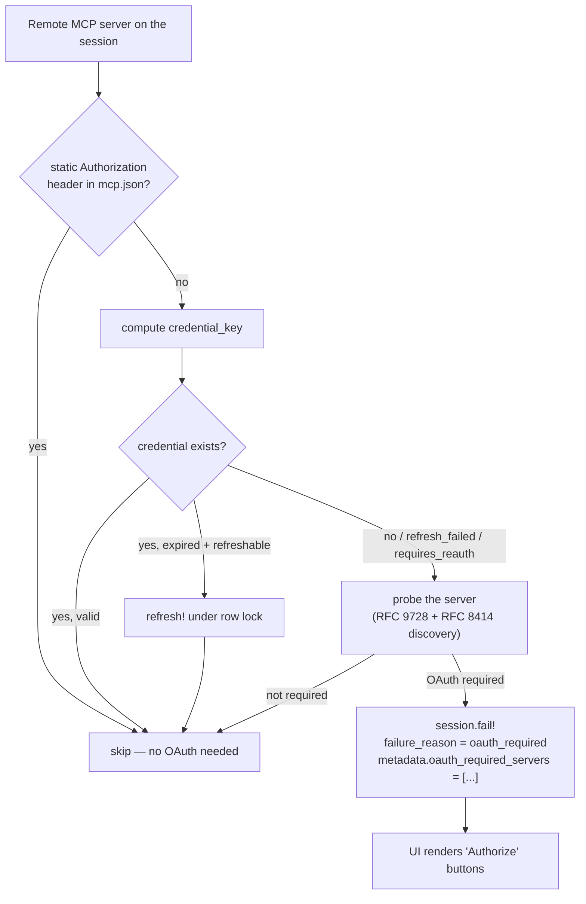
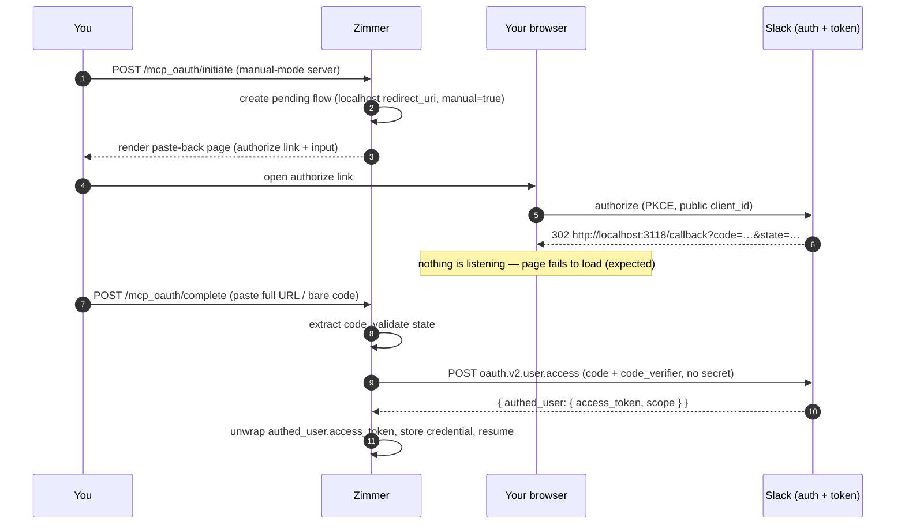

When an MCP server needs OAuth, Zimmer runs the whole flow itself (discovery, registration, PKCE,
token exchange, refresh) and then writes the tokens into the agent CLI's own credential file so
the agent's MCP client finds them.

That last step is why this is harder than it sounds: Zimmer has to produce a file in a format that
another vendor's private code will read.

## The gate

Before spawning, `McpOauthCredentialInjector#check_credentials_status` looks at every remote MCP
server on the session (`http` / `streamable-http` / `sse`):



A session that needs OAuth fails fast: it goes to `failed` with
`failure_reason: oauth_required` instead of hanging or prompting, and the UI turns that into Authorize buttons. Completing the flow
resumes it.

The **post-spawn** MCP-failure classifier (`AgentSessionJob#check_and_handle_mcp_failure`)
applies the same rule. An auth-shaped error (`401`, `Unauthorized`, `Supported scopes`,
`invalid_token`, …) only becomes `oauth_required` when the server is actually
OAuth-capable — `McpOauthCredentialInjector.oauth_capable_server?`: in the catalog, remote
transport, and **no** static credential header. A static-header server (e.g. Zimmer's own
`zimmer*` entries, which send `X-API-Key: ${ZIMMER_PROD_API_KEY}`) returns the same 401 when
its token is invalid or under-scoped, but no OAuth flow can mint a valid API token, so that
failure is recorded as `mcp_connection_failed` — surfacing the raw error and the credential
to check — rather than a dead-end Authorize button. This is the single predicate shared with
the pre-spawn gate above.

## The authorization flow

```mermaid
sequenceDiagram
    autonumber
    participant U as You
    participant Z as Zimmer (McpOauthController)
    participant AS as MCP server / its auth server
    participant S as Session

    U->>Z: POST /mcp_oauth/initiate (server_name, session_id)
    alt a PreregisteredOauthConfig exists
        Note over Z: Rails credentials: mcp_oauth_clients.{name}<br/>client_id, endpoints, scopes — wins outright<br/>client_secret optional (public client); a non-hosted redirect_uri (or manual: true) means paste-back
    else discovery
        Z->>AS: GET /.well-known/oauth-protected-resource (RFC 9728)
        AS-->>Z: { resource, authorization_servers }
        Z->>AS: GET /.well-known/oauth-authorization-server (RFC 8414)
        Note over Z,AS: falls back to /.well-known/openid-configuration,<br/>then to a bare GET looking for<br/>401 + WWW-Authenticate: Bearer resource_metadata=…
        AS-->>Z: { authorization_endpoint, token_endpoint,<br/>registration_endpoint?, scopes_supported }
        alt catalog oauth.clientId configured
            Note over Z: use the server's configured client_id<br/>(catalog oauth block) — DCR skipped<br/>oauth.redirectUri, when set, wins over the hosted callback
        else registration_endpoint advertised
            Z->>AS: POST (RFC 7591 Dynamic Client Registration)<br/>client_name: "Claude Code (Zimmer)"
            AS-->>Z: { client_id, client_secret? }
        else neither
            Note over Z: client_id = "zimmer" literal
        end
    end
    Z->>Z: McpOauthPendingFlow.create_for_session!<br/>state (32B) + PKCE code_verifier → S256 challenge<br/>expires in 24h
    Z-->>U: 302 to authorization_url<br/>plus resource per RFC 8707<br/>Google additionally gets access_type=offline and prompt=consent
    Note over Z,U: this is the hosted-callback path — a flow whose redirect_uri<br/>is not Zimmer's own callback renders the paste-back page instead (below)
    U->>AS: authorize
    AS-->>Z: GET /mcp_oauth/callback?code=…&state=…
    Z->>Z: look up flow by state (THIS IS THE CSRF CHECK)
    Z->>AS: POST token endpoint (code + code_verifier + redirect_uri)
    AS-->>Z: { access_token, refresh_token?, expires_in }
    Z->>Z: upsert McpOauthCredential by credential_key
    Z->>S: McpOauthResumeService — all servers satisfied?
    alt yes
        S->>S: status = waiting, clear oauth_required_servers
        S->>S: re-enqueue AgentSessionJob (replays the original prompt)
    else partial
        Note over S: trim the list, wait for the rest
    end
```

## Public clients and manual (paste-back) completion

Two capabilities let Zimmer authorize against servers that expose a **public OAuth client**
(no client secret) and only permit a **localhost / out-of-band redirect** — the motivating case
being the official hosted Slack MCP server (`https://mcp.slack.com/mcp`), which is designed to be
used with Slack's own app `client_id` + a localhost redirect + PKCE, and which deliberately does
not support DCR.

### Public clients (no client_secret)

A `mcp_oauth_clients` entry — or a catalog `oauth` block naming only a `clientId` — may omit the
client secret entirely. Such a client is a public client (RFC 6749 §2.1) that proves possession with
PKCE alone (RFC 7636). The token exchange omits the `client_secret` parameter when the flow has no
secret and relies on the persisted `code_verifier`; when a secret *is* configured, the previous
`client_secret_post` behavior is preserved.

### Manual (paste-back) completion

Some public clients only permit a redirect URI they already whitelisted — for the official Slack
client that is `http://localhost:3118/callback`, the loopback redirect the Claude Code Slack plugin
uses. Zimmer's hosted callback (`https://<host>/mcp_oauth/callback`) cannot be added to someone
else's app, so those flows complete **out-of-band**:

1. `redirect_uri` comes from the statically-configured redirect — the catalog `oauth.redirectUri`
   or a `mcp_oauth_clients` entry, whichever configures the server — rather than the hosted
   callback. Because Zimmer cannot receive that redirect, the flow is marked manual.
2. `initiate` renders a **paste-back page** instead of redirecting: it shows the authorize link and
   an input for the redirect URL.
3. You open the authorize link, consent in your own browser, and land on the localhost redirect
   with nothing listening — that failed page load is expected; the value you need is in the address
   bar (`?code=…&state=…`).
4. You paste that full URL (or the bare `code`) back. `complete` extracts the `code`, validates
   `state` against the persisted flow (the same CSRF check the hosted callback does), and finishes
   the exchange using the persisted PKCE `code_verifier` and `redirect_uri`.



### Configuring the official Slack MCP

The official Slack app is a public client. Wire it up entirely through credentials — no code change
per server:

```yaml
mcp_oauth_clients:
  slack:
    client_id: "1601185624273.8899143856786"        # official Slack app (public; not a secret)
    authorization_endpoint: "https://slack.com/oauth/v2_user/authorize"
    token_endpoint: "https://slack.com/api/oauth.v2.user.access"
    scopes: "channels:history,groups:history,search:read.public,users:read"
    redirect_uri: "http://localhost:3118/callback"    # the loopback redirect the Slack app permits
    manual: true
    resource: ""                                      # Slack OAuth is not RFC 8707 — suppress the indicator
```

The key (`slack`) must match the MCP server name in the catalog, whose URL is `https://mcp.slack.com/mcp`.
Slack returns the *user* token nested under `authed_user.access_token` (a top-level `access_token`, when
present, is the bot token); Zimmer unwraps it on both the initial exchange and the cron token refresh, so
a rotation-enabled credential survives past its first expiry. `resource: ""` is set because Slack's OAuth endpoints are
not the RFC 8707 audience-binding kind — for a genuine MCP auth server, omit the key instead and the
pre-registered path derives the resource indicator from the server URL automatically.

:::note[The Slack `client_id` is public; wiring it into prod is a human step]
`1601185624273.8899143856786` and the `3118` loopback redirect are taken from the distributed Claude
Code Slack plugin — they are public identifiers, not secrets. Writing the entry into
`config/credentials/production.yml.enc` still requires the prod master key, so it is a one-time human
step. The code path and its tests do not depend on live Slack.
:::

## The credential key is a copy of Claude Code's private algorithm

To make the agent's MCP client find the token, Zimmer must key it exactly the way Claude Code keys
it. `McpOauthCredential.compute_credential_key`:

```
"#{server_name}|#{SHA256(compact_json({type, url, headers}))[0,16]}"
```

...where "compact JSON" is faked by string-munging `": "` → `":"` and `", "` → `","`, and
`streamable-http` is normalized to `http`.

:::danger[This is a reimplementation of another project's internals]
It is a hash algorithm reverse-engineered from Claude Code so the two agree on a dictionary key, with
no documented format and no API behind it. If Claude Code changes how it computes that key,
every MCP OAuth credential Zimmer holds becomes unfindable — and the failure mode is silent: the agent
just says it needs authorization.

Codex is worse. `CodexMcpCredentialWriter`'s format was read out of
`codex-rs/rmcp-client/src/oauth.rs @ rust-v0.133.0`, and it writes two different, mutually
incompatible schemas — the file uses `server_url` + a `scopes` array + millisecond epochs, while
the macOS Keychain path uses `url` + a nested `token_response` + a space-delimited `scope`. The
Keychain path has never been runtime-verified ("Zimmer's CI/staging/production workers are all
Linux").
:::

### And it only exists because of two open Codex bugs

`CodexMcpCredentialWriter`'s header explains why Zimmer rewrites Codex's entire MCP credential store
on every session spawn:

- [`openai/codex#15122`](https://github.com/openai/codex/issues/15122) — credentials from `codex mcp
  login` don't persist across restarts.
- [`openai/codex#17265`](https://github.com/openai/codex/issues/17265) — Codex won't use the stored
  refresh token, so MCP calls fail with "Authorization required."

So Zimmer refreshes the tokens itself every 30 minutes and re-writes them at spawn, so Codex never has
to. It's a workaround for someone else's bugs, and it will need to be removed when they're fixed.

## Refresh

`RefreshMcpOauthTokensJob`, every 30 minutes. It refreshes credentials expiring within an hour — but
throttled by `PROACTIVE_REFRESH_MIN_INTERVAL` (won't touch anything updated in the last 4 hours),
deliberately, to reduce exposure to rotating-refresh-token reuse detection.

It splits network errors carefully:

- **Retryable** — the connection was never established, so the server never saw the request. Safe to
  retry in-band.
- **Ambiguous** — the request went out and the response was lost. Never retried in-band; deferred
  to the next cron run. Retrying could burn a single-use refresh token.

That distinction is the kind of care that's easy to skip and expensive to skip.

A refresh is treated as **permanent** when the token endpoint rejects the `refresh_token` grant with
any `4xx` — the refresh token is dead and re-auth is required. Most servers signal this with a
spec-compliant JSON body (`{"error": "invalid_grant" | "invalid_client" | "unauthorized_client"}`),
but some return a bare HTML `400 Bad Request`, so the `4xx` status code — not the body — is what
classifies it. On a permanent failure it nulls the refresh token but keeps a still-valid access token
instead of force-expiring it. **Transient** failures — `429` rate-limits and `5xx` outages — are
excluded first: the refresh token itself is not implicated, so it is left intact and the failure stays
on the loud `ERROR` log path (which pages `#alerts`) to retry on the next cron run. This transient /
permanent split matches `XOauthCredential`.

## Capturing the token the runtime rotates (write-back)

Zimmer is not the only party that refreshes these tokens. Claude Code has its own MCP OAuth client:
when an access token lapses mid-session it refreshes it and writes the new pair back to
`~/.claude/.credentials.json`. Notion (and other OAuth 2.1 servers) **rotate** refresh tokens —
every refresh mints a new refresh token and revokes the prior one — so once Claude Code refreshes,
the refresh token in Zimmer's DB is already dead.

`ClaudeMcpCredentialWriter#merge_preserving_fresher!` protects that fresher on-disk entry only while
its paired access token is still valid. Across an idle gap longer than the access token's TTL (~1h
for Notion) the on-disk access token lapses, so on the next spawn Zimmer's stale DB entry wins and
clobbers the good on-disk refresh token. The next refresh — Claude Code's at connect time, or
`RefreshMcpOauthTokensJob`'s from cron — then presents the revoked token and gets
`invalid_grant: Invalid refresh token`, and the server drops offline until a human re-authorizes.

`McpOauthRuntimeReconciler` closes that loop. Before Zimmer refreshes or injects a credential it reads
the runtime's on-disk store (`RuntimeMcpCredentialWriter#read_runtime_credentials`) and, if the
runtime holds a strictly newer token pair — a later access-token expiry means the runtime refreshed
after Zimmer last wrote the row — adopts that pair into the DB. Crucially it adopts even when the
on-disk access token has already expired: a rotated refresh token is the live head of the chain
regardless of its paired access token's TTL, which is the exact case `merge_preserving_fresher!`
drops. `ClaudeAccount#sync_tokens_from_filesystem!` does the same thing for the runtime's own account
tokens; MCP OAuth credentials had no equivalent, which is why they went stale.

The reconciler runs in two places:

- **`McpOauthCredentialInjector`**, on every spawn, before it decides whether to refresh or gate the
  session — so a session never injects (or re-auth-prompts against) a rotated-away token.
- **`RefreshMcpOauthTokensJob`**, before the cron refreshes each credential — so the cron adopts a
  session's rotation instead of burning the stale DB token against the provider's reuse detection.

Only Claude Code refreshes MCP tokens mid-session; Codex is written-not-trusted (Zimmer rewrites its
store every spawn), so reconciling against Codex is a harmless no-op.

This is also what makes an OAuth MCP connection **survive a worker/clone recreation**. When a session
is recovered after a deploy or restart, the relaunch goes through the follow-up spawn path, which
re-injects credentials and re-writes `.mcp.json` before spawning `claude --resume`. Before the
write-back existed, that relaunch re-injected the *stale* DB refresh token, so Claude Code's reconnect
refreshed against a rotated-away token, got `invalid_grant`, and the server came back with all its
tools reporting `No such tool available`. The restart didn't break the token — it forced the
reconnect that exposed an already-stale one. With the reconciler, the relaunch injects the token the
previous run rotated to, and the server reconnects.

## Known problems

:::danger[Anyone who can reach the host can start an OAuth flow for any session]
`McpOauthController` has `skip_forgery_protection only: [:callback, :initiate, :complete]` — and Zimmer has
[no user authentication at all](/auth/overview/#1-human--zimmer-there-is-no-authentication).

The `state` parameter is the *only* CSRF defense on the callback.
:::

:::caution[The loopback check is a substring match]
`McpOauthPendingFlow` decides "is this a loopback redirect" with:

```ruby
redirect_uri.include?("localhost") || redirect_uri.include?("127.0.0.1")
```

So `https://localhost.evil.com` matches.
Tracked in [#47](https://github.com/tadasant/zimmer/issues/47).
:::

:::caution[No timeout on the token exchange]
`McpOauthService#exchange_code_for_tokens` uses `Net::HTTP.post_form` with **no timeout**, unlike its
sibling `fetch_json` / `post_json` which both set 30 seconds. A hung auth server hangs the request.
:::

:::caution[Servers without `offline_access` become one-shot credentials]
Scope acquisition just joins whatever the server advertises in `scopes_supported`. If a server
doesn't advertise `offline_access`, no refresh token is issued, and the credential silently becomes
single-use — `requires_reauth?` once it lapses, with no way to refresh.
Tracked in [#64](https://github.com/tadasant/zimmer/issues/64).
:::

:::note[client_id resolution order]
`McpOauthService` resolves `client_id` in this order: (1) a **statically-configured** client id from
the server's catalog `oauth` block (`oauth.clientId`, camelCase; `client_secret` optional) — used
verbatim and, when present, DCR is skipped entirely; (2) **Dynamic Client Registration** (RFC 7591)
when the auth server advertises a `registration_endpoint`; (3) the literal `"zimmer"`
fallback, used only when neither a configured client nor a DCR endpoint is available. The configured
path exists for servers that require a pre-registered client and expose no usable DCR endpoint (e.g.
Slack, whose `slack-reframe` catalog entry ships its `clientId`) — there, the `"zimmer"`
literal is rejected outright (`invalid_client_id`). This is distinct from the fully-static
`PreregisteredOauthConfig` (Rails credentials `mcp_oauth_clients`), which also supplies the
authorization/token endpoints and bypasses discovery; the `oauth.clientId` path supplies only the
client id and still discovers endpoints via RFC 8414/9728.

The catalog `oauth` block also configures the **redirect URI** (`oauth.redirectUri`, camelCase;
`redirect_uri` accepted). It is read on the same footing as the client id, by the same resolution
the `PreregisteredOauthConfig` path uses: when set it wins over Zimmer's hosted
`/mcp_oauth/callback`, and when absent the hosted callback stays the default — which is what every
ordinary server uses. A pre-registered client only accepts the redirects registered against it at
the provider, and for a public client Zimmer does not own that is a fixed URL it cannot change:
Slack's `slack-reframe` entry declares `http://localhost:3118/callback`, and handing Slack the
hosted callback instead fails at the consent screen with `redirect_uri did not match any configured
URIs`.
:::

:::note[Paste-back is derived from the redirect URI, not a per-server flag]
Zimmer can only finish a flow automatically when the provider redirects back to the callback Zimmer
itself serves. So `McpOauthService#manual_completion_required?` marks a flow manual whenever its
redirect URI is not `build_redirect_uri` — a third-party `localhost` URL or an `oob` URN lands
somewhere Zimmer never sees, and the user completes it by pasting the resulting URL into
`POST /mcp_oauth/complete` ([manual (paste-back) completion](#manual-paste-back-completion)).

The test is "is this our callback", not "does this look like localhost": with `APP_HOST` unset the
hosted callback is *itself* `http://localhost:3000/mcp_oauth/callback`, which must stay automatic.
A `mcp_oauth_clients` credentials entry can still force paste-back with `manual: true` regardless of
its redirect URI; catalog-configured servers need no flag, because the declared redirect already
says whether Zimmer can receive the callback.
:::

:::caution[Re-authorizing a server does not reach an already-running session]
`McpOauthController#callback` updates the `McpOauthCredential` and calls `McpOauthResumeService`, which
only re-spawns a session that was *blocked* on OAuth (`failed` with `oauth_required`, or `waiting` with
`oauth_required_servers`). A session that is `running` or `needs_input` is `:not_blocked`, so the new
credential is written to the DB but has no effect on the live agent — Claude Code loads its MCP servers
once at launch and cannot hot-reload them, so Zimmer cannot inject a new connection into the running
process. For a `running` session that is a runtime limitation; for a `needs_input` session it
self-heals a turn later, because the next message re-injects the fresh credential on the follow-up
spawn. The gap is that re-auth gives no immediate feedback or re-establishment.
Tracked in [#195](https://github.com/tadasant/zimmer/issues/195).
:::

:::caution[A server that fails before it connects disappears from the status instead of showing "failed"]
`mcp_servers_status` is built by `McpLogPollerService` from the per-server log directories Claude Code
creates under `~/.cache/claude-cli-nodejs/<project>/mcp-logs-<name>/`. A server that never gets far
enough to create a log directory (e.g. an OAuth-blocked streamable-http server stripped from the
launch) produces no key at all, and `McpStatusPersisting` merges rather than replaces, so it is simply
absent — not `failed`, not `disconnected`. In the UI a broken server then looks unconfigured rather
than broken. Tracked in [#196](https://github.com/tadasant/zimmer/issues/196).
:::
