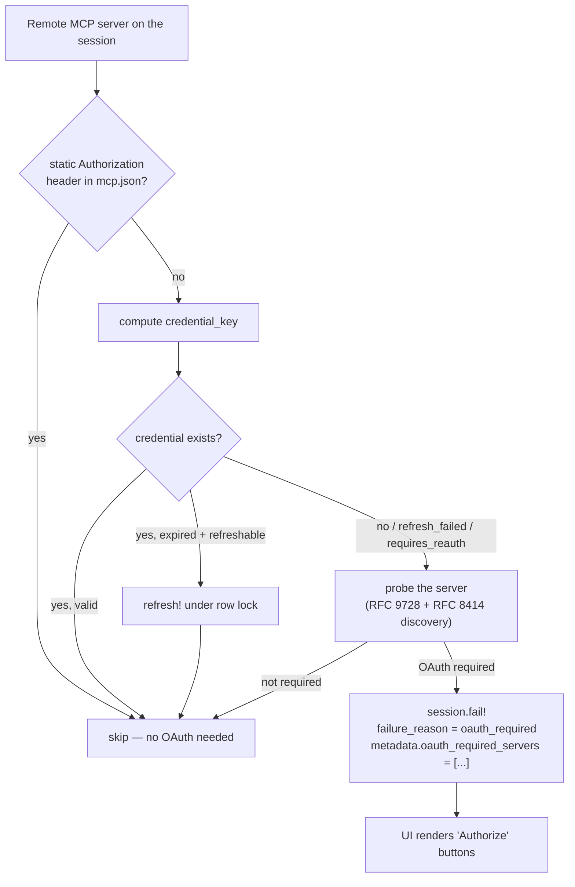
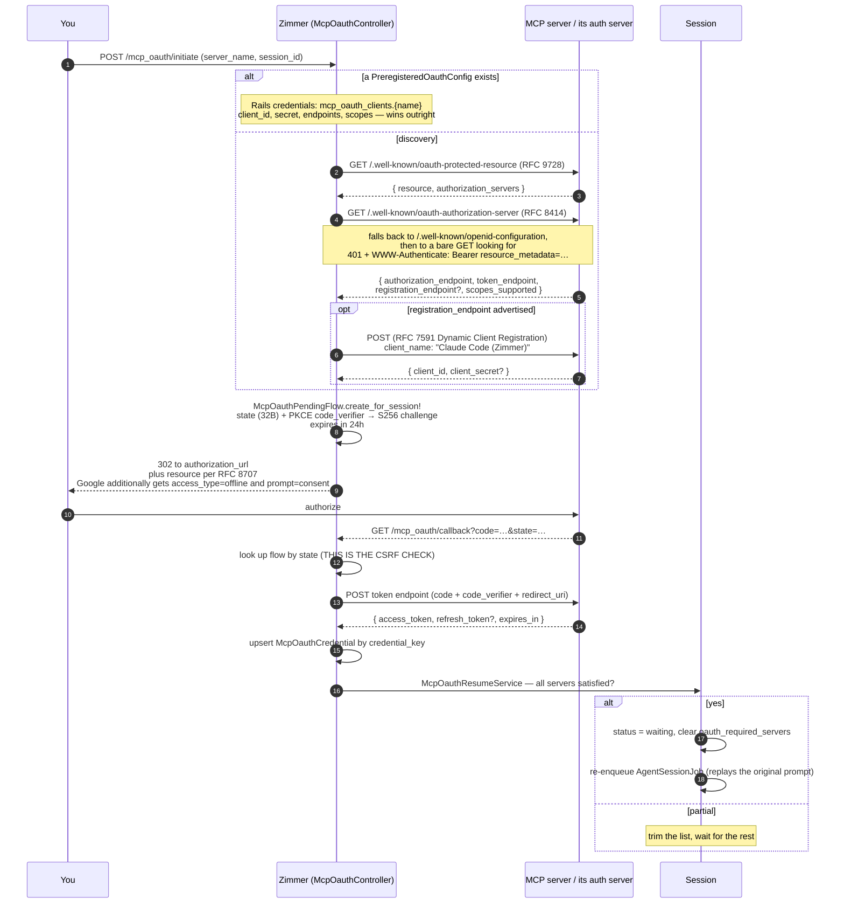

When an MCP server needs OAuth, Zimmer runs the whole flow itself (discovery, registration, PKCE,
token exchange, refresh) and then writes the tokens into the agent CLI's own credential file so
the agent's MCP client finds them.

That last step is why this is harder than it sounds: Zimmer has to produce a file in a format that
another vendor's private code will read.

## The gate

Before spawning, `McpOauthCredentialInjector#check_credentials_status` looks at every remote MCP
server on the session (`http` / `streamable-http` / `sse`):



A session that needs OAuth fails fast rather than hanging or prompting: it goes to `failed` with
`failure_reason: oauth_required`, and the UI turns that into Authorize buttons. Completing the flow
resumes it.

## The authorization flow



## The credential key is a copy of Claude Code's private algorithm

To make the agent's MCP client find the token, Zimmer must key it exactly the way Claude Code keys
it. `McpOauthCredential.compute_credential_key`:

```
"#{server_name}|#{SHA256(compact_json({type, url, headers}))[0,16]}"
```

...where "compact JSON" is faked by string-munging `": "` → `":"` and `", "` → `","`, and
`streamable-http` is normalized to `http`.

:::danger[This is a reimplementation of another project's internals]
It is a hash algorithm reverse-engineered from Claude Code so the two agree on a dictionary key, with
no documented format and no API behind it. If Claude Code changes how it computes that key,
every MCP OAuth credential Zimmer holds becomes unfindable — and the failure mode is "the agent says
it needs authorization," not an error.

Codex is worse. `CodexMcpCredentialWriter`'s format was read out of
`codex-rs/rmcp-client/src/oauth.rs @ rust-v0.133.0`, and it writes two different, mutually
incompatible schemas — the file uses `server_url` + a `scopes` array + millisecond epochs, while
the macOS Keychain path uses `url` + a nested `token_response` + a space-delimited `scope`. The
Keychain path has never been runtime-verified ("Zimmer's CI/staging/production workers are all
Linux").
:::

### And it only exists because of two open Codex bugs

`CodexMcpCredentialWriter`'s header explains why Zimmer rewrites Codex's entire MCP credential store
on every session spawn:

- [`openai/codex#15122`](https://github.com/openai/codex/issues/15122) — credentials from `codex mcp
  login` don't persist across restarts.
- [`openai/codex#17265`](https://github.com/openai/codex/issues/17265) — Codex won't use the stored
  refresh token, so MCP calls fail with "Authorization required."

So Zimmer refreshes the tokens itself every 30 minutes and re-writes them at spawn, so Codex never has
to. It's a workaround for someone else's bugs, and it will need to be removed when they're fixed.

## Refresh

`RefreshMcpOauthTokensJob`, every 30 minutes. It refreshes credentials expiring within an hour — but
throttled by `PROACTIVE_REFRESH_MIN_INTERVAL` (won't touch anything updated in the last 4 hours),
deliberately, to reduce exposure to rotating-refresh-token reuse detection.

It splits network errors carefully:

- **Retryable** — the connection was never established, so the server never saw the request. Safe to
  retry in-band.
- **Ambiguous** — the request went out and the response was lost. Never retried in-band; deferred
  to the next cron run. Retrying could burn a single-use refresh token.

That distinction is the kind of care that's easy to skip and expensive to skip.

On a permanent failure (`invalid_grant` / `invalid_client` / `unauthorized_client`) it nulls the
refresh token but keeps a still-valid access token rather than force-expiring it.

## Known problems

:::danger[Anyone who can reach the host can start an OAuth flow for any session]
`McpOauthController` has `skip_forgery_protection only: [:callback, :initiate]` — and Zimmer has
[no user authentication at all](/auth/overview/#1-human--zimmer-there-is-no-authentication).

The `state` parameter is the *only* CSRF defense on the callback.
:::

:::caution[The loopback check is a substring match]
`McpOauthPendingFlow` decides "is this a loopback redirect" with:

```ruby
redirect_uri.include?("localhost") || redirect_uri.include?("127.0.0.1")
```

So `https://localhost.evil.com` matches.
:::

:::caution[No timeout on the token exchange]
`McpOauthService#exchange_code_for_tokens` uses `Net::HTTP.post_form` with **no timeout**, unlike its
sibling `fetch_json` / `post_json` which both set 30 seconds. A hung auth server hangs the request.
:::

:::caution[Servers without `offline_access` become one-shot credentials]
Scope acquisition just joins whatever the server advertises in `scopes_supported`. If a server
doesn't advertise `offline_access`, no refresh token is issued, and the credential silently becomes
single-use — `requires_reauth?` once it lapses, with no way to refresh.
:::

:::note[The fallback client_id is a literal string]
When a server advertises no DCR endpoint, `client_id` falls back to the literal `"agent-orchestrator"`.
Whether any real server accepts that is unclear — it looks like it would only work against a server
that ignores `client_id` entirely.
:::
