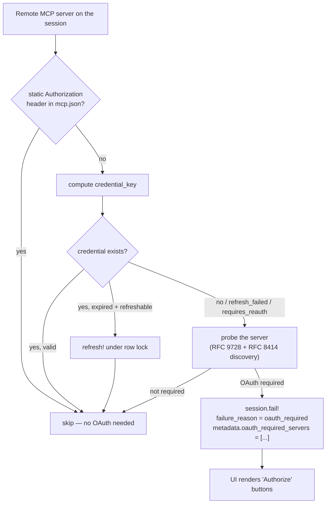
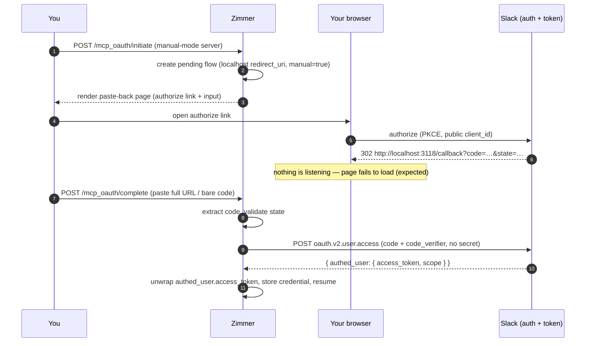

When an MCP server needs OAuth, Zimmer runs the whole flow itself (discovery, registration, PKCE,
token exchange, refresh) and then writes the tokens into the agent CLI's own credential file so
the agent's MCP client finds them.

That last step is why this is harder than it sounds: Zimmer has to produce a file in a format that
another vendor's private code will read.

## The gate

Before spawning, `McpOauthCredentialInjector#check_credentials_status` looks at every remote MCP
server on the session (`http` / `streamable-http` / `sse`):


```mermaid
flowchart TD
    S["Remote MCP server on the session"] --> H{"static Authorization<br/>header in mcp.json?"}
    H -->|yes| OK["skip — no OAuth needed"]
    H -->|no| K["compute credential_key"]
    K --> E{"credential exists?"}
    E -->|"yes, valid"| OK
    E -->|"yes, expired + refreshable"| R["refresh! under row lock"]
    R --> OK
    E -->|"no / refresh_failed / requires_reauth"| P["probe the server<br/>(RFC 9728 + RFC 8414 discovery)"]
    P -->|"OAuth required"| GATE["session.fail!<br/>failure_reason = oauth_required<br/>metadata.oauth_required_servers = [...]"]
    P -->|"not required"| OK
    GATE --> UI["UI renders 'Authorize' buttons"]
```

A session that needs OAuth fails fast: it goes to `failed` with
`failure_reason: oauth_required` instead of hanging or prompting, and the UI turns that into Authorize buttons. Completing the flow
resumes it.

The **post-spawn** MCP-failure classifier (`AgentSessionJob#check_and_handle_mcp_failure`)
applies the same rule. An auth-shaped error (`401`, `Unauthorized`, `Supported scopes`,
`invalid_token`, …) only becomes `oauth_required` when the server is actually
OAuth-capable — `McpOauthCredentialInjector.oauth_capable_server?`: in the catalog, remote
transport, and **no** static credential header.

A "static credential header" is decided by the header's *name*, matched against a word list
(`CREDENTIAL_HEADER_PATTERN`): `authorization`, `auth`, `api-key`/`apikey`, `token`, `secret`,
`password`, `credential(s)`, as whole `-`/`_`-delimited parts. Vendors spell that header
however they like — `X-API-Key`, `X-Goog-Api-Key`, `X-Figma-Token`, `PRIVATE-TOKEN` — and the
spelling says nothing about whether an OAuth flow exists, so matching words beats matching
names. The list stays narrow on purpose: `key` counts only within `api-key`, so
`Idempotency-Key` is not a credential, and `auth` must be a whole part, so `X-Author` is not
one either. Reading a routine header as a credential would hide the Authorize button on a
server that genuinely needs one, which is the worse failure of the two.

A static-header server (e.g. Zimmer's own
`zimmer*` entries, which send `X-API-Key: ${ZIMMER_PROD_API_KEY}`) returns the same 401 when
its token is invalid or under-scoped, but no OAuth flow can mint a valid API token, so it is
never routed to a dead-end Authorize button. It is **left out and the session keeps running**,
with the raw error and the credential to check written into the session log — see
[When a server cannot connect](/air/mcp-servers/#when-a-server-cannot-connect-the-server-is-left-out-not-the-session).
This is the single predicate shared with the pre-spawn gate above.

That split is the whole fatality policy: `oauth_required` is the one failure class that still
stops a session, because it is the one a human can resolve by clicking Authorize. Every other
class is definitive — no amount of waiting or authorizing changes it — so stopping buys
nothing and costs the transcript.

There is a second dead-end the classifier avoids: a server Zimmer **already holds a valid
credential for** that still returns `401`. That is not a missing authorization — it is the
runtime failing to honor the token Zimmer injected, most often because Claude Code's
host-global negative-auth cache (`~/.claude/mcp-needs-auth-cache.json`) short-circuited the
connection (`Skipping connection (cached needs-auth)`) before it ever reached the network.
Routing it to `oauth_required` is pointless: `McpOauthController#initiate` short-circuits on
the existing credential, so the Authorize button can only redirect straight back — which reads
to the user as "the button does nothing". So the classifier (and the OAuth banner, and the
initiate controller) all consult `McpOauthServerAuthorization.authorized?`, and a failure for
an already-authorized server instead **clears the runtime needs-auth cache and retries**, so
the next spawn reconnects with the token already on hand. Injecting a credential
(`McpOauthCredentialInjector#inject_credentials!`) always clears that cache entry for the same
reason, and the OAuth banner filters `oauth_required_servers` through the same predicate so a
stale entry (e.g. a recovery job cleared `failure_reason` but left the list behind) never
renders an Authorize button that cannot resolve.

That "we already hold a credential" check asks whether a row exists and is unexpired — which
is not the same question as "the provider still honors it". So one class of failure is carved
out ahead of it: when the error says the **provider rejected Zimmer's refresh grant** — Claude
Code reports `Token refresh failed with invalid_grant: Invalid refresh token` — the stored
credential is permanently dead no matter how unexpired the row looks. Retrying can never revive
it; without the carve-out the server was filed as "already authorized" and rode the retry ladder
into a terminal `mcp_connection_failed`, orphaning the session with no Authorize button
([#222](https://github.com/tadasant/zimmer/issues/222)). Instead the credential is **retired** and
the server is routed to `oauth_required` — which now resolves, because the short-circuit in
`initiate` no longer sees an active credential. Only cache- and transport-shaped auth failures
keep the clear-cache-and-retry path.

Retiring takes two stores, not one. `McpOauthServerAuthorization.invalidate!` drops the revoked
refresh token and force-expires the DB row — force-expiring the access token too, deliberately:
a runtime refreshes ahead of expiry, so the paired access token may have minutes of TTL left, and
those minutes buy nothing once the credential is terminal while leaving the row `active` is
exactly what re-shadows the Authorize button. But the **runtime's** copy still carries its
original future expiry, so [`McpOauthRuntimeReconciler`](#capturing-the-token-the-runtime-rotates-write-back)
would read it as a strictly newer pair and adopt the dead tokens back into the DB on the next
spawn. So the classifier also calls `delete_credentials` on the runtime credential writer, leaving
nothing to adopt.

`REFRESH_TOKEN_REJECTED_PATTERN` keys on the refresh-failure phrasing (`Token refresh failed
with <grant error>`, or `Invalid refresh token`) rather than on a bare `invalid_grant` anywhere in
the text. A server that brokers a downstream OAuth of its own can report *its* provider's
`invalid_grant` while Zimmer's credential for that server is healthy, and retiring it there would
force a re-auth that cannot fix anything. An unrecognized phrasing costs nothing — it falls
through to the retry path.

## The authorization flow

```mermaid
sequenceDiagram
    autonumber
    participant U as You
    participant Z as Zimmer (McpOauthController)
    participant AS as MCP server / its auth server
    participant S as Session

    U->>Z: POST /mcp_oauth/initiate (server_name, session_id?)
    Note over U,Z: session_id is present from a session's OAuth banner and absent<br/>from the Connectors page Authorize button — that is the only difference
    alt a PreregisteredOauthConfig exists
        Note over Z: Rails credentials: mcp_oauth_clients.{name}<br/>client_id, endpoints, scopes — wins outright<br/>client_secret optional (public client); a non-hosted redirect_uri (or manual: true) means paste-back
    else discovery
        Z->>AS: GET /.well-known/oauth-protected-resource (RFC 9728)
        AS-->>Z: { resource, authorization_servers }
        Z->>AS: GET /.well-known/oauth-authorization-server (RFC 8414)
        Note over Z,AS: falls back to /.well-known/openid-configuration,<br/>then to a bare GET looking for<br/>401 + WWW-Authenticate: Bearer resource_metadata=…
        AS-->>Z: { authorization_endpoint, token_endpoint,<br/>registration_endpoint?, scopes_supported }
        alt catalog oauth.clientId configured
            Note over Z: use the server's configured client_id<br/>(catalog oauth block) — DCR skipped<br/>oauth.redirectUri, when set, wins over the hosted callback
        else registration_endpoint advertised
            Z->>AS: POST (RFC 7591 Dynamic Client Registration)<br/>client_name: "Claude Code (Zimmer)"
            AS-->>Z: { client_id, client_secret? }
        else neither
            Note over Z: client_id = "zimmer" literal
        end
    end
    Z->>Z: McpOauthPendingFlow.start!<br/>state (32B) + PKCE code_verifier → S256 challenge<br/>expires in 24h<br/>session_id null for a Connectors-page flow
    Z-->>U: 302 to authorization_url<br/>plus resource per RFC 8707<br/>Google additionally gets access_type=offline and prompt=consent
    Note over Z,U: this is the hosted-callback path — a flow whose redirect_uri<br/>is not Zimmer's own callback renders the paste-back page instead (below)
    U->>AS: authorize
    AS-->>Z: GET /mcp_oauth/callback?code=…&state=…
    Z->>Z: look up flow by state (THIS IS THE CSRF CHECK)
    Z->>AS: POST token endpoint (code + code_verifier + redirect_uri)
    AS-->>Z: { access_token, refresh_token?, expires_in }
    Z->>Z: upsert McpOauthCredential by credential_key
    Z->>S: McpOauthResumeService — all servers satisfied?<br/>(skipped entirely when the flow has no session;<br/>Zimmer redirects back to /connectors instead)
    alt yes
        S->>S: status = waiting, clear oauth_required_servers
        S->>S: re-enqueue AgentSessionJob (replays the original prompt)
    else partial
        Note over S: trim the list, wait for the rest
    end
```

## Public clients and manual (paste-back) completion

Two capabilities let Zimmer authorize against servers that expose a **public OAuth client**
(no client secret) and only permit a **localhost / out-of-band redirect** — the motivating case
being the official hosted Slack MCP server (`https://mcp.slack.com/mcp`), which is designed to be
used with Slack's own app `client_id` + a localhost redirect + PKCE, and which deliberately does
not support DCR.

### Public clients (no client_secret)

A `mcp_oauth_clients` entry — or a catalog `oauth` block naming only a `clientId` — may omit the
client secret entirely. Such a client is a public client (RFC 6749 §2.1) that proves possession with
PKCE alone (RFC 7636). The token exchange omits the `client_secret` parameter when the flow has no
secret and relies on the persisted `code_verifier`; when a secret *is* configured, the previous
`client_secret_post` behavior is preserved.

Every outbound call `McpOauthService` makes — probe, discovery, DCR, and the token exchange itself —
sets `open_timeout` and `read_timeout` to `REQUEST_TIMEOUT` (30 seconds). `McpOauthCredential#refresh!`
posts its refresh grant through the same helper, so the unattended path carries the same bound as the
interactive one. An auth server that accepts the connection and then never answers fails the exchange
rather than holding a request thread — or, on the cron path, a GoodJob thread.

### Manual (paste-back) completion

Some public clients only permit a redirect URI they already whitelisted — for the official Slack
client that is `http://localhost:3118/callback`, the loopback redirect the Claude Code Slack plugin
uses. Zimmer's hosted callback (`https://<host>/mcp_oauth/callback`) cannot be added to someone
else's app, so those flows complete **out-of-band**:

1. `redirect_uri` comes from the statically-configured redirect — the catalog `oauth.redirectUri`
   or a `mcp_oauth_clients` entry, whichever configures the server — rather than the hosted
   callback. Because Zimmer cannot receive that redirect, the flow is marked manual.
2. `initiate` renders a **paste-back page** instead of redirecting: it shows the authorize link and
   an input for the redirect URL.
3. You open the authorize link, consent in your own browser, and land on the localhost redirect
   with nothing listening — that failed page load is expected; the value you need is in the address
   bar (`?code=…&state=…`).
4. You paste that full URL (or the bare `code`) back. `complete` extracts the `code`, validates
   `state` against the persisted flow (the same CSRF check the hosted callback does), and finishes
   the exchange using the persisted PKCE `code_verifier` and `redirect_uri`.


```mermaid
sequenceDiagram
    autonumber
    participant U as You
    participant Z as Zimmer
    participant B as Your browser
    participant AS as Slack (auth + token)

    U->>Z: POST /mcp_oauth/initiate (manual-mode server)
    Z->>Z: create pending flow (localhost redirect_uri, manual=true)
    Z-->>U: render paste-back page (authorize link + input)
    U->>B: open authorize link
    B->>AS: authorize (PKCE, public client_id)
    AS-->>B: 302 http://localhost:3118/callback?code=…&state=…
    Note over B: nothing is listening — page fails to load (expected)
    U->>Z: POST /mcp_oauth/complete (paste full URL / bare code)
    Z->>Z: extract code, validate state
    Z->>AS: POST oauth.v2.user.access (code + code_verifier, no secret)
    AS-->>Z: { authed_user: { access_token, scope } }
    Z->>Z: unwrap authed_user.access_token, store credential, resume
```

### Configuring the official Slack MCP

The official Slack app is a public client. Wire it up entirely through credentials — no code change
per server:

```yaml
mcp_oauth_clients:
  slack:
    client_id: "1601185624273.8899143856786"        # official Slack app (public; not a secret)
    authorization_endpoint: "https://slack.com/oauth/v2_user/authorize"
    token_endpoint: "https://slack.com/api/oauth.v2.user.access"
    scopes: "channels:history,groups:history,search:read.public,users:read"
    redirect_uri: "http://localhost:3118/callback"    # the loopback redirect the Slack app permits
    manual: true
    resource: ""                                      # Slack OAuth is not RFC 8707 — suppress the indicator
```

The key (`slack`) must match the MCP server name in the catalog, whose URL is `https://mcp.slack.com/mcp`.
Slack returns the *user* token nested under `authed_user.access_token` (a top-level `access_token`, when
present, is the bot token); Zimmer unwraps it on both the initial exchange and the cron token refresh, so
a rotation-enabled credential survives past its first expiry. `resource: ""` is set because Slack's OAuth endpoints are
not the RFC 8707 audience-binding kind — for a genuine MCP auth server, omit the key instead and the
pre-registered path derives the resource indicator from the server URL automatically.

:::note[The Slack `client_id` is public; wiring it into prod is a human step]
`1601185624273.8899143856786` and the `3118` loopback redirect are taken from the distributed Claude
Code Slack plugin — they are public identifiers, not secrets. Writing the entry into
`config/credentials/production.yml.enc` still requires the prod master key, so it is a one-time human
step. The code path and its tests do not depend on live Slack.
:::

## The credential key is a copy of Claude Code's private algorithm

To make the agent's MCP client find the token, Zimmer must key it exactly the way Claude Code keys
it. `McpOauthCredential.compute_credential_key`:

```
"#{server_name}|#{SHA256(compact_json({type, url, headers}))[0,16]}"
```

...where "compact JSON" is faked by string-munging `": "` → `":"` and `", "` → `","`, and
`streamable-http` is normalized to `http`. A canary test pins the literal key for two fixed configs —
`notion|3fad03f7abd02b9c` for `{"type":"http","url":"https://mcp.notion.com/v1/mcp","headers":{}}` —
so that a change on Zimmer's side of the algorithm fails a test instead of silently missing every
credential lookup.

:::danger[This is a reimplementation of another project's internals]
It is a hash algorithm reverse-engineered from Claude Code so the two agree on a dictionary key, with
no documented format and no API behind it. If Claude Code changes how it computes that key,
every MCP OAuth credential Zimmer holds becomes unfindable — and the failure mode is silent: the agent
just says it needs authorization.

Codex is worse. `CodexMcpCredentialWriter`'s format was read out of
`codex-rs/rmcp-client/src/oauth.rs @ rust-v0.133.0`, and it writes two different, mutually
incompatible schemas — the file uses `server_url` + a `scopes` array + millisecond epochs, while
the macOS Keychain path uses `url` + a nested `token_response` + a space-delimited `scope`. The
Keychain path has never been runtime-verified ("Zimmer's CI/staging/production workers are all
Linux").
:::

### And it only exists because of two open Codex bugs

`CodexMcpCredentialWriter`'s header explains why Zimmer rewrites Codex's entire MCP credential store
on every session spawn:

- [`openai/codex#15122`](https://github.com/openai/codex/issues/15122) — credentials from `codex mcp
  login` don't persist across restarts.
- [`openai/codex#17265`](https://github.com/openai/codex/issues/17265) — Codex won't use the stored
  refresh token, so MCP calls fail with "Authorization required."

So Zimmer refreshes the tokens itself every 30 minutes and re-writes them at spawn, so Codex never has
to. It's a workaround for someone else's bugs, and it will need to be removed when they're fixed.

## Refresh

`RefreshMcpOauthTokensJob`, every 30 minutes. It refreshes credentials expiring within an hour — but
throttled by `PROACTIVE_REFRESH_MIN_INTERVAL` (won't touch anything updated in the last 4 hours),
deliberately, to reduce exposure to rotating-refresh-token reuse detection.

It splits network errors carefully:

- **Retryable** — the connection was never established, so the server never saw the request. Safe to
  retry in-band.
- **Ambiguous** — the request went out and the response was lost. Never retried in-band; deferred
  to the next cron run. Retrying could burn a single-use refresh token.

That distinction is the kind of care that's easy to skip and expensive to skip.

A refresh is treated as **permanent** when the token endpoint rejects the `refresh_token` grant with
any `4xx` — the refresh token is dead and re-auth is required. Most servers signal this with a
spec-compliant JSON body (`{"error": "invalid_grant" | "invalid_client" | "unauthorized_client"}`),
but some return a bare HTML `400 Bad Request`, so the `4xx` status code — not the body — is what
classifies it. On a permanent failure it nulls the refresh token but keeps a still-valid access token
instead of force-expiring it. **Transient** failures — `429` rate-limits and `5xx` outages — are
excluded first: the refresh token itself is not implicated, so it is left intact and the failure stays
on the loud `ERROR` log path (which pages `#alerts`) to retry on the next cron run. This transient /
permanent split matches `XOauthCredential`.

## Capturing the token the runtime rotates (write-back)

Zimmer is not the only party that refreshes these tokens. Claude Code has its own MCP OAuth client:
when an access token lapses mid-session it refreshes it and writes the new pair back to
`~/.claude/.credentials.json`. Notion (and other OAuth 2.1 servers) **rotate** refresh tokens —
every refresh mints a new refresh token and revokes the prior one — so once Claude Code refreshes,
the refresh token in Zimmer's DB is already dead.

`ClaudeMcpCredentialWriter#merge_preserving_fresher!` protects that fresher on-disk entry only while
its paired access token is still valid. Across an idle gap longer than the access token's TTL (~1h
for Notion) the on-disk access token lapses, so on the next spawn Zimmer's stale DB entry wins and
clobbers the good on-disk refresh token. The next refresh — Claude Code's at connect time, or
`RefreshMcpOauthTokensJob`'s from cron — then presents the revoked token and gets
`invalid_grant: Invalid refresh token`, and the server drops offline until a human re-authorizes.

`McpOauthRuntimeReconciler` closes that loop. Before Zimmer refreshes or injects a credential it reads
the runtime's on-disk store (`RuntimeMcpCredentialWriter#read_runtime_credentials`) and, if the
runtime holds a strictly newer token pair — a later access-token expiry means the runtime refreshed
after Zimmer last wrote the row — adopts that pair into the DB. Crucially it adopts even when the
on-disk access token has already expired: a rotated refresh token is the live head of the chain
regardless of its paired access token's TTL, which is the exact case `merge_preserving_fresher!`
drops. `ClaudeAccount#sync_tokens_from_filesystem!` does the same thing for the runtime's own account
tokens; MCP OAuth credentials had no equivalent, which is why they went stale.

The reconciler runs in two places:

- **`McpOauthCredentialInjector`**, on every spawn, before it decides whether to refresh or gate the
  session — so a session never injects (or re-auth-prompts against) a rotated-away token.
- **`RefreshMcpOauthTokensJob`**, before the cron refreshes each credential — so the cron adopts a
  session's rotation instead of burning the stale DB token against the provider's reuse detection.

**Which store it reads** depends on the
[session-scoped credentials setting](/auth/harness/#session-scoped-credentials-the-db-owns-the-chain).
With it off, one host-global `~/.claude/.credentials.json` that every session on the worker
read-modify-writes under a flock. With it on, `ClaudeMcpCredentialWriter.for_session` points the
writer at that session's own `CLAUDE_CONFIG_DIR` — same keys, same adoption rule, one writer per
file, so the read-modify-write stops racing. The cron and the revocation path still target the
host-global file: they have no session to scope to, so a revoked credential is not removed from a
session that is already running (it gets a fresh directory next time).

Only Claude Code refreshes MCP tokens mid-session; Codex is written-not-trusted (Zimmer rewrites its
store every spawn), so reconciling against Codex is a harmless no-op.

This is also what makes an OAuth MCP connection **survive a worker/clone recreation**. When a session
is recovered after a deploy or restart, the relaunch goes through the follow-up spawn path, which
re-injects credentials and re-writes `.mcp.json` before spawning `claude --resume`. Before the
write-back existed, that relaunch re-injected the *stale* DB refresh token, so Claude Code's reconnect
refreshed against a rotated-away token, got `invalid_grant`, and the server came back with all its
tools reporting `No such tool available`. The restart didn't break the token — it forced the
reconnect that exposed an already-stale one. With the reconciler, the relaunch injects the token the
previous run rotated to, and the server reconnects.

## Seeing where every connector stands

`/connectors` — **Connectors** in the left-hand nav — lists every MCP server in the
catalog with its current auth status, one lazily-loaded Turbo Frame per server so
the list renders before any status resolves. It replaced the older "OAuth Status"
page, which could only show servers that already had a credential row and so was
silent about precisely the servers that needed attention.

`ConnectorStatusProbe` reads the same three inputs a spawn reads, in the same
order, so a connector reported **Ready** is one that will actually connect:

| State | Meaning |
| --- | --- |
| **Ready** | OAuth is complete and the credential saved, or every required `${VAR}` resolves |
| **Needs authorization** | An OAuth-capable server with no stored credential. The row carries an **Authorize** button |
| **Token expired** | Expired, but has a refresh token — `RefreshMcpOauthTokensJob` will renew it |
| **Needs re-auth** | Expired with no refresh token; the row carries a **Re-authorize** button that replaces the credential in place |
| **Missing configuration** | A required `${VAR}` has no value. The row says where it goes — see [The Secrets Console](/operate/secrets-parameter-store/#the-secrets-console-and-which-project-it-administers) |
| **Unavailable** | The catalog entry carries an [`unavailable` declaration](/air/mcp-servers/#unavailable-the-breakage-zimmer-cannot-detect) — breakage no local check can infer. Nothing on the page fixes it; the entry has to change |
| **Secret store unreachable** | The store did not answer. Deliberately *not* "missing" — see [Secrets in the Parameter Store](/operate/secrets-parameter-store/) |
| **No credential required** | The catalog entry configures no credential at all |
| **Probe failed** | Anything unexpected, isolated to that one row |

One line cuts across the states rather than being one of them: a credential whose
server issued **no refresh token** carries an amber note on its row saying so, in
every state including **Ready**. Nothing can renew that credential, so the
re-authorization is permanent and periodic — see
[Servers without `offline_access`](#known-problems) below.

A credential filed under a *different* credential key than the catalog currently
computes is deliberately not matched — the injector would not find it either, so
counting it would report Ready for a server that cannot connect. Those show up
instead under "Unclaimed credentials" at the bottom of the page, where they can
be deleted.

The page never contacts the MCP server itself and never displays a secret value;
it reports presence and where to set what is absent.

The same probe decides what anyone is offered. **Missing configuration**, **Needs
authorization**, **Needs re-auth** and **Unavailable** block a spawn, so `get_configs` leaves those
servers out of its MCP-server list and names them in a trailing **Unavailable** roster instead —
one line and a compact reason each. **Token expired** does not block, because the refresh job
resolves it.

The human surfaces read the same four states through `McpServerOptions`: the MCP-server pickers on
the new-session form, the trigger form and the session detail page show such a server with an
**Unavailable** badge and its reason, sorted below the ones that work, and `GET /api/v1/configs` and
`GET /api/v1/mcp_servers` carry `unavailable` and `unavailable_reason` per server. They flag rather
than omit because a human, unlike an agent, is usually one click on this page away from fixing the
reason. → [Availability, and what an agent is offered](/air/mcp-servers/#availability-and-what-an-agent-is-offered)

### How the list fills in, and why it re-orders itself

The rows ship as `loading="lazy"` frames and `connector_list_controller` then
promotes them to `eager` — six at a time, releasing a slot as each frame loads
(`turbo:frame-load`), comes back without a matching frame (`turbo:frame-missing`,
which is what a 404 or an error page produces), fails at the network level, or
hits a 15-second watchdog. All four matter: a row whose probe 404s never fires
`turbo:frame-load`, so without the second listener it would hold its slot for the
full watchdog and the sort would wait on it.

Each half of that is load-bearing:

- **Lazy in the markup** is the floor. Before the controller connects — and if it
  throws, or its bundle fails to load — the frames still resolve on appearance,
  which is what they did before. It is a floor, not a no-JavaScript fallback:
  Turbo's lazy loading is itself JavaScript, so with none the rows never resolve
  either way.
- **Promoting them** is the fix. Turbo's `lazy` defers a frame until it scrolls
  into view, so on a ~100-server catalog every badge below the fold stayed blank
  until you went looking for it.
- **Six at a time** is what keeps the fix from being a regression. Un-gating all
  ~100 frames at once fires ~100 requests at a Puma pool of a handful of threads,
  and the queueing makes the *first* badge slower than it was before.

Ordering follows from the same design. A server's state is computed **inside its
own frame**, so `ConnectorsController` does not know at index-render time which
servers have problems; sorting server-side would mean probing all ~100 up front
and holding the whole page on the slowest one — exactly what the frames exist to
avoid. So the sort happens in the browser, once, after the frames settle: rows
are alphabetical while they load, then re-order by severity with the problems
first and a `N need attention, listed first` count in the header. Sorting *during*
the load was rejected deliberately — it moves content under the reader for the
whole load.

Severity itself is not decided in JavaScript. `ConnectorsHelper::SEVERITY_RANKS`
maps each probe state to a rank, the resolved row carries it as
`data-connector-rank`, the attention threshold is passed in as a value, and the
controller only compares numbers. A test asserts the rank table covers
`ConnectorStatusProbe::STATES` exactly, so a new state cannot quietly default
into the healthy group.

Two edges are handled where they would otherwise be invisible. Turbo Drive's page
cache restores this list *as the controller left it* — resolved bodies, and the
`eager` the controller itself wrote — so on a back-navigation onto a half-loaded
page the controller pre-settles anything already carrying content and counts only
frames it started; otherwise the in-flight count goes negative, the window blows
open, and the list never sorts. And a reorder moves DOM nodes, which drops
keyboard focus, so the sort stands down while focus is inside the list and
retries once it leaves.

### Authorizing from the Connectors page

A row that needs a consent screen runs one: **Authorize** (or **Re-authorize** on a
`needs_reauth` row) POSTs to the same `/mcp_oauth/initiate` the session banner uses,
just without a `session_id`. Authorizing a connector is something you do to Zimmer,
not to one session, and it used to cost you a throwaway session to do it.

A session-less flow differs from an in-session one in exactly two places:

- **It returns to `/connectors`** rather than to a session — through the callback,
  through paste-back, and through every `initiate` error exit. (A callback that fails
  outright renders the shared OAuth error page, as an in-session one does.)
- **It resumes nothing**, because nothing is parked on it. `McpOauthResumeService`
  is skipped rather than called with no session.

Everything in between — discovery, DCR, PKCE, the hosted callback, the paste-back
page, the stored `McpOauthCredential` — is the same code on the same path. The
credential is keyed on the server config, not on who started the flow, so a
connector authorized here is a connector every future session inherits.

Only rows where a consent screen is actually the fix get the button:
`needs_authorization` and `needs_reauth`. A `token_expired` row does not — the
refresh job resolves it without you. A `missing_configuration` row does not either:
its credential is a `${VAR}` secret and no OAuth provider will ever set it. Nor does
a server authenticated by a static header, whatever the vendor named it: with its
`${VAR}` set it is `ready`, and with it unset it is `missing_configuration` — never
`needs_authorization`, because there is no OAuth flow behind that button to run.

The button offers only catalog servers, and the session-less `initiate` enforces
that server-side: the server must be in the catalog and pass
`McpOauthCredentialInjector.oauth_capable_server?`. Both paths now read the server
URL from the catalog whenever the catalog has the server, so a `server_url`
submitted alongside a session-less `initiate` is ignored outright.

A session-less flow has no session to be reaped with (`Session has_many
:mcp_oauth_pending_flows, dependent: :destroy` is what collects the in-session ones),
so `initiate` calls `McpOauthPendingFlow.sweep_expired_session_less!` each time it
starts a flow. An abandoned Connectors-page flow would otherwise sit indefinitely
holding a PKCE `code_verifier` and a client secret.

## Known problems

:::danger[Anyone who can reach the host can start an OAuth flow]
`McpOauthController` has `skip_forgery_protection only: [:callback, :initiate, :complete]` — and Zimmer has
[no user authentication at all](/auth/overview/#1-human--zimmer-there-is-no-authentication).

The `state` parameter is the *only* CSRF defense on the callback. On `initiate`, the
defense is that the request cannot freely invent its target: whenever the catalog has
the server, its URL is read from there rather than from the request, and a session-less
`initiate` additionally refuses a server the catalog does not have at all. The gap that
remains is an **in-session** `initiate` naming a server *outside* the catalog — that one
still falls back to the submitted `server_url`, and discovery will fetch it.
:::

:::note[The loopback check has no production caller]
`McpOauthPendingFlow#localhost_flow?` parses `redirect_uri` and compares the **host** exactly against
`localhost`, `127.0.0.1` and `::1`; a malformed or schemeless URI is not a loopback. Nothing in the
app calls it — the decision that actually matters, whether a flow can be completed automatically, is
made by comparing the redirect against `build_redirect_uri`, below. The predicate is correct so that
the first caller inherits a correct answer, not because it gates anything today.
:::

:::note[Servers without `offline_access` issue one-shot credentials — and Zimmer says so]
Scope acquisition just joins whatever the server advertises in `scopes_supported`. If a server
doesn't advertise `offline_access`, no refresh token is issued and the credential is single-use:
nothing can renew it, so it becomes `requires_reauth?` the moment it lapses.

That is a permanent property of the server, and it is knowable the instant the token response
arrives. A token exchange that leaves no refresh token on the credential sets
`refresh_token_unsupported`, and `McpOauthCredential#requires_periodic_reauth?` (the flag, plus a
still-absent refresh token — so one that arrives later settles the question) drives an amber line on
the Connectors row saying the credential cannot be renewed and will need authorizing again. It is
said while the row is still green, which is the only time saying it helps
([#64](https://github.com/tadasant/zimmer/issues/64)).

"Leaves no refresh token" is the test, not "this response carried none": plenty of servers mint a
refresh token on first consent and omit it when re-authorizing a grant that is still live. A
re-authorization that omits one keeps the stored token rather than nulling it, and the flag is
derived from what survives — so a token exchange can never leave the row claiming renewable on a
credential it just emptied, or one-shot on a server already seen to issue a refresh token
([#309](https://github.com/tadasant/zimmer/issues/309)).

What has *not* changed: Zimmer does not ask for `offline_access` a server did not advertise, and the
re-authorization is still manual. The fix is that a permanent limitation is stated once, up front,
instead of resurfacing as "the agent randomly needs me to authorize this server again".
:::

:::note[client_id resolution order]
`McpOauthService` resolves `client_id` in this order: (1) a **statically-configured** client id from
the server's catalog `oauth` block (`oauth.clientId`, camelCase; `client_secret` optional) — used
verbatim and, when present, DCR is skipped entirely; (2) **Dynamic Client Registration** (RFC 7591)
when the auth server advertises a `registration_endpoint`; (3) the literal `"zimmer"`
fallback, used only when neither a configured client nor a DCR endpoint is available. The configured
path exists for servers that require a pre-registered client and expose no usable DCR endpoint (e.g.
Slack, whose `slack-reframe` catalog entry ships its `clientId`) — there, the `"zimmer"`
literal is rejected outright (`invalid_client_id`). This is distinct from the fully-static
`PreregisteredOauthConfig` (Rails credentials `mcp_oauth_clients`), which also supplies the
authorization/token endpoints and bypasses discovery; the `oauth.clientId` path supplies only the
client id and still discovers endpoints via RFC 8414/9728.

The catalog `oauth` block also configures the **redirect URI** (`oauth.redirectUri`, camelCase;
`redirect_uri` accepted). It is read on the same footing as the client id, by the same resolution
the `PreregisteredOauthConfig` path uses: when set it wins over Zimmer's hosted
`/mcp_oauth/callback`, and when absent the hosted callback stays the default — which is what every
ordinary server uses. A pre-registered client only accepts the redirects registered against it at
the provider, and for a public client Zimmer does not own that is a fixed URL it cannot change:
Slack's `slack-reframe` entry declares `http://localhost:3118/callback`, and handing Slack the
hosted callback instead fails at the consent screen with `redirect_uri did not match any configured
URIs`.
:::

:::note[Paste-back is derived from the redirect URI, not a per-server flag]
Zimmer can only finish a flow automatically when the provider redirects back to the callback Zimmer
itself serves. So `McpOauthService#manual_completion_required?` marks a flow manual whenever its
redirect URI is not `build_redirect_uri` — a third-party `localhost` URL or an `oob` URN lands
somewhere Zimmer never sees, and the user completes it by pasting the resulting URL into
`POST /mcp_oauth/complete` ([manual (paste-back) completion](#manual-paste-back-completion)).

The test is "is this our callback", not "does this look like localhost": with `APP_HOST` unset the
hosted callback is *itself* `http://localhost:3000/mcp_oauth/callback`, which must stay automatic.
A `mcp_oauth_clients` credentials entry can still force paste-back with `manual: true` regardless of
its redirect URI; catalog-configured servers need no flag, because the declared redirect already
says whether Zimmer can receive the callback.
:::

:::caution[Re-authorizing a server reaches a live session as a notice, not as a reconnect]
Claude Code reads its MCP servers once, at launch. A running agent process therefore cannot be handed
a connection it did not start with, and Zimmer does not pretend otherwise: the only mechanism that
would is killing the process and starting another one, which is the double-process hazard
[#400](https://github.com/tadasant/zimmer/issues/400) documents.

So `McpOauthResumeService` re-spawns only a session that was *blocked* on OAuth (`failed` with
`oauth_required`, or `waiting` with `oauth_required_servers`). For a session that is `running` or
`needs_input` and wires the server whose grant was just renewed, it does three other things
([#195](https://github.com/tadasant/zimmer/issues/195)) and returns `:reconnect_pending`:

- **injects the fresh credential into the runtime store immediately**, rather than leaving it to be
  discovered at the next spawn, and clears the runtime's needs-auth memo for it;
- **records the server** under `metadata["mcp_oauth_reconnect"]`, which renders the session page's
  *"Authorization complete — reconnects on the next turn"* notice with a button that sends (or, on a
  running session, queues) an ordinary follow-up message;
- **writes a line into the session's own timeline** saying the grant is back and that the next message
  is what reconnects it.

The reconnect itself is the next turn's `gate_and_inject_oauth!`, which is also where the notice is
cleared — that spawn has injected the credentials, so the statement about the previous process is
spent. The button is deliberately a follow-up on the ordinary path rather than a new resume path:
`enqueue_new_session` replays the session's original prompt, which is the wrong thing to say in the
middle of a conversation.

**The notice reaches the session the flow was started from, and only that one.** A grant is keyed by
credential key, not by session, so re-authorizing from the Connectors page renews it for every session
that wires the server — and notifies none of them, because a session-less flow has no session to run
the service against (see the Connectors caution below, which says the same thing about a *parked*
session).
:::

:::note[The replayed turn carries its attachments — when there is still a first turn to replay]
`McpOauthResumeService` resumes by re-queuing the *original* run, and `AgentSessionJob` receives
images and files exclusively as job arguments, so a bare re-queue replayed "here is the screenshot,
fix this" with the prompt and without the screenshot. The resume now reads them back off the durable
volume through `Sessions::FirstTurnAttachments`
([#789](https://github.com/tadasant/zimmer/issues/789)) — but only when the session's transcript is
empty, meaning no turn has reached an agent yet. `oauth_required` is not exclusively a first-turn
failure: **Edit MCP servers** and **Edit plugins** set it when a human adds an OAuth server to a live
session, `AgentSessionJob`'s follow-up branch sets it under *"Follow-up blocked"*, and the post-spawn
MCP-failure classifier sets it after the process has run. On a session that has already run,
everything on its volume includes attachments earlier turns consumed, so the resume carries none —
and the spawn it re-queues resumes the existing conversation rather than replaying the prompt, so
there is no turn there to put them on.
:::

:::caution[Authorizing from the Connectors page does not release a session parked on that server]
A session-less flow has no session to resume, so it does not run `McpOauthResumeService` at
all — not even for a session that is `failed` with `oauth_required` on the very server you
just authorized. The credential is stored and every *future* spawn picks it up, but the
parked session stays parked until you click Authorize on its own banner (which then takes
the already-have-a-credential branch: re-inject, clear the runtime needs-auth cache, resume).
:::

:::note[A server that fails before it connects is listed as `pending`, not omitted]
`mcp_servers_status` is built by `McpLogPollerService` from the per-server log directories Claude Code
creates under `~/.cache/claude-cli-nodejs/<project>/mcp-logs-<name>/`. A server that never gets far
enough to create a log directory (e.g. an OAuth-blocked streamable-http server stripped from the
launch) produces no key of its own.

`McpStatusPersisting` seeds a `pending` placeholder for every server in `session.all_mcp_servers` that
the detector said nothing about, so such a server is at least *listed*. It used to be skipped outright.
The session views already read an absent key as pending, but the JSON consumers do not — the REST API
and the `get_session` MCP tool hand back `custom_metadata` verbatim, so a broken server simply was not
in it, and absent there reads as "not configured" when the truth was "configured and broken". The
placeholder is written only when the key is absent, so it is a floor and never a correction: a real
status, from this poll or any earlier one, is never overwritten by it. `pending` is still not `failed`
— the log directory is the only evidence there is, and it does not exist — but the server no longer
vanishes ([#196](https://github.com/tadasant/zimmer/issues/196)).

One consumer treats it specially: `McpServerBackfill#detect_lost_mcp_servers` skips `pending` entries
when it looks for servers a regenerated config dropped, since a placeholder is the absence of evidence
rather than a server the session ever connected to.

**The detector is not the only thing that applies that floor.** Seeding it per poll leaves the key
absent for as long as no poll has reached `McpStatusPersisting` — the whole clone-and-prepare phase of
every turn, and *forever* on a turn whose process died before it wrote a transcript, since
`TranscriptPollerService` returns early when there is no transcript file to read. Worse, `resume` used
to delete the key outright, so a session that had been reporting `connected` for days went back to
having no key at all on its next turn ([#465](https://github.com/tadasant/zimmer/issues/465)).
Two paths that run before any detector can therefore write the key themselves, and they are not the
same operation:

| Where | What it does |
| --- | --- |
| `AgentSessionJob`, immediately before the spawn | Calls `Session#seed_mcp_servers_status_floor!` — literally the floor above, `pending` **only where no entry exists**, so a status carried over from an earlier turn survives. It runs once `air prepare` has, so auto-injected servers are in `all_mcp_servers` and get an entry too. |
| `SessionStateMachine#clear_stale_mcp_failure_metadata` | **Resets** every entry to `pending` on each `resume`. This one deliberately overwrites a real status: a `connected` belongs to the process that just exited, not to the one about to start. |

Both skip the write when what is stored already equals what they would write — the job's floor when
every server has an entry, the resume when every entry is already `pending` — so neither adds an
`UPDATE` or a session-card broadcast to a steady-state turn. The resume spans the union of
`all_mcp_servers` and the names already in the hash, so a soft-failing catalog read (which makes
`plugin_mcp_servers` return `[]`) cannot empty the reset and delete the key.
:::

:::note[The runtime credential stores are host-global and shared across sessions]
Claude Code reads `~/.claude/.credentials.json` and its negative-auth cache
`~/.claude/mcp-needs-auth-cache.json`, both keyed by `HOME`, not by session — so every session on
a worker shares them. Two consequences the credential writer handles: (1) a plain read-modify-write
of `.credentials.json` races when two spawns overlap (last writer wins, silently dropping the
other's freshly-authorized token), so `ClaudeMcpCredentialWriter` serializes the read and the write
under a `flock` on a sibling lock file — the same `ClaudeCredentialStore` lock the account writer
takes for the `claudeAiOauth` block of that file, since an account rotation is a third racer
([one credential file, three writers](/auth/harness/#one-credential-file-three-writers));
(2) one session's auth failure poisons the needs-auth cache
for *every* later session — the entry makes Claude Code skip the connection outright, so a
freshly-injected token stays invisible until the entry is removed. Injecting credentials and
completing an authorize both clear the relevant cache entries. Codex re-reads its store on every
connection and keeps no such cache, so its writer's `clear_needs_auth_cache` is a no-op.
:::
