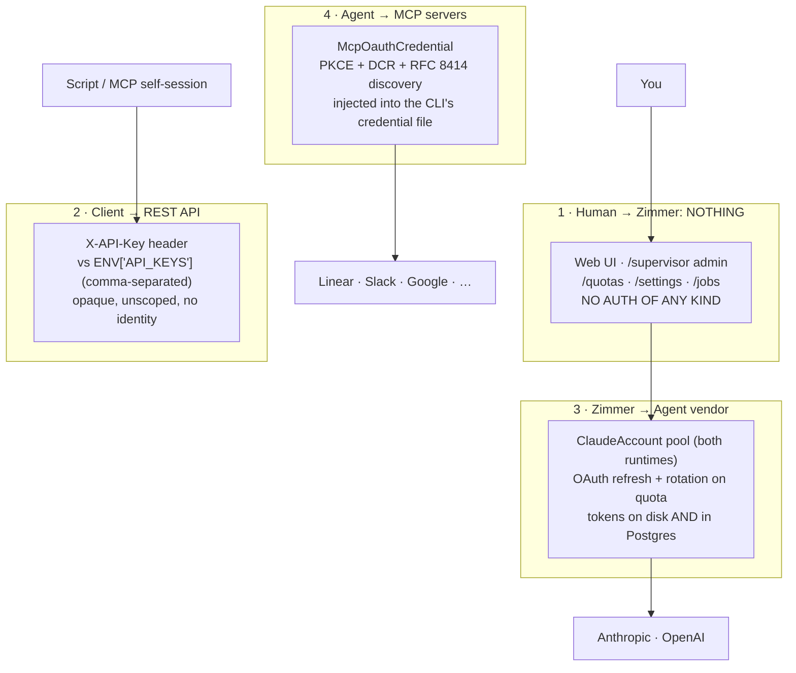

Zimmer has four separate authentication systems that share almost nothing. Understanding which is
which is most of the battle.



## 1. Human → Zimmer: there is no authentication

This is not a simplification. `ApplicationController` has **no `before_action` for auth, no session
auth, no Devise, no OmniAuth, no HTTP Basic**. There are no login routes. There is no `User` model in
the auth path.

Everything is open to anyone who can reach the host:

- the session dashboard and every transcript,
- `/settings`, `/quotas` (including the OAuth login flow),
- the GoodJob dashboard at `/jobs`,
- and **`/supervisor`** — the Administrate admin panel, which exposes `claude_accounts` (whose
  `oauth_config` JSONB holds **plaintext access and refresh tokens**), `mcp_oauth_credentials`,
  `x_oauth_credentials`, and `runtime_login_attempts` as *editable* resources.

`app/controllers/supervisor/application_controller.rb` is the whole story:

```ruby
before_action :authenticate_supervisor

def authenticate_supervisor
  # TODO Add authentication logic here.
end
```

:::danger[The security model is "put it on a tailnet"]
And Zimmer's own Terraform does exactly that: the DigitalOcean firewall allows only `22/tcp` and
Tailscale's `41641/udp`. **Port 80 is closed at the edge.** The app is reachable only over the
tailnet, at `http://zimmer`.

This works. But it means the *entire* security posture is network perimeter, and any deployment that
exposes port 80 — a reverse proxy, a public load balancer, a well-meaning `docker run -p 80:80` on a
box with a public IP — hands an anonymous visitor your Anthropic refresh tokens.

There are also at least six `# TODO: Add proper authorization checks` comments scattered through
`sessions_controller.rb`.
:::

## 2. Client → REST API: `X-API-Key`

The only authenticated surface. `Api::BaseController#authenticate_api_key` compares the `X-API-Key`
header against `ENV["API_KEYS"]` (comma-separated) using a constant-time comparison.

What it isn't:

- **No scoping.** Keys are opaque strings with no identity, no permissions, no ownership. Any valid
  key can read, mutate, and delete every session, trigger, and category.
- **No rotation without a restart** — the valid-key list is memoized per request instance from ENV.
- **No audit trail** of which key did what.

Three endpoints skip it entirely:

- `POST /api/v1/elicitations` and `GET /api/v1/elicitations/:id` — required by the MCP
  fallback-elicitation protocol, since the MCP child process has no key.
- `GET /api/secrets/keys` — because `Api::SecretsController` inherits `ApplicationController`, not
  `Api::BaseController`. It leaks secret **names and descriptions** (not values), unauthenticated.

:::caution[`API_KEYS` isn't set by the shipped deploy]
The cloud-init compose file sets no `API_KEYS`, so on a stock Terraform droplet the REST API 401s on
everything.
:::

## 3. Zimmer → the agent vendor

A pool of accounts (`ClaudeAccount` — misleadingly named; it serves **both** runtimes, discriminated
by a `runtime` column) with automatic OAuth refresh and automatic rotation when one hits its quota.

→ [Agent harness credentials](/auth/harness/)

## 4. The agent → MCP servers

A completely separate system: `McpOauthCredential` + `McpOauthPendingFlow`, doing full RFC 8414
discovery, RFC 7591 dynamic client registration, and PKCE — then writing the resulting tokens into
the CLI's own credential file so the agent's MCP client picks them up.

→ [MCP server OAuth](/auth/mcp-oauth/)

## Nothing is encrypted at rest

:::danger[No `encrypts` declaration exists anywhere in the codebase]
There is no `encrypts` in any model and no `config.active_record.encryption.*` anywhere in `config/`.

In `db/schema.rb`:

- `mcp_oauth_credentials.access_token`, `.refresh_token`, `.client_secret` — plain `text` / `string`
- `mcp_oauth_pending_flows.code_verifier`, `.client_secret` — plain
- `claude_accounts.oauth_config` — plain `jsonb`, holding Anthropic and OpenAI access **and refresh**
  tokens
- `x_oauth_credentials` — plain
- `runtime_login_attempts.pasted_code` — plain `string`

`XOauthCredential`'s own header admits it: *"access_token / refresh_token are stored as plain text…
Security relies on database access controls."*

Combined with an unauthenticated Administrate panel that renders those columns, **database access
controls are the only control, and the admin panel bypasses them.**
:::

## The environment variables that matter

| Var | Used for |
| --- | --- |
| `API_KEYS` | REST API auth (comma-separated) |
| `APP_HOST` | The MCP OAuth **redirect URI**. Defaults to `localhost:3000`, and picks `http` iff the host string contains "localhost". |
| `RAILS_MASTER_KEY` | Unlocks Rails credentials (`mcp_oauth_clients`, `mcp_secrets`) |
| `X_OAUTH_CLIENT_ID` / `_SECRET` | X/Twitter token vending |
| `ANTHROPIC_API_KEY` | Local dev, when not using OAuth |

:::caution[`APP_HOST` unset breaks every MCP OAuth flow]
`McpOauthService` does `ENV.fetch("APP_HOST") { "localhost:3000" }`. It is **not set in the shipped
cloud-init**, so on a stock deploy every OAuth callback URL points at `localhost:3000` and every flow
fails.
:::
