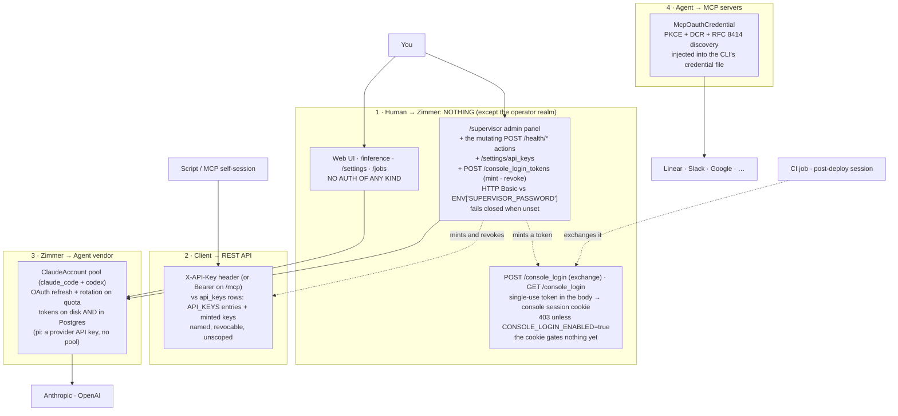

Zimmer has four separate authentication systems that share almost nothing. Understanding which is
which is most of the battle.


```mermaid
flowchart TB
    subgraph none["1 · Human → Zimmer: NOTHING (except the operator realm)"]
        W["Web UI · /inference · /settings · /jobs<br/>NO AUTH OF ANY KIND"]
        SUP["/supervisor admin panel<br/>+ the mutating POST /health/* actions<br/>+ /settings/api_keys<br/>+ POST /console_login_tokens (mint · revoke)<br/>HTTP Basic vs ENV['SUPERVISOR_PASSWORD']<br/>fails closed when unset"]
        CL["POST /console_login (exchange) · GET /console_login<br/>single-use token in the body → console session cookie<br/>403 unless CONSOLE_LOGIN_ENABLED=true<br/>the cookie gates nothing yet"]
    end
    subgraph api["2 · Client → REST API"]
        A["X-API-Key header (or Bearer on /mcp)<br/>vs api_keys rows: API_KEYS entries + minted keys<br/>named, revocable, unscoped"]
    end
    subgraph harness["3 · Zimmer → Agent vendor"]
        H["ClaudeAccount pool (claude_code + codex)<br/>OAuth refresh + rotation on quota<br/>tokens on disk AND in Postgres<br/>(pi: a provider API key, no pool)"]
    end
    subgraph mcp["4 · Agent → MCP servers"]
        M["McpOauthCredential<br/>PKCE + DCR + RFC 8414 discovery<br/>injected into the CLI's credential file"]
    end

    U["You"] --> W
    U --> SUP
    SUP -. mints a token .-> CL
    CI["CI job · post-deploy session"] -. exchanges it .-> CL
    C["Script / MCP self-session"] --> A
    W --> H
    SUP --> H
    SUP -. mints and revokes .-> A
    H --> V["Anthropic · OpenAI"]
    M --> S["Linear · Slack · Google · …"]
```

## 1. Human → Zimmer: there is no authentication (except the operator realm)

This is not a simplification. `ApplicationController` has no `before_action` for auth, no session
auth, no Devise, no OmniAuth. There is no `User` model in the auth path. The one login route that
exists, `POST /console_login`, is the [agent-login primitive](#the-agent-login-primitive-console-login-tokens)
below: it is off unless a deployment opts in, it is for automated actors rather than people, and
the cookie it issues gates nothing today.

Everything is open to anyone who can reach the host:

- the session dashboard and every transcript,
- `/settings`, `/inference` (including the OAuth login flow),
- the GoodJob dashboard at `/jobs`.

### The exception: the operator realm, in front of four surfaces

Four surfaces are where "anyone who reaches the host" is too generous, and they share one HTTP Basic
realm — `OperatorHttpBasicAuth` (`app/controllers/concerns/operator_http_basic_auth.rb`):

```ruby
before_action :authenticate_operator

def authenticate_operator
  expected_password = ENV[PASSWORD_ENV].to_s
  return refuse_operator_unconfigured if expected_password.blank?
  # ...constant-time compare of username and password, then `refuse_operator` on failure
end
```

**`/supervisor`**, because the Administrate admin panel renders `claude_accounts` (whose
`oauth_config` JSONB holds plaintext access and refresh tokens), `mcp_oauth_credentials`,
`x_oauth_credentials`, and `runtime_login_attempts` as *editable* resources. It is also where the X
consent flow runs, so minting an X credential takes the operator credential on every leg.

**The API keys page, `/settings/api_keys`**, all of it, reads included, because it creates and
revokes the credential the REST API and MCP endpoint take. See [managing keys](#managing-keys).

**Minting and revoking console login tokens, `POST /console_login_tokens`** and
`POST /console_login_tokens/:id/revoke`, because they issue the credential the
[agent-login primitive](#the-agent-login-primitive-console-login-tokens) exchanges for a console
session. Closed altogether unless `CONSOLE_LOGIN_ENABLED` is `true`, and that check runs first, so a
deployment that never opted in does not even challenge.

**The mutating `POST /health/*` actions** — `cleanup_processes`, `retry_sessions`, `archive_old`,
`enter_queue_recovery_mode` and `run_post_deploy_tasks` — because they terminate processes, rewrite
session rows in bulk, and halt the fleet's demand-side job queues. Every `GET` on `/health` stays
anonymous: a read-only dashboard behind the perimeter is the design, and `/up` and `/up/deep` are
what kamal-proxy gates the deploy cutover on. So does `POST /health/exit_queue_recovery_mode` — the
way *out* of a halt must always work, including on a deployment that never set the variable.

:::note[Why not the API key?]
The `/health` gate exists for a caller that is already inside the perimeter: agent sessions run on
the production host, and the Rails app answers from inside a session's shell. A session holds a
valid `API_KEYS` entry in its own environment and in its `.mcp.json`, so a gate keyed on that
credential would not exclude it. `SUPERVISOR_PASSWORD` is the one credential sessions do not hold,
because `CliSpawnEnv` clears it from every spawned process. Moving this realm onto a different
variable means adding that variable to `CliSpawnEnv`'s blocklist, or the gate quietly stops being
one. See [the note in limitations](/limitations/#the-operator-realm-closes-the-web-door-and-not-the-other-two).
:::

Sharing one realm string across both is deliberate on the human side too: browsers cache Basic
credentials per origin *and realm*, so an operator who has opened `/supervisor` is already carrying
what the `/health` buttons ask for.

One shared credential, no user model — this is not "who are you", it is "are you inside the
perimeter at all". Set `SUPERVISOR_PASSWORD`; `SUPERVISOR_USERNAME` is optional and defaults to
`supervisor`. Both halves are compared with `ActiveSupport::SecurityUtils.secure_compare`, the same
constant-time primitive `Api::BaseController#authenticate_api_key` uses.

#### The refusal and the challenge are separate

A 401 is the gate saying no. The `WWW-Authenticate: Basic` header on it is a *second*, separable
instruction — "go ask the human" — and browsers obey it for any same-origin credentialed `fetch`,
not just for a navigation someone started ([WHATWG Fetch, HTTP-network-or-cache
fetch](https://fetch.spec.whatwg.org/#http-network-or-cache-fetch)).

Turbo Drive prefetches same-origin links 100ms after the cursor enters them, which made that
distinction load-bearing: hovering the dashboard's **Supervisor** button fired a background GET at
the realm, and the browser opened its native sign-in dialog on top of a page nobody was leaving. It
looked random because it tracked the mouse rather than any click.

So `Supervisor::ApplicationController#refuse_operator` withholds the challenge — and only the challenge —
from a request the browser made speculatively (`SpeculativeRequest#prefetch_request?`, which reads
`X-Sec-Purpose`, `Sec-Purpose` and `Purpose`). The request is still refused with a 401; a real
navigation still gets the challenge and still signs in. Belt and braces, every link to the realm
also carries `data-turbo-prefetch="false"`, so the request is not made at all —
`test/contracts/basic_auth_prefetch_test.rb` sweeps `app/views/**` and fails if a new one forgets.

**It fails closed.** With `SUPERVISOR_PASSWORD` unset — or blank, which is what a trailing space in
an env file gets you — every request to every dashboard gets a 401, and the refusal is logged.
An unconfigured deployment gets no admin panel rather than an anonymous one — so on a fresh deploy
you must set the variable before `/supervisor` will open for you either.

The same is true of `/health`'s maintenance buttons, and there the closed state has a route around
it rather than being a dead end: the identical actions are on `POST /api/v1/health/*` behind
`API_KEYS`, and `exit_queue_recovery_mode` is ungated on purpose, so an instance that never set the
variable can still be got out of a halt. The 401 body names `SUPERVISOR_PASSWORD`, so the refusal is
diagnosable from the response and not only from the log.

:::danger[The security model is still "put it on a tailnet"]
The perimeter remains the authentication boundary for everything else, and Zimmer's own Terraform
enforces it. The DigitalOcean firewall allows only `22/tcp` and Tailscale's `41641/udp`, port 80 is
closed at the edge, and the app is reachable only over the tailnet, at `http://zimmer`.

The sharp edge is real. Any deployment that exposes port 80 (a reverse proxy, a public load
balancer, a well-meaning `docker run -p 80:80` on a box with a public IP) hands an anonymous visitor
every session transcript and the `/inference` OAuth flow. The Basic realm narrows the worst of it — the
token-bearing dashboards — but it is one credential in front of one panel, not a login system.
Tracked in [#43](https://github.com/tadasant/zimmer/issues/43).
:::

### The agent-login primitive: console login tokens

An automated actor sometimes needs to drive Zimmer's own web UI — a Playwright run in CI
([#162](https://github.com/tadasant/zimmer/issues/162)), a post-deploy agent session checking a page
it just changed. Today there is nothing to authenticate to. When a gate is put in front of the UI
there will be, and the wrong answer is a standing admin credential in a job log or a transcript.
[#220](https://github.com/tadasant/zimmer/issues/220) lands the right answer ahead of the gate: a
**short-lived, single-use, revocable** login token, exchanged once for a session cookie. What leaks
is dead within minutes and cannot be replayed.

**It is off unless you opt in.** Every endpoint below answers `403` naming `CONSOLE_LOGIN_ENABLED`
until that variable is the literal `true`, and nothing sets it by default in any environment,
including the shipped provisioning. That check runs before any credential is read, so a closed
deployment neither challenges for the operator password nor reveals whether a token exists.

Two stages, two credentials:

```mermaid
sequenceDiagram
    participant CI as CI job (holds SUPERVISOR_PASSWORD)
    participant Z as Zimmer
    participant A as Playwright / agent session
    CI->>Z: POST /console_login_tokens {principal, ttl_seconds, session_ttl_seconds}<br/>HTTP Basic, operator realm
    Z-->>CI: 201 {token: "zlt_<id>.<secret>", …} — shown once; the row holds SHA-256(secret)
    CI->>A: hand the token over (env var, never a URL)
    A->>Z: POST /console_login {token} — in the body
    Note over Z: one UPDATE … WHERE status = 'active' AND expires_at > now → consumed
    Z-->>A: 200 + Set-Cookie zimmer_console_session (HttpOnly · SameSite=Lax · Max-Age = session_ttl_seconds)
    A->>Z: GET /console_login (with the cookie)
    Z-->>A: 200 {principal, role, expires_at}
    A->>Z: POST /console_login {the same token}
    Z-->>A: 409 reason: consumed — no cookie. The tripwire.
```

**Mint** — `POST /console_login_tokens`, behind the [operator realm](#the-exception-the-operator-realm-in-front-of-four-surfaces).
The operator credential and not an API key, for the reason `/settings/api_keys` gives: every agent
session holds an API key, and `SUPERVISOR_PASSWORD` is the one credential `CliSpawnEnv` keeps out of
them, so this is the surface the fleet's shared key cannot use to issue itself a login. The body is
JSON — every console-login write refuses anything else with a `415`, which is the CSRF defence (see
below): `principal` (required string — who the login is for; it goes in the log and the cookie),
`ttl_seconds` (the mint-to-exchange window, default 300, clamped to 10–900) and
`session_ttl_seconds` (the session's lifetime, default 900, clamped to 60–3600). The `201` carries
the plaintext `token` once, with `Cache-Control: no-store`; the `console_login_tokens` row holds a
SHA-256 digest and never the secret, in the same shape as `api_keys`. The wire form is
`zlt_<id>.<secret>`: the id finds the row, the secret is compared in constant time.

```bash
curl -s -u "supervisor:$SUPERVISOR_PASSWORD" -H 'Content-Type: application/json' \
  -d '{"principal":"ci-playwright","ttl_seconds":120,"session_ttl_seconds":900}' \
  "$BASE_URL/console_login_tokens"
# {"token":"zlt_12.7f3a…","console_login_token":{"id":12,"principal":"ci-playwright","role":"console","status":"active","expires_at":"…","session_ttl_seconds":900,…}}
```

**Exchange** — `POST /console_login`, no credential but the token, **in a JSON request body**. A
token in the query string counts as leaked — a URL is written to access logs and forwarded in
`Referer`, a body is not — so it is revoked on sight if it is a whole valid token, and the request
is refused with a `400` (`revoked: true|false`) whatever the body says. The exchange is one conditional
`UPDATE … WHERE status = 'active' AND expires_at > now`, from `active` to `consumed`, so two
requests racing on one token get one `200` and one `409` — there is no window in which both succeed.
On success the response sets `zimmer_console_session` and answers `200` with what the cookie
carries. On any refusal there is **no cookie**, and the status and `reason` say which kind:

| Status | `reason` | Meaning |
| --- | --- | --- |
| `401` | `invalid` | Malformed, no such id, or a secret that does not match. One answer for all three: the response does not distinguish them |
| `401` | `expired` | The secret matched, the token was never used, and its window closed |
| `409` | `consumed` | Already exchanged. **The tripwire** — see below |
| `409` | `revoked` | Revoked before it was exchanged |

The row-state reasons are only ever told to a caller holding the right secret.

**The session** is an encrypted cookie, separate from the Rails session cookie that carries the
flash and the CSRF token: `HttpOnly`, `SameSite=Lax`, `Secure` outside a local (development or test)
deployment on plain HTTP, `Max-Age` equal to the row's `session_ttl_seconds`. The server does not
rely on the browser honouring that: the same instant is inside the encrypted payload, and the
server refuses the cookie past it however long a client keeps it. The cookie carries the row's `principal` and `role` — the authority is **baked into the
row at mint** and nothing about how the token is presented can change it — and the row's id, for
the log. The one role is `console`: the web UI, and nothing behind the operator realm. A console
session never satisfies `OperatorHttpBasicAuth`, so an actor holding one cannot mint another. The
session outlives the token's own window (a 60-second token can issue a 15-minute session) and
outlives a later revoke of the token, which is a no-op on a consumed row by design.

`GET /console_login` reads the cookie back — `200 {console_login: {token_id, principal, role,
expires_at}}` or `401` — and is how an actor confirms its exchange took before it drives the UI.

**Revoke** — `POST /console_login_tokens/:id/revoke`, behind the operator realm. Idempotent: `200`
with `revoked: true` for the call that changed the row, `false` after that and for a consumed row,
`404` for an id that was never minted.

**A failed exchange is a signal, not a retry.** Single-use is not only about blast radius. An actor
that just minted a token, has not used it, and gets `409 consumed` back has learned that someone
else presented it first — or that the flow is broken. Either way the move is: do not retry the same
token; revoke the id, alarm, mint a fresh one, try once more, and stop on a second failure. A
replayable token works for the thief and the legitimate actor alike and produces no signal at all.
Every refusal is logged at WARN with the row's id, so it ships to obs:

```text
[console_login] minted token id=12 for "ci-playwright" from 100.64.0.7 expires_at=… session_ttl_seconds=900
[console_login] exchanged token id=12 for "ci-playwright" from 100.64.0.9; session expires_at=…
[console_login] refused exchange of token id=12 ("ci-playwright", status=consumed) from 100.64.0.11: consumed
```

**What it does not do yet, honestly.** No controller gates on the cookie: the web UI has no login,
so an exchanged session authorizes exactly what the perimeter already grants, and `GET /console_login`
is the only reader. `ConsoleSession` (`app/controllers/concerns/console_session.rb`) is what a UI
gate includes when one exists. Until then the primitive is proof that the flow works end to end,
behind a flag nobody has to set. The residual gap once it is used in anger: a consumed token is
dead, a revoked-unconsumed token is dead, and a leaked mint is bounded by the mint-to-exchange
window and then by the session TTL, which is why both are short and clamped. The controllers are
`ActionController::API`, with no authenticity token, and a browser attaches cached Basic credentials
to a cross-site form post — so every write is **JSON only**. A cross-origin JSON post is preflighted
and nothing answers the preflight, so no page an operator visits can mint or revoke with their
credential, or log their browser in with a token it chose (login CSRF). Rows are reaped 30 days after they expire by
[`ConsoleLoginTokenReaperJob`](/operate/background-jobs/); until then `/supervisor/console_login_tokens`
lists who was minted a login and whether it was exchanged, read-only. There is no REST `/api/v1`
route and no MCP tool for any of this, on purpose. See
[the limitation](/limitations/#console-login-tokens-issue-a-session-that-nothing-gates-on-yet).

### There is no per-user authorization in `SessionsController`, and that is the design

Sessions have no owner column and there is no principal to compare one against, so there is nothing
for a policy object to decide. `SessionsController` says so explicitly at the top of the class, and
each action that used to carry a `# TODO: Add authorization check` comment now points at that note.
Those comments read as unfinished work; they described the product's shape. See
[the philosophy](/intro/philosophy/) for why a single circle of trust has no ACLs to build.

## 2. Client → REST API: `X-API-Key`

The only authenticated surface. `Api::BaseController#authenticate_api_key` hands the `X-API-Key`
header to `ApiKey.authenticate`. `POST /mcp` also takes the key as `Authorization: Bearer`. A key is
one of two things, and both are rows in `api_keys`:

- **An `API_KEYS` entry** (comma-separated, from the environment). Every client that existed before
  [#46](https://github.com/tadasant/zimmer/issues/46) holds one of these, including every agent
  session, so they keep working. The first time an entry authenticates it gets a row named
  `API_KEYS <fingerprint>`. The row authenticates only while the key is still in the variable, so
  removing an entry and redeploying retires it, as it always did.
- **A minted key**, created on the API keys page. It is shown once, in the response that created it.

The table holds a SHA-256 digest of each key and never the key. Every request re-reads `API_KEYS`
and re-finds the row. Nothing is cached across requests, so a revoke takes effect on the next
request in every Puma worker.

Each request is logged with the key's name and never the key:

```text
[api_key] POST /mcp authenticated as "API_KEYS 3f9a1c2e" (api_key_id=1, source=env)
[api_key] GET /api/v1/sessions refused from 100.64.0.7: "laptop scripts" (api_key_id=4, source=minted) was revoked at 2026-09-11T20:14:03Z
```

The success line is INFO, so it stays in the container's stdout, tagged with the request id. A
refusal that names a known key (revoked, or no longer in `API_KEYS`) is WARN, so it ships to obs.
`last_used_at` is stamped at most once a minute per key.

What it still isn't:

- **No scoping.** Any valid key can read, mutate, and delete every session, trigger, and category.
- **No per-session identity.** The agents share the deployment's self-session key. See
  [the limitation](/limitations/#api-keys-have-names-but-no-scope-and-the-whole-fleet-shares-one).

### Managing keys

`/settings/api_keys` (linked from Settings) lists every key by name, with where it came from, its
fingerprint, and when it was last used. It marks the key this deployment gives its own agent
sessions' Zimmer MCP servers, but that is not the only entry agents hold: `CliSpawnEnv` does not
clear `API_KEYS`, so every session's environment carries all of them. Only a minted key is out of an
agent's reach. From there you can:

- **Create** a named key. Copy it from the page, because it is not shown again.
- **Revoke** a key. It is refused from the next request on. Revoking is a timestamp, not a delete, so
  that a revoked `API_KEYS` entry stays revoked while the key is still in the variable.
- **Restore** a revoked key, if you revoked the wrong one. It authenticates again at once.

The page sits behind the [operator realm](#the-exception-the-operator-realm-in-front-of-four-surfaces),
and it has no REST or MCP sibling, on purpose. Agent sessions hold an API key and not the operator
credential. If an API key could mint keys it would issue itself new credentials, and if it could
revoke them any session could cut every other session off by revoking the key they share. With
`SUPERVISOR_PASSWORD` unset the page is closed, and `API_KEYS` entries still work.

The fingerprint is the first eight characters of the key's SHA-256, so you can match a key you hold
to its row:

```bash
printf %s "$KEY" | sha256sum | cut -c1-8
```

Two endpoints take a different credential instead:

- `POST /api/v1/elicitations/session/:token` and `GET /api/v1/elicitations/session/:token/:request_id`
  — the MCP fallback-elicitation protocol. The MCP child process has no key, so it authenticates
  with a per-session token in the URL path, which Zimmer puts in its environment at spawn. A token
  reaches only its own session's elicitations, and it is not derived from any API key. See
  [who may raise a prompt](/sessions/elicitation/#who-may-raise-a-prompt).

## 3. Zimmer → the agent vendor

A pool of accounts (`ClaudeAccount` — misleadingly named; it serves the two runtimes that have a
pool, discriminated by a `runtime` column) with automatic OAuth refresh and automatic rotation when
one hits its quota.

Pi is outside all of it: it resolves a provider API key (`OPENROUTER_API_KEY`) per request from the
session environment, so there is no account row, nothing to refresh and nothing to rotate.

→ [Agent harness credentials](/auth/harness/) · [Runtimes](/sessions/runtimes/)

## 4. The agent → MCP servers

A completely separate system: `McpOauthCredential` + `McpOauthPendingFlow`, doing full RFC 8414
discovery, RFC 7591 dynamic client registration, and PKCE — then writing the resulting tokens into
the CLI's own credential file so the agent's MCP client picks them up.

X (Twitter) is the exception: its token is an `XOauthCredential` row, vended as an env var, and
minted by a consent flow that runs from `/supervisor` behind the operator realm.

→ [MCP server OAuth](/auth/mcp-oauth/), and [X (Twitter) is minted from
`/supervisor`](/auth/mcp-oauth/#x-twitter-is-minted-from-supervisor)

## Prefer remote MCP servers to long-lived API tokens

When you give an agent a new capability, you usually have two ways to do it:

- a **stdio MCP server or a CLI** — a local process that reads a long-lived API token out of the
  environment (`env: { "LINEAR_API_KEY": "${LINEAR_API_KEY}" }`), or a CLI you `op`-inject a token
  into and then shell out to;
- a **remote MCP server** — an `http` / `streamable-http` / `sse` endpoint that Zimmer authorizes
  once over OAuth, with dynamic client registration, PKCE, and a refresh token it rotates for you.

**Reach for the remote server.** The difference shows up on the bad day, not the good one. Agents
read and write an enormous amount of text — logs, transcripts, diffs, error messages they paste back
to themselves — and a credential that lives in the environment will eventually land in one of them.
If that credential is a long-lived API token, your options are to accept a permanent exposure or to
spend the next five hours hunting down and rotating every copy of it. If it is a short-lived OAuth
token that Zimmer already rotates on a schedule, it expires on its own, and revoking it is one click
plus a browser re-auth.

The same asymmetry is why the harness itself signs in rather than taking an API key: see
[agent harness credentials](/auth/harness/).

[**Strad**](https://strad.tadasant.com) is the remote-MCP platform built to pair with Zimmer — the
place to put the servers you'd otherwise be running as token-hungry local processes. Its docs are
going up now.

:::caution[Zimmer does not fully live by this yet]
The advice is real, and so is the gap. Zimmer's own `mcp.json` still carries stdio servers whose
`env` holds `${VAR}` placeholders, and `SecretsLoader.all` — the union of *every* secret in
`mcp_secrets` — is written to a `.env` file in **every session clone** and merged into the agent's
environment, regardless of which servers that session actually selected. A 1Password service-account
token is exactly the kind of long-lived credential this section tells you to avoid, and it is one of
the values in that file.

Every stdio server you replace with a remote one shrinks that blast radius. See
[MCP servers](/air/mcp-servers/#secrets-never-touch-the-catalog) for how the placeholder-and-secret
plumbing works today.
:::

## Nothing is encrypted at rest

:::danger[No `encrypts` declaration exists anywhere in the codebase]
There is no `encrypts` in any model and no `config.active_record.encryption.*` anywhere in `config/`.

In `db/schema.rb`:

- `mcp_oauth_credentials.access_token`, `.refresh_token`, `.client_secret` — plain `text` / `string`
- `mcp_oauth_pending_flows.code_verifier`, `.client_secret` — unencrypted
- `claude_accounts.oauth_config` — plain `jsonb`, holding Anthropic and OpenAI access and refresh
  tokens
- `x_oauth_credentials` — plain
- `x_oauth_pending_flows.code_verifier` — plain, until the consent is finished, replaced, or swept by the next start after its 30 minutes run out
- `runtime_login_attempts.pasted_code` — plain `string`

`XOauthCredential`'s own header admits it: *"access_token / refresh_token are stored as plain text…
Security relies on database access controls."*

Combined with an Administrate panel that renders those columns as *editable* resources, database
access controls are close to the only control — and what stands between the panel and them is one
shared HTTP Basic password, not a database grant. That realm [fails
closed](#the-exception-the-operator-realm-in-front-of-four-surfaces), so an unconfigured deployment has no
panel at all; a configured one has exactly one credential in front of the plaintext.
:::

### In transit, at least, one field is guarded

`x_oauth_credentials.token_endpoint` is editable in that panel, and it decides both where the
token request goes *and* whether TLS is used — `XOauthCredential.post_token_request` sets
`use_ssl` from the URL's scheme, and the X client secret rides along as HTTP Basic. An `http://`
value there puts a long-lived confidential-client secret on the wire in the clear, and whether
anything surfaces afterwards depends on what is listening: a plain redirect lands in
`last_refresh_error`, but anything that speaks the token protocol answers `200` and the leak
leaves no trace.

The model refuses it: `token_endpoint` must parse as an `https://` URL with a host and no embedded
credentials. There is no loopback exception — X publishes no plaintext token endpoint, so `https`
is the only value the field was ever meant to hold, and an exceptionless rule is what makes the
panel reviewable. A migration repairs any row that predates the rule, applying that same predicate
rather than a `LIKE` approximation of it, because a legacy `http://` row would otherwise POST first
and only fail validation on the way to *saving* the rotated refresh token — a leak and a dead
credential in one pass.

`mcp_oauth_credentials.token_endpoint` now carries the same rule, for a worse version of the same
defect: the MCP refresh grant sends the `client_secret` **and** the refresh token as form
parameters, so `http://` publishes both — and the refresh still returns `200`, so nothing surfaces.

The MCP endpoint is not only operator-editable, it is **discovered**: `McpOauthService` reads it out
of each server's own authorization-server metadata. That is why the rule is exceptionless here too,
loopback included. A carve-out would be triggerable by the one party outside Zimmer's control, and a
remote server naming this host's loopback has no honest meaning — it would aim a POST carrying an
operator-supplied client secret at whatever answers on Zimmer's own port. A developer pointing at a
local MCP server gets a clear refusal instead of a silent cleartext POST.

The rule is enforced at four depths, because the endpoint is read at four:

| Where | What it does |
| --- | --- |
| `McpOauthCredential` | Refuses to save a non-https endpoint (blank stays legal — it means "re-authorize me") |
| `McpOauthCredential#can_refresh?` | False for a cleartext endpoint, so cron and the injector never call `refresh!` on one |
| `McpOauthPendingFlow` | Refuses to store one, so the *initial* code exchange cannot leak it either |
| `McpOauthService#post_form` | Raises `InsecureEndpoint` rather than opening a cleartext connection |
| `McpOauthService#post_json` | The same rule on the DCR registration endpoint, whose response mints a client secret |

`McpOauthController#initiate` checks before it redirects to consent, so a server advertising a
cleartext token endpoint is refused with a flash naming it — no authorization code is ever minted
for an endpoint Zimmer will not talk to.

A migration clears any row that predates the rule (to `NULL`, since an MCP token endpoint has no
default to reset to — re-authorizing rediscovers it). Without that, validation alone would be
*worse* than nothing: `refresh!` POSTs before it saves, so the secret would still have gone out, the
provider would have rotated the single-use refresh token, and only then would the save have raised
`RecordInvalid` — a leak and a permanently unrefreshable credential in one pass.

## The environment variables that matter

| Var | Used for |
| --- | --- |
| `API_KEYS` | REST API and MCP auth (comma-separated). Each entry gets a named row the first time it is used, and can be revoked on `/settings/api_keys`. Minted keys live only in the database. |
| `SUPERVISOR_PASSWORD` | The operator HTTP Basic realm: `/supervisor`, `/settings/api_keys`, the mutating `POST /health/*` actions, and minting and revoking console login tokens. Unset or blank means **all four are closed**, not open. |
| `SUPERVISOR_USERNAME` | Optional; defaults to `supervisor`. |
| `CONSOLE_LOGIN_ENABLED` | The [agent-login primitive](#the-agent-login-primitive-console-login-tokens). Unset by default everywhere; only the literal `true` opens `POST /console_login_tokens`, `POST /console_login` and their siblings. Not a secret, so it is not cleared from agent sessions' environments — a session that can see it still needs the operator credential to mint. |
| `APP_HOST` | The MCP OAuth **redirect URI**. Defaults to `localhost:3000`, and picks `http` iff the host string contains "localhost". |
| `RAILS_MASTER_KEY` | Unlocks Rails credentials (`mcp_oauth_clients`, `mcp_secrets`) |
| `X_OAUTH_CLIENT_ID` / `_SECRET` | X/Twitter token vending |
| `X_OAUTH_REDIRECT_URI` | Where X sends the operator after consent, on both the consent request and the token exchange. Defaults to `http://localhost:8080/callback`, where nothing listens, so the operator pastes the redirect URL back into `/supervisor`. Set it to `https://<APP_HOST>/supervisor/x_oauth/callback` and the flow finishes on its own. Whatever you set must already be registered on the X app. See [X (Twitter) is minted from `/supervisor`](/auth/mcp-oauth/#x-twitter-is-minted-from-supervisor). |
| `ANTHROPIC_API_KEY` | Local dev, when not using OAuth |

:::caution[`APP_HOST` unset breaks every MCP OAuth flow]
`McpOauthService` does `ENV.fetch("APP_HOST") { "localhost:3000" }`. It is not set in the shipped
cloud-init, so on a stock deploy every OAuth callback URL points at `localhost:3000` and every flow
fails.
:::
