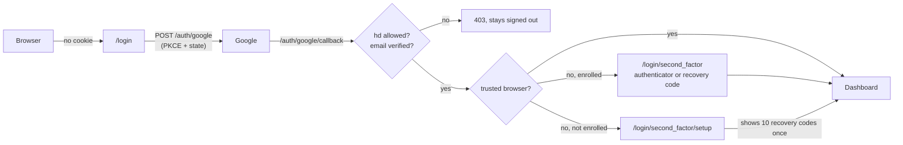

Zimmer can put a login wall in front of its web UI. Sign-in goes through Google, and only
accounts in the Google Workspace domains you name get in. After that comes a code from an
authenticator app. Then the browser stays signed in for months.

It is **off unless you turn it on**. A deployment that sets nothing behaves exactly as it always
has: no login page, and the network perimeter is the only wall. It does not replace the perimeter
either. Keep the tailnet; this is a second wall behind it.

## Turning it on

All of it is configuration, read through the [secret-provider chain](/operate/secrets-parameter-store/):
the Parameter Store first, then Rails credentials, then the process environment. Turning the wall on
or off is a secret-store write. It takes no deploy and no shell, and each Puma process picks the
change up within a minute.

| Variable | What it does | Default |
| --- | --- | --- |
| `ZIMMER_WEB_AUTH_GOOGLE_CLIENT_ID` | **The switch.** Set means the wall is up | not set, so the wall is off |
| `ZIMMER_WEB_AUTH_GOOGLE_CLIENT_SECRET` | The OAuth client's secret. Read only when a sign-in comes back from Google | not set |
| `ZIMMER_WEB_AUTH_ALLOWED_DOMAINS` | Google Workspace domains allowed in, comma- or space-separated, e.g. `tadasant.com` | not set |
| `ZIMMER_WEB_AUTH_SECOND_FACTOR` | `totp` asks for an authenticator code after Google. `google` asks for nothing more (see [below](#why-zimmer-asks-for-its-own-second-factor)). Any other value still requires the code, and is listed as a problem on the login page | `totp` |
| `ZIMMER_WEB_AUTH_SESSION_DAYS` | How long a browser stays signed in without being used | `90` |
| `ZIMMER_WEB_AUTH_TRUSTED_DEVICE_DAYS` | How long a browser that passed the second factor skips it at its next Google sign-in | `365` |
| `ZIMMER_WEB_AUTH_SECOND_FACTOR_RESET_BEFORE` | An ISO 8601 time. Any authenticator set up before it no longer counts. See [lost your second factor](#lost-your-second-factor). A value that does not parse stops new sign-ins and is named on the login page, rather than being ignored | not set |

**If the secret store stops answering**, each Puma process keeps the configuration it last read. A
process that boots during the outage uses the last configuration any process wrote to `Rails.cache`
(everything but the client secret). Existing sign-ins keep working, and new ones wait for the store,
because finishing one needs the secret. Only a process with neither answers `503` on browser pages.
The machine paths never read this configuration.

**Set the client ID last, or all three in one write.** Once the client ID is set the wall is up, and
if the secret or the domains are missing, nobody gets in. The login page lists what is missing. It
fails closed on purpose: once a deployment has asked for a wall, a typo must not quietly leave the
UI open. Removing the client ID takes the wall down again.

### The Google Cloud OAuth client

In the Google Cloud project that belongs to your Workspace:

1. **APIs & Services → OAuth consent screen.** Choose **Internal**. Internal already limits
   sign-in to your Workspace's own accounts, and Zimmer checks the domain again on its side.
   Scopes: `openid`, `email` and `profile`, nothing else.
2. **APIs & Services → Credentials → Create credentials → OAuth client ID**, type **Web
   application**.
3. **Authorized redirect URI:** your deployment's base URL plus `/auth/google/callback`, for
   example `https://zimmer.example.com/auth/google/callback`. The base URL is the one
   [`AppUrl`](/start/configuration/) resolves (`ZIMMER_PROD_BASE_URL` in production). Google takes
   only `https` redirect URIs, apart from `http://localhost`, so a deployment reached only at a
   plain-HTTP tailnet name such as `http://zimmer` needs an HTTPS name before this can work.
4. Put the client ID and secret in the secret store as the two variables above.

A browser that starts on another hostname, say the tailnet name, still signs in, but it comes back
on the base URL's host. Cookies belong to one host, so that is where it stays signed in.

## What is checked

Zimmer runs Google's OpenID Connect authorization-code flow itself (`WebAuth::GoogleOauth`). It is
the same shape as strad's console login.

- **The domain is checked against the ID token's `hd` claim, not the email address.** A personal
  Google account can carry an address on someone else's domain, and Google can mark it verified.
  Google sets `hd` only for accounts that really belong to that Workspace. The `hd` parameter on the
  consent URL is only a hint to Google's account picker, and Zimmer never trusts it.
- **`email_verified` must be `true`.** An unverified email is refused, whatever its domain.
- **Issuer, audience and expiry** must be Google's, this client's, and not past, with five
  minutes allowed for clock skew.
- **PKCE and `state`.** The sign-in starts with a `POST` that carries the CSRF token, so another site
  cannot start one in your browser. The callback must carry the `state` this browser was given
  within the last 15 minutes.
- **The token's signature is not checked against Google's keys.** That is allowed here: the token
  never passes through the browser. Zimmer gets it in the response to its own authenticated `POST`
  to Google's token endpoint, over TLS with certificate checking, and OpenID Connect Core §3.1.3.7
  lets that stand in for the signature check.

A refused sign-in answers `403` and says why: another Workspace, a personal account, or an unverified
email. It logs one WARN line with the reason. No `web_identities` row is written.

## The second factor

### Why Zimmer asks for its own second factor

Google Workspace can require 2-Step Verification, and you should turn that on. But Zimmer cannot see
whether it happened: Google's ID tokens do not reliably carry an `amr` claim. A wall whose second
factor can't be checked is a wall in name only. So by default Zimmer asks for its own: a six-digit
code from an authenticator app (TOTP, RFC 6238). It works with 1Password, Google Authenticator,
Authy, or anything else that takes a setup key.

`ZIMMER_WEB_AUTH_SECOND_FACTOR=google` turns Zimmer's own factor off and trusts the Workspace's 2SV
policy instead, with the gap above. Switching back to `totp` signs out every browser that never
passed a code.

Passkeys (WebAuthn) would resist phishing better than TOTP does. They are not here yet.

### Setting it up

The first sign-in sets it up. After Google, the setup page shows a key and an `otpauth://` link. On
a phone, the link opens the authenticator app directly. You confirm with the code the app shows.
Then Zimmer shows **ten recovery codes, once**. Each code stands in for the authenticator for a
single sign-in. Put them in your password manager.

A browser that has passed Google but not the second factor gets 15 minutes to finish. It cannot set
up a new authenticator while one already stands. Otherwise anyone holding the Google account could
replace the authenticator and walk past it.

### Wrong codes

A code is accepted once: Zimmer remembers the last time step it took. Clocks may be one 30-second
step off either way. Every five wrong answers in a row, authenticator or recovery code, lock the
second factor: 15 minutes the first time, then 30, then an hour, doubling up to a day. Only a right
answer clears the count, so slow guessing gets slower rather than resetting. Each lockout logs a
WARN line.

## How long you stay signed in

These numbers are chosen to be generous, so you rarely see the login page.

- **The sign-in cookie rolls.** It lasts `ZIMMER_WEB_AUTH_SESSION_DAYS` (90) from the last time the
  browser was used. Zimmer re-issues it at most once a day, so a browser you open at least once a
  quarter never signs in again.
- **The trusted-device cookie** is set when you pass the second factor with "Trust this browser"
  ticked, which is the default. For `ZIMMER_WEB_AUTH_TRUSTED_DEVICE_DAYS` (365) after that, the next
  Google sign-in in that browser skips the code. Signing out keeps this cookie, so signing back in is
  one Google click.

Both cookies are encrypted with `secret_key_base`, `HttpOnly` and `SameSite=Lax` (and `Secure`
wherever `force_ssl` is on). The expiry is checked inside the cookie as well as by the browser.
Rotating `secret_key_base` signs everyone out.

A sign-in cookie stops counting when:

- its identity is deleted, or signs out everywhere,
- its domain is no longer in `ZIMMER_WEB_AUTH_ALLOWED_DOMAINS`,
- the deployment requires TOTP and that browser never passed a code.

Setting up a new authenticator signs that person out everywhere except the browser that confirmed
it, in case the old one was compromised. A new authenticator, signing out everywhere, or a
second-factor reset voids every trusted-device cookie for that person. Signing out everywhere, and
deleting the row, also close that person's open live-update connections at once.

The flip side of a 90-day rolling session: suspending someone's Google account does not sign them out
of Zimmer. To end someone's access now, delete their row at `/supervisor/web_identities`, or take
their domain out of the allowed list.

## Settings, and signing out

**Settings → Sign-in** shows who the browser is signed in as and how many recovery codes are left.
It has three buttons:

- **Set up a new authenticator.** The old one keeps working until the new one is confirmed.
  Confirming issues a fresh set of recovery codes and signs you out of every other browser. This is
  how you move to a new phone.
- **Sign out.** This browser only.
- **Sign out everywhere.** Every browser signed in as you, this one included.

`/supervisor/web_identities` lists everyone who has signed in. The rows are read-only. Deleting one
signs that person out everywhere and voids their authenticator, so their next sign-in sets up a new
one.

## Lost your second factor

Try these in order. None of them needs a shell on the box.

1. **A recovery code.** Type it into the code field. Case and dashes don't matter. Then set up a new
   authenticator from Settings.
2. **Any browser that is still signed in.** Sessions last months. Open Settings there and choose
   **Set up a new authenticator**.
3. **Someone else who can sign in** deletes your row at `/supervisor/web_identities`.
4. **The deployment's secret store.** Set `ZIMMER_WEB_AUTH_SECOND_FACTOR_RESET_BEFORE` to the current
   time, for example `2026-10-07T18:00:00Z`. Any authenticator set up before that instant stops
   counting. Your next Google sign-in goes to the setup page. You can leave the variable set
   afterwards, because an authenticator set up later is unaffected.

The last step is only as safe as the store it is written to. Whoever can write that store can reset
the factor, and the next sign-in with the Google account sets up a new one. The same is true of
removing `ZIMMER_WEB_AUTH_GOOGLE_CLIENT_ID`, which takes the whole wall down.

## What the wall covers, and what it does not

| Surface | With the wall up |
| --- | --- |
| Every page and form of the web UI, `/settings`, `/inference`, `/health` and its buttons | Sign-in required. A page load is redirected to `/login` and back afterwards. A form post, Turbo fetch or JSON request gets a bare `401` |
| `/supervisor` (Administrate) | Sign-in required |
| `/jobs` (GoodJob) | Sign-in required |
| `/cable` (Turbo Streams) | The connection is refused without a valid sign-in cookie |
| `/mcp_oauth/*`, `/supervisor/x_oauth/*` callbacks | Sign-in required. They are browser hops, and a signed-out browser comes back to the callback after signing in |
| REST API `/api/v1/*` | **Unchanged.** `X-API-Key` |
| `POST /mcp`, `/mcp/external_app` | **Unchanged.** Bearer API key, or on `/mcp` an OAuth access token |
| `/oauth/authorize` (the MCP consent screen) | Sign-in required, and back to the full `/oauth/authorize?…` URL afterwards. See [Connecting to /mcp over OAuth](/auth/mcp-authorization-server/) |
| `/.well-known/oauth-*`, `POST /oauth/register`, `/oauth/token`, `/oauth/revoke` | **Open.** Machine endpoints for MCP clients, authenticated by PKCE or a token the client holds |
| `/webhooks/slack`, `/webhooks/github` | **Unchanged.** Request signatures |
| `/up`, `/up/deep` | **Unchanged.** Open, as the deploy gates need |
| A route that does not exist | `404`, as before |

`test/integration/web_sign_in_route_audit_test.rb` holds this table to the code. It walks every
route Zimmer draws. A walled route must refuse a signed-out request. The rest must be on a short,
named list. A new controller that inherits from neither `ApplicationController` nor a known machine
base fails the build.

### Agent sessions

**The wall keeps out the tailnet and the open internet. It does not keep out agent sessions on the
same host.** A session's casual `curl` meets `/login`, and it has no Google account to pass it with.
But a session runs as the same user, in the same container, as the Rails app. It can read
`SECRET_KEY_BASE`, the key that encrypts the sign-in cookie, and forge one. It also holds `API_KEYS`,
so whatever the REST API and `/mcp` can do, it can do. See
[the limitation](/limitations/#the-web-ui-does-not-keep-agent-sessions-out).

The same wall stops an agent that drives the production UI in a browser for QA. Local dev servers,
where the wall is off, are unaffected. A sign-in route for automated UI driving is tracked in
[#220](https://github.com/tadasant/zimmer/issues/220).

## Where it lives

| Piece | File |
| --- | --- |
| The wall | `app/controllers/concerns/web_sign_in_required.rb`, included by `ApplicationController`, `Supervisor::ApplicationController` and GoodJob's base controller (`config/initializers/web_auth.rb`) |
| The cable check | `app/channels/application_cable/connection.rb` |
| Google | `app/services/web_auth/google_oauth.rb` |
| TOTP | `app/services/web_auth/totp.rb` |
| Cookies | `app/services/web_auth/cookies.rb` |
| Configuration | `app/services/web_auth/configuration.rb` |
| Who signed in, their second factor | `WebIdentity` (`web_identities`) |
| Pages | `WebSignInsController`, `WebSecondFactorsController` |
