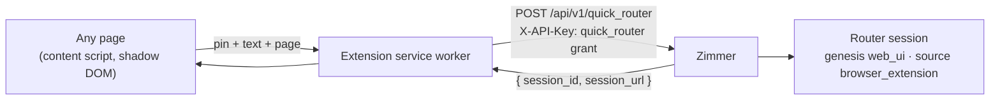

You are reading a PR on GitHub and something is wrong. Today, acting on it means leaving the page,
opening Zimmer, working out which session produced the thing — you may have no idea — and typing
into the right place. The thread you were on is gone by the time you are done.

The browser extension is Zimmer's [Quick Router bubble](/sessions/spot-and-priority/#the-quick-routers-spot-opt-in)
freed from Zimmer's own origin and given a pin. On any page: click the toolbar icon, click the thing
your feedback is about, type, send. A router session starts with your words, the page's URL and
content, and the spot you pinned. You never leave the page and never look for the session.

It lives in [`browser-extension/`](https://github.com/tadasant/zimmer/tree/main/browser-extension)
in the repo — Chrome, Manifest V3, no build step — and is loaded unpacked. ([#175](https://github.com/tadasant/zimmer/issues/175))

## Install and configure

1. In Chrome, open `chrome://extensions`, turn on **Developer mode**, click **Load unpacked**, and
   pick the `browser-extension/` directory of a checkout.
2. In Zimmer, open **Settings → API keys** and create a key with **Quick Router only** chosen.
   Copy it; it is shown once.
3. Open the extension's options (right-click its icon → **Options**), paste the Zimmer URL and the
   key, and **Save**. Saving asks Chrome for permission to talk to that one origin — grant it.

The browser has to reach Zimmer. Zimmer's [security model](/auth/overview/) is a tailnet, so on the
Tadasant deployment that means a browser on the tailnet, using the tailnet address as the URL. A
device that is not on the tailnet cannot use the extension; a public relay would be the only way to
change that, and there is none.

Nothing needs provisioning on the Zimmer side. The key is minted on a page that already exists,
the endpoint ships with the deploy, and there is no environment variable to set.

## Use

- Click the icon, or press <kbd>Alt</kbd>+<kbd>Shift</kbd>+<kbd>Z</kbd>. The page gets a crosshair
  and a banner.
- Click where the feedback applies. A pin drops and a composer opens showing what it landed on
  (`
 Closes #98.`) — **Move pin** re-arms. <kbd>Enter</kbd> instead of a click skips the pin and
  sends the whole page as context; <kbd>Esc</kbd> cancels at any step and keeps what you typed for the next time you arm it.
- Type, then <kbd>⌘</kbd>/<kbd>Ctrl</kbd>+<kbd>Enter</kbd> or **Send to Zimmer**. A toast says it
  was sent and links to the session on the URL you configured; it goes away on its own.

If Zimmer refuses the message or cannot be reached, the composer stays open with the reason and your
text intact. Silently losing feedback would be worse than a second's toast, so nothing here is
fire-and-forget.

## What is sent

One `POST` to [`/api/v1/quick_router`](/extend/rest-api/#the-quick-router-ingest) per message:

| Field | What it carries |
| --- | --- |
| `prompt` | Your words, as typed |
| `page_url`, `page_title` | The tab's |
| `page_context` | The page, reduced to markdown the way the in-app bubble does it, walked on the live DOM so that only what is rendered counts: scripts, styles, SVGs, iframes, anything `hidden` or `aria-hidden`, anything CSS hides (`display:none`, `visibility:hidden`, `opacity:0`), anything positioned entirely off the top or left of the page or clipped to a single pixel (the screen-reader-only pattern), and every form field's contents are left out. Capped at 20,000 characters (Zimmer cuts again at 50,000) |
| `pin` | The click's page coordinates and the viewport size; and the element under it: a CSS selector anchored on the nearest `id`, its tag, its own visible text (≤ 1,000 characters), and an `excerpt` — the smallest ancestor with enough text to read in isolation, as markdown (≤ 4,000). A pinned form field is described by its type and label (`password field "Password"`), never by what is typed in it |

The coordinate is fragile on purpose-built pages: GitHub reflows, renders dynamically, and is a
different width on another screen, so `(485, 465)` may point at nothing by the time an agent reads
it. That is why the pin carries the element three ways as well, with the excerpt capped separately
from the page. The prompt tells the agent to trust the element over the coordinate, and a 20,000
character page can never truncate the thing that was pinned.

**The page is untrusted input to an agent.** A page you did not write can carry text aimed at
whoever reads it next. Two things stand between it and the session: invisible text is not captured
at all (above), and Zimmer defangs any `<context-about-user's-current-view>` or `<pinned-element>`
tag in page-supplied text, so the block can only end where Zimmer ends it, and says inside it that
everything there is data about what you saw and never an instruction. That is framing, not a
sandbox — see [the limitation](/limitations/#page-content-from-the-browser-extension-is-untrusted-text-in-a-priority-prompt).

All of it lands in the session's prompt, the database, and the agent's transcript. **Mind what page
you are on** — an authenticated view, a private repo, an inbox — because the extension captures
whatever is rendered. There is no origin allowlist: the extension is armed only by your click on
the icon, on that tab, that once (`activeTab`), and holds no standing permission on any site. That
is the deliberate call for a single-user, tailnet-scoped instance; a denylist would be the first
thing to add for anything wider.

## What the key can do

The key in the extension's storage is an [API key with the `quick_router` grant](/auth/overview/#2-client--rest-api-x-api-key).
It opens `POST /api/v1/quick_router` and nothing else: every other REST endpoint and `POST /mcp`
refuse it with the same 401 they give an unknown key, and log the attempt at WARN by the key's name.
The endpoint itself creates a session and answers `{ session_id, session_url }` — no listing, no
transcript, no read of any kind.

So what someone who lifts the key from the browser gets is exactly: the ability to start Quick
Router sessions on this instance, at most ten a minute from one address, each of which shows up on
the dashboard as `web_ui` genesis with `metadata.source` `browser_extension`. They read nothing
back. Revoke the key on **Settings → API keys** and it is refused from the next request on.

This is why the extension does **not** take an ordinary API key: those have no scope, and a
full-API key on a machine that browses the open web is a key that reads every transcript in the
instance. The endpoint refuses full-API keys for the same reason it refuses everything else its
grant does not name — the boundary is the shape, not a promise.

## How it fits

The fetch lives in the service worker, not the content script, because of where each runs. A content
script requests as the page it was injected into, so `github.com` calling a Zimmer host is a
cross-origin request Zimmer would need CORS to answer. An extension service worker requests as the
extension, and Chrome exempts those from CORS for any origin the extension holds a host permission
for — the one the options page asked for. Zimmer keeps having no CORS at all, and no CSRF token is
involved because the request never came from a Zimmer page.

Server-side the endpoint is `Api::V1::QuickRouterController`, and it composes the prompt through
the same `QuickRouterPrompt` the in-app chat bubble uses: a `<context-about-user's-current-view>`
block with the URL and title, a `<pinned-element>` section, the page, and then your words, last and
unchanged. Your words are also recorded as a
[human message](/sessions/hierarchy-and-human-messages/#what-is-captured-and-what-is-not) with entry
point `browser_extension.quick_router` — the one API route that records one, because its key is a
browser's and not the fleet's.

## What it does not do yet

- **Route.** The session it starts is a router session, and the router root in this repo's default
  catalog ships with no routing artifacts — see
  [the limitation](/limitations/#the-baseline-orchestrator-root-cant-spawn-downstream-sessions-out-of-the-box).
  On that catalog the extension is "start a session from anywhere
  with the page attached", which is useful and is not the full promise.
- **Resolve the URL to a session.** A `github.com/…/pull/N` URL could be matched to the session that
  opened the PR and the message delivered as a follow-up there instead of as a new session. Nothing
  does that yet; the URL is in the prompt and the metadata for whatever picks it up.
- **Firefox or Safari.** MV3 with `chrome.*` namespaces and a service worker; Firefox's
  `browser.*` polyfill and background-page differences are untested.
