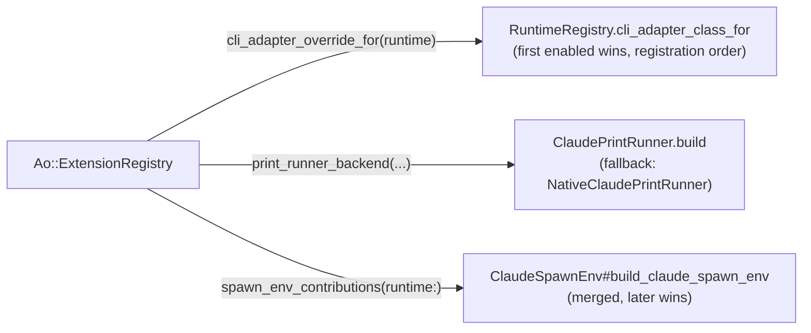

An **extension** is a self-contained, individually-deletable bundle of optional behavior that alters
how *Zimmer itself* drives a runtime. Core code never names a concrete extension.

:::note[Not to be confused with AIR plugins]
The word "plugin" is reserved for [AIR session plugins](/air/artifacts/#plugins) — bundles of skills
and MCP servers injected into the agent's clone. An **extension** is a Ruby object that changes
Zimmer's own behavior. Different layer entirely.
:::

## The contract

`Ao::Extension` (`app/services/ao/extension.rb`), `API_VERSION = 1`.

**Identity:**

```ruby
id                 # required — raises NotImplementedError. This is the enablement key.
title              # default: id.humanize
description        # default: ""
experimental?      # default: true
default_enabled?   # default: false
enabled?           # provided — reads AppSetting.extension_enabled?(id, default: default_enabled?)
```

**Hooks** (all inert by default — override only what you need):

```ruby
cli_adapter_override(runtime)        # → an adapter class, or nil
provides_print_runner?               # → Boolean
print_runner_backend(claude_binary:, model:, process_manager:, logger:)
                                     # → an object responding to #run(prompt:, timeout:)
spawn_env_contribution(context = {}) # → Hash. context is { runtime: "claude_code" }
```

## The three mount points

Exactly three places in core consult the registry:



:::caution[Only one of those three is runtime-generic]
`spawn_env_contribution` receives a `runtime` context, which implies it applies to any runtime. It
doesn't: `CodexRuntimeAdapter#spawn_process` never calls the registry. Extension env contributions
are unreachable for Codex sessions.

The other two mount points are Claude-specific by name (`ClaudePrintRunner`, `ClaudeSpawnEnv`).
:::

## What ships: exactly one

`McpToolSearchExtension` (`app/extensions/mcp_tool_search/`), id `mcp_tool_search`, experimental, off
by default.

Its only hook is `spawn_env_contribution`, returning `{"ENABLE_TOOL_SEARCH" => "true"}` — but only
when `context[:runtime] == "claude_code"`. That flips Zimmer's baseline `ENABLE_TOOL_SEARCH=false`, so
Claude Code searches MCP tools on demand rather than loading every tool schema into context up front.

:::danger[The old docs described a second extension that does not exist]
`docs/AO_EXTENSIONS.md` described "the two built-in extensions" and documented `pty_transport` /
`PtyTransportExtension` (bundling `PtyClaudeCliAdapter`, `PtyClaudePrintRunner`,
`PtyClaudeRetryStrategy`) as shipping.

No such directory or class exists in this repo. `BUILTIN_EXTENSION_CLASSES` contains only
`McpToolSearchExtension`. `pty_transport` survives only in code comments and in the (now deleted) docs.
The old doc's "Verifying removability" section told you to rename `app/extensions/pty_transport/` — a
directory that isn't there.
:::

## Enable, install, remove

**Enable** — Settings → Experimental, which writes to `AppSetting#extension_states` (a JSONB map of
`id → bool`). No migration per extension. Or from a console:

```ruby
AppSetting.first_or_create!.set_extension_enabled("mcp_tool_search", true)
```

**Install** — here's the wrinkle: the core Docker image ships with no extensions at all.
`.dockerignore` excludes `/app/extensions/*/`. Even `mcp_tool_search` is absent from a built image.

```bash
scripts/install-extension.sh <id> --container <name>   # docker cp + restart
scripts/install-extension.sh <id> --path <checkout>    # for the next build
scripts/install-extension.sh --list                    # enumerate app/extensions/*
```

**Remove** — `rm -rf app/extensions/<id>/`. `ExtensionRegistry` resolves builtins with
`safe_constantize` and skips anything that returns `nil`, so every seam falls back to native behavior.
Leaving the dead name in `BUILTIN_EXTENSION_CLASSES` is harmless. *That* is the removability
mechanism, and it's a good one.

## Writing one

```ruby
# app/extensions/my_thing/my_thing_extension.rb
class MyThingExtension < Ao::Extension
  def id = "my_thing"
  def title = "My Thing"
  def description = "Does the thing."
  def default_enabled? = false

  def spawn_env_contribution(context = {})
    return {} unless context[:runtime] == "claude_code"
    { "MY_FLAG" => "1" }
  end
end
```

Then add `"MyThingExtension"` to `Ao::ExtensionRegistry::BUILTIN_EXTENSION_CLASSES`.

:::note[The autoloader collapses the directory]
`config/application.rb` does
`Rails.autoloaders.main.collapse(Rails.root.join("app/extensions/*"))`.

So `app/extensions/my_thing/my_widget.rb` must define `MyWidget`, not `MyThing::MyWidget`.
:::

Register it in `config/initializers/ao_extensions.rb`? No — that file only calls `reset!` and
`register_builtins!` inside a `to_prepare` block (so it survives dev reloads). Adding the class name
to `BUILTIN_EXTENSION_CLASSES` is the whole registration.

Tests go in `test/extensions/<id>/`. The generic registry test lives at
`test/services/ao/extension_registry_test.rb`.
