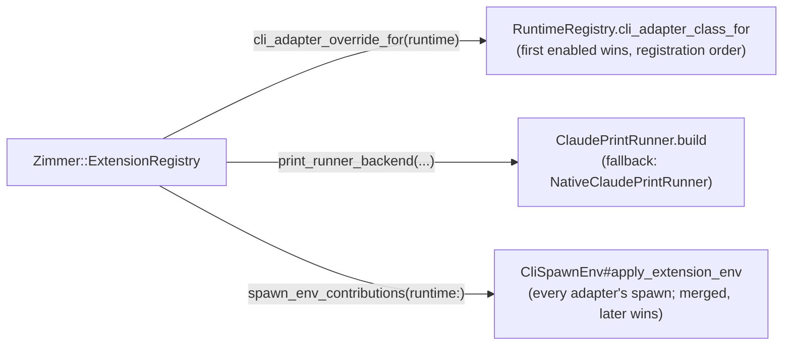

An **extension** is a self-contained, individually-deletable bundle of optional behavior that alters
how *Zimmer itself* drives a runtime. Core code never names a concrete extension.

:::note[Not to be confused with AIR plugins]
The word "plugin" is reserved for [AIR session plugins](/air/artifacts/#plugins) — bundles of skills
and MCP servers injected into the agent's clone. An **extension** is a Ruby object that changes
Zimmer's own behavior. Different layer entirely.
:::

## The contract

`Zimmer::Extension` (`app/services/zimmer/extension.rb`), `API_VERSION = 1`.

**Identity:**

```ruby
id                 # required — raises NotImplementedError. This is the enablement key.
title              # default: id.humanize
description        # default: ""
experimental?      # default: true
default_enabled?   # default: false
enabled?           # provided — reads AppSetting.extension_enabled?(id, default: default_enabled?)
```

**Hooks** (all inert by default — override only what you need):

```ruby
cli_adapter_override(runtime)        # → an adapter class, or nil
provides_print_runner?               # → Boolean
print_runner_backend(claude_binary:, model:, process_manager:, logger:)
                                     # → an object responding to #run(prompt:, timeout:)
spawn_env_contribution(context = {}) # → Hash. context is { runtime: "claude_code" | "codex" | "pi" }
```

## The three mount points

Exactly three places in core consult the registry:


```mermaid
flowchart LR
    E["Zimmer::ExtensionRegistry"]
    E -->|"cli_adapter_override_for(runtime)"| R["RuntimeRegistry.cli_adapter_class_for<br/>(first enabled wins, registration order)"]
    E -->|"print_runner_backend(...)"| P["ClaudePrintRunner.build<br/>(fallback: NativeClaudePrintRunner)"]
    E -->|"spawn_env_contributions(runtime:)"| S["CliSpawnEnv#apply_extension_env<br/>(every adapter's spawn; merged, later wins)"]
```

:::note[Which mount points are runtime-generic]
`spawn_env_contribution` is: every adapter — Claude, Codex and [Pi](/sessions/runtimes/) — calls
`CliSpawnEnv#apply_extension_env` after building its own baseline env and before the scratch-dir,
test-parallelism, operator-SSH-key and elicitation steps, passing its runtime id as
`context[:runtime]`. An extension that means only one runtime checks that key.

The other two mount points are Claude-specific by name (`ClaudePrintRunner`, and the adapter
override is keyed by runtime).
:::

## What ships: the seam, and one name that resolves to nothing

`BUILTIN_EXTENSION_CLASSES` names exactly one class — `PtyTransportExtension` — and **that class's
code is not in this repository, deliberately.** The seam is live: the registry, the base class, the
three mount points, and the Settings → Experimental rendering all work. But in this build the name
resolves to nothing, `register_builtins!` skips it, Settings → Experimental shows no extension, and
every seam falls back to native.

That is the removability mechanism working, not a gap in it. Registration is a class *name*;
whether a name resolves is a property of the tree the app was built from.

`pty_transport` fulfils one-off headless inference — session titles, notification summaries,
category inference — by driving the interactive Claude TUI inside a pseudo-terminal and scraping the
transcript, instead of shelling out to `claude -p`. What that buys is the `usage` slot on
`ClaudePrintRunner::Result`, which print mode can never fill. It depends on internal-only techniques
we do not publish, which `Zimmer::Extension`'s own docstring says in as many words, so its code lives
outside this repository and reaches the deployment that has it as a
[bind mount](#enable-install-remove) rather than as a merged directory.

So a standalone install of Zimmer gets the native path for headless inference and nothing is missing
from it — `NativeClaudePrintRunner` is the historically-proven backend and always has been. The only
thing it does not get is token usage on those calls.

The extension that used to ship was `McpToolSearchExtension` (id `mcp_tool_search`), whose only hook
returned `{"ENABLE_TOOL_SEARCH" => "true"}` for Claude Code. It is gone, because at the time it could
never do its job: `.dockerignore` then excluded `/app/extensions/*/`, so the class did not exist in
any built image, the registry skipped it, and the `ENABLE_TOOL_SEARCH=false` baseline always stood in
production. MCP tool search is now a first-class `AppSetting` column, on by default — see
[Spawning a session](/sessions/spawning/#mcp-tool-search). The `mcp_tool_search` key
is dropped from `extension_states` by the same migration, so there is only ever one control.

That exclusion is gone ([#91](https://github.com/tadasant/zimmer/issues/91)). An extension
directory added to `app/extensions/` now reaches every built image, and the build fails if it does
not — see [Extensions do ship in the image](/operate/deploying/#extensions-do-ship-in-the-image).
So the choice between an extension and an `AppSetting` column is back to being about what the thing
*is*: an extension changes how Zimmer drives a runtime, a column is a value the app reads.

:::caution[Don't write `PtyClaudePrintRunner` into this repository]
The name is registered here and the code is withheld on purpose. Filling the gap in — adding
`app/extensions/pty_transport/`, a PTY driver, or tests of one — publishes the technique the
arrangement exists to keep private, and it turns `BUILTIN_EXTENSION_CLASSES`' claim about this build
false. `test/services/zimmer/extension_registry_test.rb` asserts that every built-in name is
*unresolvable* here, so the first commit that lands such a directory fails CI and says why.

The older docs got this backwards in the other direction: `docs/AO_EXTENSIONS.md` (now deleted)
described `pty_transport` as *shipping*, bundling `PtyClaudeCliAdapter`, `PtyClaudePrintRunner` and
`PtyClaudeRetryStrategy`, and its "Verifying removability" section told you to rename a directory
that was never in this repo.
:::

## Enable, install, remove

**Enable** — Settings → Experimental, which writes to `AppSetting#extension_states` (a JSONB map of
`id → bool`). No migration per extension. Or from a console:

```ruby
AppSetting.first_or_create!.tap { |s| s.set_extension_enabled("my_thing", true) }.save!
```

In a build where no registered name resolves — this one — that section of the page renders only the
first-class experimental settings.

**Install** — for an extension whose code is *in the repository*, there is nothing to install.
`Dockerfile` blanket-copies the repository into `/rails` and nothing in `.dockerignore` takes
`app/extensions/` back out, so an extension merged to `main` is in the next image and in every
container that image starts. The only operating step is the toggle above.

An extension can also arrive from **outside** the image, which is how a deployment carries a private
one. Production mounts it read-only over the directory Zeitwerk would have loaded it from:

```yaml
# config/deploy.production.yml
volumes:
  - /opt/zimmer/extensions/pty_transport:/rails/app/extensions/pty_transport:ro
```

Three things about that line are load-bearing. It mounts **the extension's own subdirectory**, never
`/rails/app/extensions` — mounting the parent would shadow `app/extensions/CLAUDE.md` and the
`image_canary/` directory that
[the build guardrail](/operate/deploying/#extensions-do-ship-in-the-image) looks for. It is
**read-only and on a persistent host path**, so it survives `kamal deploy`, unlike the writable
container layer the deleted `install-extension.sh` wrote into. And a **missing or empty host
directory is inert** — Docker creates the path, Zeitwerk finds no files, `safe_constantize` returns
`nil`, and the registry skips the name — so the mount is safe to carry before anything populates it.
Production eager-loads, so the files have to be present at container boot; populating the host
directory is therefore picked up by a health-gated Kamal cutover, not by restarting a container.

There used to be a `scripts/install-extension.sh`, which `docker cp`'d a directory into a running
container and restarted it. It is deleted. It needed a shell on the production host — which
[the invariants](/operate/deploying/#ops-actions-ship-with-the-deploy) say is a defect to design out,
not a procedure to document — and whatever it installed was gone at the next deploy.

**Remove** — `rm -rf app/extensions/<id>/`. `ExtensionRegistry` resolves builtins with
`safe_constantize` and skips anything that returns `nil`, so every seam falls back to native behavior.
Leaving the dead name in `BUILTIN_EXTENSION_CLASSES` is harmless. *That* is the removability
mechanism, and it's a good one — `PtyTransportExtension` is the standing proof, since the name has
never resolved in this repository and the app has never noticed.

:::note[Removability is a property of the source tree, not of the image]
The two got conflated once, and it cost the seam its only extension. Deleting the directory from the
repository is what drops a feature; the `safe_constantize` skip is what makes that safe with no core
edit. Stripping the directory at *image-build* time is a different thing wearing the same clothes —
it does not demonstrate removability, it just guarantees that the one build meant to carry an
internal-only feature never does.
:::

:::caution[`app/extensions/image_canary/` is not an extension]
It holds no Ruby and registers nothing. `scripts/assert-extensions-shipped.sh` looks for the marker
file inside it to prove a *subdirectory* of `app/extensions/` survived into the image — the old rule
excluded subdirectories while leaving `app/extensions/CLAUDE.md` in place, so a marker at the top of
the tree would have passed throughout the outage. Don't delete it, and don't put a `.rb` file in it.
:::

## Writing one

```ruby
# app/extensions/my_thing/my_thing_extension.rb
class MyThingExtension < Zimmer::Extension
  def id = "my_thing"
  def title = "My Thing"
  def description = "Does the thing."
  def default_enabled? = false

  def spawn_env_contribution(context = {})
    return {} unless context[:runtime] == "claude_code"
    { "MY_FLAG" => "1" }
  end
end
```

Then add `"MyThingExtension"` to `Zimmer::ExtensionRegistry::BUILTIN_EXTENSION_CLASSES`.

:::note[The autoloader collapses the directory]
`config/application.rb` does
`Rails.autoloaders.main.collapse(Rails.root.join("app/extensions/*"))`.

So `app/extensions/my_thing/my_widget.rb` must define `MyWidget`, not `MyThing::MyWidget`.
:::

Register it in `config/initializers/zimmer_extensions.rb`? No — that file only calls `reset!` and
`register_builtins!` inside a `to_prepare` block (so it survives dev reloads). Adding the class name
to `BUILTIN_EXTENSION_CLASSES` is the whole registration.

Tests go in `test/extensions/<id>/`. The generic registry test lives at
`test/services/zimmer/extension_registry_test.rb`.
