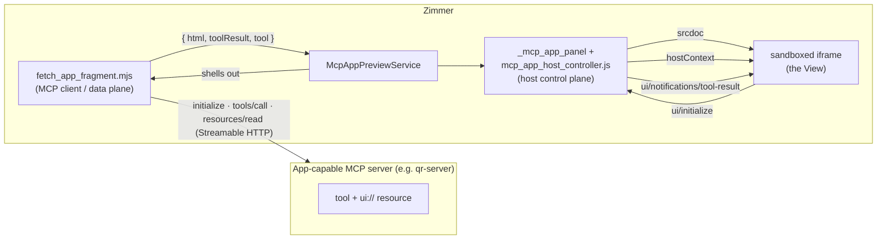

:::caution[This is a spike, not a shipped feature]
Everything here lives behind `ENV["ZIMMER_MCP_APPS_POC"]` and under
`script/poc/mcp_apps/`. It answers a feasibility question with a working demo; it
is not a supported part of Zimmer. See [Known limitations](/limitations/).
:::

## The question

[MCP Apps](https://github.com/modelcontextprotocol/ext-apps) (SEP-1865, extension
id `io.modelcontextprotocol/ui`) let an MCP **server** ship an interactive HTML UI
fragment addressed by a `ui://` URI. A tool declares the fragment via
`_meta.ui.resourceUri`; when the tool runs, the **host** reads that resource and
renders it in a sandboxed iframe, brokering a JSON-RPC-over-`postMessage`
conversation between the fragment (which acts as an MCP *client*) and itself.

Zimmer runs Claude Code / Codex **headlessly**. Those agents are the MCP hosts
that would normally render a fragment — but headless, there is no screen, so the
fragment goes nowhere. Can Zimmer's own web UI become the surface instead?

## The answer: Zimmer as its own MCP host

Rendering an MCP App has nothing to do with the agent. A fragment is just HTML
plus a documented `postMessage` protocol, and the protocol is host-agnostic. So
Zimmer's web app can act as a **second, independent MCP host** that connects to
the same app-capable server, calls the tool, and renders the fragment itself.

The **data plane** (`script/poc/mcp_apps/fetch_app_fragment.mjs`) is a
dependency-free Node MCP client: `initialize` → `tools/list` (find the
`ui://` resource) → `tools/call` → `resources/read`. It prints
`{ serverInfo, tool, input, toolResult, ui: { html, csp } }`.

The **control plane** (`app/javascript/controllers/mcp_app_host_controller.js`)
runs in the browser. It renders the fragment via `srcdoc` in a
`sandbox="allow-scripts"` iframe and speaks the host side of the MCP-Apps
handshake, using the exact method names from the spec:

1. View → `ui/initialize` &nbsp;·&nbsp; Host → `McpUiInitializeResult` (with `hostContext.toolInfo.tool`, theme, `containerDimensions`)
2. View → `ui/notifications/initialized`
3. Host → `ui/notifications/tool-input` then `ui/notifications/tool-result` (the `CallToolResult`)
4. View renders itself and reports `ui/notifications/size-changed`

## Running it

See `script/poc/mcp_apps/README.md`. In short: run the ext-apps `qr-server` on
`:3001`, then `ZIMMER_MCP_APPS_POC=1 bin/dev`, and open any session. The QR
fragment (encoding the session's own URL) renders above the transcript.

## Interactivity

MCP Apps fragments aren't static — the View can talk back. Both directions work
with Zimmer as host (`script/poc/mcp_apps/interactive_server.py` exercises them):

**View → Server** (`tools/call`, `resources/read`). A widget button calls a tool
on the MCP server. Per the spec, the host forwards any non-`ui/`-prefixed message
to the server, so the browser broker proxies it over Streamable HTTP (the demo
servers send permissive CORS) and hands the result back. The model/agent is not
involved — a slider recomputing or a "refresh" button round-trips View → Zimmer →
MCP server → View.

**View → Agent** (`ui/message`, `ui/update-model-context`). This is the "clicking
sends a prompt" path. The View hands text back to the conversation; since Zimmer's
agent is headless Claude Code, the broker stages it as a **follow-up prompt** on
the session (it drops the text into the follow-up textarea). In production this
would enqueue a real agent turn via the same path as a typed follow-up.

The broker declares the matching host capabilities (`serverTools`,
`serverResources`, `updateModelContext`, `openLinks`, `logging`) in its
`ui/initialize` response so the View enables those affordances.

## What it deliberately does not do

- **Surface fragments for the agent's own tool calls.** The spike drives the tool
  call itself. Wiring it to the transcript — detect an `mcp__<server>__<tool>`
  `ToolCall` whose server advertises a `ui://` resource, then render *that* — is
  the natural next step, and the harder half: headless Claude Code never
  negotiates the `ui` extension, so Zimmer would re-issue the call as host (idempotent
  tools only) or run a proxy MCP shim between the agent and the server to capture
  the fragment as it passes.
- **Use the spec's separate-origin sandbox proxy.** It renders into a single
  same-document sandboxed iframe. Production would add a second-origin proxy with
  header-based CSP.
- **Fetch asynchronously.** The preview is fetched synchronously in
  `SessionsController#show`; acceptable behind a flag, wrong for production.
