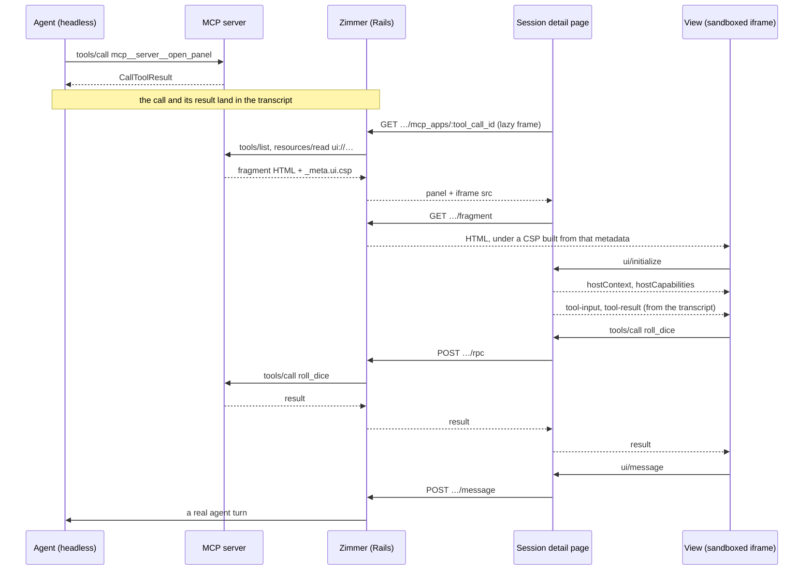

An [MCP App](https://github.com/modelcontextprotocol/ext-apps) is a tool that ships a **view**: a
`ui://` HTML resource the MCP server serves alongside the tool, which the *host* renders and drives
over a `postMessage` protocol. The spec is [SEP-1865 /
`io.modelcontextprotocol/ui`](https://github.com/modelcontextprotocol/ext-apps/blob/main/specification/2026-01-26/apps.mdx).

Zimmer's coding agents run headlessly. The agent that calls a `ui://`-bearing tool is a Claude Code
or Codex process with no screen, so the view it was handed goes nowhere. **Zimmer's web app renders
it instead**, by being a second, independent MCP host: it connects to the same MCP server the agent
was talking to, reads the fragment, renders it in a sandboxed iframe inline in the transcript, and
brokers the protocol between that fragment, the MCP server and the agent.

It is **off by default**, and each MCP server has to be named before anything of its renders. See
[The trust boundary](#the-trust-boundary) for why.

## What you see

When the agent calls an MCP tool whose server declares a view for it, a panel appears in the session's
**Transcript** panel directly under that tool call, showing the view — fed by the result that call
already returned.

It is there at every log level, including `Minimal`. A tool call that renders a view is not tool
noise: the view *is* the result, and it is the one tool row a reader can act on, so it sits in the
same filter bucket as a message. Every other tool row still needs `Condensed` or above.

## The transcript is the trigger

Nothing here calls a tool. The panel appears because **the agent** called one:
`McpApps::TimelineTrigger` looks at each rendered `ToolCall`, splits its
`mcp__<server>__<tool>` name (`McpApps::ToolName`), and asks whether that server's tool index says
the tool declares `_meta.ui.resourceUri`.

`McpApps::TranscriptToolCall` then re-reads the call out of the transcript at render time, along with
the `ToolResult` that followed it, and that result is what the view is fed. The only request Zimmer
makes on the way to a first render is the read-only `resources/read` for the fragment.

Two consequences worth stating plainly:

- **Clicking around a session can never re-run somebody's tool.** There is no code path from the
  page to `tools/call` for the tool the panel belongs to.
- **A panel on a session whose result has not landed yet says so** rather than handing the view an
  empty result it would render as a successful call that returned nothing.

The transcript lookup is bounded: the URL carries the call's `transcript_index`, only a window of
entries from there is parsed, and the index is verified rather than trusted — a call that is not
where the URL says it is resolves to a 404.

## Nothing happens on the page-load path

The tool index (`tools/list`) and the fragment (`resources/read`) are both cached, and the timeline
render reads the index **from cache only**. A session detail page never waits on a third-party
server:

| Where | What it may do |
| --- | --- |
| Timeline render | Cache reads. No network, ever. |
| `GET …/mcp_apps/:tool_call_id` (lazy Turbo Frame) | `tools/list`, `resources/read`, both cached |
| `GET …/fragment` | Serves the cached fragment |

An index that has not been read yet is *unknown*, not *no*: the row renders its lazy frame anyway,
and that frame's request is what warms the index for every other row on the page.

## Security model

### The sandbox

The fragment is HTML written by whoever operates the MCP server. It is served from **its own
endpoint** — `GET /sessions/:id/mcp_apps/:tool_call_id/fragment` — and framed with
`sandbox="allow-scripts"`. No `allow-same-origin`: the document lands in an **opaque origin**, so it
cannot read Zimmer's cookies, storage or DOM, and `postMessage` is the only channel it has.

The same sandboxing is repeated *in the response header*, as the CSP `sandbox` directive. That is the
part that matters, and it is why the fragment is not rendered with `srcdoc` the way the spike
rendered it:

- A `srcdoc` document inherits the embedding page's CSP and cannot be given one of its own, so there
  is nowhere to put a per-fragment policy.
- The iframe `sandbox` attribute is applied by the *embedder*, so it protects the framed case only. A
  URL that serves third-party HTML would be a same-origin script execution primitive the moment
  anyone opened it directly. The CSP `sandbox` directive is applied by the document itself, however
  it was loaded.

**How this differs from the spec.** SEP-1865 describes a double-iframe sandbox proxy: a host page, a
*Sandbox* on a different origin holding `allow-scripts allow-same-origin`, and the View inside it.
Zimmer collapses that to one iframe whose document is opaque-origin by its own header. The isolation
goal is the same and the result is strictly tighter — the view never holds `allow-same-origin` at all
— and it needs no second hostname, no second certificate and no cross-origin forwarding layer that
would itself have to be trusted. The cost is that the reserved
`ui/notifications/sandbox-proxy-ready` / `sandbox-resource-ready` messages are not implemented,
because there is no proxy to send them.

### The CSP

`McpApps::ContentSecurityPolicy` builds the header from the resource's own
`_meta.ui.csp`, mapping each list to the directives the spec assigns it:

| Declared | Widens |
| --- | --- |
| `resourceDomains` | `script-src`, `style-src`, `img-src`, `font-src`, `media-src` |
| `connectDomains` | `connect-src` |
| `frameDomains` | `frame-src`, `child-src` |
| `baseUriDomains` | `base-uri` |

Everything else is closed: `default-src 'none'`, `object-src 'none'`, `form-action 'none'`,
`frame-ancestors 'self'`, and `'none'` for every directive above that nothing was declared for. A
resource with no `csp` metadata gets inline script and style (a view with no inline script is not a
view) plus `data:` images, and **no network of any kind** — which is at least as restrictive as the
spec's stated default.

`'unsafe-eval'` is never granted. `'self'` never appears: in a sandboxed document it is ambiguous
across browsers, and the ambiguous reading is Zimmer's own origin. Each declared entry has to be a
plain `scheme://host[:port]` — an entry with a path, a `javascript:` scheme, or anything that could
terminate the directive is dropped rather than emitted, and the number of entries per directive is
capped.

### The trust boundary

Rendering a fragment means executing somebody else's JavaScript in a browser tab that is logged into
Zimmer. The sandbox is what *contains* that code; the allowlist is what decides whose code gets
containment applied to it in the first place.

Two switches on **Settings → MCP Apps**, both closed on a fresh deployment, and both have to be open:

1. **Render MCP App views** — the deployment-wide master switch.
2. **Servers allowed to render views** — the specific MCP servers it renders them for.

The second is the load-bearing one. A blanket "on" would mean that attaching an MCP server to a
session so the *agent* can use it also hands that server's operator a script-execution primitive in
the browser of whoever reads the session. So a server nobody has named renders nothing, and a
settings row that cannot be read at all resolves to off (`AppSetting::NULL`) rather than on.

Only **remote** (`streamable-http` / `sse`) servers can be opted in. A stdio server would have to be
spawned by the web process to be read from, which is a process-spawning primitive in the request
path; the trigger simply never fires for one.

### What a view can reach

The view's `tools/call` and `resources/read` are **proxied server-side** (`McpApps::Proxy`), over the
session's own MCP configuration and credentials. The browser never holds a token and never talks to
the MCP server, so a server does not need to send permissive CORS for any of this to work.

Two rules narrow it:

- **Two methods are forwarded**, `tools/call` and `resources/read`. Not `tools/list`, not `prompts/*`,
  not `completion/*`, and nothing that can subscribe or elicit.
- **Only app-callable tools.** A tool is reachable only if the server marked it
  `visibility: ["app"]` — the spec's own way of saying "this one is for the view". A server that
  marks nothing exposes nothing. Without this a fragment could invoke any tool the agent has, with
  the operator's credentials.

The connection is pinned to the one server the fragment came from, resolved from the transcript. No
request parameter names a server, a tool or a resource that is not checked against it.

## Interactivity

| The view sends | Zimmer does |
| --- | --- |
| `ui/initialize` | Answers with `hostCapabilities` and a `hostContext` carrying the tool, the theme, Zimmer's palette as `styles.variables`, and `availableDisplayModes: ["inline", "fullscreen"]` |
| `ui/notifications/initialized` | Sends `ui/notifications/tool-input` and `ui/notifications/tool-result`, both out of the transcript |
| `tools/call`, `resources/read` | Proxies through Rails (above) |
| `ui/message` | Becomes a **real agent turn** — delivered immediately to a waiting session, queued behind the current one if a turn is underway |
| `ui/update-model-context` | Always queued, so it reaches the agent as context on the next turn and never spends one |
| `ui/open-link` | Opens an `http(s)` URL with `noopener,noreferrer` |
| `ui/request-display-mode` | Switches between `inline` and `fullscreen`, if the view declared support for it |
| `ui/notifications/size-changed` | Resizes the iframe, up to a cap that keeps one panel from burying the transcript |

Every message from a view is attributed when it reaches the agent — `[MCP App message from
<server>/<tool>]` — so an agent reading its own transcript can tell a widget's message from a
human's. That matters the moment the widget was written by somebody else.

A widget message is capped at 4,000 characters, far below `Session::PROMPT_MAX_LENGTH`: it is the one
prompt channel whose content is composed by third-party code.

## Turning it on

1. **Settings → MCP Apps** → tick **Render MCP App views**.
2. Tick each remote MCP server whose views you trust.
3. Save. Sessions that use those servers show panels from the next page load; nothing needs
   respawning, because the trigger reads transcripts that already exist.

The same two fields are visible on `/supervisor` under `AppSetting`.

## Where the code is

| Piece | File |
| --- | --- |
| The namespace, and `_meta.ui` reading | `app/services/mcp_apps.rb` |
| The two switches | `app/services/mcp_apps/policy.rb` |
| Which rows get a panel | `app/services/mcp_apps/timeline_trigger.rb` |
| The call and result, out of the transcript | `app/services/mcp_apps/transcript_tool_call.rb` |
| The MCP client (Streamable HTTP) | `app/services/mcp_apps/client.rb` |
| Server config + credentials for one session | `app/services/mcp_apps/server_connection.rb` |
| `tools/list`, cached | `app/services/mcp_apps/tool_index.rb` |
| `resources/read`, cached | `app/services/mcp_apps/fragment.rb` |
| The CSP | `app/services/mcp_apps/content_security_policy.rb` |
| The View→Server proxy | `app/services/mcp_apps/proxy.rb` |
| The View→Agent route | `app/services/mcp_apps/widget_message.rb` |
| The four endpoints | `app/controllers/mcp_apps_controller.rb` |
| The browser-side broker | `app/javascript/controllers/mcp_app_host_controller.js` |

`scripts/mcp_apps_demo/` holds a small app-capable MCP server for trying this locally end to end; its
README has the whole recipe.
