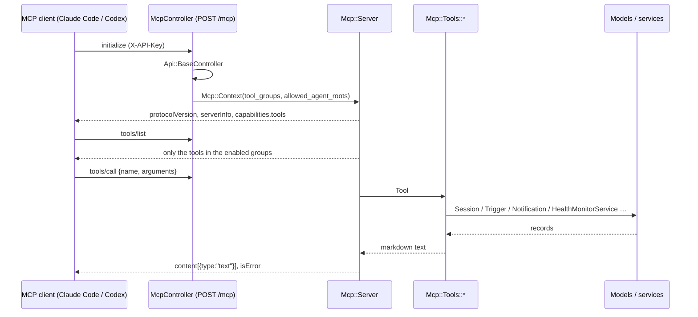

Zimmer speaks [MCP](https://modelcontextprotocol.io) itself. `POST /mcp` is a streamable-HTTP MCP
endpoint served by the Rails app, and it is how an agent session reaches back into the orchestrator
that spawned it: to archive itself, to schedule its own wake-up, to spawn a downstream session, to
tell you it is stuck.

There is no separate process. The tools call Zimmer's models and services in-process — the same ones
[the REST API](/extend/rest-api/) calls — so there is nothing to install, nothing to keep in version
lockstep, and no HTTP hop back into the app.

## Point a client at it

Any MCP client that speaks streamable HTTP works. The whole configuration is a URL and an API key:

```json
{
  "mcpServers": {
    "zimmer": {
      "type": "http",
      "url": "https://your-zimmer.example.com/mcp",
      "headers": { "X-API-Key": "one-of-your-API_KEYS" }
    }
  }
}
```

That is Claude Code's `.mcp.json`. Codex's `config.toml` wants the same two things under different
keys:

```toml
[mcp_servers.zimmer]
url = "https://your-zimmer.example.com/mcp"
http_headers = { "X-API-Key" = "one-of-your-API_KEYS" }
```

Or drive it by hand:

```bash
curl -s https://your-zimmer.example.com/mcp \
  -H "X-API-Key: $ZIMMER_API_KEY" -H 'Content-Type: application/json' \
  -d '{"jsonrpc":"2.0","id":1,"method":"tools/list"}'
```

## Auth is the API's auth

The `X-API-Key` header, compared against `ENV["API_KEYS"]` (comma-separated) with a constant-time
comparison — literally `Api::BaseController`, which `McpController` inherits. A key that works
against `/api/v1/sessions` works against `/mcp`.

MCP clients that only know how to send a bearer token can send the same key as
`Authorization: Bearer <key>` instead. There is one credential either way.

:::caution[The same caveat as the REST API]
A key is an opaque string with no scope, no identity, and no audit trail. Anyone holding one can do
anything the enabled tool groups allow. Scope the connection (below) rather than trusting the key.
:::

## Scoped variants: `tool_groups`

The same endpoint serves several **scoped variants**, selected with a query parameter. This is how a
session gets exactly the surface it should have and no more.

| URL | Tools |
| --- | --- |
| `/mcp` | The full surface — all 18 tools |
| `/mcp?tool_groups=sessions` | Session orchestration: spawn, search, inspect, act on other sessions |
| `/mcp?tool_groups=self_session` | Self-management: the 6 tools a session needs to run itself |
| `/mcp?tool_groups=triggers_readonly,health_readonly` | Any combination; `_readonly` drops the write tools |

The groups are `sessions`, `notifications`, `triggers`, `health` (each with a `_readonly` variant),
plus the composite `self_session`. Omitting `tool_groups` enables all four base groups. An unknown
group is dropped with a warning rather than failing the connection.

`self_session` is the important one. It is **auto-injected into every session** (see below) and
carries `get_session`, `get_configs`, `send_push_notification`, `wake_me_up_later`,
`wake_me_up_when_session_changes_state`, and a **restricted `action_session`** — the same tool name,
but its `action` enum is narrowed to `update_notes`, `update_title`, `set_heartbeat`, and `archive`.
A session can manage itself; it cannot restart or fork its neighbors.

## Restricting what a connection may spawn: `allowed_agent_roots`

```
/mcp?tool_groups=sessions&allowed_agent_roots=zimmer,docs
```

With `allowed_agent_roots` set, the connection is locked to those [agent roots](/air/agent-roots/):

- `start_session` requires an `agent_root`, it must be in the list, and its `mcp_servers` must
  **exactly** match that root's `default_mcp_servers` — no additions, no removals.
- `action_trigger` may only create or update triggers on an allowed root.
- `action_session`'s `change_mcp_servers` is refused outright.
- `wake_me_up_when_session_changes_state` refuses to watch a session outside the allowed roots. (A
  session waking *itself* is never restricted.)
- `get_configs` hides the roots you may not use, so the model never sees them.

## What Zimmer injects into every session

`SelfSessionInjector` + the runtime config post-processors write these entries into a session's
`.mcp.json` / `config.toml` at prepare time. They are not catalog entries — Zimmer synthesizes them,
pointed at the instance that is running the session:

| Entry | When | URL |
| --- | --- | --- |
| `zimmer-self-session` | Every session, unless something already covers the surface | `<instance>/mcp?tool_groups=self_session` |
| `zimmer` | Roots that declare `default_subagent_roots` | `<instance>/mcp?allowed_agent_roots=<those roots>` |

The `zimmer` entry is full-surface, which is why it *does* cover the self-session surface — a parent
root gets one server, not two. A catalog entry you select yourself (`zimmer`, `zimmer-sessions`,
`zimmer-self-session` in `mcp.json`) that is full-surface suppresses the injection the same way.

Outside production, every `zimmer*` entry is **retargeted** at the instance preparing the session:
the origin is rewritten and the API key replaced, while the query string (the scoping) is preserved.
A staging session orchestrates staging, not production — even though the catalog's URLs say
production.

## The tool surface

18 tools, four domains.

| Group | Tools |
| --- | --- |
| `sessions` | `quick_search_sessions`, `get_session`, `get_configs`, `get_transcript_archive`, `start_session`, `action_session`, `manage_enqueued_messages`, `manage_categories`, `respond_to_elicitation` |
| `notifications` | `get_notifications`, `send_push_notification`, `action_notification` |
| `triggers` | `search_triggers`, `action_trigger`, `wake_me_up_later`, `wake_me_up_when_session_changes_state` |
| `health` | `get_system_health`, `action_health` |

The action tools are verb-multiplexers: `action_session` takes an `action` enum (`follow_up`,
`pause`, `restart`, `archive`, `unarchive`, `fork`, `change_model`, …), `action_trigger` takes
`create` / `update` / `delete` / `toggle`, and so on. `tools/list` carries the full schema for each —
ask the server rather than trusting this table.

The two wake-up tools are the ones worth knowing by name. `wake_me_up_later` sleeps the calling
session and creates a one-time trigger that resumes it at a wall-clock time; `wake_me_up_when_session_changes_state`
resumes it when *another* session hits `needs_input`, `failed`, or `archived`. Together they are how
a session waits on CI, on a deploy, or on a session it spawned, without burning a process on `sleep`.

## Protocol

Stateless streamable HTTP. Every POST carries one complete JSON-RPC message (or a batch) and gets one
complete JSON response, so any web worker can serve any request and no `Mcp-Session-Id` is issued.
`GET /mcp` (server-initiated SSE) returns 405 — there is no server-push channel.

Supported protocol revisions: `2025-06-18`, `2025-03-26`, `2024-11-05`. The client's requested version
is echoed back when Zimmer supports it, otherwise Zimmer answers with its newest.

Implemented methods: `initialize`, `tools/list`, `tools/call`, `ping`, and the client notifications
(answered with `202 Accepted`, no body). Zimmer advertises the `tools` capability only — no resources,
no prompts, no sampling.



A tool that raises `Mcp::ToolError` (bad arguments, missing record, forbidden by scoping) comes back
as a **tool result** with `isError: true` and the message as text — the model reads it and can
recover. A protocol-level problem (unknown method, a tool the connection never advertised) comes back
as a JSON-RPC error, which the model never sees.

## Adding a tool

1. Write `app/services/mcp/tools/<name>.rb`, subclass `Mcp::Tool`, declare `tool_name`,
   `description`, `input_schema`, and implement `#call(args)` (string keys). Return a String (sent as
   text) or a Hash/Array (sent as pretty JSON). Raise `Mcp::ToolError` for anything the model should
   see and act on.
2. Call the models and services directly. If the logic already exists behind a service object, call
   it — the MCP layer validates arguments, calls, and formats; it does not own business logic.
3. Register it in `Mcp::Registry::ALL_TOOLS` with its domain group and whether it is a write
   operation. Add `composite_groups: %w[self_session]` if a session should be able to use it on
   itself, and a `composite_overrides` entry if it needs a narrower variant in that group (see
   `action_session`).
4. Test it under `test/services/mcp/tools/`, and let `test/controllers/mcp_controller_test.rb` cover
   the wire shape.
