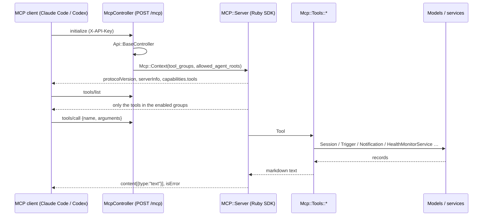

Zimmer speaks [MCP](https://modelcontextprotocol.io) itself. `POST /mcp` is a streamable-HTTP MCP
endpoint served by the Rails app, and it is how an agent session reaches back into the orchestrator
that spawned it: to archive itself, to schedule its own wake-up, to spawn a downstream session, to
tell you it is stuck.

There is no separate process. The tools call Zimmer's models and services in-process — the same ones
[the REST API](/extend/rest-api/) calls — so there is nothing to install, nothing to keep in version
lockstep, and no HTTP hop back into the app.

The protocol itself is the [official MCP Ruby SDK](https://github.com/modelcontextprotocol/ruby-sdk)
(the `mcp` gem): JSON-RPC framing, version negotiation, the streamable-HTTP transport, and argument
validation against each tool's schema. Zimmer supplies the two things the SDK cannot know — who may
call (the API key) and what this connection may see (the scoped tool list).

## Point a client at it

Any MCP client that speaks streamable HTTP works. The whole configuration is a URL and an API key:

```json
{
  "mcpServers": {
    "zimmer": {
      "type": "http",
      "url": "https://your-zimmer.example.com/mcp",
      "headers": { "X-API-Key": "one-of-your-API_KEYS" }
    }
  }
}
```

That is Claude Code's `.mcp.json`. Codex's `config.toml` wants the same two things under different
keys:

```toml
[mcp_servers.zimmer]
url = "https://your-zimmer.example.com/mcp"
http_headers = { "X-API-Key" = "one-of-your-API_KEYS" }
```

Or drive it by hand:

```bash
curl -s https://your-zimmer.example.com/mcp \
  -H "X-API-Key: $ZIMMER_API_KEY" -H 'Content-Type: application/json' \
  -d '{"jsonrpc":"2.0","id":1,"method":"tools/list"}'
```

## Auth is the API's auth

The `X-API-Key` header, compared against `ENV["API_KEYS"]` (comma-separated) with a constant-time
comparison — literally `Api::BaseController`, which `McpController` inherits. A key that works
against `/api/v1/sessions` works against `/mcp`.

MCP clients that only know how to send a bearer token can send the same key as
`Authorization: Bearer <key>` instead. There is one credential either way.

:::caution[Scoping is an affordance, not a trust boundary]
A key is an opaque string with no scope, no identity, and no audit trail — the same caveat as
[the REST API](/extend/rest-api/). The scoping below (`tool_groups`, `allowed_agent_roots`) lives in
the URL, so a caller that holds a key can always widen it by asking for a different URL — or skip MCP
and call `/api/v1` directly. It exists to give an agent the *right* surface, not to contain a
determined one. Anyone you hand a key to can do anything a key can do.
:::

## Scoped variants: `tool_groups`

The same endpoint serves several **scoped variants**, selected with a query parameter. This is how a
session gets exactly the surface it should have and no more.

| URL | Tools |
| --- | --- |
| `/mcp` | The full surface — all 18 tools |
| `/mcp?tool_groups=sessions` | Session orchestration: spawn, search, inspect, act on other sessions |
| `/mcp?tool_groups=self_session` | Self-management: the 6 tools a session needs to run itself |
| `/mcp?tool_groups=triggers_readonly,health_readonly` | Any combination; `_readonly` drops the write tools |

The groups are `sessions`, `notifications`, `triggers`, `health` (each with a `_readonly` variant),
plus the composite `self_session`. Omitting `tool_groups` enables all four base groups. An unknown
group is dropped with a warning rather than failing the connection.

`self_session` is the important one. It is **auto-injected into every session** (see below) and
carries `get_session`, `get_configs`, `send_push_notification`, `wake_me_up_later`,
`wake_me_up_when_session_changes_state`, and a **restricted `action_session`** — the same tool name,
but its `action` enum is narrowed to `update_notes`, `update_title`, `set_heartbeat`, and `archive`.
A session can manage itself; it cannot restart, fork, or re-configure anything. (The *action* is
narrowed, not the *target*: every tool takes a `session_id`, and a session is trusted to pass its own.
See the caution above.)

## Restricting what a connection may spawn: `allowed_agent_roots`

```
/mcp?tool_groups=sessions&allowed_agent_roots=zimmer,docs
```

With `allowed_agent_roots` set, the connection is locked to those [agent roots](/air/agent-roots/):

- `start_session` requires an `agent_root`, it must be in the list, and its `mcp_servers` must
  **exactly** match that root's `default_mcp_servers` — no additions, no removals.
- `action_trigger` may only create, update, delete, or toggle triggers on an allowed root, and
  `search_triggers` only shows those.
- `action_session`'s `change_mcp_servers` is refused outright.
- `wake_me_up_when_session_changes_state` refuses to watch a session outside the allowed roots. (A
  session waking *itself* is never restricted.)
- `get_configs` hides the roots you may not use, so the model never sees them.

## What Zimmer injects into every session

`SelfSessionInjector` + the runtime config post-processors write these entries into a session's
`.mcp.json` / `config.toml` at prepare time. They are not catalog entries — Zimmer synthesizes them,
pointed at the instance that is running the session:

| Entry | When | URL |
| --- | --- | --- |
| `zimmer-self-session` | Every session, unless something already covers the surface | `<instance>/mcp?tool_groups=self_session` |
| `zimmer` | Roots that declare `default_subagent_roots` | `<instance>/mcp?allowed_agent_roots=<those roots>` |

The `zimmer` entry is full-surface, which is why it *does* cover the self-session surface — a parent
root gets one server, not two. A catalog entry you select yourself (`zimmer`, `zimmer-sessions`,
`zimmer-self-session` in `mcp.json`) that is full-surface suppresses the injection the same way.

Both injections are defensive about a name collision. If the catalog already supplies a `zimmer`
entry, the subagent injection leaves it alone rather than overwriting it — the two are the same URL
differentiated only by query param, so writing the root-restricted `allowed_agent_roots` over a
catalog-provided full-surface entry would silently narrow what the session may spawn. The
catalog's entry (retargeted) wins, and `start_session` keeps its full root surface.

Outside production, every `zimmer*` entry is **retargeted** at the instance preparing the session:
the origin is rewritten and the API key replaced, while the query string (the scoping) is preserved.
A staging session orchestrates staging, not production — even though the catalog's URLs say
production.

## The tool surface

18 tools, four domains.

| Group | Tools |
| --- | --- |
| `sessions` | `quick_search_sessions`, `get_session`, `get_configs`, `get_transcript_archive`, `start_session`, `action_session`, `manage_enqueued_messages`, `manage_categories`, `respond_to_elicitation` |
| `notifications` | `get_notifications`, `send_push_notification`, `action_notification` |
| `triggers` | `search_triggers`, `action_trigger`, `wake_me_up_later`, `wake_me_up_when_session_changes_state` |
| `health` | `get_system_health`, `action_health` |

The action tools are verb-multiplexers: `action_session` takes an `action` enum (`follow_up`,
`pause`, `restart`, `archive`, `unarchive`, `fork`, `change_model`, …), `action_trigger` takes
`create` / `update` / `delete` / `toggle`, and so on. `tools/list` carries the full schema for each —
ask the server rather than trusting this table.

The two wake-up tools are the ones worth knowing by name. `wake_me_up_later` sleeps the calling
session and creates a one-time trigger that resumes it at a wall-clock time; `wake_me_up_when_session_changes_state`
resumes it when *another* session hits `needs_input`, `failed`, or `archived`. Together they are how
a session waits on CI, on a deploy, or on a session it spawned, without burning a process on `sleep`.

## Protocol

The SDK's `StreamableHTTPTransport`, run **stateless** with JSON responses: every POST carries one
complete JSON-RPC message and gets one complete JSON response, so no `Mcp-Session-Id` is issued and
any Puma worker can serve any request. Building the server per request is also what lets one endpoint
serve every scoped variant. `GET /mcp` (server-initiated SSE) and `DELETE /mcp` (session termination)
are 405 — there is no stream and no session to terminate. Batched bodies are rejected, as the spec
requires since 2025-11-25.

The SDK owns version negotiation, the JSON-RPC error codes, and **argument validation**: a
`tools/call` whose arguments don't match the tool's `input_schema` comes back as an error result the
model can correct, before any Zimmer code runs.

`McpController` disables the SDK's DNS-rebinding (`Host`/`Origin`) check. That check defends a
*locally bound* server against a browser; Zimmer is a deployed Rails app whose `config.hosts` already
validates `Host`, and whose credential is an explicit header rather than an ambient cookie.



A tool that raises `Mcp::ToolError` (bad arguments, missing record, forbidden by scoping) comes back
as a **tool result** with `isError: true` and the message as text — the model reads it and can
recover. A protocol-level problem (unknown method, a tool the connection never advertised) comes back
as a JSON-RPC error, which the model never sees.

## Adding a tool

1. Write `app/services/mcp/tools/<name>.rb`, subclass `Mcp::Tool` (which is an `MCP::Tool` from the
   SDK, plus Zimmer's calling convention), declare `tool_name`, `description`, `input_schema`, and
   implement `#call(args)` (string keys). Return a String (sent as text) or a Hash/Array (sent as
   pretty JSON). Raise `Mcp::ToolError` for anything the model should see and act on. The schema is
   enforced for you — arguments are validated against it before `#call` runs.
2. Call the models and services directly. If the logic already exists behind a service object, call
   it — the MCP layer validates arguments, calls, and formats; it does not own business logic.
3. Register it in `Mcp::Registry::ALL_TOOLS` with its domain group and whether it is a write
   operation. Add `composite_groups: %w[self_session]` if a session should be able to use it on
   itself, and a `composite_overrides` entry if it needs a narrower variant in that group (see
   `action_session`).
4. Test it under `test/services/mcp/tools/`, and let `test/controllers/mcp_controller_test.rb` cover
   the wire shape.
