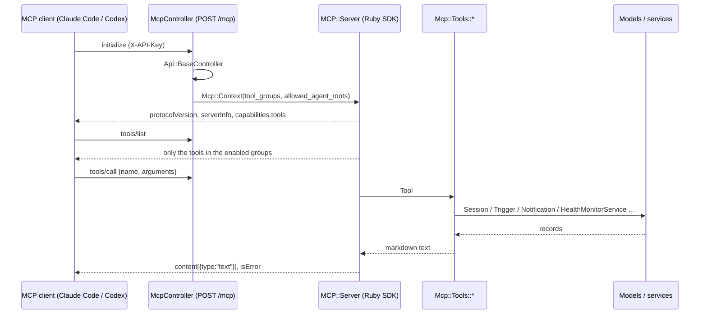

Zimmer speaks [MCP](https://modelcontextprotocol.io) itself. `POST /mcp` is a streamable-HTTP MCP
endpoint served by the Rails app, and it is how an agent session reaches back into the orchestrator
that spawned it: to archive itself, to schedule its own wake-up, to spawn a downstream session, to
tell you it is stuck.

There is no separate process. The tools call Zimmer's models and services in-process — the same ones
[the REST API](/extend/rest-api/) calls — so there is nothing to install, nothing to keep in version
lockstep, and no HTTP hop back into the app.

The protocol itself is the [official MCP Ruby SDK](https://github.com/modelcontextprotocol/ruby-sdk)
(the `mcp` gem): JSON-RPC framing, version negotiation, the streamable-HTTP transport, and argument
validation against each tool's schema. Zimmer supplies the two things the SDK cannot know — who may
call (the API key) and what this connection may see (the scoped tool list).

## Point a client at it

Any MCP client that speaks streamable HTTP works. The whole configuration is a URL and an API key:

```json
{
  "mcpServers": {
    "zimmer": {
      "type": "http",
      "url": "https://your-zimmer.example.com/mcp",
      "headers": { "X-API-Key": "one-of-your-API_KEYS" }
    }
  }
}
```

That is Claude Code's `.mcp.json`. Codex's `config.toml` wants the same two things under different
keys:

```toml
[mcp_servers.zimmer]
url = "https://your-zimmer.example.com/mcp"
http_headers = { "X-API-Key" = "one-of-your-API_KEYS" }
```

Or drive it by hand:

```bash
curl -s https://your-zimmer.example.com/mcp \
  -H "X-API-Key: $ZIMMER_API_KEY" -H 'Content-Type: application/json' \
  -d '{"jsonrpc":"2.0","id":1,"method":"tools/list"}'
```

## Auth is the API's auth

The `X-API-Key` header, compared against `ENV["API_KEYS"]` (comma-separated) with a constant-time
comparison — literally `Api::BaseController`, which `McpController` inherits. A key that works
against `/api/v1/sessions` works against `/mcp`.

MCP clients that only know how to send a bearer token can send the same key as
`Authorization: Bearer <key>` instead. There is one credential either way.

:::caution[Scoping is an affordance, not a trust boundary]
A key is an opaque string with no scope, no identity, and no audit trail — the same caveat as
[the REST API](/extend/rest-api/). The scoping below (`tool_groups`, `allowed_agent_roots`) lives in
the URL, so a caller that holds a key can always widen it by asking for a different URL — or skip MCP
and call `/api/v1` directly. It exists to give an agent the *right* surface, not to contain a
determined one. Anyone you hand a key to can do anything a key can do.
:::

## Scoped variants: `tool_groups`

The same endpoint serves several **scoped variants**, selected with a query parameter. This is how a
session gets exactly the surface it should have and no more.

| URL | Tools |
| --- | --- |
| `/mcp` | The default surface — 23 tools; the opt-in groups are not among them |
| `/mcp?tool_groups=sessions` | Session orchestration: spawn, search, inspect, act on other sessions |
| `/mcp?tool_groups=self_session` | Self-management: the 7 tools a session needs to run itself |
| `/mcp?tool_groups=gate_decisions` | The [gate decision ledger](/operate/gate-decisions/): search past ratings, read the human corrections, record one |
| `/mcp?tool_groups=work_backlog` | The [work backlog](/operate/work-backlog/): read the ranked queue, append a cleared issue, pull the top items into spot sessions |
| `/mcp?tool_groups=triggers_readonly,health_readonly` | Any combination; `_readonly` drops the write tools |
| `/mcp?tool_groups=self_session&session_id=42` | Names the calling session, so self-management tools can default to it |

The base groups are `sessions`, `notifications`, `triggers` and `health`; `gate_decisions` and
`work_backlog` are **opt-in** groups, and `self_session` is a composite. Each domain group, opt-in included, has a
`_readonly` variant. Omitting `tool_groups` enables the four base groups and nothing else — an
opt-in group is valid and addressable but never handed out by default, so `/mcp` on its own does
not carry `record_gate_decision`. An unknown group is dropped with a warning rather than failing
the connection.

`self_session` is the important one. It is **auto-injected into every session** (see below) and
carries `get_session`, `get_session_provenance`, `get_configs`, `send_push_notification`,
`wake_me_up_later`, `wake_me_up_when_session_changes_state`, and a **restricted `action_session`** —
the same tool name, but its `action` enum is narrowed to `update_notes`, `update_title`, `set_heartbeat`,
`pause_into_spot_queue`, `message_parent`, and `archive`. All but one of those are narrowings of the
full surface; [`message_parent`](#message_parent-the-one-action-that-exists-only-here) is on this
surface and on no other.
A session can manage itself; it cannot restart, fork, or re-configure anything. In particular the
capability/config edits on the full surface — `change_mcp_servers`, `change_model`, `change_skills`,
`change_hooks`, `change_plugins`, `change_goal`, `change_auto_compact_window`, `change_category`,
`toggle_push_notifications` — are deliberately absent here: a session must not rewrite
its own capabilities, goal, or organizational placement through the server injected into it. (The
*action* is narrowed, not the *target*: every tool takes a `session_id`, and a session is trusted to
pass its own. See the caution above.)

The injected entry's URL also carries `session_id=<id>` — the session the config was written for.
Nothing in an MCP request body identifies its caller (the API key is shared by the whole fleet and
the transport is stateless), so this is the only place that knowledge exists. The wake-up tools use
it to default their `session_id` argument, which is the difference between a session's first wake
call working and it failing on an argument the agent cannot see the value of. It is not a **scope**: `tool_groups` and `allowed_agent_roots` still decide everything the connection
may reach, it grants no tool, and an explicit `session_id` always wins.
`RuntimeConfigPostProcessor` stamps it onto every Zimmer entry in a session's config, including
catalog-provided ones, and leaves alone any entry that already names a session.

It is not *purely* a default either, and the one exception is worth knowing when you point an entry
by hand. It is also how Zimmer answers "is this caller the session it is acting on", which is what
exempts a session archiving **itself** from the refusal that stops one session terminating another's
in-flight turn (see [Archiving someone else's running turn](/sessions/lifecycle/)). A connection
stamped with another session's id therefore inherits that session's exemption — which is why a fork's
config is prepared for the fork rather than for the session it was forked from.

## Restricting what a connection may spawn: `allowed_agent_roots`

```
/mcp?tool_groups=sessions&allowed_agent_roots=zimmer,docs
```

With `allowed_agent_roots` set, the connection is locked to those [agent roots](/air/agent-roots/):

- `start_session` requires an `agent_root`, it must be in the list, and its `mcp_servers` must
  **exactly** match that root's `default_mcp_servers` — no additions, no removals. That includes
  `[]`: on an unrestricted connection an explicit empty array is a valid request for no servers
  ([omitted vs `[]`](/air/agent-roots/#a-list-you-pass-replaces-the-roots-defaults)),
  but here it is a removal and is rejected unless the root has no defaults to begin with.
- `action_trigger` may only create, update, delete, toggle, or invoke triggers on an allowed root,
  and `search_triggers` only shows those.
- `action_session`'s `change_mcp_servers` — and `change_plugins`, since plugins can bundle MCP
  servers — are refused outright.
- `wake_me_up_when_session_changes_state` refuses to watch a session outside the allowed roots. (A
  session waking *itself* is never restricted.)
- `get_configs` hides the roots you may not use, so the model never sees them.

  It hides unusable MCP servers the same way, on every connection: a server whose `${VAR}` does not
  resolve or whose OAuth credential is missing or dead is left out of the server list and named in a
  trailing **Unavailable** roster instead — enough for an agent to tell a broken server from an
  absent one without offering it as a choice. → [Availability, and what an agent is
  offered](/air/mcp-servers/#availability-and-what-an-agent-is-offered)

## What Zimmer injects into every session

`SelfSessionInjector` + the runtime config post-processors write these entries into a session's
`.mcp.json` / `config.toml` at prepare time. They are not catalog entries — Zimmer synthesizes them,
pointed at the instance that is running the session:

| Entry | When | URL |
| --- | --- | --- |
| `zimmer-self-session` | Every session, unless something already covers the surface | `<instance>/mcp?tool_groups=self_session` |
| `zimmer` | Roots that declare `default_subagent_roots` | `<instance>/mcp?allowed_agent_roots=<those roots>` |

The `zimmer` entry is full-surface, which is why it *does* cover the self-session surface — a parent
root gets one server, not two. A catalog entry you select yourself (`zimmer`, `zimmer-sessions`,
`zimmer-self-session` in `mcp.json`) that is full-surface suppresses the injection the same way.

Both injections are defensive about a name collision. If the catalog already supplies a `zimmer`
entry, the subagent injection leaves it alone rather than overwriting it — the two are the same URL
differentiated only by query param, so writing the root-restricted `allowed_agent_roots` over a
catalog-provided full-surface entry would silently narrow what the session may spawn. The
catalog's entry (retargeted) wins, and `start_session` keeps its full root surface.

Outside production, every `zimmer*` entry is **retargeted** at the instance preparing the session:
the origin is rewritten and the API key replaced, while the query string (the scoping) is preserved.
A staging session orchestrates staging, not production — even though the catalog's URLs say
production.

## The tool surface

29 tools, six domains — 23 of them on the unscoped surface.

| Group | Tools |
| --- | --- |
| `sessions` | `quick_search_sessions`, `get_session`, `get_session_provenance`, `get_configs`, `get_transcript_archive`, `start_session`, `action_session`, `manage_enqueued_messages`, `manage_categories`, `respond_to_elicitation`, `save_outcome_analysis` |
| `notifications` | `get_notifications`, `send_push_notification`, `action_notification` |
| `triggers` | `search_triggers`, `action_trigger`, `wake_me_up_later`, `wake_me_up_when_session_changes_state` |
| `health` | `get_system_health`, `action_health`, `get_spot_policy`, `action_spot_policy`, `get_costs` |
| `gate_decisions` (opt-in) | `search_gate_decisions`, `get_gate_decision_feedback`, `record_gate_decision` |
| `work_backlog` (opt-in) | `get_work_backlog`, `append_work_backlog_item`, `pull_work_backlog_items` |

`quick_search_sessions` matches session titles plus the `metadata` and `custom_metadata` JSON by
default, and `search_contents: true` widens it to the **transcript** — this is the MCP route to
finding a session by something said mid-conversation, and it exists so nobody has to `curl` the REST
API for it. That scan is bounded rather than best-effort (the `transcript` column has no index a
substring match can use), so it walks candidates newest-first, stops at `per_page` matches or a
wall-clock budget, orders results newest-first regardless of `order`, and reports **no total count**.
When it stops early it says so and returns a `scan_cursor`; pass that back with the same query and
filters to continue from exactly where it stopped. The query is matched as one case-insensitive
substring, so a multi-word `query` is a **phrase** — the words must be adjacent and in order, which
is what makes a search precise enough to confirm a session said something rather than shortlist the
ones that mentioned each word somewhere. An empty result that says "scan incomplete" means
"not found yet", not "not there". `get_transcript_archive` is a bulk export, not the search — it is
hundreds of megabytes and up to ten minutes stale.

Two defaults matter when the question is "does this work already have a session?". `show_archived`
defaults to `false`, and a session that finished a piece of work has archived itself — so a
duplicate check has to pass `show_archived: true` or name `archived` in `status`, or it misses
exactly the sessions it is looking for. And each result's prompt line — which only a
`verbose: true` row carries at all — is a preview, the first 100 characters, so an issue URL named
later in a prompt is not visible in the listing; `query` does not read the prompt column, so search
for the identifier a router put in `custom_metadata` instead.

Rows are **compact by default**: they carry status, runtime, pause, board visibility, genesis and
scheduling class, precedence and both timestamps, and omit six per-session fields — slug, category,
repository, branch, the prompt preview and the MCP server list. That is what makes the advertised
`per_page: 100` a page you actually get back. With the full row a hundred results came to 54,034
characters and the runtime refused the tool result outright, so the real ceiling was 35–40 and the
schema's `maximum: 100` was a promise the tool did not keep. The omission is never silent: every
response that has a compact row carries a line naming all six fields and the two calls that return
them — `verbose: true` for the full rows, `get_session` for one session in full. See
[Payload budgets](#payload-budgets-what-a-tool-result-may-cost).

`action_session`'s `set_visibility` action writes a session's
[board visibility](/sessions/board-visibility/) — whether its card is on the human's dashboard,
`visible` / `hidden` / `snoozed` until a time. It is a visual-organization device and nothing else:
no scheduler reads the field, and a snoozed session runs exactly when it would have run anyway. Reach
for `pause`, `pause_into_spot_queue` or `change_precedence` when the intent is to defer *work*. The
field is reported by `quick_search_sessions` and `get_session` (as a `**Visibility:**` line, only
when a session is tucked away) and is an optional `visibility` filter on the search — **unset by
default**, deliberately, because a session a human snoozed off their board is still a session a
duplicate check has to find. It is not in the `self_session` group: a session tidying its own card
off a human's board is not self-management.

`get_session` always includes a `### Session Hierarchy` section (the spawn tree this session belongs
to — an edge means "spawned", not "most recently talked to") and a `### Human Messages` section (the
messages Zimmer knows a named human authored anywhere in that tree, with author, channel, timestamp,
content and the session each was said in). Neither is behind an `include_` flag, because the most
important reading of the message record is the empty one: a caller asking "did a human authorize
this?" must be able to tell "no human turns" from "I forgot the flag." Entries are marked `here` (a
human spoke to this session) or `elsewhere` (a human spoke to another session in the hierarchy). On
this tool the message record is rendered as a **summary** — see
[Payload budgets](#payload-budgets-what-a-tool-result-may-cost) — while `get_session_provenance`
returns it whole. See [Hierarchy and human messages](/sessions/hierarchy-and-human-messages/).

`get_session` also always includes a `### Queued Messages` section: how many messages are `pending`
for that session, and a one-line, hard-truncated preview of the first few by position. It is there
because `get_session` is the dump a caller reads *before* it decides what to do with a session, and
without it a queue is invisible — four orchestrator sessions once each correctly declined to spawn a
duplicate and then each appended a follow-up to the same queue none of them could see, three of them
restating the message above. The section is deliberately a count plus a summary rather than the
messages: this output already runs long on a big session, so previews are cut at 120 characters,
five messages are shown and the rest are counted. `manage_enqueued_messages` is the tool that reads
the queue in full — and its `update`, `delete` and `reorder` actions are how a caller *consolidates*
a queue instead of growing it. Only `pending` counts: a delivered message's row is destroyed, an
`undelivered` one is terminal, and a `processing` one has already been handed over, so none of the
three is something a caller can still get ahead of. The two surfaces that *add* to a queue report the
same number from the other side — `action_session`'s `follow_up` and `manage_enqueued_messages`'
`create`, so a caller that just became fourth in line finds out at the moment it happens. When the
call **delivered** the message rather than queuing it (an idle session, or `force_immediate`) the
line says what is still pending *behind* it instead; a message's position in the queue is not the
depth, since a retired `undelivered` row holds a position too.

`gate_decisions` is a group of its own rather than three more tools in `sessions`, and it is opt-in
rather than base. Folded into `sessions`, every session carrying `zimmer-sessions` would be handed
the ability to write gate ratings; left in the base set, so would every session holding the full
`zimmer` server — and a ledger every session has a pen for is not evidence of anything. The group is
meant for the two gate roots, whose scoped `zimmer-gate-decisions` server is the one catalog entry
that names it; those roots live in a deployment's own catalog rather than in Zimmer's, so nothing in
Zimmer's own catalog reaches the group. Like every tool group this is a **scoping** boundary rather
than an authorization one — it decides what a session is offered, not what a shared API key can
reach. Nothing in this group or any other can write `human_feedback`: the key is scrubbed
recursively out of every entry, `record_gate_decision` says so in its receipt, and the only write
path is the browser. See the [gate decision ledger](/operate/gate-decisions/).
`search_gate_decisions` is the read that replaces loading a 3.4 MB JSON file to calibrate one
rating, and its description is as much of the feature as its code, since a gate that does not know
it can ask for "the last 10 holds on this surface" will go on reading everything.

`work_backlog` is opt-in for the same reason and one more: the [work backlog](/operate/work-backlog/)
is read by a job that spawns sessions from it with no human in the loop, so an entry on it becomes an
unattended implementing session. `get_work_backlog` returns the queue in rank order with each item's
whole-queue position; `append_work_backlog_item` places the item by the band rules, stamps the writing
session and its agent root from the connection, and refuses `prompt`, `precedence`, `pinned` and
`added_by` outright; `pull_work_backlog_items` spawns a `spot` `zimmer-orchestrator` session per item as a
child of the caller and records it on the row. What is deliberately absent, on this group or any
other: no tool pins an item, hand-places it, removes it by judgement, or starts it as a `priority`
session — those are the human's levers over what the fleet works on next and exist only on the REST
controller. The one removal an agent may make is on a pull, with a reason from a fixed vocabulary of
observed facts. `zimmer-work-backlog` (mcp.json) is the one catalog entry that names the group.

`get_session_provenance` returns those same two sections on their own, for one `session_id`, with
every entry it lists rendered in full — it exists to serve that record and nothing else, so it has no
content budget to spend. It lists the newest 25 entries, as it always has, and always includes every
entry `get_session`'s summary listed; a record longer than 25 says how many older ones no MCP call
returns. Zimmer injects neither into a session's turns, so this is the tool a session calls to read its
own provenance — and its description, not a block in the prompt, is where the caveats that record has
to be read with are stated. Like `get_session` it is in `self_session` as well as `sessions`, because
the auto-injected self-session server is the only surface every session carries.

Note the corollary for anything calling `action_session` with `follow_up`: a follow-up issued over this API is
machine-authored and records nothing, which is deliberate — pass `parent_session_id` to
`start_session` so the session you spawn can see the human context you were given.

For a session that already exists, `acting_session_id` is the equivalent. Set it on `follow_up`, or
on `manage_enqueued_messages` `create` / `send_now` / `interrupt`, to your own session id: Zimmer
records an "uncle" lineage edge marking you as a senior of the target, and that widens the target's
hierarchy to include yours, so your hierarchy's human messages reach it as `elsewhere` context. Like
`parent_session_id` it is self-declared and unverified — the API key identifies a caller, not a
session — so omitting it records nothing, and a recorded edge is a claim of seniority rather than
proof of one. The rules, including what happens when a junior calls back into its senior, are in
[Hierarchy and human
messages](/sessions/hierarchy-and-human-messages/#the-rules-including-inversion).

`archive` takes the same argument for a different purpose: **provenance, and no edge**. It records
you as the actor on the archived session's own timeline, so a human reading that session later can
tell an agent archiving it from a human clicking Trash. Set it whenever an agent drives an archive,
including archiving itself; an archive that declares nothing is logged as one. See
[the archive line](/sessions/lifecycle/#the-archive-line-names-who-did-it).

`action_health`'s three destructive actions (`cleanup_processes`, `retry_sessions`, `archive_old`)
share a 30-second cooldown with `Api::V1::HealthController` and the `/health` web dashboard — the
same `HealthActionCooldown` object, bucketed by a digest of the connection's API key. Switching
surfaces does not buy a second run, and one client's cleanup does not throttle anyone else's. If the
cache cannot enforce the cooldown (a null store, or a Redis that is down), the tool refuses with
`Rate limiting unavailable` rather than running unthrottled; `cli_refresh` and `cli_clear_cache`
only enqueue a job and are never throttled. See
[the limitation](/limitations/#the-only-rate-limit-is-on-the-health-endpoints-and-it-needs-a-real-cache).

`action_health` also carries the job-queue escape hatch: `enter_queue_recovery_mode` (`reason`,
`ttl_minutes`) halts execution on `pollers`, `triggers`, `inference`, `maintenance` and `default` while leaving `agents`
running, and `exit_queue_recovery_mode` resumes it. Both are outside that cooldown — the way out of
a halt has to work on the first try. `get_system_health` states the mode up front when it is on,
because a pending-job count means something completely different when the queues are deliberately
frozen. An agent session only gets these if its connection was given the `health` tool group; the
curated `self_session` set does not include it. See
[Queue recovery mode](/operate/background-jobs/#queue-recovery-mode).

`get_system_health` also names the backlogged queues and job classes whenever ready work is waiting,
plus each queue's own head-of-line age and the single longest-waiting job's lane and class, carrying
the same split as the `Queue backlog critical` Slack page. This is the parity that matters for
triage: the GoodJob dashboard at `/jobs` needs a browser session on the production host, which an
agent session does not have. The per-queue ages are what let an agent triaging `Zimmer GoodJob queue
is not draining` see past `oldest_ready_age_seconds`, which is a maximum across every queue at once
and through which a two-thread lane in front of minute-long jobs reads exactly like a stalled worker.
It is silent when nothing is waiting, and says so explicitly when the read itself fails rather than
dropping the whole health report. See
[The page says which queue, of what, and how old there](/operate/background-jobs/#the-page-says-which-queue-of-what-and-how-old-there).

Those lines are all taken over **ready** work, though, and ready work cannot say *why* a lane has
stopped draining. So the tool renders three more lines whenever the worker is holding anything: **In
flight by queue** (each lane's in-flight count beside its configured thread count), **Oldest
execution by queue**, and **Youngest execution by queue**. Read together they separate three states
that are identical from the ready side — a lane whose pool is full and whose *youngest* execution is
already old is wedged; ready work with no claim at all is a lane the worker has stopped polling; an
old oldest beside a fresh youngest is one slow job on an otherwise healthy lane. See
[When a lane is wedged](/operate/background-jobs/#when-a-lane-is-wedged).

`action_health` also carries `backfill_token_usage`: queue a sweep of every transcript on disk into
the token-spend ledger, so `get_costs` covers all of history rather than only spend since ingestion
was deployed. It is the MCP half of an ops action that deliberately has no shell equivalent, it is
not throttled, and it is idempotent — asking twice joins the run already in flight. See
[Token spend](/operate/costs/).

The action tools are verb-multiplexers: `action_session` takes an `action` enum (`follow_up`,
`pause`, `restart`, `archive`, `unarchive`, `fork`, `change_model`, …), `action_trigger` takes
`create` / `update` / `delete` / `toggle` / `invoke`, and so on. `tools/list` carries the full schema for each —
ask the server rather than trusting this table.

`action_trigger` reaches parity with the conditions the triggers form and the REST API can express.
A Trigger ORs its conditions, and a single `trigger_type` + `configuration` pair can only describe
one of them — so a trigger that must fire on more than one thing (a Slack passive listener carrying
both `passive_listen_thread` and `passive_listen_channel`, say) also accepts a `conditions` array of
`{trigger_type, configuration}` objects. The flat pair still works unchanged for the
single-condition case; sending both is rejected rather than guessed at.

On `update`, `conditions` **upserts**: an element with an `id` edits that condition, one without
appends, and an existing condition the array does not mention is left alone. Deleting one is
explicit (`{"id": 123, "remove": true}`). That asymmetry is deliberate — a Slack condition's
`configuration` holds the poller's only copy of its cursors
(`TriggerCondition::SLACK_POLL_STATE_KEYS`), which `preserve_slack_poll_state` keeps by merging back
the keys an incoming configuration omits. Replace semantics would destroy the row and its cursors
with it, silently re-baselining a live trigger. Fetching a trigger by id through `search_triggers`
prints each condition's id, which is what the array addresses.

`search_triggers` **names each trigger's MCP servers in list mode as well as by id**, because the
question a catalog rename asks is fleet-wide — *which triggers reference server `X`?* — and the list
is the only view built for scanning many triggers. One listing answers it for a page of triggers
rather than one by-id call per row.

The by-id view is the one that prints a condition's `configuration`, and that hash holds the
poller's cursors as well as the settings a human typed. A Slack passive listener accumulates one
entry per thread in `thread_timestamps` / `participating_threads`, rewritten every minute and
growing without bound, so serialising it cost roughly 15k tokens for a single trigger. A
configuration whose JSON is 2,000 characters or fewer — an ordinary schedule, `ao_event` or
`github_label` one — is printed whole. Over that, a poller-owned key
(`TriggerCondition::SLACK_POLL_STATE_KEYS` and `GITHUB_POLL_STATE_KEYS`, less the user-facing
`allowed_user_ids`) holding more than ten entries is **left out of the JSON** and described under
it instead:

```
- `thread_timestamps`: 312 entries, most recent 1788455311.688659
- `seen_items`: 312 entries, e.g. tadasant/zimmer#pull_request#42
```

Omitted rather than replaced in place, and that is the important half. The commonest way to misuse
`action_trigger` is to read a configuration and send back what you believe is the desired final
state; a summary sitting under its real key would be written straight over the live cursor map,
while a key that is *absent* is merged back intact by `preserve_slack_poll_state` /
`preserve_github_poll_state`. So the JSON this view prints is safe to echo.

Everything else is untouched: a poller key under ten entries stays in place, nothing outside those
two constants is ever summarised (`repos`, `labels`, `exclude_labels` and `allowed_user_ids`
included), and a large configuration with no high-cardinality poller state is still printed in full.
`GET /api/v1/triggers/:id` serves every cursor exactly for a caller that needs the values.

`action_trigger` also sets what a trigger's *sessions* get, not only when it fires:
`catalog_skills`, `catalog_hooks` and `catalog_plugins` are the AIR-catalog lists stamped onto every
session it spawns, and each id is validated against the catalog exactly as `action_session`'s
`change_skills` / `change_hooks` / `change_plugins` validate theirs — an unknown id is rejected with
the valid ones listed, rather than persisted and left to break the next spawn. A key you do not
send is left alone.

**An empty list is not "none".** `Session.create_from_agent_root!` resolves each list as
`catalog_skills.presence || agent_root.default_skills`, and a fire onto a *re-used* session skips
the sync entirely (`Trigger#sync_session_artifact!` refuses to let an empty trigger list strip a
live session's artifacts — the session-9563 incident). So a trigger with `catalog_skills: []` spawns
sessions carrying the agent root's default skills, not sessions carrying none. Sending `[]` resets
the trigger to saying nothing about that artifact; there is no way to spell "spawn with no skills at
all" from here. `search_triggers` and `action_trigger` both render an empty list as
`(agent root defaults)` for that reason.

`enqueue_messages` and `resuscitate_archived` both require `reuse_session`, and the tool **rejects**
them without it rather than accepting a value the model then clears
(`clear_enqueue_messages_without_reuse_session` runs before the paired validation, so a `save` with
either one set and reuse off succeeds silently). That silence is what the rejection is for: with
`enqueue_messages` off, a fire that lands on a still-running session is
[dropped](/sessions/triggers/#coalescing-a-repeated-fire), which is exactly the failure a session is
usually sent to `action_trigger` to fix. Send `reuse_session: true` in the same call, or drop the flag.

`action_trigger`'s `invoke` fires a trigger now, without waiting for a condition to match — the MCP
half of `POST /api/v1/triggers/:id/invoke`, and the same fire the **Run Now** button on the trigger
page performs. Pass `variables` to fill in the template's placeholders. The session is linked to the
trigger and counts toward its fire counter, a `disabled` trigger can still be invoked (and is not
re-armed by it), and the trigger's [burst cap](/sessions/triggers/#burst-control) still applies — over
it the tool returns the burst-notice session, or reports that nothing was created. See [firing a
trigger by hand](/sessions/triggers/#firing-a-trigger-by-hand).

`action_session`'s `pause_into_spot_queue` is the counterpart of `wake_me_up_later` for a session
with no time worth naming: it sleeps the session with no trigger at all and leaves it for the spot
scheduler, which resumes it when a Claude Code account is under both quota targets and a slot is
free. It is on the `self_session` surface too, because a session waiting on quota rather than on an
event is exactly the caller for it. See
[Spot and priority](/sessions/spot-and-priority/#joining-the-queue-on-purpose).

On a *running* session the park lets the turn finish, because its commonest caller is a session
parking itself and a session that halted itself would kill the process waiting for the reply. Pass
`"halt": true` to stop the turn where it stands when you are driving somebody else's running
session. The `self_session` variant does not expose the option, and strips it from the arguments if
it is passed anyway.

**Sleeping a session is an MCP-only capability.** `wake_me_up_later` and `pause_into_spot_queue` are
the only ways to put a session to sleep until a time or a quota opening — the web UI has no control
that does it, and neither does the REST API (`POST /api/v1/sessions/:id/sleep` sleeps a session with
no wake and no queue record, which is a different thing).

A human's levers on a sleeping session are narrower than they look, and worth stating exactly. **Start now** (the Ranked view's ⋮) resumes a session parked in the **spot queue**, which arms nothing — but it *refuses* one asleep on a wall-clock wake, because `Sessions::StartNow` treats an armed wake as outranking the queue. For that session a human has two routes, both of which consume the pause because both mean *I am taking this session over*: send it a **follow-up** from its session page, or cancel the wake at **/triggers**, where it is listed as `Wake session #<id> at <time>`. The **Restart** button is not one of them — it refuses anything that is not `failed`.

`start_session` and `action_session` also take the web UI's *symbolic* queue placement, not just the
integer behind it: `place: "top_of_spot"` is the same server-side resolution the Ranked view's
**Demote to spot** button and the Quick Router's **Run as spot** checkbox perform, mutually exclusive
with `precedence`. It narrows the placement to one request rather than locking the queue. See [Placing something at the head of the
queue](/sessions/spot-and-priority/#placing-something-at-the-head-of-the-queue).

`action_session` reaches full parity with the fields the web UI's session-detail editors expose. Its
config-editing actions — `change_mcp_servers`, `change_model`, `change_skills`, `change_hooks`,
`change_plugins`, `change_goal`, `change_auto_compact_window`, `change_category`,
`toggle_push_notifications` — mirror the inline editors on the session page. List-valued fields
(`mcp_servers`, `skills`, `hooks`, `plugins`) use **replace, not merge** semantics, and every id is
validated against its catalog, so an unknown skill/hook/plugin id is rejected with the valid options
listed rather than persisted (a bad value would otherwise fail AIR prepare on the next unarchive).

All four persist to the session and take effect the next time its runtime config is prepared — the
session's next turn, a restart, or an unarchive. They do not hot-reconfigure a running process, and
neither do the web UI's editors or the [REST endpoints](/extend/rest-api/#changing-a-sessions-artifacts-takes-effect-on-its-next-prepare):
one rule, whichever door the request comes through. Rewriting `.mcp.json` under a live agent would
change nothing anyway — the CLI launches its MCP servers when the process starts. To make a change
take effect immediately, restart the session.

**`change_mcp_servers` and `change_plugins` can move the target session's status, and that is deliberate.** Those two are the lists that can bring in an MCP server, so both probe the newly selected set for one nobody has authorized yet. When there is one, the answer names it under **Needs authorization** and the session is moved to `failed` with `failure_reason: "oauth_required"` — which is what puts the Authorize buttons on its page for a human. A session that is currently *running* is never moved this way: its already-spawned process cannot see the change either way, and killing a live turn over a config edit would be worse than waiting. Read a `failed` status after one of these calls as "a human has to authorize something", not as a crash.

An empty array is a value, not an absence, on both sides of a session's life: `change_mcp_servers` with `[]` clears the list, and
`start_session` with `[]` launches with none — the same request means the same thing at launch time
and at change time. `start_session` names the same four lists (`mcp_servers`, `skills`, `plugins`,
`hooks`), so a hook that is noise for the task is dropped at launch rather than corrected by a
follow-up `change_hooks` — which, for a clone-only session, would race the job start.

### `message_parent`: the one action that exists only here

Every other action on the `self_session` `action_session` is a subset of the full one. `message_parent`
is the exception, and it is the exception because it *cannot* be defined anywhere else: it takes no
target. The caller names itself, and Zimmer reads `parent_session_id` to find who to deliver to.

That is the whole safety property. A "message any session" action on the server injected into every
session would be a real privilege grant; "report to whoever started me" is not, because the edge it
travels already exists and Zimmer, not the caller, decides where it goes. The general form is
`follow_up` on the full `sessions` surface, and it stays there.

It closes an asymmetry rather than adding a channel. A parent has always been able to reach a child
(`action_session` → `follow_up`, recording an [uncle edge](/sessions/hierarchy-and-human-messages/)
for the lineage). A child had no route back at all: its final message reaches its parent only if that
parent happens to be polling `get_session`, and a parent that archived, or one asleep on a wake it
will not get, never learns. So a session handed a goal it could not accomplish — the wrong agent
root, or a missing MCP server or credential — had nowhere to report that but a GitHub issue.

```jsonc
{
  "action": "message_parent",
  "session_id": 4211,              // your own id
  "message": "The deploy scripts are in the infra root; I only have the app repo.",
  "reason": "wrong_scope"          // or "missing_tools", or "other"
}
```

`reason` is a closed list because a parent branches on it: `wrong_scope` (the work belongs to a
different agent root), `missing_tools` (an MCP server, credential or privilege the session was not
given), `other`. What the parent reads is the child's own words wrapped in Zimmer's framing — the
child's id, title, URL and reason code — so a report is never mistaken for a human speaking.

Delivery is the ordinary follow-up routing rather than a second path: a `running` parent takes the
report on its queue and reads it at the end of its turn, and a `waiting` or `needs_input` parent
takes it now. **Queuing is the default**, and `force_immediate` is opt-in, because the parent of a
stuck child is usually a router mid-delegation: ending that turn costs the other delegations in
flight, while the news itself keeps a few minutes. Waking a sleeping parent consumes its one-time
wake triggers, exactly as any other follow-up does.

Because it is the ordinary `EnqueuedMessage` queue with `origin: caller`, the report is inside the
ordinary accounting: the parent cannot archive over an unread one without being refused, and a forced
archive retires it to `undelivered` and pages. It cannot be accepted and then silently lost.

An **archived** parent is refused rather than delivered to, since nothing delivers a message to a
session in the trash — the error names `unarchive_parent: true`, which restores that session and then
delivers. That is opt-in on purpose: it interrupts a session that considered its work finished. A
**failed** parent, a session with **no parent** at all, and a session recorded as **its own** parent
(`parent_session_id` is client-supplied, and the model checks existence rather than identity) are
refused outright, and each error says what to do instead. One more error is a retry rather than a
refusal: a queue **position conflict**, which means another writer of the parent's queue won a race
deferred to COMMIT. Send it again.

What the parent reads is the child's message **quoted** — every line behind a `>` prefix — inside
Zimmer's framing. That is what lets the envelope claim the quoted lines are the child's words and the
rest is Zimmer's: a body carrying its own `---` and its own bracketed header cannot close the
quotation early and continue in that voice. `session_id` must be the calling session's own: a connection stamped with a
`session_id` refuses to send another session's report, which is the one place this surface enforces
its aim rather than only its actions.

The same capability is `POST /api/v1/sessions/:id/message_parent` — see
[the REST API](/extend/rest-api/#reporting-back-to-the-parent-that-started-you).

### `start_session` is only safe to retry if you name the attempt

`start_session` takes an optional `idempotency_key`. Generate a fresh UUID and pass it, and the create
becomes safe to repeat: a second call with the same key returns the session the first one made — the
result says so in its heading, *Existing Session Returned (idempotency_key matched)* — and queues no
second agent job. The replayed result also reports whether an agent job is queued on that session, so
a session that was created but never started (a worker killed between the commit and the enqueue) is
visible rather than handed back as though it were running.

Without one, a failed `start_session` is genuinely ambiguous. The 504 a caller sees on a slow create
comes from the reverse proxy, not from Zimmer, so it is an HTML page rather than a JSON-RPC error
envelope, it carries no session id, and it arrives *after* the row has committed. Every observed
occurrence had in fact created a healthy session that went on to run to completion. Retrying that —
the obvious reading of an error — spawns a second clone, a second agent holding a Claude quota slot,
and two agents opening two PRs for one task.

So: **with** a key, retry on any error including a timeout. **Without** one, do not retry — call
`quick_search_sessions` with the title you passed and check whether the session is already there.

Two ways to get the key wrong, both of which end with a session that silently never exists. Do not
derive it from the task, an issue number, or a date: keys share one global namespace, so two routers
that independently build `issue-577-fix` collide. And it is not a fingerprint of the arguments —
reusing a key returns the session it created the first time whatever you pass with the repeat. A
fresh UUID per unit of work avoids both. See [Creating a
session](/extend/rest-api/#idempotency_key--making-the-create-safe-to-retry) for the REST equivalent
and the concurrency guarantee behind both.

Two tools deliver a message to a session that already exists, and both let you choose whether to
interrupt. `action_session` `follow_up` queues the prompt when the session is `running` and sends it
straight through when the session is `waiting` or `needs_input`. `force_immediate: true` interrupts
instead. A `failed` or `archived` session is rejected either way. `manage_enqueued_messages` makes
the same choice by action name: `create` queues, `send_now` stages and interrupts in one step,
`interrupt` promotes a message already in the queue. `action_session` `follow_up` takes an optional
`goal` alongside the prompt, and it means the same thing on all three of its delivery paths: a
non-blank goal becomes the session's new definition of done, a blank or omitted one leaves the
existing goal untouched (use `change_goal` to clear one). `manage_enqueued_messages` takes a `goal`
too, but it is the *message's* goal — `update` with a blank one clears it on the row, and neither it
nor `create`/`send_now` length-check it before the insert. All three interrupt paths run through
`Sessions::InterruptService`, the same backend the web UI's "Send Now" button uses, so they inherit
its per-session advisory lock and exactly-once delivery. An interrupt jumps its own message to the
front of the queue; the messages still pending keep their order behind it.

A queued message is not read until the current turn ends, so a message that would have redirected the
agent arrives after the wasted work is done. What an interrupt costs is one turn: the in-flight
process is terminated, an uncommitted tool call is lost, files already written stay written, and the
next turn resumes the same conversation with the new message appended. Termination is not always
instantaneous — a web process cannot signal a worker-spawned agent across container boundaries, so it
records `interrupt_terminate_pid` and the worker's monitoring loop ends that turn on its next pass.
Queue the additive messages. Interrupt the ones that change the plan.

The two wake-up tools are the ones worth knowing by name. `wake_me_up_later` sleeps the calling
session and creates a one-time trigger that resumes it at a wall-clock time; `wake_me_up_when_session_changes_state`
resumes it when *another* session reaches `needs_input`, `failed`, or `archived`. Together they are how
a session waits on CI, on a deploy, or on a session it spawned, without burning a process on `sleep`.

Two things about them are worth stating because they shape how much a wait costs:

- **`session_id` is optional on both.** The injected entry names the session it was written for, so
  a session waking *itself* — the overwhelmingly common case — just omits it. Pass it only to
  schedule a wake for a different session, where it still wins over the connection's own.
- **`event_names` takes the whole set at once.** One call with
  `["session_archived", "session_needs_input", "session_failed"]` creates **one** trigger with one
  condition per event, so a complete wait is two rows — that watcher plus a `wake_me_up_later`
  deadline backstop — rather than four. The singular `event_name` still works.

And `session_needs_input` no longer fires on a turn boundary the watched session leaves again at
once. Zimmer settles it first, so a wake that reaches you is a session that actually came to rest →
[a turn boundary is not a rest](/sessions/lifecycle/#a-turn-boundary-is-not-a-rest).

### `get_costs`

Reads Zimmer's token-spend ledger: what inference cost, by agent root, model, session, and kind of
token. Fleet-wide by default; pass `agent_root` or `session_id` to scope it, `days` to set the
window.

It lives in `health` rather than `sessions` for the same reason `get_spot_policy` does — this is the
deployment's posture, not one session's business — and it is therefore **not** in the `self_session`
set injected into every session. A session has no reason to read the whole fleet's bill.

Every fleet report states how complete the ledger is: a `Partial history` warning with the sweep's
progress while the one-time historical backfill is still running, and the covered window once it has
finished. An agent comparing this month against last needs to know which of the two it is looking at.

The usual caution applies to anything it returns: the dollar figures are list price on
subscription-billed accounts, so they are a comparable unit across models rather than money owed,
and a model with no configured rate contributes zero and is named explicitly rather than being
folded silently into a total. See [Token spend](/operate/costs/).

## Payload budgets: what a tool result may cost

A tool result the runtime refuses is worse than a small one. Two of these tools grew past that limit
and were spilled to a file instead of returned ([#652](https://github.com/tadasant/zimmer/issues/652)):
`quick_search_sessions` at its own advertised `per_page: 100`, and `get_session` on an ordinary
session — 77,258 characters with `include_transcript: false`, of which almost none was session state.
It was the router's brief in `Current Prompt`, that same brief again as `active_follow_up_prompt`
inside the metadata JSON, and a hierarchy's worth of them replayed in the message record. The fleet
skills budget forty `get_session` reads a run to tell an outage-parked session from a paused one;
at that size a run could afford two.

Both tools render less by default and take `verbose: true` to render everything. `get_session`'s
default cuts exactly three things — nothing else in the dump moves:

| Block | Default | Whole thing |
| --- | --- | --- |
| `Current Prompt` | first 1,000 characters | `verbose: true` |
| Long string values in `System Metadata` / `Custom Metadata` | first 300 characters per value; keys and nesting untouched | `verbose: true` |
| `Human Messages` | newest 5 `here` **and** newest 5 `elsewhere` entries, content cut to 300 characters | `get_session_provenance`, or `verbose: true` — both list the newest 25 in full |

The one rule that governs all of it: **a cut is only acceptable if the caller can see it happened.**
A response that quietly drops the tail of a value reads exactly like one where the value ended there,
and the `Human Messages` block is the fallback both agent gates use to establish that a human asked
for something — a gate that cannot tell a shortened record from an empty one is required to hold
rather than guess. So every cut carries its own marker with the value's real length; the block's two
counts are always of the *whole* record, never of what was rendered; the omitted entries are counted
out loud next to the call that returns them; and when nothing needed cutting the block says
`**Complete:** every entry in this record is listed below, in full` rather than staying silent.

The rule cuts both ways, and the second edge is easier to miss: **a pointer that cannot deliver is
the same failure arrived at from the other side.** `get_session_provenance` renders every entry it
lists in full, but it lists the newest 25 — a cap it has always had — so on a record longer than
that, "fetch the rest there" would be a dead end. So the block computes what that call would return
before it points at it: it names the newest-25 window explicitly, and it says how many entries fall
outside it and are returned by no MCP call at all. The uncut rendering does not point at itself.

Two things make those pointers true rather than aspirational. The summary's selection is a **subset**
of the uncut rendering's by construction — the uncut one lists the newest 25 *plus* the newest 5 of
each origin — so every entry the summary shows is an entry `get_session_provenance` shows. And the
`here`/`elsewhere` split of the entry budget applies to both: `here` is the half that answers "did a
human ask *this* session for this?", so a hierarchy with 25 recent `elsewhere` entries cannot push
the `here` ones out of either rendering.

`**Complete:**` is qualified when the hierarchy walk itself was truncated — the block then says every
entry the walk *reached* is listed, and points at the truncation note above it — because "complete"
is the strongest word this block has and it must not be read as covering sessions nobody searched.

Everything a scheduler reads is short and is never cut: status, scheduling class, precedence, the
waiting-reason lines, and the `auth_outage_*` / `spot_hold_*` / `spot_pause_*` metadata keys.

## Protocol

The SDK's `StreamableHTTPTransport`, run **stateless** with JSON responses: every POST carries one
complete JSON-RPC message and gets one complete JSON response, so no `Mcp-Session-Id` is issued and
any Puma worker can serve any request. Building the server per request is also what lets one endpoint
serve every scoped variant. `GET /mcp` (server-initiated SSE) and `DELETE /mcp` (session termination)
are 405 — there is no stream and no session to terminate. Batched bodies are rejected, as the spec
requires since 2025-11-25.

The SDK owns version negotiation, the JSON-RPC error codes, and **argument validation**: a
`tools/call` whose arguments don't match the tool's `input_schema` comes back as an error result the
model can correct, before any Zimmer code runs.

`McpController` disables the SDK's DNS-rebinding (`Host`/`Origin`) check. That check defends a
*locally bound* server against a browser; Zimmer is a deployed Rails app whose `config.hosts` already
validates `Host`, and whose credential is an explicit header rather than an ambient cookie.


```mermaid
sequenceDiagram
    participant C as MCP client (Claude Code / Codex)
    participant R as McpController (POST /mcp)
    participant S as MCP::Server (Ruby SDK)
    participant T as Mcp::Tools::*
    participant M as Models / services

    C->>R: initialize (X-API-Key)
    R->>R: Api::BaseController#authenticate_api_key
    R->>S: Mcp::Context(tool_groups, allowed_agent_roots)
    S-->>C: protocolVersion, serverInfo, capabilities.tools
    C->>R: tools/list
    S-->>C: only the tools in the enabled groups
    C->>R: tools/call {name, arguments}
    S->>T: Tool#call(args)
    T->>M: Session / Trigger / Notification / HealthMonitorService …
    M-->>T: records
    T-->>S: markdown text
    S-->>C: content[{type:"text"}], isError
```

A tool that raises `Mcp::ToolError` (bad arguments, missing record, forbidden by scoping) comes back
as a **tool result** with `isError: true` and the message as text — the model reads it and can
recover. A protocol-level problem (unknown method, a tool the connection never advertised) comes back
as a JSON-RPC error, which the model never sees.

## Adding a tool

1. Write `app/services/mcp/tools/<name>.rb`, subclass `Mcp::Tool` (which is an `MCP::Tool` from the
   SDK, plus Zimmer's calling convention), declare `tool_name`, `description`, `input_schema`, and
   implement `#call(args)` (string keys). Return a String (sent as text) or a Hash/Array (sent as
   pretty JSON). Raise `Mcp::ToolError` for anything the model should see and act on. The schema is
   enforced for you — arguments are validated against it before `#call` runs.
2. Call the models and services directly. If the logic already exists behind a service object, call
   it — the MCP layer validates arguments, calls, and formats; it does not own business logic.
3. Register it in `Mcp::Registry::ALL_TOOLS` with its domain group and whether it is a write
   operation. If the group is new, decide whether it belongs in `BASE_GROUPS` (every unscoped
   connection gets it) or `OPT_IN_GROUPS` (a connection has to name it) — the second is for a group
   whose write tools should not ride along on `/mcp`. Add `composite_groups: %w[self_session]` if a
   session should be able to use it on itself, and a `composite_overrides` entry if it needs a
   narrower variant in that group (see `action_session`).
4. Test it under `test/services/mcp/tools/`, and let `test/controllers/mcp_controller_test.rb` cover
   the wire shape.
