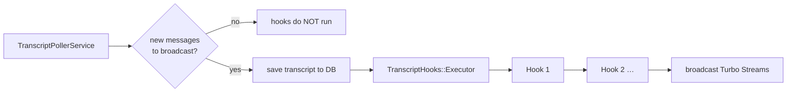

A **transcript hook** runs inside Zimmer whenever new transcript messages are broadcast. It reads
the agent's output and writes conclusions into `session.custom_metadata`.

:::note[Different from AIR hooks]
[AIR hooks](/air/artifacts/#hooks) are scripts registered into the *agent's* settings and fired by the
agent's own lifecycle. Transcript hooks are Ruby classes that run in the Zimmer worker. The two share
a name and nothing else.
:::

## The contract

`TranscriptHooks::BaseHook` (`app/services/transcript_hooks/base_hook.rb`):

```ruby
class MyHook < TranscriptHooks::BaseHook
  def call(session:, new_messages:)
    # inspect new_messages, write to session.custom_metadata
  end
end
```

Registered in `config/initializers/transcript_hooks.rb` via `TranscriptHooks::Registry`.

## When they run



Three properties worth knowing:

1. They run only when new messages are actually broadcast. A poll that finds nothing new runs no
   hooks.
2. They run after the transcript is saved, so a hook can rely on `session.transcript` being current.
3. They're sequential and error-isolated. One hook raising doesn't stop the others.

## The one that ships

`GithubPrUrlHook` scrapes `https://github.com/{owner}/{repo}/pull/{n}` out of the transcript and
writes it to `session.custom_metadata["github_pull_request_url"]`.

That one field is load-bearing. It's what `GitHubPullRequestPollerJob` (CI status),
`GithubCommentPollerJob` (review comments), and `GitHubMergeConflictPollerJob` all key off. If the hook
misses the URL, none of Zimmer's GitHub integration works for that session — the agent's PR exists,
but Zimmer doesn't know about it, so it can't tell the agent when CI goes red or when someone comments.

:::caution[It only scans tool-result content]
`GithubPrUrlHook` matches against tool-result content only — not assistant messages, not user
messages.

In practice that means the URL has to come back from a tool call, which it does when the agent runs
`gh pr create` and the Bash tool result contains the URL. But an agent that opens a PR some other way,
or that mentions the URL only in its own prose, leaves the field empty, and the GitHub pollers never
engage. There's no warning when this happens.
:::

## Writing one

```ruby
# app/services/transcript_hooks/my_hook.rb
module TranscriptHooks
  class MyHook < BaseHook
    def call(session:, new_messages:)
      new_messages.each do |msg|
        next unless msg["type"] == "tool_result"
        # ...
      end
      session.update_column(:custom_metadata,
        session.custom_metadata.merge("my_key" => value))
    end
  end
end
```

Then register it:

```ruby
# config/initializers/transcript_hooks.rb
TranscriptHooks::Registry.register(TranscriptHooks::MyHook)
```

:::caution[`custom_metadata` is a lost-update hazard]
Hooks write to `session.custom_metadata` with a read-modify-write, which is not atomic — the same
problem `AgentSessionJob` documents about session `metadata`. Two hooks (or a hook and the job) writing
concurrently can clobber each other. Tracked in [#70](https://github.com/tadasant/zimmer/issues/70).

Keep hooks fast and keep their writes to distinct keys.
:::

## What a hook is good for

The pattern is "derive a structured fact from unstructured agent output, so the rest of Zimmer can act
on it." The PR URL is the canonical example: the agent produces prose and tool output; the hook turns
it into a queryable field; three cron jobs then use that field to close the loop between the agent and
GitHub.

Anything you want to *poll on* after the agent mentions it is a good candidate.
