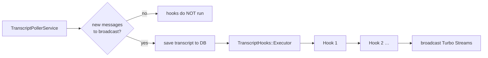

A **transcript hook** runs inside Zimmer whenever new transcript messages are broadcast. It reads
the agent's output and writes conclusions into `session.custom_metadata`.

:::note[Different from AIR hooks]
[AIR hooks](/air/artifacts/#hooks) are scripts registered into the *agent's* settings and fired by the
agent's own lifecycle. Transcript hooks are Ruby classes that run in the Zimmer worker. The two share
a name and nothing else.
:::

## The contract

`TranscriptHooks::BaseHook` (`app/services/transcript_hooks/base_hook.rb`):

```ruby
class MyHook < TranscriptHooks::BaseHook
  def call(session:, new_messages:)
    # inspect new_messages, write to session.custom_metadata
  end
end
```

Registered in `config/initializers/transcript_hooks.rb` via `TranscriptHooks::Registry`.

## When they run


```mermaid
flowchart LR
    P["TranscriptPollerService"] --> N{"new messages<br/>to broadcast?"}
    N -->|no| SKIP["hooks do NOT run"]
    N -->|yes| S["save transcript to DB"]
    S --> E["TranscriptHooks::Executor"]
    E --> H1["Hook 1"]
    H1 --> H2["Hook 2 …"]
    H2 --> B["broadcast Turbo Streams"]
```

Three properties worth knowing:

1. They run only when new messages are actually broadcast. A poll that finds nothing new runs no
   hooks.
2. They run after the transcript is saved, so a hook can rely on `session.transcript` being current.
3. They're sequential and error-isolated. One hook raising doesn't stop the others.

## The ones that ship

### `GithubPrUrlHook`

`GithubPrUrlHook` records the pull requests **this session opened**, appending them to
`session.custom_metadata["github_pull_request_urls"]` (an array) with a first-seen timestamp per URL
in `github_pr_tracking_started_at`.

That list is load-bearing, and it is provenance rather than a bookmark folder. It's what
`GitHubPullRequestPollerJob` (CI status), `GithubCommentPollerJob` (review comments), and
`GitHubMergeConflictPollerJob` all key off — so anything on it has GitHub activity routed back to
this session, and anything missing from it is invisible to all three.

So the question the hook answers is not "did a PR URL appear in this transcript" but **"does this
transcript show this session opening that PR"**. Reading about a PR is not opening one. Three kinds
of evidence count:

| Evidence | What it looks like | Repo guard |
| --- | --- | --- |
| **Created** | The URL is in the output of a *successful* `gh pr create` | None — any repo |
| **Re-created** | The URL is in a *failed* `gh pr create`, next to "already exists" (the PR for the branch we just pushed) | Must match `git_root` |
| **Claimed** | The agent's own prose says it opened the PR — "Opened PR: `<url>`" | Must match `git_root` |

The claimed path is what catches creation routes that aren't `gh pr create`: a wrapper script, an
MCP tool, the GitHub web UI. It requires a creation phrase adjacent to the URL, so an agent
narrating work *about* a PR ("reviewing `<url>`") doesn't trip it.

Two things are deliberately **not** evidence:

- **A same-repo URL sitting in any old tool result.** This used to be a fast path, and it is how a
  session that merely ran `gh pr view` — a merge gate, a reviewer, anything reading the repo's PR
  list — was handed someone else's PR as its own, and then received that PR's comments and
  merge-conflict notifications ([#214](https://github.com/tadasant/zimmer/issues/214)).
- **A URL in a user message.** Zimmer's own trigger prompts carry PR URLs ("comments on your PR
  `<url>`"), so adopting them would let one misrouted notification bootstrap a permanent wrong
  association.

Both runtimes are handled. Claude Code and Codex write different transcript shapes, so finding shell
invocations, their results, whether a result failed, and the agent's own prose is dispatched on
`session.agent_runtime` inside `TranscriptHooks::ToolCallParser`.

:::caution[The failure mode is silence, in both directions]
Claiming too much misroutes another session's PR here; claiming too little leaves a session whose PR
Zimmer never learns about, with every GitHub integration quietly switched off for it. Nothing about
either is visible in the UI.

The backstop for the second direction: when a session whose **goal mentions a pull request** finishes
a turn (`pause`) with an empty list, the hook writes one `warning` log into the session timeline
saying no PR URL was captured. Once per session, not once per turn.
:::

### `GithubCommentAuthorshipHook`

Records the GitHub comments *this session posted*, so `GithubCommentPollerJob` never hands one back
to an agent as if the human had written it.

It exists because `gh` inside every session authenticates as the human, which makes an agent's
comment indistinguishable by author from a real one — see
[what the PR comment poller acts on](/operate/background-jobs/#how-zimmer-knows-which-comments-its-own-agents-posted).
The hook correlates a comment-posting command (`gh pr comment`, `gh issue comment`, `gh pr review`,
a `gh api` write to a comments endpoint) with the permalink that command printed, and writes an
`AgentPostedGithubComment` row keyed by comment rather than by session.

It reads only the results of commands it recognizes as posting — an agent that *reads* a comment gets
that comment's own `html_url` back, and recording that would suppress a human comment. Same principle
as `GithubPrUrlHook`: what the transcript shows the session *doing*, not what it saw.


## Writing one

```ruby
# app/services/transcript_hooks/my_hook.rb
module TranscriptHooks
  class MyHook < BaseHook
    def call(session:, new_messages:)
      new_messages.each do |msg|
        next unless msg["type"] == "tool_result"
        # ...
      end
      session.update_column(:custom_metadata,
        session.custom_metadata.merge("my_key" => value))
    end
  end
end
```

Then register it:

```ruby
# config/initializers/transcript_hooks.rb
TranscriptHooks::Registry.register(TranscriptHooks::MyHook)
```

:::caution[`custom_metadata` is a lost-update hazard]
Hooks write to `session.custom_metadata` with a read-modify-write, which is not atomic — the same
problem `AgentSessionJob` documents about session `metadata`. Two hooks (or a hook and the job) writing
concurrently can clobber each other. Tracked in [#70](https://github.com/tadasant/zimmer/issues/70).

Keep hooks fast and keep their writes to distinct keys.
:::

## What a hook is good for

The pattern is "derive a structured fact from unstructured agent output, so the rest of Zimmer can act
on it." The PR URL is the canonical example: the agent produces prose and tool output; the hook turns
it into a queryable field; three cron jobs then use that field to close the loop between the agent and
GitHub.

Anything you want to *poll on* after the agent mentions it is a good candidate.
