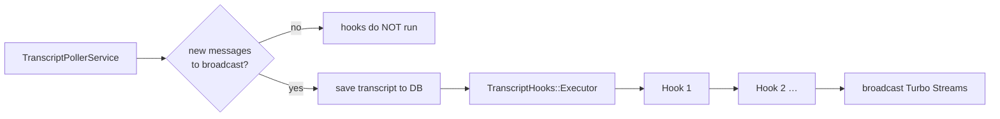

A **transcript hook** runs inside Zimmer whenever new transcript messages are broadcast. It reads
the agent's output and writes conclusions into `session.custom_metadata`.

:::note[Different from AIR hooks]
[AIR hooks](/air/artifacts/#hooks) are scripts registered into the *agent's* settings and fired by the
agent's own lifecycle. Transcript hooks are Ruby classes that run in the Zimmer worker. The two share
a name and nothing else.
:::

## The contract

`TranscriptHooks::BaseHook` (`app/services/transcript_hooks/base_hook.rb`):

```ruby
class MyHook < TranscriptHooks::BaseHook
  # `session`, `transcript_content` and `new_messages` are readers on the base class;
  # `#call` takes no arguments.
  def call
    # inspect new_messages, write to custom_metadata through the helper below
  end
end
```

Registered in `config/initializers/transcript_hooks.rb` via `TranscriptHooks::Registry`.

## When they run


```mermaid
flowchart LR
    P["TranscriptPollerService"] --> N{"new messages<br/>to broadcast?"}
    N -->|no| SKIP["hooks do NOT run"]
    N -->|yes| S["save transcript to DB"]
    S --> E["TranscriptHooks::Executor"]
    E --> H1["Hook 1"]
    H1 --> H2["Hook 2 …"]
    H2 --> B["broadcast Turbo Streams"]
```

Three properties worth knowing:

1. They run only when new messages are actually broadcast. A poll that finds nothing new runs no
   hooks.
2. They run after the transcript is saved, so a hook can rely on `session.transcript` being current.
3. They're sequential and error-isolated. One hook raising doesn't stop the others.

## The ones that ship

### `GithubPrUrlHook`

`GithubPrUrlHook` records the pull requests **this session opened**, appending them to
`session.custom_metadata["github_pull_request_urls"]` (an array) with a first-seen timestamp per URL
in `github_pr_tracking_started_at`.

That list is load-bearing, and it is provenance rather than a bookmark folder. It's what
`Github::PrPollPass` and its evaluators — PR status and CI, review comments, merge conflicts, and
the goal check's description facts — all key off, so anything on it has GitHub activity routed back
to this session, and anything missing from it is invisible to all of them.

So the question the hook answers is not "did a PR URL appear in this transcript" but **"does this
transcript show this session opening that PR"**. Reading about a PR is not opening one. Four kinds
of evidence count:

| Evidence | What it looks like | Repo guard |
| --- | --- | --- |
| **Created** | The URL is in the output of a *successful* create — `gh pr create`, or a POST to the REST endpoint (`gh api repos/OWNER/REPO/pulls -X POST`) | Any repo — bounded by the repo the command names, in `--repo` or in the endpoint path |
| **MCP-created** | The first same-repo URL in the result of a successful `mcp__<server>__create_pull_request` tool call | Must match `git_root` — the repo the URL belongs to, and the repo the call's input names when it names one |
| **Re-created** | The URL is in a *failed* create, next to "already exists" (the PR for the branch we just pushed) | Must match `git_root` |
| **Claimed** | The agent's own prose says it opened the PR — "Opened PR: `<url>`" | Must match `git_root` |

`gh pr create` goes through GitHub's GraphQL API, so a GraphQL outage sends agents to the REST
endpoint instead — which is how [#89](https://github.com/tadasant/zimmer/issues/89) happened again on
2026-08-17, with a PR opened by a retry loop around `gh api ... -X POST` recorded nowhere. What makes
a REST call a create is that it POSTs to a repo's `/pulls` collection; the same endpoint read with a
GET *lists* the repo's open PRs. An explicit `-X`/`--method` is authoritative, and without one a
field flag (`-f`, `-F`, `--input`) is a POST too, because that is when `gh api` switches from GET.
Nothing nested under the collection counts: a POST to `.../pulls/7/reviews` writes *about* a PR
rather than opening one. The endpoint also names the repo, so it bounds what that result can vouch
for the same way `--repo` does.

All of that is read **per command segment**, never across the whole shell script — a tool call's
command is routinely several commands (`gh api .../pulls --jq '.[]' && gh api .../comments -X POST`,
a retry loop, `out=$(...)`, Codex's `bash -lc` wrapper). Reading them together would let a list
borrow the POST beside it and adopt every PR it printed. `TranscriptHooks::ShellSegments` does the
split, and `GithubCommentAuthorshipHook` classifies its own `gh api` writes through the same seam.

**Whether a create *failed* is read per segment too.** A tool result carries one error flag for the
whole script — Claude Code's `is_error`, Codex's `exec_command_end` exit code — and in a shell that
flag is the status of whatever ran **last**. `gh pr create ... | tail -1` reports tail's status and
`gh pr create ...; B` reports B's; only `&&` and `||` propagate a failure, and only a create with
nothing after it sets the status itself. So the separator that follows a create decides whether the
flag is about the create at all, and `ShellSegments#shell_segments_with_separators` is what says
which one it was.

Reading the flag across a segment boundary is the same mistake as reading a create across one, in the
other direction, and it is [#620](https://github.com/tadasant/zimmer/issues/620): session 11907 ran

```
gh pr create --repo tadasant/zimmer … --body-file … 2>&1 | tail -1; gh pr view --repo tadasant/zimmer --json …
```

The create succeeded and printed `https://github.com/tadasant/zimmer/pull/804`. The `gh pr view`
after it was missing its positional argument and exited 1, so the whole call was flagged, so the
create read as failed, so the PR was recorded nowhere — no merge notification, no comment or
merge-conflict polling, and the merge gate's conflict hand-back path with no session to hand back to.

A create whose success is only **inferred** this way is weaker evidence than one the flag never
contradicted — the line really did fail somewhere, and nothing says the create was not part of it —
so it is held to three bounds the ordinary reading is not:

- **One URL**, because one create opens one pull request. The same cap the MCP-created tier takes.
- **This session's own repo, when the create named none.** A `gh pr create` with no `--repo` normally
  vouches for any repo, since a create in a fork clone lands on a parent the command never mentions.
  Combined with the cap that would be a bound of nothing at all, and `gh pr create --fill | tail -1;
  false` would record the first PR URL in the output whatever repo it belonged to. The unbounded
  licence is a *strong*-evidence licence; an inferred success does not get it.
- **Nothing at all when a PR listing shared the line.** A `gh pr list`, or a `gh api repos/o/r/pulls`
  that is a GET, prints every open PR on the repo into the same blob, and on a failed line there is
  no telling which of them the cap would land on. A single-PR read is *not* a listing — `gh pr view
  <n>` prints the one PR it was asked for, which is #620's own shape, and excluding it would put the
  bug back.

Which URL the cap keeps is "the first the bound allows", and that is the create's own only when
nothing before it on the line printed one. A listing is the shape that would, and it is excluded
outright, so what is left is narrow enough for first-wins to be the right guess rather than a claim.

When the split cannot say which separator went where — a line whose quoting never resolves falls back
to a crude split — the flag is read as written. The question is only ever asked in order to
*discount* a failure, so an unreadable command records less rather than more. That is also why
`ShellSegments` reports `nil` for the **last surviving** command whatever the text said: separators
are assigned by position and empty segments are dropped afterwards, so a trailing `;` would otherwise
leave a create looking like it had something after it when it ran last.

A create is also read out of what a command **runs**, never out of what it **quotes**. `gh pr create`
inside a `grep` pattern, an `rg` argument, an `echo` or a `sed` script is data, and session 11898 ran
exactly that — `grep -n "def \|gh pr create\|pull/" hook.rb` over this hook's own source — and
recorded the example URL in its header as a PR it had opened
([#772](https://github.com/tadasant/zimmer/issues/772)). `ShellSegments#unquoted` blanks a segment's
quoted strings out before the create is matched against it, and the split does its half by not
treating a separator as a separator when it is escaped or quoted: that grep stays one `grep` rather
than becoming four commands, one of which is the bare literal.

Two shapes of quoting defeat plain pairing, and each has its own rule. A **heredoc body** is not
quoted by anything the pairing can see — `python3 - <<'PY' … PY` hands its lines to Python — so
`ShellSegments` finds where the body starts and ends and drops those lines outright rather than
splitting them. And a **run of three or more quotes** is not a pair: Python's `"""` used to pair its
first two as an empty string and hand the third to the next quote along, which left everything
between them outside every quoted span. Both of those stacked up in
[#873](https://github.com/tadasant/zimmer/issues/873), where a session editing this hook's *test
file* through a `<<'PY'` heredoc recorded its own fixture strings as pull requests it had opened,
against a repository that does not exist.

Dropping a line is the one thing here that can lose a real create, so the heredoc reading gives up
rather than guesses. A delimiter whose terminator it cannot find leaves the rest of the script read
as shell; a terminator is matched with surrounding whitespace allowed, so it can only end a body
*early*; and a line whose own quoting never resolves opens nothing, since a `<<` inside an unclosed
argument is not a redirection. A body assumed to run to end-of-input would swallow every command
after it and switch a session's whole GitHub integration off in silence
([#89](https://github.com/tadasant/zimmer/issues/89)).

The create is then matched **anywhere** in what is left, rather than at the front of the segment.
A create sits behind all sorts of things in command position — `cd ... &&`, `GH_TOKEN=x`,
`timeout 120`, `until ... ; do`, `sudo -E`, `xargs` — and an anchor would drop every one of them it
did not enumerate. Quoting is likewise read one line at a time, and a line that ends inside an
unclosed quote falls back to the crude split. Both of those are the same bet: a shell comment or an
unrecognised heredoc body carrying an apostrophe or two must not be able to swallow the real
`gh pr create` on the line below it. Recording too little is the worse failure, and it is silent.

One quoted string is not data: the script a shell is handed. `bash -lc "cd /repo && gh pr create"` —
the shape Codex writes in front of every command it runs, and one an agent writes by hand — carries
*more commands*, so `ShellSegments` splits it again in place of the wrapper wherever the wrapper
appears, including behind a `timeout` or an `xargs -I{}`. Keeping it whole would be wrong in both
directions at once: the create inside it would be blanked as an argument, and `bash -lc "gh api
.../comments --paginate && rm -f x"` would read as a single command whose `rm -f` supplies the write
flag for the read in front of it.

A GitHub MCP server opens a pull request through a **structured tool call**, not a command, so none
of that command parsing can reach it — which left the prose path as the only tier that could see one
([#559](https://github.com/tadasant/zimmer/issues/559)). The MCP-created tier reads it directly: both
runtimes name an MCP tool `mcp__<server>__<tool>` (Claude Code joins the halves with `__`, and
codex-rs does the same through `MCP_TOOL_NAME_DELIMITER`), the tool half is matched **whole** so
`create_pull_request_review` and `create_pull_request_review_comment` stay out, and the call's input
names the repo — `{owner, repo}` as github-mcp-server spells it, or one `owner/name` slug under
`repo`/`repository`.

Nothing is assumed about the *result body*: every server writes its own, so the result is scanned
for a PR URL exactly as a shell create's output is, and a server whose result carries no URL records
nothing. One create opens one pull request, so its result vouches for **at most one URL** — the first
on this repo. That cap is the guard the shell tiers do not need and this one does: a create result is
routinely the created PR serialized back, `body` included, and a body the `open-pr` skill wrote cites
other pull requests as a matter of course. Without it, every same-repo URL an agent put in its own PR
body would be recorded as a PR this session opened — #214 with the session supplying the evidence
against itself.

A failed call is not evidence either — the "already exists" reading rescues a failed `gh pr create`
by matching gh's own failure text, and there is no equivalent text to match here. That rule holds
only as far as the runtime reports a failure, which on Codex is not at all: an exit code comes from
an `exec_command_end` line that a non-shell call never gets, so an MCP result there always reads as a
success (see [limitations](/limitations/#pr-ownership-is-a-transcript-heuristic-and-both-ways-of-being-wrong-are-silent)).

This tier is narrower than a shell create, which vouches for any repo it names: an MCP
`create_pull_request` has to be on the session's own repo, on both ends. `gh pr create` is one known
program, where `mcp__<server>__create_pull_request` is a *convention* matched across servers whose
semantics Zimmer has not verified, so the same-repo guard bounds what a server that does not mean
what Zimmer reads can cost. Pi is not covered at all: the `pi-mcp-adapter` extension calls every
server through one `mcp` proxy tool rather than by name, so a Pi transcript carries no
`mcp__<server>__<tool>` to key on.

The claimed path is what catches the creation routes still left: a wrapper script, an MCP tool named
something else, the GitHub web UI. It requires a creation phrase adjacent to the URL — an inflected verb
running into the URL ("I've opened `<url>`"), or a verb, a PR noun and then the URL ("Created the
draft PR at `<url>`"). Only inflected verbs count: "open" is an adjective as often as a verb, and
"the open PR: `<url>`" is how prose refers to *someone else's* PR.

Five things are deliberately **not** evidence:

- **A same-repo URL sitting in an unrelated tool result.** Matching on the repo alone is how a
  session that merely ran `gh pr view` — a merge gate, a reviewer, anything reading the repo's PR
  list — was handed someone else's PR as its own, and then received that PR's comments and
  merge-conflict notifications ([#214](https://github.com/tadasant/zimmer/issues/214)).
- **`gh api repos/OWNER/REPO/pulls` that does not POST.** Same endpoint as a REST create, opposite
  meaning: a GET is a list of the repo's open PRs, so recording it would be #214 again by another
  route. A POST elsewhere in the same shell script does not change that.
- **The result of an MCP tool that is not a create.** `mcp__github__list_pull_requests` and
  `mcp__github__get_pull_request` read the repo's PRs, and `create_pull_request_review` writes
  *about* one — all three are the #214 shape wearing a structured tool call.
- **A URL in a user message.** Zimmer's own trigger prompts carry PR URLs ("comments on your PR
  `<url>`"), so adopting them would let one misrouted notification bootstrap a permanent wrong
  association.
- **Anything in the part of a fork's transcript the fork did not write.** `ForkSessionService` gives
  a fork a *copy* of the source session's conversation up to the fork point, so the source's own
  `gh pr create` is sitting in the fork's transcript as Created evidence from the moment the fork
  exists. The hook reads only the messages **after** `metadata["forked_at_message_index"]`, which is
  the boundary between what the source wrote and what the fork wrote
  ([#556](https://github.com/tadasant/zimmer/issues/556)).

  This is a trim, not a skip, and the difference is the point. A user fork is a live working session
  that may go on to open pull requests of its own; those still count, and the three pollers still
  reach it for them. A fork whose metadata records no fork point is read exactly like an unforked
  session — a boundary the hook cannot locate is not a reason to discard a session's own evidence,
  because that direction is the [#89](https://github.com/tadasant/zimmer/issues/89) failure below.

One session is skipped outright, whatever its transcript shows: a
[status-summary fork](/sessions/status-summary/#generation-runs-on-a-fork). Its transcript is a copy
of the source session's, so the source's own successful `gh pr create` is sitting in it as Created
evidence — the strongest kind, which no repo guard bounds. Crediting the fork would put a throwaway
session into all three pollers' scope, and the PR poller would answer a merge by queueing "your PR
merged, you may archive" onto it; the harvest job then archives the fork, which retires that message
`undelivered` and [pages](/sessions/lifecycle/). That page still fires: the harvest job archives
without consulting the archive guard, and the strand alert is skipped only when a caller *forced*
past that guard having been shown the message. A sweep discarding a notice nobody read is exactly the
case the alert is for. The hook records nothing for such a fork.

The fork-point trim above would have been enough to prevent that page on its own — a summary fork is
forked at the source's *last* message, so the source's whole conversation, `gh pr create` included,
is prefix. The outright guard is kept because it says the stronger thing: a session Zimmer created to
write a blurb opens nothing ever, so not even the one turn it writes itself counts — and it holds
without depending on the fork point having been recorded.

All three runtimes are handled. Claude Code, Codex and Pi write different transcript shapes, so
finding shell invocations, their results, whether a result failed, and the agent's own prose is
dispatched on `session.agent_runtime` inside `TranscriptHooks::ToolCallParser` — which warns rather
than silently defaulting when it meets a runtime it has no parser for.

:::caution[The failure mode is silence, in both directions]
Claiming too much misroutes another session's PR here; claiming too little leaves a session whose PR
Zimmer never learns about, with every GitHub integration quietly switched off for it. Nothing about
either is visible in the UI.

The backstop for the second direction: when a session whose **goal asks for a pull request to be
opened** comes to rest with an empty list, the hook writes one `warning` log into the session
timeline saying no PR URL has been captured. All three rest states call it — `pause`, `fail` and
`archive`, the transitions after which nothing runs unless a person comes back. `pause` catches the
miss while the same session can still act on it; `fail` and `archive` catch the sessions `pause`
never sees (one that dies mid-turn, one trashed straight from `needs_input`). Once per session, not
once per event: the dedup is on the warning log, so extra call sites cost nothing in timeline spam.
One budget only buys one shot, though, so `pause` skips the call on a **recovery pause** — Zimmer
restarting its own interrupted process, where nothing about the session's PR work is settled — and
makes it later if that recovery never comes. See
[which pauses announce themselves](/sessions/lifecycle/#which-pauses-announce-themselves).

A session that **never got an agent turn** is skipped outright, on every call site. `fail` and
`archive` both transition straight out of `waiting`, so a session created with a PR-flavored goal
and trashed before it started — or swept up by `HealthMonitorService`'s seven-day stale-session
sweep, which bulk-archives every non-archived session untouched for a week, `waiting` ones that
never spawned included — would otherwise be told its goal produced no PR when it never had a turn in
which to produce one. True and useless, in exactly the place the warning is supposed to be a signal.

The predicate is `Session#before_first_agent_turn?`, and it is the conservative half of the pair on
purpose: `metadata["runtime_started"]` merely being *present* means a runtime was spawned here once,
and a transcript alone means an agent spoke here whatever the metadata says. Either one and the
warning still fires — suppressing more than never-ran sessions would re-open the opposite defect,
and a diagnostic that fails to fire is far harder to notice than one that fires too often. One shape
is left uncovered by that setting: a spawn that dies *after* its pid was recorded. Zimmer notices
such a process wrote nothing and records the finding by setting `runtime_started` to **`false`** —
which is a value, not an absence, so the warning still fires. Deliberate, on the same asymmetry: a
warning too many is read and dismissed, a warning too few is never read at all.

The goal match is a phrase match ("open a PR", "the PR is open", the `open-pr` skill), not a bare
mention, because the catalog's read-only goal says *"do not create files, PRs, or branches"*.
:::

### `GithubCommentAuthorshipHook`

Records the GitHub comments *this session posted*, so `Github::CommentEvaluator` never hands one back
to an agent as if the human had written it.

It exists because `gh` inside every session authenticates as the human, which makes an agent's
comment indistinguishable by author from a real one — see
[what the PR comment poller acts on](/operate/background-jobs/#how-zimmer-knows-which-comments-its-own-agents-posted).
The hook correlates a comment-posting command (`gh pr comment`, `gh issue comment`, `gh pr review`,
a `gh api` write to a comments endpoint) with the permalink that command printed, and writes an
`AgentPostedGithubComment` row keyed by comment rather than by session.

A comment posted through a **GitHub MCP server** has no command to correlate, so the tool's own name
is the evidence: a `mcp__<server>__<tool>` call whose tool half is one of `MCP_COMMENT_POST_TOOLS` is
a post, and the id is read from the `html_url` of the single JSON object its result carries — never
from a free-text scan, and never from a JSON array, which is the shape of a listing. That tier is
the sibling of `GithubPrUrlHook`'s `create_pull_request` one above, and it is held tighter for the
same reason: an MCP tool name is a convention across servers Zimmer has not seen, not one program
whose output it can predict. A server that answers in prose, or with a thread, records nothing —
the direction that costs a comment its suppression rather than costing a human their reply.

It reads only the results of commands it recognizes as posting — an agent that *reads* a comment gets
that comment's own `html_url` back, and recording that would suppress a human comment. Same principle
as `GithubPrUrlHook`, and since [#870](https://github.com/tadasant/zimmer/issues/870) the same
reading of a command: what the transcript shows the session *doing*, not what it saw, so
`grep -rn "gh pr comment" docs/` is a read. The one part read as written is the endpoint path of a
`gh api` write, because quoting a path is ordinary and a quoted path must not hide a real post — the
same asymmetry `GithubPrUrlHook` draws between a create and its `--repo`. Erring toward detection is
deliberate here: a comment recorded wrongly is suppressed for every session permanently, but a post
*missed* is the self-reply loop the hook exists to break.

What the *result* of a posting call vouches for is scoped the same way since
[#901](https://github.com/tadasant/zimmer/issues/901), because the result is one blob for the whole
call rather than one per segment. A `gh pr comment` result is free-text scanned only when the post
was the whole command and the only thing in it that reached GitHub. When the call ran anything else —
`gh pr comment 7 --body x && gh api repos/o/r/issues/7/comments`, the natural post-then-confirm move —
only permalinks printed alone on a line count. And when the call *names* a comments listing, no more
of those than it had posting segments, so a listing narrowed to bare URLs registers nothing rather
than the whole thread. The naming is what keeps that cap off a fan-out
(`gh pr list ... | xargs -I{} gh pr comment {} ...`), where one segment posts many times and a count
of segments would give up every recording in the call.


## Writing one

```ruby
# app/services/transcript_hooks/my_hook.rb
module TranscriptHooks
  class MyHook < BaseHook
    def call
      new_messages.each do |msg|
        next unless msg["type"] == "tool_result"
        # ...
      end
      update_custom_metadata("my_key" => value)
    end
  end
end
```

Then register it:

```ruby
# config/initializers/transcript_hooks.rb
TranscriptHooks::Registry.register(TranscriptHooks::MyHook)
```

:::caution[Keep hook writes to distinct keys]
`update_custom_metadata` merges in PostgreSQL as a single statement, so a hook cannot erase a key
another writer set while it was running — which matters most for `github_pull_request_urls`, since
losing it means no GitHub integration ever engages for the session. See
[Metadata races](/sessions/spawning/#metadata-races).

That protects *different* keys. Two hooks writing the *same* key still race, and the last one wins —
so keep hooks fast and keep their writes to distinct keys.
:::

## What a hook is good for

The pattern is "derive a structured fact from unstructured agent output, so the rest of Zimmer can act
on it." The PR URL is the canonical example: the agent produces prose and tool output; the hook turns
it into a queryable field; three cron jobs then use that field to close the loop between the agent and
GitHub.

Anything you want to *poll on* after the agent mentions it is a good candidate.
