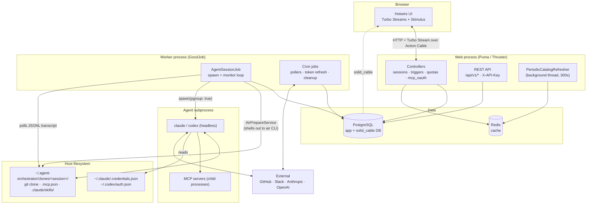
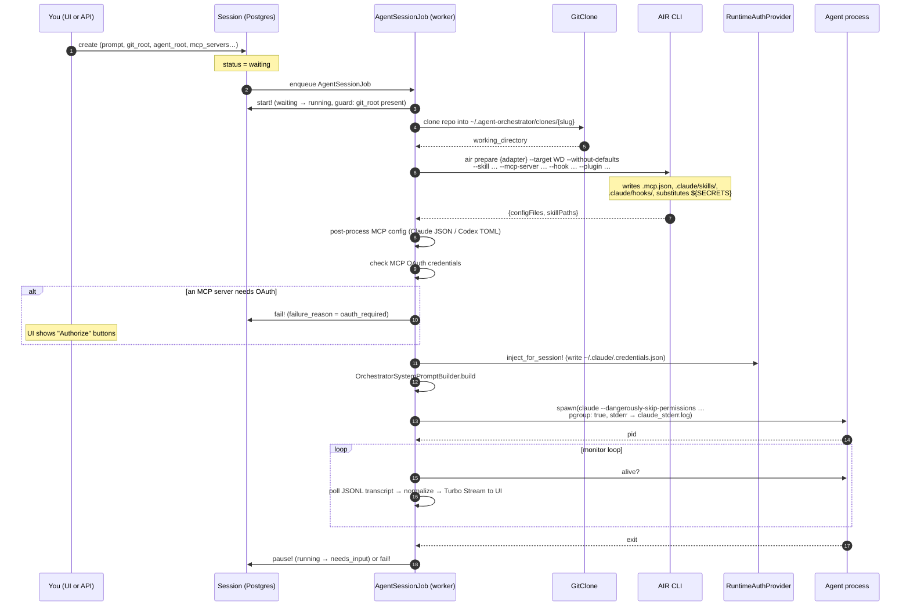

Zimmer is a Rails 8 monolith with an unusual job: its background workers spawn and supervise
long-lived OS subprocesses that write to the filesystem and talk to the internet.

## The whole system

## The processes

**Web (Puma, fronted by Thruster in production).** Serves the UI and the REST API. It runs
no cron. It *does* run one background thread, `PeriodicCatalogRefresher`, which re-runs
`air update` every 300 seconds, because the catalog cache lives on a per-container
filesystem and the web container would otherwise serve a catalog frozen at boot.

**Worker (GoodJob).** Everything that matters happens here: `AgentSessionJob` spawns agents
and monitors them, and roughly two dozen cron jobs poll GitHub, poll Slack, refresh OAuth
tokens, reap zombies, and clean up clones. In development GoodJob runs `:async` (in-process
with Puma); in production and staging it's `:external`, meaning a separate `bundle exec
good_job start` process is required.

:::danger[The shipped Terraform does not run a worker]
`infra/terraform/cloud-init.yaml.tftpl` renders a `docker-compose.yml` with exactly three
services — `app`, `redis`, and (staging only) `db`. There is no worker service and no
`good_job start` anywhere in `infra/`, the Dockerfile, or the workflows, while
`config/environments/production.rb:59` sets `execution_mode = :external`.

On a droplet provisioned by this repo's Terraform, sessions enqueue and never run, and no
cron ever fires. The staging health check only curls `/up`, so it passes anyway. You must
add a worker service yourself. See
[Known limitations](/limitations/#the-shipped-terraform-provisions-no-job-worker).
:::

**Agent subprocess.** A real headless `claude` or `codex` process, spawned with
`pgroup: true` so the whole process group can be killed as a unit. Its stdin and stdout go
to `/dev/null`; stderr goes to a log file inside the clone. The transcript file on disk is
the only channel Zimmer reads output from: both CLIs are launched with a JSON streaming
flag, but the stream itself is discarded.

## Data

**PostgreSQL** holds everything: sessions, logs, transcripts (the entire JSONL file is stored
as a string on `sessions.transcript`), triggers, notifications, OAuth credentials, and the
catalog snapshot. It also backs Action Cable via `solid_cable`, on a second database
(`zimmer_<env>_cable`) that must exist before boot.

**Redis** is the Rails cache only. There is no Redis-backed queue — GoodJob uses Postgres.

**The filesystem** is load-bearing and under-appreciated. Clones live in
`~/.agent-orchestrator/clones/`. Agent credentials live in `~/.claude/.credentials.json` and
`~/.codex/auth.json`, and are read by the CLI, written by Zimmer, and *also* rewritten by the
CLI behind Zimmer's back. See [Agent harness credentials](/auth/harness/).

## From prompt to running agent

This is the path a session takes on `waiting → running`, driven by `AgentSessionJob`:

The steps that most often surprise people:

- **The clone happens before AIR runs**, because AIR's prepare step needs a target directory
  and auto-detects the root from the git remote (though Zimmer passes `--root` explicitly).
- **OAuth is a gate, not a prompt.** If a remote MCP server needs OAuth and has no valid
  credential, the session *fails* with `failure_reason: oauth_required` and the UI renders
  Authorize buttons. Completing the flow resumes it. See [MCP server OAuth](/auth/mcp-oauth/).
- **`--without-defaults` is passed deliberately.** Zimmer stores the final resolved artifact
  lists on the session row, so AIR must not re-add root defaults on top. See
  [How Zimmer consumes AIR](/air/zimmer-integration/).

## Runtimes are a bundle of seams

Zimmer supports two agent harnesses today, `claude_code` and `codex`, and a third would be
additive. A "runtime" is a `RuntimeRegistry::Bundle` struct rather than a class, with twelve
slots, one per place where driving a vendor CLI differs: the CLI adapter, the retry strategy,
the transcript source and normalizer, the MCP status detector, the prompt contribution, the
config post-processor, the auth provider, the credential writer.

Core code never says "Claude." It asks the registry. See
[Adding an agent harness](/extend/agent-harness/).

## Extensions

A thin seam on top of that: `Ao::Extension` lets optional behavior override the CLI adapter,
supply a print-inference backend, or contribute spawn environment variables — without core
naming it. Exactly one ships (`mcp_tool_search`), and the Docker image excludes
`app/extensions/*/` entirely. See [Extensions](/extend/extensions/).
