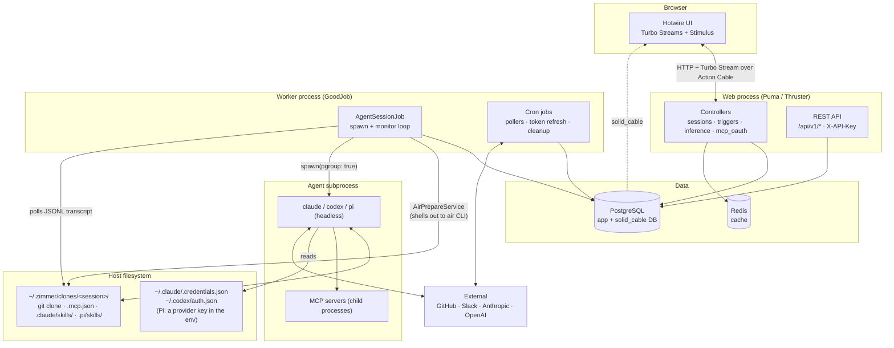
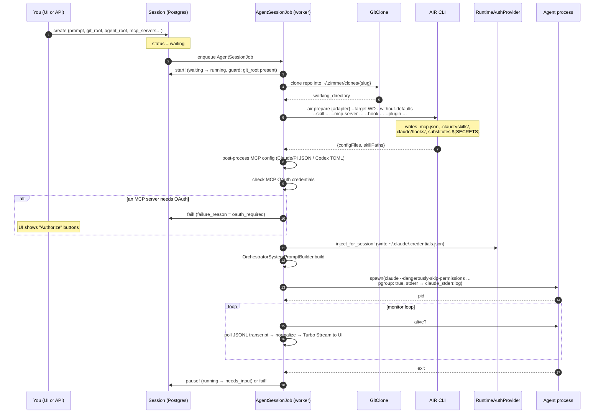

Zimmer is a Rails 8 monolith with an unusual job: its background workers spawn and supervise
long-lived OS subprocesses that write to the filesystem and talk to the internet.

## The whole system

```mermaid
flowchart TB
    subgraph browser["Browser"]
        UI["Hotwire UI<br/>Turbo Streams + Stimulus"]
    end

    subgraph web["Web process (Puma / Thruster)"]
        RC["Controllers<br/>sessions · triggers · inference · mcp_oauth"]
        API["REST API<br/>/api/v1/* · X-API-Key"]
    end

    subgraph worker["Worker process (GoodJob)"]
        ASJ["AgentSessionJob<br/>spawn + monitor loop"]
        CRON["Cron jobs<br/>pollers · token refresh · cleanup"]
    end

    subgraph data["Data"]
        PG[("PostgreSQL<br/>app + solid_cable DB")]
        RD[("Redis<br/>cache")]
    end

    subgraph host["Host filesystem"]
        CLONE["~/.zimmer/clones/&lt;session&gt;/<br/>git clone · .mcp.json · .claude/skills/ · .pi/skills/"]
        CRED["~/.claude/.credentials.json<br/>~/.codex/auth.json<br/>(Pi: a provider key in the env)"]
    end

    subgraph proc["Agent subprocess"]
        CLI["claude / codex / pi (headless)"]
        MCP["MCP servers (child processes)"]
    end

    EXT["External<br/>GitHub · Slack · Anthropic · OpenAI"]

    UI <-->|"HTTP + Turbo Stream over Action Cable"| RC
    RC --> PG
    API --> PG
    PG -.->|"solid_cable"| UI
    RC --> RD
    ASJ --> PG
    CRON --> PG
    ASJ -->|"AirPrepareService<br/>(shells out to air CLI)"| CLONE
    ASJ -->|"spawn(pgroup: true)"| CLI
    CLI <--> CLONE
    CLI --> MCP
    CLI -->|"reads"| CRED
    ASJ -->|"polls JSONL transcript"| CLONE
    CLI <--> EXT
    CRON <--> EXT
```

## The processes

**Web (Puma, fronted by Thruster in production).** Serves the UI and the REST API. It runs
no cron and no background threads. It resolves the AIR catalog once at boot, then serves the
newest `CatalogSnapshot` the worker's catalog refresh stored in Postgres, so it never needs
its own copy of the catalog cache to be fresh. See
[Zimmer integration](/air/zimmer-integration/#the-snapshot-is-the-source-of-truth).

**Worker (GoodJob).** Everything that matters happens here: `AgentSessionJob` spawns agents
and monitors them, and roughly two dozen cron jobs poll GitHub, poll Slack, refresh OAuth
tokens, reap zombies, and clean up clones. In development GoodJob runs `:async` (in-process
with Puma); in production and staging it's `:external`, meaning a separate `bundle exec
good_job start` process is required.

The Kamal deploy runs that as a dedicated `worker` role (`config/deploy.staging.yml`), so cron
and pollers run on the deployed droplet.

**Agent subprocess.** A real headless `claude`, `codex` or `pi` process, spawned with
`pgroup: true` so the whole process group can be killed as a unit. Its stdin goes to
`/dev/null`; stderr goes to a log file inside the clone. The transcript file on disk carries
the conversation. See [Runtimes](/sessions/runtimes/).

Codex is always launched with `--json`, and its stdout event stream is captured into
`codex_events.jsonl` in the clone and read by `CodexEventStream`: its first line names the
thread UUID, which is how Zimmer identifies this session's rollout in a tree shared by every
session on the host, and what `codex exec resume` targets. Claude's stdout is still discarded —
`--output-format stream-json` is only passed on the image / large-prompt path, and Zimmer
already knows a Claude session's id because it supplies it. Pi's stdout is discarded too: it is
launched with `--mode json`, but Zimmer reads the session JSONL Pi writes into the clone rather
than the stream. See [Spawning](/sessions/spawning/).

## Data

**PostgreSQL** holds everything: sessions, logs, transcripts, triggers, notifications, OAuth
credentials, and the catalog snapshot. A session's JSONL transcript lives in
`session_transcript_chunks` — append-only, line-aligned slices whose concatenation is the whole
document — so a poll writes the bytes it added rather than rewriting the conversation
([#110](https://github.com/tadasant/zimmer/issues/110)). See
[Where a transcript is stored](/sessions/transcripts/#where-a-transcript-is-stored).

It also backs Action Cable via `solid_cable`, on a second database (`zimmer_<env>_cable`) that
must exist before boot.

**Redis** is the Rails cache only. There is no Redis-backed queue — GoodJob uses Postgres.

**The filesystem** is load-bearing. Clones live in
`~/.zimmer/clones/`. Agent credentials live in `~/.claude/.credentials.json` and
`~/.codex/auth.json`, and are read by the CLI, written by Zimmer, and *also* rewritten by the
CLI behind Zimmer's back. See [Agent harness credentials](/auth/harness/). Pi holds no
Zimmer-written *harness* credential — it reads a provider key out of its process environment — so
`~/.pi/agent` (a named volume) carries its own settings plus the MCP OAuth tokens Zimmer stages
there for it.

## From prompt to running agent

This is the path a session takes on `waiting → running`, driven by `AgentSessionJob`:

```mermaid
sequenceDiagram
    autonumber
    participant U as You (UI or API)
    participant S as Session (Postgres)
    participant J as AgentSessionJob (worker)
    participant G as GitClone
    participant A as AIR CLI
    participant Au as RuntimeAuthProvider
    participant P as Agent process

    U->>S: create (prompt, git_root, agent_root, mcp_servers…)
    Note over S: status = waiting
    S->>J: enqueue AgentSessionJob
    J->>S: start! (waiting → running, guard: git_root present)
    J->>G: clone repo into ~/.zimmer/clones/{slug}
    G-->>J: working_directory
    J->>A: air prepare {adapter} --target WD --without-defaults<br/>--skill … --mcp-server … --hook … --plugin …
    Note over A: writes .mcp.json, .claude/skills/,<br/>.claude/hooks/, substitutes ${SECRETS}
    A-->>J: {configFiles, skillPaths}
    J->>J: post-process MCP config (Claude/Pi JSON / Codex TOML)
    J->>J: check MCP OAuth credentials
    alt an MCP server needs OAuth
        J->>S: fail! (failure_reason = oauth_required)
        Note over U: UI shows "Authorize" buttons
    end
    J->>Au: inject_for_session! (write ~/.claude/.credentials.json)
    J->>J: OrchestratorSystemPromptBuilder.build
    J->>P: spawn(claude --dangerously-skip-permissions …<br/>pgroup: true, stderr → claude_stderr.log)
    P-->>J: pid
    loop monitor loop
        J->>P: alive?
        J->>J: poll JSONL transcript → normalize → Turbo Stream to UI
    end
    P-->>J: exit
    J->>S: pause! (running → needs_input) or fail!
```

The steps that most often surprise people:

- **The clone happens before AIR runs**, because AIR's prepare step needs a target directory
  and auto-detects the root from the git remote (though Zimmer passes `--root` explicitly).
- **OAuth is a hard gate.** If a remote MCP server needs OAuth and has no valid
  credential, the session *fails* with `failure_reason: oauth_required` and the UI renders
  Authorize buttons. Completing the flow resumes it. See [MCP server OAuth](/auth/mcp-oauth/).
- **`--without-defaults` is passed deliberately.** Zimmer stores the final resolved artifact
  lists on the session row, so AIR must not re-add root defaults on top. See
  [How Zimmer consumes AIR](/air/zimmer-integration/).

## Runtimes are a bundle of seams

Zimmer supports three agent harnesses today — `claude_code`, `codex` and `pi` — and a fourth
would be additive. A "runtime" is a `RuntimeRegistry::Bundle` struct rather than a class, with
fourteen slots, one per place where driving a vendor CLI differs: the CLI adapter, the retry
strategy, the transcript source and normalizer, the MCP status detector, the prompt
contribution, the config preparer and post-processor, the artifact bridge, the auth provider,
the credential writer, the usage ingestor.

Core code never says "Claude." It asks the registry. See [Runtimes](/sessions/runtimes/) for
what the three are, and [Adding an agent harness](/extend/agent-harness/) for the contract.

## Extensions

A thin seam on top of that: `Zimmer::Extension` lets optional behavior override the CLI adapter,
supply a print-inference backend, or contribute spawn environment variables — without core
naming it. None is registered today — `BUILTIN_EXTENSION_CLASSES` is empty, and the one that used
to ship (`mcp_tool_search`) became a first-class setting while the Docker image was still excluding
`app/extensions/*/`. That exclusion is gone, so a registered extension governs a deployed container
like any other code. See [Extensions](/extend/extensions/).
