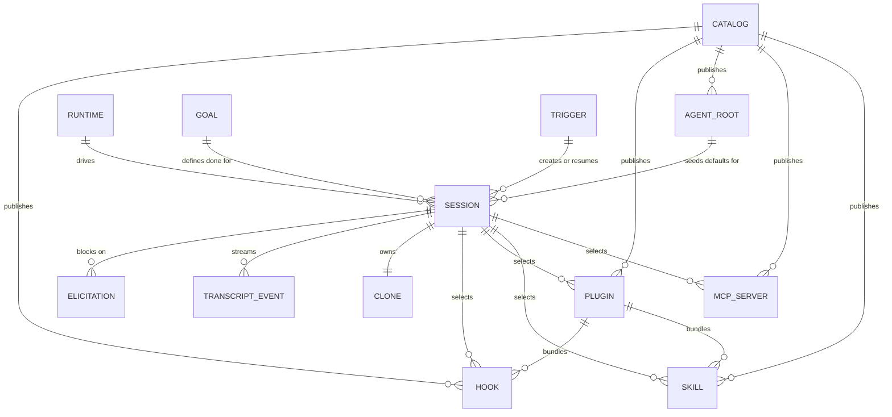

The nouns you need. Everything else on this site assumes these.

## The relationships

## Session

One task, one agent process, one git clone. The central row in the database and the thing the
whole UI is organized around. A session has a status (`waiting`, `running`, `needs_input`,
`failed`, `archived`), a prompt, a repo, a branch, a runtime, a goal, and lists of selected
skills / MCP servers / hooks / plugins.

Sessions are addressable by a numeric id or a slug, and the API resolves slug first.

→ [The session lifecycle](/sessions/lifecycle/)

## Agent root

A named bundle of domain context: which repo, which branch, which subdirectory, which runtime,
which model, which goal, and which artifacts are on by default. You pick a root when creating
a session and it seeds everything else.

Zimmer's own catalog ships eleven roots. `general-agent` is the catch-all default
(`AgentRootsConfig::DEFAULT_ROOT`); `zimmer` is the root for working on Zimmer itself;
`zimmer-router` is the not-user-invocable baseline that every quick-router / chat-bubble
submission is dispatched against. Four `catalog-mgmt-*` roots are *subagent* roots — not
user-invocable, spawned as phases by the `catalog-management` lead root.

→ [Agent roots](/air/agent-roots/)

## Runtime (agent harness)

Which CLI actually runs: `claude_code` or `codex`. Selected per session, defaulting from the
agent root, then the global setting, then `claude_code`.

The two behave differently in ways that leak: Claude accepts a `--session-id` you generate;
Codex mints its own. Claude reads `--mcp-config`; Codex reads `~/.codex/config.toml`. Claude
takes `--append-system-prompt`; Codex requires you to write into `AGENTS.md`.

→ [Adding an agent harness](/extend/agent-harness/)

## Goal

A stop condition attached to the session, chosen from `config/goals.json`. Four ship:
`codebase-question`, `open-reviewed-green-pr` (the default for most roots),
`open-reviewed-green-pr-with-version-bump`, and `e2e-verified-green-pr`.

A goal is appended to the prompt as text. It has no runtime enforcement.

→ [Goals and stop conditions](/sessions/goals/)

## Skill

A markdown procedure (`SKILL.md`) that the agent can invoke — "how to run the tests here,"
"how to deploy staging." Resolved from the catalog and copied into `.claude/skills/<id>/` in
the clone before the agent starts.

Zimmer's catalog ships five, all default-on for the `zimmer` root: `sync-docs`,
`zimmer-start-dev-server`, `zimmer-run-tests`, `zimmer-deploy-staging`,
`zimmer-change-ai-artifact`.

→ [Skills, plugins, hooks, references](/air/artifacts/)

## MCP server

A tool provider the agent can call, over stdio or HTTP. This is the session's blast
radius: the set of things the agent can do outside its own clone. Selected per session.

Fourteen ship in Zimmer's catalog; only `playwright-custom` is default-on for the `zimmer`
root.

→ [MCP servers](/air/mcp-servers/)

## Plugin

A bundle that composes existing skills, MCP servers, and hooks under one name. It is a
*macro*: at prepare time AIR expands it into its constituent skills, MCP servers, and hooks,
which then materialize through exactly the same code path as if you'd selected them directly.

## Hook

A lifecycle script registered into the agent's own settings (`.claude/settings.json`), fired
on agent events. Not to be confused with **transcript hooks**, which are a Ruby-side plugin
system that runs inside Zimmer when new transcript messages arrive.

→ [Transcript hooks](/extend/transcript-hooks/)

## Catalog

The versioned source of all of the above. Zimmer's catalog is the set of JSON indexes at the
repo root (`skills/skills.json`, `mcp.json`, `roots.json`, `plugins/plugins.json`,
`hooks/hooks.json`, `references/references.json`), wired together by `air.json` and resolved
by the AIR CLI.

→ [AIR: the mental model](/air/overview/)

## Trigger

A rule that creates or resumes a session when something happens. Three condition types:
`slack` (a message in a channel), `schedule` (cron or one-time), and `ao_event` (a session
transitioned to `needs_input` / `failed` / `archived`). Conditions on one trigger are ORed.

Triggers are also the backing store for an agent's own "wake me up later" and "wake me when
that other session finishes" tools.

→ [Triggers and schedules](/sessions/triggers/)

## Elicitation

An MCP server asking the *human* a question mid-session — "which environment should I deploy
to?" The agent process stays alive and blocked; the session flips to `needs_input`; a banner
appears in the UI; your answer is polled back by the MCP server.

Elicitations expire after 10 minutes.

→ [Elicitation](/sessions/elicitation/)

## Transcript

The agent's JSONL output file, polled off disk by the worker, normalized into the vendor-neutral
**OpenTranscripts v0.1** schema, and streamed to the UI over Turbo Streams. The whole raw file
is also persisted onto the session row.

→ [Transcripts](/sessions/transcripts/)
