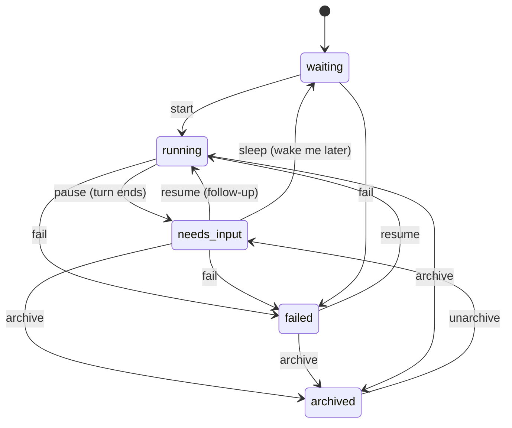

Zimmer is opinionated. Most of those opinions are load-bearing — you can see them in the
schema, in the state machine, in what the code refuses to do. This page is the argument
behind the architecture. If you read one page on this site, read this one.

## 0. The architecture is bounded on purpose

There is largely one way to do each thing: a session is [an isolated
clone](#1-a-session-is-its-own-isolated-clone), a session's context [comes from the
catalog](#6-context-is-resolved-from-a-catalog), the lifecycle is [one state
machine](#2-the-lifecycle-is-an-explicit-state-machine). That top level is meant to stay
stable, so by default you don't need to know how any of it is implemented — and when something
does go wrong, you drill down into a part you can name instead of into sprawl. The failure mode
this avoids is the usual one for a hand-rolled agent rig: a self-learning agent let loose on a
machine, layers of glue nobody understands, regular breakages, and no road back.

The eight opinions below are where that boundary is enforced. They read as constraints rather
than features because that is what they are.

## 1. A session is its own isolated clone

The unit of work in Zimmer is a **session**: one task, one agent process, one git clone on
disk, entirely its own.

This sounds like an implementation detail. It is the constraint that makes
everything else possible. If agents shared a working tree, running two at once would mean
one agent's uncommitted changes appearing in the other's `git status`, two agents fighting
over the same branch, and a failure in one poisoning the other. Concurrency would be a
liability.

So Zimmer gives every session its own clone under `~/.zimmer/clones/`. Ten
sessions on the same repository are ten directories. They cannot see each other. An agent
that goes badly wrong destroys exactly one clone, and the blast radius stops there.

The cost is disk and clone time, and Zimmer pays it deliberately. The clone is also what
lets a session be *resumed*: the agent's transcript, its `.mcp.json`, its injected skills,
and its git state all live in that directory, so picking a session back up two days later
is a matter of re-spawning a process against a directory that still exists.

The Kamal deploy backs this with a durable named volume (`zimmer_data`) mounted at `~/.zimmer`
on both the `web` and `worker` roles, so clones survive a container recreate and a deploy.

## 2. The lifecycle is an explicit state machine

An agent does not get to decide it is "done." It gets to *stop*, and stopping means a
specific transition in an explicit state machine.

Five states, enforced by AASM in `app/models/concerns/session_state_machine.rb`. Every
transition has guards and side effects, and the side effects are the interesting part:
`pause` cleans up the running job, fires event triggers, and schedules a debounced push
notification. `archive` sets a trash expiry and schedules clone cleanup. `fail` preserves
debug state.

The philosophical point: the orchestrator owns the transitions, and the agent only feeds them inputs. A
process exiting is an *input* to the state machine; the machine decides the transition. That's what makes
it possible to build triggers, notifications, health monitoring, and recovery on top —
they all key off states, and states are real.

See [the session lifecycle](/sessions/lifecycle/) for every event, guard, and callback.

## 3. Closed-loop autonomy: "done" means verified

The most common way an agent wastes your time is finishing confidently. It writes the code,
declares victory, and hands back something that doesn't compile.

Zimmer's answer is the **goal** — a stop condition attached to the session that defines what
"done" actually requires. The default goal for most agent roots is `open-reviewed-green-pr`,
and it means, in full: open a PR, wait for CI, confirm CI is green, run an independent
fresh-eyes review, address every piece of that review's feedback, re-run CI, and *only then*
come back to the human.

The loop closes on external reality: a CI run or a review. The agent's own say-so doesn't count.

:::caution[A goal is prompt text and nothing more]
This is worth being blunt about. `AgentSessionJob#build_prompt_with_goal` looks the goal up
in `config/goals.json` and appends its description to the prompt string. That is the
entire mechanism. There is no runtime enforcement: nothing checks that CI actually went
green before the session pauses, and nothing stops an agent from declaring victory anyway.
The stop condition is enforced only by the model choosing to obey English.
See [Goals and stop conditions](/sessions/goals/).
:::

## 4. MCP servers are the session's permission boundary

The tools an agent has are the things it can do to the world. An agent with a Slack MCP
server can post to Slack. An agent with a DigitalOcean MCP server can delete a droplet.

So Zimmer treats the MCP server list as the session's blast radius, and makes it a
per-session decision instead of a global one. Two sessions in the same repository can have
completely different tool sets, and the session that only needs to read code gets nothing
that can write to production.

This is why MCP servers are configured per-session and per-agent-root, so the tool set is scoped to the task. The question "what can this agent break?" should have an answer
you can look up, and that answer should be different for different tasks.

The corollary is that credentials follow the tools. MCP servers that need OAuth get
their own credential records, their own refresh loop, and their own injection step at spawn
time. A session doesn't have your GitHub token because you have a GitHub token; it has it
because it has an MCP server that needs one. See [MCP server OAuth](/auth/mcp-oauth/).

## 5. Agent roots are the answer to "what does this agent need to know?"

An **agent root** is a named bundle of domain context: which repository, which branch, which
subdirectory it's scoped to, which skills it gets by default, which MCP servers, which
runtime, which goal.

The insight is that most of what an agent needs to know about a codebase is *stable*. It
doesn't change per task. "This is a Rails app, run tests with `bin/rails test`, lint with
`bin/rubocop`, work on a feature branch, don't merge your own PR" is true every single time.
Making the human re-explain it every time is a tax, and making the agent re-derive it every
time is worse — it will get it wrong sometimes.

So a root is that context, named, versioned, and reusable. You pick a root; the root brings
its context; you supply only the thing that's actually specific to *this* task.

Roots also compose: a root can declare *subagent roots*, which is how Zimmer's own
`catalog-management` root fans work out to four specialized phases (research, configs,
proctor, save). See [Agent roots](/air/agent-roots/).

## 6. Context is resolved from a catalog

Here is the design decision most people get wrong.

The naive approach: hard-code the skills and MCP servers into the orchestrator, or let each
user hand-wire them in a settings page. Both fail the same way. Agent context is *content*:
it changes as often as your codebase does, and content that lives in an app's database or
an app's source tree can't be reviewed, diffed, branched, or shared.

So Zimmer doesn't own its agent context. It resolves it from a catalog, using
[AIR](/air/overview/) — a separate open-source project whose entire job is turning
version-controlled JSON indexes into a prepared session directory.

What this buys:

- **Agent context is a pull request.** Adding a skill is a diff. Reviewing it is a code
  review. Rolling it back is a revert.
- **The orchestrator stays generic.** Zimmer's code never names a skill. It asks the catalog
  what exists and injects what the session selected.
- **The same catalog can serve other agents.** AIR has adapters for Claude Code, Codex,
  Cursor, and others. The catalog is agent-shaped, so any of them can use it.
- **Composable artifacts.** Each artifact declares which roots it's default-on in via
  `default_in_roots`, so adding a skill to a root is a one-line edit in the *skill's* own entry.

The cost is a hard dependency on an external CLI and an extra failure mode: a catalog that
fails to resolve takes down all session creation at once. Zimmer takes
that seriously enough to keep a last-known-good snapshot in the database and degrade to it.
See [How Zimmer consumes AIR](/air/zimmer-integration/).

## 7. The pull request is the review gate

Zimmer agents do not merge their own work. Ever. The goal descriptions say so explicitly,
and the operating principles injected into every session's system prompt say so again.

This is about where the human's attention is
scarcest and most valuable. You do not want to be watching an agent type. You *do* want to
look at a finished, CI-green, self-reviewed diff and decide whether it should exist. The PR
is the artifact designed for exactly that, and every code review tool in the world already
knows how to render one.

So the agent's job ends at "open a PR and prove it's green." The human's job starts there.

The same instinct shows up in the session list: a session sitting in `needs_input` is on
your homepage, and it stays there until you deal with it. `needs_input` is a to-do list, and
agents are told not to archive themselves out of it when a human still needs to read
something.

## 8. Be honest about what's broken

The last opinion is about these docs.

Zimmer is a young single-operator tool with real rough edges: an unauthenticated admin panel
that displays OAuth tokens in plaintext, a Terraform stack that provisions no background job
worker, credential-key algorithms that are string-for-string copies of another vendor's
private internals. Those are all documented here, on the page where they bite and on the
[Known limitations](/limitations/) page.

These docs name the broken parts on purpose. The premise of this one is that you can read it
instead of reading the code, which only works if it tells you the same things the code would.
