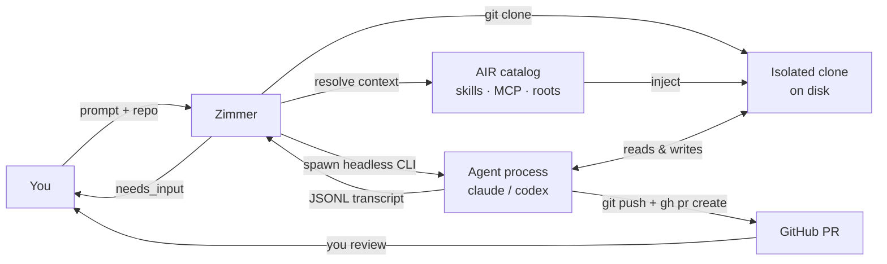

Zimmer is a Rails 8 application that runs AI coding agents for you. You give it a task
and a repository; it clones the repo, wires up the agent's context, spawns a real headless
Claude Code or Codex process, watches it work, and hands you back a pull request — or a
specific question about why it couldn't finish.

It is self-hostable and single-operator. There is no multi-tenancy, no user accounts,
and no login screen. You run it on a box you control, on a network you control, and it is
yours.

## The shape of the thing

## What makes it different from running `claude` in a terminal

Running a coding agent by hand works fine for one task at a time, while you watch. Zimmer
exists for the case where that stops being true:

It survives you closing the laptop. A session is a database row and a supervised
subprocess. It keeps running when you walk away, and it is still
there when you come back — with its full transcript, its state, and its next question.

It runs many at once. Sessions are isolated clones on disk. Ten agents can be working
on ten branches of the same repository, and none of them can see or stomp on each other's
working tree.

It has a lifecycle. Every session is in exactly one of five states,
and the transitions between them are enforced by a state machine. See [the session lifecycle](/sessions/lifecycle/).

It wires the context deliberately. Which skills, which MCP servers, and which repo-specific
guidance the agent gets is resolved from a versioned catalog per session. See [AIR](/air/overview/).

It closes the loop. The default goal spells out what "done" requires: open a PR, wait for
CI, confirm CI is green, run a review, address the review, and only then come back to the
human. See [goals](/sessions/goals/).

## What it is not

It is not a hosted product. There is no SaaS. You provision a DigitalOcean droplet, or
you run it locally.

It is not secured for the open internet. This is important enough that it has its own
[known limitation](/limitations/#the-web-ui-has-no-login-by-design-and-the-sharp-edge-that-follows): the entire web
UI, including the admin panel that displays OAuth tokens, has no authentication of any
kind. The security model is "put it behind Tailscale," and Zimmer's own Terraform does
exactly that — port 80 is closed at the DigitalOcean firewall and the app is reachable only
over the tailnet.

It is not an agent. Zimmer doesn't write code. Claude Code and Codex write the code.
Zimmer decides what context they get, when they run, when they stop, and what happens to
their output.

It is not AIR. [AIR](/air/overview/) is a separate open-source project
([`github.com/pulsemcp/air`](https://github.com/pulsemcp/air)) that Zimmer depends on to
resolve agent context from a catalog. Zimmer shells out to AIR's CLI; it does not vendor or
reimplement it.

## The stack, in one breath

Rails 8 on Ruby 3.4.6. PostgreSQL for everything (including Action Cable, via `solid_cable`
on a second database). Redis for the cache. GoodJob for background jobs and cron. Hotwire
(Turbo + Stimulus) for the UI, so the session timeline streams in without a SPA. Tailwind
for styling. Agent processes are real OS subprocesses, spawned and reaped by Zimmer.

Next: [the philosophy](/intro/philosophy/) — the opinions that shaped all of the above.
