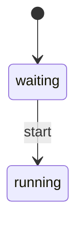

This site lives in **`docs/`** in the [`tadasant/zimmer`](https://github.com/tadasant/zimmer)
repository. It is an [Astro Starlight](https://starlight.astro.build/) site, deployed to **Cloudflare
Pages**.

## Brand and voice

Before you write, read the two references that govern all of Zimmer's user-facing prose. They live in
the repo at `references/` and travel with the `sync-docs` skill:

- **`references/BRAND.md`** — what Zimmer is and who it's for. The short version: self-hostable,
  open-source, standards-driven orchestration for a *single circle of trust* (one person, a couple, or
  partners — not teams or enterprise). The human stays in control; Zimmer handles the toil. Frame the
  trust model as intent, not apology.
- **`references/BRAND_VOICE.md`** — how Zimmer sounds: plain, direct, specific, honest, and free of the
  AI-slop tells (the "not X, it's Y" reflex, em-dash overload, bold sprinkling, hype adjectives). Read
  it aloud; if it sounds like a brochure, cut until it doesn't.

Every page on this site should pass both. When you edit one, keep it in voice.

## The rule

:::tip[Update the docs in the same PR as the behavior change]
This is the whole premise. The site is only worth reading *instead of* the code if it's true, and it's
only ever true if it's updated in lockstep.

If your PR changes behavior, find the page that describes that behavior and change it too. If your PR
introduces a limitation, a hack, or a known-broken edge, add it to
[Known limitations](/limitations/) — that page exists to record the sharp edges.

`AGENTS.md` / `CLAUDE.md` carry a short version of this rule for agents working in the repo.
:::

The content structure deliberately mirrors the code structure, so "which page describes this?" usually
has an obvious answer:

| You changed… | Update… |
| --- | --- |
| `app/models/concerns/session_state_machine.rb` | [The session lifecycle](/sessions/lifecycle/) |
| `app/jobs/agent_session_job.rb`, the CLI adapters | [Spawning and monitoring](/sessions/spawning/) |
| `config/routes.rb`, `app/controllers/api/**` | [The REST API](/extend/rest-api/) — and `app/views/api_docs/show.html.erb` |
| `air.json`, `roots.json`, `mcp.json`, `skills/`, `plugins/`, `hooks/` | The [AIR section](/air/overview/) |
| `RuntimeRegistry`, a new runtime | [Adding an agent harness](/extend/agent-harness/) |
| `app/extensions/**` | [Extensions](/extend/extensions/) |
| OAuth, `ClaudeAccount`, `McpOauthCredential` | The [Auth section](/auth/overview/) |
| `infra/`, `.github/workflows/**`, `Dockerfile*` | [Deploying](/operate/deploying/), [Provisioning](/operate/provisioning/) |
| `config/goals.json` | [Goals and stop conditions](/sessions/goals/) |
| Any cron job | [Background jobs](/operate/background-jobs/) |

The `sync-docs` skill (default-on for the `zimmer` root) runs this check as a pre-PR step.

## Running it locally

```bash
cd docs
npm install
npm run dev        # → http://localhost:4321
```

```bash
npm run build      # astro check && astro build → docs/dist/
npm run preview    # serve the built output
```

The `docs_site` job in `.github/workflows/ci.yml` runs `npm ci && npm run build` on every PR, so a
broken link, a bad frontmatter field, or a type error fails CI. The site cannot silently rot.

## Diagrams

Write a fenced `mermaid` block in any `.md` or `.mdx` page:

````markdown

````

A remark plugin (`src/plugins/remark-mermaid.mjs`) swaps the fence for a placeholder before Expressive
Code can claim it, and a client script in `src/components/Head.astro` renders it with Mermaid in the
browser, **re-rendering on light/dark toggle**.

:::note[Why the diagrams render in the browser]
Prerendering with `rehype-mermaid` would need a headless Chromium in CI and would still bake in a single
colour scheme. Rendering in the browser costs a JS payload but lets a diagram follow the reader's theme.
Both are defensible; this one was chosen for CI simplicity and correct dark mode.
:::

Diagrams should be accurate to the code, not illustrative. If you change the state machine, change
the state diagram.

## Callouts

Use Starlight's asides, and use them for the honest parts:

```markdown
:::caution[This is brittle because…]
:::danger[This is actively broken]
:::note[Unclear / needs confirmation]
```

The `:::note[Unclear / needs confirmation]` form is deliberate — a visible "we don't know" is more
useful than a confident guess, and it's an issue waiting to be filed.

## Deploying

The site is not yet provisioned. Committing the build config is one step; creating the Cloudflare
Pages project is another, and it needs a human with Cloudflare access.

**To deploy it the first time:**

1. Cloudflare Dashboard → **Workers & Pages** → **Create** → **Pages** → **Connect to Git** → pick
   `tadasant/zimmer`.
2. Configure the build:
   - **Framework preset:** Astro
   - **Root directory:** `docs`
   - **Build command:** `npm ci && npm run build`
   - **Build output directory:** `dist`
   - **Environment variable:** `SITE_URL` = the final public URL (see below)
3. Deploy. Cloudflare gives you a `*.pages.dev` URL immediately.
4. **Custom domain:** Pages → Custom domains → add `docs.zimmer.tadasant.com`. Cloudflare already hosts the
   `tadasant.com` zone, so it will create the CNAME for you.
5. Update `site` in `docs/astro.config.mjs` if you pick a different hostname.

Every subsequent push to `main` redeploys automatically, and every PR gets a preview URL.

:::caution[This site is public; Zimmer is not]
The Zimmer app is tailnet-only by design. This documentation site is a static, public artifact — it
contains no secrets, but it *does* candidly describe Zimmer's security posture (including
[that it has no authentication](/limitations/#the-web-ui-has-no-login-by-design-and-the-sharp-edge-that-follows)).

That's a deliberate trade: the information is already in a public repository, and an operator who
doesn't know their admin panel is unauthenticated is in more danger than one who does. If you'd rather
it weren't public, put Cloudflare Access in front of the Pages project.
:::

## Structure

```
docs/
├── astro.config.mjs          # site config + sidebar
├── package.json
├── public/
│   ├── favicon.svg
│   └── mcp.schema.json       # served at /mcp.schema.json
└── src/
    ├── assets/               # logo
    ├── components/Head.astro # the Mermaid client renderer
    ├── content/docs/**/*.md  # every page
    ├── plugins/remark-mermaid.mjs
    └── styles/custom.css
```

Adding a page means creating the markdown file **and** adding it to the `sidebar` array in
`astro.config.mjs`. Starlight won't auto-discover it into the nav.
