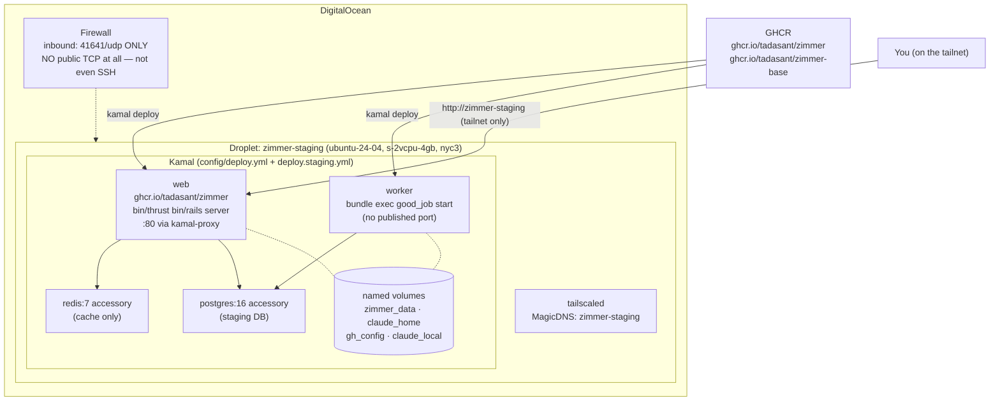
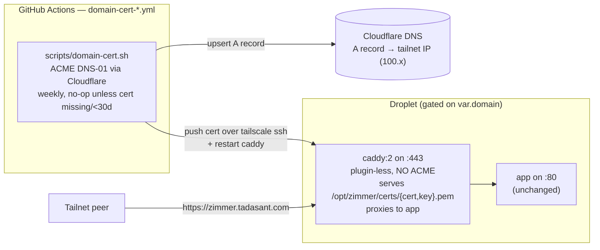

Zimmer deploys with [Kamal](https://kamal-deploy.org/) onto a single DigitalOcean droplet, reachable
only over Tailscale. Terraform bootstraps the box (Docker, Tailscale, Caddy, the deploy key); Kamal
owns the app stack — a `web` role and a `worker` role, with durable named volumes. There is no
Kubernetes, no load balancer, and no HA. TLS is optional and off by default — setting `var.domain`
adds a tailnet-only HTTPS front door (see [below](#custom-domain-https-over-the-tailnet)).

These docs cover the **staging** deployment, which is the one this repo operates. A production
deployment is self-hosted and lives in your own private infrastructure — the `config/deploy.yml` /
`config/deploy.production.yml` and `.kamal/secrets.production` here are public-safe templates, but the
production environment (its DNS, its database, its secrets, and the workflow that drives it) is out of
scope for these docs.

## The topology



By default there is no TLS. The web container serves plain HTTP on :80 behind kamal-proxy, and
`production.rb` sets `assume_ssl` and `force_ssl`, which works *only* because `assume_ssl` makes Rails
pretend the request arrived over TLS. The actual encryption is WireGuard, via Tailscale. A future
*public* ingress would break this subtly and badly.

Setting `var.domain` adds a real HTTPS front door (see below), still tailnet-only, which makes
`assume_ssl` true in reality.

## Custom-domain HTTPS over the tailnet

Plain HTTP with `assume_ssl` is a known sharp edge: because Rails computes `https://` origins that
never match the browser's `http://`, every CSRF-protected form POST 422s and every ActionCable upgrade
is rejected. Setting `var.domain` (e.g. `zimmer.tadasant.com`) fixes this class at the source by putting
a genuine cert on a custom name — while staying reachable only over the tailnet.

The trick is that TLS behind a tailnet is awkward: the firewall opens no public 80/443, so ACME
HTTP-01/TLS-ALPN-01 can't work — only DNS-01 can. On-box renewal would mean parking a Cloudflare token
on the droplet, so the work is split so the box holds no DNS credential:



- **On the droplet** (`cloud-init.yaml.tftpl`, only when `var.domain` is set): a stock, plugin-less
  `caddy:2` container on `:443` that does no ACME. It serves the cert files at
  `/opt/zimmer/certs/{cert,key}.pem` and reverse-proxies to the app. The app keeps publishing `:80`, so
  the MagicDNS `http://…` path is unchanged and a Caddy misconfig can't take the box down. A self-signed
  placeholder is written at boot so Caddy can start before the real cert arrives.
- **In CI** (`scripts/domain-cert.sh`, run by `domain-cert-staging.yml`): discovers the droplet's tailnet
  IP, upserts a Cloudflare `domain → tailnet IP (100.x)` A record, issues/renews the Let's Encrypt cert
  via ACME DNS-01 through Cloudflare, pushes only the cert onto the box over `tailscale ssh`, and
  restarts Caddy (the Caddyfile sets `admin off`, so there's no live-reload endpoint — a restart re-reads
  the bind-mounted files). The Cloudflare token lives only in GitHub Actions.

The A record points at the **tailnet IP**, so tailnet peers resolve and reach it while everyone else
gets an unroutable address — same tailnet-only exposure as the MagicDNS name, now with a real cert.

:::note[Turning it on]
Mint a Cloudflare API token scoped to `Zone:DNS:Edit + Zone:Zone:Read` on the parent zone only, add it
as the `CLOUDFLARE_API_TOKEN` Actions secret (on staging → `tadasant/zimmer`; on production →
your private production repo), set `domain` in the environment's tfvars, deploy, then run the
`domain-cert-*` workflow once (`workflow_dispatch`) to issue the first cert. The weekly schedule renews
thereafter — a no-op unless the cert is missing, self-signed, wrong-name, or within 30 days of expiry, so
it issues only ~every 60 days. `domain=""` renders byte-identically to the plain-HTTP setup, so existing
deployments are unaffected.
:::

:::caution[Certs persist across image upgrades; a droplet replacement drops them]
Certs live in a host directory, so they persist across image auto-upgrades (container recreate). A
droplet **replacement** (a fresh `provision`) drops them; the next `domain-cert-*` run re-registers the A
record and re-issues.
:::

## Background jobs and durable state

`config/environments/production.rb` sets `good_job.execution_mode = :external`, which requires a
separate `bundle exec good_job start` process. Kamal runs exactly that as a dedicated **`worker`**
role (`config/deploy.staging.yml`), alongside the `web` role — so cron, pollers, orphan cleanup,
token refresh, and catalog refresh all run. The deploy workflow asserts the worker container is up
before it reports success.

Both roles mount the same durable named volumes, so state survives a deploy and a container recreate:

- `zimmer_data` → `/home/rails/.zimmer` — the clones (`~/.zimmer/clones`) and scratch.
- `claude_home` → `~/.claude` — the shared credentials file the entire
  [account-rotation system](/auth/harness/) hinges on.
- `gh_config` → `~/.config/gh` — the GitHub CLI's auth.
- `claude_local` → `~/.local` — where `bin/docker-entrypoint`'s background `claude update` writes.
- The `worker` role additionally mounts `/var/run/docker.sock`, which `DockerCleanupJob` needs.

## The Docker images

**`Dockerfile.base` → `ghcr.io/tadasant/zimmer-base`** — the heavy one, rebuilt monthly (cron
`0 6 1 * *`) or on demand. From `ruby:3.4.6-slim`, it bakes in:

- Gems, pre-bundled to `/usr/local/bundle` with bootsnap precompiled
- Node.js 22, the Docker CLI, `gh`, the 1Password CLI, `uv`/`uvx`
- Playwright + Chromium and Puppeteer + Chrome (for browser-automation MCP servers)
- The npm and Python MCP packages listed in `mcp.json` (`bin/preinstall-mcp-packages`)
- The AIR CLI `@pulsemcp/air-cli@0.13.0` + adapters → `/opt/air-cli`
- The Codex CLI `@openai/codex@0.135.0` and Claude Code (via `claude.ai/install.sh`)

**`Dockerfile` → `ghcr.io/tadasant/zimmer`** — the app image. Copies the app onto the base, re-runs
`bundle install` (which catches Gemfile drift against the base), precompiles assets, drops to
`USER 1000:1000`, and runs `bin/thrust bin/rails server`.

:::caution[The AIR CLI version is pinned in two places]
`Dockerfile.base` bakes `@pulsemcp/air-cli@0.13.0`, and `AirPrepareService::AIR_CLI_VERSION` must
match. Nothing enforces that they agree. If they drift, the pre-baked CLI is ignored and every
worker `npm install`s a different version at runtime.
:::

:::caution[`bin/docker-entrypoint` backgrounds `claude update`]
It also backgrounds the Playwright browser install. Sessions started in the first ~30 seconds after a
container boot silently run the old CLI and the old Chromium.
:::

## The workflows

Every workflow but one runs on **`runs-on: self-hosted`** — a shared self-hosted
runner pool that this repo registers against, so its CI stays off the GitHub-hosted
Actions minute quota. If you fork Zimmer you would point these at your own runners
(or switch the jobs back to `ubuntu-latest`).
See [Running on the shared self-hosted runner](#running-on-the-shared-self-hosted-runner)
for what that requires of a Rails job.

The exception is `alert-ci-failure.yml`, which runs on `ubuntu-latest` on purpose: an
alert that needs a healthy self-hosted runner in order to tell you the self-hosted
runners are unhealthy is no alert at all. That buys less than it sounds like — it covers
a *degraded* pool, where jobs run and fail, but not a pool that is flat **offline**, in
which case runs simply queue (see [CI failure alerts](#ci-failure-alerts)).

| Workflow | Trigger | What it does |
| --- | --- | --- |
| `ci.yml` | PR + push to main | rubocop · brakeman · `Gemfile.lock` freshness · `test-unit` (Postgres + Redis services) · GHCR-retention logic · docs site build. Jobs are guarded to run only on `push` and on same-repo PRs, so a fork PR never executes on the self-hosted runners. |
| `pr-auto-close.yml` | outside PR opened/reopened | Zimmer does not accept pull requests: this politely comments and closes PRs from forks and non-members (owner/member/collaborator PRs are left open), pointing them at the issue tracker. Runs on GitHub-hosted `ubuntu-latest`, never the self-hosted pool. |
| `alert-ci-failure.yml` | any other workflow completing + manual | posts to #alerts in Slack when a workflow **fails on `main`**. See [CI failure alerts](#ci-failure-alerts) |
| `release-image.yml` | push to main (ignores `**/*.md`, `docs/**`) | builds and pushes `zimmer:{version, latest, sha-…}` |
| `build-base-image.yml` | manual + monthly cron | rebuilds the base image |
| `deploy-staging.yml` | manual only | see below |
| `teardown-staging.yml` | manual only | `terraform destroy` of the staging droplet. No longer runs nightly — staging is persistent now (see below). Run it when you deliberately want to stop paying for the box; a powered-off droplet still bills, so destroying is the only way to stop the charge. |
| `ghcr-retention.yml` | weekly cron | prunes GHCR to ≤50 versions |
| `domain-cert-staging.yml` | weekly cron + manual | issues/renews the Let's Encrypt cert for `var.domain` via ACME DNS-01 and pushes it to the droplet (see [Custom-domain HTTPS](#custom-domain-https-over-the-tailnet)) |

### CI failure alerts

When **any** workflow in this repo fails on `main`, `alert-ci-failure.yml` posts the
repo, the workflow, the commit subject, the author and a link to the run into **#alerts**
in the Tadasant Slack workspace. Any of your other repos can carry the identical
listener under the identical secret names; if so, keep them symmetric and change them
together.

It listens with `workflows: ["*"]`, which matches every workflow in the repo — so a
workflow added later is covered the day it lands, with nobody having to remember to wire
it up.

It needs two repo secrets — `SLACK_BOT_TOKEN` and `SLACK_ALERTS_CHANNEL_ID`
([Provisioning and secrets](/operate/provisioning/#slack-ci-failure-alerts)). Without
them it logs a warning and exits 0: a missing alert secret must not turn into a second
red X on `main`. With them, a Slack rejection *does* fail the job, because a rejected
alert is a silently broken alert and this is the only place it can surface.

Three details worth knowing before you touch it:

- It fires on an **allowlist** of conclusions — `failure`, `startup_failure`,
  `timed_out` — never on "not success". `ci.yml` sets `cancel-in-progress`, so two
  pushes to `main` in quick succession cancel the first run, and a *cancelled* run must
  not page anyone. The corollary is that a run which never starts is never alerted on:
  if the self-hosted pool is offline, main-branch runs **queue**, and GitHub cancels
  them after ~24h as `cancelled`, which is indistinguishable from a deliberate cancel
  ([Limitations](/limitations/#a-queued-run-that-never-starts-is-never-alerted-on)).
- `["*"]` matches the alert **itself**, and `workflow_run` chains several levels deep, so
  the job excludes itself by comparing against the literal name `'CI failure alert'`.
  **Rename the workflow and you must update that literal**, or it starts alerting on its
  own runs ([Limitations](/limitations/#the-ci-failure-alert-cant-be-exercised-from-a-pr)).
- `workflow_run` only ever triggers from the copy of the file on the **default branch**,
  so editing it on a PR branch changes nothing until it merges. To prove Slack delivery
  works, run the workflow's `workflow_dispatch` trigger by hand — it posts a smoke-test
  message instead of an alert.

### Running on the shared self-hosted runner

The runner box is shared across several repos, so a job cannot assume it has the
machine to itself. Four things follow, and every Rails job in `ci.yml` already does
them:

- **`ruby/setup-ruby` gets `self-hosted: true` and `bundler-cache: false`.**
  `self-hosted: true` selects the Ruby already staged in
  each runner's own `$RUNNER_TOOL_CACHE` instead of downloading one — the action's
  download path extracts into a hardcoded `/opt/hostedtoolcache` the runner user can't
  write, so on this box the flag is mandatory, not optional. `bundler-cache: false`
  turns off the action's automatic `bundle install`, because we do it ourselves into
  an isolated path (below).

  :::caution[Runner toolcache seeding]
  The `tadasant-zimmer-ci-*` runners were registered with a Node toolcache but **no
  Ruby one**, so their Ruby 3.4.6 toolcache had to be seeded out of band (`ruby-build
  3.4.6` into `/opt/hostedtoolcache-runner-N/Ruby/3.4.6/x64`). That manual seed is not
  yet captured in IaC and will be lost if the runners are rebuilt — codifying it is
  part of the DigitalOcean migration ([zimmer#118](https://github.com/tadasant/zimmer/issues/118)).
  :::
- **Gems install into a per-runner path.** `bundle config set --local path
  /home/runner/.bundles/zimmer-runner-${RUNNER_NUM}` (with `RUNNER_NUM` derived from
  `$RUNNER_NAME`) keeps two concurrent jobs on the same box from fighting over one
  `vendor/bundle`.
- **Service containers publish dynamic ports.** Postgres and Redis declare
  `- 5432/tcp` / `- 6379/tcp` (not `5432:5432`), and a step resolves the assigned
  host port via `${{ job.services.postgres.ports[5432] }}` into `DATABASE_PORT` /
  `REDIS_URL`. Fixed host ports would collide when two jobs land on the same runner.
- **The heavy suite is the `test-unit` job key and pins `PARALLEL_WORKERS`.** The
  runner's file-based semaphore recognizes the job **key** `test-unit` and caps how
  many heavy test jobs run at once; a bare `test` key would go ungated. Pinning
  `PARALLEL_WORKERS` stops a single job from fanning out to `:number_of_processors`
  (32 on this box) and starving co-tenants. There is intentionally no `test-system`
  job — zimmer runs no Chrome-driven system tests in CI, so there is nothing for the
  companion system-test semaphore to gate.

### Staging deploys are Kamal container swaps onto a persistent droplet

The droplet is no longer cattle. Terraform provisions it **once** and then leaves it alone; Kamal
deploys the app onto it. `deploy-staging.yml`:

1. Builds the base image (`:staging`) and app image (`:staging-<sha>`).
2. `terraform apply` — reconciles the **existing** droplet through remote state. It does not reap
   anything, and a re-run updates in place rather than recreating.
3. Joins the tailnet, resolves `zimmer-staging`'s peer IP from `tailscale status --json`, and loads
   the Kamal deploy key.
4. `kamal deploy -d staging --version=<tag> --skip-push`. kamal-proxy boots the new container
   alongside the old one, health-checks it on `/up`, and only then flips traffic. A container that
   never goes healthy leaves the old one serving.
5. Re-verifies `/up` over the tailnet and asserts the **worker** container is running too — the
   worker is where agent sessions actually execute.

Two things follow from this that did not used to be true:

- **Rollback is one command.** `kamal rollback <version> -d staging` (the host retains the last 5
  images).
- **State survives a deploy.** `web` and `worker` share durable named volumes (`zimmer_data`,
  `claude_home`, `gh_config`, `claude_local`), which are re-attached to each new container instead of
  being destroyed with the droplet.

### What changed, and why

The old flow re-rendered the whole app stack into cloud-init's `user_data` — a **replace-forcing**
attribute on `digitalocean_droplet`. Any change to the image or an env var therefore destroyed and
rebuilt the droplet (and everything on its disk). Combined with ephemeral Terraform state, which
forced the workflow to hand-reap the droplet and firewall through the DigitalOcean API before every
`apply`, staging was torn down and rebuilt constantly.

Now: the app stack lives in Kamal (`config/deploy.*.yml`), `user_data` is only a bootstrap, and the
droplet carries `lifecycle { ignore_changes = [user_data] }` (deliberately *not*
`create_before_destroy` — the tailnet hostname is fixed). A config or app change can no longer replace
the box. The cost of freezing `user_data` is that the deploy key and Caddyfile can't be updated in
place — see [Known limitations](/limitations/#user_data-is-frozen-so-the-deploy-key-and-the-caddyfile-cant-be-updated-in-place).

## Terraform, briefly

```bash
cd infra/terraform
cp staging.tfvars.example staging.tfvars
export TF_VAR_do_token=… TF_VAR_tailscale_auth_key=… TF_VAR_deploy_ssh_pubkey="$(cat ~/.ssh/kamal.pub)"
export AWS_ACCESS_KEY_ID=… AWS_SECRET_ACCESS_KEY=…   # DO Spaces keys, for the state backend
terraform init -input=false -backend-config=backend.staging.hcl
terraform apply -input=false -auto-approve -var-file=staging.tfvars
```

Creates: the droplet, the firewall, and a reserved IP (a stable public address across rebuilds).
`manage_project` stays **`false`** by default — a project name is account-unique and a pre-existing
one 409s, so a DO Project (just a console folder) isn't worth the failure mode; flip it on with a
one-time `terraform import` if you want one.

Terraform no longer knows anything about the app: no image ref, no secrets, no database wiring. Those
are Kamal's. It also does **not** create a DNS record — when `var.domain` is set, the `domain-cert`
workflow owns the A record (pointing at the tailnet IP), which keeps the Cloudflare credential out of
Terraform.

Staging runs a Postgres accessory container on the droplet, wired by Kamal — nothing external to
provision. A self-hosted production deployment would instead point at its own database (Terraform can
reference one as a read-only data source rather than creating it), but that lives in your own private
infrastructure, not here.

→ [Provisioning and secrets](/operate/provisioning/)
