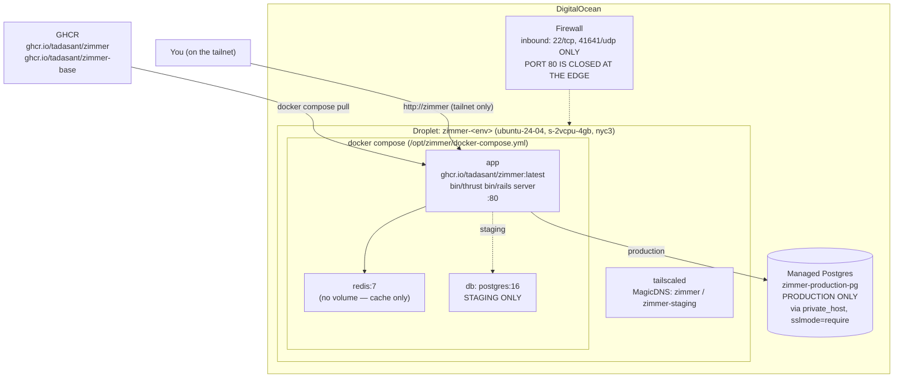

Zimmer deploys to a **single DigitalOcean droplet** running Docker Compose, reachable **only over
Tailscale**. There is no Kubernetes, no load balancer, no TLS terminator, and no HA.

## The topology



**There is no TLS anywhere.** The app container serves plain HTTP on :80. `production.rb` sets
`assume_ssl` and `force_ssl`, which works *only* because `assume_ssl` makes Rails pretend the request
arrived over TLS. The actual encryption is WireGuard, via Tailscale. A future public ingress would
break this subtly and badly.

**Supervision** is dockerd + `restart: always`. That's the whole story.

## The two gaps that will bite you

:::danger[1. No job worker]
`config/environments/production.rb` sets `good_job.execution_mode = :external` — meaning a separate
`bundle exec good_job start` process is required.

`infra/terraform/cloud-init.yaml.tftpl` renders three services: `app`, `redis`, and (staging only)
`db`. **There is no worker service and no `good_job start` anywhere in `infra/`, the Dockerfile, or the
workflows.**

On a droplet provisioned by this repo's Terraform, **no background job ever executes**. Sessions
enqueue and sit there forever. No cron fires — no orphan cleanup, no heartbeat sweep, no GitHub or
Slack pollers, no token refresh, no catalog refresh.

The staging health check only curls `/up`, so it passes anyway.

Production presumably runs a different compose file from the author's private `tadasant-internal` repo.
**The IaC in this repo is incomplete on this axis.**
:::

:::danger[2. No durable volumes]
The `app` service mounts **nothing**. Not:

- `/home/rails/.agent-orchestrator` — the clones. `app/services/clones_directory.rb` claims durability
  comes from a named volume mounted per `config/deploy.production.yml`. **That file does not exist in
  this repo.**
- `~/.claude` — the shared credentials file the entire
  [account-rotation system](/auth/harness/) hinges on.
- `~/.config/gh` — the GitHub CLI's auth.
- `~/.local` — where `bin/docker-entrypoint`'s background `claude update` writes.
- `/var/run/docker.sock` — despite the Docker CLI being baked into the base image and
  `DockerCleanupJob` depending on it.

Everything above lives in the container's writable layer and dies with the container. A routine deploy
wipes every clone.
:::

## The Docker images

**`Dockerfile.base` → `ghcr.io/tadasant/zimmer-base`** — the heavy one, rebuilt monthly (cron
`0 6 1 * *`) or on demand. From `ruby:3.4.6-slim`, it bakes in:

- Gems, pre-bundled to `/usr/local/bundle` with bootsnap precompiled
- Node.js 22, the Docker CLI, `gh`, the 1Password CLI, `uv`/`uvx`
- **Playwright + Chromium** and **Puppeteer + Chrome** (for browser-automation MCP servers)
- The npm and Python MCP packages listed in `mcp.json` (`bin/preinstall-mcp-packages`)
- **The AIR CLI** `@pulsemcp/air-cli@0.13.0` + adapters → `/opt/air-cli`
- **The Codex CLI** `@openai/codex@0.135.0` and **Claude Code** (via `claude.ai/install.sh`)

**`Dockerfile` → `ghcr.io/tadasant/zimmer`** — the app image. Copies the app onto the base, re-runs
`bundle install` (which catches Gemfile drift against the base), precompiles assets, drops to
`USER 1000:1000`, and runs `bin/thrust bin/rails server`.

:::caution[The AIR CLI version is pinned in two places]
`Dockerfile.base` bakes `@pulsemcp/air-cli@0.13.0`, and `AirPrepareService::AIR_CLI_VERSION` must
match. **Nothing enforces that they agree.** If they drift, the pre-baked CLI is ignored and every
worker `npm install`s a different version at runtime.
:::

:::caution[`bin/docker-entrypoint` backgrounds `claude update`]
It also backgrounds the Playwright browser install. Sessions started in the first ~30 seconds after a
container boot silently run the **old** CLI and the old Chromium.
:::

## The workflows

| Workflow | Trigger | What it does |
| --- | --- | --- |
| `ci.yml` | PR + push to main | rubocop · brakeman · `Gemfile.lock` freshness · tests (Postgres + Redis services) · GHCR-retention logic · **docs site build** |
| `release-image.yml` | push to main (ignores `**/*.md`, `docs/**`) | builds and pushes `zimmer:{version, latest, sha-…}` |
| `build-base-image.yml` | manual + monthly cron | rebuilds the base image |
| `deploy-staging.yml` | **manual only** | see below |
| `teardown-staging.yml` | daily cron 08:00 UTC | destroys the staging droplet (a powered-off droplet still bills) |
| `ghcr-retention.yml` | weekly cron | prunes GHCR to ≤50 versions |

### Staging deploys are destroy-and-recreate

`deploy-staging.yml` does **not** do an in-place redeploy. It:

1. Builds the base image (`:staging`) and app image (`:staging-<sha>`).
2. **Reaps the prior droplet and firewall** through the DigitalOcean API — because the Terraform state
   is ephemeral (no backend block), so `apply` can't converge on its own.
3. Reaps the stale Tailscale node.
4. `terraform apply`.
5. Joins the tailnet **last**, only for the health check: it resolves the peer IP from `tailscale
   status --json` and curls `http://<ip>/up`, 40 times at 15-second intervals (a 10-minute budget).

:::caution[The old deploy docs described a completely different sequence]
`docs/DEPLOYING_ON_DIGITALOCEAN.md` claimed the workflow (1) joins the tailnet, (2) applies, then (3)
"redeploys the app image over the tailnet." **There is no in-place redeploy path in this repo.**

It also named the secret `STAGING_SECRET_KEY_BASE` (it's `STAGING_SECRET_BASE`) and said CI joins the
tailnet with a Tailscale OAuth client — the workflow uses a pre-minted `TS_CI_AUTHKEY`, and its own
comment explains that an OAuth client *cannot* mint `tag:ci` keys.
:::

## Terraform, briefly

```bash
cd infra/terraform
cp staging.tfvars.example staging.tfvars
export TF_VAR_do_token=… TF_VAR_tailscale_auth_key=… TF_VAR_ghcr_token=… \
       TF_VAR_secret_key_base=$(openssl rand -hex 64)
terraform init -input=false
terraform apply -input=false -auto-approve -var-file=staging.tfvars \
  -var="image_ref=ghcr.io/tadasant/zimmer:<tag>"
```

Creates: the droplet, the firewall, optionally a DNS record (only if `domain != ""` — it's `""` by
default), and optionally a DO project (`manage_project` defaults to **false**, because a DO project
name is account-unique and would collide under ephemeral state).

Production references a **pre-existing** Managed Postgres cluster as a read-only data source. It never
creates it. The cluster, and both its databases (`zimmer_production` and `zimmer_production_cable`),
must exist first.

→ [Provisioning and secrets](/operate/provisioning/)
