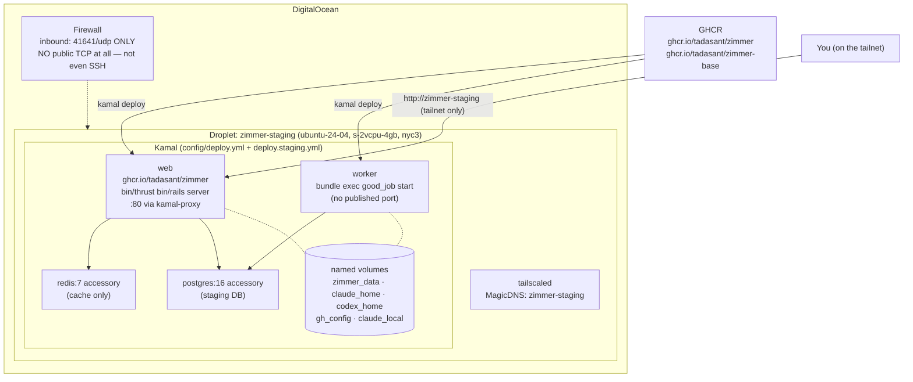
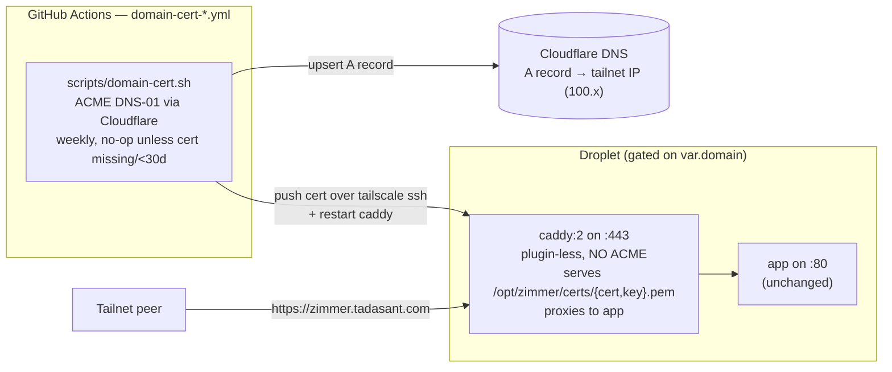

Zimmer deploys with [Kamal](https://kamal-deploy.org/) onto a single DigitalOcean droplet, reachable
only over Tailscale. Terraform bootstraps the box (Docker, Tailscale, Caddy, the deploy key); Kamal
owns the app stack — a `web` role and a `worker` role, with durable named volumes. There is no
Kubernetes, no load balancer, and no HA. TLS is optional and off by default — setting `var.domain`
adds a tailnet-only HTTPS front door (see [below](#custom-domain-https-over-the-tailnet)).

These docs cover the **staging** deployment, which is the one this repo operates. A production
deployment is self-hosted and lives in your own private infrastructure — the `config/deploy.yml` /
`config/deploy.production.yml` and `.kamal/secrets.production` here are public-safe templates, but the
production environment (its DNS, its database, its secrets, and the workflow that drives it) is out of
scope for these docs.

## The topology


```mermaid
flowchart TB
    subgraph do["DigitalOcean"]
        subgraph droplet["Droplet: zimmer-staging (ubuntu-24-04, s-2vcpu-4gb, nyc3)"]
            subgraph kamal["Kamal (config/deploy.yml + deploy.staging.yml)"]
                WEB["web<br/>ghcr.io/tadasant/zimmer<br/>bin/thrust bin/rails server<br/>:80 via kamal-proxy"]
                WRK["worker<br/>bundle exec good_job start<br/>(no published port)"]
                RDS["redis:7 accessory<br/>(cache only)"]
                DBS["postgres:16 accessory<br/>(staging DB)"]
                VOL[("named volumes<br/>zimmer_data · claude_home · codex_home<br/>gh_config · claude_local")]
            end
            TS["tailscaled<br/>MagicDNS: zimmer-staging"]
        end
        FW["Firewall<br/>inbound: 41641/udp ONLY<br/>NO public TCP at all — not even SSH"]
    end

    GH["GHCR<br/>ghcr.io/tadasant/zimmer<br/>ghcr.io/tadasant/zimmer-base"]
    U["You (on the tailnet)"]

    GH -->|"kamal deploy"| WEB
    GH -->|"kamal deploy"| WRK
    WEB --> RDS
    WEB --> DBS
    WRK --> DBS
    WEB -.- VOL
    WRK -.- VOL
    U -->|"http://zimmer-staging (tailnet only)"| WEB
    FW -.-> droplet
```

By default there is no TLS. The web container serves plain HTTP on :80 behind kamal-proxy, and
`production.rb` sets `assume_ssl` and `force_ssl`, which works *only* because `assume_ssl` makes Rails
pretend the request arrived over TLS. The actual encryption is WireGuard, via Tailscale. A future
*public* ingress would break this subtly and badly.

Setting `var.domain` adds a real HTTPS front door (see below), still tailnet-only, which makes
`assume_ssl` true in reality.

## Custom-domain HTTPS over the tailnet

Plain HTTP with `assume_ssl` is a known sharp edge: because Rails computes `https://` origins that
never match the browser's `http://`, every CSRF-protected form POST 422s and every ActionCable upgrade
is rejected. Setting `var.domain` (e.g. `zimmer.tadasant.com`) fixes this class at the source by putting
a genuine cert on a custom name — while staying reachable only over the tailnet.

The trick is that TLS behind a tailnet is awkward: the firewall opens no public 80/443, so ACME
HTTP-01/TLS-ALPN-01 can't work — only DNS-01 can. On-box renewal would mean parking a Cloudflare token
on the droplet, so the work is split so the box holds no DNS credential:


```mermaid
flowchart LR
    subgraph droplet["Droplet (gated on var.domain)"]
        CADDY["caddy:2 on :443<br/>plugin-less, NO ACME<br/>serves /opt/zimmer/certs/{cert,key}.pem<br/>proxies to app"]
        APP2["app on :80<br/>(unchanged)"]
        CADDY --> APP2
    end
    subgraph ci["GitHub Actions — domain-cert-*.yml"]
        SH["scripts/domain-cert.sh<br/>ACME DNS-01 via Cloudflare<br/>weekly, no-op unless cert missing/<30d"]
    end
    CF[("Cloudflare DNS<br/>A record → tailnet IP (100.x)")]
    SH -->|"upsert A record"| CF
    SH -->|"push cert over tailscale ssh<br/>+ restart caddy"| CADDY
    U["Tailnet peer"] -->|"https://zimmer.tadasant.com"| CADDY
```

- **On the droplet** (`cloud-init.yaml.tftpl`, only when `var.domain` is set): a stock, plugin-less
  `caddy:2` container on `:443` that does no ACME. It serves the cert files at
  `/opt/zimmer/certs/{cert,key}.pem` and reverse-proxies to the app. The app keeps publishing `:80`, so
  the MagicDNS `http://…` path is unchanged and a Caddy misconfig can't take the box down. A self-signed
  placeholder is written at boot so Caddy can start before the real cert arrives.
- **In CI** (`scripts/domain-cert.sh`, run by `domain-cert-staging.yml`): discovers the droplet's tailnet
  IP, upserts a Cloudflare `domain → tailnet IP (100.x)` A record, issues/renews the Let's Encrypt cert
  via ACME DNS-01 through Cloudflare, pushes only the cert onto the box over `tailscale ssh`, and
  restarts Caddy (the Caddyfile sets `admin off`, so there's no live-reload endpoint — a restart re-reads
  the bind-mounted files). The Cloudflare token lives only in GitHub Actions.

The A record points at the **tailnet IP**, so tailnet peers resolve and reach it while everyone else
gets an unroutable address — same tailnet-only exposure as the MagicDNS name, now with a real cert.

:::note[Turning it on]
Mint a Cloudflare API token scoped to `Zone:DNS:Edit + Zone:Zone:Read` on the parent zone only, add it
as the `CLOUDFLARE_API_TOKEN` Actions secret (on staging → `tadasant/zimmer`; on production →
your private production repo), set `domain` in the environment's tfvars, deploy, then run the
`domain-cert-*` workflow once (`workflow_dispatch`) to issue the first cert. The weekly schedule renews
thereafter — a no-op unless the cert is missing, self-signed, wrong-name, or within 30 days of expiry, so
it issues only ~every 60 days. `domain=""` renders byte-identically to the plain-HTTP setup, so existing
deployments are unaffected.
:::

:::caution[Certs persist across image upgrades; a droplet replacement drops them]
Certs live in a host directory, so they persist across image auto-upgrades (container recreate). A
droplet **replacement** (a fresh `provision`) drops them; the next `domain-cert-*` run re-registers the A
record and re-issues.
:::

## Background jobs and durable state

`config/environments/production.rb` sets `good_job.execution_mode = :external`, which requires a
separate `bundle exec good_job start` process. Kamal runs exactly that as a dedicated **`worker`**
role (`config/deploy.staging.yml`), alongside the `web` role — so cron, pollers, orphan cleanup,
token refresh, and catalog refresh all run. The deploy workflow asserts the worker container is up
before it reports success.

Both roles mount the same durable named volumes, so state survives a deploy and a container recreate:

- `zimmer_data` → `/home/rails/.zimmer` — the clones (`~/.zimmer/clones`) and scratch.
- `claude_home` → `~/.claude` — Claude Code's transcripts, plus the shared credentials file
  the entire [account-rotation system](/auth/harness/) hinges on.
- `codex_home` → `~/.codex` (`CODEX_HOME`) — Codex's rollout transcripts, `auth.json`, and
  thread store.
- `gh_config` → `~/.config/gh` — the GitHub CLI's stored auth (from an interactive `gh auth login`).
  On staging the durable credential is instead `GH_TOKEN`, minted for the non-primary `tadasant-test`
  account and resolved from the Parameter Store into the process environment on every boot and poll
  tick — so it survives a rebuild without anyone logging in again. See
  [Staging `gh` auth](/operate/provisioning/#staging-gh-auth-the-tadasant-test-account).
- `claude_local` → `~/.local` — where `bin/docker-entrypoint`'s background `claude update` writes.
- The `worker` role additionally mounts `/var/run/docker.sock`, which `DockerCleanupJob` needs.

## The database connection budget

Managed Postgres hands out a hard, small number of connection slots, and an ActiveRecord pool is a
*promise* to use up to that many. The promise is lazy — an overcommitted app looks perfectly healthy
until real traffic calls it in, and then Postgres refuses with `FATAL: remaining connection slots are
reserved for roles with the SUPERUSER attribute`, which Rails serves as a 500. Nothing in a Rails boot
compares the promise against the server, so Zimmer does it in two places instead.

**`config/connection_budget.rb`** is the single source of truth. Two roles times two databases is four
ActiveRecord pools, and they have four different right answers — a flat number is correct for at most
one of them:

| Pool | Sized for | Why |
| --- | --- | --- |
| `web` → `primary` | Puma's threads (`RAILS_MAX_THREADS`, 3) | A request holds a connection for the request. |
| `worker` → `primary` | **every** GoodJob scheduler thread | An executing job holds its connection for the *whole job*: GoodJob's advisory lock is session-scoped, so it leases the connection stickily. Zimmer's agent jobs run for hours. |
| both → `cable` | concurrent in-flight broadcasts | `solid_cable` takes no advisory lock, so Rails leases per `INSERT` and hands the connection straight back. A broadcast from an hours-long agent job holds one for the write, not for the job. |

The same file derives GoodJob's queue string (`config/environments/*.rb` read it), so raising
`GOOD_JOB_AGENTS_THREADS` moves the pool that has to serve those threads along with it. They cannot
drift apart.

**A deploy is the peak, not the steady state.** kamal-proxy health-gates the cutover by running the
old and new containers *together* until the new one answers `/up` — so for that window every
connection exists twice. The budget multiplies by two for exactly this reason; a configuration that
only fits at steady state turns each deploy into a coin flip.

`ConnectionBudget.required_backends` is the resulting number. `infra/terraform/main.tf` refuses to
plan against a managed cluster whose **plan** cannot serve it (DigitalOcean allots 25 connections per
GiB of RAM, minus 3 reserved, and the ceiling is not otherwise tunable), and
`test/config/connection_budget_test.rb` asserts the Terraform default still equals the Ruby
derivation. To see the whole picture against a live server:

```bash
bin/rails db:connection_budget
```

It prints both halves — what the app commits to, what the server can serve — and exits non-zero when
the first exceeds the second.

## The Docker images

**`Dockerfile.base` → `ghcr.io/tadasant/zimmer-base`** — the heavy one, rebuilt by
`release-image.yml` before the app image when `Dockerfile.base` changes, and also rebuilt monthly
(cron `0 6 1 * *`) or on demand. From `ruby:3.4.6-slim`, it bakes in:

- Gems, pre-bundled to `/usr/local/bundle` with bootsnap precompiled
- Node.js 22, the Docker CLI, `gh`, the 1Password CLI, `uv`/`uvx`
- Playwright + Chromium and Puppeteer + Chrome (for browser-automation MCP servers)
- The npm and Python MCP packages listed in `mcp.json` (`bin/preinstall-mcp-packages`)
- The AIR CLI `@pulsemcp/air-cli@0.13.0` + adapters → `/opt/air-cli`
- The Codex CLI `@openai/codex@0.146.0` and Claude Code (via `claude.ai/install.sh`)

**`Dockerfile` → `ghcr.io/tadasant/zimmer`** — the app image. Copies the app onto the base, re-runs
`bundle install` (which catches Gemfile drift against the base), precompiles assets, drops to
`USER 1000:1000`, and runs `bin/thrust bin/rails server`.

### The docs never ship in the image

This documentation site is single-source. The only copy that exists is `docs/` in the repository,
built by Cloudflare Pages and served at [docs.zimmer.tadasant.com](https://docs.zimmer.tadasant.com).
A second copy bundled into `ghcr.io/tadasant/zimmer` would be one nobody deploys, nobody reads, and
nobody keeps true — the app never serves it, so nothing would ever surface the drift.

Nothing in `Dockerfile` is selective about this: the build stage does a blanket `COPY . .` and the
final stage a `COPY --from=build /rails /rails`. The docs stay out because of a single `/docs` line
in `.dockerignore`. That is a fragile place for an invariant to live — reorganize the file, or move
the docs to another path, and the second copy comes back silently.

So two checks assert the outcome instead of trusting that line. Both run
`scripts/assert-docs-excluded.sh`, which fails if it finds a top-level `docs/` directory, or —
anywhere under the tree it is pointed at — an `astro.config.*` or an `@astrojs/starlight` dependency
in a package manifest (skipping `node_modules`, where a vendored Starlight belongs to somebody else's
dependency tree). A scan it could not run exits non-zero too: a guardrail that reports OK when its own
machinery is broken looks exactly like a passing check, which is worse than no check at all.

| Where | Against what | When it fires |
| --- | --- | --- |
| `Dockerfile`, final stage | `/rails` — the published image's own filesystem | during the release build, so an image carrying the docs is never pushed |
| `image_excludes_docs` in `ci.yml` | the real build context, via `Dockerfile.docs-audit` (busybox + `COPY . /ctx`) | on every PR, before merge |

The second is a proxy for the first, and a tight one: `COPY` can only read from the build context, so
docs absent from the context cannot reach the image. It exists because PR CI does not build the app
image — pulling the multi-GB `zimmer-base` on a shared runner for a one-line assertion is not worth
it — and catching the regression after merge is worse than catching it for a few megabytes of
busybox. The gap between them (an `ADD` from a URL, a `COPY --from` an outside image, a `RUN` that
fetches the docs over the network) is what the `Dockerfile`-side assertion is there to close.

Because the check is content-based rather than path-based, moving `docs/` to a new directory without
moving the `.dockerignore` line with it still fails. What it does **not** do is read `.dockerignore`
and look for a line — a check like that passes happily while a `COPY` reintroduces the docs by
another route.

:::caution[It matches the docs by their source, not their output]
`docs/dist/` — the *rendered* HTML Astro emits — carries no `astro.config.*` and no package manifest.
A copy of the built site at some path other than `docs/` would therefore slip past all three checks.
`docs/dist/` is gitignored and doubly excluded today, so this is a gap in what the guardrail proves,
not a hole anything currently walks through.
:::

Separately, `release-image.yml` carries `paths-ignore: ["**/*.md", "docs/**"]`, so a docs-only push to
`main` does not build an image at all.

### Static files in `public/` are not digest stamped

`config.public_file_server.headers` in `production.rb` and `staging.rb` sets the cache header for
everything under `public/` — `manifest.json`, `service-worker.js`, `404.html`, and the icons. It does
**not** cover the compiled asset bundle: Propshaft serves that under `/assets` with its own
far-future headers, and those filenames carry a content digest.

Nothing in `public/` does. Each of those files lives at a URL that never changes, so a far-future
`max-age` there pins whatever a browser fetched first — replace an icon or edit the manifest and the
change reaches nobody who already loaded the old one. The header is therefore one hour, not one year.

An hour still leaves already-cached copies stale for an hour, and copies fetched under an older,
longer header stale for as long as that header said. When you replace a file at a URL that has
already shipped, bump its `?v=` query in whatever references it — that is what the `?v=2` on
`/manifest.json` and the two reused icon `src`s is for.

:::caution[The AIR CLI version is pinned in two places]
`Dockerfile.base` bakes `@pulsemcp/air-cli@0.13.0`, and `AirPrepareService::AIR_CLI_VERSION` must
match. Nothing enforces that they agree. If they drift, the pre-baked CLI is ignored and every
worker `npm install`s a different version at runtime.
:::

:::caution[`bin/docker-entrypoint` backgrounds `claude update`]
It also backgrounds the Playwright browser install, so Rails can answer the health check instead of
waiting behind a 30s+ network operation. The block writes a readiness marker when it finishes and
exports `ZIMMER_BOOT_TASKS_MARKER`; the spawn path
[waits on that marker](/sessions/spawning/#the-boot-tasks-readiness-gate) so a session started
seconds after a deploy does not silently run the old CLI. The wait is bounded by
`ZIMMER_BOOT_TASKS_TIMEOUT_SECONDS` (default 120) — a hung update degrades loudly rather than
wedging the worker.
:::

## The workflows

Every workflow but one runs on **`runs-on: self-hosted`** — a shared self-hosted
runner pool that this repo registers against, so its CI stays off the GitHub-hosted
Actions minute quota. If you fork Zimmer you would point these at your own runners
(or switch the jobs back to `ubuntu-latest`).
See [Running on the shared self-hosted runner](#running-on-the-shared-self-hosted-runner)
for what that requires of a Rails job.

The exception is `alert-ci-failure.yml`, which runs on `ubuntu-latest` on purpose: an
alert that needs a healthy self-hosted runner in order to tell you the self-hosted
runners are unhealthy is no alert at all. That buys less than it sounds like — it covers
a *degraded* pool, where jobs run and fail, but not a pool that is flat **offline**, in
which case runs simply queue (see [CI failure alerts](#ci-failure-alerts)).

| Workflow | Trigger | What it does |
| --- | --- | --- |
| `ci.yml` | PR + push to main | rubocop · brakeman · `Gemfile.lock` freshness · `test-unit` (Postgres + Redis services) · `test-system` (Chrome browser suite) · GHCR-retention logic · docs site build · `image_excludes_docs` (see [The docs never ship in the image](#the-docs-never-ship-in-the-image)) · `all-checks-pass` (the aggregate gate). Every job except the gate is guarded to run only on `push` and on same-repo PRs, so a fork PR never checks out or executes fork code on the self-hosted runners. The gate itself is unguarded — it must never skip, or it would block branch protection — but it has no checkout step and only reads the other jobs' results. |
| `pr-auto-close.yml` | outside PR opened/reopened | Zimmer does not accept pull requests: this politely comments and closes PRs from forks and non-members (owner/member/collaborator PRs are left open), pointing them at the issue tracker. Runs on GitHub-hosted `ubuntu-latest`, never the self-hosted pool. |
| `alert-ci-failure.yml` | any other workflow completing + manual | posts to #alerts in Slack when a workflow **fails on `main`**. See [CI failure alerts](#ci-failure-alerts) |
| `release-image.yml` | push to main (ignores `**/*.md`, `docs/**`) | rebuilds `zimmer-base:latest` first when `Dockerfile.base` changed, then builds and pushes `zimmer:{version, latest, sha-…}` |
| `build-base-image.yml` | manual + monthly cron | rebuilds the base image outside the normal release path |
| `deploy-staging.yml` | manual only | see below |
| `teardown-staging.yml` | manual only | `terraform destroy` of the staging droplet. No longer runs nightly — staging is persistent now (see below). Run it when you deliberately want to stop paying for the box; a powered-off droplet still bills, so destroying is the only way to stop the charge. |
| `ghcr-retention.yml` | weekly cron | prunes GHCR to ≤50 versions |
| `open-transcripts-drift.yml` | daily cron + manual + PR/push touching the vendored files | re-fetches the upstream OpenTranscripts files pinned in `vendor/open_transcripts/UPSTREAM.json` and fails when the bytes have moved (see [Transcripts](/sessions/transcripts/)). Deliberately not on every PR — an upstream commit must not turn unrelated pull requests red. A scheduled failure reaches Slack through `alert-ci-failure.yml`. |
| `domain-cert-staging.yml` | weekly cron + manual | issues/renews the Let's Encrypt cert for `var.domain` via ACME DNS-01 and pushes it to the droplet (see [Custom-domain HTTPS](#custom-domain-https-over-the-tailnet)) |

### CI failure alerts

When **any** workflow in this repo fails on `main`, `alert-ci-failure.yml` posts the
repo, the workflow, the commit subject, the author and a link to the run into **#alerts**
in the Tadasant Slack workspace. Any of your other repos can carry the identical
listener under the identical secret names; if so, keep them symmetric and change them
together.

It listens with `workflows: ["*"]`, which matches every workflow in the repo — so a
workflow added later is covered the day it lands, with nobody having to remember to wire
it up.

It needs two repo secrets — `SLACK_BOT_TOKEN` and `SLACK_ALERTS_CHANNEL_ID`
([Provisioning and secrets](/operate/provisioning/#slack-ci-failure-alerts)). Without
them it logs a warning and exits 0: a missing alert secret must not turn into a second
red X on `main`. With them, a Slack rejection *does* fail the job, because a rejected
alert is a silently broken alert and this is the only place it can surface.

Three details worth knowing before you touch it:

- It fires on an **allowlist** of conclusions — `failure`, `startup_failure`,
  `timed_out` — never on "not success". `ci.yml` sets `cancel-in-progress`, so two
  pushes to `main` in quick succession cancel the first run, and a *cancelled* run must
  not page anyone. The corollary is that a run which never starts is never alerted on:
  if the self-hosted pool is offline, main-branch runs **queue**, and GitHub cancels
  them after ~24h as `cancelled`, which is indistinguishable from a deliberate cancel
  ([Limitations](/limitations/#a-queued-run-that-never-starts-is-never-alerted-on)).
- `["*"]` matches the alert **itself**, and `workflow_run` chains several levels deep, so
  the job excludes itself by comparing against the literal name `'CI failure alert'`.
  **Rename the workflow and you must update that literal**, or it starts alerting on its
  own runs ([Limitations](/limitations/#the-ci-failure-alert-cant-be-exercised-from-a-pr)).
- `workflow_run` only ever triggers from the copy of the file on the **default branch**,
  so editing it on a PR branch changes nothing until it merges. To prove Slack delivery
  works, run the workflow's `workflow_dispatch` trigger by hand — it posts a smoke-test
  message instead of an alert.

### Running on the shared self-hosted runner

The runner box is shared across several repos, so a job cannot assume it has the
machine to itself. Five things follow. The first four are what every Rails job in
`ci.yml` already does; the fifth is what every image-building job does:

- **`ruby/setup-ruby` gets `self-hosted: true` and `bundler-cache: false`.**
  `self-hosted: true` selects the Ruby already staged in
  each runner's own `$RUNNER_TOOL_CACHE` instead of downloading one — the action's
  download path extracts into a hardcoded `/opt/hostedtoolcache` the runner user can't
  write, so on this box the flag is mandatory, not optional. `bundler-cache: false`
  turns off the action's automatic `bundle install`, because we do it ourselves into
  an isolated path (below).

  :::caution[Runner toolcache seeding]
  The `tadasant-zimmer-ci-*` runners were registered with a Node toolcache but **no
  Ruby one**, so their Ruby 3.4.6 toolcache had to be seeded out of band (`ruby-build
  3.4.6` into `/opt/hostedtoolcache-runner-N/Ruby/3.4.6/x64`). That manual seed is not
  yet captured in IaC and will be lost if the runners are rebuilt — codifying it is
  part of the DigitalOcean migration ([zimmer#118](https://github.com/tadasant/zimmer/issues/118)).
  :::
- **Gems install into a per-runner path.** `bundle config set --local path
  /home/runner/.bundles/zimmer-runner-${RUNNER_NUM}` (with `RUNNER_NUM` derived from
  `$RUNNER_NAME`) keeps two concurrent jobs on the same box from fighting over one
  `vendor/bundle`.
- **Service containers publish dynamic ports.** Postgres and Redis declare
  `- 5432/tcp` / `- 6379/tcp` (not `5432:5432`), and a step resolves the assigned
  host port via `${{ job.services.postgres.ports[5432] }}` into `DATABASE_PORT` /
  `REDIS_URL`. Fixed host ports would collide when two jobs land on the same runner.
- **The heavy suites are the `test-unit` and `test-system` job keys and pin
  `PARALLEL_WORKERS`.** The runner's file-based semaphore recognizes the job **keys**
  `test-unit` and `test-system` and caps how many heavy test jobs run at once; a bare
  `test` key would go ungated. Pinning `PARALLEL_WORKERS` stops a single job from
  fanning out to `:number_of_processors` (32 on this box) and starving co-tenants —
  `test-system` pins it to 1 because its persistent per-worker Chrome profile does not
  tolerate concurrent browser instances. `test-system` runs the Chrome-driven system
  suite (`bin/rails test:system`); the companion system-test semaphore gates it.
- **Image builds get a private `DOCKER_CONFIG` and name their builder explicitly.**
  Every job that runs `docker/build-push-action` exports a fresh
  `DOCKER_CONFIG` under `$RUNNER_TEMP` before its first `docker/*` step, and passes
  `builder: ${{ steps.buildx.outputs.name }}` to each build. See
  [Why image builds isolate their Docker config](#why-image-builds-isolate-their-docker-config).
  `test/config/image_build_workflows_test.rb` fails the build if a workflow adds a
  `build-push-action` step without both.

### Why image builds isolate their Docker config

All ~14 runner workers on the box execute as the same OS user with no per-job
`DOCKER_CONFIG`, so they share one `~/.docker` — one `config.json` and one
`buildx/current`. Both are mutable state that any job can overwrite at any moment.

`docker/setup-buildx-action` creates a builder with `docker buildx create --use`, and
`--use` writes the *shared* current-builder file. `docker/build-push-action` reads that
same file to decide which builder to build on — it does not remember which builder its
own job created. So a build step that starts after a co-tenant job's `--use` lands
silently builds on **that job's** buildkit container. When the co-tenant finishes,
`setup-buildx-action`'s post step runs `docker buildx rm`, which stops the container
and deletes its instance file. The victim's in-flight build sees:

```
ERROR: failed to build: failed to receive status: rpc error: code = Unavailable
desc = closing transport due to: ... received prior goaway: ... debug data: "graceful_stop"
ERROR: no builder "builder-<some-other-jobs-uuid>" found
```

The tell is that the UUID in the error is **not** the one the job's own "Set up Buildx"
step printed. The shared `config.json` has the matching hazard: `docker/login-action`'s
post step runs `docker logout ghcr.io`, which strips GHCR credentials out from under a
concurrent job's push.

A per-job `DOCKER_CONFIG` under `$RUNNER_TEMP` gives each job its own current-builder
file and its own credential store, which removes both races; the explicit `builder:`
input makes the binding unambiguous even if that state is ever shared again.

It is exported from a step rather than declared in job-level `env:`:

```yaml
- name: Isolate Docker client state for this job
  run: |
    cfg="${RUNNER_TEMP}/docker-config"
    rm -rf "$cfg"
    mkdir -p "$cfg"
    echo "DOCKER_CONFIG=$cfg" >> "$GITHUB_ENV"
```

The `runner` context is [not available in `jobs.<job_id>.env`](https://docs.github.com/en/actions/reference/workflows-and-actions/contexts#context-availability),
so `DOCKER_CONFIG: ${{ runner.temp }}/docker-config` there expands to the empty string
and silently points every build at `/docker-config`. A step's `run:` always has
`$RUNNER_TEMP`. `image_build_workflows_test.rb` asserts both the step form and that it
precedes every `docker/*` step.

:::note[The host could also fix this]
Setting `DOCKER_CONFIG` per worker in the runner service definitions (in the private
`tadasant-internal` repo's `ci-runner/`) would fix it for every repo on the box at once,
instead of once per repo. The in-repo change here stands on its own and does not
conflict with that.
:::

### Staging deploys are Kamal container swaps onto a persistent droplet

The droplet is no longer cattle. Terraform provisions it **once** and then leaves it alone; Kamal
deploys the app onto it. `deploy-staging.yml`:

1. Builds the base image (`:staging`) and app image (`:staging-<sha>`).
2. `terraform apply` — reconciles the **existing** droplet through remote state. It does not reap
   anything, and a re-run updates in place rather than recreating.
3. Joins the tailnet, resolves `zimmer-staging`'s peer IP from `tailscale status --json`, and loads
   the Kamal deploy key.
4. `kamal accessory boot all -d staging`, then `kamal deploy -d staging --version=<tag>
   --skip-push`. The boot line is unconditional, because `kamal deploy` on its own does not boot
   accessories and a newly declared one would otherwise never appear; it costs nothing to repeat,
   since `accessory boot` skips a host that already has the container (production's pipeline, in the
   companion repo, runs the same line before its own deploy). kamal-proxy boots the new container
   alongside the old one, health-checks it on `/up`, and only then flips traffic. A container that
   never goes healthy leaves the old one serving.
5. Re-verifies `/up` over the tailnet and asserts the **worker** container is running too — the
   worker is where agent sessions actually execute.
6. Smoke-tests the app it just deployed: `/up/deep`, a real page render, a CSRF round trip, and an
   Action Cable upgrade. See below — this is the step that decides whether the deploy is called
   healthy.

If the rebuild path (`recreate_droplet`) runs without `TS_API_CLIENT_ID` / `TS_API_CLIENT_SECRET`,
`scripts/tailnet-reap-node.sh` still skips the stale-node cleanup — a fork that never configured a
Tailscale OAuth client must not have its rebuild fail over it — but it now says so as a GitHub
Actions **warning** rather than an info line nobody reads. The consequence of a silent skip surfaces
much later and somewhere else: the rebuilt droplet registers as `zimmer-staging-1` and the MagicDNS
name drifts off the box you deployed.

### `/up` is a liveness ping; `/up/deep` is the health check

`/up` is Rails' built-in endpoint, and it answers 200 for any process that finished booting. A
container with a dead database, an unreachable Redis, or a cache store that silently drops every
write answers it 200 all the same. A deploy gate that asks only `/up` therefore declares a fully
broken deploy healthy — which is what happened.

`GET /up/deep` (`app/services/deep_health_check.rb`) answers 200 only when every backing service the
app cannot serve a page without has answered a real round trip, and `503` naming the one that did
not:

| Check | What it does | What only it catches |
| --- | --- | --- |
| `database` | `SELECT 1`, then one indexed row from a real application table | A Postgres that connects but has none of the app's tables — wrong database, unmigrated volume |
| `cache` | Writes a per-request canary and **reads it back** | `:redis_cache_store`'s `error_handler` swallows connection errors, so a dead Redis makes `write` and `read` return `nil` instead of raising. Reading the value back is the only way to tell a working store from one quietly discarding everything |
| `redis` | `PING` on the connection the cache store actually holds | Turns "the cache is not storing anything" into "Redis is unreachable, and here is what it said". Reported as `skipped` where no Redis is configured (development, test), which is not a failure |

```json
{
  "status": "error",
  "failed": ["cache"],
  "checks": {
    "database": { "status": "ok", "adapter": "PostgreSQL" },
    "cache": { "status": "error", "error": "the cache store did not return the value it just wrote (read back nil)" },
    "redis": { "status": "error", "error": "Redis::CannotConnectError: Error connecting to redis://[redacted]@…" }
  },
  "checked_at": "2026-08-01T20:13:38Z"
}
```

Two deliberate properties. It is **unauthenticated**, like `/up`, so a deploy gate and an uptime
monitor can reach it — which is why anything it echoes from a backing service is scrubbed of
`scheme://user:password@` credentials and truncated. And it is **not** behind
`HealthActionCooldown`: that limiter guards the destructive maintenance actions and fails closed, so
it would answer "rate limited" for precisely the broken-cache case this endpoint exists to report,
and a health endpoint that refuses a monitor's second poll in 30 seconds is not a health endpoint.
What makes that safe is that the probe is cheap and fixed-cost — one `SELECT 1`, one single-row
indexed read, one cache round trip, one `PING`, less work than any page the same visitor could
request instead.

The post-deploy smoke step asserts four things, and every one of them fails the run (unlike the
telemetry probe, which warns — broken telemetry is not a reason to withhold a working deploy):

| Assertion | A failure means |
| --- | --- |
| `GET /up/deep` → 200 | A backing service is down; the body names which |
| `GET /` → 200 | The app is serving errors on its own root page |
| `POST` without a CSRF token → 422, then with the page's token → 404 | The session cookie or `secret_key_base` did not survive the deploy: every GET looks perfect while every form in the UI 422s. The target is a session id that cannot exist, so the authorized request 404s having changed nothing |
| `GET /cable` upgrades to a WebSocket | Turbo Streams cannot connect — every live update in the UI (timelines, status badges, notification counts) is dead |

Two things follow from this that did not used to be true:

- **Rollback is one command.** `kamal rollback <version> -d staging` (the host retains the last 5
  images).
- **State survives a deploy.** `web` and `worker` share durable named volumes (`zimmer_data`,
  `claude_home`, `codex_home`, `gh_config`, `claude_local`), which are re-attached to each new
  container instead of being destroyed with the droplet.

### What changed, and why

The old flow re-rendered the whole app stack into cloud-init's `user_data` — a **replace-forcing**
attribute on `digitalocean_droplet`. Any change to the image or an env var therefore destroyed and
rebuilt the droplet (and everything on its disk). Combined with ephemeral Terraform state, which
forced the workflow to hand-reap the droplet and firewall through the DigitalOcean API before every
`apply`, staging was torn down and rebuilt constantly.

Now: the app stack lives in Kamal (`config/deploy.*.yml`), `user_data` is only a bootstrap, and the
droplet carries `lifecycle { ignore_changes = [user_data] }` (deliberately *not*
`create_before_destroy` — the tailnet hostname is fixed). A config or app change can no longer replace
the box. The cost of freezing `user_data` is that the deploy key and Caddyfile can't be updated in
place — see [Known limitations](/limitations/#user_data-is-frozen-so-the-deploy-key-and-the-caddyfile-cant-be-updated-in-place).

## Terraform, briefly

```bash
cd infra/terraform
cp staging.tfvars.example staging.tfvars
export TF_VAR_do_token=… TF_VAR_tailscale_auth_key=… TF_VAR_deploy_ssh_pubkey="$(cat ~/.ssh/kamal.pub)"
export AWS_ACCESS_KEY_ID=… AWS_SECRET_ACCESS_KEY=…   # DO Spaces keys, for the state backend
# Operator keys, if you want the publickey door on :2222. In CI this comes from the
# ADMIN_SSH_PUBKEYS Actions variable; it is never committed. Unset means [].
export TF_VAR_admin_ssh_pubkeys='["ssh-ed25519 AAAA… you@laptop"]'
terraform init -input=false -backend-config=backend.staging.hcl
terraform apply -input=false -auto-approve -var-file=staging.tfvars
```

Creates: the droplet, the firewall, and a reserved IP (a stable public address across rebuilds).
`manage_project` stays **`false`** by default — a project name is account-unique and a pre-existing
one 409s, so a DO Project (just a console folder) isn't worth the failure mode; flip it on with a
one-time `terraform import` if you want one.

Terraform no longer knows anything about the app: no image ref, no secrets, no database wiring. Those
are Kamal's. It also does **not** create a DNS record — when `var.domain` is set, the `domain-cert`
workflow owns the A record (pointing at the tailnet IP), which keeps the Cloudflare credential out of
Terraform.

Staging runs a Postgres accessory container on the droplet, wired by Kamal — nothing external to
provision. A self-hosted production deployment would instead point at its own database (Terraform can
reference one as a read-only data source rather than creating it), but that lives in your own private
infrastructure, not here.

→ [Provisioning and secrets](/operate/provisioning/)
