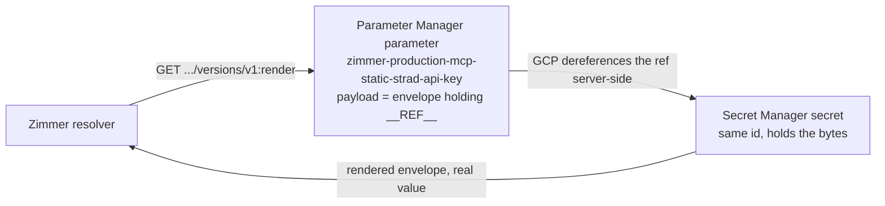

Zimmer resolves the `${VAR}` placeholders in its MCP catalog from a **chain** of
sources. This page covers the first link — Google Parameter Manager + Secret
Manager — what it is for, how to provision it, and how to prove the credential is
the shape it claims to be.

**Zimmer works fine without it.** With no resolver credential configured the
chain is exactly the two links it has always had, the Connectors page says so,
and nothing raises. Wiring the store up is an upgrade, not a prerequisite.

## The chain, and its order

| Order | Source | Where it lives |
| --- | --- | --- |
| 0 | `XOauthTokenVendor` | X access tokens only; ahead of everything because they rotate at runtime |
| 1 | **Google Parameter Store** | `zimmer-secrets-prod`, namespace `/zimmer/{env}/mcp/static/` |
| 2 | Rails encrypted credentials | `mcp_secrets:` in `config/credentials/{env}.yml.enc` |
| 3 | Process `ENV` | the container's environment |

The store goes **first** so migration is one reversible step per secret: write the
value into the store and it takes effect; delete it from the store and the
encrypted-credentials copy is live again. With the order reversed, adding a
secret to the store would do nothing until someone also deleted it from the
credentials file — a change with no visible effect is a change people stop
trusting.

**A miss is not an error.** A provider returns "not here" only when it reached
its backend and the name was not there. A provider that could not reach its
backend *raises*, and the chain does not catch it. Silently falling through to
the encrypted-credentials copy during a store outage is how a rotated credential
comes back from the dead; the credentials link exists to carry secrets that have
not migrated yet, not to paper over an unreachable store.

The Connectors page reflects that distinction directly: a secret the store says
it does not hold is **Missing configuration**, and a secret the store could not
be asked about is **Secret store unreachable**. They are different words because
they call for different actions.

## Why a separate GCP project

**The fence is the GCP project, not the namespace.** `parameters.list` authorizes
on the project parent (`projects/N/locations/global`), whose resource name never
starts with a path prefix, so an IAM condition cannot carry the namespace — it
would deny the very call that matters. The path prefix is a code-level guard;
the project is the boundary.

Zimmer therefore gets **`zimmer-secrets-prod`**, its own project, rather than a
namespace inside strad's `strad-secrets-prod`. The deciding reason:

- Zimmer's resolver needs `secretmanager.secretAccessor` — real secret **value**
  access — because it injects resolved values into MCP server configs at session
  start. strad's MCP-facing viewer identity deliberately lacks exactly that
  permission, and that single omission *is* strad's fence.
- Putting Zimmer's value-reading identity inside `strad-secrets-prod` would hand
  a second application's runtime read access to every strad secret value, which
  inverts that property. It runs the other way too: strad's admin console would
  hold write access over Zimmer's secrets.

The cost is one extra project and three API enablements. That is cheap next to a
shared blast radius.

This holds even under the strategic direction where nearly all of Zimmer's MCP
servers eventually route through strad on a single shared `${STRAD_API_KEY}`: a
shared project would mean a strad compromise reads Zimmer's strad key, and a
Zimmer compromise reads strad's own credentials.

## How a secret is stored

Two resources per secret, joined by GCP itself:



The Parameter Manager payload is an **envelope**:

```json
{
  "path": "/zimmer/production/mcp/static/STRAD_API_KEY",
  "secret": true,
  "value": "__REF__(\"//secretmanager.googleapis.com/projects/zimmer-secrets-prod/secrets/zimmer-production-mcp-static-strad-api-key/versions/latest\")"
}
```

Three things about it matter:

- **The parameter never holds the secret.** It holds a pointer. A test asserts
  the value appears in no Parameter Manager payload.
- **`versions/latest`** means rotating the secret needs no new parameter version.
- **`path`** is the collision guard. `ParameterStore::Namespace.parameter_id`
  folds a path to a flat, lowercased GCP id, and that fold is lossy — `A_B` and
  `a-b` collapse together. Every read compares the envelope's own `path` against
  the path it asked for, so a resolving id is never mistaken for the right
  parameter.

Only parameters labelled `managed-by=zimmer` are read.

## Provisioning — a human must do this

**No agent in this deployment can.** There is no `gcloud` on the box and no GCP
MCP server in the catalog; CI holds no IAM-admin credential for this project.
Creating the project, minting the service account and granting roles is a human
prerequisite, exactly as it was for strad's resolver.

Run the whole section in one sitting.

### 1. The project and its APIs

```bash
PROJECT=zimmer-secrets-prod

gcloud projects create "$PROJECT"
gcloud services enable parametermanager.googleapis.com \
                      secretmanager.googleapis.com \
                      cloudresourcemanager.googleapis.com \
                      --project "$PROJECT"
```

`cloudresourcemanager.googleapis.com` is not optional: the capability probe the
Connectors page shows calls `projects:testIamPermissions` on it. Without it the
page reports "could not confirm what this credential may do" rather than a
capability.

### 2. The resolver identity, and exactly three roles

```bash
PROJECT=zimmer-secrets-prod
SA=zimmer-secrets-resolver
MEMBER="serviceAccount:${SA}@${PROJECT}.iam.gserviceaccount.com"

gcloud iam service-accounts create "$SA" \
  --display-name "Zimmer secrets (runtime resolver: reads parameter + secret VALUES, writes nothing)" \
  --project "$PROJECT"

# List parameters and their versions.
gcloud projects add-iam-policy-binding "$PROJECT" \
  --member "$MEMBER" \
  --role roles/parametermanager.parameterViewer \
  --condition=None

# Actually :render a version. parameterViewer grants the LISTS but NOT render —
# verified the hard way during provisioning, where render 403'd with viewer alone.
gcloud projects add-iam-policy-binding "$PROJECT" \
  --member "$MEMBER" \
  --role roles/parametermanager.parameterAccessor \
  --condition=None

# The other half of a :render — dereference the __REF__ the envelope carries.
gcloud projects add-iam-policy-binding "$PROJECT" \
  --member "$MEMBER" \
  --role roles/secretmanager.secretAccessor \
  --condition=None
```

| Role | Why |
| --- | --- |
| `roles/parametermanager.parameterViewer` | `parameters.list` + `parameterVersions.list` — the two calls `GcpClient#resolve` makes before it renders anything. |
| `roles/parametermanager.parameterAccessor` | `parameterVersions.render`. **`parameterViewer` does not grant this** — with viewer alone the lists succeed and every render 403s, which looks like a working credential right up until nothing resolves. |
| `roles/secretmanager.secretAccessor` | `secretmanager.versions.access`, so the resolver can read a rendered secret value. No create, no update, no destroy, no policy read. |

Deliberately **not** granted:

- `roles/parametermanager.admin` / `roles/secretmanager.admin` — that pair is the
  console's admin identity. Zimmer never writes.
- `roles/editor`, `roles/owner` — both grant `versions.access` **and** write.
  Either makes the split decorative.
- `roles/secretmanager.viewer` — metadata-only reads Zimmer never performs.

Bindings are project-level rather than per-secret because a human adds new
secrets at runtime; a per-secret binding set goes stale the moment they do, and
the failure surfaces in production as a `${VAR}` that resolves to nothing.

`--condition=None` only suppresses gcloud's interactive condition prompt; it adds
no binding condition.

### 3. Mint the key

```bash
gcloud iam service-accounts keys create /tmp/zimmer-secrets-resolver.json \
  --iam-account "${SA}@${PROJECT}.iam.gserviceaccount.com" \
  --project "$PROJECT"
```

### 4. Audit it — assert exactly these roles and nothing more

Two halves. The first reads the policy:

```bash
diff <(gcloud projects get-iam-policy "$PROJECT" \
         --flatten="bindings[].members" \
         --filter="bindings.members:${MEMBER}" \
         --format="value(bindings.role)" | sort) \
     <(printf 'roles/parametermanager.parameterAccessor\nroles/parametermanager.parameterViewer\nroles/secretmanager.secretAccessor\n') \
  && echo "OK: the resolver holds exactly the intended roles" \
  || echo "DRIFT: the resolver's bindings are not the intended set (see the diff above)"
```

The second proves the **capability**, which is stronger — it accounts for
anything inherited from a folder or the organisation that a project-level
`get-iam-policy` does not show:

There is **no `gcloud projects test-iam-permissions` subcommand** — call Cloud Resource Manager's REST endpoint directly. This is also exactly what `ParameterStore::Capabilities` calls at runtime, so the audit and the banner are asking Google the same question:

```bash
gcloud auth activate-service-account --key-file /tmp/zimmer-secrets-resolver.json

curl -s -X POST \
  -H "Authorization: Bearer $(gcloud auth print-access-token)" \
  -H "Content-Type: application/json" \
  "https://cloudresourcemanager.googleapis.com/v1/projects/${PROJECT}:testIamPermissions" \
  -d '{"permissions":[
        "parametermanager.parameters.list",
        "parametermanager.parameterVersions.list",
        "parametermanager.parameterVersions.render",
        "secretmanager.versions.access",
        "parametermanager.parameters.create",
        "parametermanager.parameterVersions.create",
        "secretmanager.secrets.create",
        "secretmanager.versions.add"]}' | jq -r '.permissions[]' | sort

# EXPECTED — exactly these four and no others:
#   parametermanager.parameterVersions.list
#   parametermanager.parameterVersions.render
#   parametermanager.parameters.list
#   secretmanager.versions.access
#
# The four write permissions MUST be absent. Their absence is the "reads values,
# writes nothing" claim, checked rather than asserted. If the list comes back
# empty, the SA has no project access at all and something above failed.

gcloud config set account <your-own-account>   # switch back off the SA
```

Zimmer runs the same probe continuously: the Connectors page's secret-store
banner reports **least privilege**, **also holds write permissions** (naming
them), **cannot read secret values**, or **could not confirm** — the last being a
distinct state, never reported as a denial.

### 5. Deliver the key to Zimmer

Zimmer reads three environment variables:

| Variable | Value | Sensitive? |
| --- | --- | --- |
| `ZIMMER_PARAMS_PROJECT_ID` | `zimmer-secrets-prod` (staging: `zimmer-secrets-staging`) | No — the store's address is not a credential |
| `ZIMMER_PARAMS_LOCATION` | `global` (the default) | No |
| `ZIMMER_PARAMS_RESOLVER_SERVICE_ACCOUNT_KEY_JSON` | **base64** of the key JSON | **Yes** |

The key is read from `ENV`, deliberately **not** from Zimmer's encrypted
credentials: it is the key to the store meant to supersede that file, and
keeping it there would make rotating it require re-encrypting the very thing it
replaces.

All three are wired in this repo — `config/deploy.production.yml` puts the two
address variables in `env.clear` and the credential in `env.secret`, and
`.kamal/secrets.production` maps it from the deploy environment. The only step
left outside this repo is **setting the GitHub Actions secret**.

#### Base64, and why it is not optional

Encode the key before pasting it:

```bash
base64 -w0 < /tmp/zimmer-secrets-resolver.json
```

Kamal hands env vars to Docker through an **env-file**, which is one line per
variable. Kamal escapes each value with Ruby's `String#dump`, so a real newline
becomes the two characters `\n` — and Docker's `--env-file` parser unescapes
**nothing**, so those two characters arrive literally.

`gcloud iam service-accounts keys create` writes **pretty-printed** JSON. Pasted
raw, it reaches the container with `\n` between its fields and `JSON.parse`
rejects it outright. It is the same constraint that makes `ZIMMER_OPERATOR_SSH_KEY`
base64.

Measured end to end through a real `docker run --env-file`, for one 2048-bit key:

| Pasted as | In the container | Result |
| --- | --- | --- |
| pretty-printed JSON (2367 B, 13 lines) | 2407 B, **1 line** — newlines became `\n` | **rejected**, not valid JSON |
| minified JSON, `jq -c` (2321 B) | 2348 B — only the `\n` escapes doubled | works |
| base64 (3096 B) | 3096 B, unchanged | works |

`ParameterStore::ServiceAccount.parse` accepts base64 **or** raw JSON, so a
minified paste is not a corruption trap and a local `ENV[...]=` in a console still
works. Base64 is what the runbook says because it is the one form that cannot be
got wrong.

**Getting this wrong is quiet.** A credential that will not parse is not a crash:
absence is a designed state, so Zimmer boots, resolves every `${VAR}` from
encrypted credentials exactly as before, and the store simply never turns on. The
Connectors page is where it shows — it names the reason (`… is not valid JSON, nor
base64 of valid JSON`).

#### Set the secret

Two steps, both in the private production repo (`tadasant-internal`), and the
second is a code change rather than a setting:

1. Add the GitHub Actions secret `PROD_ZIMMER_PARAMS_RESOLVER_SERVICE_ACCOUNT_KEY_JSON`.
2. Name it in **both** places `zimmer-deploy-prod.yml` enumerates secrets — the
   `Kamal deploy (production)` step's `env:` block, *and* the `-e` passthrough list
   in the `kamal()` docker wrapper. Consider adding it to that step's
   `: "${…:?}"` assert block too, alongside `PROD_OPERATOR_SSH_KEY`.

The second step is the one that gets skipped, and skipping it is invisible. That
workflow's own comment says why: a var missing from the `env:` block *"would just
arrive empty, and Kamal's `FOO=$FOO` mapping in `.kamal/secrets.production` would
resolve to blank with no error."* Combined with this module's
degrade-rather-than-crash design, the result is a deploy that looks completely
healthy while the store never turns on — the same silent failure as a wrong paste
format, reached by a different route. The Connectors page is where you check.

Then:

```bash
shred -u /tmp/zimmer-secrets-resolver.json
```

#### Staging gets the same three links, against its own project

Staging is where the store path gets rehearsed before production — the render
join, the per-parameter `secretAccessor` grant, the Connectors banner — so it
reads a store of its own: `zimmer-secrets-staging`, provisioned exactly like the
production project above, with its own resolver service account holding the same
three roles and nothing more.

It is **not** production's. Pointing a throwaway box that agent sessions have root
on at `zimmer-secrets-prod` would hand them a credential that reads production
secret *values*. The two projects also mean two namespaces:
`Namespace.static_namespace` folds in `Rails.env`, so staging reads
`/zimmer/staging/mcp/static/` and cannot see production's.

The wiring is four links. Three are files in **this** repo; the fourth is a
repository setting a human adds:

| Link | Where | Asserted by a test? |
| --- | --- | --- |
| The step's `env:` allowlist | `.github/workflows/deploy-staging.yml`, the `Kamal deploy (staging)` step | yes |
| The Kamal mapping | `.kamal/secrets.staging` | yes |
| The `env.secret` list, plus the address in `env.clear` | `config/deploy.staging.yml` | yes |
| GitHub Actions secret `STAGING_ZIMMER_PARAMS_RESOLVER_SERVICE_ACCOUNT_KEY_JSON` | this repo's settings | no — nothing in a repo can see its own secrets |

`test/config/parameter_store_env_delivery_test.rb` asserts all three file-level
links, including the `env:` allowlist — the one the production runbook calls "the
one that gets skipped, and skipping it is invisible". Production's workflow lives
in `tadasant-internal`, so there it can only be written down; staging's is here,
so there it is a test.

:::caution[A second workflow deploys staging too]
`tadasant-internal`'s staging cutover workflow runs its own `kamal deploy` against
this same box, through its own explicit `env:` allowlist. It needs the same
passthrough, and it is not covered by anything in this repo — no test here can see
it. Wiring only one of the two leaves a deploy path that resolves the credential
to blank and reports success.
:::

**The credential stays optional, deliberately** — no `:?` assertion anywhere in the
chain. Unset means the store link is simply absent: `SecretProviders.build`
composes `[rails_credentials, env]`, nothing raises, and staging resolves every
`${VAR}` from the committed `staging.yml.enc` exactly as it always has, with the
Connectors page saying the store is not configured rather than reporting a
failure. That is what makes *landing* this wiring a no-op for every credential
already in use, and it is why the address can be wired in `env.clear` before the
secret itself exists.

Be precise about what it does not cover, because the difference bites after the
secret is seeded: the fallback is for an **unconfigured** store, not a broken one.
Once a credential is present, a cold store failure re-raises and the chain does not
rescue it — see [caching and failure behaviour](#caching-and-failure-behaviour).
Unset is a no-op; configured-but-unreachable is a hard failure, by design.

The deploy prints which state it is in:

```
✅ Parameter Store ON (resolver key set; reads /zimmer/staging/mcp/static/ in zimmer-secrets-staging)
```

### If any CI or deploy step handles this key

Use the leak-safe shape. The GitHub Actions runner prints a step's resolved
`env:` block — **names and values** — in the log-group header *before* the `run:`
body executes, so `::add-mask::` inside the body is always too late. `$GITHUB_ENV`
is worse: the runner folds job-level env into every later step's header.

Write the value to disk under `umask 077` in `$RUNNER_TEMP`, register masks
line-by-line, and put only a **path** in `env:`:

```yaml
- name: Fetch the resolver credential
  id: resolver
  run: |
    set -euo pipefail
    umask 077
    dir="$RUNNER_TEMP/zimmer-params"
    mkdir -p "$dir"
    out="$dir/resolver-key.json"
    gcloud secrets versions access latest --secret "$NAME" --project "$P" > "$out"
    while IFS= read -r line || [ -n "$line" ]; do
      [ "${#line}" -ge 8 ] || continue
      printf '::add-mask::%s\n' "${line//%/%25}"
    done < "$out"
    printf 'file=%s\n' "$out" >> "$GITHUB_OUTPUT"

- name: Use it
  env:
    # A PATH, not the value. Paths are not sensitive.
    RESOLVER_KEY_FILE: ${{ steps.resolver.outputs.file }}
  run: |
    # Split assignment: `export x=$(…)` returns the builtin's status, so a failed
    # `cat` would sail past `set -e` and hand the next step an empty credential.
    KEY="$(cat "$RESOLVER_KEY_FILE")"
    export KEY

- name: Shred it
  if: always() && steps.resolver.outputs.file != ''
  run: rm -f "${{ steps.resolver.outputs.file }}"
```

This is the shape `tadasant-internal` PR #218 landed after the leak tracked in
its issues #215 and #77 — for a key that arrives from somewhere *other* than
`secrets.*`.

`deploy-staging.yml` does not need it. Its key comes straight from
`${{ secrets.STAGING_ZIMMER_PARAMS_RESOLVER_SERVICE_ACCOUNT_KEY_JSON }}`, and
GitHub masks a registered secret's value anywhere in the log, including that
header — which is why the step's preflight reports only whether the credential is
*set*, exactly like the SSH key and the observability secrets beside it. The
leak-safe shape above is for a value the runner fetches or derives, which the
masker has never seen.

## Adding a secret

Zimmer's own credential cannot write, by design. A human with the admin identity
runs, for `STRAD_API_KEY` in production:

```bash
PROJECT=zimmer-secrets-prod
ID=zimmer-production-mcp-static-strad-api-key

# 1. The value itself, in Secret Manager.
printf %s '<the-secret-value>' | gcloud secrets create "$ID" \
  --project "$PROJECT" --replication-policy automatic \
  --labels managed-by=zimmer --data-file=-

# 2. The parameter that indexes it.
gcloud parametermanager parameters create "$ID" \
  --project "$PROJECT" --location global \
  --parameter-format json --labels managed-by=zimmer,secret=true

# 3. Let the PARAMETER read the secret. THIS STEP IS NOT OPTIONAL — see below.
PRINCIPAL=$(gcloud parametermanager parameters describe "$ID" \
  --project "$PROJECT" --location global \
  --format='value(policyMember.iamPolicyUidPrincipal)')
gcloud secrets add-iam-policy-binding "$ID" --project "$PROJECT" \
  --member="$PRINCIPAL" --role=roles/secretmanager.secretAccessor

# 4. The envelope version pointing one at the other.
cat > /tmp/$ID.json <<'JSON'
{"path":"/zimmer/production/mcp/static/STRAD_API_KEY","secret":true,"value":"__REF__(\"//secretmanager.googleapis.com/projects/zimmer-secrets-prod/secrets/zimmer-production-mcp-static-strad-api-key/versions/latest\")"}
JSON
gcloud parametermanager parameters versions create v1 \
  --parameter "$ID" --project "$PROJECT" --location global \
  --payload-data-from-file /tmp/$ID.json
rm -f /tmp/$ID.json
```

**Why step 3 exists, and why omitting it is so hard to diagnose.** `:render`
dereferences the `__REF__` as the **parameter's own** principal
(`policyMember.iamPolicyUidPrincipal`), *not* as the caller's credential. That
principal needs `secretmanager.secretAccessor` on the secret. Without it, every
resolution of that variable fails with `400 SECRET_REFERENCE_ERROR` — while the
Connectors store banner still reports a perfectly healthy credential, because the
banner reflects a `testIamPermissions` probe of the **resolver**, a different
principal. Green banner, nothing resolving. Grant it per secret at creation time.

You do not have to assemble that by hand. **The Connectors page renders exactly
these commands, with the path, id and envelope already filled in**, on any
connector whose `${VAR}` is missing. Tests assert both that the envelope the page
emits is the one the client reads back, and that the grant in step 3 is present
and ordered before the version that needs it — so neither can drift.

To rotate, add a Secret Manager version — the `__REF__` already points at
`versions/latest`, so no new parameter version is needed:

```bash
printf %s '<the-new-value>' | gcloud secrets versions add "$ID" --project "$PROJECT" --data-file=-
```

Zimmer picks a rotation up within the 60-second snapshot TTL, and a newly added
name within the 10-second negative TTL. No redeploy.

## Caching and failure behaviour

Reads are cached as a **whole-namespace snapshot**, not per key: resolving the
namespace is one list plus a render per parameter, so per-key caching would turn
one page render into N listings.

- **Single flight** — concurrent readers share one refresh.
- **Stale on error, only when a value is held.** A refresh that fails while
  values are held serves the last known good ones and logs a warning. A *cold*
  failure re-raises: pretending an unreachable store is an empty one turns an
  outage into "that secret does not exist".
- **Failure backoff** — 5s, so an outage is not retried on every request.
- **Generation counter** — an `invalidate` during an in-flight refresh discards
  that refresh's result, so a write is never masked by a read that started before
  it.

Nothing logs a secret value. Error summaries carry the exception class, and a
message only when it is a `ParameterStore::StoreError` (whose messages name a
resource and never quote a response body — on the render and access verbs, that
body *is* the secret).

## What has to change outside this repo

Staging needs two things from outside this repo's files: the GitHub Actions secret
`STAGING_ZIMMER_PARAMS_RESOLVER_SERVICE_ACCOUNT_KEY_JSON` (a repository *setting*),
and the same `env:` passthrough in `tadasant-internal`'s staging cutover workflow.
Until both exist, staging deploys with the address wired and the credential blank —
the designed degraded state, and what the deploy's preflight line reports.

The rest live in `tadasant-internal`'s `zimmer/` root and need a human:

1. **The GitHub Actions secret, and the deploy workflow edit** —
   `PROD_ZIMMER_PARAMS_RESOLVER_SERVICE_ACCOUNT_KEY_JSON` (base64,
   [above](#base64-and-why-it-is-not-optional)), then naming it in **both** of the
   places `zimmer-deploy-prod.yml` lists secrets: the Kamal step's `env:` block and
   the `kamal()` wrapper's `-e` passthrough. See
   [set the secret](#set-the-secret) — the second edit is easy to miss and fails
   silently. These are the last links; the Kamal mapping and the `env.secret` /
   `env.clear` entries are all in *this* repo now.
2. `zimmer/DEPLOY.md` — a row in the "One-time secrets" table for that secret.
3. `zimmer/CREDENTIALS.md` — the four-row mechanism table at the top gains a
   fifth mechanism, and §1's "SecretsLoader reads from exactly one place" needs
   rewriting now that a chain sits in front of it.
4. **Rotation tooling** — `zimmer/scripts/prod-secrets.sh` and
   `fingerprint-mcp-secrets.rb` operate on the encrypted credentials file; a
   store-backed secret sits outside both, so the "proof it landed" story needs an
   analogue. The Connectors page is the interim answer: it reports presence per
   variable, without values.

## When it does not resolve

| Symptom | Cause |
| --- | --- |
| `400 SECRET_REFERENCE_ERROR` on `:render` | The parameter's own principal lacks `secretmanager.secretAccessor` on the secret — step 3 of the seeding flow was skipped. The store banner will still be green; it probes the resolver, not the parameter. |
| `403` on `:render`, lists succeed | The resolver holds `parameterViewer` but not `parameterAccessor`. |
| Banner says "could not confirm what this credential may do" | `cloudresourcemanager.googleapis.com` is not enabled on the project. |
| Every variable reads `Unresolved`, no error | The namespace is empty, or the parameters lack the `managed-by=zimmer` label, or their envelope `path` falls outside `/zimmer/{env}/mcp/static/`. |

## Testing without GCP

`test/support/fake_parameter_store.rb` is an in-memory Parameter Manager +
Secret Manager behind the HTTP seam. It is deliberately a fake **transport**, not
a fake client: the code under test is the production
`ParameterStore::GcpClient`, so envelope decoding, the `:render` join, the
namespace fence and pagination all stay covered. `parameter_payloads` exposes
every payload ever written, which is what the "the secret never touches a
Parameter Manager payload" canary asserts against.

**No Zimmer process has yet resolved a real secret.** This deployment has no
`gcloud` and no GCP credential, so no agent here could exercise the live path.
What is proven is the chain, its precedence, the degraded-state fallback, the
cache semantics, the envelope round-trip, the help text, and — through a real
`docker run --env-file` — that a base64 credential survives Kamal's escaping into
the container while pretty-printed key JSON does not. The provisioning above is
done; the first live run happens when the GitHub Actions secret is set.
