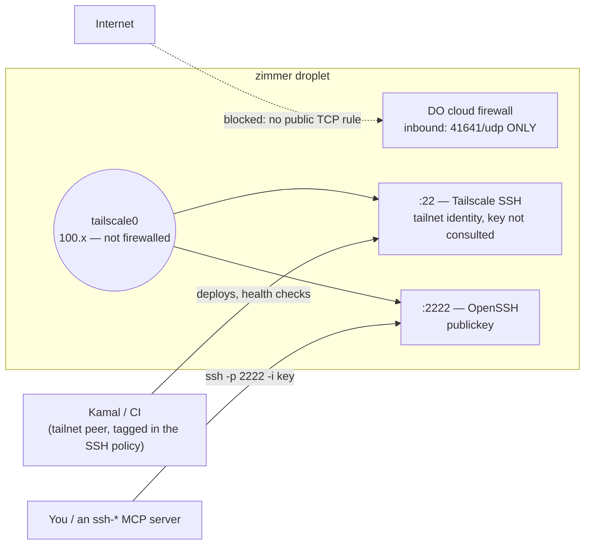

Getting a shell on a Zimmer droplet is one command:

```bash
ssh -p 2222 -i <your-operator-key> root@zimmer-staging
```

The port and the key are both load-bearing, and getting either wrong produces a failure that looks
like something else. This page explains the access path, then documents each trap in it. Most of them
stay invisible until they bite: sshd reports a config it isn't running, a port binds only IPv6,
publickey auth succeeds and the session dies anyway.

## SSH is tailnet-only

`digitalocean_firewall.zimmer` opens **no public TCP port at all**. The single inbound rule is
Tailscale's `41641/udp`:

```hcl
# infra/terraform/main.tf
inbound_rule {
  protocol         = "udp"
  port_range       = "41641"
  source_addresses = ["0.0.0.0/0", "::/0"]
}
```

There is no `22` rule, and adding one back is the thing not to do ([why](#never-re-open-public-tcp22)).
The tailnet is the only way in — for the app, for SSH, for break-glass.

On the tailnet interface, SSH is **two different servers**, and conflating them is where most of the
confusion here comes from:

| Port | Server | Authenticates by | Used by |
| --- | --- | --- | --- |
| `:22` | Tailscale SSH (`tailscale up --ssh`) | **tailnet identity**, against the tailnet's SSH policy. It does not consult the key your client offers | Kamal's deploys, CI, and `tailscale ssh root@zimmer-<env>` for break-glass |
| `:2222` | real OpenSSH (bound by an `ssh.socket` drop-in) | **publickey** (`admin_ssh_pubkeys` plus the Kamal key) | operators, and ssh2/publickey clients like an SSH-based MCP server |

A DigitalOcean cloud firewall filters the **public** interface only; it does not filter `tailscale0`.
So tailnet peers reach both ports and the internet reaches neither, with no firewall rule for either.



Because `:22` decides on identity rather than on your key, a key-bearing client can still get in there
— the deploy does exactly that, running `ssh root@"${STAGING_HOST}" 'docker ps …'` on the default port
— but the key is not what let it in; its tailnet identity was. When the identity does **not** satisfy
the policy, the connection closes during the handshake and the key you offered is irrelevant. That is
what `:2222` is for: a port where the key is what decides.

:::danger[Do not "simplify" this by disabling Tailscale SSH]
`:2222` exists because Tailscale SSH cannot serve plain publickey clients. It is an addition, not a
replacement. Drop `--ssh` from `tailscale up` and you cut the channel **Kamal deploys over**.

The evidence is on the box: production's sshd log shows **zero publickey authentications from a
`100.x` peer**. Every tailnet SSH session the deploy makes is handled by Tailscale SSH; OpenSSH has
never authenticated one. cloud-init says so too, so nobody has to rediscover it:

> `--ssh` is LOAD-BEARING, not a convenience: it hands tailnet :22 to Tailscale SSH, which is the
> channel Kamal deploys over (the droplet's sshd auth log shows zero publickey authentications from a
> 100.x peer). Dropping it would cut the deploy path.
:::

Only the firewall enforces the tailnet-only property. `:2222` binds `0.0.0.0`, so it is the *absence
of any TCP inbound rule* that keeps the internet out, not the bind. Detach
`digitalocean_firewall.zimmer` from the droplet and `:2222` is world-reachable immediately, with no
rule in Terraform to grep for. (It is key-only sshd, so the exposure is bounded — but the firewall is
the control.)

### The firewall is Terraform-managed, so hand-edits do not stick

`terraform apply` runs on **every** deploy. A rule you add through the DigitalOcean API or console is
drift, and the next deploy reverts it. Production's public `22/tcp` was re-opened by `apply` three
times after being closed by hand, because the rule was still in the code. The fix had to land in
`main.tf`.

The same is true in the other direction: you cannot hand-open a port to dig yourself out and expect it
to survive. Change the code, or use the two doors that always exist — `tailscale ssh root@zimmer-<env>`,
and the DigitalOcean web console.

## Connecting

**Your client must be on the tailnet.** Both name forms below resolve to a `100.x` CGNAT address,
which is unroutable from anywhere else — so an off-tailnet client does not fail fast with a clear
error, it **hangs** until it times out. If a connection hangs, check `tailscale status` before you
debug anything else. (Joining the tailnet, and the ACLs that govern it, are covered under
[Provisioning](/operate/provisioning/#tailscale-acls).)

There are two ways to name a droplet, and which one works depends on your client:

- **MagicDNS** — `zimmer` for production, `zimmer-<env>` for everything else (`local.tailnet_hostname`
  in `main.tf`). Always available, needs no DNS setup, and it is what `tailscale ssh` takes. It only
  resolves on a client that uses Tailscale's DNS.
- **A custom domain** — `zimmer.tadasant.com`, `staging.zimmer.tadasant.com` on this deployment. Set
  `var.domain` and the `domain-cert` workflow upserts a public A record pointing at the droplet's
  **tailnet** IP. Anyone can resolve it; only a tailnet peer can reach it. This is the form to use from
  a client that has no MagicDNS — a CI runner, a container — which is exactly why it exists.
  (`var.domain` is `""` by default, so a fresh self-hosted deployment has MagicDNS only until it is
  set.)

```bash
# Operator shell (real OpenSSH, publickey):
ssh -p 2222 -i <your-operator-key> root@zimmer-staging
ssh -p 2222 -i <your-operator-key> root@staging.zimmer.tadasant.com   # same box, custom domain

# Break-glass (Tailscale SSH — tailnet identity, no key involved):
tailscale ssh root@zimmer
```

For an SSH-based MCP server (Zimmer's private catalog wires up `ssh-agent-mcp-server`, an ssh2
publickey client), the same thing in env-var form:

```bash
SSH_HOST=zimmer.tadasant.com
SSH_PORT=2222
SSH_USERNAME=root
```

:::caution[`SSH_PORT` defaults to `22` — set it explicitly]
`ssh-agent-mcp-server` defaults `SSH_PORT` to `22`. Leave it unset and the MCP connects to **Tailscale
SSH**, which never looks at the key it offers. There is no "wrong port" error: the connection closes
during the handshake. Every SSH MCP entry pointed at a Zimmer box has to set `SSH_PORT=2222`.
:::

### Never a raw IP

Neither IP works the way you would hope, and a name is the only thing that stays correct:

- **The public IP is firewalled.** No TCP inbound rule means a connection to it is dropped, not
  refused, so it **hangs**. This is the most misleading failure mode on the box.
- **The tailnet IP moves.** Rebuild the droplet and Tailscale assigns a new `100.x` address — staging's
  went from `100.67.207.41` to `100.64.2.61` on one rebuild. A tailnet IP pinned in an MCP config or an
  `~/.ssh/config` goes stale silently.

The custom-domain A record is self-maintaining precisely because nothing pins that IP:
`scripts/domain-cert.sh` resolves the droplet's *current* tailnet IP from `tailscale status --json`
and upserts the Cloudflare record before it touches the cert. The staging deploy chains that workflow
after **every** deploy (and it also runs weekly), so a rebuilt box is followed by DNS on its own:

```text
[domain-cert] resolved zimmer-staging -> tailnet IP 100.64.2.61
[domain-cert] updated A record staging.zimmer.tadasant.com -> 100.64.2.61
```

## Operator keys

Operator and tooling keys are authorized for `root` through one variable, `admin_ssh_pubkeys`. Both
environments read the same list, so staging and production cannot drift on who can get in.

Edit it in **`infra/terraform/staging.tfvars.example`**, not in `staging.tfvars`. That is not a typo:
`deploy-staging.yml` runs `cp staging.tfvars.example staging.tfvars` verbatim before every apply, and
`*.tfvars` is gitignored. The example file *is* the tfvars.

```hcl
# infra/terraform/staging.tfvars.example
admin_ssh_pubkeys = [
  "ssh-ed25519 AAAA... zimmer-production-operator",      # the identity agent sessions hold
  "ssh-ed25519 AAAA... agent-orchestrator-prod-hetzner", # the orchestrator that drives the fleet
  "ssh-ed25519 AAAA... root@local",                      # the maintainer's break-glass laptop key
]
```

If you are forking Zimmer, those are **the author's** keys: replace them with your own, or the first
deploy authorizes a stranger for root on your droplet. A public key is not a secret, which is why they
are committed — but the list is per-environment configuration, not a default to inherit.

### The break-glass key

Two of those three entries only reach the box *through* something: the orchestrator key belongs to the
machine that runs Zimmer's own sessions, and the Kamal deploy key belongs to CI. When Zimmer is down,
or when a deploy is what broke, neither is a way in. The `root@local` entry is a human's key on a
laptop, authorized for root on every environment for exactly that case — nothing but the tailnet has
to be working for it to let you in.

It is deliberate, and it is the reason the same list is asserted on staging and production rather than
being tailored per environment. Do not prune it as a stray personal key.

Do **not** reach for `ssh_key_fingerprints` (DigitalOcean-registered keys) instead. It is `ForceNew` on
`digitalocean_droplet`, so adding a key there makes the deploy's auto-approved `terraform apply`
destroy and recreate the droplet — skipping the tailnet-node reap that only runs behind
`recreate_droplet`, which lands the replacement as `zimmer-<env>-1` and breaks the hostname the deploy
resolves. Leaving it empty is also what triggers [DigitalOcean's forced root-password
expiry](#digitalocean-force-expires-roots-password-and-that-rejects-every-openssh-session), which
cloud-init handles.

### Adding a key does not touch a running droplet

`admin_ssh_pubkeys` is interpolated into `user_data`, and the droplet carries `ignore_changes =
[user_data]`. **cloud-init runs once, at creation.** Editing the list produces no plan diff and reaches
no existing box; it decides who is authorized on the *next rebuild*. Two ways to converge it, and which
one you want depends on whether the box is disposable:

**Staging — rebuild it.** Run `deploy-staging` with `recreate_droplet=true` (a `terraform -replace` of
the droplet). Staging is disposable by design and this is the intended path. Read [the one fallback
door a rebuilt droplet has](/limitations/#a-rebuilt-droplet-has-exactly-one-fallback-door-and-it-is-the-digitalocean-console)
first: a rebuild whose `tailscale up` fails leaves you with only the DigitalOcean console.

**Production — append the key live, over Tailscale SSH.** Production cannot be casually recreated, so
a rebuild is not an option. Tailscale SSH on `:22` is, because it works regardless of what `:2222` is
doing:

```bash
tailscale ssh root@zimmer \
  "grep -qxF '$(cat operator_key.pub)' /root/.ssh/authorized_keys || \
   printf '%s\n' '$(cat operator_key.pub)' >> /root/.ssh/authorized_keys"
```

That is the same idempotent append cloud-init does at boot. The author automates it as an
`authorize-admin-keys-prod` workflow in the [private companion repo](/operate/companion-repo/), which
is the natural home for it — production's deploy pipeline lives there, not here. Either way, put the
key in `production.tfvars` as well, or the next rebuild drops it.

Removal has no such path. The cloud-init loop only ever **appends**, so taking a key out of
`admin_ssh_pubkeys` revokes nothing on a running droplet: that needs a rebuild, or an edit of
`authorized_keys` on the box. See [Admin keys are add-only](/limitations/#admin-keys-are-add-only).

:::note[One of these keys belongs to Zimmer's own sessions]
`zimmer-production-operator` is not an operator's key — it is the identity **agent sessions** hold.
`OperatorSshKeyProvisioner` writes its private half into the session container, which is what lets an
`ssh-*` MCP server attached to a session reach these hosts at all. See [the SSH identity an agent
session holds](/operate/provisioning/#the-ssh-identity-an-agent-session-holds).
:::

## Why sshd is configured the way it is

Four traps, every one of them silent. All four are also commented in
`infra/terraform/cloud-init.yaml.tftpl`; this is the prose version.

### `Port 2222` in `sshd_config` does not add a port. It moves one.

Ubuntu 24.04 **socket-activates** sshd, so the listen set belongs to `ssh.socket`, not `sshd_config`. A
`Port 2222` line there is not inert: `openssh-server` ships
`/usr/lib/systemd/system-generators/sshd-socket-generator`, which on every `daemon-reload` turns a
`Port`/`ListenAddress` line into a generated `ssh.socket` drop-in that **resets `ListenStream=` and
rewrites it**. So `Port 2222` *moves* sshd off `:22` instead of adding `:2222`, and you are left with
neither the listener you wanted nor the one you had.

A drop-in appends, which is what we want:

```ini
# /etc/systemd/system/ssh.socket.d/zz-tailnet-altport.conf
[Socket]
ListenStream=0.0.0.0:2222
ListenStream=[::]:2222
```

### The drop-in filename must sort after the generated one

Hence `zz-`. systemd applies drop-ins in filename order across all drop-in directories, and that
generated `addresses.conf` begins with a bare `ListenStream=` **reset**. A `10-` prefix would be
silently wiped the moment anyone adds a `Port` or `ListenAddress` line — the listener would vanish with
no error, at some unrelated future `daemon-reload`.

### Both address families, or IPv4 gets `Connection refused`

The shipped `ssh.socket` sets `BindIPv6Only=ipv6-only`. That is the **unit**, not the
`net.ipv6.bindv6only` sysctl (which is `0`), so reading the sysctl tells you nothing. A bare
`ListenStream=2222` therefore binds IPv6 only, and every IPv4 client gets `Connection refused` on a
port that `ss -tlnp` swears is listening. Both lines are required.

### `sshd_config.d` is first-match-wins, so a "later" hardening file loses

sshd takes the **first** value it sees for a keyword. The Ubuntu cloud image ships
`60-cloudimg-settings.conf` with `PasswordAuthentication no` — and cloud-init writes
`PasswordAuthentication yes` into `50-cloud-init.conf`, which sorts first. The `60` file's `no` never
won. **Root password auth was live on the public internet** while the config on disk said otherwise.

So the hardening drop-in is named to sort before `50`:

```ini
# /etc/ssh/sshd_config.d/10-hardening.conf
PasswordAuthentication no
PermitRootLogin prohibit-password
KbdInteractiveAuthentication no
```

Do not audit this by reading the files. Reading them is how it was missed in the first place. Read the
config with `sshd -T`, which resolves the precedence for you:

```bash
sshd -T | grep -E '^(passwordauthentication|permitrootlogin|kbdinteractive)'
```

Then confirm on the wire, because `sshd -T` has a lie of its own: it is a fresh *parse* of the files on
disk, not a readout of the running daemon. `ssh.socket` is `Accept=no`, so it hands its sockets to one
long-lived `sshd -D` that parsed its config once, at start. Write a hardening drop-in without
restarting `ssh.service` and `sshd -T` reports `passwordauthentication no` while the live daemon keeps
taking passwords — which is how the first, hand-applied fix on production sat inert. cloud-init
restarts **both** units for exactly this reason:

```yaml
- systemctl daemon-reload
- systemctl restart ssh.socket ssh.service
```

The only honest check is what the daemon advertises to a client:

```bash
ssh -o PubkeyAuthentication=no -o PreferredAuthentications=password -p 2222 root@zimmer-staging
# key-only  ->  Permission denied (publickey).
# still bad ->  Permission denied (publickey,password).
```

Both halves of this are also on the [limitations
page](/limitations/#neither-the-sshd-config-files-nor-sshd--t-tell-you-what-sshd-is-actually-doing).

## DigitalOcean force-expires root's password, and that rejects every OpenSSH session

Create a droplet with **no DO-registered SSH key** — which is what `ssh_key_fingerprints = []` does,
deliberately — and DigitalOcean sets a random root password, emails it out, and marks it as needing an
immediate change (`chage -d 0 root`, i.e. `lastchg=0` in `/etc/shadow`).

That flag is not cosmetic. `pam_unix`'s **account** stack refuses the session outright when
`lastchg == 0`, *after* publickey auth has already succeeded:

```console
$ ssh -p 2222 -i ~/.ssh/operator_key root@zimmer-staging 'hostname'
You are required to change your password immediately (administrator enforced).
Password change required but no TTY available.
```

So `:2222` authenticates you and then throws the session away. Your key is right, sshd is right, the
firewall is right, and nothing works. Tailscale SSH on `:22` never notices, because it authenticates by
tailnet identity and does not run `pam_unix` at all: Kamal deploys, CI health checks, and every
`tailscale ssh` break-glass keep succeeding on a box whose OpenSSH is entirely dead. Only a *real*
OpenSSH client can see this failure.

cloud-init drops the password in `runcmd`, ahead of the restart that puts sshd on `:2222`, so there is
no window in which the port answers and every session dies:

```yaml
- usermod -p '*' root
- chage -d $(date +%Y-%m-%d) -M -1 root
```

Root is key-only here, so the password has no legitimate use; removing it also invalidates the one
DigitalOcean emailed. `usermod -p '*'` sets an **invalid** hash — `passwd -d` would leave an *empty*
one, which means "no password required" rather than "no password login". `-M -1` disables aging, so it
cannot re-expire.

:::caution[cloud-init only runs at creation — a live box needs the converge script]
A droplet that already exists keeps `lastchg=0` forever; nothing re-runs `runcmd`. That is what
`scripts/clear-root-password-expiry.sh` is for. It goes in over Tailscale SSH on `:22` (the one path
the expiry does not block), it is convergent, and the staging deploy runs it on every deploy:

```bash
scripts/clear-root-password-expiry.sh zimmer          # or zimmer-staging
```

This is not a one-time migration. DigitalOcean's **Reset root password** flow plants a fresh password
and force-expires it again, so any box you use it on comes back with `lastchg=0` and a dead `:2222`
until the script runs. See [Production's forced root-password expiry has no converge
path](/limitations/#productions-forced-root-password-expiry-has-no-converge-path).
:::

## Never re-open public `tcp/22`

Not even temporarily, to test something. The old posture — `22/tcp` open to `0.0.0.0/0` against an sshd
that (first-match on `50-cloud-init.conf`) accepted **root password auth** — put both droplets under a
sustained brute-force flood, and that flood re-saturates a box within minutes of the port opening.

What it did is worse than the obvious:

- **Production** logged **1023 pre-auth failures per 2000 lines** of `journalctl -u ssh`.
- **Staging's sshd `MaxStartups` pre-auth queue was saturated**, to the point that `Exceeded
  MaxStartups` reset every connection *before the handshake*. To a client that surfaces as `read
  ECONNRESET` or "Connection lost before handshake". SSH was effectively **down**, and it looked
  nothing like an auth problem — you can lose an hour debugging your key.

Break-glass without a rule: `tailscale ssh root@zimmer-<env>`, or the DigitalOcean web console.

## Troubleshooting

| Symptom | Cause | Fix |
| --- | --- | --- |
| `Exceeded MaxStartups` in the server log; client sees `read ECONNRESET` or "Connection lost before handshake" | Public `tcp/22` is open and sshd's pre-auth queue is saturated by the brute-force flood. An **availability** failure, not an auth one | Close public `22` in `main.tf` — never by hand, [`apply` reverts that](#the-firewall-is-terraform-managed-so-hand-edits-do-not-stick) — and connect on `:2222` over the tailnet |
| Connection **hangs**, no error | You pointed at the **public IP** (firewalled: packets dropped, not refused), or your client is off the tailnet, so the `100.x` address is unroutable | Use a name, and check `tailscale status` |
| `Connection closed by … port 22`, and `ssh -v` shows `remote software version Tailscale` | You reached **Tailscale SSH** with a publickey client whose tailnet identity does not satisfy the SSH policy. Your key was never consulted | Add `-p 2222`. For an MCP server, set `SSH_PORT=2222` — it defaults to `22` |
| `Connection refused` on `:2222` from an IPv4 client, while the port looks bound | The `ssh.socket` drop-in listed only `ListenStream=2222`, and the unit's `BindIPv6Only=ipv6-only` made it IPv6-only | List both families: `ListenStream=0.0.0.0:2222` **and** `ListenStream=[::]:2222` |
| `Permission denied (publickey)` on `:2222` | Your key is not in `/root/.ssh/authorized_keys`. Adding it to `admin_ssh_pubkeys` does not reach a running box — cloud-init runs at creation only | [Converge it](#adding-a-key-does-not-touch-a-running-droplet): rebuild staging, or append the key live over Tailscale SSH on production |
| `You are required to change your password immediately` / `Password change required but no TTY available`, **after** publickey auth succeeds | DigitalOcean force-expired root's password (`lastchg=0`) and `pam_unix` refuses every session | `scripts/clear-root-password-expiry.sh <host>` — it goes in over Tailscale SSH, which the expiry does not affect |
| `sshd -T` says `passwordauthentication no`, but the daemon still takes passwords | `sshd -T` is a fresh parse, not the running daemon. `ssh.socket` is `Accept=no`, so one long-lived `sshd -D` holds the config it parsed at start | `systemctl restart ssh.socket ssh.service`, then verify [on the wire](#sshd_configd-is-first-match-wins-so-a-later-hardening-file-loses) |
| An `ssh-*` MCP server fails its healthcheck immediately | No private key in the container, or `SSH_PORT` left at its `22` default | Check the key exists and is `0600`; set `SSH_PORT=2222` |
| Nothing works at all, on any port | `tailscale up` failed at boot, so there is no `:22`, no `:2222`, and no public TCP | The DigitalOcean web console is the [only remaining door](/limitations/#a-rebuilt-droplet-has-exactly-one-fallback-door-and-it-is-the-digitalocean-console) |
