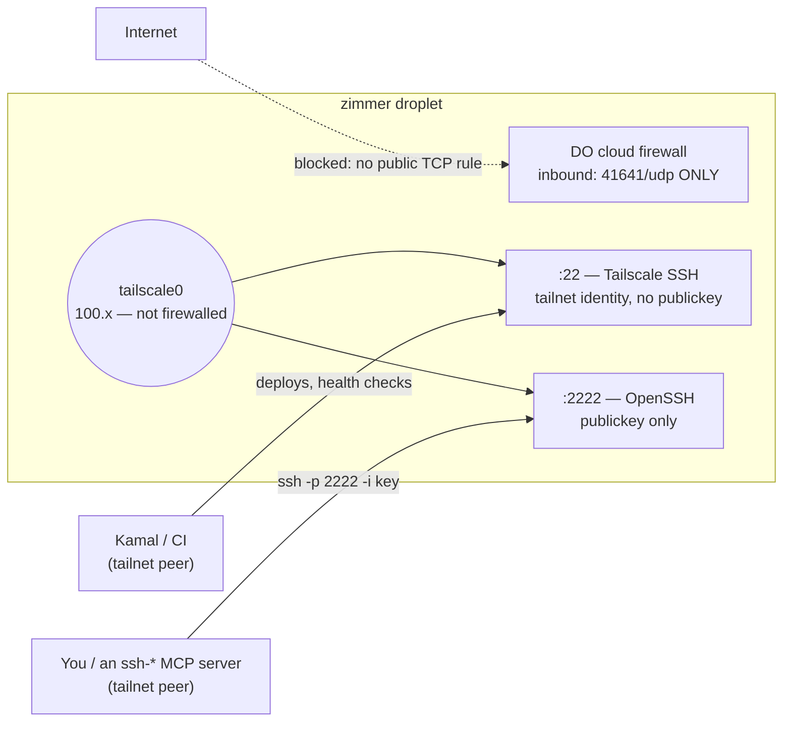

Getting a shell on a Zimmer droplet is one command:

```bash
ssh -p 2222 -i ~/.ssh/zimmer_operator root@zimmer.tadasant.com
```

Every part of that line is load-bearing — the port, the hostname, the key — and getting any of them
wrong produces a failure that looks like something else. This page explains the shape of the access
path, then documents each trap in it. Most of them are invisible until they bite: sshd reports a
config it isn't running, a port binds only IPv6, publickey auth succeeds and the session dies anyway.

## SSH is tailnet-only

`digitalocean_firewall.zimmer` opens **no public TCP port at all**. The single inbound rule is
Tailscale's `41641/udp`:

```hcl
# infra/terraform/main.tf
inbound_rule {
  protocol         = "udp"
  port_range       = "41641"
  source_addresses = ["0.0.0.0/0", "::/0"]
}
```

There is no `22` rule, and adding one back is the thing not to do ([why](#never-re-open-public-tcp22)).
The tailnet is the only way in — for the app, for SSH, for break-glass.

On the tailnet interface, SSH is **two different servers**, and conflating them is the single biggest
source of confusion here:

| Port | Server | Authenticates by | Used by |
| --- | --- | --- | --- |
| `:22` | **Tailscale SSH** (`tailscale up --ssh`) | tailnet identity — it **ignores publickey entirely** | **Kamal's deploys**, CI, and `tailscale ssh root@zimmer-<env>` for break-glass |
| `:2222` | **real OpenSSH** (bound by an `ssh.socket` drop-in) | publickey (`admin_ssh_pubkeys` + the Kamal key) | plain ssh2/publickey clients that cannot speak Tailscale SSH — your `ssh` command, the `ssh-agent-mcp-server` MCP |

A DigitalOcean cloud firewall filters the **public** interface only; it does not filter `tailscale0`.
So tailnet peers reach both ports and the internet reaches neither, with no firewall rule for either.



:::danger[Do not "simplify" this by disabling Tailscale SSH]
`:2222` exists *because* Tailscale SSH cannot serve plain publickey clients — not as a replacement for
it. Drop `--ssh` from `tailscale up` and you cut the channel **Kamal actually deploys over**.

The evidence is on the box: production's sshd auth log shows **zero** authentications from a tailnet
(`100.x`) peer. Kamal has never touched OpenSSH, and never will. cloud-init's comment says the same
thing, so nobody has to rediscover it:

> `--ssh` is LOAD-BEARING, not a convenience: it hands tailnet :22 to Tailscale SSH, which is the
> channel Kamal deploys over (the droplet's sshd auth log shows zero publickey authentications from a
> 100.x peer). Dropping it would cut the deploy path.

Leave `:22` to Tailscale. Point publickey clients at `:2222`.
:::

Only the firewall enforces the tailnet-only property, though — `:2222` binds `0.0.0.0`, so it is the
*absence of any TCP inbound rule* that keeps the internet out, not the bind. Detach
`digitalocean_firewall.zimmer` from the droplet and `:2222` is world-reachable immediately, with no
rule in Terraform to grep for. (It is key-only sshd, so the exposure is bounded — but the firewall is
the control.)

### The firewall is Terraform-managed, so hand-edits do not stick

`terraform apply` runs on **every** deploy. A rule you add through the DigitalOcean API or console is
drift, and the next deploy reverts it. That is not a theory: production's public `22/tcp` was
re-opened by `apply` three separate times after being closed by hand, because the rule was still in
the code. The fix had to land in `main.tf`.

The same is true in the other direction — you cannot hand-open a port to get yourself out of a jam and
expect it to survive. Change the code, or use the two doors that always exist: `tailscale ssh
root@zimmer-<env>`, and the DigitalOcean web console.

## Connecting

**You must be on the tailnet.** Both hostnames resolve to a `100.x` CGNAT address, which is
unroutable from anywhere else — so an off-tailnet client does not fail fast with a clear error, it
**hangs** until it times out. If a connection hangs, check `tailscale status` before you debug
anything else.

```bash
# Operator shell (real OpenSSH, publickey):
ssh -p 2222 -i ~/.ssh/zimmer_operator root@zimmer.tadasant.com
ssh -p 2222 -i ~/.ssh/zimmer_operator root@staging.zimmer.tadasant.com

# Break-glass (Tailscale SSH — no key involved, tailnet identity only):
tailscale ssh root@zimmer
tailscale ssh root@zimmer-staging
```

For an SSH-based MCP server (`ssh-agent-mcp-server` and friends), the same thing in env-var form:

```bash
SSH_HOST=zimmer.tadasant.com
SSH_PORT=2222
SSH_USERNAME=root
```

:::caution[`SSH_PORT` defaults to `22` — set it explicitly or the server fails]
`ssh-agent-mcp-server` defaults `SSH_PORT` to `22`. Leave it unset and the MCP quietly connects to
**Tailscale SSH**, which ignores the key it offers. There is no "wrong port" error; you get a closed
connection during the handshake. Every SSH MCP entry pointed at a Zimmer box must set `SSH_PORT=2222`.
:::

### Use the hostname, never a raw IP

Neither IP works the way you'd hope, and the hostname is the only self-maintaining option:

- **The public IP is firewalled.** No TCP inbound rule means a connection to it does not get refused,
  it **hangs**. This is the single most misleading failure mode on the box.
- **The tailnet IP moves.** Rebuild the droplet and Tailscale assigns a new `100.x` address. Staging's
  went from `100.67.207.41` to `100.64.2.61` on one rebuild. A pinned IP in an MCP config or an
  `~/.ssh/config` goes stale silently.

`zimmer.tadasant.com` and `staging.zimmer.tadasant.com` are A records pointing at the **tailnet** IP,
and the deploy re-points them on every rebuild — `scripts/domain-cert.sh` resolves the droplet's
current tailnet IP from `tailscale status` and upserts the Cloudflare record before it touches the
cert:

```text
resolved zimmer-staging -> tailnet IP 100.64.2.61
updated A record staging.zimmer.tadasant.com -> 100.64.2.61
```

So the hostname follows the box. That is also why the A record is public DNS pointing at a private
address: anyone can resolve it, only a tailnet peer can reach it. (MagicDNS names — `http://zimmer`,
`http://zimmer-staging` — work too, and are what `tailscale ssh` takes.)

## Operator keys

Operator and tooling keys are authorized for `root` through **one** variable, `admin_ssh_pubkeys`, set
per environment in `*.tfvars`. Both environments read the same list, so staging and production cannot
drift on who can get in.

```hcl
# infra/terraform/staging.tfvars.example
admin_ssh_pubkeys = [
  "ssh-ed25519 AAAA...replace-with-your-own-public-key you@example.com",
]
```

Do **not** use `ssh_key_fingerprints` (DigitalOcean-registered keys) instead. It is `ForceNew` on
`digitalocean_droplet`, so adding a key there makes the deploy's auto-approved `terraform apply`
destroy and recreate the droplet — skipping the tailnet-node reap that only runs behind
`recreate_droplet`, which lands the replacement as `zimmer-<env>-1` and breaks the hostname the deploy
resolves. Leaving it empty is also what triggers [DigitalOcean's forced root-password
expiry](#digitalocean-force-expires-roots-password-and-that-rejects-every-openssh-session), which
cloud-init handles.

### Adding a key does not touch a running droplet

`admin_ssh_pubkeys` is interpolated into `user_data`, and the droplet carries `ignore_changes =
[user_data]`. **cloud-init runs once, at creation.** So editing the list produces no plan diff and
reaches no existing box. It is really "who gets authorized on the next rebuild".

Two converge paths, and which one you use depends on whether the box is disposable:

| Environment | How a new key lands | Notes |
| --- | --- | --- |
| **staging** | Run **`deploy-staging`** with `recreate_droplet=true` (a `terraform -replace` of the droplet) | Staging is disposable by design; a rebuild is the intended path. Read [the one fallback door a rebuilt droplet has](/limitations/#a-rebuilt-droplet-has-exactly-one-fallback-door-and-it-is-the-digitalocean-console) first — a rebuild whose `tailscale up` fails leaves you with only the DigitalOcean console. |
| **production** | **`authorize-admin-keys-prod.yml`** in the [private companion repo](/operate/companion-repo/) | Reaches the live box over **Tailscale SSH** (`:22` — the one path that works regardless of `:2222`'s state) and appends the keys to `/root/.ssh/authorized_keys`. No rebuild. Production cannot be casually recreated, so this is the only sane path. Keep `admin_ssh_pubkeys` in `production.tfvars` in sync anyway, or the next rebuild drops the key. |

Removal is worse: the cloud-init loop only ever **appends**. Taking a key out of `admin_ssh_pubkeys`
revokes nothing on a running droplet — that needs a rebuild or a manual edit of
`authorized_keys`. See [Admin keys are add-only](/limitations/#admin-keys-are-add-only).

:::note[Zimmer's own session key]
Zimmer agent sessions get their own operator identity so the `ssh-*` MCP servers have a key to offer.
Where its private half is stored and how it reaches a session container is defined by the PR that
introduces it; this page will name the mechanism once that lands. Until then, sessions have no SSH
key, and any `ssh-*` MCP server attached to one fails its healthcheck for lack of an identity —
**not** for lack of firewall or ACL access.
:::

## Why sshd is configured the way it is

Four traps, all of them silent, all of them already paid for. Every one is also commented in
`infra/terraform/cloud-init.yaml.tftpl` — this is the prose version.

### `Port 2222` in `sshd_config` does not add a port. It moves one.

Ubuntu 24.04 **socket-activates** sshd, so the listen set belongs to `ssh.socket`, not `sshd_config`.
A `Port 2222` line there is not inert: `openssh-server` ships
`/usr/lib/systemd/system-generators/sshd-socket-generator`, which on every `daemon-reload` turns a
`Port`/`ListenAddress` line into a **generated `ssh.socket` drop-in that resets `ListenStream=` and
rewrites it**. `Port 2222` would move sshd **off** `:22` — killing Tailscale SSH's handoff and the
deploy with it — instead of adding `:2222`.

A drop-in *appends*, which is what we want:

```ini
# /etc/systemd/system/ssh.socket.d/zz-tailnet-altport.conf
[Socket]
ListenStream=0.0.0.0:2222
ListenStream=[::]:2222
```

### The drop-in filename must sort **after** the generated one

Hence `zz-`. systemd applies drop-ins in filename order across all drop-in directories, and that
generated `addresses.conf` begins with a bare `ListenStream=` **reset**. A `10-` prefix would be
silently wiped the moment anyone adds a `Port` or `ListenAddress` line — the listener would vanish
with no error, at some unrelated future `daemon-reload`.

### Both address families, or IPv4 gets `Connection refused`

The shipped `ssh.socket` sets `BindIPv6Only=ipv6-only`. That is the **unit**, not the
`net.ipv6.bindv6only` sysctl (which is `0`) — so reading the sysctl tells you nothing. A bare
`ListenStream=2222` therefore binds **IPv6 only**, and every IPv4 client gets `Connection refused` on
a port that `ss -tlnp` swears is listening. Both lines are required.

### `sshd_config.d` is first-match-wins, so a "later" hardening file loses

sshd takes the **first** value it sees for a keyword. The Ubuntu cloud image ships
`60-cloudimg-settings.conf` with `PasswordAuthentication no` — and cloud-init writes
`PasswordAuthentication yes` into `50-cloud-init.conf`, which sorts **first**. The `60` file's `no`
never won. **Root password auth was genuinely live on the public internet** while the config on disk
said otherwise.

That is why the hardening drop-in is named to sort before `50`:

```ini
# /etc/ssh/sshd_config.d/10-hardening.conf
PasswordAuthentication no
PermitRootLogin prohibit-password
KbdInteractiveAuthentication no
```

**Do not audit this by reading the files** — reading them is exactly how it was missed. Read the
config with `sshd -T`, which resolves the precedence for you:

```bash
sshd -T | grep -E '^(passwordauthentication|permitrootlogin|kbdinteractive)'
```

And then confirm on the wire, because `sshd -T` has a lie of its own: it is a fresh **parse** of the
files on disk, not a readout of the running daemon. `ssh.socket` is `Accept=no`, so it hands its
sockets to **one long-lived `sshd -D`** that parsed its config once, at start. Write a hardening
drop-in without restarting `ssh.service` and `sshd -T` will report `passwordauthentication no` while
the live daemon keeps taking passwords — which is exactly how the first, hand-applied fix on
production sat inert. cloud-init restarts **both** units for this reason:

```yaml
- systemctl daemon-reload
- systemctl restart ssh.socket ssh.service
```

The only honest check is what the daemon advertises to a client:

```bash
ssh -o PubkeyAuthentication=no -o PreferredAuthentications=password -p 2222 root@zimmer.tadasant.com
# key-only  ->  Permission denied (publickey).
# still bad ->  Permission denied (publickey,password).
```

## DigitalOcean force-expires root's password, and that rejects every OpenSSH session

Create a droplet with **no DO-registered SSH key** — which is exactly what `ssh_key_fingerprints = []`
does, deliberately — and DigitalOcean sets a random root password, emails it out, and marks it as
needing an immediate change (`chage -d 0 root`, i.e. `lastchg=0` in `/etc/shadow`).

That flag is not cosmetic. `pam_unix`'s **account** stack refuses the session outright when
`lastchg == 0`, *after* publickey auth has already succeeded:

```console
$ ssh -p 2222 -i ~/.ssh/zimmer_operator root@zimmer-staging 'hostname'
You are required to change your password immediately (administrator enforced).
Password change required but no TTY available.
```

So `:2222` authenticates you and then throws the session away. Your key is fine, sshd is fine, the
firewall is fine — and nothing works. Tailscale SSH on `:22` never notices, because it authenticates
by tailnet identity and does not run `pam_unix` at all: Kamal deploys, CI health checks, and every
`tailscale ssh` break-glass keep succeeding on a box whose OpenSSH is entirely dead. It is a failure
only a *real* OpenSSH client can see, which is what makes it maddening to diagnose.

cloud-init drops the password in `runcmd`, ahead of the restart that puts sshd on `:2222` — so there is
no window in which the port answers and every session dies:

```yaml
- usermod -p '*' root
- chage -d $(date +%Y-%m-%d) -M -1 root
```

Root is key-only here, so the password has no legitimate use; removing it also invalidates the one
DigitalOcean emailed. `usermod -p '*'` sets an **invalid** hash — `passwd -d` would leave an *empty*
one, which means "no password required" rather than "no password login". `-M -1` disables aging, so it
cannot re-expire later.

:::caution[cloud-init only runs at creation — a live box needs the converge script]
A droplet that already exists keeps `lastchg=0` forever; nothing re-runs `runcmd`. That is what
`scripts/clear-root-password-expiry.sh` is for. It goes in over Tailscale SSH on `:22` (the one path
the expiry does not block), is convergent, and the staging deploy runs it on **every** deploy:

```bash
scripts/clear-root-password-expiry.sh zimmer          # or zimmer-staging
```

This is not a one-time migration. DigitalOcean's **Reset root password** flow plants a fresh password
and force-expires it again, so any box you use it on comes back with `lastchg=0` and a dead `:2222`
until the script runs. See [Production's forced root-password expiry has no converge
path](/limitations/#productions-forced-root-password-expiry-has-no-converge-path).
:::

## Never re-open public `tcp/22`

Not even "temporarily, to test something". The old posture — `22/tcp` open to `0.0.0.0/0` against an
sshd that (first-match on `50-cloud-init.conf`) accepted **root password auth** — put both droplets
under a sustained brute-force flood, and the flood is still out there. It re-saturates within minutes
of the port opening.

What that actually did, which is worse than the obvious:

- **Production** logged **1023 pre-auth failures per 2000 lines** of `journalctl -u ssh`.
- **Staging's sshd `MaxStartups` pre-auth queue was fully saturated.** Roughly 100% of connections got
  `Exceeded MaxStartups` and were **reset before the handshake** — which surfaces to a client as
  `read ECONNRESET` or "Connection lost before handshake". SSH was effectively **down**, and it looked
  nothing like an auth problem. You will debug your key for an hour.

Break-glass without a rule: `tailscale ssh root@zimmer-<env>`, or the DigitalOcean web console.

## Troubleshooting

| Symptom | Cause | Fix |
| --- | --- | --- |
| `Exceeded MaxStartups` in the server log; client sees `read ECONNRESET` or "Connection lost before handshake" | Public `tcp/22` is open and sshd's pre-auth queue is saturated by the brute-force flood. This is an **availability** failure, not an auth one | Close public `22` in `main.tf` (never by hand — [apply reverts it](#the-firewall-is-terraform-managed-so-hand-edits-do-not-stick)) and connect on `:2222` over the tailnet |
| Connection **hangs**, no error | You pointed at the **public IP** (firewalled, no TCP rule → packets dropped, not refused), or your client is **off the tailnet** so the `100.x` address is unroutable | Use the hostname, and check `tailscale status` |
| `Connection closed by … port 22`, with `remote software version Tailscale` in `ssh -v` | You hit **Tailscale SSH** with a publickey client. It ignores your key | Add `-p 2222`. For an MCP server, set `SSH_PORT=2222` — it defaults to `22` |
| `Connection refused` on `:2222` from an IPv4 client, while the port looks bound | The `ssh.socket` drop-in listed only `ListenStream=2222`, and the unit's `BindIPv6Only=ipv6-only` made it **IPv6-only** | Both families: `ListenStream=0.0.0.0:2222` **and** `ListenStream=[::]:2222` |
| `Permission denied (publickey)` on `:2222` | Your public key is not in `/root/.ssh/authorized_keys`. Adding it to `admin_ssh_pubkeys` does **not** reach a running box — cloud-init runs at creation only | [Converge it](#adding-a-key-does-not-touch-a-running-droplet): rebuild staging, or run `authorize-admin-keys-prod.yml` for production |
| `You are required to change your password immediately` / `Password change required but no TTY available` — **after** publickey auth succeeds | DigitalOcean force-expired root's password (`lastchg=0`) and `pam_unix` refuses every session | `scripts/clear-root-password-expiry.sh <host>` (goes in over Tailscale SSH, which is unaffected) |
| `sshd -T` says `passwordauthentication no`, but the daemon still offers passwords | `sshd -T` is a fresh parse, not the running daemon. `ssh.socket` is `Accept=no`, so one long-lived `sshd -D` holds the config it parsed at start | `systemctl restart ssh.socket ssh.service`, then verify [on the wire](#sshd_configd-is-first-match-wins-so-a-later-hardening-file-loses) |
| An `ssh-*` MCP server fails its healthcheck immediately | Usually no private key in the session container at all, or `SSH_PORT` left at its `22` default | Check the key exists and is `0600`; set `SSH_PORT=2222` |
| Nothing works, and the box may have no tailnet | `tailscale up` failed at boot, so there is no `:22`, no `:2222`, and no public TCP | The DigitalOcean web console is the [only remaining door](/limitations/#a-rebuilt-droplet-has-exactly-one-fallback-door-and-it-is-the-digitalocean-console) |
