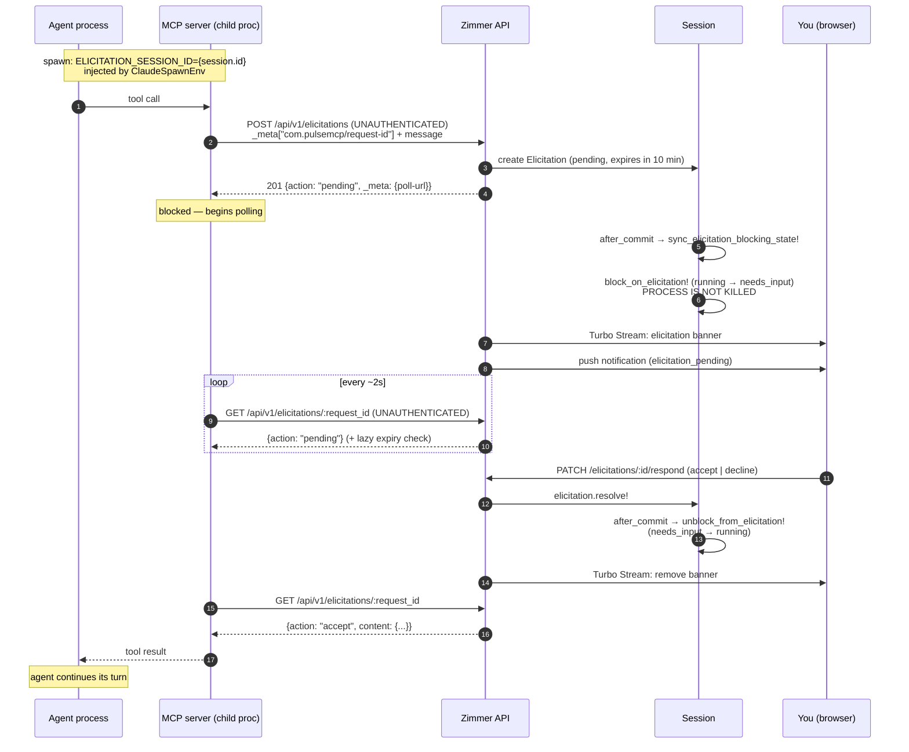

**Elicitation** is the MCP feature where a server pauses and asks the *user* something —
"which environment?", "confirm this deletion". The agent process stays alive and blocked while
the human answers.

This is genuinely hard in an orchestrator, because the human isn't at a terminal. Zimmer's answer:
surface the question as a banner in the web UI, flip the session to `needs_input` so it lands on
your homepage, and let the MCP server poll for your answer over HTTP.

## The round trip

The key insight in the design: `block_on_elicitation` deliberately does not call
`cleanup_running_job`. A normal `pause` tears down the agent process. Doing that here would
break the round-trip — the MCP server would poll forever into a corpse. So the session shows as
`needs_input` (for your attention queue and notifications) while the process stays alive.

## Statuses

`pending` → `accept` | `decline` | `expired`.

There is also a `cancel` status in the model, but no code path ever writes it. It's reserved.

## Expiry

Default 10 minutes (`Elicitation::DEFAULT_EXPIRATION`), overridable by the MCP server via
`_meta["com.pulsemcp/expires-at"]`.

Expiry happens two ways: lazily, on each poll (`expire_if_needed!`), and via
`CleanupExpiredElicitationsJob` every 5 minutes.

:::caution[Ten minutes is short]
Step away from your desk for a coffee and the agent's approval request dies. There's no
configuration for the default; an MCP server has to opt into a longer window itself.
:::

## Stranded blocks

If the reactive unblock is missed, the `blocked_on_elicitation` marker is left set with nothing to
clear it, and the session sits in `needs_input` showing a phantom "blocked on elicitation" that
never resolves. This happens when:

- a swallowed `AASM::InvalidTransition` (a state race) skips the `after` block that would have
  cleared the marker, or
- the MCP server crashes or is killed mid-round-trip, so no resolve or expire commit ever fires.

`CleanupExpiredElicitationsJob` calls `clear_stale_elicitation_block!` to restore the invariant.
It strips the marker but leaves the session in `needs_input` — flipping a minutes-stale block
back to `running` would create a phantom running session with no monitoring job.

## Known problems

:::danger[The elicitation endpoints are unauthenticated]
`POST /api/v1/elicitations` and `GET /api/v1/elicitations/:request_id` both call
`skip_before_action :authenticate_api_key`. This is required by the pulsemcp fallback-elicitation
protocol — the MCP child process has no API key.

The consequence: anyone who can reach the host can create an elicitation prompt for any session
id, or enumerate and poll any elicitation by `request_id`. Only `PATCH …/respond` is
authenticated.

The old `docs/ELICITATION_FLOW.md` claimed the opposite — that both endpoints inherit API-key auth
and showed `X-API-Key` in its request samples. That was wrong.
:::

:::danger[Elicitations silently do nothing on Codex]
`ELICITATION_SESSION_ID` is injected only by `ClaudeSpawnEnv#configure_elicitation_env`.
`CodexRuntimeAdapter` and `CliSpawnEnv` never set it.

A Codex session's MCP servers therefore have no session id to send, the controller logs a warning
about the blank session-id, and the elicitation is dropped. There is no user-visible error — the
agent hangs until its MCP call times out.
:::

:::note[The web and API respond endpoints key on different things]
`PATCH /elicitations/:id/respond` (web) takes the database primary key.
`PATCH /api/v1/elicitations/:id/respond` (API) takes the `request_id`.

Same verb, same-looking path, different identifier.

Also: the API uses `action_type`, not `action`, because `action` collides with a Rails reserved
param. Clients have to know that.
:::
