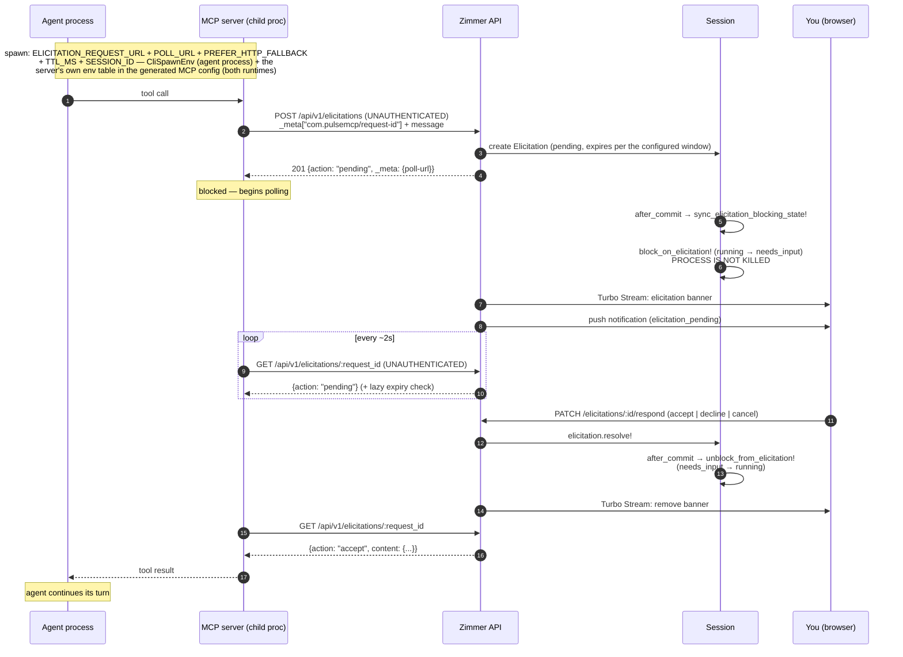

**Elicitation** is the MCP feature where a server pauses and asks the *user* something —
"which environment?", "confirm this deletion". The agent process stays alive and blocked while
the human answers.

This is genuinely hard in an orchestrator, because the human isn't at a terminal. Zimmer's answer:
surface the question as a banner in the web UI, flip the session to `needs_input` so it lands on
your homepage, and let the MCP server poll for your answer over HTTP.

## The round trip

```mermaid
sequenceDiagram
    autonumber
    participant P as Agent process
    participant M as MCP server (child proc)
    participant Z as Zimmer API
    participant S as Session
    participant U as You (browser)

    Note over P,M: spawn: ELICITATION_REQUEST_URL + POLL_URL + PREFER_HTTP_FALLBACK<br/>+ TTL_MS + SESSION_ID — CliSpawnEnv (agent process) + the<br/>server's own env table in the generated MCP config (both runtimes)
    P->>M: tool call
    M->>Z: POST /api/v1/elicitations (UNAUTHENTICATED)<br/>_meta["com.pulsemcp/request-id"] + message
    Z->>S: create Elicitation (pending, expires per the configured window)
    Z-->>M: 201 {action: "pending", _meta: {poll-url}}
    Note over M: blocked — begins polling
    S->>S: after_commit → sync_elicitation_blocking_state!
    S->>S: block_on_elicitation! (running → needs_input)<br/>PROCESS IS NOT KILLED
    Z->>U: Turbo Stream: elicitation banner
    Z->>U: push notification (elicitation_pending)

    loop every ~2s
        M->>Z: GET /api/v1/elicitations/:request_id (UNAUTHENTICATED)
        Z-->>M: {action: "pending"} (+ lazy expiry check)
    end

    U->>Z: PATCH /elicitations/:id/respond (accept | decline | cancel)
    Z->>S: elicitation.resolve!
    S->>S: after_commit → unblock_from_elicitation!<br/>(needs_input → running)
    Z->>U: Turbo Stream: remove banner
    M->>Z: GET /api/v1/elicitations/:request_id
    Z-->>M: {action: "accept", content: {...}}
    M-->>P: tool result
    Note over P: agent continues its turn
```

The key insight in the design: `block_on_elicitation` deliberately does not call
`cleanup_running_job`. A normal `pause` tears down the agent process. Doing that here would
break the round-trip — the MCP server would poll forever into a corpse. So the session shows as
`needs_input` (for your attention queue and notifications) while the process stays alive.

## Statuses

`pending` → `accept` | `decline` | `cancel` | `expired`.

`accept` and `decline` answer the question. `cancel` is the protocol's "dismissed without
answering" — the **Dismiss** button on the banner, `action_type: "cancel"` on
`PATCH …/respond`, and `"cancel"` on the `respond_to_elicitation` MCP tool. It ends the
round-trip with an outcome the polling server can read, instead of leaving a request nobody
intends to answer to sit out its full window. `expired` is the clock answering instead of a
person.

Only an `accept` carries content. Anything sent with a `decline` or a `cancel` is dropped rather
than stored and later replayed to the MCP server as if it were an answer.

## Expiry

Three sources, highest precedence first:

| Source | Set by | Scope |
| --- | --- | --- |
| `_meta["com.pulsemcp/expires-at"]` | the MCP server, per request | that one request |
| `ELICITATION_EXPIRATION_MINUTES` | the operator, in the deploy environment | this Zimmer instance |
| `Elicitation::DEFAULT_EXPIRATION` (60 minutes) | shipped default | fallback |

An MCP server that names its own deadline keeps it — it is the one party that knows how long its
call can stay open. Everything else gets the instance default. A blank
`ELICITATION_EXPIRATION_MINUTES` is treated as unset; a non-numeric or zero/negative one is logged
and ignored. A deploy never fails over this knob.

Every deadline, whoever names it, is held to `MIN_EXPIRATION`…`MAX_EXPIRATION` (1 minute … 7 days).
That bounds the MCP server's own `expires-at` too, because it arrives on an unauthenticated
endpoint: a timestamp already in the past would mint an elicitation that is born expired — one
that resolves straight into the "this approval request expired" banner on a session the caller does
not own — and one years out would pin a session in `needs_input`.

The default is an hour, not the ten minutes it used to be: the feature exists to tolerate a human
who is away from the desk, and a ten-minute fuse failed exactly the case it was for.

The default is applied on the model (`before_validation`), not only in the API controller, so an
elicitation created from anywhere gets a deadline. One with no `expires_at` at all is invisible to
both the `active` and the `expired_pending` scope — it would never block its session and nothing
would ever expire it.

Expiry happens two ways: lazily, on each poll (`expire_if_needed!`), and via
`CleanupExpiredElicitationsJob` every 5 minutes.

## When a round-trip ends without an answer

Two ways an approval request ends with nobody having decided, and both now say so on the session
page rather than leaving it looking merely idle.

**Expired.** The clock ran out. The MCP server's next poll is answered `expired`, so the agent does
get an answer of a kind and the session flips back to `running`. Zimmer records
`metadata["lost_elicitation"]` with reason `expired`, which the session page renders as a banner:
nobody answered, and the agent continued without approval.

**Stranded.** The `blocked_on_elicitation` marker outlived its elicitation entirely. This happens
when a swallowed `AASM::InvalidTransition` (a state race) skips the `after` block that would have
cleared the marker, or when the MCP server crashes or is killed mid-round-trip so no resolve or
expire commit ever fires. `CleanupExpiredElicitationsJob` calls `clear_stale_elicitation_block!`
every 5 minutes to restore the invariant "marker set ⇒ an active elicitation exists".

It strips the marker but leaves the session in `needs_input` — flipping a minutes-stale block back
to `running` would create a phantom running session with no monitoring job. What used to be missing
is the *explanation*: a session parked in `needs_input` with the banner gone and nothing to say why
is indistinguishable from one idling after a normal turn. So a stranded `needs_input` session also
gets `metadata["lost_elicitation"]` with reason `stranded`, and the page says the round-trip was
lost and the session is no longer blocked on it. A session that the sweep finds `running` (the
swallowed-transition case) gets the marker cleared and no banner — its agent never stopped, so
there is nothing for you to act on.

The marker is dropped the moment the session moves on: a resume, a new elicitation, or an
elicitation that actually gets answered.

## Known problems

:::danger[The elicitation endpoints are unauthenticated]
`POST /api/v1/elicitations` and `GET /api/v1/elicitations/:request_id` both call
`skip_before_action :authenticate_api_key`. This is required by the pulsemcp fallback-elicitation
protocol — the MCP child process has no API key.

The consequence: anyone who can reach the host can create an elicitation prompt for any session
id, or enumerate and poll any elicitation by `request_id`. Only `PATCH …/respond` is
authenticated.

That reach now extends past the transient banner: an elicitation that ends unanswered leaves a
`lost_elicitation` marker on the session, whose `summary` is the caller's own `tool_name` and
`message`, rendered in Zimmer's voice. It is escaped, truncated to
`Elicitation::SUMMARY_LIMIT` (300 characters) on write, and cleared the moment the session moves
on — but it is text a stranger can put on a session page.

The old `docs/ELICITATION_FLOW.md` claimed the opposite — that both endpoints inherit API-key auth
and showed `X-API-Key` in its request samples. That was wrong.
:::

## Where the request goes, and what happens when it can't get there

Five variables carry the address and the decision to use it:

| Variable | Value |
| --- | --- |
| `ELICITATION_REQUEST_URL` | `<AppUrl.base_url>/api/v1/elicitations` |
| `ELICITATION_POLL_URL` | the same collection URL — the client appends `/<request-id>` |
| `ELICITATION_PREFER_HTTP_FALLBACK` | `true` |
| `ELICITATION_TTL_MS` | `Elicitation.default_expiration` in milliseconds |
| `ELICITATION_SESSION_ID` | the Zimmer session id |

The last three are not decoration, and leaving any of them to the client's default breaks the
round trip in a way that looks exactly like a denial:

- **`ELICITATION_POLL_URL`.** `@pulsemcp/mcp-elicitation` decides whether the HTTP fallback tier
  exists at all with `Boolean(requestUrl && pollUrl)`, before it has made the POST that would have
  told it the poll URL. A request URL on its own leaves the whole tier invisible.
- **`ELICITATION_PREFER_HTTP_FALLBACK`.** The client's default order tries **native** MCP
  elicitation first and only then the HTTP fallback. Headless Claude Code advertises the
  elicitation capability with no human attached to answer, so the server asks the agent, the agent
  declines in milliseconds, and Zimmer is never asked. The library documents this flag for exactly
  that case — a runtime that "falsely advertises elicitation capability but cannot actually
  surface the prompt to a user."
- **`ELICITATION_TTL_MS`.** The client sends its own `com.pulsemcp/expires-at`, which
  [outranks](#expiry) Zimmer's default by design, and its built-in TTL is five minutes. That is a
  fuse measured in minutes, which fails precisely the away-from-the-desk case the hour-long
  default exists for.

All three failure modes end the same way: the MCP server returns `[REDACTED]` and the agent, quite
reasonably, reports that the request was declined — when in fact nobody was ever asked.

They are written in **two places**, because a stdio MCP server gets its environment two
different ways:

- `CliSpawnEnv#apply_elicitation_env` puts them on the agent CLI process. Claude Code hands a
  stdio server its own environment, so that reaches the server there.
- `RuntimeConfigPostProcessor#inject_elicitation_env!` writes them into each stdio server's own
  `env` table in the generated MCP config (`.mcp.json` / `.codex/config.toml`), at `air prepare`
  time. This is the only channel Codex honors: it rebuilds a server's environment from
  `HOME`/`LANG`/`PATH`/`PWD`/`SHELL` plus whatever the entry's own `env`/`env_vars` name. Measured
  on codex-cli 0.146.0, a stub stdio server spawned by `codex exec` from a shell where both
  variables were set received *neither* — so before this existed, every Codex approval POST went
  to the client's baked-in `http://zimmer/…` default and died as `fetch failed`.

A value already present in the session's `.env` wins in both places, so an operator can point a
server at a different Zimmer.

**Zimmer's value beats a catalog entry's own `env`** for these five keys, and only these five. The
address of Zimmer's own endpoint is Zimmer's to know; a copy in `mcp.json` is a duplicate that
goes stale without anything failing loudly — which is exactly what happened, a `http://zimmer`
left in a catalog entry shadowing the injected URL for months. Everything else in the entry's
`env` is merged around, never replaced: that table is where a server's credentials live.

One variable is deliberately *not* set: `ELICITATION_ENABLED`, because whether a server gates a
given action is that server's decision. The reported failure was the address, not the enablement,
and forcing it on would newly block sessions on approvals across every server at once.

The poll URL used to be on that list, on the reasoning that the create response carries
`_meta["com.pulsemcp/poll-url"]` and so the poll URL follows the request URL automatically. It does
— but only for a client that has already chosen the HTTP tier, and the client tests `requestUrl &&
pollUrl` to decide whether that tier is available in the first place. The response could never
arrive to fix an absence that stopped the request being made.

Naming the request URL is not cosmetic. With only `ELICITATION_SESSION_ID` set — which is all Zimmer
used to set, and only for Claude — the `@pulsemcp/mcp-elicitation` client fell back to its built-in
default, `http://zimmer/api/v1/elicitations`. That is a Tailscale MagicDNS name: it resolves on the
host, and not in the container agents run in. Every POST failed at connect, the client fell back to
"not approved", and the server returned `[REDACTED]`. From the agent's side that is indistinguishable
from a denial — a gate that fails closed *and* fails silently, which is how one session ended up
reading the secret it needed through the service account instead.

`ElicitationEndpointHealthCheckJob` probes the endpoint every 5 minutes from the host agents run on
(any HTTP response counts — a 404 for the probe id proves the request reached Rails; only a transport
failure is a broken gate) and records the result. It runs in production and staging;
[not in development](/operate/background-jobs/#why-the-elicitation-probe-doesnt-run-in-development),
where the URL it would probe describes your own laptop rather than anything agents depend on. When
the endpoint is unreachable, the job warns on every tick and pages once per incident, and `OrchestratorSystemPromptBuilder` puts the failure in the system prompt of every session
spawned while it is down: *the gate is broken, a redaction means nothing about policy, report it rather than
routing around it.* Sessions with MCP servers always get the healthy-case counterpart — a redacted
value **is** the gate's answer — so a redaction is never ambiguous.

:::caution[The probe checks the host, not the server]
It proves Zimmer's endpoint is reachable from where agents run. It cannot prove a given MCP server
reads these variables, or that it was launched with them — a server started before this change, or
one hard-coding its own URL, still fails the same way.
:::

:::note[`respond` takes either identifier; `show` takes only the `request_id`]
`PATCH /elicitations/:id/respond` (web) takes the database primary key.
`PATCH /api/v1/elicitations/:id/respond` (API) takes **either** the `request_id` or the primary
key, so whichever one you already hold works.

`GET /api/v1/elicitations/:id` stays `request_id`-only on purpose. It is unauthenticated for the
poll protocol, and accepting a primary key would turn it into a sequential-id enumeration of every
elicitation.

Also: the API uses `action_type`, not `action`, because `action` collides with a Rails reserved
param. Clients have to know that.
:::
