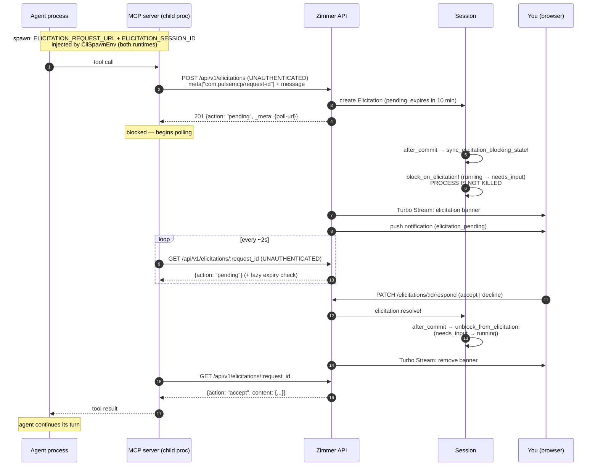

**Elicitation** is the MCP feature where a server pauses and asks the *user* something —
"which environment?", "confirm this deletion". The agent process stays alive and blocked while
the human answers.

This is genuinely hard in an orchestrator, because the human isn't at a terminal. Zimmer's answer:
surface the question as a banner in the web UI, flip the session to `needs_input` so it lands on
your homepage, and let the MCP server poll for your answer over HTTP.

## The round trip

```mermaid
sequenceDiagram
    autonumber
    participant P as Agent process
    participant M as MCP server (child proc)
    participant Z as Zimmer API
    participant S as Session
    participant U as You (browser)

    Note over P,M: spawn: ELICITATION_REQUEST_URL + ELICITATION_SESSION_ID<br/>injected by CliSpawnEnv (both runtimes)
    P->>M: tool call
    M->>Z: POST /api/v1/elicitations (UNAUTHENTICATED)<br/>_meta["com.pulsemcp/request-id"] + message
    Z->>S: create Elicitation (pending, expires in 10 min)
    Z-->>M: 201 {action: "pending", _meta: {poll-url}}
    Note over M: blocked — begins polling
    S->>S: after_commit → sync_elicitation_blocking_state!
    S->>S: block_on_elicitation! (running → needs_input)<br/>PROCESS IS NOT KILLED
    Z->>U: Turbo Stream: elicitation banner
    Z->>U: push notification (elicitation_pending)

    loop every ~2s
        M->>Z: GET /api/v1/elicitations/:request_id (UNAUTHENTICATED)
        Z-->>M: {action: "pending"} (+ lazy expiry check)
    end

    U->>Z: PATCH /elicitations/:id/respond (accept | decline)
    Z->>S: elicitation.resolve!
    S->>S: after_commit → unblock_from_elicitation!<br/>(needs_input → running)
    Z->>U: Turbo Stream: remove banner
    M->>Z: GET /api/v1/elicitations/:request_id
    Z-->>M: {action: "accept", content: {...}}
    M-->>P: tool result
    Note over P: agent continues its turn
```

The key insight in the design: `block_on_elicitation` deliberately does not call
`cleanup_running_job`. A normal `pause` tears down the agent process. Doing that here would
break the round-trip — the MCP server would poll forever into a corpse. So the session shows as
`needs_input` (for your attention queue and notifications) while the process stays alive.

## Statuses

`pending` → `accept` | `decline` | `expired`.

There is also a `cancel` status in the model, but no code path ever writes it. It's reserved.

## Expiry

Default 10 minutes (`Elicitation::DEFAULT_EXPIRATION`), overridable by the MCP server via
`_meta["com.pulsemcp/expires-at"]`.

Expiry happens two ways: lazily, on each poll (`expire_if_needed!`), and via
`CleanupExpiredElicitationsJob` every 5 minutes.

:::caution[Ten minutes is short]
Step away from your desk for a coffee and the agent's approval request dies. There's no
configuration for the default; an MCP server has to opt into a longer window itself.
Tracked in [#75](https://github.com/tadasant/zimmer/issues/75).
:::

## Stranded blocks

If the reactive unblock is missed, the `blocked_on_elicitation` marker is left set with nothing to
clear it, and the session sits in `needs_input` showing a phantom "blocked on elicitation" that
never resolves. This happens when:

- a swallowed `AASM::InvalidTransition` (a state race) skips the `after` block that would have
  cleared the marker, or
- the MCP server crashes or is killed mid-round-trip, so no resolve or expire commit ever fires.

`CleanupExpiredElicitationsJob` calls `clear_stale_elicitation_block!` to restore the invariant.
It strips the marker but leaves the session in `needs_input` — flipping a minutes-stale block
back to `running` would create a phantom running session with no monitoring job. Tracked in
[#75](https://github.com/tadasant/zimmer/issues/75).

## Known problems

:::danger[The elicitation endpoints are unauthenticated]
`POST /api/v1/elicitations` and `GET /api/v1/elicitations/:request_id` both call
`skip_before_action :authenticate_api_key`. This is required by the pulsemcp fallback-elicitation
protocol — the MCP child process has no API key.

The consequence: anyone who can reach the host can create an elicitation prompt for any session
id, or enumerate and poll any elicitation by `request_id`. Only `PATCH …/respond` is
authenticated.

The old `docs/ELICITATION_FLOW.md` claimed the opposite — that both endpoints inherit API-key auth
and showed `X-API-Key` in its request samples. That was wrong.
:::

## Where the request goes, and what happens when it can't get there

`CliSpawnEnv#apply_elicitation_env` puts three variables in the agent's environment, which its
stdio MCP servers inherit:

| Variable | Value |
| --- | --- |
| `ELICITATION_ENABLED` | `true` |
| `ELICITATION_REQUEST_URL` | `<AppUrl.base_url>/api/v1/elicitations` |
| `ELICITATION_SESSION_ID` | the Zimmer session id |

A value already present in the session's `.env` wins, so an operator can point a server at a
different Zimmer. The poll URL is deliberately *not* set: the create response carries
`_meta["com.pulsemcp/poll-url"]`, which Rails builds from the request it just received, so the poll
URL follows the request URL automatically.

Naming the request URL is not cosmetic. With only `ELICITATION_SESSION_ID` set — which is all Zimmer
used to set, and only for Claude — the `@pulsemcp/mcp-elicitation` client fell back to its built-in
default, `http://zimmer/api/v1/elicitations`. That is a Tailscale MagicDNS name: it resolves on the
host, and not in the container agents run in. Every POST failed at connect, the client fell back to
"not approved", and the server returned `[REDACTED]`. From the agent's side that is indistinguishable
from a denial — a gate that fails closed *and* fails silently, which is how one session ended up
reading the secret it needed through the service account instead.

`ElicitationEndpointHealthCheckJob` probes the endpoint every 5 minutes from the host agents run on
(any HTTP response counts — a 404 for the probe id proves the request reached Rails; only a transport
failure is a broken gate) and records the result. When it is unreachable, the job warns on every tick
and pages once per incident, and `OrchestratorSystemPromptBuilder` puts the failure in the agent's own
system prompt: *the gate is broken, a redaction means nothing about policy, report it rather than
routing around it.* Sessions with MCP servers always get the healthy-case counterpart — a redacted
value **is** the gate's answer — so a redaction is never ambiguous.

:::caution[The probe checks the host, not the server]
It proves Zimmer's endpoint is reachable from where agents run. It cannot prove a given MCP server
reads these variables, or that it was launched with them — a server started before this change, or
one hard-coding its own URL, still fails the same way.
:::

:::note[The web and API respond endpoints key on different things]
`PATCH /elicitations/:id/respond` (web) takes the database primary key.
`PATCH /api/v1/elicitations/:id/respond` (API) takes the `request_id`.

Same verb, same-looking path, different identifier.
Tracked in [#82](https://github.com/tadasant/zimmer/issues/82).

Also: the API uses `action_type`, not `action`, because `action` collides with a Rails reserved
param. Clients have to know that.
:::
