A **goal** is the session's definition of done. It's the mechanism behind closed-loop autonomy:
an agent should verify its work before it comes back to you.

## The four goals that ship

From `config/goals.json`:

| ID | What it demands |
| --- | --- |
| `codebase-question` | Research and answer inline. Do not create files, PRs, or branches. Stop in `needs_input`. |
| `open-reviewed-green-pr` | Open a PR, block until CI is green, run an independent fresh-eyes review, address all its feedback, re-check CI, write a `## Verification` section with checked boxes and proof. Then stop. The default for most roots. |
| `open-reviewed-green-pr-with-version-bump` | Same, plus a mandatory version bump when server source changed. |
| `e2e-verified-green-pr` | Same, plus: state the critical path up front, spin up a real dev server, drive it with browser automation, record video and screenshots, embed them in the PR. |

Every one of them ends with the same two instructions: stop and wait in `needs_input`, and
do not archive yourself — because an open session with an unreviewed PR is the user's to-do
list.

## How a goal is applied

```mermaid
sequenceDiagram
    participant S as Session
    participant J as AgentSessionJob
    participant G as GoalsConfig
    participant P as Agent process

    J->>S: read session.goal (a string column)
    J->>G: GoalsConfig.find(goal)
    alt known goal id
        G-->>J: goal.description
    else unknown string
        Note over J: falls through as free text
    end
    J->>J: build_prompt_with_goal
    Note over J: prompt + "The user has indicated the goal<br/>for this task is: {description}.<br/>Hand back control AS SOON as the goal<br/>is satisfied…"
    J->>J: append {session-notes} block if present
    J->>P: spawn with the concatenated prompt
```

That is the entire mechanism. `AgentSessionJob#build_prompt_with_goal` resolves the goal id to
its description (or passes an unknown string through verbatim as free text) and appends it to
the prompt.

:::danger[A goal has zero runtime enforcement]
Nothing in Zimmer checks that CI actually went green. Nothing verifies a review happened. Nothing
inspects the PR description for the `## Verification` section it demanded. The state machine's
`pause` event fires when the CLI process exits, full stop — it does not ask whether the goal was
met.

The stop condition is enforced only by the LLM choosing to obey English.

This is the single biggest gap between what Zimmer's docs (and its own goal text) promise and
what the code does. Know this before you trust an autonomous session's "done."
:::

A blank base prompt short-circuits the whole thing — a guard against spawning an agent whose
entire prompt is a bare goal string.

## Where a goal comes from

Precedence, in order:

1. Explicit `goal` param at session creation (UI form or `POST /api/v1/sessions`).
2. The agent root's `default_goal` from `roots.json`.
3. Nothing — the column is nullable, and the goal suffix is simply not appended.

It can be changed after the fact: `PATCH /api/v1/sessions/:id` accepts `goal`, and a follow-up
prompt can carry a new one.

The column is validated on length only (`GOAL_MAX_LENGTH`). Any string is a legal goal.

## The heartbeat

A session can have `heartbeat_enabled` with an interval (30–86,400 seconds). `HeartbeatSweepJob`
runs every 30 seconds and, for each due `needs_input` session with a heartbeat, injects an
automated nudge prompt and resumes it — the "keep working toward your goal" loop.

It deliberately skips sessions that are blocked on an elicitation or that have pending enqueued
messages, because resuming those would spawn a second process against the same clone.

:::note[The sweep's own code flags a duplication]
`HeartbeatSweepJob`'s comment: *"That 4-line sequence is duplicated across several callers — a
future refactor could extract a shared `Session#deliver_follow_up!`."* The
follow-up-delivery logic exists in at least three places.
:::

## `needs_input` vs `archived`

This trips people up. A session reaching `needs_input` is *normal* — it means the agent finished
a turn. A session reaching `archived` means someone (or something) explicitly archived it:

- You archived it in the UI.
- The agent called `action_session` with `archive` through Zimmer's self-session MCP server.
- A health monitor archived it.

Agents are told, in the goal text *and* in `OrchestratorSystemPromptBuilder`, not to self-archive
when a human still needs to read their output. Whether they comply is, again, a matter of the
model obeying English.
