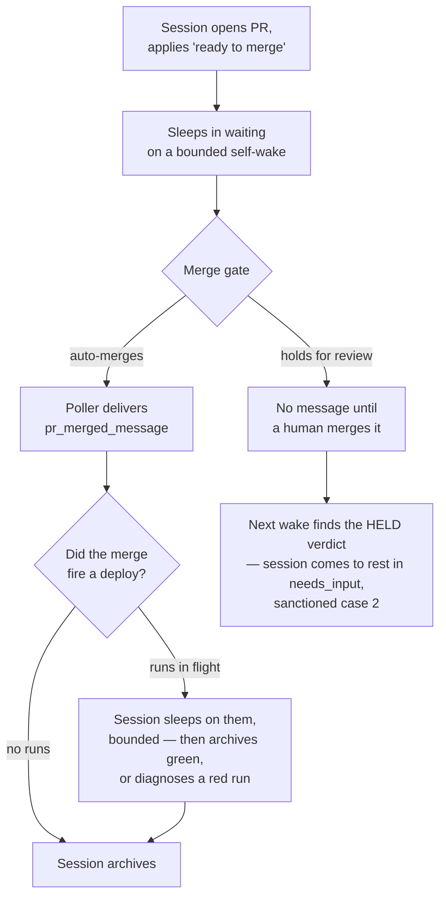

A **goal** is the session's definition of done. It's the mechanism behind closed-loop autonomy:
an agent should verify its work before it comes back to you.

## The four goals that ship

From `config/goals.json`:

| ID | What it demands |
| --- | --- |
| `codebase-question` | Research and answer inline. Do not create files, PRs, or branches. Stop in `needs_input` if a human asked; report back to the parent and archive if a session did. |
| `open-reviewed-green-pr` | Open the PR through the `open-pr` skill, block until CI is green, run an independent fresh-eyes review, address all its feedback, re-check CI, write a `## Verification` section with checked boxes and proof, then apply the `ready to merge` label. Then hold the PR the way that skill's terminal steps say to, and archive when the PR merges. The default for most roots. |
| `open-reviewed-green-pr-with-version-bump` | Same, plus a mandatory version bump when server source changed. |
| `e2e-verified-green-pr` | Same, plus: state the critical path up front, spin up a real dev server, drive it with browser automation, record video and screenshots, embed them in the PR. |

All three PR goals name the `open-pr` skill as the canonical way to commit, push, open, and
finalize the PR — agents are told not to hand-roll their own commit/push/PR sequence when that
skill is available. The skill's terminal act is applying the `ready to merge` label, and the
goal text makes that label part of "done."

The label is deliberately disambiguated in the goal text, because its name collides with the
"do not merge your own PR" instruction. Applying `ready to merge` does **not** merge the
PR and does **not** claim a human has reviewed it — it is the agent's own claim that self-review,
fresh-eyes review, and green CI are complete. It is fully compatible with leaving the PR
unmerged; "do not merge" is not a reason to skip the label.

The three PR goals then end by telling the agent to **hold the PR and archive when it merges**.
The session that opened a PR is the session holding the work's context, so it is the one a human
comes back to while the PR's disposition is unsettled.

*How* it holds is delegated to the `open-pr` skill rather than spelled out as "stop in
`needs_input`", because the skill's terminal step draws a finer line: a PR merely waiting for the
merge gate to rate it is a machine wait, while a PR the gate has *held* is a human handoff, and
only the second belongs in the action queue. So the skill has the session schedule a bounded
self-wake — three wakes, 30 minutes apart — and sleep in `waiting`, checking the PR's state on
each wake: merged or closed unmerged means archive, a fresh gate `HELD` verdict or a spent wake
budget means come to rest in `needs_input`, and a PR still open and unrated means sleep again. A
sleeping session holds the PR exactly as a parked one does — `Session.with_github_prs` excludes
only `archived` and `failed`, so the poller still sees it — with one difference in delivery: a
`needs_input` session takes the merge message immediately, while a `waiting` one has it enqueued
and picks it up at its next wake. The goal text keeps a fallback for runtimes and repos that do
not ship the skill: come to rest in `needs_input` holding the PR.

Nothing has to watch for the merge. `GithubPrPollPassJob` sweeps unarchived sessions with
recorded PR URLs, and on the open → merged transition it delivers `AutomatedPrompts.pr_merged_message`
to the session. That message is the archive signal, and it makes the queue self-draining:

```mermaid
flowchart TD
    A["Session opens PR,<br/>applies 'ready to merge'"] --> B["Sleeps in waiting<br/>on a bounded self-wake"]
    B --> C{"Merge gate"}
    C -->|auto-merges| D["Poller delivers<br/>pr_merged_message"]
    D --> H{"Did the merge<br/>fire a deploy?"}
    H -->|"no runs"| E["Session archives"]
    H -->|"runs in flight"| I["Session sleeps on them,<br/>bounded — then archives green,<br/>or diagnoses a red run"]
    I --> E
    C -->|holds for review| F["No message until<br/>a human merges it"]
    F --> G["Next wake finds the HELD verdict<br/>— session comes to rest in needs_input,<br/>sanctioned case 2"]
```

**The one exception to "merged means archive" is a merge that fires a deploy**, and the goal text
conditions it on something the session can actually read rather than on a guess: the merge message
itself reports the workflow runs the merge created. Names none and the session archives immediately,
exactly as before. Names runs still in flight and the session sleeps on them, bounded, then archives
when they are green or diagnoses the one that went red, because it holds more context about the
change than anything that would pick the failure up later. Which branch a repository lands on is a
property of that repository: one with no workflow on pushes to its default branch never waits, while
one with one — Zimmer's own repo has two — waits on most merges, deliberately, since a red `main` or
a failed release build is the merging session's business too. See [What a merged
PR tells the session](/operate/background-jobs/#what-a-merged-pr-tells-the-session).

Both outcomes are correct by construction, and neither needs a human to tidy up. A held PR puts
its session in the queue, which is the point — and when that human merges it, the same signal
releases the session. A merged PR drains its own session out. A PR closed without merging ends the
work, and the session archives on that too.

The stop is conditional, and the condition is the merge message rather than a person's attention.
A goal that makes a human the only thing able to release a session is what leaves sessions in
`needs_input` for weeks after their PR has landed.

Three cases stop the message arriving at all — an unrecorded PR URL, a merge the poller never saw
open, and a swallowed delivery — and a session that hits one waits forever. The goal text tells the
agent to check `get_session` for a recorded URL before settling in. See [Limitations](/limitations/).

`codebase-question` stops for a different reason, and only when a human invoked the session
directly. A research session a parent spawned reports its answer back to the parent and archives.

## How a goal is applied

```mermaid
sequenceDiagram
    participant S as Session
    participant J as AgentSessionJob
    participant G as GoalsConfig
    participant P as Agent process

    J->>S: read session.goal (a string column)
    J->>G: GoalsConfig.find(goal)
    alt known goal id
        G-->>J: goal.description
    else a sentence (free text)
        Note over J: passed through verbatim
    end
    J->>J: build_prompt_with_goal
    Note over J: prompt + "The user has indicated the goal<br/>for this task is: {description}.<br/>Hand back control AS SOON as the goal<br/>is satisfied…"
    J->>J: append {session-notes} block if present
    J->>P: spawn with the concatenated prompt
```

`AgentSessionJob#build_prompt_with_goal` resolves the goal id to its description (or passes a
free-text goal through verbatim) and appends it to the prompt. That is how a goal reaches the
agent: as English. What the agent does with it is still up to the agent.

A blank base prompt short-circuits the whole thing — a guard against spawning an agent whose
entire prompt is a bare goal string.

## How a goal is checked

The prompt is the request. The **goal check** is Zimmer reading back the parts of that request
it can see for itself. Each goal in `config/goals.json` lists its `checks`, and `GoalCheck`
evaluates them against state the session already records:

| Check | Read from | Met when |
| --- | --- | --- |
| `pull_request_open` | the PRs `GithubPrUrlHook` saw the session open, and their polled status | a recorded PR is open or merged. A PR closed without merging does not count |
| `ci_green` | `github_pull_request_ci_statuses` | CI on every live PR passes, or the PR has merged |
| `verification_section` | the PR description | it has a heading that starts with "Verification" |
| `verification_boxes_checked` | the PR description | the Verification section has at least one checked box, and the description has no unchecked box anywhere |
| `ready_to_merge_label` | the PR's labels | `ready to merge` is applied, or the PR has merged |
| `no_pull_request` | the recorded PRs | the session recorded none |

The three PR goals use the first five checks. `codebase-question` uses `no_pull_request`, because
it tells the agent not to open a PR at all.

**A PR a spawned session recorded counts.** A router hands its work to a session it spawns, and the
child's transcript is the one that opens the PR, so the PR is recorded on the child. A session whose
goal asks for a PR and that recorded none of its own is judged on the PRs recorded by the sessions it
spawned, up to three generations down (a backlog top-up spawns a router, which spawns the
implementer). The result names them: `delegated_session_ids` in the JSON, "Judged on PRs recorded by
session #N" on the page, and `pull_request_open` reads `owner/repo#12 merged (via session #N)`.
`no_pull_request` still reads only the session's own record, so a read-only session is not charged
with a PR its child opened.

The PR description and labels come from the poll pass's existing `gh pr view` reading. `body` and
`labels` were added to that call, so the check costs no extra GitHub calls. `Github::GoalFactsEvaluator`
cuts the description down to the few facts the checks need and stores those, not the text. It
skips what a reader of the rendered PR would not see: fenced code blocks and HTML comments. A PR
template's commented-out checklist therefore counts for nothing.

Each check answers `met`, `unmet`, `pending` (waiting on something that settles by itself, such
as CI still running) or `unknown` (Zimmer has no reading that could decide it). The verdict is
`unmet` if any check is unmet, `met` if every check is met, and `pending` otherwise. It is
computed when read rather than stored, so it always matches the PR badge and never goes stale on
its own. It shows up in three places:

- the **Goal check** section on the session page, just under Status, repainted when a PR reading,
  the goal, or the session's status changes
- a `### Goal Check (advisory)` section in the MCP `get_session` output
- `goal_check` on every session in the REST API (`null` for a free-text goal)

A verdict is `provisional` until the session comes to rest: while it is `running`, or `waiting` for
its next turn, an unmet criterion is work in progress rather than a claim of completion.

A free-text goal gets no check, because there is nothing to check it against. Neither does a
session with no goal.

## Measuring the check

Whether the check reads right is a question about real sessions, so it has a page:
**Outcomes → Goal checks** (`/outcomes/goal_checks`), the `goal_checks` view of MCP
`get_outcome_analysis`, and `GET /api/v1/goal_checks`. All three render `GoalCheckTally` over
sessions that came to rest (`needs_input` or `archived`), windowed on created-at, with the Outcomes
filters for agent root, harness and model. A missing start date means seven days before the end
date, or before today, so the window is always bounded. It shows:

- verdict counts, and each criterion's met / unmet / pending / unknown split
- sessions grouped by **which criteria kept them from `met`**, with sample session ids. A misread
  shows up as one criterion set with a large count
- rows by agent root and by goal, and how many sessions were judged on a spawned session's PRs
- **unmet on its own pull request**: sessions at rest, holding a PR they recorded, and unmet only on
  what that PR shows on GitHub. That is exactly who a re-prompt would reach, listed one by one

The first reading was taken on 2026-09-13 from production, over the 502 sessions with a catalog goal
that came to rest after being created between 2026-09-07 and 2026-09-13:

| | Sessions | Met | Unmet | Pending |
| --- | --- | --- | --- | --- |
| At rest before the check shipped (2026-09-11) | 309 | 0 | 132 | 177 |
| At rest after it shipped | 193 | 125 | 68 | 0 |

It found two false readings, both fixed:

- **167 `pending` sessions had never had their description read.** Every one came to rest before
  the `body,labels` fetch deployed, and the poll pass stops visiting a session once it is archived,
  so none ever would be read. Scored against the PR descriptions as they stand, 166 were `met` and 1
  was still `pending`. No session that came to rest after the deploy is in this state, so it is a
  deploy-transition artifact, not a recurring gap.
- **55 of the 68 `unmet` sessions after the deploy were routers**, each reading "no pull request
  recorded". 50 of them had spawned a session that recorded the PR. That is what the spawned-session
  reading above fixes.

Of the remaining 13, 12 recorded no PR at all: alert triage and other work that ended without one,
plus three whose PR Zimmer never recorded (see
[Limitations](/limitations/#pr-ownership-is-a-transcript-heuristic-and-both-ways-of-being-wrong-are-silent)).
One was unmet on its own PR, on the label alone, and its agent had withheld that label on purpose
while a human decided on the design.

:::caution[A goal is checked, not enforced]
The goal check is advisory, and nothing acts on it. An `unmet` verdict does not fail the session,
stop it archiving, or send it another prompt. The `pause` event still fires when the CLI process
exits, whatever the check says.

Failing the session or blocking its archive was rejected outright: a check that misreads a PR (a
repo with no CI, a label withheld on purpose, a checklist written some other way) would trap a
finished session, and the person who noticed would be the one whose work stalled.

**A one-time re-prompt was measured and not built.** The proposal was a single follow-up, opt-in and
capped, naming the unmet criteria to a session that stayed at rest with its own PR unmet. The
reading above has exactly one session that rule would have reached in two days, and it was the
session holding its label back for a human. Re-prompting it would have pushed an agent to apply a
label over a human hold. The `open-pr` skill sends a session to `needs_input` precisely when its
label is off, so "at rest with no label" is that skill's deliberate handoff, not a missed step. Zero
true positives and one harmful one is not a feature. The Goal checks page keeps that population
counted, so the question can be asked again when it is not empty.

It also covers only what Zimmer can read. Whether a fresh-eyes review happened, whether the
`open-pr` skill was used, whether the screenshots are real: none of that is visible from GitHub
state, so it is still the agent's word. A `met` means "nothing Zimmer can see contradicts the
goal", not "the goal was met". See [Limitations](/limitations/#a-goal-is-checked-not-enforced).
:::

## Where a goal comes from

Precedence, in order:

1. Explicit `goal` param at session creation (UI form or `POST /api/v1/sessions`).
2. The agent root's `default_goal` from `roots.json`.
3. Nothing — the column is nullable, and the goal suffix is simply not appended.

It can be changed after the fact: `PATCH /api/v1/sessions/:id` accepts `goal`, and a follow-up
prompt can carry a new one — through `POST /api/v1/sessions/:id/follow_up`, the MCP `action_session`
`follow_up` action, or the enqueued-message editor, the one web surface with a goal field on a
message. A follow-up goal is applied whether the prompt is sent straight through, queued behind a
running turn, or interrupted in; a blank one preserves the goal the session already has rather than
clearing it (see
[the REST API reference](/extend/rest-api/#following-up-and-the-goal-that-rides-along)).

**A `reuse_session` trigger is the one writer that is not a person typing.** Every fire re-stamps
the trigger's own goal onto the session it reuses, so the trigger — not the session row — is the
source of truth for a session a recurring trigger owns. That has an operator-visible edge: a goal
changed on such a session through `change_goal` or the web **Goal** field is reverted on the trigger's
next fire. Change it on the trigger instead. A trigger with a blank goal writes nothing, which is what
keeps a per-session wake from erasing the goal of the session it wakes — see
[what the fire re-stamps onto the reused session](/sessions/triggers/#what-the-fire-re-stamps-onto-the-reused-session).

**A goal is either a catalog id or a sentence.** A single word shaped like an id (ASCII letters and
digits joined by `-`, `_` or `.`) can only have been meant as one, so it has to be an id
`config/goals.json` knows. A sentence in a script written without spaces is not id-shaped and
stays free text. Anything else is refused with
the list of known ids, so a typo like `open-reviewd-green-pr` fails where it was typed instead of
reaching the agent as its goal. The check is `GoalsConfig.unknown_id?`, and it runs wherever a
goal is stored:

- as a model validation (`goal_reference`) on `Session`, `Trigger` and `EnqueuedMessage`, which
  covers `POST` and `PATCH /api/v1/sessions`, the web forms, the MCP `change_goal` action and the
  trigger editors
- as an early refusal on every follow-up surface (the REST and MCP `follow_up`, the web follow-up
  form, the enqueued-message editor), before anything is written or delivered
- in MCP `start_session`, before the id is swapped for its description

It judges only a goal that is being **changed**. A session or trigger that already holds an id
since retired from the catalog keeps working. Its other fields still save, its follow-ups still
go through, and a trigger fire with such a goal spawns its session with no goal and logs why,
the same way it drops an artifact the catalog no longer has. A queued message that carries one,
because it was queued before the check existed, is delivered without its goal:
`Sessions::FollowUpGoal.apply!` logs the id and leaves the session's goal alone rather than failing
the delivery. A fork copies its source's goal as it is (`goal_inherited`), so forking such a session,
and the status summary that works by forking it, still succeeds. The column is also capped at
`GOAL_MAX_LENGTH`.

## The heartbeat

A session can have `heartbeat_enabled` with an interval (30–86,400 seconds). `HeartbeatSweepJob`
runs every 30 seconds and, for each due `needs_input` session with a heartbeat, injects an
automated nudge prompt and resumes it — the "keep working toward your goal" loop.

It deliberately skips sessions that are blocked on an elicitation or that have pending enqueued
messages, because resuming those would spawn a second process against the same clone.

The nudge goes out through `Session#deliver_follow_up!`. Five entry points share it: the web
follow-up form, triggers, the GitHub comment and merge-conflict pollers, and this sweep. The method
clears the stale per-turn metadata, transitions the session to running, stamps the prompt where the
recovery paths look for it, enqueues `AgentSessionJob`, and records `running_job_id` so the session
is never "running with no job."

Three direct-delivery paths deliberately stay outside it: the REST API's `follow_up` and the MCP
tool's `direct_follow_up`, which each own a transaction of their own around a goal update and an
uncle edge, and `EnqueuedMessageProcessorService`, which delivers a message it has already claimed
from a queue, under different locking. The first two still stamp `pending_follow_up_prompt` inline —
see [a follow-up the session is still holding](/sessions/lifecycle/#and-a-follow-up-the-session-is-still-holding-outranks-it-too)
for why an accepted prompt that lives only as a job argument is one a deploy can silently discard.

The heartbeat is the one caller that passes `stamp_pending_prompt: false`. A user's message is worth
replaying after a SIGTERM retry; a drumbeat is not — replaying one would deliver a beat for a moment
that has already passed.

### The goal rule is `Sessions::FollowUpGoal`

Delivery is shared, and so is the rule for applying a *goal* that arrived alongside a follow-up
prompt. It used to have four copies — the web controller, `Api::V1::SessionsController#follow_up`,
the MCP tool's `direct_follow_up`, and `EnqueuedMessageProcessorService` — each writing its own
wording of the same log line. All four now call `Sessions::FollowUpGoal`, and so does a fifth caller
that arrives from a different direction: `Trigger#sync_goal!`, where nobody typed anything and the
trigger's own column is being re-stamped onto the session it reuses. The service owns three things:

- `normalize` — strip the input; blank becomes `nil`, so `""`, `"  "` and absent are one input.
- `too_long?` — the `Session::GOAL_MAX_LENGTH` check every surface runs *before* any branch mutates
  state, so an over-long goal fails the same way whether the message is queued, interrupted in, or
  sent directly. Only the response is the surface's own: the four typed-follow-up surfaces refuse
  the request, while the trigger fire has no requester to refuse, so it skips the re-stamp, warns,
  and lets the fire deliver its prompt.
- `apply!` — a non-blank goal that differs from the session's current goal overwrites it and logs
  that it did; a blank goal preserves whatever goal the session already has.

The web UI is the one deliberate exception, and it passes `clear_when_blank: true` to say so. Its
follow-up form always submits the goal field, so it can tell "the human emptied the box" (a clear)
from "no goal was involved" — the API, MCP and queue paths cannot, and for them a blank goal is
never a clear. Clearing a goal from those surfaces is its own operation: `PATCH
/api/v1/sessions/:id`, the web `update_goal` action, or the MCP `change_goal` action.

The log wording stays per-source — a reader of a session's log wants to know whether the goal came
in with a typed follow-up or off a message that had been sitting in the queue — but it lives in the
service's `LOG_PHRASES`, so the callers cannot drift apart again.

## `needs_input` vs `archived`

This trips people up. Mechanically, a session reaching `needs_input` just means the agent
finished a turn, and a session reaching `archived` means someone (or something) explicitly
archived it:

- You archived it in the UI.
- The agent called `action_session` with `archive` through Zimmer's self-session MCP server.
- A health monitor archived it.

*Intentionally*, they mean more than that. `archived` is what a completed session looks like:
the agent is told, in `OrchestratorSystemPromptBuilder` and in the goal text, to archive itself
as its last act. `needs_input` is a deliberate signal that a human is required, and there are
exactly four sanctioned reasons to send it:

1. The agent lacked the authorization scope or tools to finish, with no parent session to report
   back to and no root it could spawn that has the scope. When there *is* a parent, the prompt names the route: `action_session` with
   [`message_parent`](/extend/mcp-server/#message_parent-the-one-action-that-exists-only-here),
   which resolves the parent server-side and carries a `wrong_scope` / `missing_tools` reason. The
   session reports and archives instead of parking. Before either ending, the agent has to name the
   root or tool it looked for and did not find, and — when it holds session-spawning tools — spawn
   the root that *does* have the scope and hand the work over. Spawn, report, park: the agent takes
   the first one open to it, and parking is last. Spawning is an ending like reporting is, not a
   step the session takes before parking on the child it just started.
2. The session opened a PR whose merge disposition is unsettled. *How* it holds is the `open-pr`
   skill's terminal steps rather than this list: asleep in `waiting` on a bounded self-wake while
   the merge gate is still rating the PR, because that is a machine wait. What brings the session
   to rest here is a PR the gate *holds* — a human handoff, for the human who must review and merge
   it — or the self-wake budget running out with no verdict at all. Either way it archives when the
   PR merges.
3. A human invoked the session to explore something or answer a question — it is the user's to
   close.
4. Rare: an ambiguity both too dangerous and too irreversible to guess at.

On top of those, one rule bounds the whole queue: **exactly one session per human-initiated goal
stays unarchived.** Usually that is the router, while it is still orchestrating the sessions below
it; if the router archived itself and handed the work to a child, it is that child. One request
should leave one session in the queue, not a trail.

Anything else — including "the user will want to read this" — goes in the final message, or in
Slack `#updates` if it is a read-only FYI and the session has a Slack server, and the session
archives. Anything the agent noticed but could not fix is written down somewhere it will be found,
which is the other half of why a session can archive at all — but *where* depends on what it is,
and the prompt splits it in two. A goal **this session** cannot reach because it was given the
wrong agent root or the wrong MCP servers goes to the session that dispatched it, over
`message_parent`, and is never an issue: the dispatcher can re-delegate in seconds, and a tracker
row reaches a human days after the goal died. Something noticed **in passing** that nobody is
waiting on is an inline note in the PR body, unless it clears an **incident bar** — it could cause
an incident later, or a user-facing experience a real person would complain about — in which case
it is a GitHub issue. The prompt states that bar as a sentence the agent has to complete rather
than an adjective it can argue past, and caps filing at one issue per session with an expected
number of zero. The prompt also names four things that *look* like reasons to park and are not: waiting on a
machine (CI, an outage, a rate limit, a peer session: none of those is a human, and a PR whose
merge disposition is unsettled is the one carve-out), a blocker another session is already fixing,
a reason that went stale while the agent worked (the PR merged; the question is moot), and
finishing with nothing to show (a sweep that found nothing and a gate that aborted both ran to
completion).

The second of those is the one agents miss, because it looks like a handoff rather than a wait: red
CI on `main` from a failure unrelated to the agent's own diff, an upstream fix in flight. The prompt
tells the agent to look for the session already working the blocker, make one
`wake_me_up_when_session_changes_state` call naming all three events — `session_archived`,
`session_needs_input` and `session_failed`, since a clean finish self-archives without passing
through `needs_input` — plus a `wake_me_up_later` deadline as a backstop, and then resume its own
work once the blocker clears.
Escalating is right only when nobody is on the blocker, or after about three hours.

Whether agents comply is, again, a matter of the model obeying English.
