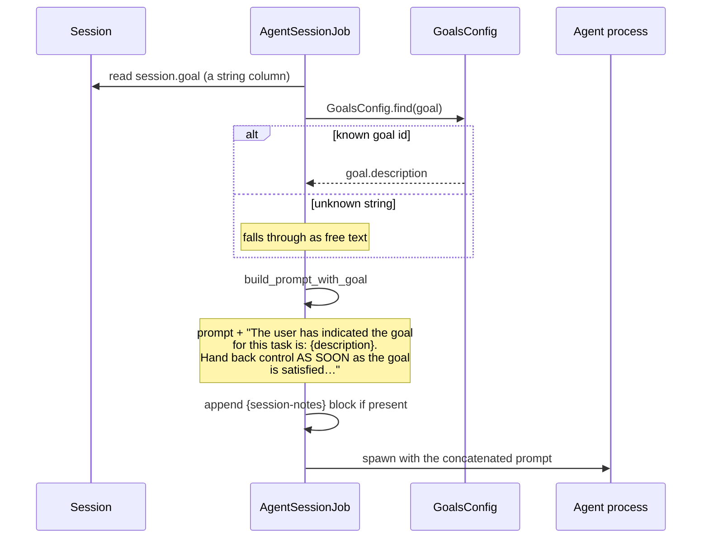

A **goal** is the session's definition of done. It's the mechanism behind closed-loop autonomy:
an agent should verify its work before it comes back to you.

## The four goals that ship

From `config/goals.json`:

| ID | What it demands |
| --- | --- |
| `codebase-question` | Research and answer inline. Do not create files, PRs, or branches. Stop in `needs_input`. |
| `open-reviewed-green-pr` | Open the PR through the `open-pr` skill, block until CI is green, run an independent fresh-eyes review, address all its feedback, re-check CI, write a `## Verification` section with checked boxes and proof, then apply the `ready to merge` label. Then archive. The default for most roots. |
| `open-reviewed-green-pr-with-version-bump` | Same, plus a mandatory version bump when server source changed. |
| `e2e-verified-green-pr` | Same, plus: state the critical path up front, spin up a real dev server, drive it with browser automation, record video and screenshots, embed them in the PR. |

All three PR goals name the `open-pr` skill as the canonical way to commit, push, open, and
finalize the PR — agents are told not to hand-roll their own commit/push/PR sequence when that
skill is available. The skill's terminal act is applying the `ready to merge` label, and the
goal text now makes that label part of "done."

The label is deliberately disambiguated in the goal text, because its name collides with the
"do not merge your own PR" instruction. Applying `ready to merge` does **not** merge the
PR and does **not** claim a human has reviewed it — it is the agent's own claim that self-review,
fresh-eyes review, and green CI are complete. It is fully compatible with leaving the PR
unmerged; "do not merge" is not a reason to skip the label.

The three PR goals then end by telling the agent to **archive itself**. The label is the handoff:
a green, reviewed, labeled PR is a session that ran to completion, and the merge gate takes it
from there — it decides whether to auto-merge, announces the merges it makes in Slack `#updates`,
and parks *its own* session in `needs_input` when it holds a PR for you. This is the general rule
stated in the injected system prompt's *Session Lifecycle Management* section: self-archival is
the completion signal, and `needs_input` is reserved for the four cases where a human is genuinely
required.

That is a reversal. These goals used to end with "stop and wait in `needs_input`, and do not
archive yourself — an open session with an unreviewed PR is the user's to-do list." The to-do-list
rationale predates the merge-by-default gate, and it strands sessions: the gate merges the PR and
announces it, and the producing session sits in the action queue forever with nothing for anyone
to do. `codebase-question` still says do not self-archive, because a human-asked question *is* one
of the four sanctioned cases.

## How a goal is applied

```mermaid
sequenceDiagram
    participant S as Session
    participant J as AgentSessionJob
    participant G as GoalsConfig
    participant P as Agent process

    J->>S: read session.goal (a string column)
    J->>G: GoalsConfig.find(goal)
    alt known goal id
        G-->>J: goal.description
    else unknown string
        Note over J: falls through as free text
    end
    J->>J: build_prompt_with_goal
    Note over J: prompt + "The user has indicated the goal<br/>for this task is: {description}.<br/>Hand back control AS SOON as the goal<br/>is satisfied…"
    J->>J: append {session-notes} block if present
    J->>P: spawn with the concatenated prompt
```

That is the entire mechanism. `AgentSessionJob#build_prompt_with_goal` resolves the goal id to
its description (or passes an unknown string through verbatim as free text) and appends it to
the prompt.

:::danger[A goal has zero runtime enforcement]
Nothing in Zimmer checks that CI actually went green. Nothing verifies a review happened. Nothing
inspects the PR description for the `## Verification` section it demanded. The state machine's
`pause` event fires when the CLI process exits, full stop — it does not ask whether the goal was
met.

The stop condition is enforced only by the LLM choosing to obey English.

This is the single biggest gap between what Zimmer's docs (and its own goal text) promise and
what the code does. Know this before you trust an autonomous session's "done."
Tracked in [#88](https://github.com/tadasant/zimmer/issues/88).
:::

A blank base prompt short-circuits the whole thing — a guard against spawning an agent whose
entire prompt is a bare goal string.

## Where a goal comes from

Precedence, in order:

1. Explicit `goal` param at session creation (UI form or `POST /api/v1/sessions`).
2. The agent root's `default_goal` from `roots.json`.
3. Nothing — the column is nullable, and the goal suffix is simply not appended.

It can be changed after the fact: `PATCH /api/v1/sessions/:id` accepts `goal`, and a follow-up
prompt can carry a new one — through `POST /api/v1/sessions/:id/follow_up`, the MCP `action_session`
`follow_up` action, or the enqueued-message editor, the one web surface with a goal field on a
message. A follow-up goal is applied whether the prompt is sent straight through, queued behind a
running turn, or interrupted in; a blank one preserves the goal the session already has rather than
clearing it (see
[the REST API reference](/extend/rest-api/#following-up-and-the-goal-that-rides-along)).

The column is validated on length only (`GOAL_MAX_LENGTH`). Any string is a legal goal.
Tracked in [#88](https://github.com/tadasant/zimmer/issues/88).

## The heartbeat

A session can have `heartbeat_enabled` with an interval (30–86,400 seconds). `HeartbeatSweepJob`
runs every 30 seconds and, for each due `needs_input` session with a heartbeat, injects an
automated nudge prompt and resumes it — the "keep working toward your goal" loop.

It deliberately skips sessions that are blocked on an elicitation or that have pending enqueued
messages, because resuming those would spawn a second process against the same clone.

The nudge goes out through `Session#deliver_follow_up!`. Five entry points share it: the web
follow-up form, triggers, the GitHub comment and merge-conflict pollers, and this sweep. The method
clears the stale per-turn metadata, transitions the session to running, stamps the prompt where the
recovery paths look for it, enqueues `AgentSessionJob`, and records `running_job_id` so the session
is never "running with no job."

Two direct-delivery paths deliberately stay outside it: the REST API's `follow_up` (which never
stamped a pending prompt, and would change behaviour if it started) and `EnqueuedMessageProcessorService`
(which delivers a message it has already claimed from a queue, under different locking).

The heartbeat is the one caller that passes `stamp_pending_prompt: false`. A user's message is worth
replaying after a SIGTERM retry; a drumbeat is not — replaying one would deliver a beat for a moment
that has already passed.

:::note[The goal rule is still duplicated]
Delivery is shared; the rule for applying a follow-up *goal* is not. It has four copies — the two API
controllers, the MCP tool, and `EnqueuedMessageProcessorService` — each writing its own wording of the
same log line. Tracked in [#105](https://github.com/tadasant/zimmer/issues/105).
:::

## `needs_input` vs `archived`

This trips people up. Mechanically, a session reaching `needs_input` just means the agent
finished a turn, and a session reaching `archived` means someone (or something) explicitly
archived it:

- You archived it in the UI.
- The agent called `action_session` with `archive` through Zimmer's self-session MCP server.
- A health monitor archived it.

*Intentionally*, they mean more than that. `archived` is what a completed session looks like:
the agent is told, in `OrchestratorSystemPromptBuilder` and in the goal text, to archive itself
as its last act. `needs_input` is a deliberate signal that a human is required, and there are
exactly four sanctioned reasons to send it:

1. The agent lacked the authorization scope or tools to finish, with no parent session to report
   back to.
2. The merge gate declined to auto-merge a PR, so a human has to review and merge it.
3. A human invoked the session to explore something or answer a question — it is the user's to
   close.
4. Rare: an ambiguity both too dangerous and too irreversible to guess at.

Anything else — including "the user will want to read this" — goes in the final message, or in
Slack `#updates` if it is a read-only FYI and the session has a Slack server, and the session
archives. The prompt also names three things that *look* like reasons to park and are not: waiting
on a machine (CI, an outage, a rate limit, a peer session — clocks, not humans), a reason that went
stale while the agent worked (the PR merged; the question is moot), and finishing with nothing to
show (a sweep that found nothing and a gate that aborted both ran to completion).

Whether agents comply is, again, a matter of the model obeying English.
