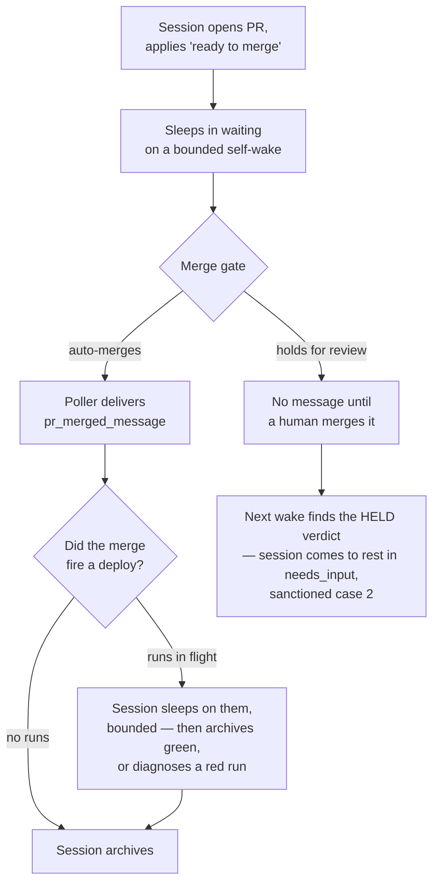
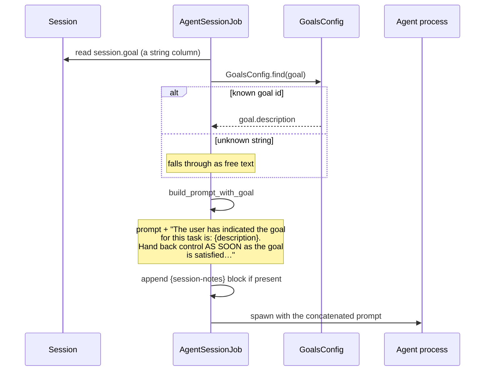

A **goal** is the session's definition of done. It's the mechanism behind closed-loop autonomy:
an agent should verify its work before it comes back to you.

## The four goals that ship

From `config/goals.json`:

| ID | What it demands |
| --- | --- |
| `codebase-question` | Research and answer inline. Do not create files, PRs, or branches. Stop in `needs_input` if a human asked; report back to the parent and archive if a session did. |
| `open-reviewed-green-pr` | Open the PR through the `open-pr` skill, block until CI is green, run an independent fresh-eyes review, address all its feedback, re-check CI, write a `## Verification` section with checked boxes and proof, then apply the `ready to merge` label. Then hold the PR the way that skill's terminal steps say to, and archive when the PR merges. The default for most roots. |
| `open-reviewed-green-pr-with-version-bump` | Same, plus a mandatory version bump when server source changed. |
| `e2e-verified-green-pr` | Same, plus: state the critical path up front, spin up a real dev server, drive it with browser automation, record video and screenshots, embed them in the PR. |

All three PR goals name the `open-pr` skill as the canonical way to commit, push, open, and
finalize the PR — agents are told not to hand-roll their own commit/push/PR sequence when that
skill is available. The skill's terminal act is applying the `ready to merge` label, and the
goal text makes that label part of "done."

The label is deliberately disambiguated in the goal text, because its name collides with the
"do not merge your own PR" instruction. Applying `ready to merge` does **not** merge the
PR and does **not** claim a human has reviewed it — it is the agent's own claim that self-review,
fresh-eyes review, and green CI are complete. It is fully compatible with leaving the PR
unmerged; "do not merge" is not a reason to skip the label.

The three PR goals then end by telling the agent to **hold the PR and archive when it merges**.
The session that opened a PR is the session holding the work's context, so it is the one a human
comes back to while the PR's disposition is unsettled.

*How* it holds is delegated to the `open-pr` skill rather than spelled out as "stop in
`needs_input`", because the skill's terminal step draws a finer line: a PR merely waiting for the
merge gate to rate it is a machine wait, while a PR the gate has *held* is a human handoff, and
only the second belongs in the action queue. So the skill has the session schedule a bounded
self-wake — three wakes, 30 minutes apart — and sleep in `waiting`, checking the PR's state on
each wake: merged or closed unmerged means archive, a fresh gate `HELD` verdict or a spent wake
budget means come to rest in `needs_input`, and a PR still open and unrated means sleep again. A
sleeping session holds the PR exactly as a parked one does — `Session.with_github_prs` excludes
only `archived` and `failed`, so the poller still sees it — with one difference in delivery: a
`needs_input` session takes the merge message immediately, while a `waiting` one has it enqueued
and picks it up at its next wake. The goal text keeps a fallback for runtimes and repos that do
not ship the skill: come to rest in `needs_input` holding the PR.

Nothing has to watch for the merge. `GithubPrPollPassJob` sweeps unarchived sessions with
recorded PR URLs, and on the open → merged transition it delivers `AutomatedPrompts.pr_merged_message`
to the session. That message is the archive signal, and it makes the queue self-draining:

```mermaid
flowchart TD
    A["Session opens PR,<br/>applies 'ready to merge'"] --> B["Sleeps in waiting<br/>on a bounded self-wake"]
    B --> C{"Merge gate"}
    C -->|auto-merges| D["Poller delivers<br/>pr_merged_message"]
    D --> H{"Did the merge<br/>fire a deploy?"}
    H -->|"no runs"| E["Session archives"]
    H -->|"runs in flight"| I["Session sleeps on them,<br/>bounded — then archives green,<br/>or diagnoses a red run"]
    I --> E
    C -->|holds for review| F["No message until<br/>a human merges it"]
    F --> G["Next wake finds the HELD verdict<br/>— session comes to rest in needs_input,<br/>sanctioned case 2"]
```

**The one exception to "merged means archive" is a merge that fires a deploy**, and the goal text
conditions it on something the session can actually read rather than on a guess: the merge message
itself reports the workflow runs the merge created. Names none and the session archives immediately,
exactly as before. Names runs still in flight and the session sleeps on them, bounded, then archives
when they are green or diagnoses the one that went red, because it holds more context about the
change than anything that would pick the failure up later. Which branch a repository lands on is a
property of that repository: one with no workflow on pushes to its default branch never waits, while
one with one — Zimmer's own repo has two — waits on most merges, deliberately, since a red `main` or
a failed release build is the merging session's business too. See [What a merged
PR tells the session](/operate/background-jobs/#what-a-merged-pr-tells-the-session).

Both outcomes are correct by construction, and neither needs a human to tidy up. A held PR puts
its session in the queue, which is the point — and when that human merges it, the same signal
releases the session. A merged PR drains its own session out. A PR closed without merging ends the
work, and the session archives on that too.

The stop is conditional, and the condition is the merge message rather than a person's attention.
A goal that makes a human the only thing able to release a session is what leaves sessions in
`needs_input` for weeks after their PR has landed.

Three cases stop the message arriving at all — an unrecorded PR URL, a merge the poller never saw
open, and a swallowed delivery — and a session that hits one waits forever. The goal text tells the
agent to check `get_session` for a recorded URL before settling in. See [Limitations](/limitations/).

`codebase-question` stops for a different reason, and only when a human invoked the session
directly. A research session a parent spawned reports its answer back to the parent and archives.

## How a goal is applied

```mermaid
sequenceDiagram
    participant S as Session
    participant J as AgentSessionJob
    participant G as GoalsConfig
    participant P as Agent process

    J->>S: read session.goal (a string column)
    J->>G: GoalsConfig.find(goal)
    alt known goal id
        G-->>J: goal.description
    else unknown string
        Note over J: falls through as free text
    end
    J->>J: build_prompt_with_goal
    Note over J: prompt + "The user has indicated the goal<br/>for this task is: {description}.<br/>Hand back control AS SOON as the goal<br/>is satisfied…"
    J->>J: append {session-notes} block if present
    J->>P: spawn with the concatenated prompt
```

That is the entire mechanism. `AgentSessionJob#build_prompt_with_goal` resolves the goal id to
its description (or passes an unknown string through verbatim as free text) and appends it to
the prompt.

:::danger[A goal has zero runtime enforcement]
Nothing in Zimmer checks that CI actually went green. Nothing verifies a review happened. Nothing
inspects the PR description for the `## Verification` section it demanded. The state machine's
`pause` event fires when the CLI process exits, full stop — it does not ask whether the goal was
met.

The stop condition is enforced only by the LLM choosing to obey English.

This is the single biggest gap between what Zimmer's docs (and its own goal text) promise and
what the code does. Know this before you trust an autonomous session's "done."
Tracked in [#88](https://github.com/tadasant/zimmer/issues/88).
:::

A blank base prompt short-circuits the whole thing — a guard against spawning an agent whose
entire prompt is a bare goal string.

## Where a goal comes from

Precedence, in order:

1. Explicit `goal` param at session creation (UI form or `POST /api/v1/sessions`).
2. The agent root's `default_goal` from `roots.json`.
3. Nothing — the column is nullable, and the goal suffix is simply not appended.

It can be changed after the fact: `PATCH /api/v1/sessions/:id` accepts `goal`, and a follow-up
prompt can carry a new one — through `POST /api/v1/sessions/:id/follow_up`, the MCP `action_session`
`follow_up` action, or the enqueued-message editor, the one web surface with a goal field on a
message. A follow-up goal is applied whether the prompt is sent straight through, queued behind a
running turn, or interrupted in; a blank one preserves the goal the session already has rather than
clearing it (see
[the REST API reference](/extend/rest-api/#following-up-and-the-goal-that-rides-along)).

The column is validated on length only (`GOAL_MAX_LENGTH`). Any string is a legal goal.
Tracked in [#88](https://github.com/tadasant/zimmer/issues/88).

## The heartbeat

A session can have `heartbeat_enabled` with an interval (30–86,400 seconds). `HeartbeatSweepJob`
runs every 30 seconds and, for each due `needs_input` session with a heartbeat, injects an
automated nudge prompt and resumes it — the "keep working toward your goal" loop.

It deliberately skips sessions that are blocked on an elicitation or that have pending enqueued
messages, because resuming those would spawn a second process against the same clone.

The nudge goes out through `Session#deliver_follow_up!`. Five entry points share it: the web
follow-up form, triggers, the GitHub comment and merge-conflict pollers, and this sweep. The method
clears the stale per-turn metadata, transitions the session to running, stamps the prompt where the
recovery paths look for it, enqueues `AgentSessionJob`, and records `running_job_id` so the session
is never "running with no job."

Two direct-delivery paths deliberately stay outside it: the REST API's `follow_up` (which never
stamped a pending prompt, and would change behaviour if it started) and `EnqueuedMessageProcessorService`
(which delivers a message it has already claimed from a queue, under different locking).

The heartbeat is the one caller that passes `stamp_pending_prompt: false`. A user's message is worth
replaying after a SIGTERM retry; a drumbeat is not — replaying one would deliver a beat for a moment
that has already passed.

:::note[The goal rule is still duplicated]
Delivery is shared; the rule for applying a follow-up *goal* is not. It has four copies — the two API
controllers, the MCP tool, and `EnqueuedMessageProcessorService` — each writing its own wording of the
same log line. Tracked in [#105](https://github.com/tadasant/zimmer/issues/105).
:::

## `needs_input` vs `archived`

This trips people up. Mechanically, a session reaching `needs_input` just means the agent
finished a turn, and a session reaching `archived` means someone (or something) explicitly
archived it:

- You archived it in the UI.
- The agent called `action_session` with `archive` through Zimmer's self-session MCP server.
- A health monitor archived it.

*Intentionally*, they mean more than that. `archived` is what a completed session looks like:
the agent is told, in `OrchestratorSystemPromptBuilder` and in the goal text, to archive itself
as its last act. `needs_input` is a deliberate signal that a human is required, and there are
exactly four sanctioned reasons to send it:

1. The agent lacked the authorization scope or tools to finish, with no parent session to report
   back to. When there *is* a parent, the prompt names the route: `action_session` with
   [`message_parent`](/extend/mcp-server/#message_parent-the-one-action-that-exists-only-here),
   which resolves the parent server-side and carries a `wrong_scope` / `missing_tools` reason. The
   session reports and archives instead of parking.
2. The session opened a PR whose merge disposition is unsettled. *How* it holds is the `open-pr`
   skill's terminal steps rather than this list: asleep in `waiting` on a bounded self-wake while
   the merge gate is still rating the PR, because that is a machine wait. What brings the session
   to rest here is a PR the gate *holds* — a human handoff, for the human who must review and merge
   it — or the self-wake budget running out with no verdict at all. Either way it archives when the
   PR merges.
3. A human invoked the session to explore something or answer a question — it is the user's to
   close.
4. Rare: an ambiguity both too dangerous and too irreversible to guess at.

On top of those, one rule bounds the whole queue: **exactly one session per human-initiated goal
stays unarchived.** Usually that is the router, while it is still orchestrating the sessions below
it; if the router archived itself and handed the work to a child, it is that child. One request
should leave one session in the queue, not a trail.

Anything else — including "the user will want to read this" — goes in the final message, or in
Slack `#updates` if it is a read-only FYI and the session has a Slack server, and the session
archives. Anything the agent noticed but could not fix is written down somewhere it will be found,
which is the other half of why a session can archive at all — but *where* depends on what it is,
and the prompt splits it in two. A goal **this session** cannot reach because it was given the
wrong agent root or the wrong MCP servers goes to the session that dispatched it, over
`message_parent`, and is never an issue: the dispatcher can re-delegate in seconds, and a tracker
row reaches a human days after the goal died. Something noticed **in passing** that nobody is
waiting on is an inline note in the PR body, unless it clears an **incident bar** — it could cause
an incident later, or a user-facing experience a real person would complain about — in which case
it is a GitHub issue. The prompt states that bar as a sentence the agent has to complete rather
than an adjective it can argue past, and caps filing at one issue per session with an expected
number of zero. The prompt also names four things that *look* like reasons to park and are not: waiting on a
machine (CI, an outage, a rate limit, a peer session: none of those is a human, and a PR whose
merge disposition is unsettled is the one carve-out), a blocker another session is already fixing,
a reason that went stale while the agent worked (the PR merged; the question is moot), and
finishing with nothing to show (a sweep that found nothing and a gate that aborted both ran to
completion).

The second of those is the one agents miss, because it looks like a handoff rather than a wait: red
CI on `main` from a failure unrelated to the agent's own diff, an upstream fix in flight. The prompt
tells the agent to look for the session already working the blocker, make one
`wake_me_up_when_session_changes_state` call naming all three events — `session_archived`,
`session_needs_input` and `session_failed`, since a clean finish self-archives without passing
through `needs_input` — plus a `wake_me_up_later` deadline as a backstop, and then resume its own
work once the blocker clears.
Escalating is right only when nobody is on the blocker, or after about three hours.

Whether agents comply is, again, a matter of the model obeying English.
