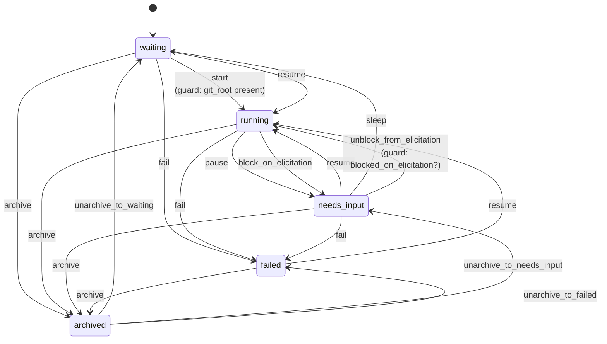

Every session is in exactly one of five states. The transitions between them are enforced by
AASM in `app/models/concerns/session_state_machine.rb`, and each one carries side effects that
are as important as the state change itself.

## The states

| State | DB value | Meaning |
| --- | --- | --- |
| `waiting` | 1 | Queued, or dormant awaiting a scheduled wake-up. **The initial state.** |
| `running` | 0 | An agent process is alive and a monitoring job owns it. |
| `needs_input` | 2 | The agent's turn ended, or it's blocked on an elicitation. **This is your to-do list.** |
| `failed` | 4 | Terminal error. Resumable. |
| `archived` | 3 | In the trash. Restorable until the clone is reaped. |

The integer values are load-bearing (they're the existing ActiveRecord enum). A sixth state,
`corrupted` (5), was removed — sessions now go to `failed` instead.

## The full machine



:::note[The old `docs/SESSION_STATE_MACHINE.md` was missing five of these]
It documented `start`, `sleep`, `pause`, `resume`, `fail`, and `archive`. It did **not**
document `block_on_elicitation`, `unblock_from_elicitation`, or the three `unarchive_to_*`
events. It also claimed you cannot archive a running session — you can; `archive` transitions
from `waiting`, `running`, `needs_input`, *and* `failed` (the UI exposes this as force-archiving
a stuck session).
:::

## The events, and what they actually do

### `start` — `waiting → running`

Guarded on `git_root` being present. Resets the elapsed-time counter and logs.

### `pause` — `running → needs_input`

Fired when the agent's turn ends (the process exits normally). This is the workhorse
transition, and it does five things beyond changing status:

1. `cleanup_running_job` — clears `running_job_id`.
2. `fire_ao_event_triggers("session_needs_input")` — wakes anything watching this session.
3. `enqueue_debounced_needs_input_push_notification` — see below.
4. `enqueue_session_inference_if_needed` — LLM-generates a title and category if still pending.
5. `execute_pending_sleep` — if the agent called "wake me up later" *while running*, the sleep
   was deferred to here; now it fires.

**The debounce is worth understanding.** Sessions sometimes flap `running → needs_input →
running` between turns, and without debouncing every flap would push a notification. So the
push job is enqueued with a 60-second delay (`NEEDS_INPUT_DEBOUNCE`) carrying a monotonic
marker from `custom_metadata["needs_input_count"]`. If the session churns during the window,
the marker won't match and the deferred job no-ops.

### `resume` — `waiting | needs_input | failed → running`

Unguarded (`can_resume?` returns `true` unconditionally — the job handles preconditions).
Clears a pile of stale state: MCP failure flags, the `paused_by` marker, the
`blocked_on_elicitation` marker, any `pending_sleep`, and — importantly — it
**cancels pending one-time wake-up triggers** targeting this session, so a scheduled wake
doesn't fire on a session you already resumed by hand.

### `sleep` — `needs_input → waiting`

The "wake me up later" path. The session goes dormant and a one-time schedule trigger will
resume it. If the agent calls this while *running*, `metadata["pending_sleep"] = true` is set
and the actual transition happens on the next `pause`.

### `block_on_elicitation` / `unblock_from_elicitation` — `running ⇄ needs_input`

This pair exists because an elicitation is *not* a turn ending. An MCP server made a
synchronous request and is blocked waiting for the human; **the agent process is still alive**.
So `block_on_elicitation` surfaces the session as `needs_input` (to get it on your homepage and
into the notification path) but deliberately does **not** call `cleanup_running_job` — killing
the process would break the round-trip.

A metadata marker (`blocked_on_elicitation`) distinguishes this from a real pause, and guards
the flip back.

:::caution[Stranded elicitation blocks are a real failure mode]
If the reactive unblock is missed — a swallowed `AASM::InvalidTransition` from a state race, or
the MCP server crashing mid-round-trip — the marker is left set with nothing to clear it, and
the session sits in `needs_input` showing a phantom "blocked on elicitation" forever.

`CleanupExpiredElicitationsJob` sweeps for this every 5 minutes and calls
`clear_stale_elicitation_block!`, which strips the marker but **deliberately leaves the session
in `needs_input`** rather than flipping it to `running` — a minutes-old stranded block has no
live round-trip to resume into, and flipping it would create a phantom running session with no
monitoring job.
:::

### `fail` — `waiting | running | needs_input → failed`

Cleans up the running job, fires `session_failed` triggers, and enqueues a push notification
that **bypasses the per-session opt-in**. The reasoning: by the time `fail!` fires, retries are
already exhausted, so this is a final non-self-resolving event. A silent status flip would be
worse than an unwanted push.

### `archive` — any state → `archived`

Sets `archived_at`, dismisses notifications, fires `session_archived` triggers, cleans up
triggers watching this session, and sets a trash expiry.

The clone is **not** deleted immediately. `DeferredCloneCleanupJob` runs after a short undo
window and then either deletes the clone (if it's clean) or preserves unpushed artifacts for
`TRASH_RETENTION_PERIOD`.

:::caution[The retention period in the code comment is wrong]
The comment on the `archive` event says artifacts "are preserved for 14 days before deletion."
The constant twelve lines below it says `TRASH_RETENTION_PERIOD = 4.days`. **Four days is what
actually happens.** The comment is stale.
:::

:::danger[The Undo button doesn't work]
[Issue #12](https://github.com/tadasant/zimmer/issues/12): the archive `turbo_stream` response
never renders the flash toast, so there is no toast and no Undo affordance — even though the
`undo_archive` endpoint still works. The undo window is unusable from the UI.
:::

## Side effects fail silently, by design

Almost every callback in the state machine is wrapped in a bare `rescue` that logs and swallows:

```ruby
rescue => e
  Rails.logger.error "[SessionStateMachine] Failed to ..."
  # Don't raise - notification failures shouldn't block state transitions
end
```

This is a deliberate trade: a broken notification service should not be able to wedge a
session in `running`. The consequence is that **cleanup can silently not happen while the state
still advances** — an archived session whose trash expiry failed to set, a paused session whose
notification never fired. `StaleCloneCleanupJob` exists as the safety net for the clone case.

## Who else moves sessions around

The state machine is not the only actor:

- **`HeartbeatSweepJob`** (every 30s) re-nudges `needs_input` sessions with `heartbeat_enabled`
  by injecting a heartbeat prompt and resuming them. It skips sessions blocked on an
  elicitation or with pending enqueued messages — resuming those would spawn a second process.
- **`CleanupOrphanedSessionsJob`** (every 5 min) catches sessions marked `running` whose process
  is gone.
- **`ZombieReaperJob`** reaps dead child processes.
- **`SessionRecoveryService`** handles SIGTERM'd sessions (deploys, OOM) with a bounded retry
  ladder — `MAX_RETRIES = 3`.
