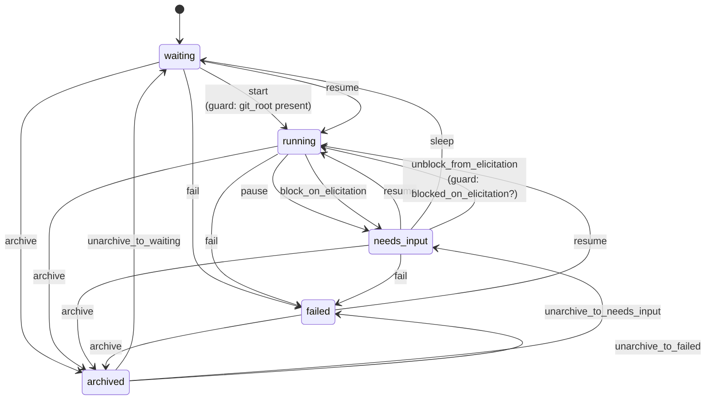

Every session is in exactly one of five states. The transitions between them are enforced by
AASM in `app/models/concerns/session_state_machine.rb`, and each one carries side effects that
are as important as the state change itself.

## The states

| State | DB value | Meaning |
| --- | --- | --- |
| `waiting` | 1 | Queued, or dormant awaiting a scheduled wake-up. The initial state. |
| `running` | 0 | An agent process is alive and a monitoring job owns it. |
| `needs_input` | 2 | The agent's turn ended, or it's blocked on an elicitation. This is your to-do list: agents archive themselves on completion, and a session waiting on its own PR archives when that PR merges, so what stays here is meant to need you. See [goals](/sessions/goals/). |
| `failed` | 4 | Terminal error. Resumable. |
| `archived` | 3 | In the trash. Restorable until the clone is reaped. |

The integer values are load-bearing (they're the existing ActiveRecord enum). A sixth state,
`corrupted` (5), was removed — sessions now go to `failed` instead.

## The full machine


```mermaid
stateDiagram-v2
    [*] --> waiting

    waiting --> running: start<br/>(guard: git_root present)
    running --> needs_input: pause
    needs_input --> running: resume
    waiting --> running: resume
    failed --> running: resume
    needs_input --> waiting: sleep

    running --> needs_input: block_on_elicitation
    needs_input --> running: unblock_from_elicitation<br/>(guard: blocked_on_elicitation?)

    waiting --> failed: fail
    running --> failed: fail
    needs_input --> failed: fail

    waiting --> archived: archive
    running --> archived: archive
    needs_input --> archived: archive
    failed --> archived: archive

    archived --> waiting: unarchive_to_waiting
    archived --> needs_input: unarchive_to_needs_input
    archived --> failed: unarchive_to_failed
```

:::note[The old `docs/SESSION_STATE_MACHINE.md` was missing five of these]
It documented `start`, `sleep`, `pause`, `resume`, `fail`, and `archive`. It did not
document `block_on_elicitation`, `unblock_from_elicitation`, or the three `unarchive_to_*`
events. It also claimed you cannot archive a running session — you can; `archive` transitions
from `waiting`, `running`, `needs_input`, *and* `failed` (the UI exposes this as force-archiving
a stuck session).
:::

## The events, and what they actually do

### `start` — `waiting → running`

Guarded on `git_root` being present. Resets the elapsed-time counter, records the session's
experimental-setting flags, and logs.

#### Experimental-setting flags

`start` and `resume` — **and no other transition** — call `record_experimental_setting_flags`,
which writes one row per experimental setting into `session_experimental_flags`. The first call
fixes the session's start-of-life value; every later one moves its end-of-life value. So a setting
toggled between two turns shows up as a disagreement between the two rather than silently landing
in one cohort.

Those two are the transitions at which an agent process is about to spawn, and a setting like MCP
tool search takes effect in the spawn environment — so observing there records what the session
actually ran with. The terminal transitions look like the natural home for the end-of-life value
and are the wrong one: `archive` and `fail` fire at bookkeeping moments that can land arbitrarily
long after the session last ran. `HealthMonitorService#archive_old_sessions` archives everything
untouched for seven days in a loop, so recording there would re-stamp each old session's end value
with today's setting, flip it to `mixed`, and quietly drain the control cohort of the comparison
the labels exist to support.

It is bookkeeping and behaves like it: the write is a single upsert, it swallows its own errors,
and the caller rescues again around it, so a cohort label can never be the reason a session fails
to start. See [Experimental settings](/operate/costs/#experimental-settings) for what the labels
are for.

`AgentSessionJob` adds a second guard ahead of the transition, and it is the one that makes a pause
mean something: **a session with a one-time wake-up still ahead of it does not get a first start.**
`waiting` is both "queued to spawn" and "deliberately asleep", and precedence says nothing about
which — so without this, every automated starter reads a paused session as a runnable one. The job
stands down, logs why on the session, and does *not* re-enqueue itself; the armed wake is the next
event in that session's life.

Only a first start is refused. A wake firing on time arrives as a follow-up prompt, `resume_monitoring`
re-attaches to a live process, and `clone_only` spends no turn — none of those is an early start, and
refusing them would strand the wake this guard exists to protect. See
[A pause outranks precedence](/sessions/spot-and-priority/#a-pause-outranks-precedence) for the other
three callers that decline, and why the guard lives here rather than in a prompt.

### `pause` — `running → needs_input`

Fired when the agent's turn ends (the process exits normally). This is the workhorse
transition, and it does nine things beyond changing status:

1. `warn_if_pr_goal_captured_no_url` — if the session's goal mentions a pull request and
   `custom_metadata["github_pull_request_urls"]` is still empty, write one `warning` log to the
   timeline. `GithubPrUrlHook` only records a PR it can see the session open, and an empty list is
   otherwise indistinguishable from "no PR to record" — see
   [transcript hooks](/extend/transcript-hooks/). Never raises, and once per **session**, not once
   per event: `fail` and `archive` call it too, and the dedup is on the warning log itself, so a
   session that pauses, warns, and later archives says it once.
2. `cleanup_running_job` — clears `running_job_id`.
3. `bump_needs_input_transition_counter` — one increment of
   `custom_metadata["needs_input_count"]`, handed to both of the next two steps as their debounce
   marker. Bumped here rather than inside either consumer, because two bumps would make each one's
   marker stale to the other and suppress both. It has its own rescue for the same reason every
   other side effect does: a raise here must not wedge the transition.
4. `fire_settled_needs_input_ao_event(marker)` — wakes anything watching this session, *if the
   session is still at rest when the settle window closes*. See
   [a turn boundary is not a rest](#a-turn-boundary-is-not-a-rest).
5. `enqueue_debounced_needs_input_push_notification(marker)` — see below.
6. `enqueue_session_inference_if_needed` — LLM-generates a title and category if still pending.
7. `enqueue_status_summary_refresh` — the **only** automatic trigger for the
   [Status summary](/sessions/status-summary/). The generator still refuses when the session has
   not moved since the last one, so a transition that added no transcript costs nothing.
8. `execute_pending_sleep` — if a wake-up was scheduled while the session was *running*, the
   sleep was deferred to here; now it fires.
9. `drain_enqueued_messages_after_pause` — if the session is coming to rest with a message still
   queued for it, schedule the delivery. See [below](#a-session-does-not-idle-on-its-own-queue).
   Runs last, and after `execute_pending_sleep`, so it reads the state the sleep left behind: a
   session that just went dormant is asleep with a wake armed, not idling.

Steps 3–7 are skipped for one kind of session: a **status-summary fork**, which is Zimmer's own
throwaway (marked in metadata by `SessionStatusSummaryGenerator::FORK_MARKER`). Its pause means its
one turn is finished, so it is harvested and archived instead of notifying anyone or landing in the
action queue.

#### A turn boundary is not a rest

`pause` runs at the end of **every** turn, and plenty of those turns end with the session on its way
somewhere else rather than waiting for anyone. Steps 8 and 9 above are the two routine cases, and
both are decided *inside this same callback*: a session holding a `pending_sleep` goes straight back
to `waiting`, and a session with a queued message is resumed by `EnqueuedMessageDrainJob` seconds
later.

That made `session_needs_input` a much noisier signal than its name suggests. Router session #9964
was woken four times in 25 minutes by child #9966 — a completely healthy session that had opened a
PR and was cycling through the open-pr skill's bounded self-wake, crossing `needs_input` for
microseconds on each pass back to `waiting`. Every one of those wakes cost the router a full agent
turn and four trigger writes, because a fired one-time wake destroys its siblings and they all had
to be re-registered.

So the event is now **settled** rather than emitted on the edge. The job is enqueued with a
`wait:` of `SessionStateMachine::NEEDS_INPUT_SETTLE_WINDOW` (30 seconds) and the marker from step 3;
when it runs, it is dropped unless `Session#resting_in_needs_input?` still holds — the session is in
`needs_input`, holds no unexecuted `pending_sleep`, and has nothing queued for it — and unless the
marker still matches, which is how a later transition supersedes an earlier one's event.

`fail` and `archive` emit through the unchanged `fire_ao_event_triggers`, immediately: a terminal
state cannot flap, and delaying the event that ends a wait would be pure latency.

`resting_in_needs_input?` asks about **status and nothing else**, which is deliberate and is the
part worth reading the reasoning for — it is in
[Triggers](/sessions/triggers/#resting_in_needs_input-asks-about-status-and-only-status). The short
version: every richer test considered can only still be true when the window closes if the thing
that was going to move the session has failed, and those sessions are precisely the ones a watcher
must hear about. Nothing re-emits this event, so suppressing them would lose the wake rather than
delay it.

`block_on_elicitation` emits through the same settled path, and bumps the same counter. That is a
change: it never bumped before. It matters only in the narrow case where a `pause` and an
elicitation land inside the 60-second push debounce, where the elicitation now invalidates the
in-flight `needs_input` push — which is the right outcome, since that path already sends its own
`elicitation_pending` push and the transition's comment says avoiding a double-notify is the point.

The debounce is worth understanding. Sessions sometimes flap `running → needs_input →
running` between turns, and without debouncing every flap would push a notification. So the
push job is enqueued with a 60-second delay (`NEEDS_INPUT_DEBOUNCE`) carrying a monotonic
marker from `custom_metadata["needs_input_count"]`. If the session churns during the window,
the marker won't match and the deferred job no-ops.

#### A session does not idle on its own queue

`needs_input` and `archived` are the two states in which a session stops draining its queue, and
the same invariant covers both: **a session must not come to rest with a message still queued for
it.** What differs is what can be done about it. Archiving ends every delivery path, so the honest
answers there are to refuse the transition and to record the discard —
[below](#archiving-retires-the-message-queue). `needs_input` ends nothing. An idle session is
precisely the condition a queued message is waiting for, so the answer here is to deliver it and
keep running.

Most of that already happened before this transition. `AgentSessionJob` drains the queue at each
of its four turn-end paths and does it **before** calling `pause!`, so the session hands the turn
over while still `running` and never flaps through `needs_input` — no spurious
`session_needs_input` wake, no push notification. That is still the hot path. What that ordering
cannot cover is:

- **The race.** The drain reads the queue, finds it empty, and *then* `pause!` commits. A message
  enqueued in that window lands `pending` on a session that is already idle.
- **Every pause that isn't a turn ending.** The MCP `pause` action, `POST
  /api/v1/sessions/:id/pause`, the web pause button, `Sessions::InterruptService` and
  `SessionRecoveryService` all call `pause!` directly with no drain of their own.
- **A message queued onto a session that is already idle.** None of the three create surfaces —
  the web queue form, `POST /api/v1/sessions/:id/enqueued_messages`, MCP
  `manage_enqueued_messages` — checks the session's state, and all three answer that the message
  goes out *when the session becomes idle*. An `EnqueuedMessage` `after_create_commit` hook covers
  this one.

Nothing else would have picked any of them up. `HeartbeatSweepJob` is the only sweep that wakes an
idle session, and it deliberately skips one holding a pending message — on the assumption,
previously untrue, that something else was about to deliver it.

Both entry points schedule an `EnqueuedMessageDrainJob` rather than draining inline. AASM runs
`after` callbacks inside the transition's own transaction, and delivering means resuming the
session — a second AASM event nested in the first, plus an `AgentSessionJob` enqueue — from
whatever thread called `pause!`, including a web request. The job runs once the transition is
committed, after a 10-second delay that lets the callers which pause-then-immediately-deliver
(`Sessions::InterruptService`, `SessionContinuation`'s auto-continue) finish first.

The job itself opens **no** transaction and takes no advisory lock, which is load-bearing rather
than an omission. `EnqueuedMessageProcessorService#process_next_message` opens its own transaction
and rescues everything inside it, and a Rails `transaction` block *joins* an open one instead of
nesting under a savepoint — so wrapping the call would turn the service's rescue from "roll the
claim back and return false" into "swallow the error and let the outer transaction commit whatever
got written", which can mean a message claimed and destroyed with no `AgentSessionJob` behind it.
Unwrapped, the service's transaction is the outermost one and a mid-delivery failure rolls the
message back to `pending`. Concurrency is already the service's job: the claim is a `FOR UPDATE
SKIP LOCKED` on the row plus a `lock!` on the session, and `AgentSessionJob`'s end-of-turn drain
calls it bare for the same reason.

The job refuses to deliver in three states, because in each the session genuinely cannot take a
message and delivering would make things worse:

| State | Why not |
| --- | --- |
| Blocked on an MCP elicitation | The agent process is still alive. Resuming spawns a second process against one clone and orphans the round-trip. |
| Parked by `AuthOutageParkService` (`auth_outage_reason`) | A fresh turn hits the same quota or auth wall, burns the message, and parks again. `AgentSessionJob`'s own drain reads the same marker. |
| `paused_by: "mcp_retry"` | A retry carrying the original prompt is already scheduled; delivering now races it into the same failing MCP server. |

**The dead-process case.** A drain does not need the old agent process — it enqueues a fresh
`AgentSessionJob` that resumes the runtime session from `session_id` and the working directory,
exactly as a human follow-up does. So a session whose process died still takes its message. What
it cannot survive is a missing clone or `session_id`: there `AgentSessionJob` fails the session
with a `failure_reason`, and the message stays `pending` on a `failed` session, where the recovery
paths (`SessionContinuation#continue_with_queued_user_message`) already prefer a queued user
message over the automated recovery prompt when they auto-continue it.

**No spin loop.** Each successful delivery destroys a row, so the queue strictly shrinks. Failure
is what needs bounding: three attempts, 30 seconds apart, counted in
`metadata["enqueued_drain_attempts"]` and cleared by `resume` so each idle spell gets its own
budget. After that the job stops and raises an alert, deduped per session. It deliberately does
**not** retire the messages to `undelivered` the way an archive does: `undelivered` means no
delivery path remains, which is true of an archived session and false of this one — the next turn
anybody gives it drains the queue normally. Retiring here would destroy a still-deliverable message
in order to record that this job could not deliver it.

One consequence worth naming: a *user-initiated* pause on a session with a queued message resumes
within seconds. That is the invariant working as stated rather than an oversight — the queued
message is input the user was told would be delivered, and pausing the current turn is not the
same as withdrawing it. To stop it, delete the queued message.

### `resume` — `waiting | needs_input | failed → running`

Unguarded, deliberately. The preconditions for resuming — a clone on disk, a runtime
session id to resume into, a live process to reattach to — are established or validated by
`AgentSessionJob`, which recovers what it can and fails the session with a specific
`failure_reason` when it cannot. The state machine does not re-check them, so a resume you
ask for is a resume the job gets to attempt.
Clears a pile of stale state: MCP failure flags, the `paused_by` marker, the
`blocked_on_elicitation` and `lost_elicitation` markers, any `pending_sleep`, the
`enqueued_drain_attempts` counter (so each idle spell gets its own retry budget), and,
importantly, it cancels pending one-time wake-up triggers targeting this session, so a scheduled
wake doesn't fire on a session you already resumed by hand.

#### A finished turn is not an interruption

`GoodJob::InterruptError` is raised when GoodJob re-picks a job row it considers interrupted —
started, never finished, no lock. `AgentSessionJob#handle_interrupt_error` treats that as "the
deploy killed us mid-turn" and resumes the session with `AutomatedPrompts::SYSTEM_RECOVERY`.

That is right when the session was still `running`. It is wrong when the turn had already
finished. A normal completion transitions `running → needs_input` and, in the same callback
chain, clears `running_job_id` — so the ownership check that would otherwise catch a stale
re-pick sees nothing to defer to, and the recovery path resumes a session that was correctly
waiting for its human. Over one representative production week that race accounted for 44% of
interrupt events and 39% of all recovery nudges sent.

So the handler stands down when the session is already at rest. The test is deliberately
**positive** — it names the states that are genuinely done being driven, and everything else
falls through and recovers as before. `metadata["paused_by"]` carries most of that:

| `paused_by` | Reached `needs_input` by | On `InterruptError` |
| --- | --- | --- |
| absent | the agent finishing its turn | stand down — nothing was interrupted |
| `"user"` | somebody pausing it by hand | stand down — the pause was deliberate |
| `"recovery"` | an earlier recovery pass parking it — or `degrade_mcp_servers!` resuming a session on the servers that did connect | recover, as before |
| `"mcp_retry"` | `schedule_mcp_retry` parking it for a delayed retry | recover, as before |

A negative test ("anything but `recovery`") would have been wrong: `mcp_retry`'s only route
back to `running` is its delayed retry job, and both recovery sweeps match `paused_by =
'recovery'` exactly — so standing down on it would strand the session where nothing looks.

`paused_by` is not the whole story either. **`blocked_on_elicitation` reaches `needs_input`
from `running` carrying no `paused_by` at all**, and keeps its `running_job_id`, because the
agent process is still alive mid-turn waiting on an approval. That is not a session at rest,
so it is excluded from the stand-down and still recovers.

A session still `running` when the interrupt lands is unaffected and recovers exactly as before.

#### `waiting` is three different situations, and none of them is a recovery

The handler used to push every `waiting` session through `waiting → running → needs_input` so a
sweep could pick it up. `waiting` is reached three unrelated ways, and that was wrong for each.

**No runtime session id yet.** `perform` did not reach the point where it issues one, so nothing
durable exists and there is nothing to resume. The repair is to **run the job again**, so the handler
re-enqueues this job's own arguments verbatim and leaves the session in `waiting`.

Pausing it instead is what stranded [spot-held](/sessions/spot-and-priority/) sessions. A spot hold
lives entirely in `waiting`, and the only thing that ever schedules the next re-check is the
re-check job itself — so severing that chain meant the session could never start again. One
`issue-work-gate` session was held correctly 120 times over 22 hours, then had one re-check job
re-picked and spent the next 20 hours in `needs_input` with an empty transcript on a human's action
queue.

The replay is bounded by `MAX_INTERRUPTED_START_REQUEUES`. Exhausting it fails the session with a
`failure_reason` naming the cause, which is loud and visible — the one thing a queued session must
never do is disappear quietly.

**Asleep on purpose.** `wake_me_up_later` runs a session `running → needs_input → waiting` inside a
single `pause` callback, via `execute_pending_sleep`. An interrupt landing in that window dragged the
sleeper back awake and spent a turn on a recovery nudge, cancelling the wake it had just scheduled.
Nothing was interrupted there either — the turn finished — so the handler stands down and lets the
wake fire.

The discriminator is `Session#awaiting_scheduled_wake?`, not a metadata flag, because a session that
slept successfully carries none: `execute_pending_sleep` clears `pending_sleep` once `sleep!`
succeeds, and writes no `paused_by`. The armed-wake query is the only signal there is.

**Anything else in `waiting` that has run.** Chiefly the window between the session id being issued
and `start!` firing, which spans the clone, the AIR prepare and the spawn — seconds to minutes, and a
deploy is exactly what lands in it. That session is stranded rather than resting, and unlike the
first case it has a session id and a clone, so it takes the ordinary recovery path. `pause` is
`running → needs_input`, so it stays in `waiting` carrying `paused_by: "recovery"` — which is swept,
because both continuation queries match `[:needs_input, :waiting]` on that marker and `resume`
accepts `waiting`.

#### Auto-continue gives up

`SessionContinuation#continue_recovered_session` needs a `session_id` and a clone on disk. For a
session paused before it ever started, neither will ever exist, and no amount of waiting produces
them. Both sweeps select on `metadata["paused_by"] = "recovery"`, so an unbounded retry meant the
5-minute orphan cron re-read the same session forever — 500+ identical "auto-continue skipped" log
lines for one session that never ran.

After `MAX_CONTINUE_ATTEMPTS` failures the sweep gives up: it drops the `paused_by` marker (which
is what both sweeps select on, so the session stops being swept), records
`metadata["recovery_continue_abandoned"]` with the reason, and logs it once at `error`. The session
comes to rest wherever it already was — `needs_input` or `waiting` on the ordinary path, still
`failed` when the caller was the InterruptError-failed branch — for a human to restart, which is the
honest state for one Zimmer cannot restart itself.

The budget is sized for the *other* thing the validation reports. A missing working directory can be
transient — a volume not yet mounted after a boot, a clone being restored — so the count is set to
roughly an hour against the 5-minute cron, long enough for a blip to clear and still bounded. The
writes go through `merge_metadata!` rather than `update!`: a read-modify-write would run Session's
validations, including the [globally coupled](/air/zimmer-integration/) agent-root and catalog-skill
checks, and a `RecordInvalid` swallowed by the caller's per-session rescue would stop the counter
advancing — restoring the unbounded loop for exactly the sessions least likely to be recoverable.

#### The nudge names the path that sent it

A dozen paths enqueue the same `SYSTEM_RECOVERY` constant — a deploy, an orphan sweep, a SIGTERM
retry, an API-error retry, a quota park lifting, a manual restart. Sending one undifferentiated
string means neither the agent nor the human reading over its shoulder can tell which fired, and
"this should only happen on a deploy" is the reasonable conclusion it invites — in that same
week, fewer than a third of these nudges were within ten minutes of a deploy.

`AutomatedPrompts.system_recovery(reason:)` appends one line naming the path, after the standing
instructions, so the prompt's meaning is unchanged for an agent that ignores it.
`AutomatedPrompts.system_recovery?` is the matching predicate — compare with it rather than `==`
against the constant, or a reasoned nudge will be mistaken for an ordinary follow-up and consume
the wake-ups the next section exists to preserve.

**Three producers name themselves today**, and between them they account for the large majority
of nudges by volume: the `InterruptError` auto-continue, `SessionContinuation` (which covers both
the orphan sweep and deployment recovery, via `continuation_source`), and `AuthOutageParkService`
resuming a session whose login pool refilled. The rest — the SIGTERM retry, the API-error retry,
the auth-recovery resume, the health monitor, the manual restarts from the web UI, the REST API
and the MCP tool, and the `ProcessLifecycleManager` continuations — still send the bare constant.
`system_recovery(reason: nil)` returns it unchanged, so converting one is a one-line change; the
gap is unfinished work, not a designed-in default.

#### A system-recovery resume keeps the wake-ups

That cancellation is right for a *deliberate* resume and wrong for a recovery one. When Zimmer
restarts a session's process after an interruption — a deployment restart, an orphaned process, a
hung process reaped, a health-monitor retry — the session did not choose to wake, so the wake-ups
it was sleeping on are still exactly what it is waiting for. Consuming them there is how an
orchestrator gets stranded: it comes back with nothing armed, ends its turn, and sits in
`needs_input` indefinitely with children it was supposed to be watching.

Recovery paths therefore call `Session#resume_for_system_recovery!` rather than `resume!`. It sets
the transient `system_recovery_resume` flag for the duration of the transition, and
`cancel_pending_one_time_wake_triggers` takes a preserve branch instead:

- The pending conditions are **left armed** — nothing is consumed.
- If one of them is a one-time *schedule* (a `wake_me_up_later` deadline backstop), `pending_sleep`
  is set so the session returns to `waiting` once the recovery turn ends. A wall-clock wake fires
  regardless of what else happens, so sleeping on it cannot strand the session.
- If the only pending wakes are session-scoped `ao_event` watchers, the session comes to rest in
  `needs_input` with those watchers still armed. A watched session may have reached the state being
  watched for *during* the outage, and that transition is not replayed — so sleeping would trade a
  long stall for an indefinite one. `Trigger#follow_up_session!` delivers to a `needs_input` session
  just as well, and the operator can see it in the meantime.

That re-sleep is conditional at execution time as well as at resume time. It is recorded as
`pending_sleep` plus a `pending_sleep_requires_wake` marker, and `execute_pending_sleep` drops it
rather than sleeping if nothing is armed by the time the turn ends. A backstop whose wall time
elapsed during the outage is due the moment recovery resumes the session, so it can fire mid-turn,
destroy its siblings and hand off to a new turn without ever pausing — and sleeping on that stale
intent would leave the session in `waiting` with nothing armed and no `paused_by`, invisible to both
recovery sweeps. A deliberate sleep (`POST /api/v1/sessions/:id/sleep` on a running session) carries
no marker and is always executed, because arming nothing is exactly what it means.

One recovery path deliberately does *not* preserve: when `continue_recovered_session` finds a queued
user message, it delivers that instead of the recovery prompt, via a normal `resume!`. A waiting
user message means someone has taken the session over, which is the case the cancelling semantics
are for.

The invariant this restores: a session that was in `waiting` with wake-ups registered does not
silently end up in `needs_input` with none.

### `sleep` — `needs_input → waiting`

The "wake me up later" path. The session goes dormant and a one-time schedule trigger will
resume it. If the wake-up is scheduled while the session is *running*,
`metadata["pending_sleep"] = true` is set and the actual transition happens on the next `pause`.

A human clicking **Pause Until** on a running session does not wait for that next `pause` — the
control stops the turn itself (`Sessions::HaltRunningTurn` terminates the process and pauses the
session), so the session is dormant in `waiting` before the request returns. The deferred sleep
remains the fallback for a halt that cannot land. See
[Pausing a session that is still running](/sessions/triggers/#pausing-a-session-that-is-still-running).

Agents reach this through the `wake_me_up_later` MCP tool, and humans through the **Pause Until**
control on a session card's overflow menu or in the session detail header. Both go through
`Sessions::ScheduleWakeUp`, so both refuse the same wakes — a time in the past, or inside the
30-second grace window, would fire-and-drop in the scheduler and leave the session asleep forever.
Only `needs_input`, `running` and `waiting` sessions are offered the control; from `failed` or
`archived` the auto-sleep silently no-ops and the trigger would point at a session nothing can wake.

**Spot Queue — the same sleep with no wake-up.** The last choice in that panel is not a time.
It sleeps the session and hands it to the spot scheduler instead of arming anything:
`Sessions::PauseIntoSpotQueue` writes the same dormancy record a mid-run ceiling pause writes
(`SpotSessionPause`), so the sweep that already resumes spot work picks this session up on the
next pass where a Claude Code account is under both quota targets and a session slot is free —
highest precedence first. `pause_into_spot_queue` on `action_session` is the same thing for an
agent. Two consequences worth knowing before you click it:

- **It makes the session spot**, if it was not already, because the sweep resumes a non-spot
  sleeper on its very next pass. That is reversible and it is the way back out: *Make this session
  priority* on the banner promotes it, and the next sweep resumes it.
- **It replaces any wake-up you had already armed** from the same control — picking the queue
  after picking a time means "not then, this instead".

Its queue position is whatever `precedence` the session is already carrying; the
[Ranked view](/sessions/spot-and-priority/) is where that is changed.

A sleep with a wall-clock wake armed outranks every automated reason to start the session *early* —
its precedence, its scheduling class, a recovered quota pool, a freed fleet slot. The places that
would otherwise have started it are listed in
[A pause outranks precedence](/sessions/spot-and-priority/#a-pause-outranks-precedence), along with
the limit of what a pause claims: it is a floor under when the session may run, not a promotion past
the spot queue when the moment arrives. A Spot Queue park is the deliberate exception to the whole
thing — it arms nothing, so the spot sweep resuming it is the point.

Zimmer also uses this path on its own behalf: `AuthOutageParkService` parks a session here when the
login pool runs dry, which is what keeps a quota-blocked session out of the heartbeat sweep's reach.
See [Agent harness auth](/auth/harness/#when-the-pool-runs-dry).

A session can be in both states at once — parked on the pool *and* asleep on a wake somebody chose.
The pool recovering answers the first and says nothing about the second, so
`AuthOutageParkService.wake_parked_sessions!` skips it. That skip is load-bearing: its resume goes
through `resume!`, and `cancel_pending_one_time_wake_triggers` would have consumed the pause on the
way past, leaving no record that the session was ever paused.

The same service also guards the *exit* paths, not just the moment the wall is hit. A session whose
turn was never delivered — `active_follow_up_prompt` still set, because `AgentSessionJob` removes it
only on clean completion — stopping while its runtime's pool has no available account is the outage,
not a finished turn. `AuthOutageParkService.park_undelivered_turn!` parks it here rather than letting
the loop's "the process is gone" fallbacks pause it onto somebody's action queue. See
[The park has to survive the paths that do not know about it](/auth/harness/#the-park-has-to-survive-the-paths-that-do-not-know-about-it).

### `block_on_elicitation` / `unblock_from_elicitation` — `running ⇄ needs_input`

This pair exists because an elicitation is *not* a turn ending. An MCP server made a
synchronous request and is blocked waiting for the human; the agent process is still alive.
So `block_on_elicitation` surfaces the session as `needs_input` (to get it on your homepage and
into the notification path) but does not call `cleanup_running_job` — killing
the process would break the round-trip.

A metadata marker (`blocked_on_elicitation`) distinguishes this from a real pause, and guards
the flip back.

:::caution[Stranded elicitation blocks are a real failure mode]
If the reactive unblock is missed — a swallowed `AASM::InvalidTransition` from a state race, or
the MCP server crashing mid-round-trip — the marker is left set with nothing to clear it, and
the session sits in `needs_input` showing a phantom "blocked on elicitation".

`CleanupExpiredElicitationsJob` sweeps for this every 5 minutes and calls
`clear_stale_elicitation_block!`, which strips the marker and leaves the session
in `needs_input`; flipping it to `running` would create a phantom running session with no
monitoring job. A minutes-old stranded block has no live round-trip to resume into.

Leaving it there and saying nothing is its own lie, though — a session parked in `needs_input`
with no banner reads as merely idle. So a stranded `needs_input` session gets a
`lost_elicitation` marker naming what happened, which the session page renders as a banner. See
[Elicitation](/sessions/elicitation/#when-a-round-trip-ends-without-an-answer).
:::

### `fail` — `waiting | running | needs_input → failed`

Cleans up the running job, fires `session_failed` triggers, enqueues a push notification
that bypasses the per-session opt-in, and — like `pause` — enqueues a
[Status summary](/sessions/status-summary/) refresh. The reasoning behind the unconditional push:
by the time `fail!` fires, retries are already exhausted, so this is a final non-self-resolving
event. A silent status flip would be worse than an unwanted push.

A status-summary fork that fails is harvested (recording the failure on the source session's
summary) instead of notifying, exactly as on `pause`.

It also runs `warn_if_pr_goal_captured_no_url`, last in the callback so nothing above it can be
skipped. A session that dies mid-turn never reaches `pause`, so a PR it opened and never named
would be recorded nowhere at all ([#313](https://github.com/tadasant/zimmer/issues/313)).

### `archive` — any state → `archived`

Sets `archived_at`, retires any messages still queued for the session, dismisses notifications,
fires `session_archived` triggers, cleans up triggers watching this session, sets a trash expiry,
and — last, for the same reason as on `fail` — runs `warn_if_pr_goal_captured_no_url`. A session trashed straight from `needs_input`
is one nobody is coming back to, so this is where a PR opened and never recorded gets said out
loud.

Neither this nor `fail` is literally terminal — `resume` runs from `failed` and the three
`unarchive_to_*` events from `archived` — so the warning keeps `pause`'s point-in-time honesty:
it says what was true when it was written ("no PR URL **yet**") and, because the dedup is
once-per-session, it is not retracted if the session is later revived and does open one.

Status-summary forks are carved out inside the hook rather than at the call site. The generator
strips the goal a fork inherits, but only in `prepare_fork` — a fork abandoned before that point
still carries the source's "open a PR", so the goal check alone would not have covered it.

#### The archive line names who did it

Every other transition has one obvious cause. `archive` has six unrelated callers — the web UI,
the REST API, the MCP API, `HealthMonitorService`'s stale-session sweep, status-summary fork
cleanup, and a session archiving itself — and they all used to leave the same five words in the
timeline. So "why did my session get archived?" could not be answered from the session page:
a human clicking **Trash** and another agent archiving the session out from under its own
unfinished work looked identical, and telling them apart meant reading a different session's raw
transcript off disk.

Callers set `session.archive_actor` immediately before `archive!`, and the line names it:

```
[State Machine] Session moved to trash by session #5225 via the MCP API
[State Machine] Session moved to trash by a user in the web UI
[State Machine] Session moved to trash by Zimmer's stale-session sweep (untouched for 7 days)
```

The actor is transient, never persisted, and never inferred. An archive from a console or a test
says `by an unrecorded caller` rather than claiming an actor it does not have.

On the MCP API the actor is **self-declared**, through the same `acting_session_id` argument
`follow_up` uses and for the same reason: the API key is shared by the whole fleet, so nothing
about the request identifies the caller. An archive that declares nothing is logged as
`by an undeclared MCP API caller` — which still answers the question that matters, because a
human archiving a session does it from the web UI. The injected self-session server names itself
separately (`via the self-session MCP server`), since its tool group narrows the *actions* a
session may take, not the `session_id` it may aim them at.

#### Archiving retires the message queue

Archiving ends every path by which a queued message could still be delivered.
`EnqueuedMessageProcessorService` claims `pending` rows only, and for a live session the only
thing that calls it is `AgentSessionJob`'s end-of-turn drain — which an archived session never
reaches, because the monitoring loop sees `archived?` and terminates the process instead of
pausing.

Those rows used to stay `pending` anyway, and that is what made a dropped message silent. Every
reader of the queue — the panel on the session page, `GET /api/v1/sessions/:id/enqueued_messages`,
the MCP `manage_enqueued_messages` list — treats `pending` as *still going to be sent*. So did the
sender: `follow_up` without `force_immediate` auto-queues onto a running session and answers
*"Message queued (session is running). It will be sent when the agent completes its current
task"*, which is a promise rather than a receipt.

The window is not exotic. Goals routinely tell an agent to archive itself once its work is done,
so a session that is `running` when you queue a message may legitimately never become idle again:
it goes `running` → `archived` and the queue never drains. Any two messages arriving inside one
agent turn can hit it. Production session 6073 did — a user's second Slack message queued behind
their first, the session archived at the end of that same turn, and the message sat `pending` in a
queue nobody would ever drain.

So `archive` moves them to `undelivered`, a fourth, terminal status alongside
`pending`/`processing`/`sent`. Three things follow from that:

- The queue can no longer misreport itself. `undelivered` is not `pending`, so the claim query
  cannot take it — including after an `unarchive_to_*`, where a weeks-old message would otherwise
  arrive as if it had just been sent.
- The archive line names what was lost, next to the unresolved-PR clause and for the same reason:

  ```
  [State Machine] Session moved to trash by session #5225 via the MCP API — 1 queued message was
  never delivered and is now marked undelivered: "What do you mean I pulled yellow onion?..."
  ```

- An alert fires, deduped per session. Unlike the unresolved-PR clause this *is* an anomaly: a
  message was accepted and never delivered, and the only reason to find that out from a user
  noticing is that nothing else said it — with [one exemption](#the-pr-merged-notice-does-not-page),
  for the message that has no such user.

The row itself is kept, not destroyed — its content is the thing the sender was promised delivery
of — and the session page lists it, marked as never delivered. That listing sits outside the
follow-up form rather than inside the live queue panel, because the form is hidden once a session
is archived, which is the state these rows exist in.

#### Archiving over a queued message is refused, and `force` is the way through

Retiring the messages records the loss; it does not undo it, and recording a discard is not the
same as intending one. So an archive over a non-empty queue is **refused**, on every surface — the
MCP `archive` and `bulk_archive` actions, `POST /api/v1/sessions/:id/archive`, and the web UI's
**Trash** button:

```
Cannot archive session 6073: 1 queued message has not been delivered. Archiving discards it.

  1. What do you mean I pulled yellow onion? I didn't do that, add it back

Do not archive. If you are this session, end your turn instead — the queued message is delivered
as your next turn, and archiving after that succeeds because the queue is empty. If you are
archiving another session, leave it alone and let it consume what you sent it.

Only if you have read the message above and are deliberately discarding it: re-call with
"force": true. That is not the recommended path — the message was accepted from someone who was
told it would be delivered, and forcing throws it away.
```

The refusal leads with what not to do, because for the caller that meets it most — a session
archiving itself at the end of a turn — not archiving is free and correct. An agent self-archives
because it believes its work is finished, and a message that landed mid-turn is exactly the
evidence that the belief is stale. It ends its turn instead, the pause drains the queue, the
message arrives as the next turn, and the archive succeeds after that because the queue is empty.

**`force` is the deliberate override**, off by default, for a caller that has read the message and
is choosing to discard it. It is named last in the error and hedged in its own schema description,
because it exists for the exception rather than the rule. Forcing does not make the discard
invisible: the messages are still retired to `undelivered`, the archive line still names them, and
the alert still fires — [with one exemption](#the-pr-merged-notice-does-not-page) — so what was
thrown away stays readable afterwards.

#### The PR-merged notice does not page

Every queued message records who wrote it, in `enqueued_messages.origin`. `caller` is anything
queued on someone's behalf, which is most of the queue — the web form, the two REST endpoints, MCP
`manage_enqueued_messages` and `action_session`, a trigger's follow-up, the GitHub comment poller.
The `automated_*` origins are the notices Zimmer addresses to a session on its own behalf, written
when a poller sees GitHub move. The column is settable by no request; it is emitted on the REST
payload and in the MCP list, so an archive that retired a message without paging can be explained
from outside the database.

The alert is skipped for exactly one combination: an `automated_pr_merged` notice, discarded by a
caller who **forced** past `Sessions::ArchiveGuard`. Both halves are required.

- **The message.** That notice says a single thing — the PR merged, so archive if nothing is left
  in this session's scope. No third party was promised the delivery: the PR poller marks the PR
  notified when it queues the row, and nobody but the session can read it. So there is nobody to
  find out from, which is the entire premise of the alert.
- **The force.** Forcing means the caller was refused, shown the message, and re-called anyway — so
  the one party the notice addressed has read it and acted. A **system-initiated** archive
  (`HealthMonitorService`'s stale sweep, `SessionStatusSummaryHarvestJob`, status-summary fork
  cleanup) never consults the guard, so nobody has read anything, and it still pages. That is not a
  detail: a fork wrongly credited with its source's PR gets the merge notice queued onto it and is
  then archived by the harvest job, and this alert is how that bug was found. Keyed on the message
  alone, the exemption would have silenced its own smoke detector.

Production session 6377 is the motivating case. Its PR merged while it was mid-turn, so the notice
queued rather than being delivered; the session later woke, judged its work finished, and archived.
The guard refused, it read the notice in the refusal and re-called with `force`, and Zimmer paged a
human about discarding a message it had written to itself telling it to do exactly what it had just
done.

Three things this exemption is *not*:

- **Not a hole in the guard.** `Sessions::ArchiveGuard` still refuses over a PR-merged notice, and
  that refusal is load-bearing: it is what puts the message in front of an agent that has not seen
  it, so the agent can act on the notice's *other* branch — "you were waiting on this merge to
  keep going" — instead of archiving past it. Session 6377's agent read it and chose correctly.
  Only the page is dropped.
- **Not silence.** The row still retires to `undelivered` and the archive line still names it.
- **Not "automated messages don't page".** `automated_merge_conflict` keeps alerting, and the
  contrast is the point: an unresolved merge conflict is still true after the archive, and nothing
  else reports it. The exemption is about one message's *meaning*, not about who typed it.

A queue holding both still pages, and pages about the caller's message alone — and it says how many
notices were retired alongside it, so the page and the archive line cannot disagree about the
count.

Every state that can archive is covered, `needs_input` and `failed` included. Nothing drains their
queues, which makes the discard there certain rather than merely likely — and a refusal without an
override would leave those sessions permanently un-archivable, which is why `force` and the full
coverage are one design rather than two. The same reasoning puts `force` on the narrowed
`self_session` schema: a session archiving itself is the caller that meets the refusal most, and
would otherwise be the one caller with no way past it.

The surfaces differ only in how `force` is expressed, not in whether the discard is refused:

| Surface | Refusal | Override |
| --- | --- | --- |
| MCP `archive` | `ToolError` naming the messages | `"force": true` |
| MCP `bulk_archive` | per-session error, batch continues | `"force": true`, applied to the whole batch |
| `POST /api/v1/sessions/:id/archive` | 422 with the same text | `force: true` |
| `POST /api/v1/sessions/bulk_archive` | per-session entry in `errors`, batch continues | `force: true`, whole batch |
| Web **Trash** | flash naming what would be lost | an **Archive anyway** button that re-posts with `force` |
| Web bulk archive | skipped, and the count is reported | none — archive those individually to confirm |

The web bulk action deliberately has no force: a bulk selection is not a claim to have read each
session's queue, and there is no per-session confirmation to hang an override on. Every Trash
affordance — the session header, the session card, the mobile joystick — posts to the same
controller action, so the two-step covers all of them without touching any of them.

**System-initiated archives do not consult the guard at all.** `HealthMonitorService`'s stale
sweep, status-summary fork cleanup, and `SessionStatusSummaryHarvestJob` archive unconditionally.
That asymmetry is deliberate: a refusal those callers could hit would be a fleet-wide stuck state
with no human in the loop to clear it, and none of them is a caller that could reconsider and let
the message land. Their discards are still recorded, because the retirement runs on the transition
itself rather than at the call site.

#### …and what the archive cost

Archiving is what takes a session out of `GitHubPullRequestPollerJob`'s scope — `with_github_prs`
excludes archived sessions — so it also ends any chance of the merge message the PR goals in
`config/goals.json` promise the session: *"the pull-request poller sends this session a message
when the PR merges, and THAT MESSAGE IS YOUR SIGNAL TO ARCHIVE"*. A session archived before the
poller's next pass never receives it.

When the session still has tracked PRs that Zimmer never saw reach a terminal state (`merged` or
`closed`), the archive line says so and names them:

```
[State Machine] Session moved to trash by session #5225 via the MCP API — 1 tracked pull request
had not reached a terminal state, so no merge notification will be delivered for it:
https://github.com/tadasant/strad/pull/152
```

This rides on the archive line rather than raising a `warning` of its own, deliberately. A merge
gate archives the producing session within seconds of merging — well inside the poller's
30-second cadence — so an unresolved PR at archive time is the common case rather than an anomaly
worth alerting on. What it is worth is one sentence in the place someone asking where their
session went is already looking.

The clone is not deleted immediately. `DeferredCloneCleanupJob` runs after a short undo
window and then either deletes the clone (if it's clean) or preserves unpushed artifacts for
`TRASH_RETENTION_PERIOD`, which is `4.days`. `EmptyTrashJob` deletes them once that expires.

**That job is the only thing that deletes an archived session's clone.** `AgentSessionJob` kills the
agent process when it sees the archive and leaves the clone where it is, because a second deleter
beats the preservation by about ten seconds and there is nothing left to preserve from a tree that
is already being unlinked. [#653](https://github.com/tadasant/zimmer/issues/653) is what happens
when that ordering is not respected, and it costs two things: the session's uncommitted work is
destroyed rather than saved, and the preservation dies on `ENOENT` against a half-deleted tree —
`File.directory?` is still true, because a recursive delete unlinks children under the live path —
which pages. Nothing leaks by waiting: `StaleCloneCleanupJob` (archived with no trash deadline, one
hour) and `EmptyTrashJob` (at the deadline) are the backstops if the deferred job never runs.

Preservation is not instant on a large tree — a `git bundle create`, a `git add -A` and a
`git diff --binary` over the whole working tree — so the job re-reads the session's status
immediately before deleting, and stands down if it is no longer archived. An unarchive inside that
window puts a session back to work on this clone, and that is not something the undo window could
undo.

A clone that has vanished by the time preservation starts is not a failed preservation. There is
nothing to preserve and nothing to keep, so `CloneArtifactService` logs it at `.info` — the same
call `check_dirty_state` makes for the same race — and the job clears the trash deadline rather than
holding a session in the trash for four days over a clone that does not exist. "Vanished" is decided
by looking at the disk, not by reading the exception: `Errno::ENOENT` also comes back from a `git`
that is not on `PATH`, and that is a real failure on a clone that is still there. A clone still on
disk that cannot be read stays `.error` and is held for the full window, because it is then the only
copy of the session's work.

If artifact extraction fails outright, the clone is kept — it is then the only copy of that
session's unpushed work — and the job writes the same `4.days` deadline on the session and a
`warning` log the session's owner can see. Unarchive inside that window finds the clone on disk and
restores it as it stands; `EmptyTrashJob` reaps it, its Docker resources and its artifacts at the
deadline. The deadline is anchored to `archived_at` here rather than inherited from whatever is
already on the row: a retry that reaches this branch after an earlier run cleared `trash_after`
would otherwise leave the clone to `StaleCloneCleanupJob`, which reaps it — unpreserved, and without
tearing Docker down — an hour after archive. The cost of the hold is
[a limitation](/limitations/#a-failed-artifact-preservation-holds-a-whole-clone-for-four-days).

Preservation does not take the working tree entirely on faith. A tree that is 50 or more deleted
tracked files and almost nothing else is not uncommitted work — it is a clone that an interrupted
recursive delete mangled — so `CloneArtifactService` drops those deletions from `working_tree.patch`
(keeping the additions and modifications), logs at `.warn`, and records `dropped_deletions` in the
artifact metadata.

The deletions are filtered out of the diff already in memory, not by re-running `git` with
`--diff-filter=d`. The guard fires precisely when a concurrent recursive delete is gutting that
clone, so a second `chdir` into it raced the delete: the directory was gone 11 ms after the warning
and the whole preservation died on `ENOENT`
([#425](https://github.com/tadasant/zimmer/issues/425)). Nothing re-enters a clone the guard has
just proven is being deleted.

`.warn` rather than `.error` because this refusal is self-healing — the corruption is dropped, the
real work still travels in the bundle and the filtered patch, and the deleted files come back from
`HEAD` — and routing it through `StructuredLogger#error` paged on every clone the guard successfully
defused. `DeferredCloneCleanupJob` stamps the drop on the session as
`mangled_clone_dropped_deletions`, and `MangledCloneReportJob` sums a day of them into one line, so
the frequency stays [countable without paging](/operate/background-jobs/).

Unarchive applies the same test before it replays a patch, because patches captured before the guard
existed are still on disk. There it refuses the patch **whole** rather than filtering it: git can
re-take a filtered diff from a live clone, but nothing can cheaply split a patch file, so a legacy
patch's additions are declined along with its deletions. And after restoring artifacts,
`UnarchiveSessionService` checks the clone it produced: if the agent root's `subdirectory` is gone,
or the tree is now overwhelmingly deletions, it puts the clone back to the commit it was checked out
at before the restore (which unwinds a fast-forwarded bundle too, so damage carried by *commits* is
reverted rather than reset onto) and deletes what the restore added. A clone missing its root
subdirectory fails `air prepare` with `ENOENT` and takes the session down with it, so a pristine
clone is the better of the two losses.

In both cases the artifacts stay on disk and the session log records where — unarchive clears
`trash_after`, so nothing else will ever reap them, and the path is the only way back to whatever
real work the patch held. See [issue #411](https://github.com/tadasant/zimmer/issues/411) and
[the limitation this does not close](/limitations/#an-interrupted-clone-delete-still-mangles-a-live-working-tree).

The session's [scratch directory](/sessions/spawning/) and prompt attachments are on the trash
schedule too, not the undo-window one: nothing can rebuild them from a remote the way a clone is
rebuilt, so they are kept for the whole time archive is undoable and reaped by `EmptyTrashJob`.
That is why a clean-clone session can still hold a `trash_after` — it is the deadline for whatever
is still retained, which is not always the clone. See
[how long scratch lasts](/limitations/#a-sessions-scratch-directory-survives-archive-but-only-for-the-trash-window).

:::danger[The Undo button doesn't work]
[Issue #12](https://github.com/tadasant/zimmer/issues/12): the archive `turbo_stream` response
never renders the flash toast, so there is no toast and no Undo affordance — even though the
`undo_archive` endpoint still works. The undo window is unusable from the UI.
:::

## Side effects are swallowed by design — but no longer silently

Almost every callback in the state machine is wrapped in a bare `rescue` (`preserve_debug_info` is
the exception — it only logs). That part is deliberate and unchanged: a broken notification service should not be able to wedge a session in `running`,
so a failed side effect never aborts the transition. The consequence is still real — cleanup
can not happen while the state advances anyway.

What changed is that swallowing no longer means silence. All 22 callbacks route their rescue
through one helper:

```ruby
rescue => e
  report_swallowed_side_effect(__method__, e, alert: true)
end
```

`alert: true` logs **and** raises an operational alert via `AlertService` (the same
`#eng-alerts` seam the trigger pollers and `SystemHealthMonitorJob` use). `alert: false` logs
only. The split is by consequence, not by severity of the exception:

| | Callbacks | Why |
| --- | --- | --- |
| **Alerts** | `set_archived_at`, `cleanup_running_job`, `clear_stale_mcp_failure_metadata`, `clear_auth_recovery_budget`, `execute_pending_sleep`, `cancel_pending_one_time_wake_triggers`, `clear_pending_sleep`, `set_blocked_on_elicitation_marker`, `cleanup_watched_session_ao_event_triggers`, `fire_ao_event_triggers`, `clear_trash_expiry` | The failure leaves persistent state inconsistent and nothing reconciles it — a resumed session that re-fails on a stale MCP flag, an armed wake-up that fires into live work, a restored session still queued for deletion. |
| **Logs only** | `reset_elapsed_time_counter`, `log_state_change`, `clear_blocked_on_elicitation_marker`, `clear_paused_by_metadata`, `mark_notifications_stale`, `dismiss_notifications`, `enqueue_failure_push_notification`, `enqueue_debounced_needs_input_push_notification`, `enqueue_session_inference_if_needed`, `set_trash_expiry`, `enqueue_deferred_cleanup` | Cosmetic, best-effort by construction, or already covered by a reconciling sweep — `CleanupExpiredElicitationsJob` for a stranded elicitation marker, `StaleCloneCleanupJob` for a nil `trash_after`, `EmptyTrashJob` for a missed cleanup enqueue. A second alert path to an event that already self-heals is just noise. |

The alert's dedup key is the **callback name, not the session**. A sick database hits the same
callback for every session in flight; collapsing them into one page per
`AlertService::DEDUP_WINDOW` is the difference between a signal and a flood.

Note this covers reporting only. The transition itself stays atomic: a swallowed error is
still swallowed, never re-raised into the middle of a transition.

:::note
A failed one-time scheduled wake is still destroyed silently — that is a separate path from
these callbacks and is tracked in [Limitations](/limitations/#a-failed-one-time-wake-is-gone-forever).
:::

## Who else moves sessions around

The state machine is not the only actor:

- **`HeartbeatSweepJob`** (every 30s) re-nudges `needs_input` sessions with `heartbeat_enabled`
  by injecting a heartbeat prompt and resuming them. It skips sessions blocked on an
  elicitation or with pending enqueued messages — resuming those would spawn a second process.
- **`CleanupOrphanedSessionsJob`** (every 5 min) catches sessions marked `running` whose process
  is gone.
- **`ZombieReaperJob`** (every 5 min) reaps dead child processes that nothing is waiting on. It
  deliberately leaves alone any pid a live waiter has claimed — see
  [Background jobs](/operate/background-jobs/#the-zombie-reaper-only-takes-what-nobody-is-waiting-for).
  Reaping a pid the monitoring loop was waiting on used to drop the session into `needs_input`
  with no explanation, because the loop lost the exit status it needed to route through
  `handle_exit`.
- **`SessionRecoveryService`** handles hung and interrupted sessions on a best-effort basis;
  `SigtermRetryService` covers gracefully SIGTERM'd sessions (deploys) with a bounded retry
  ladder (`MAX_RETRIES = 3`); an abnormal signal death (SIGKILL from an OOM kill, SIGSEGV, …)
  is instead resumed by `ProcessLifecycleManager#handle_signal_death`
  (`MAX_SIGNAL_DEATH_RETRIES = 3`) — see [Spawning](/sessions/spawning/#when-the-process-exits).

## How a process actually gets terminated

Pausing, archiving, following up and recovery all end in the same place:
`ProcessTerminationService#terminate`, given the session's `process_pid`. It walks a ladder and
stops at the first rung that works.

1. **SIGTERM to the process group** (`-pid`). Agent children are spawned with `pgroup: true`, so
   this reaches the leader and every grandchild it started — MCP servers, `node`, `gh`.
2. **SIGTERM to the leader alone**, if the group could not be signalled (no such group, or not
   ours).
3. **SIGKILL**, group first and then the leader, if it is still alive after its SIGTERM grace.
4. **A group SIGKILL sweep**, once the leader is confirmed dead.

Two details are load-bearing.

**Liveness is answered by reaping, not by signal 0.** `Process.kill(0, pid)` succeeds for a child
of ours that has already exited — an unreaped child holds its pid as a zombie until someone waits
on it. So the service asks `waitpid(pid, WNOHANG)` instead: a status back means the child had
exited and is now collected, `nil` means it is genuinely still running, and `ECHILD` means it is
not our child, where signal 0 is the right answer and is used as the fallback. Once a pid is
reaped it is never probed again — it belongs to the OS and can be recycled.

Before this, every liveness check answered "still running" for a child that died on the first
SIGTERM: termination burned ~15–25s of `sleep` in a GoodJob thread, sent two redundant SIGTERMs
and two SIGKILLs, and then reported `:error` for a kill that had worked.

**The group SIGKILL sweep is deliberate.** Grandchildren are reparented to init when the leader
dies; nothing else cleans them up. They received the group SIGTERM in step 1, so the sweep gives
the group one more second to drain, then SIGKILLs it — and skips silently when the group is
already empty, which is the common case. A group we may not signal, or a sweep that fails, never
downgrades the result: the leader is dead either way, and that is what the caller acted on.

## What the dashboard shows you

The dashboard opens on the sessions that are waiting for you and nothing else: **`needs_input`
only**, out of the box. That is the point of the queue. Everything else — the run you started
five minutes ago, the failures you already read, the trash — is one tick away in the **Filters**
section in the sidebar.

Filters is a single form covering four things: the search box, the **status** multi-select, the
**scheduling class** narrowing, and an **Advanced** disclosure holding the agent-root, genesis and
transcript-contents controls. One form, one Apply, and the whole filter state travels together.

**Status is a multi-select over the five states, and selecting none means every status.** There is
no separate trash toggle: `archived` is simply one of the five, so trash visibility is answered by
the same control as everything else rather than by a second toggle arguing with it.

| You want | Tick |
| --- | --- |
| The queue (the default) | `Needs input` |
| Live work | `Waiting` + `Running` |
| The trash | `Archived` |
| Everything | nothing |

Two behaviours are worth knowing:

- **A selection persists.** Applying the form writes the statuses and the scheduling class to a
  `sessions_filters` cookie, so the choice survives a reload and a bare visit to `/` — the same
  shape of preference as the view-mode cookie. **Reset filters** deletes it and returns you to
  `needs_input` only.
- **The ticked boxes describe the result set in every view, search included.** Searching does not
  quietly widen the status filter. That means a search from the default view returns `needs_input`
  matches only — to search the trash, tick `Archived`; to search everything, tick nothing. The
  status summary sits directly above the search box so the narrowing is visible rather than
  surprising.

The **scheduling class** is a filter rather than a search: it narrows whichever view you are in
and leaves the category grid in place. A free-text query, an agent root, or a genesis *is* a
search, and replaces the grid with a flat result list.

The equivalent for an agent is `quick_search_sessions`, whose `status` argument takes one status
or an array of them.

## Manual refresh

The dashboard's refresh controls are the human counterpart to those background actors. There
are four of them, and they all end up in `SessionsController`:

| Control | Action | Scope |
| --- | --- | --- |
| The per-card icon next to a session's status badge | `#refresh` | that one session |
| "Refresh all" in the header | `#refresh_all` | every non-archived session outside a frozen category |
| The icon in a category section header | `#refresh_category` | that category's non-archived sessions |
| The icon in the **Starred** group header | `#refresh_starred` | every non-archived favorited session |

`#refresh_starred` deliberately does *not* skip frozen categories the way `#refresh_all` does.
The Starred group renders every favorited session regardless of its category, so the button acts
on exactly the cards sitting under it — starring is a per-session opt-in that outranks the
category's parked flag.

The per-card icon is hidden for a `running` session. A running session is already streaming into
its card; there is nothing a refresh would tell you that the card does not.

### How the dashboard answers

Every mutating dashboard control — the four refresh buttons plus Trash, Undo, Restore, bulk
trash, Pause and the category moves — responds to a Turbo request with a Turbo Stream, not a
redirect. The stream replaces one element: `#flash`, the layout's single toast container
(`app/views/shared/_flash.html.erb`). The cards themselves are not in the response, because they
re-render on their own over the `sessions_index_individual` and `session_<id>_status` broadcast
channels. The redirect existed only to carry the message.

Two actions stream a card as well, because a broadcast cannot reach one:

- **Trash** removes the card it just archived, and streams the "Session moved to trash." toast
  carrying the **Undo** button. The toast needs the `#flash` target to land in — before that id
  existed, the card vanished with no way to undo it.
- **Undo** prepends the card back into the grid it belongs to (`#sessions_grid` for
  Uncategorized, `#category_grid_<id>` for a category). Its own restore broadcast is a `replace`,
  and there is nothing left in the DOM to replace.

`#archive`, `#unarchive` and `#pause` stream one more thing: the session page's own status badge
and header actions. `Session#broadcast_status_change` already pushes both over the cable, but a
broadcast is fire-and-forget and this whole change exists because a cable can be silently dead.
The direct reply to the user's click cannot be lost, so a status-changing action carries its
chrome rather than trusting the socket. Both targets are absent when the click came from a
dashboard card, where those streams are a no-op.

That chrome is what makes trashing from the session page itself work: it leaves you on the page,
with the toast and its **Undo**, and the button you just clicked turns into **Restore**. Only the
dashboard card's Trash takes something out from under you, and all it takes is the card.

A stream only happens if the client asks for one, and that is a client-side property, not a
controller one. The card's Trash link carries `data-turbo-method`, so Turbo builds the request
and sends `Accept: text/vnd.turbo-stream.html`. The detail header's Trash button — the one the
session drawer puts in front of you — builds its own form in `archive_countdown_controller`
instead, and has to submit it with `requestSubmit()`. A native `form.submit()` fires no `submit`
event, so Turbo never sees the submission: the browser POSTs for real, `#archive` answers on its
`format.html` branch, and the redirect reloads the dashboard from the top, discarding the scroll
offset the drawer was opened over.

Every one of these actions keeps its `format.html` branch, which still redirects with a real
flash. That is what a non-Turbo client — and most of the controller test suite — gets.

The session detail page is on the same footing: it carries a `cable-reconnect` Stimulus
controller that watches each `<turbo-cable-stream-source>` for the `connected` attribute
turbo-rails sets and clears, and re-subscribes any source still dark after a grace window
(backing off up to 30s). It replaced a `<meta http-equiv="refresh">` that fired on a
five-second timing window whether or not the cable had actually dropped — and, being a
top-level navigation, dismissed the session drawer along with the user's place in it.
`Session#recently_recovered?` now only decides whether to *show* the recovery banner.

It does not replace `stream-visibility-recovery` — the two answer different failures. A socket
that dies while the page stays visible has missed nothing, so cable-reconnect re-subscribes that
source in place. A page that was hidden (backgrounded PWA, bfcache restore) and came back with a
dead socket has also *missed content*, and re-subscribing would not bring it back, so
`stream-visibility-recovery` handles that case in two steps: reopen the ActionCable consumer,
which re-subscribes every subscription on the connection and restores live updates without
rendering anything, then **backfill** the gap.

### The drawer loads its own URL

The dashboard's right-hand session drawer is a real Turbo Frame navigation, not an innerHTML
injection — that is what makes the detail view's `turbo_stream_from` subscriptions and Stimulus
controllers connect, so a transcript streams live inside the drawer and the follow-up and archive
controls work.

What it navigates to is a **separate path**: `/sessions/:id/drawer` renders the same detail body
wrapped in `<turbo-frame id="session_detail">` with no application layout, and `/sessions/:id`
renders the full page with no frame. Which body you get is decided by the URL and nothing else.

That separation is load-bearing, and it replaced an arrangement where one URL served both bodies
and a `Turbo-Frame` request header chose between them. Every cache between the view and the reader
keys on the URL, so a shared URL meant any of them could hand the drawer's frame request the
frameless body — and Turbo would render its `Content missing` placeholder in place of the session.
The one that actually did it is not an HTTP cache and no response header can reach it: Turbo 8's
link prefetching keeps a hover-prefetched request keyed **only** by URL, and splices it into any
later GET fetch for that URL — a frame's own `src` load included — discarding the `Turbo-Frame`
header that decided the body. It happens in browser memory and never touches the network, which is
why `Vary: Turbo-Frame` could not help and why disabling prefetch on one link never did either: the
key is the URL, so *any* other link to the same session seeded the entry just as well.

Two rules follow, and both are pinned by tests:

- **Nothing links to a drawer path.** Turbo's prefetch cache is only ever seeded by hovering an
  `<a>`, so as long as no anchor points at `/sessions/:id/drawer`, no entry for it can exist. A
  drawer trigger's `href` stays the full session page — so middle-click, ⌘-click and the no-JS
  path all do the obvious thing — and it hands the drawer the frame's URL in
  `data-session-drawer-url` instead. `SessionsHelper#session_drawer_link_data` builds that pair.
- **Nothing inside the drawer navigates the frame.** A plain same-origin link in there navigates
  *the frame*, and every page it could land on — `/triggers`, `/costs`, the dashboard, the session's
  own full page — has no `session_detail` frame, so the drawer shows `Content missing` again by a
  different door. Every link the drawer renders carries `data-turbo-frame="_top"`, including the
  ones that answer with a Turbo Stream and so never navigate anything: a rule with case-by-case
  exceptions is one nobody can check. The session-hierarchy links to other sessions carry the drawer
  url as well, so clicking one swaps the drawer in place; on the full page, where no drawer exists,
  they fall back to an ordinary navigation.
- **A redirect the frame follows lands on the drawer url.** A frame follows a 302 with its own
  `Turbo-Frame` header still attached, so `#follow_up`'s "queued instead" branch and `#refresh` —
  the two that redirect rather than answering with a Turbo Stream — pick their target through
  `SessionsController#session_redirect_target`. That reads the frame header to choose a *destination*,
  which is not the content negotiation that caused the bug: each URL still has exactly one body.

`test/contracts/session_drawer_frame_url_test.rb` pins the arrangement, and the controller tests
assert the invariants directly: each URL returns the same body whatever the `Turbo-Frame` header
says, no link on the dashboard points at a drawer path, and — asserted over the whole rendered
drawer body, so a link added later is caught without anyone remembering the rule — every same-origin
link inside the drawer escapes to `_top`. Opening `/sessions/:id/drawer` by hand is not a supported
way to read a session — it answers with a bare frame and no chrome — it is the drawer's own address.

### The reopen backfill

iOS suspends a backgrounded standalone PWA. The process stops and the WebSocket dies with it, so
on a real reopen the socket is *always* dead and the dead-socket branch runs every single time.
That branch used to be a full replacing `Turbo.visit`, which is exactly why the app appeared to
reload whenever the user switched back to it. Checking `consumer.connection.isOpen()` first did
not fix that — it only made the case that never happens (socket survived the hide) free.

The branch now fetches the page the server would render and reconciles it into the live document,
region by region, without navigating. `app/javascript/lib/live_region_backfill.js` does the
reconcile; the regions declare themselves in the markup with `data-live-region`, and the values
mirror what `BroadcastService` does to them:

| Value | Broadcasts do | Backfill does | Examples |
| --- | --- | --- | --- |
| `append` | append children | append children the page lacks, by id | the timeline |
| `replace` | replace the element | replace it when the server's copy differs | status badge, header actions, metadata, provenance, enqueued messages, the composer |
| `sync` | add, replace and remove children | reconcile children by id, in the server's order | the dashboard's session grids, elicitation banners |

The strategy has to match what the broadcasts actually do, and getting it wrong is silent in one
direction: elicitation banners are appended when raised *and removed when answered*, so marking
them `append` would leave a dead approval prompt on screen after a reopen.

Three rules keep the backfill from taking something away from the reader:

- **A region in use is never swapped.** Anything containing the focused element, or a field holding
  a value the server did not render — a half-typed follow-up, a staged attachment — is skipped.
- **An `append` region never removes.** Older pages pulled in by infinite scroll are not in the
  server's tail render, and are left where they are. The one exception is a child marked
  `data-live-transient` (the empty-state placeholder), which a broadcast would have removed too.
- **A `sync` region showing a different page is skipped.** The dashboard's category sections page
  inside their own `<turbo-frame>` without changing `window.location`, so re-fetching that URL
  returns page 1 — and syncing it would throw away the page the reader had paged to. Each grid
  records its page in `data-live-page`, and a mismatch means hands off.

Appending by id needs rows that *have* ids, and timeline rows are not records — a row is a `Log`,
an MCP log, or one of the several OpenTranscripts events a transcript line fans out into.
`SessionsHelper#timeline_item_dom_id` derives one from what the row is, and the derivation is
constrained by having to agree across both render paths. In particular it excludes
`transcript_index`: `BroadcastService` normalizes without one, so including it would give every
live-streamed row a different id from its own re-render — and the backfill would then append a
second copy of everything that had arrived over the socket. `test/helpers/sessions_helper_test.rb`
asserts the two paths agree, and `test/system/pwa_reopen_recovery_test.rb` asserts a live-arrived
row is not duplicated by a reopen.

Three exits are worth knowing about. A socket that reports itself open is left alone entirely and
the reopen costs nothing. A socket still mid-handshake is left to finish rather than torn down and
restarted. And a backfill that cannot run to completion — the fetch failed or timed out (10s), the
URL now redirects because you were signed out, or the reconcile itself threw part-way — falls back
to a replacing visit, because a page left half-recovered and quiet is worse than one that lost its
place.

`isOpen()` is a `readyState` read, which is its limit — see
[Limitations](/limitations/#a-zombie-websocket-is-not-detected-on-pwa-reopen).

A Turbo 8 morph was tried for this and rejected. Morphing reconciles the whole live DOM against the
server's HTML, and Stimulus controllers here keep state in value attributes the server does not
render — `log_level_filter_controller` writes its own `level-value` in `connect()`. Idiomorph
removes any attribute missing from the server's markup, so that state reverts to its default and
the controller then acts on it: in testing, a morph reverted the log filter to `minimal` and hid
every item in the timeline. A morph also closes a `<details>` the reader opened, for the same
reason. The region-scoped backfill avoids both by touching only what broadcasts touch.

What a refresh *does* depends on the session's state:

- `failed` → restart it (`#resume_failed_session`, or `restart_with_continue_prompt` in bulk).
- `needs_input` → in bulk, continue it, unless the user paused it by hand (`paused_by: "user"`).
- `waiting` → send the automated continue nudge (`AutomatedPrompts::SYSTEM_RECOVERY`), the same
  prompt every recovery path uses. See below.
- `running`, and any `waiting` session excluded below → re-read the transcript from disk.

### Refreshing a `waiting` session nudges it

A `waiting` session has no live process, so re-reading its transcript tells the user nothing.
What they want from "refresh" is for the session to get moving again, so `Session#continue_nudge_on_refresh?`
routes it through `restart_with_continue_prompt` instead.

Two kinds of `waiting` session are excluded, because for them a nudge would be wrong rather than
merely useless:

- **Never started** (`session_id` blank). There is no conversation to continue — the session is
  still queued and the spawn pipeline owns it.
- **Deliberately asleep** (`Session#awaiting_scheduled_wake?`). A one-time wake-up targeting this
  session that is still *ahead* of it — from `wake_me_up_later` or
  `wake_me_up_when_session_changes_state` — means the agent chose to sleep until a specific
  moment. Nudging it would fire the work early, and worse: `restart_with_continue_prompt` resumes
  the session, and `resume`'s `cancel_pending_one_time_wake_triggers` callback *consumes* the
  pending condition, so a premature refresh would delete the wake-up it was waiting on. If the
  trigger table can't be read, the session is treated as asleep, so a database error never wakes
  a sleeper.

Both excluded kinds fall through to the plain transcript refresh. The rule is identical for the
single-session icon and for all three bulk controls, so "refresh all starred" over a mix of
statuses does the right per-session thing.

:::note[An overdue wake-up is a stall, not sleep]
"Still ahead of it" is doing real work in that second bullet, and it is deliberately *narrower*
than what `cancel_pending_one_time_wake_triggers` consumes on resume.

A one-time schedule whose moment has already passed without firing — a stopped scheduler, a
GoodJob backlog, a crashed trigger job — describes a session that is **stuck**, which is exactly
the session refresh exists to rescue. Treating it as "asleep" would make refresh a no-op on the
one case that most needs it. So sleeping means *the scheduler has yet to reach it*, read through
the same `TriggerCondition#schedule_due?` the firing path uses. A session-scoped `ao_event` wake
has no time component — it fires whenever the watched session transitions — so an unfired one is
always still ahead.

The cancel-on-resume path keeps the broader reading, and should: once a session is resumed by
hand, an overdue wake-up firing later would land on an already-active session.
:::

Bulk refresh asks this about a whole set of candidates at once via
`Session.ids_awaiting_scheduled_wake`, which answers in one query rather than one per waiting
session.
