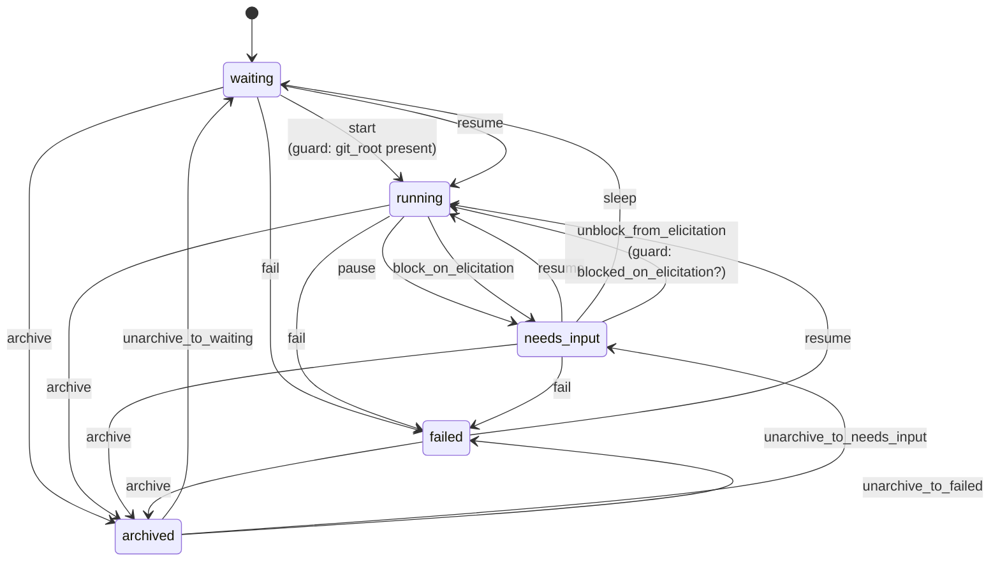

Every session is in exactly one of five states. The transitions between them are enforced by
AASM in `app/models/concerns/session_state_machine.rb`, and each one carries side effects that
are as important as the state change itself.

## The states

| State | DB value | Meaning |
| --- | --- | --- |
| `waiting` | 1 | Queued, or dormant awaiting a scheduled wake-up. The initial state. |
| `running` | 0 | An agent process is alive and a monitoring job owns it. |
| `needs_input` | 2 | The agent's turn ended, or it's blocked on an elicitation. This is your to-do list. |
| `failed` | 4 | Terminal error. Resumable. |
| `archived` | 3 | In the trash. Restorable until the clone is reaped. |

The integer values are load-bearing (they're the existing ActiveRecord enum). A sixth state,
`corrupted` (5), was removed — sessions now go to `failed` instead.

## The full machine


```mermaid
stateDiagram-v2
    [*] --> waiting

    waiting --> running: start<br/>(guard: git_root present)
    running --> needs_input: pause
    needs_input --> running: resume
    waiting --> running: resume
    failed --> running: resume
    needs_input --> waiting: sleep

    running --> needs_input: block_on_elicitation
    needs_input --> running: unblock_from_elicitation<br/>(guard: blocked_on_elicitation?)

    waiting --> failed: fail
    running --> failed: fail
    needs_input --> failed: fail

    waiting --> archived: archive
    running --> archived: archive
    needs_input --> archived: archive
    failed --> archived: archive

    archived --> waiting: unarchive_to_waiting
    archived --> needs_input: unarchive_to_needs_input
    archived --> failed: unarchive_to_failed
```

:::note[The old `docs/SESSION_STATE_MACHINE.md` was missing five of these]
It documented `start`, `sleep`, `pause`, `resume`, `fail`, and `archive`. It did not
document `block_on_elicitation`, `unblock_from_elicitation`, or the three `unarchive_to_*`
events. It also claimed you cannot archive a running session — you can; `archive` transitions
from `waiting`, `running`, `needs_input`, *and* `failed` (the UI exposes this as force-archiving
a stuck session).
:::

## The events, and what they actually do

### `start` — `waiting → running`

Guarded on `git_root` being present. Resets the elapsed-time counter and logs.

### `pause` — `running → needs_input`

Fired when the agent's turn ends (the process exits normally). This is the workhorse
transition, and it does seven things beyond changing status:

1. `warn_if_pr_goal_captured_no_url` — if the session's goal mentions a pull request and
   `custom_metadata["github_pull_request_urls"]` is still empty, write one `warning` log to the
   timeline. `GithubPrUrlHook` only records a PR it can see the session open, and an empty list is
   otherwise indistinguishable from "no PR to record" — see
   [transcript hooks](/extend/transcript-hooks/). Once per session, never raises.
2. `cleanup_running_job` — clears `running_job_id`.
3. `fire_ao_event_triggers("session_needs_input")` — wakes anything watching this session.
4. `enqueue_debounced_needs_input_push_notification` — see below.
5. `enqueue_session_inference_if_needed` — LLM-generates a title and category if still pending.
6. `enqueue_status_summary_refresh` — the **only** automatic trigger for the
   [Status summary](/sessions/status-summary/). The generator still refuses when the session has
   not moved since the last one, so a transition that added no transcript costs nothing.
7. `execute_pending_sleep` — if a wake-up was scheduled while the session was *running*, the
   sleep was deferred to here; now it fires.

Steps 3–6 are skipped for one kind of session: a **status-summary fork**, which is Zimmer's own
throwaway (marked in metadata by `SessionStatusSummaryGenerator::FORK_MARKER`). Its pause means its
one turn is finished, so it is harvested and archived instead of notifying anyone or landing in the
action queue.

The debounce is worth understanding. Sessions sometimes flap `running → needs_input →
running` between turns, and without debouncing every flap would push a notification. So the
push job is enqueued with a 60-second delay (`NEEDS_INPUT_DEBOUNCE`) carrying a monotonic
marker from `custom_metadata["needs_input_count"]`. If the session churns during the window,
the marker won't match and the deferred job no-ops.

### `resume` — `waiting | needs_input | failed → running`

Unguarded, deliberately. The preconditions for resuming — a clone on disk, a runtime
session id to resume into, a live process to reattach to — are established or validated by
`AgentSessionJob`, which recovers what it can and fails the session with a specific
`failure_reason` when it cannot. The state machine does not re-check them, so a resume you
ask for is a resume the job gets to attempt.
Clears a pile of stale state: MCP failure flags, the `paused_by` marker, the
`blocked_on_elicitation` marker, any `pending_sleep`, and, importantly, it
cancels pending one-time wake-up triggers targeting this session, so a scheduled wake
doesn't fire on a session you already resumed by hand.

### `sleep` — `needs_input → waiting`

The "wake me up later" path. The session goes dormant and a one-time schedule trigger will
resume it. If the wake-up is scheduled while the session is *running*,
`metadata["pending_sleep"] = true` is set and the actual transition happens on the next `pause`.

Agents reach this through the `wake_me_up_later` MCP tool, but Zimmer also uses it on its own
behalf: `AuthOutageParkService` parks a session here when the login pool runs dry, which is what
keeps a quota-blocked session out of the heartbeat sweep's reach. See
[Agent harness auth](/auth/harness/#when-the-pool-runs-dry).

### `block_on_elicitation` / `unblock_from_elicitation` — `running ⇄ needs_input`

This pair exists because an elicitation is *not* a turn ending. An MCP server made a
synchronous request and is blocked waiting for the human; the agent process is still alive.
So `block_on_elicitation` surfaces the session as `needs_input` (to get it on your homepage and
into the notification path) but does not call `cleanup_running_job` — killing
the process would break the round-trip.

A metadata marker (`blocked_on_elicitation`) distinguishes this from a real pause, and guards
the flip back.

:::caution[Stranded elicitation blocks are a real failure mode]
If the reactive unblock is missed — a swallowed `AASM::InvalidTransition` from a state race, or
the MCP server crashing mid-round-trip — the marker is left set with nothing to clear it, and
the session sits in `needs_input` showing a phantom "blocked on elicitation" forever.

`CleanupExpiredElicitationsJob` sweeps for this every 5 minutes and calls
`clear_stale_elicitation_block!`, which strips the marker and leaves the session
in `needs_input`; flipping it to `running` would create a phantom running session with no
monitoring job. A minutes-old stranded block has no live round-trip to resume into.
:::

### `fail` — `waiting | running | needs_input → failed`

Cleans up the running job, fires `session_failed` triggers, enqueues a push notification
that bypasses the per-session opt-in, and — like `pause` — enqueues a
[Status summary](/sessions/status-summary/) refresh. The reasoning behind the unconditional push:
by the time `fail!` fires, retries are already exhausted, so this is a final non-self-resolving
event. A silent status flip would be worse than an unwanted push.

A status-summary fork that fails is harvested (recording the failure on the source session's
summary) instead of notifying, exactly as on `pause`.

### `archive` — any state → `archived`

Sets `archived_at`, dismisses notifications, fires `session_archived` triggers, cleans up
triggers watching this session, and sets a trash expiry.

The clone is not deleted immediately. `DeferredCloneCleanupJob` runs after a short undo
window and then either deletes the clone (if it's clean) or preserves unpushed artifacts for
`TRASH_RETENTION_PERIOD`, which is `4.days`. `EmptyTrashJob` deletes them once that expires.

The session's [scratch directory](/sessions/spawning/) and prompt attachments are on the trash
schedule too, not the undo-window one: nothing can rebuild them from a remote the way a clone is
rebuilt, so they are kept for the whole time archive is undoable and reaped by `EmptyTrashJob`.
That is why a clean-clone session can still hold a `trash_after` — it is the deadline for whatever
is still retained, which is not always the clone. See
[how long scratch lasts](/limitations/#a-sessions-scratch-directory-survives-archive-but-only-for-the-trash-window).

:::danger[The Undo button doesn't work]
[Issue #12](https://github.com/tadasant/zimmer/issues/12): the archive `turbo_stream` response
never renders the flash toast, so there is no toast and no Undo affordance — even though the
`undo_archive` endpoint still works. The undo window is unusable from the UI.
:::

## Side effects fail silently, by design

Almost every callback in the state machine is wrapped in a bare `rescue` that logs and swallows:

```ruby
rescue => e
  Rails.logger.error "[SessionStateMachine] Failed to ..."
  # Don't raise - notification failures shouldn't block state transitions
end
```

This is a deliberate trade: a broken notification service should not be able to wedge a
session in `running`. The consequence is that cleanup can silently not happen while the state
still advances — an archived session whose trash expiry failed to set, a paused session whose
notification never fired. `StaleCloneCleanupJob` exists as the safety net for the clone case.

## Who else moves sessions around

The state machine is not the only actor:

- **`HeartbeatSweepJob`** (every 30s) re-nudges `needs_input` sessions with `heartbeat_enabled`
  by injecting a heartbeat prompt and resuming them. It skips sessions blocked on an
  elicitation or with pending enqueued messages — resuming those would spawn a second process.
- **`CleanupOrphanedSessionsJob`** (every 5 min) catches sessions marked `running` whose process
  is gone.
- **`ZombieReaperJob`** (every 5 min) reaps dead child processes that nothing is waiting on. It
  deliberately leaves alone any pid a live waiter has claimed — see
  [Background jobs](/operate/background-jobs/#the-zombie-reaper-only-takes-what-nobody-is-waiting-for).
  Reaping a pid the monitoring loop was waiting on used to drop the session into `needs_input`
  with no explanation, because the loop lost the exit status it needed to route through
  `handle_exit`.
- **`SessionRecoveryService`** handles hung and interrupted sessions on a best-effort basis;
  `SigtermRetryService` covers gracefully SIGTERM'd sessions (deploys) with a bounded retry
  ladder (`MAX_RETRIES = 3`); an abnormal signal death (SIGKILL from an OOM kill, SIGSEGV, …)
  is instead resumed by `ProcessLifecycleManager#handle_signal_death`
  (`MAX_SIGNAL_DEATH_RETRIES = 3`) — see [Spawning](/sessions/spawning/#when-the-process-exits).

## How a process actually gets terminated

Pausing, archiving, following up and recovery all end in the same place:
`ProcessTerminationService#terminate`, given the session's `process_pid`. It walks a ladder and
stops at the first rung that works.

1. **SIGTERM to the process group** (`-pid`). Agent children are spawned with `pgroup: true`, so
   this reaches the leader and every grandchild it started — MCP servers, `node`, `gh`.
2. **SIGTERM to the leader alone**, if the group could not be signalled (no such group, or not
   ours).
3. **SIGKILL**, group first and then the leader, if it is still alive after its SIGTERM grace.
4. **A group SIGKILL sweep**, once the leader is confirmed dead.

Two details are load-bearing.

**Liveness is answered by reaping, not by signal 0.** `Process.kill(0, pid)` succeeds for a child
of ours that has already exited — an unreaped child holds its pid as a zombie until someone waits
on it. So the service asks `waitpid(pid, WNOHANG)` instead: a status back means the child had
exited and is now collected, `nil` means it is genuinely still running, and `ECHILD` means it is
not our child, where signal 0 is the right answer and is used as the fallback. Once a pid is
reaped it is never probed again — it belongs to the OS and can be recycled.

Before this, every liveness check answered "still running" for a child that died on the first
SIGTERM: termination burned ~15–25s of `sleep` in a GoodJob thread, sent two redundant SIGTERMs
and two SIGKILLs, and then reported `:error` for a kill that had worked.

**The group SIGKILL sweep is deliberate.** Grandchildren are reparented to init when the leader
dies; nothing else cleans them up. They received the group SIGTERM in step 1, so the sweep gives
the group one more second to drain, then SIGKILLs it — and skips silently when the group is
already empty, which is the common case. A group we may not signal, or a sweep that fails, never
downgrades the result: the leader is dead either way, and that is what the caller acted on.

## Manual refresh

The dashboard's refresh controls are the human counterpart to those background actors. There
are four of them, and they all end up in `SessionsController`:

| Control | Action | Scope |
| --- | --- | --- |
| The per-card icon next to a session's status badge | `#refresh` | that one session |
| "Refresh all" in the header | `#refresh_all` | every non-archived session outside a frozen category |
| The icon in a category section header | `#refresh_category` | that category's non-archived sessions |
| The icon in the **Starred** group header | `#refresh_starred` | every non-archived favorited session |

`#refresh_starred` deliberately does *not* skip frozen categories the way `#refresh_all` does.
The Starred group renders every favorited session regardless of its category, so the button acts
on exactly the cards sitting under it — starring is a per-session opt-in that outranks the
category's parked flag.

The per-card icon is hidden for a `running` session. A running session is already streaming into
its card; there is nothing a refresh would tell you that the card does not.

### How the dashboard answers

Every mutating dashboard control — the four refresh buttons plus Trash, Undo, Restore, bulk
trash, Pause and the category moves — responds to a Turbo request with a Turbo Stream, not a
redirect. The stream replaces one element: `#flash`, the layout's single toast container
(`app/views/shared/_flash.html.erb`). The cards themselves are not in the response, because they
re-render on their own over the `sessions_index_individual` and `session_<id>_status` broadcast
channels. The redirect existed only to carry the message.

Two actions stream a card as well, because a broadcast cannot reach one:

- **Trash** removes the card it just archived, and streams the "Session moved to trash." toast
  carrying the **Undo** button. The toast needs the `#flash` target to land in — before that id
  existed, the card vanished with no way to undo it.
- **Undo** prepends the card back into the grid it belongs to (`#sessions_grid` for
  Uncategorized, `#category_grid_<id>` for a category). Its own restore broadcast is a `replace`,
  and there is nothing left in the DOM to replace.

`#unarchive` and `#pause` stream one more thing: the session page's own status badge and header
actions. `Session#broadcast_status_change` already pushes both over the cable, but a broadcast is
fire-and-forget and this whole change exists because a cable can be silently dead. The direct
reply to the user's click cannot be lost, so a status-changing action carries its chrome rather
than trusting the socket.

Every one of these actions keeps its `format.html` branch, which still redirects with a real
flash. That is what a non-Turbo client — and most of the controller test suite — gets.

The session detail page is on the same footing: it carries a `cable-reconnect` Stimulus
controller that watches each `<turbo-cable-stream-source>` for the `connected` attribute
turbo-rails sets and clears, and re-subscribes any source still dark after a grace window
(backing off up to 30s). It replaced a `<meta http-equiv="refresh">` that fired on a
five-second timing window whether or not the cable had actually dropped — and, being a
top-level navigation, dismissed the session drawer along with the user's place in it.
`Session#recently_recovered?` now only decides whether to *show* the recovery banner.

It does not replace `stream-visibility-recovery`, which still reloads the page — the two answer
different failures. A page that was hidden (backgrounded PWA, bfcache restore) and came back with
a dead socket has *missed content*, and re-subscribing would not bring it back, so that one
reloads and fires first (1.5s grace against cable-reconnect's 3s). A socket that dies while the
page stays visible has missed nothing, so cable-reconnect re-subscribes in place. What the meta
refresh contributed and nothing replaced was the *unconditional* reload, on elapsed time, whether
or not the cable had dropped at all.

What a refresh *does* depends on the session's state:

- `failed` → restart it (`#resume_failed_session`, or `restart_with_continue_prompt` in bulk).
- `needs_input` → in bulk, continue it, unless the user paused it by hand (`paused_by: "user"`).
- `waiting` → send the automated continue nudge (`AutomatedPrompts::SYSTEM_RECOVERY`), the same
  prompt every recovery path uses. See below.
- `running`, and any `waiting` session excluded below → re-read the transcript from disk.

### Refreshing a `waiting` session nudges it

A `waiting` session has no live process, so re-reading its transcript tells the user nothing.
What they want from "refresh" is for the session to get moving again, so `Session#continue_nudge_on_refresh?`
routes it through `restart_with_continue_prompt` instead.

Two kinds of `waiting` session are excluded, because for them a nudge would be wrong rather than
merely useless:

- **Never started** (`session_id` blank). There is no conversation to continue — the session is
  still queued and the spawn pipeline owns it.
- **Deliberately asleep** (`Session#awaiting_scheduled_wake?`). A one-time wake-up targeting this
  session that is still *ahead* of it — from `wake_me_up_later` or
  `wake_me_up_when_session_changes_state` — means the agent chose to sleep until a specific
  moment. Nudging it would fire the work early, and worse: `restart_with_continue_prompt` resumes
  the session, and `resume`'s `cancel_pending_one_time_wake_triggers` callback *consumes* the
  pending condition, so a premature refresh would delete the wake-up it was waiting on. If the
  trigger table can't be read, the session is treated as asleep, so a database error never wakes
  a sleeper.

Both excluded kinds fall through to the plain transcript refresh. The rule is identical for the
single-session icon and for all three bulk controls, so "refresh all starred" over a mix of
statuses does the right per-session thing.

:::note[An overdue wake-up is a stall, not sleep]
"Still ahead of it" is doing real work in that second bullet, and it is deliberately *narrower*
than what `cancel_pending_one_time_wake_triggers` consumes on resume.

A one-time schedule whose moment has already passed without firing — a stopped scheduler, a
GoodJob backlog, a crashed trigger job — describes a session that is **stuck**, which is exactly
the session refresh exists to rescue. Treating it as "asleep" would make refresh a no-op on the
one case that most needs it. So sleeping means *the scheduler has yet to reach it*, read through
the same `TriggerCondition#schedule_due?` the firing path uses. A session-scoped `ao_event` wake
has no time component — it fires whenever the watched session transitions — so an unfired one is
always still ahead.

The cancel-on-resume path keeps the broader reading, and should: once a session is resumed by
hand, an overdue wake-up firing later would land on an already-active session.
:::

Bulk refresh asks this about a whole set of candidates at once via
`Session.ids_awaiting_scheduled_wake`, which answers in one query rather than one per waiting
session.
